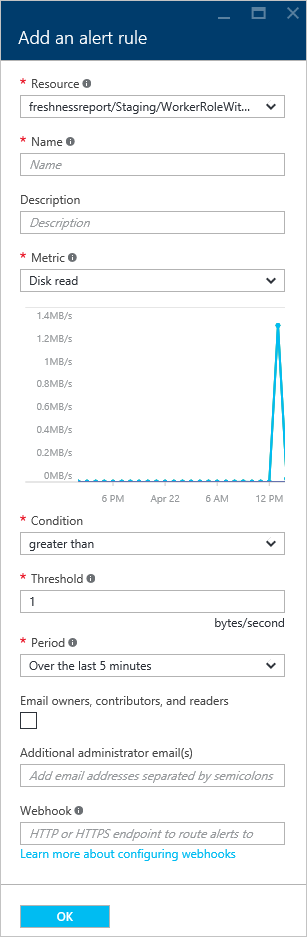

<properties 
    pageTitle="Come configurare un servizio cloud (portale) | Microsoft Azure" 
    description="Informazioni su come configurare i servizi cloud in Azure. Informazioni su come aggiornare la configurazione del servizio cloud e configurare l'accesso remoto al istanze del ruolo. Questi esempi vengono usate il portale di Azure." 
    services="cloud-services" 
    documentationCenter="" 
    authors="Thraka" 
    manager="timlt" 
    editor=""/>

<tags 
    ms.service="cloud-services" 
    ms.workload="tbd" 
    ms.tgt_pltfrm="na" 
    ms.devlang="na" 
    ms.topic="article" 
    ms.date="10/11/2016"
    ms.author="adegeo"/>

# Come configurare i servizi Cloud

> [AZURE.SELECTOR]
- [Portale di Azure](cloud-services-how-to-configure-portal.md)
- [Portale classica Azure](cloud-services-how-to-configure.md)

È possibile configurare le impostazioni di usate più frequente di un servizio cloud nel portale di Azure. In alternativa, se si desidera aggiornare direttamente i file di configurazione, scaricare un file di configurazione del servizio per aggiornare, quindi caricare il file aggiornato e aggiornare il servizio cloud con le modifiche di configurazione. In entrambi i casi, gli aggiornamenti di configurazione sono inseriti in tutte le istanze di ruolo.

È anche possibile gestire le istanze dei ruoli del servizio cloud o desktop remoto al loro.

Azure unico modo disponibilità servizio 99,95% durante gli aggiornamenti di configurazione se si dispone di almeno due istanze del ruolo per ogni ruolo. Che consente una macchina virtuale elaborare le richieste di client durante l'aggiornamento a altro. Per ulteriori informazioni, vedere [I contratti di servizio](https://azure.microsoft.com/support/legal/sla/).

## Modificare un servizio cloud

Dopo aver aperto il [portale di Azure](https://portal.azure.com/), passare al servizio cloud. Da qui è gestire molti aspetti. 

Verranno aperto collegamenti **Impostazioni** o **tutte le impostazioni di** backup e **l'Impostazioni** in cui è possibile modificare le **proprietà**, modificare la **configurazione**, gestire i **certificati**, il programma di installazione **regole di avviso**e gestire gli **utenti** che hanno accesso al servizio cloud.

>[AZURE.NOTE]
>Sistema operativo usato per il servizio cloud non possano essere modificato tramite il **portale di Azure**, è possibile modificare solo questa impostazione tramite il [portale classica Azure](http://manage.windowsazure.com/). Seguente è illustrata [di seguito](cloud-services-how-to-configure.md#update-a-cloud-service-configuration-file).

## Monitoraggio

È possibile aggiungere gli avvisi per il servizio cloud. Fare clic su **Impostazioni** > **Le regole di avviso** > **Aggiungi avviso**. 

Da qui è possibile impostare un avviso. Con casella di riepilogo a discesa **Mertic** è possibile impostare un avviso per i tipi di dati seguenti.

- Lettura del disco
- Scrittura su disco
- Rete in
- Fuori rete
- Percentuale di CPU 

### Configurare il monitoraggio da un riquadro metrico

Invece di usare **le impostazioni** > **Regole di avviso**, è possibile fare clic su uno dei riquadri metrici nella sezione **monitoraggio** della stessa e **servizio Cloud** .

Da qui è possibile personalizzare il grafico usato con il riquadro o aggiungere una regola di avviso.

## Riavviare il computer, reimage o desktop remoto

Al momento non è possibile configurare desktop remoto tramite il **portale di Azure**. Tuttavia, è possibile impostarlo tramite il [portale classica Azure](cloud-services-role-enable-remote-desktop.md), [PowerShell](cloud-services-role-enable-remote-desktop-powershell.md), o tramite [Visual Studio](../vs-azure-tools-remote-desktop-roles.md). 

Fare clic sull'istanza di servizio cloud.

Da e il che viene aperta uou possibile avviare una connessione desktop remoto, riavviare l'istanza o creare una nuova immagine in modalità remota (iniziare con una nuova immagine) l'istanza.

## Riconfigurare i cscfg

Potrebbe essere necessario riconfigurare si servizio cloud tramite il file di [configurazione del servizio (cscfg)](cloud-services-model-and-package.md#cscfg) . Prima di tutto è necessario scaricare il file cscfg, modificarlo e quindi caricarlo.

1. Fare clic sull'icona **Impostazioni** o del collegamento **tutte le impostazioni di** backup e **l'Impostazioni** .

    

2. Fare clic sull'elemento **configurazione** .

    

3. Fare clic sul pulsante **Scarica** .

    

4. Dopo aver aggiornato il file di configurazione del servizio, caricare e applicare gli aggiornamenti di configurazione:

     
    
5. Selezionare il file cscfg e fare clic su **OK**.

            
## Passaggi successivi

* Informazioni su come [distribuire un servizio cloud](cloud-services-how-to-create-deploy-portal.md).
* Configurare un [nome di dominio personalizzato](cloud-services-custom-domain-name-portal.md).
* [Gestire il servizio cloud](cloud-services-how-to-manage-portal.md).
* Configurare [i certificati ssl](cloud-services-configure-ssl-certificate-portal.md).