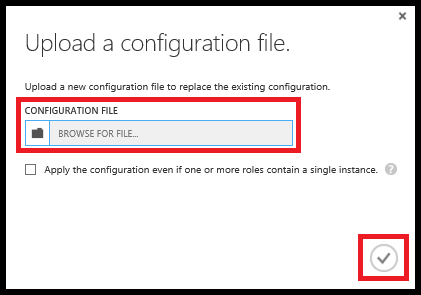

<properties 
    pageTitle="Come configurare un servizio cloud (portal classica) | Microsoft Azure" 
    description="Informazioni su come configurare i servizi cloud in Azure. Informazioni su come aggiornare la configurazione del servizio cloud e configurare l'accesso remoto al istanze del ruolo." 
    services="cloud-services" 
    documentationCenter="" 
    authors="Thraka" 
    manager="timlt" 
    editor=""/>

<tags 
    ms.service="cloud-services" 
    ms.workload="tbd" 
    ms.tgt_pltfrm="na" 
    ms.devlang="na" 
    ms.topic="article" 
    ms.date="10/11/2016"
    ms.author="adegeo"/>

# Come configurare i servizi Cloud

> [AZURE.SELECTOR]
- [Portale di Azure](cloud-services-how-to-configure-portal.md)
- [Portale classica Azure](cloud-services-how-to-configure.md)

È possibile configurare le impostazioni di usate più frequente di un servizio cloud nel portale di classica Azure. In alternativa, se si desidera aggiornare direttamente i file di configurazione, scaricare un file di configurazione del servizio per aggiornare, quindi caricare il file aggiornato e aggiornare il servizio cloud con le modifiche di configurazione. In entrambi i casi, gli aggiornamenti di configurazione sono inseriti in tutte le istanze di ruolo.

Portale di classica Azure consente inoltre di [abilitare connessione Desktop remoto per un ruolo di servizi Cloud Windows Azure](cloud-services-role-enable-remote-desktop.md)

Azure solo assicura la disponibilità del servizio di 99,95% durante l'aggiornamento configurazione se si dispone di almeno due istanze del ruolo per ogni ruolo. Che consente una macchina virtuale elaborare le richieste di client durante l'aggiornamento a altro. Per ulteriori informazioni, vedere [I contratti di servizio](https://azure.microsoft.com/support/legal/sla/).

## Modificare un servizio cloud

1. Nel [portale classica Azure](http://manage.windowsazure.com/), fare clic su **Servizi Cloud**, fare clic sul nome del servizio cloud e quindi fare clic su **Configura**.

    
    
    Nella pagina **Configura** , è possibile configurare il monitoraggio, aggiornare le impostazioni dei ruoli e scegliere il sistema operativo guest e la famiglia per istanze del ruolo. 

2. **Monitoraggio**, impostare il livello di monitoraggio dettagliato o minimo e configurare le stringhe di connessione di diagnostica necessari per il monitoraggio dettagliato.

3. Per i ruoli di servizio (raggruppati in base al ruolo), è possibile aggiornare le impostazioni seguenti:
    
    >**Impostazioni**  
    >Modificare i valori di varie impostazioni di configurazione che vengono specificati negli elementi *ConfigurationSettings* del file di configurazione (. cscfg) del servizio.
    >
    >**Certificati**  
    >Modificare l'identificazione personale del certificato in uso della crittografia SSL per un ruolo. Per modificare un certificato, è innanzitutto necessario caricare il nuovo certificato (nella pagina **certificati** ). Aggiornare l'identificazione personale nella stringa di certificato visualizzata nelle impostazioni di ruolo.

4. Nel **sistema operativo**, si possono modificare la versione per istanze del ruolo o nei sistemi operativi o scegliere **automatico** per abilitare gli aggiornamenti automatici della versione del sistema operativo corrente. Impostazioni del sistema operativo valide per i ruoli web ruoli e di lavoro, ma non influiscono macchine virtuali.

    Durante la distribuzione, la versione più recente del sistema operativo è installata su tutte le istanze di ruolo e i sistemi operativi vengono aggiornati automaticamente per impostazione predefinita. 
    
    Se è necessaria per il servizio cloud per l'esecuzione in una versione diversa del sistema operativo a causa dei requisiti di compatibilità nel codice, è possibile scegliere un sistema operativo e versione. Quando si sceglie una versione del sistema operativo specifico, vengono sospesi aggiornamenti automatici del sistema operativo per il servizio cloud. È necessario assicurarsi che i sistemi operativi ricevere aggiornamenti.
    
    Se si consentono di risolvere tutti i problemi di compatibilità con le app con la versione più recente del sistema operativo, è possibile abilitare gli aggiornamenti automatici del sistema operativo impostando la versione del sistema operativo su **automatico**. 
    
    

5. Per salvare le impostazioni di configurazione e inviarli a istanze del ruolo, fare clic su **Salva**. (Fare clic su **Annulla** per annullare le modifiche.) **Salvare** ed **eliminare** vengono aggiunti alla barra dei comandi dopo aver modificato un'impostazione.

## Aggiornare un file di configurazione del servizio cloud

1. Scaricare un file di configurazione di servizi di cloud (cscfg) con la configurazione corrente. Nella pagina **Configura** per il servizio cloud, fare clic su **Scarica**. Quindi fare clic su **Salva**o su **Salva con nome** per salvare il file.

2. Dopo aver aggiornato il file di configurazione del servizio, caricare e applicare gli aggiornamenti di configurazione:

    1. Nella pagina **Configura** , fare clic su **Carica**.
    
        
    
    2. Nel **file di configurazione**, utilizzare il **pulsante Sfoglia** per selezionare il file cscfg aggiornati.
    
    3. Se il servizio cloud contiene i ruoli una singola istanza, selezionare la casella di controllo **Applica configurazione anche se uno o più ruoli contengono una singola istanza** per abilitare gli aggiornamenti di configurazione per i ruoli continuare.
    
        A meno che non si definiscono almeno due istanze di ogni ruolo, Azure non garantisce almeno 99,95% disponibilità del servizio cloud durante gli aggiornamenti di configurazione del servizio. Per ulteriori informazioni, vedere [I contratti di servizio](https://azure.microsoft.com/support/legal/sla/).
    
    4. Fare clic su **OK** (segno di spunta). 

## Passaggi successivi

* Informazioni su come [distribuire un servizio cloud](cloud-services-how-to-create-deploy.md).
* Configurare un [nome di dominio personalizzato](cloud-services-custom-domain-name.md).
* [Gestire il servizio cloud](cloud-services-how-to-manage.md).
* [Abilitare connessione Desktop remoto per un ruolo di servizi Cloud Azure](cloud-services-role-enable-remote-desktop.md)
* Configurare [i certificati ssl](cloud-services-configure-ssl-certificate.md).
