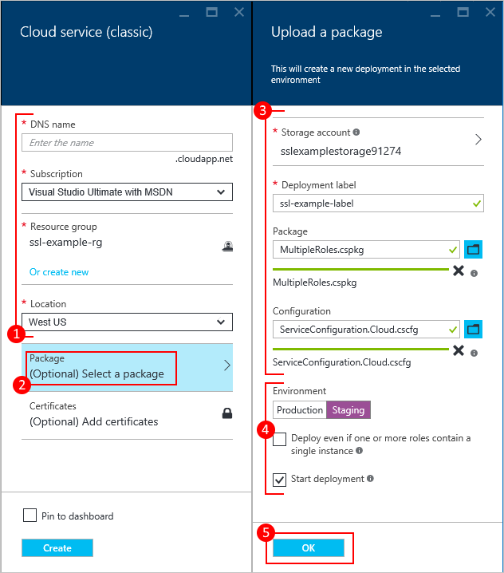

<properties
    pageTitle="Come creare e distribuire un servizio cloud | Microsoft Azure"
    description="Informazioni su come creare e distribuire un servizio cloud tramite il portale di Azure."
    services="cloud-services"
    documentationCenter=""
    authors="Thraka"
    manager="timlt"
    editor=""/>

<tags
    ms.service="cloud-services"
    ms.workload="tbd"
    ms.tgt_pltfrm="na"
    ms.devlang="na"
    ms.topic="article"
    ms.date="10/11/2016"
    ms.author="adegeo"/>

# Come creare e distribuire un servizio cloud

> [AZURE.SELECTOR]
- [Portale di Azure](cloud-services-how-to-create-deploy-portal.md)
- [Portale classica Azure](cloud-services-how-to-create-deploy.md)

Portale di Azure in due modi per creare e distribuire un servizio cloud: *Creare rapido* e *Personalizzato*.

In questo articolo viene spiegato come utilizzare il metodo di creazione rapida per creare un nuovo servizio cloud e quindi utilizzare **Carica** per caricare e distribuire un pacchetto di servizio cloud in Azure. Quando si usa questo metodo, il portale di Azure rende disponibili utili collegamenti per il completamento di tutte le richieste durante il lavoro. Se si è pronti per distribuire il servizio cloud quando si crea, è possibile eseguire entrambe contemporaneamente utilizzando personalizzate Create.

> [AZURE.NOTE] Se si intende pubblicare il servizio cloud da Visual Studio Team Services (VSTS), utilizzare Creazione rapida e quindi impostare la pubblicazione VSTS dalla Guida introduttiva di Azure o il dashboard. Per ulteriori informazioni, vedere [Delivery continua a Azure da utilizzando Visual Studio Team Services][TFSTutorialForCloudService], oppure vedere la Guida per la pagina **Avvio rapido** .

## Concetti
Per distribuire un'applicazione come servizio cloud in Azure sono necessari tre componenti:

- **Definizione di servizio**  
  File di definizione del servizio cloud (.csdef) consente di definire il modello dei servizi, tra cui il numero dei ruoli.

- **Configurazione del servizio**  
  Il file di configurazione del servizio cloud (cscfg) fornisce le impostazioni di configurazione per il cloud servizi e singoli ruoli, incluso il numero di istanze del ruolo.

- **Pacchetto di servizio**  
  Il pacchetto di servizio (cspkg) contiene il codice dell'applicazione e le configurazioni e file di definizione del servizio.

È possibile acquisire familiarità con questi e su come creare un pacchetto [di seguito](cloud-services-model-and-package.md).

## Preparare l'app
Prima di distribuire un servizio cloud, è necessario creare il pacchetto di servizio cloud (cspkg) da un file di configurazione del servizio cloud (cscfg) e il codice dell'applicazione. Azure SDK sono disponibili gli strumenti per la preparazione di questi file di distribuzione necessarie. È possibile installare il SDK dalla pagina [Download di Azure](https://azure.microsoft.com/downloads/) nella lingua in cui si preferisce sviluppare il codice dell'applicazione.

Caratteristiche di servizio cloud tre richiedono configurazioni speciali prima di esportare un pacchetto di servizio:

- Se si desidera distribuire un servizio cloud che utilizza Secure Sockets Layer (SSL) per la crittografia dei dati, [configurare l'applicazione](cloud-services-configure-ssl-certificate-portal.md#modify) per SSL.

- Se si desidera configurare le connessioni Desktop remoto per istanze del ruolo, [configurare i ruoli](cloud-services-role-enable-remote-desktop.md) per Desktop remoto. Può essere eseguita solo nel portale di classica.

- Se si desidera configurare dettagliato monitoraggio per il servizio cloud, abilitare Azure diagnostica per il servizio cloud. *Monitoraggio minima* (impostazione predefinita monitoraggio livello) utilizza contatori raccolti dai sistemi operativi host per istanze del ruolo (macchine virtuali). *Monitoraggio dettagliato* raccoglie le statistiche aggiuntive in base ai dati sulle prestazioni all'interno di istanze del ruolo per abilitare l'analisi attentamente problemi che possono verificarsi durante l'elaborazione dell'applicazione. Per scoprire come attivare la diagnostica Azure, vedere [attivazione diagnostica in Azure](cloud-services-dotnet-diagnostics.md).

Per creare un servizio cloud con le distribuzioni di ruoli web o ruoli di lavoro, è necessario [creare il pacchetto di servizio](cloud-services-model-and-package.md#servicepackagecspkg).

## Prima di iniziare

- Se non è stato installato Azure SDK, fare clic su **Installa Azure SDK** per aprire la [pagina Download Azure](https://azure.microsoft.com/downloads/)e quindi scaricare SDK per la lingua in cui si preferisce sviluppare il codice. (Sarà necessario un'opportunità per eseguire questa operazione in un secondo momento).

- Se tutte le istanze di ruolo richiedono un certificato, creare i certificati. Servizi cloud richiedono un file. pfx con una chiave privata. [Che è possibile caricare i certificati di Azure]() durante la creazione e distribuire il servizio cloud.

- Se si prevede di distribuire il servizio cloud a un gruppo di affinità, creare il gruppo di affinità. È possibile usare un gruppo di affinità per distribuire il servizio cloud e altri servizi Azure nella stessa posizione in un'area. È possibile creare il gruppo affinità nell'area di **reti** del portale di classica Azure, nella pagina **gruppi affinità** .

## Creare e distribuire

1. Accedere al [portale di Azure](https://portal.azure.com/).
2. Fare clic su **Nuovo > macchine virtuali di**e quindi scorrere verso il basso e fare clic su **Servizio Cloud**.

    

3. Nella parte inferiore della pagina di informazioni che viene visualizzato, fare clic su **Crea**. 
4. Nella nuova pala **Servizio Cloud** , immettere un valore per il **nome DNS**.
5. Creare un nuovo **Gruppo di risorse** o selezionarne uno esistente.
6. Selezionare un **percorso**.
7. Fare clic su **pacchetto**. Verrà aperto e il **caricamento di un pacchetto** . Compilare i campi obbligatori.  

     Se uno qualsiasi dei ruoli contiene una sola istanza, verificare **che la distribuzione anche se uno o più ruoli contengono una singola istanza** sia selezionata.

8. Assicurarsi che sia selezionata **la distribuzione di inizio** .
9. Fare clic su **OK** che verrà chiusa e il **caricamento di un pacchetto** .
10. Se non si dispone di tutti i certificati per aggiungere, fare clic su **Crea**.

    

## Caricare un certificato

Se il pacchetto di distribuzione è stato [configurato per l'uso dei certificati](cloud-services-configure-ssl-certificate-portal.md#modify), è possibile caricare il certificato ora.

1. Selezionare **i certificati**e scegliere il file. pfx del certificato SSL e il **componente certificati** e quindi specificare la **Password** per il certificato,
2. Fare clic su **Allega certificato**e quindi scegliere **OK** e il **componente certificati** .
3. Fare clic su **Crea** in e il **Servizio Cloud** . Quando la distribuzione ha raggiunto lo stato **Pronto** , è possibile passare alla procedura seguente.

    

## Verificare la distribuzione è stata completata correttamente

1. Fare clic su istanza del servizio cloud.

    Lo stato risulterà che il servizio sia **in esecuzione**.

2. In **Essentials**, fare clic sull' **URL del sito** per aprire il servizio cloud in un web browser.

    

[TFSTutorialForCloudService]: http://go.microsoft.com/fwlink/?LinkID=251796

## Passaggi successivi

* [Configurazione generale del servizio cloud](cloud-services-how-to-configure-portal.md).
* Configurare un [nome di dominio personalizzato](cloud-services-custom-domain-name-portal.md).
* [Gestire il servizio cloud](cloud-services-how-to-manage-portal.md).
* Configurare [i certificati ssl](cloud-services-configure-ssl-certificate-portal.md).