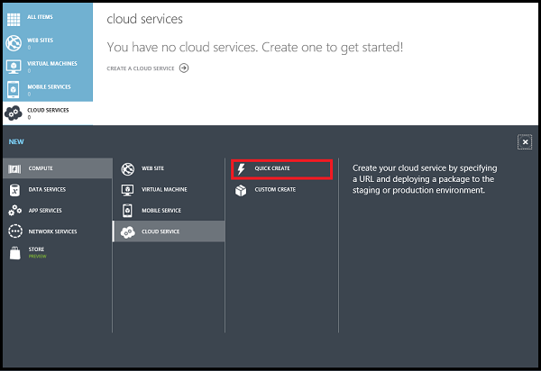
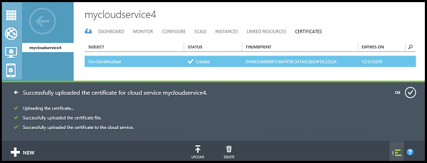

<properties
    pageTitle="Come creare e distribuire un servizio cloud | Microsoft Azure"
    description="Informazioni su come creare e distribuire un servizio cloud utilizzando il metodo veloce Create in Azure."
    services="cloud-services"
    documentationCenter=""
    authors="Thraka"
    manager="timlt"
    editor=""/>

<tags
    ms.service="cloud-services"
    ms.workload="tbd"
    ms.tgt_pltfrm="na"
    ms.devlang="na"
    ms.topic="article"
    ms.date="09/06/2016"
    ms.author="adegeo"/>

# Come creare e distribuire un servizio Cloud

> [AZURE.SELECTOR]
- [Portale di Azure](cloud-services-how-to-create-deploy-portal.md)
- [Portale classica Azure](cloud-services-how-to-create-deploy.md)

Il portale classico Azure in due modi per creare e distribuire un servizio cloud: **Creare rapido** e **Personalizzato**.

In questo argomento viene illustrato come utilizzare il metodo di creazione rapida per creare un nuovo servizio cloud e quindi utilizzare **Carica** per caricare e distribuire un pacchetto di servizio cloud in Azure. Quando si usa questo metodo, il portale classico Azure rende disponibili utili collegamenti per il completamento di tutte le richieste durante il lavoro. Se si è pronti per distribuire il servizio cloud quando si crea, è possibile eseguire entrambe contemporaneamente utilizzando **Personalizzate Create**.

> [AZURE.NOTE] Se si intende pubblicare il servizio cloud da Visual Studio Team Services (VSTS), utilizzare Creazione rapida e quindi impostare la pubblicazione VSTS da **Avvio rapido** o il dashboard. Per ulteriori informazioni, vedere [Delivery continua a Azure da utilizzando Visual Studio Team Services][TFSTutorialForCloudService], oppure vedere la Guida per la pagina **Avvio rapido** .

## Concetti
Tre componenti necessari per distribuire un'applicazione come servizio cloud in Azure:

- **Definizione di servizio**  
  File di definizione del servizio cloud (.csdef) consente di definire il modello dei servizi, tra cui il numero dei ruoli.

- **Configurazione del servizio**  
  Il file di configurazione del servizio cloud (cscfg) fornisce le impostazioni di configurazione per il cloud servizi e singoli ruoli, incluso il numero di istanze del ruolo.

- **Pacchetto di servizio**  
  Il pacchetto di servizio (cspkg) contiene il codice dell'applicazione e le configurazioni e file di definizione del servizio.
  
È possibile acquisire familiarità con questi e su come creare un pacchetto [di seguito](cloud-services-model-and-package.md).

## Preparare l'app
Prima di distribuire un servizio cloud, è necessario creare il pacchetto di servizio cloud (cspkg) da un file di configurazione del servizio cloud (cscfg) e il codice dell'applicazione. Azure SDK sono disponibili gli strumenti per la preparazione di questi file di distribuzione necessarie. È possibile installare il SDK dalla pagina [Download di Azure](https://azure.microsoft.com/downloads/) nella lingua in cui si preferisce sviluppare il codice dell'applicazione.

Caratteristiche di servizio cloud tre richiedono configurazioni speciali prima di esportare un pacchetto di servizio:

- Se si desidera distribuire un servizio cloud che utilizza Secure Sockets Layer (SSL) per la crittografia dei dati, [configurare l'applicazione](cloud-services-configure-ssl-certificate.md#step-2-modify-the-service-definition-and-configuration-files) per SSL.

- Se si desidera configurare le connessioni Desktop remoto per istanze del ruolo, [configurare i ruoli](cloud-services-role-enable-remote-desktop.md) per Desktop remoto.

- Se si desidera configurare dettagliato monitoraggio per il servizio cloud, abilitare Azure diagnostica per il servizio cloud. *Monitoraggio minima* (impostazione predefinita monitoraggio livello) utilizza contatori raccolti dai sistemi operativi host per istanze del ruolo (macchine virtuali). "Monitoraggio dettagliato * raccoglie le statistiche aggiuntive in base ai dati sulle prestazioni all'interno di istanze del ruolo per abilitare l'analisi attentamente problemi che possono verificarsi durante l'elaborazione dell'applicazione. Per scoprire come attivare la diagnostica Azure, vedere [Attivazione di diagnostica in Azure](cloud-services-dotnet-diagnostics.md).

Per creare un servizio cloud con le distribuzioni di ruoli web o ruoli di lavoro, è necessario [creare il pacchetto di servizio](cloud-services-model-and-package.md#servicepackagecspkg).

## Prima di iniziare

- Se non è stato installato Azure SDK, fare clic su **Installa Azure SDK** per aprire la [pagina Download Azure](https://azure.microsoft.com/downloads/)e quindi scaricare SDK per la lingua in cui si preferisce sviluppare il codice. (Sarà necessario un'opportunità per eseguire questa operazione in un secondo momento).

- Se tutte le istanze di ruolo richiedono un certificato, creare i certificati. Servizi cloud richiedono un file. pfx con una chiave privata. Come creare e distribuire il servizio cloud, è possibile [caricare i certificati in Azure](cloud-services-configure-ssl-certificate.md#step-3-upload-a-certificate) .

- Se si prevede di distribuire il servizio cloud a un gruppo di affinità, creare il gruppo di affinità. È possibile usare un gruppo di affinità per distribuire il servizio cloud e altri servizi Azure nella stessa posizione in un'area. È possibile creare il gruppo affinità nell'area di **reti** del portale di classica Azure, nella pagina **gruppi affinità** .

## Procedura: creare un servizio cloud usando creazione rapida

1. Nel [portale classica Azure](http://manage.windowsazure.com/), fare clic su **Nuovo**>**calcolare**>**Servizio Cloud**>**Creazione rapida**.

    

2. **URL**, immettere un nome di sottodominio da utilizzare nell'URL pubblico per accedere al servizio cloud nelle distribuzioni di produzione. Formato dell'URL per le distribuzioni di produzione: http://*myURL*. cloudapp.net.

3. Nell' **area o un gruppo di affinità**, selezionare l'area geografica o il gruppo di affinità per distribuire il servizio cloud per. Selezionare un gruppo di affinità se si desidera distribuire il servizio cloud nella stessa posizione come gli altri servizi Azure in un'area.

4. Fare clic su **Crea servizio Cloud**.

    

    È possibile monitorare lo stato del processo nell'area del messaggio nella parte inferiore della finestra.

    Verrà visualizzata l'area di **Servizi Cloud** , con il nuovo servizio cloud visualizzato. Quando lo stato è impostato su creato, è stata completata la creazione di servizi cloud.

    

## Procedura: caricare un certificato per un servizio cloud

1. Nel [portale classica Azure](http://manage.windowsazure.com/), fare clic su **Servizi Cloud**, fare clic sul nome del servizio cloud e quindi fare clic su **certificati**.

    

2. Fare clic su **Carica un certificato** o **caricare**.

3. Nel **File**, utilizzare il **pulsante Sfoglia** per selezionare il certificato (file. pfx).

4. Nella casella **Password**immettere la chiave privata per il certificato.

5. Fare clic su **OK** (segno di spunta).

    

    È possibile controllare lo stato di avanzamento del processo di caricamento nell'area del messaggio riportato di seguito. Dopo avere completato il caricamento, il certificato viene aggiunto alla tabella. Nell'area del messaggio, fare clic su OK per chiudere il messaggio.

    

## Procedura: distribuire un servizio cloud

1. Nel [portale classica Azure](http://manage.windowsazure.com/), fare clic su **Servizi Cloud**, fare clic sul nome del servizio cloud e quindi fare clic su **Dashboard**.

2. Fare clic su **Carica una nuova distribuzione di produzione** o **caricare**.

3. Nell' **etichetta di distribuzione**, immettere un nome per la nuova distribuzione - ad esempio MyCloudServicev4.

3. Nel **pacchetto**, utilizzare il **pulsante Sfoglia** per selezionare il file di pacchetto di servizio (cspkg) da utilizzare.

4. Nella **configurazione**, utilizzare il **pulsante Sfoglia** per selezionare il file di configurazione di servizio (. cscfg) da utilizzare.

5. Se il servizio cloud includerà i ruoli una sola istanza, selezionare la casella di controllo **Distribuisci anche se uno o più ruoli contengono una singola istanza** per consentire la distribuzione continuare.

    Azure può garantire 99,95% accesso al servizio cloud durante l'aggiornamento del servizio e della manutenzione solo se ogni ruolo dispone di almeno due istanze. Se necessario, è possibile aggiungere istanze del ruolo aggiuntive nella pagina **scala** dopo la distribuzione di servizio cloud. Per ulteriori informazioni, vedere [I contratti di servizio](https://azure.microsoft.com/support/legal/sla/).

6. Fare clic su **OK** (segno di spunta) per iniziare la distribuzione di servizio cloud.

    

    È possibile monitorare lo stato della distribuzione nell'area del messaggio. Fare clic su OK per nascondere il messaggio.

    

## Verificare la distribuzione è stata completata correttamente

1. Fare clic su **Dashboard**.

    Lo stato risulterà che il servizio sia **in esecuzione**.

2. In **visualizzazione rapida**, fare clic sull'URL del sito per aprire il servizio cloud in un web browser.

    

[TFSTutorialForCloudService]: cloud-services-continuous-delivery-use-vso.md
 
## Passaggi successivi

* [Configurazione generale del servizio cloud](cloud-services-how-to-configure.md).
* Configurare un [nome di dominio personalizzato](cloud-services-custom-domain-name.md).
* [Gestire il servizio cloud](cloud-services-how-to-manage.md).
* Configurare [i certificati ssl](cloud-services-configure-ssl-certificate.md).