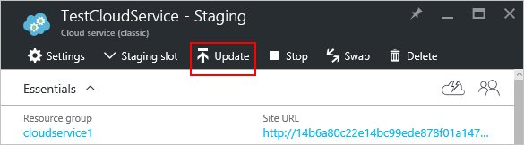

<properties 
    pageTitle="Attività comuni di gestione di servizio cloud | Microsoft Azure" 
    description="Informazioni sulla gestione dei servizi cloud nel portale di Azure. Questi esempi vengono usate il portale di Azure." 
    services="cloud-services" 
    documentationCenter="" 
    authors="Thraka" 
    manager="timlt" 
    editor=""/>

<tags 
    ms.service="cloud-services" 
    ms.workload="tbd" 
    ms.tgt_pltfrm="na" 
    ms.devlang="na" 
    ms.topic="article" 
    ms.date="08/02/2016"
    ms.author="adegeo"/>

# Come gestire servizi Cloud

> [AZURE.SELECTOR]
- [Portale di Azure](cloud-services-how-to-manage-portal.md)
- [Portale classica Azure](cloud-services-how-to-manage.md)

Nell'area di **Servizi Cloud (classica)** del portale di Azure viene gestito il servizio cloud. In questo articolo vengono illustrati alcuni comuni azioni da eseguire durante la gestione dei servizi cloud. Che include l'aggiornamento, eliminazione, proporzioni dei caratteri e promuovere una distribuzione a fasi di produzione.

Ulteriori informazioni su come ridurre il servizio cloud sono disponibili [qui](cloud-services-how-to-scale-portal.md).

## Procedura: aggiornare un ruolo di servizio cloud o la distribuzione

Se è necessario aggiornare il codice dell'applicazione del servizio cloud, scegliere **Aggiorna** e il servizio cloud. È possibile aggiornare un singolo ruolo o tutti i ruoli. Per aggiornare, è possibile caricare un nuovo pacchetto di servizio o un file di configurazione del servizio.

1. Nel [portale di Azure][], selezionare il servizio cloud che si desidera aggiornare. Questo passaggio verrà visualizzata e di istanza il servizio cloud.

2. In e il pulsante **Aggiorna** .

    

3. Aggiornare la distribuzione con un nuovo file di pacchetto di servizio (cspkg) e i file di configurazione del servizio (. cscfg).

    

4. **Se lo si desidera** aggiornare l'etichetta di distribuzione e l'account di archiviazione. 

5. Se i ruoli solo un'istanza di ruolo, selezionare la **distribuzione anche se uno o più ruoli contengono una singola istanza** per abilitare l'aggiornamento continuare. 

    Azure può garantire la disponibilità dei servizi 99,95% durante l'aggiornamento del servizio cloud solo se ogni ruolo dispone di almeno due istanze del ruolo (macchine virtuali). Con due istanze di ruolo, una macchina virtuale elaborerà le richieste dei client mentre gli altri viene aggiornato.

6. Selezionare **Avvia distribuzione** per l'aggiornamento applicato dopo il caricamento del pacchetto.

7. Fare clic su **OK** per avviare l'aggiornamento del servizio.

## Procedura: scambiare distribuzioni per alzare di livello una distribuzione a fasi di produzione

Quando si decide di distribuire una nuova versione di un servizio cloud, secondario e testare la nuova versione nel proprio ambiente di gestione temporanea servizio cloud. Consente di **scambio di** passare all'URL per il quale due distribuzioni sono trattate e promuovere una nuova versione di produzione. 

È possibile scambiare distribuzioni dalla pagina **Servizi Cloud** o il dashboard.

1. Nel [portale di Azure][], selezionare il servizio cloud che si desidera aggiornare. Questo passaggio verrà visualizzata e di istanza il servizio cloud.

2. In e il, fare clic sul pulsante **Scambia** .

    

3. Verrà visualizzata la richiesta di conferma seguenti.

    

4. Dopo aver verificato le informazioni di distribuzione, fare clic su **OK** per sostituire le distribuzioni.

    Lo scambio di distribuzione avviene rapidamente perché la sola opzione che consente di modificare l'indirizzo IP virtuale (VIP) per le distribuzioni.

    Per salvare i costi di elaborazione, è possibile eliminare la distribuzione di gestione temporanea dopo aver verificato che la distribuzione di produzione funziona come previsto.

## Procedura: creare un collegamento una risorsa in un servizio cloud

Portale di Azure non collegare risorse come il portale classico Azure corrente. In alternativa, è possibile implementare risorse aggiuntive allo stesso gruppo di risorse usato dal servizio Cloud.

## Procedura: eliminare distribuzioni e un servizio cloud

È possibile eliminare un servizio cloud, è necessario eliminare ogni distribuzione esistente.

Per salvare i costi di elaborazione, è possibile eliminare la distribuzione di gestione temporanea dopo aver verificato che la distribuzione di produzione funziona come previsto. Vengono addebitate per i costi di elaborazione per le istanze di ruolo distribuita che sono state interrotte.

Utilizzare la procedura seguente per eliminare una distribuzione o il servizio cloud. 

1. Nel [portale di Azure][], selezionare il servizio cloud che si desidera eliminare. Questo passaggio verrà visualizzata e di istanza il servizio cloud.

2. In e il clic sul pulsante **Elimina** .

    

3. È possibile eliminare il servizio cloud intera selezionando **un servizio Cloud e le distribuzioni** o scegliere la **distribuzione di produzione** o la **distribuzione di gestione temporanea**.

     

4. Fare clic sul pulsante **Elimina** nella parte inferiore.

5. Per eliminare il servizio cloud, fare clic su **servizio cloud Elimina**. Quindi, alla richiesta di conferma, fare clic su **Sì**.

> [AZURE.NOTE]
> Quando un servizio cloud viene eliminato e il monitoraggio dettagliato è configurato, è necessario eliminare manualmente i dati dal proprio account di archiviazione. Per informazioni su dove trovare le tabelle metriche, vedere [questo](cloud-services-how-to-monitor.md) articolo.

[Portale di Azure]: https://portal.azure.com

## Passaggi successivi

* [Configurazione generale del servizio cloud](cloud-services-how-to-configure-portal.md).
* Informazioni su come [distribuire un servizio cloud](cloud-services-how-to-create-deploy-portal.md).
* Configurare un [nome di dominio personalizzato](cloud-services-custom-domain-name-portal.md).
* Configurare [i certificati ssl](cloud-services-configure-ssl-certificate-portal.md).