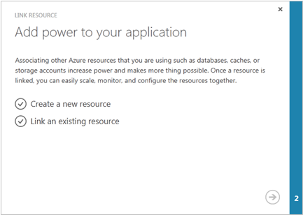

<properties 
    pageTitle="Attività di gestione di comuni cloud servizio (classico) | Microsoft Azure" 
    description="Informazioni sulla gestione dei servizi cloud nel portale di classica Azure." 
    services="cloud-services" 
    documentationCenter="" 
    authors="Thraka" 
    manager="timlt" 
    editor=""/>

<tags 
    ms.service="cloud-services" 
    ms.workload="tbd" 
    ms.tgt_pltfrm="na" 
    ms.devlang="na" 
    ms.topic="article" 
    ms.date="08/10/2016"
    ms.author="adegeo"/>

# Come gestire servizi Cloud

> [AZURE.SELECTOR]
- [Portale di Azure](cloud-services-how-to-manage-portal.md)
- [Portale classica Azure](cloud-services-how-to-manage.md)

Nell'area di **Servizi Cloud** del portale di classica Azure, è possibile aggiornare un ruolo di servizio o una distribuzione, promuovere una distribuzione a fasi di produzione, collegare le risorse del servizio cloud, in modo che è possibile vedere le dipendenze delle risorse e ridimensionare le risorse insieme ed eliminare un servizio cloud o una distribuzione.

## Procedura: aggiornare un ruolo di servizio cloud o la distribuzione

Se è necessario aggiornare il codice dell'applicazione del servizio cloud, usare **aggiornare** nella pagina **istanze** , pagina **Servizi Cloud** o dashboard. È possibile aggiornare un singolo ruolo o tutti i ruoli. È necessario caricare un nuovo servizio pacchetto e file di configurazione del servizio.

1. Nel [portale classica Azure](https://manage.windowsazure.com/), nella pagina **istanze** , dashboard, di **Servizi Cloud** pagina o fare clic su **Aggiorna**.

    

2. Nell' **etichetta di distribuzione**, immettere un nome per identificare la distribuzione (ad esempio mycloudservice4). L'etichetta di distribuzione in **avvio veloce** sono disponibili nel dashboard.

3. Nel **pacchetto**, utilizzare il **pulsante Sfoglia** per caricare il file di pacchetto di servizio (cspkg).

4. Nella **configurazione**, utilizzare il **pulsante Sfoglia** per caricare il file di configurazione del servizio (. cscfg).

5. **Ruolo**, selezionare **tutto** se si desidera aggiornare tutti i ruoli di servizio cloud. Per eseguire un aggiornamento singolo ruolo, selezionare il ruolo che si desidera aggiornare. Anche se si seleziona un ruolo specifico per l'aggiornamento, gli aggiornamenti nel file di configurazione del servizio vengono applicati a tutti i ruoli.

6. Se l'aggiornamento viene modificato il numero di ruoli o le dimensioni di un ruolo, selezionare la casella di controllo **Consenti Aggiorna se le dimensioni di ruolo o il numero di ruoli cambia** per abilitare l'aggiornamento continuare. 

    Tenere presente che se si cambia la dimensione di un ruolo (le dimensioni di una macchina virtuale che ospita un'istanza del ruolo) o il numero dei ruoli, ogni istanza del ruolo (macchina virtuale) deve essere ricreata l'immagine e tutti i dati locali andranno persi.

7. Se i ruoli di servizio solo un'istanza di ruolo, selezionare l' **aggiornamento anche se uno o più ruolo contengono una casella di controllo singola istanza** per abilitare l'aggiornamento continuare. 

    Azure può garantire la disponibilità dei servizi 99,95% durante l'aggiornamento del servizio cloud solo se ogni ruolo dispone di almeno due istanze del ruolo (macchine virtuali). Che consente una macchina virtuale elaborare le richieste di client durante l'aggiornamento a altro.

8. Fare clic su **OK** (segno di spunta) per avviare l'aggiornamento del servizio.

## Procedura: scambiare distribuzioni per alzare di livello una distribuzione a fasi di produzione

Consente di **sostituire** promuovere una distribuzione di gestione temporanea di un servizio cloud di produzione. Quando si decide di distribuire una nuova versione di un servizio cloud, è possibile installare e testare la nuova versione nel proprio ambiente di gestione temporanea servizio cloud, mentre i clienti utilizza la versione corrente di produzione. Quando si è pronti per promuovere la nuova versione di produzione, è possibile utilizzare **Scambia** per passare all'URL per il quale sono trattate due distribuzioni. 

È possibile scambiare distribuzioni dalla pagina **Servizi Cloud** o il dashboard.

1. Nel [portale classica Azure](https://manage.windowsazure.com/), fare clic su **Servizi Cloud**.

2. Nell'elenco dei servizi cloud, fare clic su servizio cloud per selezionarlo.

3. Fare clic su **Scambia**.

    Verrà visualizzata la richiesta di conferma seguenti.

    

4. Dopo aver verificato le informazioni di distribuzione, fare clic su **Sì** per sostituire le distribuzioni.

    Lo scambio di distribuzione avviene rapidamente perché la sola opzione che consente di modificare l'indirizzo IP virtuale (VIP) per le distribuzioni.

    Per salvare i costi di elaborazione, è possibile eliminare la distribuzione nell'ambiente di gestione temporanea quando si è sicuri che nuova distribuzione di produzione funzioni correttamente.

## Procedura: creare un collegamento una risorsa in un servizio cloud

Per mostrare il cloud dipendenze del servizio nelle altre risorse, è possibile collegare un'istanza di Database SQL Azure o un account di archiviazione per il servizio cloud. È possibile collegare e scollegare le risorse della pagina **Risorse collegate** e quindi monitorare il loro utilizzo nel dashboard di servizio cloud. Se un account di archiviazione collegato include monitoraggio attivato, è possibile monitorare le richieste di totale nel dashboard di servizio cloud.

Utilizzare **collegamento** per collegare un account nuovo o esistente Database SQL istanza o lo spazio di archiviazione del servizio cloud. È quindi possibile ridimensionare il database con il ruolo di servizio cloud in uso è la pagina **scala** . (Un account di archiviazione ridimensiona automaticamente come utilizzo aumenta.) Per ulteriori informazioni, vedere [come ridimensionare un servizio Cloud e le risorse collegate](cloud-services-how-to-scale.md). 

È anche possibile monitorare, gestire e ridurre il database nel nodo **database** del portale di classica Azure. 

"Collegamento" delle risorse in questo caso, l'app non connettersi alla risorsa. Se si crea un nuovo database mediante **collegamento**, è necessario aggiungere le stringhe di connessione al codice dell'applicazione e quindi aggiornare il servizio cloud. È anche necessario aggiungere le stringhe di connessione se l'app utilizza risorse in un account di archiviazione collegato.

La procedura seguente descrive come collegare una nuova istanza di Database SQL, distribuita in un nuovo server di Database SQL, in un servizio cloud.

### Collegare un'istanza del Database di SQL in un servizio cloud

1. Nel [portale classica Azure](http://manage.windowsazure.com/), fare clic su **Servizi Cloud**. Fare clic sul nome del servizio cloud per aprire il dashboard.

2. Fare clic su **risorse collegate**.

    Verrà visualizzata la pagina di **Risorse collegate** .

    

3. Fare clic su **collegamento una risorsa** o **collegamento**.

    Verrà avviata la procedura guidata **Collegamento risorsa** .

    

4. Fare clic su **Crea una nuova risorsa** o un **collegamento a una risorsa esistente**.

5. Scegliere il tipo di risorsa da collegare. Nel [portale classica Azure](http://manage.windowsazure.com/), fare clic su **Database SQL**. (Portale classico di Azure anteprima non supporta il collegamento di un account di archiviazione in un servizio cloud.)

6. Per completare la configurazione del database, seguire le istruzioni nella Guida all'area del **Database SQL** del portale di classica Azure.

    È possibile eseguire l'avanzamento dell'operazione di collegamento nell'area del messaggio.

    

    Al termine il collegamento, è possibile monitorare lo stato della risorsa collegata nel dashboard di servizio cloud. Per informazioni sul ridimensionamento di un Database SQL collegato, vedere [come ridimensionare un servizio Cloud e le risorse collegate](cloud-services-how-to-scale.md).

### Scollegare una risorsa collegata

1. Nel [portale classica Azure](http://manage.windowsazure.com/), fare clic su **Servizi Cloud**. Fare clic sul nome del servizio cloud per aprire il dashboard.

2. Fare clic su **Risorse collegata**e quindi selezionare la risorsa.

3. Fare clic su **Scollega**. Alla richiesta di conferma fare clic su **Sì** .

    Scollegare un Database SQL non ha alcun effetto sul database o la connessione dell'applicazione al database. È ancora possibile gestire il database nell'area di **Database SQL** di Azure portal classica.

## Procedura: eliminare distribuzioni e un servizio cloud

È possibile eliminare un servizio cloud, è necessario eliminare ogni distribuzione esistente.

Per salvare i costi di elaborazione, è possibile eliminare la distribuzione di gestione temporanea dopo aver verificato che la distribuzione di produzione funziona come previsto. Sono i costi di elaborazione fatturato per istanze del ruolo anche se non è in esecuzione un servizio cloud.

Utilizzare la procedura seguente per eliminare una distribuzione o il servizio cloud. 

1. Nel [portale classica Azure](http://manage.windowsazure.com/), fare clic su **Servizi Cloud**.

2. Selezionare il servizio cloud e quindi fare clic su **Elimina**. (Per selezionare un servizio cloud senza aprire il dashboard, fare clic in un punto qualsiasi tranne il nome della voce di servizio cloud.)

    Se si dispone di una distribuzione di produzione o gestione temporanea, si verrà visualizzato un menu di opzioni simile a quella riportata di seguito nella parte inferiore della finestra. È possibile eliminare il servizio cloud, è necessario eliminare qualsiasi distribuzione esistente.

    

3. Per eliminare una distribuzione, fare clic su **Elimina la distribuzione di produzione** o **distribuzione di gestione temporanea**. Quindi, alla richiesta di conferma, fare clic su **Sì**. 

4. Se si prevede di eliminare il servizio cloud, ripetere il passaggio 3, se necessario, eliminare alla distribuzione di altri.

5. Per eliminare il servizio cloud, fare clic su **servizio cloud Elimina**. Quindi, alla richiesta di conferma, fare clic su **Sì**.

> [AZURE.NOTE]
> Se il monitoraggio dettagliato è configurato per il servizio cloud, Azure non elimina i dati di monitoraggio dal proprio account di archiviazione quando si elimina il servizio cloud. È necessario eliminare manualmente i dati. Per informazioni su dove trovare le tabelle metriche, vedere "come: accesso dettagliato il monitoraggio dei dati nel portale classica Azure" nella pagina [relativa ai servizi Cloud Monitor](cloud-services-how-to-monitor.md).

## Passaggi successivi

 * [Configurazione generale del servizio cloud](cloud-services-how-to-configure.md).
* Informazioni su come [distribuire un servizio cloud](cloud-services-how-to-create-deploy.md).
* Configurare un [nome di dominio personalizzato](cloud-services-custom-domain-name.md).
* Configurare [i certificati ssl](cloud-services-configure-ssl-certificate.md).
