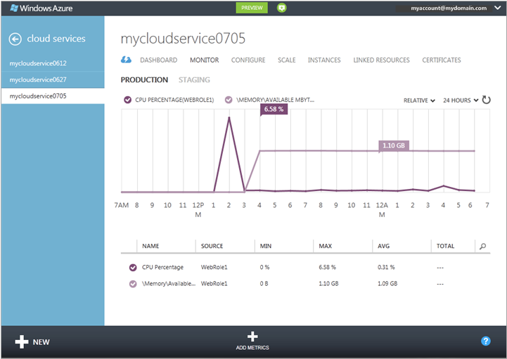
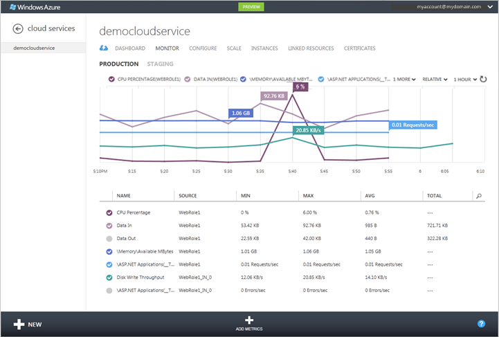

<properties 
    pageTitle="Come monitorare un servizio cloud | Microsoft Azure" 
    description="Informazioni su come eseguire il monitoraggio servizi cloud tramite il portale classico Azure." 
    services="cloud-services" 
    documentationCenter="" 
    authors="rboucher" 
    manager="timlt" 
    editor=""/>

<tags 
    ms.service="cloud-services" 
    ms.workload="tbd" 
    ms.tgt_pltfrm="na" 
    ms.devlang="na" 
    ms.topic="article" 
    ms.date="08/04/2015" 
    ms.author="robb"/>


# <a name="how-to-monitor-cloud-services"></a>Come monitorare i servizi Cloud

[AZURE.INCLUDE [disclaimer](../../includes/disclaimer.md)]

È possibile monitorare `key` metriche delle prestazioni per i servizi cloud nel portale di classica Azure. È possibile impostare il livello di monitoraggio per minimo e dettagliato per ogni ruolo di servizio e personalizzare il monitoraggio Visualizza. Dettagliato monitoraggio vengono memorizzati in un account di archiviazione, è possibile accedere di fuori del portale. 

Visualizza monitoraggio nel portale di classica Azure è configurabile. È possibile scegliere le metriche che si desidera monitorare nell'elenco metriche nella pagina **Monitor** e sarà possibile scegliere quale metriche per tracciare nei grafici metriche nella pagina **Monitor** e dashboard. 

## <a name="concepts"></a>Concetti

Per impostazione predefinita, monitoraggio minima è disponibile per un nuovo servizio cloud utilizzando contatori raccolti dal sistema operativo host per le istanze di ruoli (macchine virtuali). Metrica minima è limitata alla percentuale di CPU, per dati, dati fuori, velocità di lettura su disco e velocità di scrittura su disco. Se si configura il monitoraggio dettagliato, è possibile ricevere le statistiche aggiuntive in base ai dati sulle prestazioni in macchine virtuali (istanze del ruolo). Metrica dettagliata Abilita analisi più dettagliata dei problemi che si verificano durante le operazioni dell'applicazione.

Per impostazione predefinita contatore di prestazioni da istanze del ruolo campionati e trasferiti dall'istanza ruolo intervalli 3 minuti. Quando si abilita il monitoraggio dettagliato, i dati del contatore prestazioni sono aggregati per ogni istanza del ruolo e tra le istanze di ruolo per ogni ruolo intervalli di 5 minuti, ore 1 e 12 ore. Dati aggregati viene eliminati dopo 10 giorni.

Dopo aver attivato il monitoraggio dettagliato, i dati di monitoraggio aggregati vengono archiviati in tabelle nell'account di archiviazione. Per attivare il monitoraggio dettagliato per un ruolo, è necessario configurare una stringa di connessione di diagnostica collegata all'account di archiviazione. È possibile utilizzare gli account di archiviazione diverse per i diversi ruoli.

Si noti che abilita il monitoraggio dettagliato aumentare i costi di spazio di archiviazione relativi all'archiviazione dei dati, i trasferimenti di dati e transazioni di archiviazione. Monitoraggio minime non richiede un account di archiviazione. I dati per le metriche esposti a livello di monitoraggio minimo non sono archiviati nel proprio account di archiviazione, anche se è impostato il livello di monitoraggio dettagliato.


## <a name="how-to-configure-monitoring-for-cloud-services"></a>Procedura: configurare il monitoraggio per i servizi cloud

Usare le procedure seguenti per configurare il monitoraggio dettagliato o minima nel portale di classica Azure. 

### <a name="before-you-begin"></a>Prima di iniziare

- Creare un account di archiviazione per archiviare i dati di monitoraggio. È possibile utilizzare gli account di archiviazione diverse per i diversi ruoli. Per ulteriori informazioni, vedere la Guida per **Gli account di archiviazione**o informazioni su [come creare un Account di archiviazione](/manage/services/storage/how-to-create-a-storage-account/).

- Attivare la diagnostica Azure per i ruoli di servizio cloud. Vedere [configurazione di diagnostica per i servizi Cloud](https://msdn.microsoft.com/library/azure/dn186185.aspx#BK_EnableBefore).

Assicurarsi che la stringa di connessione di diagnostica sia presenta nella configurazione di ruolo. Non è possibile attivare il monitoraggio dettagliato fino a quando non si attiva diagnostica Azure e include una stringa di connessione di diagnostica nella configurazione di ruolo.   

> [AZURE.NOTE] Progetti con destinazione Azure SDK 2.5 non include automaticamente la stringa di connessione di diagnostica nel modello di progetto. Per i progetti, è necessario aggiungere manualmente la stringa di connessione di diagnostica per la configurazione dei ruoli.

**Aggiungere manualmente la stringa di connessione diagnostica alla configurazione dei ruoli**

1. Aprire il progetto di servizio Cloud in Visual Studio
2. Fare doppio clic sul **ruolo** per aprire la finestra di progettazione di ruolo e selezionare la scheda **Impostazioni**
3. Cercare un'impostazione denominata **Microsoft.WindowsAzure.Plugins.Diagnostics.ConnectionString**. 
4. Se questa impostazione non è presenta fare quindi clic sul pulsante **Aggiungi impostazione** per aggiungere la configurazione e modificare il tipo per la nuova impostazione in **ConnectionString**
5. Impostare il valore di stringa di connessione di facendo clic sul pulsante **…** . Verrà aperta una finestra di dialogo che consente di selezionare un account di archiviazione.

    

### <a name="to-change-the-monitoring-level-to-verbose-or-minimal"></a>Per modificare il livello di monitoraggio dettagliato o minima

1. Nel [portale classica Azure](https://manage.windowsazure.com/), aprire la pagina di **configurazione** per la distribuzione di servizio cloud.

2. Nel **livello**, fare clic su **dettagliato** o **minima**. 

3. Fare clic su **Salva**.

Dopo aver attivato il monitoraggio dettagliato, è necessario avviare vedono i dati di monitoraggio nel portale di classica Azure all'interno dell'ora.

I dati non elaborati e dati aggregati monitoraggio sono archiviati in account di archiviazione nelle tabelle qualificato mediante l'ID di distribuzione per i ruoli. 

## <a name="how-to-receive-alerts-for-cloud-service-metrics"></a>Procedura: ricevere avvisi per le metriche di servizio cloud

È possibile ricevere avvisi in base al servizio cloud monitoraggio metriche. Nella pagina di **Gestione dei servizi** del portale di classica Azure, è possibile creare una regola per attivare un avviso quando si sceglie l'unità di misura metriche raggiunge un valore specificato. È anche possibile scegliere per la posta elettronica inviata quando viene generato l'avviso. Per ulteriori informazioni, vedere [come: ricevere notifiche di avviso e gestire le regole di avviso in Azure](http://go.microsoft.com/fwlink/?LinkId=309356).

## <a name="how-to-add-metrics-to-the-metrics-table"></a>Procedura: aggiungere metriche alla tabella metriche

1. Nel [portale classica Azure](http://manage.windowsazure.com/), aprire la pagina **Monitor** per il servizio cloud.

    Per impostazione predefinita, la tabella metriche consente di visualizzare un sottoinsieme di metriche disponibili. L'illustrazione mostra le metriche dettagliato predefinito per un servizio cloud, è limitato al contatore delle prestazioni Memoria\Mbyte disponibili con dati aggregati a livello di ruolo. Consente di **Aggiungere metriche** per selezionare statistiche aggiuntive di aggregazione e livello di ruolo per monitorare nel portale di classica Azure.

    
 
2. Per aggiungere metriche alla tabella metriche:

    1. Fare clic su **Aggiungi metriche** per aprire **Scegliere metriche**, illustrato di seguito.

        La prima unità di misura metriche disponibili viene espansa per visualizzare le opzioni disponibili. Per ogni unità di misura metriche, l'opzione superiore Visualizza dati monitoraggio aggregati per tutti i ruoli. Inoltre, è possibile scegliere singoli ruoli per visualizzare i dati per.

        

    2. Per selezionare il formato per visualizzare

        - Fare clic sulla freccia in giù dalla metrica per espandere le opzioni di monitoraggio.
        - Selezionare la casella di controllo per ogni opzione monitoraggio che si desidera visualizzare.

        È possibile visualizzare fino a 50 metriche descritti nella tabella metriche.

        > [AZURE.TIP] Eseguire il monitoraggio dettagliato, l'elenco di metriche può contenere decine di metriche. Per visualizzare una barra di scorrimento, passare il mouse sul lato destro della finestra di dialogo. Per filtrare l'elenco, fare clic sull'icona di ricerca e immettere il testo nella casella di ricerca, come illustrato di seguito.
    
        


3. Dopo aver selezionato la metrica, fare clic su OK (segno di spunta).

    Metrica selezionata vengono aggiunti alla tabella metriche come illustrato di seguito.

    

 
4. Per eliminare una metrica dalla tabella metriche, fare clic su unità di misura metriche per selezionarlo e quindi fare clic su **Elimina unità di misura metriche**. (Solo vedere **Eliminazione di unità di misura metriche** quando si dispone di una metrica selezionata).

### <a name="to-add-custom-metrics-to-the-metrics-table"></a>Per aggiungere metriche personalizzate alla tabella metriche

**Dettagliato** monitoraggio livello comprende un elenco di metriche predefiniti che è possibile monitorare nel portale. Oltre a questi è possibile monitorare le metriche personalizzate o contatori definiti dall'applicazione tramite il portale.

I passaggi seguenti presuppongono che si hanno attivato il monitoraggio a livello di **dettaglio** e dispone di configurazione dell'applicazione per raccogliere e trasferire contatori personalizzati. 

Per visualizzare i contatori personalizzati nel portale è necessario aggiornare la configurazione nel contenitore di controlli tampone:
 
1. Aprire il contenitore di controlli tampone blob nell'account di archiviazione di diagnostica. È possibile utilizzare Visual Studio o altre soluzioni di archiviazione per eseguire questa operazione.

    

2. Passare il percorso di blob utilizzando il modello **RoleName/DeploymentId/RoleInstance** per trovare la configurazione dell'istanza del ruolo. 

    
3. Scaricare il file di configurazione dell'istanza del ruolo e aggiornare in modo da includere qualsiasi contatori personalizzati. Per eseguire il monitoraggio *di scrittura del disco byte/sec* per l' *unità C* , ad esempio aggiungere quanto segue nodo **PerformanceCounters\Subscriptions**

    ```xml
    <PerformanceCounterConfiguration>
    <CounterSpecifier>\LogicalDisk(C:)\Disk Write Bytes/sec</CounterSpecifier>
    <SampleRateInSeconds>180</SampleRateInSeconds>
    </PerformanceCounterConfiguration>
    ```
4. Salvare le modifiche e caricare il file di configurazione nella stessa posizione sovrascrivere il file esistente nel blob.
5. Passare alla modalità dettagliata nella configurazione del portale classica Azure. Se ci si trova già in modalità dettagliata è necessario attivare e disattivare minimo e tornare al dettagliato.
6. Contatore delle prestazioni personalizzato ora sarà disponibile nella finestra di dialogo **Aggiungi metriche** . 

## <a name="how-to-customize-the-metrics-chart"></a>Procedura: personalizzare il grafico metriche

1. Nella tabella metriche, selezionare il formato fino a 6 per tracciare nel grafico metriche. Per selezionare una metrica, fare clic sulla casella di controllo sul lato sinistro. Per rimuovere una metrica dal grafico metriche, deselezionare la casella di controllo corrispondente nella tabella metriche.

    Quando si seleziona metriche descritti nella tabella metriche, le metriche vengono aggiunti al grafico metriche. Su uno schermo stretto, un elenco a discesa **n ulteriori** contiene intestazioni metrica che non è possibile adattare la visualizzazione.

 
2. Per passare dalla visualizzazione relativi valori (valore finale solo per ogni unità di misura metriche) e assoluto (asse Y visualizzato), selezionare relativo o assoluto nella parte superiore del grafico.

    

3. Per modificare l'intervallo di tempo Visualizza grafico metriche, selezionare 1 ora, 24 ore o 7 giorni nella parte superiore del grafico.

    

    Nel grafico metriche dashboard, il metodo per tracciare metriche è diverso. È disponibile un insieme standard di metriche e metriche vengono aggiunti o rimossi selezionando l'intestazione metrica.

### <a name="to-customize-the-metrics-chart-on-the-dashboard"></a>Per personalizzare il grafico metriche nel dashboard

1. Aprire il dashboard per il servizio cloud.

2. Aggiungere o rimuovere metriche dal grafico:

    - Per rappresentare una nuova metrica, selezionare la casella di controllo per la metrica nelle intestazioni di grafico. Su uno schermo stretto, fare clic sulla freccia per **??metrics *n*** per tracciare una metrica che non è possibile visualizzare l'area dell'intestazione di grafico.

    - Per eliminare una metrica viene tracciata del grafico, deselezionare la casella di controllo dalla relativa intestazione.

3. Alternare **relativi** e **assoluti** consente di visualizzare.

4. Scegliere un'ora, 24 ore o 7 giorni di dati da visualizzare.

## <a name="how-to-access-verbose-monitoring-data-outside-the-azure-classic-portal"></a>Procedura: accesso dettagliato il monitoraggio dei dati nel portale classica Azure

Dati di monitoraggio dettagliati vengono archiviati in tabelle nella finestra account di archiviazione che specificano per ogni ruolo. Per ogni servizio cloud, sei tabelle vengono create per il ruolo. Per ogni vengono create due tabelle (5 minuti, ore 1 e 12 ore). Una di queste tabelle archivia le aggregazioni a livello di ruolo; altra tabella archivia le aggregazioni per le istanze di ruolo. 

I nomi delle tabelle disponibili nel formato seguente:

```
WAD*deploymentID*PT*aggregation_interval*[R|RI]Table
```

dove:

- *deploymentID* è GUID assegnato alla distribuzione di servizio cloud

- *aggregation_interval* = 5 M, 1H o 12 H

- livello di ruolo aggregazioni = R

- aggregazioni per le istanze di ruolo = RI

Ad esempio, le tabelle seguenti da archiviare dettagliati monitoraggio dati aggregati 1 ore:

```
WAD8b7c4233802442b494d0cc9eb9d8dd9fPT1HRTable (hourly aggregations for the role)

WAD8b7c4233802442b494d0cc9eb9d8dd9fPT1HRITable (hourly aggregations for role instances)
```
