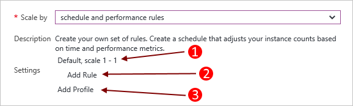
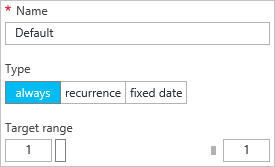
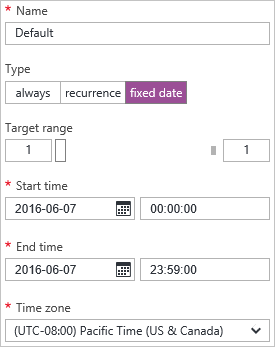

<properties
    pageTitle="Automatico ridimensionare un servizio cloud nel portale di | Microsoft Azure"
    description="Informazioni su come utilizzare il portale per configurare le regole di scala automatico per un ruolo web servizio cloud o un ruolo di lavoro in Azure."
    services="cloud-services"
    documentationCenter=""
    authors="Thraka"
    manager="timlt"
    editor=""/>

<tags
    ms.service="cloud-services"
    ms.workload="tbd"
    ms.tgt_pltfrm="na"
    ms.devlang="na"
    ms.topic="article"
    ms.date="09/06/2016"
    ms.author="adegeo"/>

# Come un servizio cloud di adattamento automatico

> [AZURE.SELECTOR]
- [Portale di Azure](cloud-services-how-to-scale-portal.md)
- [Portale classica Azure](cloud-services-how-to-scale.md)

È possibile impostare condizioni per un ruolo di lavoro di servizio cloud che attivano una scala avanti o indietro operazione. Le condizioni per il ruolo possono essere basate sul CPU, disco o carico di rete del ruolo. È inoltre possibile impostare un conditation in base a una coda di messaggi o le unità di misura metriche di un'altra risorsa Azure associata all'abbonamento.

>[AZURE.NOTE] In questo articolo è incentrato sui ruoli web e lavoro servizio Cloud. Quando si crea una macchina virtuale (classico) direttamente, questo viene ospitato in un servizio cloud. È possibile ridimensionare una macchina virtuale standard di associazione con un [set di disponibilità](../virtual-machines/virtual-machines-windows-classic-configure-availability.md) e manualmente loro attivare o disattivare.

## Considerazioni

Prima di configurare proporzioni dei caratteri per l'applicazione, è necessario considerare le seguenti informazioni:

- Proporzioni dei caratteri viene influenzato dall'utilizzo di base. Maggiore istanze del ruolo usare più core. È possibile ridimensionare un'applicazione solo entro il limite di core per l'abbonamento. Ad esempio, se l'abbonamento ha un limite di venti core e si esegue un'applicazione con due medie dimensioni cloud services (un totale di quattro core), è possibile scalare solo le altre distribuzioni di servizio cloud nell'abbonamento di 16 core. Per ulteriori informazioni sulle dimensioni, vedere [Le dimensioni del servizio Cloud](cloud-services-sizes-specs.md) .

- È possibile ridimensionare in base a una determinata soglia messaggio coda. Per ulteriori informazioni sull'utilizzo di code, vedere [come utilizzare il servizio di archiviazione coda](../storage/storage-dotnet-how-to-use-queues.md).

- È anche possibile ridimensionare altre risorse associate all'abbonamento.

- Per abilitare la disponibilità dell'applicazione, è necessario assicurarsi che venga distribuito con due o più istanze del ruolo. Per ulteriori informazioni, vedere [I contratti di servizio](https://azure.microsoft.com/support/legal/sla/).

## Scala in cui si trova

Dopo aver selezionato il servizio cloud, è necessario disporre e il servizio cloud visibile.

1. Scegliere il nome del servizio cloud e il servizio cloud, nel riquadro **ruoli e le istanze** .   
**Importante**: assicurarsi di selezionare il ruolo di servizio cloud, non all'istanza di ruolo di sotto del ruolo.

    

2. Selezionare il riquadro di **ridimensionamento** .

    

## Ridimensionamento automatico

È possibile configurare le impostazioni di scala per un ruolo con due modalità **manuale** o **automatico**. Manuale come previsto, impostare il conteggio delle istanze assoluto. Tuttavia, automatica consente di set di regole che determinano come e di quale entità è necessario ridimensionare.

Impostare l'opzione **Ridimensiona in base** alle **regole pianificazione e le prestazioni**.

1. Un profilo esistente.
2. Aggiungere una regola per il profilo padre.
3. Aggiungere un altro profilo.

Selezionare **Aggiungi profilo**. Il profilo determina la modalità che si desidera utilizzare per la scala: **sempre**, **ricorrenza**, **data fissa**.

Dopo aver configurato il profilo e le regole, selezionare l'icona **Salva** nella parte superiore.

#### Profilo

Il profilo imposta istanze minime e massime per la scala, e anche quando l'intervallo di scala è attivo.

* **Sempre**

    Mantenere sempre l'intervallo di istanze disponibili.  

    
    
* **Ricorrenza**

    Scegliere un set di giorni della settimana da ridimensionare.

    
    
* **Data fissa**

    Intervallo di date fisso per ridimensionare il ruolo.

    

Dopo aver configurato il profilo, selezionare il pulsante **OK** nella parte inferiore della stessa e profilo.

#### Regola

Le regole vengono aggiunti a un profilo e rappresentano una condizione che attiverà la scala. 

Trigger regola si basa su una metrica del servizio cloud (utilizzo della CPU, attività del disco o attività di rete) a cui è possibile aggiungere un valore condizionale. È inoltre possibile impostare trigger in base a una coda di messaggi o le unità di misura metriche di un'altra risorsa Azure associata all'abbonamento.

Dopo avere configurato la regola, selezionare il pulsante **OK** nella parte inferiore della stessa e regola.

## Tornare alla modifica manuale delle proporzioni

Passare alle [impostazioni della scala](#where-scale-is-located) e impostare l'opzione **Ridimensiona in base** a **un conteggio delle istanze immesso manualmente**.

Verrà così rimossa il ridimensionamento automatico dal ruolo e quindi è possibile impostare il conteggio delle istanze direttamente. 

1. L'opzione della scala (manuale o automatica).
2. Un ruolo istanza dispositivo di scorrimento per impostare le istanze di scalare a.
3. Istanze del ruolo di scalare a.

Dopo aver configurato le impostazioni della scala, selezionare l'icona **Salva** nella parte superiore.

