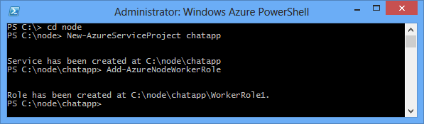

<properties 
    pageTitle="Applicazione Node utilizzando Socket.io | Microsoft Azure" 
    description="Informazioni su come utilizzare socket.io in un'applicazione di Node ospitata in Azure." 
    services="cloud-services" 
    documentationCenter="nodejs" 
    authors="rmcmurray" 
    manager="wpickett" 
    editor=""/>

<tags 
    ms.service="cloud-services" 
    ms.workload="tbd" 
    ms.tgt_pltfrm="na" 
    ms.devlang="nodejs" 
    ms.topic="article" 
    ms.date="08/11/2016" 
    ms.author="robmcm"/>

# Creare un'applicazione di Chat Node con Socket.IO in un servizio Cloud Azure

Socket.IO consente la comunicazione in tempo reale tra tra il server Node e i clienti. In questa esercitazione verrà descritto l'hosting un socket. Applicazione di chat in Azure basata su IO. Per ulteriori informazioni sulla Socket.IO, vedere <http://socket.io/>.

Schermata dell'applicazione completata è inferiore a:

![Una finestra del browser con il servizio ospitato su Azure][completed-app]  

## Prerequisiti

Verificare che siano presenti i seguenti prodotti e le versioni per completare l'esempio in questo articolo:

* Installare [Visual Studio 2013](https://www.visualstudio.com/en-us/downloads/download-visual-studio-vs.aspx)
* Installare [Node](https://nodejs.org/download/)
* Installare [Python versione 2.7.10](https://www.python.org/)

## Creare un progetto di servizio Cloud

La procedura seguente crea il progetto di servizio cloud che ospita l'applicazione Socket.IO.

1. Dal **Menu Start** o **Schermata Start**, eseguire una ricerca per **Windows PowerShell**. Infine, mouse **Windows PowerShell** e scegliere **Esegui come amministratore**.

    ![Icona di PowerShell Azure][powershell-menu]

2. Creare una directory denominata **c:\\nodo**. 
 
        PS C:\> md node

3. Passare alla directory di **c:\\nodo** directory
 
        PS C:\> cd node

4. Immettere i comandi seguenti per creare una nuova soluzione denominata **chatapp** e un ruolo di lavoro denominato **WorkerRole1**:

        PS C:\node> New-AzureServiceProject chatapp
        PS C:\Node> Add-AzureNodeWorkerRole

    Verrà visualizzato il seguente risposta:

    

## Scaricare l'esempio di Chat

Per questo progetto, verrà usata l'esempio di chat dal [repository Socket.IO GitHub]. Per scaricare l'esempio e aggiungerlo al progetto che è stato creato in precedenza, procedere come segue.

1.  Creare una copia locale del repository tramite il pulsante **duplicato** . È anche possibile utilizzare il pulsante **ZIP** per scaricare il progetto.

    ![Una finestra del browser visualizzazione https://github.com/LearnBoost/socket.io/tree/master/examples/chat, con l'icona di download ZIP evidenziato][chat-example-view]

3.  Esplorare la struttura di directory dell'archivio locale fino a quando non si arriva al **esempi\\chat** directory. Copiare il contenuto della directory per il **c:\\nodo\\chatapp\\WorkerRole1** directory creata in precedenza.

    ![Esplora risorse, visualizzare il contenuto degli esempi inclusi\\directory chat estratti dall'archivio][chat-contents]

    Gli elementi evidenziati nella schermata precedente sono i file copiati i **esempi\\chat** directory

4.  Nel **c:\\nodo\\chatapp\\WorkerRole1** directory, eliminare il file **server.js** e quindi rinominarlo **app.js** in **server.js**. Consente di rimuovere il file **server.js** predefinito creato in precedenza tramite il cmdlet **Aggiungi AzureNodeWorkerRole** e sostituito con il file dell'applicazione dell'esempio chat.

### Modificare Server.js e installare moduli

Prima di testare l'applicazione nell'emulatore di Azure, è necessario apportare alcune modifiche minori. Il file server.js, procedere come segue:

1.  Aprire il file **server.js** in Visual Studio o qualsiasi editor di testo.

2.  Individuare la sezione **dipendenze modulo** all'inizio del server.js e modificare la riga contenente poi **= require('.. //.. LIB//socket.IO')** a **poi = require('socket.io')** come illustrato di seguito:

        var express = require('express')
        , stylus = require('stylus')
        , nib = require('nib')
        //, sio = require('..//..//lib//socket.io'); //Original
        , sio = require('socket.io');                //Updated

3.  Per garantire che l'applicazione in ascolto sulla porta corretta, aprire server.js nel blocco note o l'editor preferito e quindi modificare la riga seguente sostituendo **3000** con **process.env.port** , come illustrato di seguito:

        //app.listen(3000, function () {            //Original
        app.listen(process.env.port, function () {  //Updated
          var addr = app.address();
          console.log('   app listening on http://' + addr.address + ':' + addr.port);
        });

Dopo il salvataggio delle modifiche **server.js**, utilizzare la procedura seguente per installare moduli necessari e quindi verificare l'applicazione nell'emulatore Azure:

1.  Utilizzo di **PowerShell di Azure**, passare alla directory di **c:\\nodo\\chatapp\\WorkerRole1** directory e usare il comando seguente per installare i moduli necessari per questa applicazione:

        PS C:\node\chatapp\WorkerRole1> npm install

    Verrà installato con i moduli presenti nel file package.json. Al termine dell'esecuzione del comando, è necessario vedere output simile al seguente:

    ![L'output del npm installare comando][The-output-of-the-npm-install-command]

4.  Poiché in questo esempio originariamente una parte dell'archivio Socket.IO GitHub e direttamente a cui fa riferimento la libreria Socket.IO percorso relativo, Socket.IO riferimento non presente nel file package.json in modo che sarà necessario installare mediante il comando seguente:

        PS C:\node\chatapp\WorkerRole1> npm install socket.io --save

### Verificare e distribuire

1.  Avviare l'emulatore mediante il comando seguente:

        PS C:\node\chatapp\WorkerRole1> Start-AzureEmulator -Launch

2.  Aprire un browser e passare a **http://127.0.0.1**.

3.  Quando si apre la finestra del browser, immettere un nome alternativo e quindi tasto INVIO.
    In questo caso tutti è possibile inviare messaggi come un soprannome specifico. Per verificare il funzionamento di più utenti, aprire finestre del browser aggiuntive utilizzando lo stesso URL e immettere i nomi alternativi diversi.

    

3.  Dopo aver provato l'applicazione, interrompere l'emulatore mediante il comando seguente:

        PS C:\node\chatapp\WorkerRole1> Stop-AzureEmulator

4.  Per distribuire un'applicazione di Azure, utilizzare il cmdlet **AzureServiceProject pubblica** . Per esempio:

        PS C:\node\chatapp\WorkerRole1> Publish-AzureServiceProject -ServiceName mychatapp -Location "East US" -Launch

    > [AZURE.IMPORTANT] Assicurarsi di usare un nome univoco, in caso contrario che non viene eseguito il processo di pubblicazione. Al termine di distribuzione, il browser aprire e passare al servizio distribuito.
    > 
    > Se si riceve un messaggio di errore che indica che il nome dell'abbonamento fornito non esiste nel profilo importato pubblica, è necessario scaricare e importare il profilo di pubblicazione per l'abbonamento prima della distribuzione di Azure. Vedere la sezione **distribuzione dell'applicazione Azure** di [compilare e distribuire un'applicazione di Node a un servizio Cloud di Azure](https://azure.microsoft.com/develop/nodejs/tutorials/getting-started/)

    ![Una finestra del browser con il servizio ospitato su Azure][completed-app]

    > [AZURE.NOTE] Se si riceve un messaggio di errore che indica che il nome dell'abbonamento fornito non esiste nel profilo importato pubblica, è necessario scaricare e importare il profilo di pubblicazione per l'abbonamento prima della distribuzione di Azure. Vedere la sezione **distribuzione dell'applicazione Azure** di [compilare e distribuire un'applicazione di Node a un servizio Cloud di Azure](https://azure.microsoft.com/develop/nodejs/tutorials/getting-started/)

L'applicazione è in esecuzione in Azure e può inoltrare i messaggi chat tra diversi clienti utilizzando Socket.IO.

> [AZURE.NOTE] Per semplicità, in questo esempio è limitato alla chat tra gli utenti connessi alla stessa istanza. Questo significa che se il servizio cloud crea due istanze del ruolo di lavoro, gli utenti solo sarà possibile comunicare via chat con altri utenti connessi alla stessa istanza di ruolo di lavoro. Per ridimensionare l'applicazione per l'uso di più istanze di ruolo, è possibile utilizzare una tecnologia come Bus di servizio per condividere lo stato dell'archivio Socket.IO nelle varie istanze. Per esempi, vedere gli esempi di utilizzo servizio Bus code e gli argomenti in [Azure SDK per repository GitHub Node](https://github.com/WindowsAzure/azure-sdk-for-node).

##Passaggi successivi

In questa esercitazione è stato illustrato come creare un'applicazione di base chat ospitata in un servizio Cloud di Azure. Per informazioni su come pubblicare l'applicazione di un sito Web di Azure, vedere [creare un'applicazione di Chat Node con Socket.IO in un sito Web di Azure][chatwebsite].

Per ulteriori informazioni, vedere anche il [Centro per sviluppatori Node](/develop/nodejs/).

  [chatwebsite]: /develop/nodejs/tutorials/website-using-socketio/

  [Azure SLA]: http://www.windowsazure.com/support/sla/
  [Azure SDK for Node.js GitHub repository]: https://github.com/WindowsAzure/azure-sdk-for-node
  [completed-app]: ./media/cloud-services-nodejs-chat-app-socketio/socketio-10.png
  [Azure SDK for Node.js]: https://www.windowsazure.com/develop/nodejs/
  [Node.js Web Application]: https://www.windowsazure.com/develop/nodejs/tutorials/getting-started/
  [Socket.IO GitHub archivio]: https://github.com/LearnBoost/socket.io/tree/0.9.14
  [Azure Considerations]: #windowsazureconsiderations
  [Hosting the Chat Example in a Worker Role]: #hostingthechatexampleinawebrole
  [Summary and Next Steps]: #summary
  [powershell-menu]: ./media/cloud-services-nodejs-chat-app-socketio/azure-powershell-start.png

  [chat example]: https://github.com/LearnBoost/socket.io/tree/master/examples/chat
  [chat-example-view]: ./media/cloud-services-nodejs-chat-app-socketio/socketio-22.png
  
  
  [chat-contents]: ./media/cloud-services-nodejs-chat-app-socketio/socketio-5.png
  [The-output-of-the-npm-install-command]: ./media/cloud-services-nodejs-chat-app-socketio/socketio-7.png
  [The output of the Publish-AzureService command]: ./media/cloud-services-nodejs-chat-app-socketio/socketio-9.png
  
 
