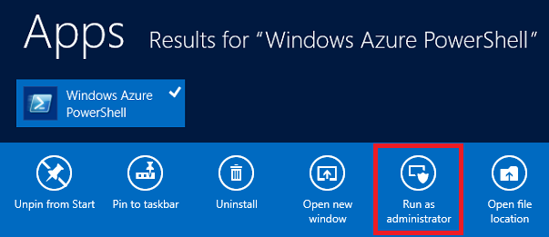

<properties 
    pageTitle="Web App con Express (Node) | Microsoft Azure" 
    description="Esercitazione in cui si basa sull'esercitazione di servizi cloud e viene illustrato come utilizzare il modulo Express." 
    services="cloud-services" 
    documentationCenter="nodejs" 
    authors="rmcmurray" 
    manager="wpickett" 
    editor=""/>

<tags 
    ms.service="cloud-services" 
    ms.workload="tbd" 
    ms.tgt_pltfrm="na" 
    ms.devlang="nodejs" 
    ms.topic="article" 
    ms.date="08/11/2016" 
    ms.author="robmcm"/>

# Creare un'applicazione web Node mediante Express in un servizio Cloud di Azure

Node include un numero minimo di funzionalità in fase di esecuzione core.
Gli sviluppatori spesso utilizzano 3 ° moduli di terze parti per fornire funzionalità aggiuntive per lo sviluppo di un'applicazione di Node. In questa esercitazione si creerà una nuova applicazione utilizzando il modulo [Express][] che fornisce un'infrastruttura MVC per la creazione di applicazioni web Node.

Schermata dell'applicazione completata è inferiore a:

##Creare un progetto di servizio Cloud

Per creare un nuovo progetto di servizio cloud denominato 'expressapp', procedere come segue:

1. Dal **Menu Start** o **Schermata Start**, eseguire una ricerca per **Windows PowerShell**. Infine, mouse **Windows PowerShell** e scegliere **Esegui come amministratore**.

    

    [AZURE.INCLUDE [install-dev-tools](../../includes/install-dev-tools.md)]

2. Passare alla directory di **c:\\nodo** directory e quindi immettere i comandi seguenti per creare una nuova soluzione denominata **expressapp** e un ruolo web denominato **WebRole1**:

        PS C:\node> New-AzureServiceProject expressapp
        PS C:\Node\expressapp> Add-AzureNodeWebRole
        PS C:\Node\expressapp> Set-AzureServiceProjectRole WebRole1 Node 0.10.21

    > [AZURE.NOTE] Per impostazione predefinita, **Aggiungi AzureNodeWebRole** utilizza una versione precedente di Node. Istruzione **Set AzureServiceProjectRole** indica Azure usare v0.10.21 del nodo.  Nota che i parametri sono maiuscole e minuscole.  È possibile verificare che la versione corretta di Node è stata selezionata verificando proprietà **motori** in **WebRole1\package.json**.

##Installare Express

1. Installare il generatore di Express mediante il comando seguente:

        PS C:\node\expressapp> npm install express-generator -g

    L'output del comando npm dovrebbe essere simile al risultato riportata di seguito. 

    

2. Passare alla directory **WebRole1** e usare il comando express per generare una nuova applicazione:

        PS C:\node\expressapp\WebRole1> express

    Verrà richiesto di sovrascrivere l'applicazione precedente. Immettere **y** o **Sì** per continuare. Express verrà generato il file app.js struttura di una cartella per la creazione dell'applicazione.

    

5.  Per installare dipendenze aggiuntive definite nel file package.json, immettere il comando seguente:

        PS C:\node\expressapp\WebRole1> npm install

    

6.  Utilizzare il comando seguente per copiare il file di **classe/www** **server.js**. Si tratta in modo che il servizio cloud possa trovare il punto di ingresso dell'applicazione.

        PS C:\node\expressapp\WebRole1> copy bin/www server.js

    Al termine di questo comando è un file **server.js** nella directory WebRole1.

7.  Modificare **server.js** per rimuovere uno del '.' caratteri dalla riga seguente.

        var app = require('../app');

    Dopo avere apportato questa modifica, la riga deve essere visualizzato come indicato di seguito.

        var app = require('./app');

    Questa modifica è necessaria in quanto il file (in precedenza **bin/www**,) viene spostato nella stessa directory del file app venga richiesta. Dopo avere apportato questa modifica, salvare il file **server.js** .

8.  Per eseguire l'applicazione nell'emulatore di Azure, usare il comando seguente:

        PS C:\node\expressapp\WebRole1> Start-AzureEmulator -launch

    

## Modifica della vista

Modificare la visualizzazione per visualizzare il messaggio "Benvenuto per esprimere in Azure".

1.  Immettere il comando seguente per aprire il file index.jade:

        PS C:\node\expressapp\WebRole1> notepad views/index.jade

    

    Jade è il motore di visualizzazione predefinito usato da applicazioni di Express. Per ulteriori informazioni sul modulo di visualizzazione Jade, vedere [http://jade-lang.com][].

2.  Modificare l'ultima riga di testo mediante l'aggiunta **di Azure**.

    

3.  Salvare il file e chiudere il blocco note.

4.  Aggiornare il browser per visualizzare le modifiche.

    

Dopo aver provato l'applicazione, utilizzare il cmdlet **AzureEmulator Interrompi** per interrompere l'emulatore.

##Pubblicare l'applicazione su Azure

Nella finestra di PowerShell di Azure, utilizzare il cmdlet **Pubblica AzureServiceProject** per distribuire un'applicazione di un servizio cloud

    PS C:\node\expressapp\WebRole1> Publish-AzureServiceProject -ServiceName myexpressapp -Location "East US" -Launch

Al termine dell'operazione di distribuzione, i browser aprire e visualizzare la pagina web.

## Passaggi successivi

Per ulteriori informazioni, vedere il [Centro per sviluppatori Node](/develop/nodejs/).

  [Node.js Web Application]: http://www.windowsazure.com/develop/nodejs/tutorials/getting-started/
  [Express]: http://expressjs.com/
  [http://Jade-lang.com]: http://jade-lang.com

 
