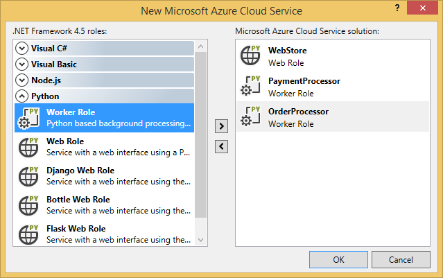

<properties
    pageTitle="Ruoli di lavoro e web Python con Visual Studio | Microsoft Azure"
    description="Panoramica dell'uso Python Tools per Visual Studio per creare servizi cloud Azure inclusi ruoli web ruoli e lavoro."
    services="cloud-services"
    documentationCenter="python"
    authors="thraka"
    manager="timlt"
    editor=""/>

<tags
    ms.service="cloud-services"
    ms.workload="tbd"
    ms.tgt_pltfrm="na"
    ms.devlang="python"
    ms.topic="hero-article"
    ms.date="08/03/2016"
    ms.author="adegeo"/>


# <a name="python-web-and-worker-roles-with-python-tools-for-visual-studio"></a>Ruoli di lavoro e web Python con Python Tools per Visual Studio

In questo articolo viene fornita una panoramica dell'uso di ruoli web e lavoro Python mediante [Python Tools per Visual Studio][]. Si apprenderà come utilizzare Visual Studio per creare e distribuire un servizio Cloud di base che utilizza Python.

## <a name="prerequisites"></a>Prerequisiti

 - Visual Studio 2013 o 2015
 - [Python Tools per Visual Studio][] (PTVS)
 - [Azure SDK Tools per Visual Studio 2013][] o [SDK Azure Tools per Visual Studio 2015][]
 - [Python 2.7 versione a 32 bit][] o [Python 3.5 versione a 32 bit][]

[AZURE.INCLUDE [create-account-and-websites-note](../../includes/create-account-and-websites-note.md)]

## <a name="what-are-python-web-and-worker-roles"></a>Quali sono i ruoli di lavoro e web Python?

Azure sono disponibili tre calcolare modelli per l'esecuzione di applicazioni: [funzionalità Web Apps in Azure App servizio][execution model-web sites], [macchine virtuali di Azure][execution model-vms]e [Servizi Cloud Windows Azure][execution model-cloud services]. Tutti i modelli di tre supportano Python. Servizi cloud, che includono i ruoli web e di lavoro, forniscono *piattaforma come servizio (PaaS)*. All'interno di un servizio cloud, un ruolo web fornisce un server web Internet Information Services (IIS) dedicato alle applicazioni web front-end host, mentre un ruolo di lavoro può eseguire attività asincrona, lunga o perpetue indipendenti di input o interazione dell'utente.

Per ulteriori informazioni, vedere [che cos'è un servizio Cloud?].

> [AZURE.NOTE]*Ricerca per creare un sito Web semplice?*
Se lo scenario richiede solo un semplice sito Web front-end, utilizzare la caratteristica Web Apps leggera in Azure App servizio. È possibile aggiornare facilmente in un servizio Cloud, come il sito Web che si sviluppa e alle proprie esigenze. Visitare il <a href="/develop/python/">Centro per sviluppatori di Python</a> per trovare articoli che illustrate sviluppo della funzionalità Web Apps in Azure App servizio.
<br />


## <a name="project-creation"></a>Creazione del progetto

In Visual Studio, è possibile selezionare **Servizio Cloud di Azure** in **Python**finestra di dialogo **Nuovo progetto** .


Nella creazione guidata servizio Cloud di Azure, è possibile creare nuovi ruoli web e di lavoro.



Il modello di ruolo di lavoro viene fornito con codice standard per connettersi a un account di archiviazione Azure o Bus di servizio Azure.


È possibile aggiungere ruoli web o lavoro a un servizio cloud esistente in qualsiasi momento.  È possibile scegliere di aggiungere progetti esistenti della soluzione o crearne di nuovi.


Il servizio cloud può contenere ruoli implementati in lingue diverse.  Ad esempio, è possibile impostare un ruolo web Python implementato tramite Django, con Python o con ruoli di lavoro c#.  Comunicare in modo semplice tra i ruoli utilizzando code Bus di servizio o code di spazio di archiviazione.

## <a name="install-python-on-the-cloud-service"></a>Installare Python sul servizio cloud

>[AZURE.WARNING] Gli script di installazione che vengono installati con Visual Studio (al momento che dell'ultimo aggiornamento in questo articolo) non funzionano. In questa sezione descrive una possibile soluzione.

Il problema principale con gli script di configurazione sono che non vengono installate python. Prima di tutto, definire due [attività di avvio](cloud-services-startup-tasks.md) nel file [ServiceDefinition.csdef](cloud-services-model-and-package.md#servicedefinitioncsdef) . La prima attività (**PrepPython.ps1**) Scarica e installa il runtime Python. La seconda attività (**PipInstaller.ps1**) viene eseguita pip per installare le dipendenze, potrebbe essere.

Script riportati di seguito sono stati scritti destinazione Python 3.5. Se si vuole usare la versione 2. x di python, impostare il file di variabili **PYTHON2** su **in** per le due attività di avvio e l'attività di runtime: `<Variable name="PYTHON2" value="<mark>on</mark>" />`.


```xml
<Startup>

  <Task executionContext="elevated" taskType="simple" commandLine="bin\ps.cmd PrepPython.ps1">
    <Environment>
      <Variable name="EMULATED">
        <RoleInstanceValue xpath="/RoleEnvironment/Deployment/@emulated" />
      </Variable>
      <Variable name="PYTHON2" value="off" />
    </Environment>
  </Task>

  <Task executionContext="elevated" taskType="simple" commandLine="bin\ps.cmd PipInstaller.ps1">
    <Environment>
      <Variable name="EMULATED">
        <RoleInstanceValue xpath="/RoleEnvironment/Deployment/@emulated" />
      </Variable>
      <Variable name="PYTHON2" value="off" />
    </Environment>
    
  </Task>

</Startup>
```

Le variabili **PYTHON2** e **PYPATH** deve essere aggiunto all'attività di avvio del lavoro. La variabile **PYPATH** viene utilizzata solo se la variabile **PYTHON2** è impostata su **on**.

```xml
<Runtime>
  <Environment>
    <Variable name="EMULATED">
      <RoleInstanceValue xpath="/RoleEnvironment/Deployment/@emulated" />
    </Variable>
    <Variable name="PYTHON2" value="off" />
    <Variable name="PYPATH" value="%SystemDrive%\Python27" />
  </Environment>
  <EntryPoint>
    <ProgramEntryPoint commandLine="bin\ps.cmd LaunchWorker.ps1" setReadyOnProcessStart="true" />
  </EntryPoint>
</Runtime>
```

#### <a name="sample-servicedefinitioncsdef"></a>Esempio ServiceDefinition.csdef

```xml
<?xml version="1.0" encoding="utf-8"?>
<ServiceDefinition name="AzureCloudServicePython" xmlns="http://schemas.microsoft.com/ServiceHosting/2008/10/ServiceDefinition" schemaVersion="2015-04.2.6">
  <WorkerRole name="WorkerRole1" vmsize="Small">
    <ConfigurationSettings>
      <Setting name="Microsoft.WindowsAzure.Plugins.Diagnostics.ConnectionString" />
      <Setting name="Python2" />
    </ConfigurationSettings>
    <Startup>
      <Task executionContext="elevated" taskType="simple" commandLine="bin\ps.cmd PrepPython.ps1">
        <Environment>
          <Variable name="EMULATED">
            <RoleInstanceValue xpath="/RoleEnvironment/Deployment/@emulated" />
          </Variable>
          <Variable name="PYTHON2" value="off" />
        </Environment>
      </Task>
      <Task executionContext="elevated" taskType="simple" commandLine="bin\ps.cmd PipInstaller.ps1">
        <Environment>
          <Variable name="EMULATED">
            <RoleInstanceValue xpath="/RoleEnvironment/Deployment/@emulated" />
          </Variable>
          <Variable name="PYTHON2" value="off" />
        </Environment>
      </Task>
    </Startup>
    <Runtime>
      <Environment>
        <Variable name="EMULATED">
          <RoleInstanceValue xpath="/RoleEnvironment/Deployment/@emulated" />
        </Variable>
        <Variable name="PYTHON2" value="off" />
        <Variable name="PYPATH" value="%SystemDrive%\Python27" />
      </Environment>
      <EntryPoint>
        <ProgramEntryPoint commandLine="bin\ps.cmd LaunchWorker.ps1" setReadyOnProcessStart="true" />
      </EntryPoint>
    </Runtime>
    <Imports>
      <Import moduleName="RemoteAccess" />
      <Import moduleName="RemoteForwarder" />
    </Imports>
  </WorkerRole>
</ServiceDefinition>
```


Creare il file **PrepPython.ps1** e **PipInstaller.ps1** il **. / bin** cartella del proprio ruolo.

#### <a name="preppythonps1"></a>PrepPython.ps1

Questo script installa python. Se la variabile di ambiente **PYTHON2** è impostata su verranno installati **nella** quindi 2.7 Python, in caso contrario verranno installati Python 3.5.

```powershell
$is_emulated = $env:EMULATED -eq "true"
$is_python2 = $env:PYTHON2 -eq "on"
$nl = [Environment]::NewLine

if (-not $is_emulated){
    Write-Output "Checking if python is installed...$nl"
    if ($is_python2) {
        & "${env:SystemDrive}\Python27\python.exe"  -V | Out-Null
    }
    else {
        py -V | Out-Null
    }

    if (-not $?) {

        $url = "https://www.python.org/ftp/python/3.5.2/python-3.5.2-amd64.exe"
        $outFile = "${env:TEMP}\python-3.5.2-amd64.exe"

        if ($is_python2) {
            $url = "https://www.python.org/ftp/python/2.7.12/python-2.7.12.amd64.msi"
            $outFile = "${env:TEMP}\python-2.7.12.amd64.msi"
        }
        
        Write-Output "Not found, downloading $url to $outFile$nl"
        Invoke-WebRequest $url -OutFile $outFile
        Write-Output "Installing$nl"

        if ($is_python2) {
            Start-Process msiexec.exe -ArgumentList "/q", "/i", "$outFile", "ALLUSERS=1" -Wait
        }
        else {
            Start-Process "$outFile" -ArgumentList "/quiet", "InstallAllUsers=1" -Wait
        }

        Write-Output "Done$nl"
    }
    else {
        Write-Output "Already installed"
    }
}
```

#### <a name="pipinstallerps1"></a>PipInstaller.ps1

Questo script chiama la pip e tutte le dipendenze installazioni nel file **requirements.txt** . Se la variabile di ambiente **PYTHON2** è impostata su verranno usate **nella** quindi 2.7 Python, in caso contrario verranno usate Python 3.5.

```powershell
$is_emulated = $env:EMULATED -eq "true"
$is_python2 = $env:PYTHON2 -eq "on"
$nl = [Environment]::NewLine

if (-not $is_emulated){
    Write-Output "Checking if requirements.txt exists$nl"
    if (Test-Path ..\requirements.txt) {
        Write-Output "Found. Processing pip$nl"

        if ($is_python2) {
            & "${env:SystemDrive}\Python27\python.exe" -m pip install -r ..\requirements.txt
        }
        else {
            py -m pip install -r ..\requirements.txt
        }

        Write-Output "Done$nl"
    }
    else {
        Write-Output "Not found$nl"
    }
}
```

#### <a name="modify-launchworkerps1"></a>Modificare LaunchWorker.ps1

>[AZURE.NOTE] In caso di un progetto di **ruolo di lavoro** , file **LauncherWorker.ps1** è necessario eseguire il file di avvio. In un progetto di **ruolo web** , il file di avvio alternativa è definito nelle proprietà del progetto.

**Bin\LaunchWorker.ps1** è stato creato originariamente per eseguire molte attività di preparazione ma non funziona. Sostituire il contenuto del file con il seguente script.

Questo script chiama il file **worker.py** dal progetto python. Se la variabile di ambiente **PYTHON2** è impostata su verranno usate **nella** quindi 2.7 Python, in caso contrario verranno usate Python 3.5.

```powershell
$is_emulated = $env:EMULATED -eq "true"
$is_python2 = $env:PYTHON2 -eq "on"
$nl = [Environment]::NewLine

if (-not $is_emulated)
{
    Write-Output "Running worker.py$nl"

    if ($is_python2) {
        cd..
        iex "$env:PYPATH\python.exe worker.py"
    }
    else {
        cd..
        iex "py worker.py"
    }
}
else
{
    Write-Output "Running (EMULATED) worker.py$nl"

    # Customize to your local dev environment

    if ($is_python2) {
        cd..
        iex "$env:PYPATH\python.exe worker.py"
    }
    else {
        cd..
        iex "py worker.py"
    }
}
```

#### <a name="pscmd"></a>PS.cmd

I modelli di Visual Studio devono aver creato un file **ps.cmd** nel **. / bin** cartella. Questo script di shell effettua una chiamata gli script di PowerShell spaziale sopra e fornisce registrazione in base al nome di spaziale PowerShell denominato. Se il file non è stato creato, ecco cosa deve essere al suo interno. 

```bat
@echo off

cd /D %~dp0

if not exist "%DiagnosticStore%\LogFiles" mkdir "%DiagnosticStore%\LogFiles"
%SystemRoot%\System32\WindowsPowerShell\v1.0\powershell.exe -ExecutionPolicy Unrestricted -File %* >> "%DiagnosticStore%\LogFiles\%~n1.txt" 2>> "%DiagnosticStore%\LogFiles\%~n1.err.txt"
```


## <a name="run-locally"></a>Esegui in locale

Se si imposta il progetto di servizio cloud come progetto di avvio e premere F5, verrà eseguito il servizio cloud nell'emulatore Azure locale.

Anche se PTVS supporta avvio nell'emulatore, il debug (ad esempio, i punti di interruzione) non funziona.

Per eseguire il debug dei ruoli web e di lavoro, è possibile impostare il ruolo di progetto come progetto di avvio e debug che invece.  È inoltre possibile impostare più progetti di avvio.  Fare doppio clic la soluzione e quindi selezionare **Imposta progetti di avvio**.


## <a name="publish-to-azure"></a>Pubblicare su Azure

Per pubblicare, fare clic sul progetto della soluzione servizi cloud e quindi selezionare **pubblica**.


Seguire la procedura guidata. Se è necessario attivare desktop remoto. Desktop remoto è utile quando è necessario eseguire il debug di un elemento.

Dopo aver la configurazione delle impostazioni, fare clic su **pubblica**.

Alcuni lo stato di avanzamento verrà visualizzato nella finestra di output, quindi è necessario visualizzare la finestra registro attività di Microsoft Azure.


Distribuzione potrebbe richiedere alcuni minuti per completare, quindi i ruoli web e/o il lavoro verranno eseguito su Azure!

### <a name="investigate-logs"></a>Esaminare i registri

Dopo la macchina virtuale di servizio cloud viene avviato e viene installata Python, è possibile esaminare i registri per trovare i messaggi di errore. Questi registri si trovano nella **C:\Resources\Directory\\\LogFiles {ruolo}** cartella. **PrepPython.err.txt** avranno almeno un errore in essa da quando lo script tenta di rilevare se è installato Python e **PipInstaller.err.txt** potrebbe segnalano una versione non aggiornata di pip.

## <a name="next-steps"></a>Passaggi successivi

Per informazioni più dettagliate sull'utilizzo dei ruoli web e lavoro negli strumenti di Python per Visual Studio, vedere la documentazione PTVS:

- [Progetti di servizi cloud][]

Per ulteriori informazioni sull'uso di servizi Azure i ruoli web e di lavoro, ad esempio utilizzando lo spazio di archiviazione di Azure o Bus di servizio, vedere gli articoli seguenti.

- [Servizio BLOB][]
- [Servizio di tabella][]
- [Servizio di coda][]
- [Code Bus Service][]
- [Servizio Bus argomenti][]


<!--Link references-->

[Che cos'è un servizio Cloud?]: cloud-services-choose-me.md
[execution model-web sites]: ../app-service-web/app-service-web-overview.md
[execution model-vms]: ../virtual-machines/virtual-machines-windows-about.md
[execution model-cloud services]: cloud-services-choose-me.md
[Python Developer Center]: /develop/python/

[Servizio BLOB]: ../storage/storage-python-how-to-use-blob-storage.md
[Servizio di coda]: ../storage/storage-python-how-to-use-queue-storage.md
[Servizio di tabella]: ../storage/storage-python-how-to-use-table-storage.md
[Code Bus Service]: ../service-bus-messaging/service-bus-python-how-to-use-queues.md
[Servizio Bus argomenti]: ../service-bus-messaging/service-bus-python-how-to-use-topics-subscriptions.md


<!--External Link references-->

[Python Tools per Visual Studio]: http://aka.ms/ptvs
[Python Tools for Visual Studio Documentation]: http://aka.ms/ptvsdocs
[Progetti di servizi cloud]: http://go.microsoft.com/fwlink/?LinkId=624028
[Azure SDK Tools per Visual Studio 2013]: http://go.microsoft.com/fwlink/?LinkId=323510
[Azure SDK Tools per Visual Studio 2015]: http://go.microsoft.com/fwlink/?LinkId=518003
[Python 2.7 versione a 32 bit]: https://www.python.org/downloads/
[Python 3.5 versione a 32 bit]: https://www.python.org/downloads/
