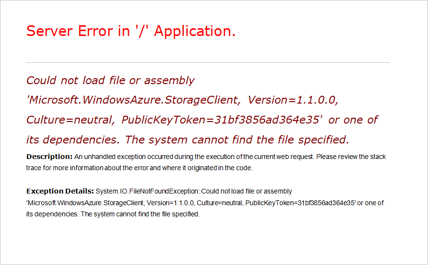

<properties
   pageTitle="Risolvere i problemi di ruoli che non riescono a start | Microsoft Azure"
   description="Di seguito sono riportati alcuni motivi comuni perché un ruolo di servizio Cloud potrebbe non essere avviato. Sono disponibili anche soluzioni a questi problemi."
   services="cloud-services"
   documentationCenter=""
   authors="simonxjx"
   manager="felixwu"
   editor=""
   tags="top-support-issue"/>
<tags
   ms.service="cloud-services"
   ms.devlang="na"
   ms.topic="article"
   ms.tgt_pltfrm="na"
   ms.workload="tbd"
   ms.date="09/02/2016"
   ms.author="v-six" />

# <a name="troubleshoot-cloud-service-roles-that-fail-to-start"></a>Risolvere i problemi di ruoli di servizio Cloud che non riescono a start

Ecco alcuni problemi comuni e le soluzioni correlate ai servizi Cloud Azure ruoli che non è possibile iniziare.

[AZURE.INCLUDE [support-disclaimer](../../includes/support-disclaimer.md)]

## <a name="missing-dlls-or-dependencies"></a>DLL mancanti o dipendenze

Ruoli non risponde e ruoli alternare tra **inizializzazione**, **occupato**e **arresto** stati possono essere dovuti DLL mancanti o assiemi.

Sintomi della DLL o assembly mancanti possono essere:

- L'istanza del ruolo è ciclicamente **inizializzazione**, **occupato**e stati **interruzione** .
- L'istanza del ruolo è stato spostato in **pronti** , ma se si passa a un'applicazione web, non viene visualizzata la pagina.

Sono disponibili diversi metodi consigliati per l'analisi di questi problemi.

## <a name="diagnose-missing-dll-issues-in-a-web-role"></a>Diagnosticare i problemi di DLL mancanti in un ruolo web

Quando si passa a un sito Web che viene distribuito in un web ruolo e il browser verrà visualizzato un errore simile al seguente, è possibile che una DLL non è presente.


## <a name="diagnose-issues-by-turning-off-custom-errors"></a>Diagnosticare i problemi di disattivando gli errori personalizzati

Informazioni sugli errori più completare possono essere visualizzate configurando config per il ruolo web impostare la modalità di errore personalizzato su disattivato e ridistribuire il servizio.

Per visualizzare gli errori più completi senza utilizzare Desktop remoto:

1. Aprire la soluzione in Microsoft Visual Studio.

2. In **Esplora soluzioni**individuare il file config e aprirlo.

3. In config, individuare la sezione System. Web e aggiungere la riga seguente:

    ```xml
    <customErrors mode="Off" />
    ```

4. Salvare il file.

5. Rigenerare e ridistribuire il servizio.

Dopo il servizio viene ridistribuito, si verrà visualizzato un messaggio di errore con il nome dell'assembly o DLL mancante.

## <a name="diagnose-issues-by-viewing-the-error-remotely"></a>Diagnosticare i problemi visualizzando l'errore quando in modalità remota

È possibile utilizzare Desktop remoto per accedere al ruolo e visualizzare informazioni più complete di errore quando in modalità remota. Per visualizzare gli errori mediante Desktop remoto, procedere come segue:

1. Assicurarsi che sia installato Azure SDK 1.3 o versione successiva.

2. Durante la distribuzione della soluzione utilizzando Visual Studio, scegliere "Configura connessioni Desktop remoto...". Per ulteriori informazioni sulla configurazione della connessione Desktop remoto, vedere [Utilizzo di Desktop remoto con i ruoli di Azure](../vs-azure-tools-remote-desktop-roles.md).

3. Nel portale classico di Microsoft Azure dopo l'istanza viene visualizzato lo stato **Pronto**, fare clic su una delle istanze del ruolo.

4. Fare clic sull'icona **Connetti** nell'area di **Accesso remoto** della barra multifunzione.

5. Accedere al computer virtuale utilizzando le credenziali specificate durante la configurazione Desktop remoto.

6. Aprire una finestra di comando.

7. Tipo di `IPconfig`.

8. Nota Il valore dell'indirizzo IPV4.

9. Aprire Internet Explorer.

10. Digitare l'indirizzo e il nome dell'applicazione web. Ad esempio `http://<IPV4 Address>/default.aspx`.

Spostamento al sito Web restituirà ora più espliciti messaggi di errore:

* Errore del server nell'applicazione '/'.

* Descrizione: Un'eccezione non gestita durante l'esecuzione della richiesta web corrente. Esaminare la traccia dello stack per ulteriori informazioni sull'errore e origine nel codice.

* Dettagli eccezione: System.IO.FIleNotFoundException: Impossibile caricare file o assembly ' Microsoft.WindowsAzure.StorageClient, versione = 1.1.0.0, le impostazioni cultura = indipendente, PublicKeyToken = 31bf856ad364e35' o una delle sue dipendenze. Impossibile trovare il file specificato.

Per esempio:



## <a name="diagnose-issues-by-using-the-compute-emulator"></a>Diagnosticare i problemi usando l'emulatore di calcolo

È possibile utilizzare l'emulatore di calcolo di Microsoft Azure per la diagnosi e risoluzione dei problemi dei mancanti dipendenze e gli errori di config.

Per ottenere risultati ottimali con questo metodo di diagnosi, è necessario utilizzare un computer o la macchina virtuale che contiene un'installazione pulita di Windows. Per simulare meglio l'ambiente di Azure, utilizzare Windows Server 2008 R2 x64.

1. Installare la versione autonoma di [Azure SDK](https://azure.microsoft.com/downloads/).

2. Nel computer di sviluppo, compilare il progetto di servizio cloud.

3. In Esplora risorse, passare alla cartella bin\debug del progetto di servizio cloud.

4. Copiare il file di cartella e cscfg .csx al computer in uso per eseguire il debug i problemi.

5. Nel computer pulito, aprire una finestra del Prompt dei comandi di Azure SDK e digitare `csrun.exe /devstore:start`.

6. Al prompt dei comandi digitare `run csrun <path to .csx folder> <path to .cscfg file> /launchBrowser`.

7. Quando si avvia il ruolo, si vedrà informazioni dettagliate sull'errore di Internet Explorer. Utilizzare Windows standard risoluzione dei problemi di strumenti per diagnosticare ulteriormente il problema.

## <a name="diagnose-issues-by-using-intellitrace"></a>Diagnosticare i problemi tramite IntelliTrace

Per lavoro e ruoli web che utilizzano .NET Framework 4, è possibile utilizzare [IntelliTrace](https://msdn.microsoft.com/library/dd264915.aspx), disponibile in [Microsoft Visual Studio Ultimate](https://www.visualstudio.com/products/visual-studio-ultimate-with-MSDN-vs).

Seguire questa procedura per distribuire il servizio con IntelliTrace abilitato:

1. Verificare che sia installato Azure SDK 1.3 o versione successiva.

2. Distribuire la soluzione utilizzando Visual Studio. Durante la distribuzione, selezionare la casella di controllo **Abilita IntelliTrace per i ruoli di .NET 4** .

3. Una volta avviata l'istanza, aprire **Esplora Server**.

4. Espandere il **Azure\\servizi Cloud** nodo e individuare la distribuzione.

5. Espandere la distribuzione fino a visualizzare le istanze di ruolo. Pulsante destro del mouse su una delle istanze.

6. Scegliere **i registri IntelliTrace visualizzazione**. Verrà aperto il **Riepilogo IntelliTrace** .

7. Individuare la sezione eccezioni di riepilogo. Se sono presenti eccezioni, la sezione sarà **Dati eccezione**.

8. Espandere i **Dati dell'eccezione** e cercare errori **System.IO.FileNotFoundException** simili al seguente:


## <a name="address-missing-dlls-and-assemblies"></a>Indirizzo mancante DLL e assiemi

Per risolvere DLL mancanti ed errori assembly, procedere come segue:

1. Aprire la soluzione in Visual Studio.

2. In **Esplora soluzioni**aprire la cartella **dei riferimenti** .

3. Fare clic su assembly identificato nel messaggio di errore.

4. Nel riquadro **proprietà** individuare **proprietà copia locale** e il valore impostato su **True**.

5. Ridistribuire il servizio cloud.

Dopo aver verificato che tutti gli errori sono stati corretti, è possibile distribuire il servizio senza selezionando la casella di controllo **Abilita IntelliTrace per i ruoli di .NET 4** .

## <a name="next-steps"></a>Passaggi successivi

Visualizzare altri [articoli di risoluzione dei problemi](https://azure.microsoft.com/documentation/articles/?tag=top-support-issue&product=cloud-services) per i servizi cloud.

Per informazioni su come risolvere i problemi relativi al ruolo ricoperto dai partecipanti servizio cloud utilizzando i dati di diagnostica di Azure PaaS computer, vedere [serie di blog di Kevin Williamson](http://blogs.msdn.com/b/kwill/archive/2013/08/09/windows-azure-paas-compute-diagnostics-data.aspx).
