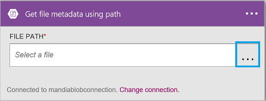

<properties
    pageTitle="Aggiungere l'archiviazione blob Azure connettore nelle applicazioni logica | Microsoft Azure"
    description="Panoramica di archiviazione blob Azure connettore con i parametri di API REST"
    services=""
    documentationCenter="" 
    authors="MandiOhlinger"
    manager="anneta"
    editor=""
    tags="connectors"/>

<tags
   ms.service="logic-apps"
   ms.devlang="na"
   ms.topic="article"
   ms.tgt_pltfrm="na"
   ms.workload="integration" 
   ms.date="10/18/2016"
   ms.author="mandia"/>

# Iniziare a utilizzare il connettore di spazio di archiviazione blob Azure
Archiviazione Blob Azure è un servizio per l'archiviazione di grandi quantità di dati non strutturati. Eseguire varie azioni, ad esempio upload, aggiornare, ottenere ed eliminare BLOB in archiviazione blob Azure. 

Con archiviazione blob Azure, è:

- Creare il flusso di lavoro per il caricamento di nuovi progetti o recupero file recente aggiornati.
- Utilizzare azioni per ottenere i metadati di file, eliminare un file, file di copia e altro ancora. Ad esempio, quando uno strumento viene aggiornato in un sito web Azure (trigger), quindi aggiornare un file in archiviazione blob (un'azione). 

In questo argomento viene illustrato come utilizzare il connettore di spazio di archiviazione blob in un'app di logica e anche elencate le azioni.

>[AZURE.NOTE] Questa versione dell'articolo si applica alla disponibilità generale App logica (GA). 

Per ulteriori informazioni su come logica App, vedere [quali sono le applicazioni di logica](../app-service-logic/app-service-logic-what-are-logic-apps.md) e [creare un'app di logica](../app-service-logic/app-service-logic-create-a-logic-app.md).

## Connettersi a archiviazione blob Azure

Prima che l'app logica poter accedere a qualsiasi servizio, è prima di tutto creare una *connessione* al servizio. Una connessione fornisce la connettività tra un'app di logica e un altro servizio. Ad esempio, per connettersi a un account di archiviazione, è prima di tutto creare una spazio di archiviazione blob *connessione*. Per creare una connessione, immettere le credenziali che generalmente vengono utilizzati per accedere al servizio che si desidera connettersi. Pertanto con lo spazio di archiviazione Azure, immettere le credenziali per l'account di archiviazione per creare la connessione. 

#### Creare la connessione

>[AZURE.INCLUDE [Create a connection to Azure blob storage](../../includes/connectors-create-api-azureblobstorage.md)]
 
## Utilizzare un trigger

Il connettore non dispone di tutti i trigger. Usare altri trigger per avviare l'applicazione di logica, ad esempio un trigger di ricorrenza, un trigger HTTP Webhook, trigger disponibili con altri connettori e altro ancora. [Creare un'app logica](../app-service-logic/app-service-logic-create-a-logic-app.md) viene fornito un esempio.

## Utilizzare un'azione
    
Un'azione è un'operazione effettuata dal flusso di lavoro definita in un'app di logica.

1. Selezionare il segno di addizione. Viene visualizzato selezionare diverse opzioni: **aggiungere un'azione**, **aggiungere una condizione**o una delle **altre** opzioni.

    

2. Scegliere **Aggiungi un'azione**.

3. Nella casella di testo digitare "blob" per ottenere un elenco di tutte le azioni disponibili.

     

4. In questo esempio, scegliere **AzureBlob - ottenere i metadati di file tramite percorso**. Se esiste già una connessione, quindi selezionare **…** Pulsante (Mostra selezione) per selezionare un file.

    

    Se viene chiesto di immettere le informazioni di connessione, quindi immettere i dettagli per creare la connessione. [Creare la connessione](connectors-create-api-azureblobstorage.md#create-the-connection) in questo argomento sono descritte le proprietà. 

    > [AZURE.NOTE] In questo esempio, è possibile ottenere i metadati di un file. Per visualizzare i metadati, aggiungere un'altra azione che consente di creare un nuovo file utilizzando un altro connettore. Ad esempio aggiungere un'azione OneDrive che consente di creare un nuovo file "test" in base ai metadati. 

5. **Salvare** le modifiche (superiore sinistro della barra degli strumenti). L'app logica verrà salvata e può essere attivata automaticamente.

> [AZURE.TIP] [Esplora archivi](http://storageexplorer.com/) è un ottimo strumento per gestire più account di archiviazione.

## Dettagli tecnici

## Azioni di spazio di archiviazione Blob

|Azione|Descrizione|
|--- | ---|
|[Ottenere i metadati di file](connectors-create-api-azureblobstorage.md#get-file-metadata)|Questa operazione consente di file basato su metadati con id di file.|
|[File di aggiornamento](connectors-create-api-azureblobstorage.md#update-file)|Questa operazione Aggiorna un file.|
|[Eliminare file](connectors-create-api-azureblobstorage.md#delete-file)|Questa operazione Elimina un file.|
|[Ottenere i metadati di file con percorso](connectors-create-api-azureblobstorage.md#get-file-metadata-using-path)|Questa operazione consente di file basato su metadati utilizzando il percorso.|
|[Ottenere contenuto del file con percorso](connectors-create-api-azureblobstorage.md#get-file-content-using-path)|Questa operazione consente il contenuto utilizzando il percorso del file.|
|[Ottenere il contenuto del file](connectors-create-api-azureblobstorage.md#get-file-content)|Questa operazione consente di contenuto del file con id.|
|[Creare file](connectors-create-api-azureblobstorage.md#create-file)|Questa operazione consente di caricare un file.|
|[Copiare file](connectors-create-api-azureblobstorage.md#copy-file)|Questa operazione copia un file all'archivio Blob Azure.|
|[Estrarre archivio cartella](connectors-create-api-azureblobstorage.md#extract-archive-to-folder)|Questa operazione estrae un file di archivio in una cartella (esempio: zip).|

### Dettagli di azione

In questa sezione, vedere i dettagli specifici di ogni azione, inclusi eventuali proprietà input obbligatorio o facoltativo e qualsiasi output corrispondente associato al connettore.

#### Ottenere i metadati di file
Questa operazione consente di file basato su metadati con id di file.  

|Nome della proprietà| Nome visualizzato|Descrizione|
| ---|---|---|
|ID *|File|Selezionare un file|

Un asterisco (*) indica che la proprietà è obbligatoria.

##### Dettagli output
BlobMetadata

| Nome della proprietà | Tipo di dati |
|---|---|
|ID|stringa|
|Nome|stringa|
|DisplayName|stringa|
|Percorso|stringa|
|LastModified|stringa|
|Dimensioni|numero intero|
|MediaType|stringa|
|IsFolder|valore booleano|
|ETag|stringa|
|FileLocator|stringa|

#### File di aggiornamento
Questa operazione Aggiorna un file.  

|Nome della proprietà| Nome visualizzato|Descrizione|
| ---|---|---|
|ID *|File|Selezionare un file|
|corpo *|Contenuto del file|Contenuto del file da aggiornare|

Un asterisco (*) indica che la proprietà è obbligatoria.

##### Dettagli output
BlobMetadata

| Nome della proprietà | Tipo di dati |
|---|---|
|ID|stringa|
|Nome|stringa|
|DisplayName|stringa|
|Percorso|stringa|
|LastModified|stringa|
|Dimensioni|numero intero|
|MediaType|stringa|
|IsFolder|valore booleano|
|ETag|stringa|
|FileLocator|stringa|

#### Eliminare file
Questa operazione Elimina un file.  

|Nome della proprietà| Nome visualizzato|Descrizione|
| ---|---|---|
|ID *|File|Selezionare un file|

Un asterisco (*) indica che la proprietà è obbligatoria.

##### Dettagli output
Nessuno.

#### Ottenere i metadati di file con percorso
Questa operazione consente di file basato su metadati utilizzando il percorso.  

|Nome della proprietà| Nome visualizzato|Descrizione|
| ---|---|---|
|percorso *|Percorso file|Selezionare un file|

Un asterisco (*) indica che la proprietà è obbligatoria.

##### Dettagli output
BlobMetadata

| Nome della proprietà | Tipo di dati |
|---|---|
|ID|stringa|
|Nome|stringa|
|DisplayName|stringa|
|Percorso|stringa|
|LastModified|stringa|
|Dimensioni|numero intero|
|MediaType|stringa|
|IsFolder|valore booleano|
|ETag|stringa|
|FileLocator|stringa|

#### Ottenere contenuto del file con percorso
Questa operazione consente il contenuto utilizzando il percorso del file.  

|Nome della proprietà| Nome visualizzato|Descrizione|
| ---|---|---|
|percorso *|Percorso file|Selezionare un file|

Un asterisco (*) indica che la proprietà è obbligatoria.

##### Dettagli output
Nessuno.

#### Ottenere il contenuto del file
Questa operazione consente di contenuto del file con id.  

|Nome della proprietà| Tipo di dati|Descrizione|
| ---|---|---|
|ID *|stringa|Selezionare un file|

Un asterisco (*) indica che la proprietà è obbligatoria.

##### Dettagli output
Nessuno.

#### Creare file
Questa operazione consente di caricare un file.  

|Nome della proprietà| Nome visualizzato|Descrizione|
| ---|---|---|
|folderPath *|Percorso della cartella|Selezionare una cartella|
|nome *|Nome del file|Nome del file da caricare|
|corpo *|Contenuto del file|Contenuto del file da caricare|

Un asterisco (*) indica che la proprietà è obbligatoria.

##### Dettagli output
BlobMetadata

| Nome della proprietà | Tipo di dati | 
|---|---|
|ID|stringa|
|Nome|stringa|
|DisplayName|stringa|
|Percorso|stringa|
|LastModified|stringa|
|Dimensioni|numero intero|
|MediaType|stringa|
|IsFolder|valore booleano|
|ETag|stringa|
|FileLocator|stringa|

#### Copiare file
Questa operazione copia un file all'archivio Blob Azure.  

|Nome della proprietà| Nome visualizzato|Descrizione|
| ---|---|---|
|origine *|Url di origine|Specificare l'Url di file di origine|
|destinazione *|Percorso di file di destinazione|Specificare il percorso di file di destinazione, tra cui nome file di destinazione|
|sovrascrivere|Sovrascrivere?|Un file di destinazione esistente sovrascrivere (vero/falso)?  |

Un asterisco (*) indica che la proprietà è obbligatoria.

##### Dettagli output
BlobMetadata

| Nome della proprietà | Tipo di dati |
|---|---|
|ID|stringa|
|Nome|stringa|
|DisplayName|stringa|
|Percorso|stringa|
|LastModified|stringa|
|Dimensioni|numero intero|
|MediaType|stringa|
|IsFolder|valore booleano|
|ETag|stringa|
|FileLocator|stringa|

#### Estrarre archivio cartella
Questa operazione estrae un file di archivio in una cartella (esempio: zip).  

|Nome della proprietà| Nome visualizzato|Descrizione|
| ---|---|---|
|origine *|Percorso del file di archivio di origine|Selezionare un file di archivio|
|destinazione *|Percorso della cartella di destinazione|Selezionare il contenuto per l'estrazione|
|sovrascrivere|Sovrascrivere?|Un file di destinazione esistente sovrascrivere (vero/falso)?|

Un asterisco (*) indica che la proprietà è obbligatoria.

##### Dettagli output
BlobMetadata

| Nome della proprietà | Tipo di dati |
|---|---|
|ID|stringa|
|Nome|stringa|
|DisplayName|stringa|
|Percorso|stringa|
|LastModified|stringa|
|Dimensioni|numero intero|
|MediaType|stringa|
|IsFolder|valore booleano|
|ETag|stringa|
|FileLocator|stringa|

## Risposte HTTP

Quando si effettua chiamate a diverse operazioni, è possibile ottenere alcune risposte. Nella tabella seguente vengono descritte le risposte e le relative descrizioni:  

|Nome|Descrizione|
|---|---|
|200|Ok|
|202|Accettato dall'utente|
|400|Richiesta non valida|
|401|Non autorizzato|
|403|Accesso negato|
|404|Non trovato|
|500|Errore interno del Server. Errore sconosciuto|
|impostazione predefinita|Operazione non è riuscita.|

## Passaggi successivi

[Creare un'app di logica](../app-service-logic/app-service-logic-create-a-logic-app.md). Esplorare gli altri connettori disponibili nelle App logica il nostro [elenco API](apis-list.md).

