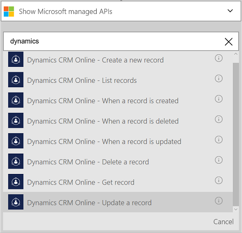

<properties
    pageTitle="Aggiungere il connettore Dynamics CRM Online alle App logica | Microsoft Azure"
    description="Creare App logica con il servizio di Azure App. Il Provider di connessione Dynamics CRM Online fornisce un'API per lavorare con entità su Dynamics CRM Online."
    services="logic-apps"    
    documentationCenter=""     
    authors="MandiOhlinger"    
    manager="erikre"    
    editor="" 
    tags="connectors" />

<tags
ms.service="logic-apps"
ms.devlang="na"
ms.topic="article"
ms.tgt_pltfrm="na"
ms.workload="integration"
ms.date="08/15/2016"
ms.author="mandia"/>

# Iniziare a utilizzare il connettore Dynamics CRM Online
Connettersi a Dynamics CRM Online per creare un nuovo record, aggiornare un elemento e altro ancora. Con CRM Online, è possibile:

- Definire il flusso di business in base ai dati che viene visualizzato da CRM Online. 
- È possibile ottenere le azioni di utilizzo che elimina un record entità e altro ancora. Queste azioni ottenere una risposta e quindi verificare l'output per le altre azioni. Ad esempio quando un elemento viene aggiornato in CRM, è possibile inviare un messaggio di posta elettronica con Office 365.

In questo argomento viene illustrato come utilizzare il connettore Dynamics CRM Online in un'app di logica e sono elencati anche i trigger e azioni.

>[AZURE.NOTE] Questa versione dell'articolo si applica alla disponibilità generale App logica (GA).

Per ulteriori informazioni su come logica App, vedere [quali sono le applicazioni di logica](../app-service-logic/app-service-logic-what-are-logic-apps.md) e [creare un'app di logica](../app-service-logic/app-service-logic-create-a-logic-app.md).

## Connettersi a Dynamics CRM Online

Prima che l'app logica poter accedere a qualsiasi servizio, è prima di tutto creare una *connessione* al servizio. Una connessione fornisce la connettività tra un'app di logica e un altro servizio. Ad esempio, per connettersi a Dynamics, è necessario innanzitutto una *connessione*di Dynamics CRM Online. Per creare una connessione, immettere le credenziali che generalmente vengono utilizzati per accedere al servizio che si desidera connettersi. Pertanto con Dynamics, immettere le credenziali per l'account Dynamics CRM Online per creare la connessione.

### Creare la connessione

>[AZURE.INCLUDE [Steps to create a connection to Dynamics CRM Online Connection Provider](../../includes/connectors-create-api-crmonline.md)]

## Utilizzare un trigger

Un trigger è un evento che può essere utilizzato per avviare il flusso di lavoro definita in un'app di logica. Trigger "sondaggio" il servizio in un intervallo e la frequenza con cui vuole. [Ulteriori informazioni sui trigger](../app-service-logic/app-service-logic-what-are-logic-apps.md#logic-app-concepts).

1. Nell'applicazione di logica, digitare "dynamics" per ottenere un elenco di trigger:  

    

2. Selezionare **Dynamics CRM Online - quando si crea un record**. Se esiste già una connessione, quindi selezionare un'organizzazione ed entità dall'elenco a discesa.

    

    Se viene chiesto di effettuare l'accesso, immettere il segno di informazioni per creare la connessione. [Creare la connessione](connectors-create-api-crmonline.md#create-the-connection) in questo argomento viene illustrata la procedura. 

    > [AZURE.NOTE] In questo esempio, l'app logica viene eseguita quando si crea un record. Per visualizzare i risultati di questo trigger, aggiungere un'altra azione che invia un messaggio di posta elettronica. Ad esempio, aggiungere l'azione di Office 365 *inviare un messaggio e-mail* che i messaggi si quando viene aggiunto il nuovo record. 

3. Selezionare il pulsante **Modifica** e impostare i valori di **frequenza** e **intervallo** . Ad esempio, se si desidera che il trigger al sondaggio ogni 15 minuti, quindi impostare la **frequenza** al **minuto**e impostare l' **intervallo** di **15**. 

    

4. **Salvare** le modifiche (superiore sinistro della barra degli strumenti). L'app logica verrà salvata e può essere attivata automaticamente.

## Utilizzare un'azione

Un'azione è un'operazione effettuata dal flusso di lavoro definita in un'app di logica. [Altre informazioni sulle operazioni](../app-service-logic/app-service-logic-what-are-logic-apps.md#logic-app-concepts).

1. Selezionare il segno di addizione. Viene visualizzato selezionare diverse opzioni: **aggiungere un'azione**, **aggiungere una condizione**o una delle **altre** opzioni.

    

2. Scegliere **Aggiungi un'azione**.

3. Nella casella di testo digitare "dynamics" per ottenere un elenco di tutte le azioni disponibili.

    

4. In questo esempio, scegliere **Dynamics CRM Online - aggiornamento di un record**. Se esiste già una connessione, scegliere il **Nome dell'organizzazione**, **Nome dell'entità**e altre proprietà:  

    

    Se viene chiesto di immettere le informazioni di connessione, quindi immettere i dettagli per creare la connessione. [Creare la connessione](connectors-create-api-crmonline.md#create-the-connection) in questo argomento sono descritte le proprietà. 

    > [AZURE.NOTE] In questo esempio abbiamo aggiornare un record esistente in CRM Online. È possibile utilizzare output da un altro trigger per aggiornare il record. Aggiungere, ad esempio, il trigger SharePoint *quando si modifica un elemento esistente* . Aggiungere l'azione CRM Online *aggiornare un record* che utilizza i campi di SharePoint per aggiornare il record esistente in CRM Online. 

5. **Salvare** le modifiche (superiore sinistro della barra degli strumenti). L'app logica verrà salvata e può essere attivata automaticamente.

## Dettagli tecnici

## Trigger

|Trigger | Descrizione|
|--- | ---|
|[Quando viene creato un record](connectors-create-api-crmonline.md#when-a-record-is-created)|Attiva un flusso quando viene creato un oggetto in CRM.|
|[Quando viene aggiornato un record](connectors-create-api-crmonline.md#when-a-record-is-updated)|Attiva un flusso quando un oggetto viene modificato in CRM.|
|[Quando si elimina un record](connectors-create-api-crmonline.md#when-a-record-is-deleted)|Attiva un flusso quando si elimina un oggetto in CRM.|

## Azioni

|Azione|Descrizione|
|--- | ---|
|[Record elenco](connectors-create-api-crmonline.md#list-records)|Questa operazione consente di ottenere i record per un'entità.|
|[Creare un nuovo record](connectors-create-api-crmonline.md#create-a-new-record)|Questa operazione crea un nuovo record di un'entità.|
|[Ottenere record](connectors-create-api-crmonline.md#get-record)|Questa operazione consente di record specificato per un'entità.|
|[Eliminare un record](connectors-create-api-crmonline.md#delete-a-record)|Questa operazione Elimina un record da un insieme di entità.|
|[Aggiornare un record](connectors-create-api-crmonline.md#update-a-record)|Questa operazione Aggiorna un record esistente per un'entità.|

### Informazioni dettagliate su trigger e azione

In questa sezione, vedere i dettagli specifici di ogni trigger e azione, inclusi eventuali proprietà input obbligatorio o facoltativo e qualsiasi output corrispondente associato al connettore.

#### Quando viene creato un record
Attiva un flusso quando viene creato un oggetto in CRM. 

|Nome della proprietà| Nome visualizzato|Descrizione|
| ---|---|---|
|set di dati *|Nome dell'organizzazione|Nome dell'organizzazione CRM ad esempio Contoso|
|tabella *|Nome dell'entità|Nome dell'entità|
|$skip|Ignora conteggio|Numero di voci per ignorare (impostazione predefinita = 0)|
|$top|Numero massimo Get|Numero massimo di voci per ottenere (impostazione predefinita = 256)|
|$filter|Query del filtro|Una query di filtro ODATA per limitare le voci restituite|
|$orderby|Order By|Una query di orderBy ODATA per specificare l'ordine delle voci|

Un asterisco (*) indica che la proprietà è obbligatoria.

##### Dettagli output
ItemsList

| Nome della proprietà | Tipo di dati |
|---|---|
|valore|in forma di matrice|

#### Quando viene aggiornato un record
Attiva un flusso quando un oggetto viene modificato in CRM. 

|Nome della proprietà| Nome visualizzato|Descrizione|
| ---|---|---|
|set di dati *|Nome dell'organizzazione|Nome dell'organizzazione CRM ad esempio Contoso|
|tabella *|Nome dell'entità|Nome dell'entità|
|$skip|Ignora conteggio|Numero di voci per ignorare (impostazione predefinita = 0)|
|$top|Numero massimo Get|Numero massimo di voci per ottenere (impostazione predefinita = 256)|
|$filter|Query del filtro|Una query di filtro ODATA per limitare le voci restituite|
|$orderby|Order By|Una query di orderBy ODATA per specificare l'ordine delle voci|

Un asterisco (*) indica che la proprietà è obbligatoria.

##### Dettagli output
ItemsList

| Nome della proprietà | Tipo di dati |
|---|---|
|valore|in forma di matrice|

#### Quando si elimina un record
Attiva un flusso quando si elimina un oggetto in CRM. 

|Nome della proprietà| Nome visualizzato|Descrizione|
| ---|---|---|
|set di dati *|Nome dell'organizzazione|Nome dell'organizzazione CRM ad esempio Contoso|
|tabella *|Nome dell'entità|Nome dell'entità|
|$skip|Ignora conteggio|Numero di voci per ignorare (impostazione predefinita = 0)|
|$top|Numero massimo Get|Numero massimo di voci per ottenere (impostazione predefinita = 256)|
|$filter|Query del filtro|Una query di filtro ODATA per limitare le voci restituite|
|$orderby|Order By|Una query di orderBy ODATA per specificare l'ordine delle voci|

Un asterisco (*) indica che la proprietà è obbligatoria.

##### Dettagli output
ItemsList

| Nome della proprietà | Tipo di dati |
|---|---|
|valore|in forma di matrice|

#### Record elenco
Questa operazione consente di ottenere i record per un'entità. 

|Nome della proprietà| Nome visualizzato|Descrizione|
| ---|---|---|
|set di dati *|Nome dell'organizzazione|Nome dell'organizzazione CRM ad esempio Contoso|
|tabella *|Nome dell'entità|Nome dell'entità|
|$skip|Ignora conteggio|Numero di voci per ignorare (impostazione predefinita = 0)|
|$top|Numero massimo Get|Numero massimo di voci per ottenere (impostazione predefinita = 256)|
|$filter|Query del filtro|Una query di filtro ODATA per limitare le voci restituite|
|$orderby|Order By|Una query di orderBy ODATA per specificare l'ordine delle voci|

Un asterisco (*) indica che la proprietà è obbligatoria.

##### Dettagli output
ItemsList

| Nome della proprietà | Tipo di dati |
|---|---|
|valore|in forma di matrice|

#### Creare un nuovo record
Questa operazione crea un nuovo record di un'entità. 

|Nome della proprietà| Nome visualizzato|Descrizione|
| ---|---|---|
|set di dati *|Nome dell'organizzazione|Nome dell'organizzazione CRM ad esempio Contoso|
|tabella *|Nome dell'entità|Nome dell'entità|

Un asterisco (*) indica che la proprietà è obbligatoria.

##### Dettagli output
Nessuno.

#### Ottenere record
Questa operazione consente di record specificato per un'entità. 

|Nome della proprietà| Nome visualizzato|Descrizione|
| ---|---|---|
|set di dati *|Nome dell'organizzazione|Nome dell'organizzazione CRM ad esempio Contoso|
|tabella *|Nome dell'entità|Nome dell'entità|
|ID *|Identificatore dell'elemento|Specificare l'identificatore per il record|

Un asterisco (*) indica che la proprietà è obbligatoria.

##### Dettagli output
Nessuno.

#### Eliminare un record
Questa operazione Elimina un record da un insieme di entità. 

|Nome della proprietà| Nome visualizzato|Descrizione|
| ---|---|---|
|set di dati *|Nome dell'organizzazione|Nome dell'organizzazione CRM ad esempio Contoso|
|tabella *|Nome dell'entità|Nome dell'entità|
|ID *|Identificatore dell'elemento|Specificare l'identificatore per il record|

Un asterisco (*) indica che la proprietà è obbligatoria.

#### Aggiornare un record
Questa operazione Aggiorna un record esistente per un'entità. 

|Nome della proprietà| Nome visualizzato|Descrizione|
| ---|---|---|
|set di dati *|Nome dell'organizzazione|Nome dell'organizzazione CRM ad esempio Contoso|
|tabella *|Nome dell'entità|Nome dell'entità|
|ID *|Identificatore record|Specificare l'identificatore per il record|

Un asterisco (*) indica che la proprietà è obbligatoria.

##### Dettagli output
Nessuno.

## Risposte HTTP

Le azioni e trigger possono restituire una o più delle seguenti codici di stato HTTP: 

|Nome|Descrizione|
|---|---|
|200|Ok|
|202|Accettato dall'utente|
|400|Richiesta non valida|
|401|Non autorizzato|
|403|Accesso negato|
|404|Non trovato|
|500|Errore interno del Server. Errore sconosciuto.|
|impostazione predefinita|Operazione non è riuscita.|

## Passaggi successivi

[Creare un'app di logica](../app-service-logic/app-service-logic-create-a-logic-app.md). Esplorare gli altri connettori disponibili nelle App logica il nostro [elenco API](apis-list.md).

