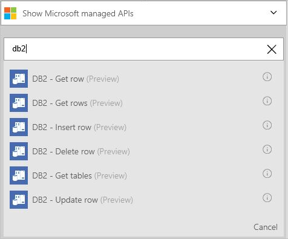
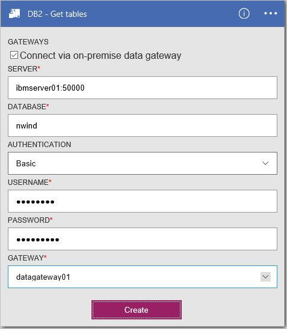
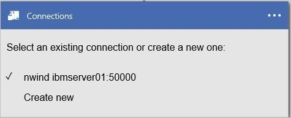
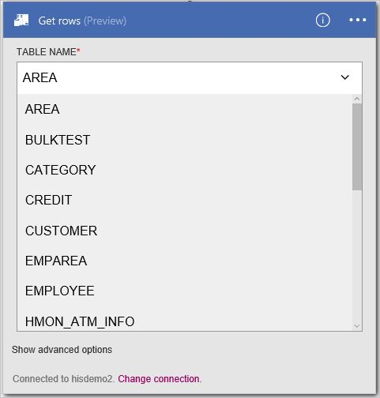
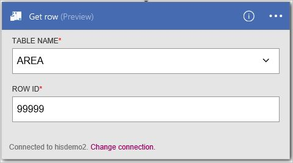

<properties
    pageTitle="Aggiungere il connettore DB2 nelle applicazioni logica | Microsoft Azure"
    description="Panoramica del connettore DB2 con i parametri di API REST"
    services=""
    documentationCenter="" 
    authors="gplarsen"
    manager="erikre"
    editor=""
    tags="connectors"/>

<tags
   ms.service="logic-apps"
   ms.devlang="na"
   ms.topic="article"
   ms.tgt_pltfrm="na"
   ms.workload="integration" 
   ms.date="09/26/2016"
   ms.author="plarsen"/>

# Iniziare a utilizzare il connettore DB2
Connettore Microsoft per DB2 logica App si connette alle risorse archiviate in un database IBM DB2. Il connettore include un client Microsoft per comunicare con computer remoti di server DB2 in una rete TCP/IP. Include database cloud, ad esempio dashDB IBM Bluemix o IBM DB2 per Windows in esecuzione in Azure virtualizzazione e di database che utilizzano il gateway di dati in locale in locale. Vedere l' [elenco è supportato](connectors-create-api-db2.md#supported-db2-platforms-and-versions) di IBM DB2 piattaforme e le versioni (in questo argomento).

>[AZURE.NOTE] Questa versione dell'articolo si applica alla disponibilità generale App logica (GA). 

Il connettore DB2 supporta le seguenti operazioni di database:

- Elencare le tabelle di database
- Leggere una riga utilizzando selezione
- Leggere tutte le righe mediante SELECT
- Aggiungere una riga utilizzando Inserisci
- Modificare una riga tramite l'aggiornamento
- Rimuovere una riga utilizzando Elimina

In questo argomento viene illustrato come utilizzare il connettore in un'app di logica alle operazioni di database processo.

Per ulteriori informazioni sulle App logica, vedere [creare un'app di logica](../app-service-logic/app-service-logic-create-a-logic-app.md).

## Azioni disponibili
Il connettore DB2 supporta le azioni di applicazione logica seguenti:

- GetTables
- GetRow
- GetRows
- InsertRow
- UpdateRow
- Eliminariga

## Elencare le tabelle
Creazione di un'app di logica per qualsiasi operazione è costituita da molte operazioni eseguite tramite il portale di Microsoft Azure.

In app logica, è possibile aggiungere un'azione per elencare le tabelle in un database DB2. L'azione indica il connettore per l'elaborazione di un'istruzione di schema DB2, ad esempio `CALL SYSIBM.SQLTABLES`.

### Creare un'app di logica
1.  In **Azure avviare discussioni**, selezionare **+** (segno più), **Web + Mobile**e quindi **App logica**.
2.  Immettere il **nome**, ad esempio `Db2getTables`, **abbonamento**, **gruppo di risorse**, **luogo**e **Pianificare servizi App**. Selezionare **Aggiungi a dashboard**e quindi selezionare **Crea**.

### Aggiungere un trigger e azione
1.  Nella finestra di **Progettazione di applicazioni logica**selezionare **LogicApp vuoto** nell'elenco **modelli** .
2.  Nell'elenco di **trigger** selezionare **ricorrenza**. 
3.  In trigger **ricorrenza** , selezionare **Modifica**, selezionare **la frequenza** elenco a discesa per selezionare **giorno**e quindi impostare l' **intervallo** in cui digitare **7**.  
4.  Selezionare la casella **+ nuova azione** e quindi selezionare **Aggiungi un'azione**.
5.  Nell'elenco **Azioni** digitare `db2` nella **ricerca di altre azioni** casella di modifica e quindi selezionare **DB2 - inserire tabelle (Preview)**.

      

6.  Nel riquadro della configurazione **DB2 - inserire tabelle** , selezionare **la casella di controllo** per attivare **Connetti tramite gateway dati locale**. Si noti che le impostazioni modificate dal cloud in locale.
    - Digitare valore per **Server**, sotto forma di numero di porta due punti indirizzo o l'alias. Ad esempio, digitare `ibmserver01:50000`.
    - Digitare valore per **il Database**. Ad esempio, digitare `nwind`.
    - Seleziona un valore per **l'autenticazione**. Ad esempio, selezionare **base**.
    - Tipo di valore per **nome utente**. Ad esempio, digitare `db2admin`.
    - Digitare valore per **la Password**. Ad esempio, digitare `Password1`.
    - Seleziona un valore per **Gateway**. Ad esempio, selezionare **datagateway01**.
7. Selezionare **Crea**e quindi selezionare **Salva**. 

    

8.  In e il **Db2getTables** , all'interno dell'elenco **tutto viene eseguito** in **Riepilogo**, selezionare l'elemento nell'elenco prima (esecuzione più recente).
9.  In e il **logica app eseguire** selezionare **Dettagli esecuzione**. All'interno dell'elenco di **Azioni** , selezionare **Get_tables**. Il valore per vedere **lo stato**, che deve essere **completata**. Selezionare il **collegamento di input** per visualizzare l'input. Selezionare **Invia collegamento**e visualizzare gli output; che deve includere un elenco di tabelle.

    

## Creare le connessioni
Il connettore supporta connessioni a database ospitati in locale e nel cloud utilizzando le seguenti proprietà di connessione. 

Proprietà | Descrizione
--- | ---
Server | Obbligatorio. Accetta un valore string che rappresenta un indirizzo TCP/IP o un alias in formato IPv4 o IPv6 seguito (delimitato da virgola) da un numero di porta TCP/IP. 
database | Obbligatorio. Accetta un valore string che rappresenta un nome di Database relazionali DRDA (RDBNAM). DB2 per z/OS accetta una stringa di 16 byte (database noto come un IBM DB2 per posizione z/OS). DB2 per i5/OS accetta una stringa di byte 18 (database è noto come un IBM DB2 per relazionali i database). DB2 per LUW accetta una stringa di 8 byte.
autenticazione | Facoltativo. Accetta un valore di elemento di elenco, Basic o Windows (kerberos). 
nome utente | Obbligatorio. Accetta un valore stringa. DB2 per z/OS accetta una stringa di 8 byte. DB2 per i accetta una stringa di 10 byte. DB2 per Linux o UNIX accetta una stringa di 8 byte. DB2 per Windows accetta una stringa di 30 byte.
password | Obbligatorio. Accetta un valore stringa.
gateway | Obbligatorio. Accetta un valore di elemento di elenco, che rappresenta il gateway di dati locali definito alle App logica all'interno del gruppo di archiviazione.  

## Creare i locale connessione gateway
Il connettore può accedere a un database DB2 locale utilizzando il gateway locale. Fare clic su argomenti gateway per altre informazioni. 

1. Nel riquadro di configurazione di **gateway** , selezionare **la casella di controllo** per attivare **Connetti tramite gateway**. Si noti che le impostazioni modificate dal cloud in locale.
2. Digitare valore per **Server**, sotto forma di numero di porta due punti indirizzo o l'alias. Ad esempio, digitare `ibmserver01:50000`.
3. Digitare valore per **il Database**. Ad esempio, digitare `nwind`.
4. Seleziona un valore per **l'autenticazione**. Ad esempio, selezionare **base**.
5. Tipo di valore per **nome utente**. Ad esempio, digitare `db2admin`.
6. Digitare valore per **la Password**. Ad esempio, digitare `Password1`.
7. Seleziona un valore per **Gateway**. Ad esempio, selezionare **datagateway01**.
8. Selezionare **Crea** per continuare. 

    

## Creare la connessione al cloud
Il connettore può accedere a un database DB2 cloud. 

1. Nel riquadro di configurazione di **gateway** , lasciare la **casella di controllo** disabilitato (su) **Connetti tramite gateway**. 
2. Digitare valore per **nome della connessione**. Ad esempio, digitare `hisdemo2`.
3. Digitare valore per il **nome del server DB2**, sotto forma di numero di porta due punti indirizzo o l'alias. Ad esempio, digitare `hisdemo2.cloudapp.net:50000`.
3. Digitare valore per **il nome del database DB2**. Ad esempio, digitare `nwind`.
4. Tipo di valore per **nome utente**. Ad esempio, digitare `db2admin`.
5. Digitare valore per **la Password**. Ad esempio, digitare `Password1`.
6. Selezionare **Crea** per continuare. 

    

## Recuperare tutte le righe mediante SELECT
È possibile definire un'azione app logica per recuperare tutte le righe in una tabella di DB2. Questo indica il connettore per l'elaborazione di un'istruzione SELECT DB2, ad esempio `SELECT * FROM AREA`.

### Creare un'app di logica
1.  In **Azure avviare discussioni**, selezionare **+** (segno più), **Web + Mobile**e quindi **App logica**.
2.  Immettere il **nome**, ad esempio `Db2getRows`, **abbonamento**, **gruppo di risorse**, **luogo**e **Pianificare servizi App**. Selezionare **Aggiungi a dashboard**e quindi selezionare **Crea**.

### Aggiungere un trigger e azione
1.  Nella finestra di **Progettazione di applicazioni logica**selezionare **LogicApp vuoto** nell'elenco **modelli** .
2.  Nell'elenco di **trigger** selezionare **ricorrenza**. 
3.  In trigger **ricorrenza** , selezionare **Modifica**, selezionare **frequenza** elenco a discesa per selezionare **giorno**e quindi selezionare **intervallo** digitare **7**. 
4.  Selezionare la casella **+ nuova azione** e quindi selezionare **Aggiungi un'azione**.
5.  Nell'elenco **Azioni** digitare `db2` nella **ricerca di altre azioni** casella di modifica e quindi selezionare **DB2 - ottenere righe (Preview)**.
6. Nell'azione **ottenere righe (Preview)** , selezionare **Cambia connessione**.
7. Nel riquadro di configurazione **connessioni** selezionare **Crea nuovo**. 

    
  
8. Nel riquadro di configurazione di **gateway** , lasciare la **casella di controllo** disabilitato (su) **Connetti tramite gateway**.
    - Digitare valore per **nome della connessione**. Ad esempio, digitare `HISDEMO2`.
    - Digitare valore per il **nome del server DB2**, sotto forma di numero di porta due punti indirizzo o l'alias. Ad esempio, digitare `HISDEMO2.cloudapp.net:50000`.
    - Digitare valore per **il nome del database DB2**. Ad esempio, digitare `NWIND`.
    - Tipo di valore per **nome utente**. Ad esempio, digitare `db2admin`.
    - Digitare valore per **la Password**. Ad esempio, digitare `Password1`.
9. Selezionare **Crea** per continuare.

    

10. Nell'elenco **nome tabella** selezionare la **freccia in giù**e quindi selezionare **AREA**.
11. Facoltativamente, selezionare **Mostra opzioni avanzate** per specificare le opzioni di query.
12. Selezionare **Salva**. 

    

13. In e il **Db2getRows** , all'interno dell'elenco **tutto viene eseguito** in **Riepilogo**, selezionare l'elemento nell'elenco prima (esecuzione più recente).
14. In e il **logica app eseguire** selezionare **Dettagli esecuzione**. All'interno dell'elenco di **Azioni** , selezionare **Get_rows**. Il valore per vedere **lo stato**, che deve essere **completata**. Selezionare il **collegamento di input** per visualizzare l'input. Selezionare **Invia collegamento**e visualizzare gli output; che deve includere un elenco di righe.

    

## Aggiungere una riga utilizzando Inserisci
È possibile definire un'azione app logica per aggiungere una riga in una tabella di DB2. Questa azione indica il connettore per l'elaborazione di un'istruzione INSERT DB2, ad esempio `INSERT INTO AREA (AREAID, AREADESC, REGIONID) VALUES ('99999', 'Area 99999', 102)`.

### Creare un'app di logica
1.  In **Azure avviare discussioni**, selezionare **+** (segno più), **Web + Mobile**e quindi **App logica**.
2.  Immettere il **nome**, ad esempio `Db2insertRow`, **abbonamento**, **gruppo di risorse**, **luogo**e **Pianificare servizi App**. Selezionare **Aggiungi a dashboard**e quindi selezionare **Crea**.

### Aggiungere un trigger e azione
1.  Nella finestra di **Progettazione di applicazioni logica**selezionare **LogicApp vuoto** nell'elenco **modelli** .
2.  Nell'elenco di **trigger** selezionare **ricorrenza**. 
3.  In trigger **ricorrenza** , selezionare **Modifica**, selezionare **frequenza** elenco a discesa per selezionare **giorno**e quindi selezionare **intervallo** digitare **7**. 
4.  Selezionare la casella **+ nuova azione** e quindi selezionare **Aggiungi un'azione**.
5.  Nell'elenco **Azioni** digitare **db2** nella casella di **ricerca di altre azioni** e quindi selezionare **DB2 - Inserisci riga (Preview)**.
6. Nell'azione **ottenere righe (Preview)** , selezionare **Cambia connessione**. 
7. Nel riquadro di configurazione di **connessioni** , selezionare una connessione. Ad esempio, selezionare **hisdemo2**.

    

8. Nell'elenco **nome tabella** selezionare la **freccia in giù**e quindi selezionare **AREA**.
9. Immettere valori per tutte le necessarie colonne (vedere asterisco rosso). Ad esempio, digitare `99999` per **AREAID**, digitare `Area 99999`e digitare `102` per **REGIONID**. 
10. Selezionare **Salva**.

    
 
11. In e il **Db2insertRow** , all'interno dell'elenco **tutto viene eseguito** in **Riepilogo**, selezionare l'elemento nell'elenco prima (esecuzione più recente).
12. In e il **logica app eseguire** selezionare **Dettagli esecuzione**. All'interno dell'elenco di **Azioni** , selezionare **Get_rows**. Il valore per vedere **lo stato**, che deve essere **completata**. Selezionare il **collegamento di input** per visualizzare l'input. Selezionare **Invia collegamento**e visualizzare gli output; che deve includere la nuova riga.

    

## Recuperare una riga utilizzando selezione
È possibile definire un'azione app logica per recuperare una riga in una tabella di DB2. Questa azione indica il connettore per l'elaborazione di un'istruzione DB2 selezionare nel punto in cui, ad esempio `SELECT FROM AREA WHERE AREAID = '99999'`.

### Creare un'app di logica
1.  In **Azure avviare discussioni**, selezionare **+** (segno più), **Web + Mobile**e quindi **App logica**.
2.  Immettere il **nome** (ad esempio "**Db2getRow**"), **abbonamento**, **gruppo di risorse**, **posizione**e **Pianificare servizi App**. Selezionare **Aggiungi a dashboard**e quindi selezionare **Crea**.

### Aggiungere un trigger e azione
1.  Nella finestra di **Progettazione di applicazioni logica**selezionare **LogicApp vuoto** nell'elenco **modelli** . 
2.  Nell'elenco di **trigger** selezionare **ricorrenza**. 
3.  In trigger **ricorrenza** , selezionare **Modifica**, selezionare **frequenza** elenco a discesa per selezionare **giorno**e quindi selezionare **intervallo** digitare **7**. 
4.  Selezionare la casella **+ nuova azione** e quindi selezionare **Aggiungi un'azione**.
5.  Nell'elenco **Azioni** digitare **db2** nella casella di **ricerca di altre azioni** e quindi selezionare **DB2 - ottenere righe (Preview)**.
6. Nell'azione **ottenere righe (Preview)** , selezionare **Cambia connessione**. 
7. Nel riquadro configurazioni **connessioni** , selezionare una connessione esistente. Ad esempio, selezionare **hisdemo2**.

    

8. Nell'elenco **nome tabella** selezionare la **freccia in giù**e quindi selezionare **AREA**.
9. Immettere valori per tutte le necessarie colonne (vedere asterisco rosso). Ad esempio, digitare `99999` per **AREAID**. 
10. Facoltativamente, selezionare **Mostra opzioni avanzate** per specificare le opzioni di query.
11. Selezionare **Salva**. 

    

12. In e il **Db2getRow** , all'interno dell'elenco **tutto viene eseguito** in **Riepilogo**, selezionare l'elemento nell'elenco prima (esecuzione più recente).
13. In e il **logica app eseguire** selezionare **Dettagli esecuzione**. All'interno dell'elenco di **Azioni** , selezionare **Get_rows**. Il valore per vedere **lo stato**, che deve essere **completata**. Selezionare il **collegamento di input** per visualizzare l'input. Selezionare **Invia collegamento**e visualizzare gli output; che deve includere una riga.

    

## Modificare una riga tramite l'aggiornamento
È possibile definire un'azione app logica per modificare un'unica riga in una tabella di DB2. Questa azione indica il connettore per l'elaborazione di un'istruzione UPDATE DB2, ad esempio `UPDATE AREA SET AREAID = '99999', AREADESC = 'Area 99999', REGIONID = 102)`.

### Creare un'app di logica
1.  In **Azure avviare discussioni**, selezionare **+** (segno più), **Web + Mobile**e quindi **App logica**.
2.  Immettere il **nome**, ad esempio `Db2updateRow`, **abbonamento**, **gruppo di risorse**, **luogo**e **Pianificare servizi App**. Selezionare **Aggiungi a dashboard**e quindi selezionare **Crea**.

### Aggiungere un trigger e azione
1.  Nella finestra di **Progettazione di applicazioni logica**selezionare **LogicApp vuoto** nell'elenco **modelli** .
2.  Nell'elenco di **trigger** selezionare **ricorrenza**. 
3.  In trigger **ricorrenza** , selezionare **Modifica**, selezionare **frequenza** elenco a discesa per selezionare **giorno**e quindi selezionare **intervallo** digitare **7**. 
4.  Selezionare la casella **+ nuova azione** e quindi selezionare **Aggiungi un'azione**.
5.  Nell'elenco **Azioni** digitare **db2** nella casella di **ricerca di altre azioni** e quindi selezionare **DB2 - riga aggiornamento (Preview)**.
6. Nell'azione **ottenere righe (Preview)** , selezionare **Cambia connessione**. 
7. Nel riquadro configurazioni **connessioni** , selezionare questa opzione per selezionare una connessione esistente. Ad esempio, selezionare **hisdemo2**.

    

8. Nell'elenco **nome tabella** selezionare la **freccia in giù**e quindi selezionare **AREA**.
9. Immettere valori per tutte le necessarie colonne (vedere asterisco rosso). Ad esempio, digitare `99999` per **AREAID**, digitare `Updated 99999`e digitare `102` per **REGIONID**. 
10. Selezionare **Salva**. 

    

11. In e il **Db2updateRow** , all'interno dell'elenco **tutto viene eseguito** in **Riepilogo**, selezionare l'elemento nell'elenco prima (esecuzione più recente).
12. In e il **logica app eseguire** selezionare **Dettagli esecuzione**. All'interno dell'elenco di **Azioni** , selezionare **Get_rows**. Il valore per vedere **lo stato**, che deve essere **completata**. Selezionare il **collegamento di input** per visualizzare l'input. Selezionare **Invia collegamento**e visualizzare gli output; che deve includere la nuova riga.

    

## Rimuovere una riga utilizzando Elimina
È possibile definire un'azione app logica per rimuovere una riga in una tabella di DB2. Questa azione indica il connettore per l'elaborazione di un'istruzione DELETE DB2, ad esempio `DELETE FROM AREA WHERE AREAID = '99999'`.

### Creare un'app di logica
1.  In **Azure avviare discussioni**, selezionare **+** (segno più), **Web + Mobile**e quindi **App logica**.
2.  Immettere il **nome**, ad esempio `Db2deleteRow`, **abbonamento**, **gruppo di risorse**, **luogo**e **Pianificare servizi App**. Selezionare **Aggiungi a dashboard**e quindi selezionare **Crea**.

### Aggiungere un trigger e azione
1.  Nella finestra di **Progettazione di applicazioni logica**selezionare **LogicApp vuoto** nell'elenco **modelli** . 
2.  Nell'elenco di **trigger** selezionare **ricorrenza**. 
3.  In trigger **ricorrenza** , selezionare **Modifica**, selezionare **frequenza** elenco a discesa per selezionare **giorno**e quindi selezionare **intervallo** digitare **7**. 
4.  Selezionare la casella **+ nuova azione** e quindi selezionare **Aggiungi un'azione**.
5.  Nell'elenco **Azioni** selezionare **db2** nella casella di **ricerca di altre azioni** e quindi selezionare **DB2 - Elimina riga (Preview)**.
6. Nell'azione **ottenere righe (Preview)** , selezionare **Cambia connessione**. 
7. Nel riquadro configurazioni **connessioni** , selezionare una connessione esistente. Ad esempio, selezionare **hisdemo2**.

    

8. Nell'elenco **nome tabella** selezionare la **freccia in giù**e quindi selezionare **AREA**.
9. Immettere valori per tutte le necessarie colonne (vedere asterisco rosso). Ad esempio, digitare `99999` per **AREAID**. 
10. Selezionare **Salva**. 

    

11. In e il **Db2deleteRow** , all'interno dell'elenco **tutto viene eseguito** in **Riepilogo**, selezionare l'elemento nell'elenco prima (esecuzione più recente).
12. In e il **logica app eseguire** selezionare **Dettagli esecuzione**. All'interno dell'elenco di **Azioni** , selezionare **Get_rows**. Il valore per vedere **lo stato**, che deve essere **completata**. Selezionare il **collegamento di input** per visualizzare l'input. Selezionare **Invia collegamento**e visualizzare gli output; che deve includere la riga eliminata.

    

## Dettagli tecnici

## Azioni
Un'azione è un'operazione effettuata dal flusso di lavoro definita in un'app di logica. Il connettore database DB2 include le azioni seguenti. 

|Azione|Descrizione|
|--- | ---|
|[GetRow](connectors-create-api-db2.md#get-row)|Recupera una singola riga da una tabella DB2|
|[GetRows](connectors-create-api-db2.md#get-rows)|Recupera righe da una tabella DB2|
|[InsertRow](connectors-create-api-db2.md#insert-row)|Inserisce una nuova riga in una tabella DB2|
|[Eliminariga](connectors-create-api-db2.md#delete-row)|Elimina una riga da una tabella DB2|
|[GetTables](connectors-create-api-db2.md#get-tables)|Recupera tabelle da un database DB2|
|[UpdateRow](connectors-create-api-db2.md#update-row)|Aggiorna una riga esistente in una tabella DB2|

### Dettagli di azione

In questa sezione, vedere i dettagli specifici di ogni azione, inclusi eventuali proprietà input obbligatorio o facoltativo e qualsiasi output corrispondente associato al connettore.

#### Ottenere la riga 
Recupera una singola riga da una tabella di DB2.  

| Nome della proprietà| Nome visualizzato |Descrizione|
| ---|---|---|
|tabella * | Nome della tabella |Nome della tabella DB2|
|ID * | Id riga |Identificatore univoco della riga da recuperare|

Un asterisco (*) indica che la proprietà è obbligatoria.

##### Dettagli output
Elemento

| Nome della proprietà | Tipo di dati |
|---|---|
|ItemInternalId|stringa|

#### Ottenere righe 
Recupera le righe da una tabella di DB2.  

|Nome della proprietà| Nome visualizzato|Descrizione|
| ---|---|---|
|tabella *|Nome della tabella|Nome della tabella DB2|
|$skip|Ignora conteggio|Numero di voci per ignorare (impostazione predefinita = 0)|
|$top|Numero massimo Get|Numero massimo di voci per recuperare (impostazione predefinita = 256)|
|$filter|Query del filtro|Una query di filtro ODATA per limitare il numero di voci|
|$orderby|Order By|Una query di orderBy ODATA per specificare l'ordine delle voci|

Un asterisco (*) indica che la proprietà è obbligatoria.

##### Dettagli output
ItemsList

| Nome della proprietà | Tipo di dati |
|---|---|
|valore|in forma di matrice|

#### Inserisci riga 
Inserisce una nuova riga in una tabella di DB2.  

|Nome della proprietà| Nome visualizzato|Descrizione|
| ---|---|---|
|tabella *|Nome della tabella|Nome della tabella DB2|
|elemento *|Riga|Riga per inserire la tabella specificata in DB2|

Un asterisco (*) indica che la proprietà è obbligatoria.

##### Dettagli output
Elemento

| Nome della proprietà | Tipo di dati |
|---|---|
|ItemInternalId|stringa|

#### Elimina riga 
Elimina una riga da una tabella di DB2.  

|Nome della proprietà| Nome visualizzato|Descrizione|
| ---|---|---|
|tabella *|Nome della tabella|Nome della tabella DB2|
|ID *|Id riga|Identificatore univoco della riga da eliminare|

Un asterisco (*) indica che la proprietà è obbligatoria.

##### Dettagli output
Nessuno.

#### Inserire tabelle 
Recupera tabelle da un database DB2.  

Non sono presenti parametri per la chiamata. 

##### Dettagli output 
TablesList

| Nome della proprietà | Tipo di dati |
|---|---|
|valore|in forma di matrice|

#### Riga di aggiornamento 
Aggiorna una riga esistente in una tabella di DB2.  

|Nome della proprietà| Nome visualizzato|Descrizione|
| ---|---|---|
|tabella *|Nome della tabella|Nome della tabella DB2|
|ID *|Id riga|Identificatore univoco della riga da aggiornare|
|elemento *|Riga|Riga con valori aggiornati|

Un asterisco (*) indica che la proprietà è obbligatoria.

##### Dettagli output  
Elemento

| Nome della proprietà | Tipo di dati |
|---|---|
|ItemInternalId|stringa|

### Risposte HTTP

Quando si effettua chiamate a diverse operazioni, è possibile ottenere alcune risposte. Nella tabella seguente vengono descritte le risposte e le relative descrizioni:  

|Nome|Descrizione|
|---|---|
|200|Ok|
|202|Accettato dall'utente|
|400|Richiesta non valida|
|401|Non autorizzato|
|403|Accesso negato|
|404|Non trovato|
|500|Errore interno del Server. Errore sconosciuto|
|impostazione predefinita|Operazione non è riuscita.|

## Versioni e DB2 piattaforme supportate
Il connettore supporta le seguenti piattaforme di IBM DB2 e versioni, nonché IBM DB2 compatibili prodotti (ad esempio IBM Bluemix dashDB) che supportano Distributed Relational Database architettura (DRDA) SQL Access Manager (SQLAM) versione 10 e 11:

- IBM DB2 per z/OS 11.1
- IBM DB2 per z/OS 10,1
- IBM DB2 per i 7.3
- IBM DB2 per i 7.2
- IBM DB2 per i 7.1
- IBM DB2 per LUW 11
- IBM DB2 per 10.5 LUW

## Passaggi successivi

[Creare un'app di logica](../app-service-logic/app-service-logic-create-a-logic-app.md). Esplorare gli altri connettori disponibili nelle App logica il nostro [elenco API](apis-list.md).

