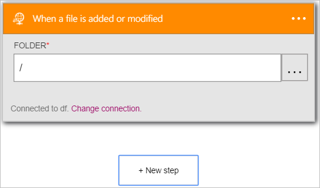

<properties
pageTitle="Informazioni su come utilizzare il connettore FTP nelle App logica | Microsoft Azure"
description="Creare App logica con il servizio di Azure App. Connettersi al server FTP per gestire i file. È possibile eseguire diverse operazioni, ad esempio upload, aggiornare, ottenere ed eliminare i file nel server FTP."
services="logic-apps"   
documentationCenter=".net,nodejs,java"  
authors="msftman"   
manager="erikre"    
editor=""
tags="connectors" />

<tags
ms.service="logic-apps"
ms.devlang="multiple"
ms.topic="article"
ms.tgt_pltfrm="na"
ms.workload="integration"
ms.date="07/22/2016"
ms.author="deonhe"/>

# Iniziare a utilizzare il connettore FTP

Utilizzare il connettore FTP per monitorare, gestire e creare un file nel server FTP. 

Per utilizzare [un connettore](./apis-list.md), è innanzitutto necessario creare un'app di logica. È possibile iniziare creando [un'app di logica ora](../app-service-logic/app-service-logic-create-a-logic-app.md).

## Connettersi a FTP://

Prima che l'app logica poter accedere a qualsiasi servizio, è innanzitutto necessario creare una *connessione* al servizio. Una [connessione](./connectors-overview.md) fornisce la connettività tra un'app di logica e un altro servizio.  

### Creare una connessione a FTP

>[AZURE.INCLUDE [Steps to create a connection to FTP](../../includes/connectors-create-api-ftp.md)]

## Utilizzare un trigger FTP

Un trigger è un evento che può essere utilizzato per avviare il flusso di lavoro definita in un'app di logica. [Ulteriori informazioni sui trigger](../app-service-logic/app-service-logic-what-are-logic-apps.md#logic-app-concepts).  

>[AZURE.IMPORTANT]Il connettore FTP richiede un server FTP accessibili da Internet e configurato per l'utilizzo di passiva. Inoltre, il connettore FTP è **non è compatibile con impliciti FTPS (FTP su SSL)**. Il connettore FTP supporta solo espliciti FTPS (FTP su SSL).  

In questo esempio, verrà illustrato come utilizzare trigger **FTP - quando viene aggiunto o modificato un file** per avviare un flusso di lavoro app logica quando viene aggiunto a un file o modificato in un server FTP. In un esempio dell'organizzazione, è possibile utilizzare questo trigger per monitorare una cartella FTP per i nuovi file che rappresentano gli ordini dei clienti.  È quindi possibile utilizzare un'azione di connettore FTP, ad esempio **visualizzato il contenuto del file** per ottenere il contenuto dell'ordine per ulteriori elaborazioni e lo spazio di archiviazione nel database di ordini.

1. Immettere *ftp* nella casella di ricerca nella finestra di progettazione di applicazioni logica quindi selezionare il trigger **FTP - quando viene aggiunto o modificato un file**   
  
Apre il controllo **quando viene aggiunto o modificato un file**  
  
- Selezionare **…** disponibile sul lato destro del controllo. Verrà aperto il controllo di selezione cartella  
  
- Selezionare il **>** (freccia destra) e Sfoglia per individuare la cartella che si desidera eseguire il monitoraggio delle nuove o modificati file. Selezionare la cartella e osservare che la cartella ora è visualizzata nel controllo **cartella** .  
   

A questo punto, l'app logica è stato configurato con un trigger che avrà inizio esecuzione di altro trigger e azioni del flusso di lavoro in un file viene modificato o creato nella cartella FTP specifica. 

>[AZURE.NOTE]Per un'app di logica per il corretto funzionamento, deve contenere almeno un trigger e un'azione. Seguire la procedura descritta nella sezione per aggiungere un'azione.  

## Utilizzare un'azione FTP

Un'azione è un'operazione effettuata dal flusso di lavoro definita in un'app di logica. [Altre informazioni sulle operazioni](../app-service-logic/app-service-logic-what-are-logic-apps.md#logic-app-concepts).  

Dopo avere aggiunto un trigger, seguire questa procedura per aggiungere un'azione che verrà visualizzato il contenuto del file nuovo o modificato rilevati dal trigger.    

1. Selezionare **+ nuova azione** per aggiungere l'azione per ottenere il contenuto del file sul server FTP  
- Selezionare il collegamento **Aggiungi un'azione** .  
  
- Immettere *FTP* per cercare tutte le azioni di FTP.
- Selezionare l'azione da eseguire quando un file nuovo o modificato si trova nella cartella FTP **FTP - ottenere il contenuto del file** .      
  
**Ottenere il contenuto del file** si apre. **Nota**: verrà richiesto di autorizzare l'app logica per accedere all'account di server FTP se si è già stato in precedenza.  
   
- Selezionare il controllo **File** (lo spazio vuoto sotto **FILE***). In questo caso, è possibile utilizzare le varie proprietà del file nuove o modificate disponibili sul server FTP.  
- Selezionare l'opzione di **contenuto del File** .  
   
-  Il controllo viene aggiornato, che indica che l'azione **FTP - ottenere il contenuto del file** verrà visualizzato il *file del contenuto* del file sul server FTP nuovo o modificato.      
     
- Salvare il lavoro, quindi aggiungere un file nella cartella FTP per testare il flusso di lavoro.    

A questo punto, l'app logica è stato configurato con un trigger per monitorare una cartella su un server FTP e avviare il flusso di lavoro quando viene rilevato un nuovo file o un file modificato sul server FTP. 

L'app logica è stata configurata con un'azione per ottenere il contenuto del file nuovo o modificato.

A questo punto è possibile aggiungere un'altra azione, ad esempio l'azione di [SQL Server - Inserisci riga](./connectors-create-api-sqlazure.md#insert-row) per inserire il contenuto del file nuovo o modificato in una tabella di database SQL.  

## Dettagli tecnici

Ecco i dettagli di trigger, azioni e le risposte che supporta la connessione:

## Trigger FTP

FTP sono trigger seguenti:  

|Trigger | Descrizione|
|--- | ---|
|[Quando un file viene aggiunto o modificato](connectors-create-api-ftp.md#when-a-file-is-added-or-modified)|Questa operazione attiva un flusso quando un file viene aggiunto o modificato in una cartella.|

## Azioni FTP

FTP sono le azioni seguenti:

|Azione|Descrizione|
|--- | ---|
|[Ottenere i metadati di file](connectors-create-api-ftp.md#get-file-metadata)|Questa operazione Ottiene i metadati per un file.|
|[File di aggiornamento](connectors-create-api-ftp.md#update-file)|Questa operazione Aggiorna un file.|
|[Eliminare file](connectors-create-api-ftp.md#delete-file)|Questa operazione Elimina un file.|
|[Ottenere i metadati di file con percorso](connectors-create-api-ftp.md#get-file-metadata-using-path)|Questa operazione Ottiene i metadati di un file utilizzando il percorso.|
|[Ottenere contenuto del file con percorso](connectors-create-api-ftp.md#get-file-content-using-path)|Questa operazione Ottiene il contenuto di un file utilizzando il percorso.|
|[Ottenere il contenuto del file](connectors-create-api-ftp.md#get-file-content)|Questa operazione Ottiene il contenuto di un file.|
|[Creare file](connectors-create-api-ftp.md#create-file)|Questa operazione crea un file.|
|[Copiare file](connectors-create-api-ftp.md#copy-file)|Questa operazione copia un file a un server FTP.|
|[Elencare i file nella cartella](connectors-create-api-ftp.md#list-files-in-folder)|Questa operazione consente l'elenco dei file e le sottocartelle in una cartella.|
|[Elencare i file nella cartella radice](connectors-create-api-ftp.md#list-files-in-root-folder)|Questa operazione Ottiene l'elenco di file e le sottocartelle della cartella radice.|
|[Estrarre cartella](connectors-create-api-ftp.md#extract-folder)|Questa operazione estrae un file di archivio in una cartella (esempio: zip).|
### Dettagli di azione

Ecco i dettagli per le azioni e trigger per il connettore e le risposte:

### Ottenere i metadati di file
Questa operazione Ottiene i metadati per un file. 

|Nome della proprietà| Nome visualizzato|Descrizione|
| ---|---|---|
|ID *|File|Selezionare un file|

Un * indica che è necessaria una proprietà

#### Dettagli output

BlobMetadata

| Nome della proprietà | Tipo di dati |
|---|---|---|
|ID|stringa|
|Nome|stringa|
|DisplayName|stringa|
|Percorso|stringa|
|LastModified|stringa|
|Dimensioni|numero intero|
|MediaType|stringa|
|IsFolder|valore booleano|
|ETag|stringa|
|FileLocator|stringa|

### File di aggiornamento
Questa operazione Aggiorna un file. 

|Nome della proprietà| Nome visualizzato|Descrizione|
| ---|---|---|
|ID *|File|Selezionare un file|
|corpo *|Contenuto del file|Contenuto del file|

Un * indica che è necessaria una proprietà

#### Dettagli output

BlobMetadata

| Nome della proprietà | Tipo di dati |
|---|---|---|
|ID|stringa|
|Nome|stringa|
|DisplayName|stringa|
|Percorso|stringa|
|LastModified|stringa|
|Dimensioni|numero intero|
|MediaType|stringa|
|IsFolder|valore booleano|
|ETag|stringa|
|FileLocator|stringa|

### Eliminare file
Questa operazione Elimina un file. 

|Nome della proprietà| Nome visualizzato|Descrizione|
| ---|---|---|
|ID *|File|Selezionare un file|

Un * indica che è necessaria una proprietà

### Ottenere i metadati di file con percorso
Questa operazione Ottiene i metadati di un file utilizzando il percorso. 

|Nome della proprietà| Nome visualizzato|Descrizione|
| ---|---|---|
|percorso *|Percorso file|Selezionare un file|

Un * indica che è necessaria una proprietà

#### Dettagli output

BlobMetadata

| Nome della proprietà | Tipo di dati |
|---|---|---|
|ID|stringa|
|Nome|stringa|
|DisplayName|stringa|
|Percorso|stringa|
|LastModified|stringa|
|Dimensioni|numero intero|
|MediaType|stringa|
|IsFolder|valore booleano|
|ETag|stringa|
|FileLocator|stringa|

### Ottenere contenuto del file con percorso
Questa operazione Ottiene il contenuto di un file utilizzando il percorso. 

|Nome della proprietà| Nome visualizzato|Descrizione|
| ---|---|---|
|percorso *|Percorso file|Selezionare un file|

Un * indica che è necessaria una proprietà

### Ottenere il contenuto del file
Questa operazione Ottiene il contenuto di un file. 

|Nome della proprietà| Nome visualizzato|Descrizione|
| ---|---|---|
|ID *|File|Selezionare un file|

Un * indica che è necessaria una proprietà

### Creare file
Questa operazione crea un file. 

|Nome della proprietà| Nome visualizzato|Descrizione|
| ---|---|---|
|folderPath *|Percorso della cartella|Selezionare una cartella|
|nome *|Nome del file|Nome del file|
|corpo *|Contenuto del file|Contenuto del file|

Un * indica che è necessaria una proprietà

#### Dettagli output

BlobMetadata

| Nome della proprietà | Tipo di dati |
|---|---|---|
|ID|stringa|
|Nome|stringa|
|DisplayName|stringa|
|Percorso|stringa|
|LastModified|stringa|
|Dimensioni|numero intero|
|MediaType|stringa|
|IsFolder|valore booleano|
|ETag|stringa|
|FileLocator|stringa|

### Copiare file
Questa operazione copia un file a un server FTP. 

|Nome della proprietà| Nome visualizzato|Descrizione|
| ---|---|---|
|origine *|Url di origine|URL di file di origine|
|destinazione *|Percorso di file di destinazione|Percorso di file di destinazione, tra cui nome file di destinazione|
|sovrascrivere|Sovrascrivere?|Sovrascrive il file di destinazione se è impostata su "true"|

Un * indica che è necessaria una proprietà

#### Dettagli output

BlobMetadata

| Nome della proprietà | Tipo di dati |
|---|---|---|
|ID|stringa|
|Nome|stringa|
|DisplayName|stringa|
|Percorso|stringa|
|LastModified|stringa|
|Dimensioni|numero intero|
|MediaType|stringa|
|IsFolder|valore booleano|
|ETag|stringa|
|FileLocator|stringa|

### Quando un file viene aggiunto o modificato
Questa operazione attiva un flusso quando un file viene aggiunto o modificato in una cartella. 

|Nome della proprietà| Nome visualizzato|Descrizione|
| ---|---|---|
|ID cartella *|Cartella|Selezionare una cartella|

Un * indica che è necessaria una proprietà

### Elencare i file nella cartella
Questa operazione consente l'elenco dei file e le sottocartelle in una cartella. 

|Nome della proprietà| Nome visualizzato|Descrizione|
| ---|---|---|
|ID *|Cartella|Selezionare una cartella|

Un * indica che è necessaria una proprietà

#### Dettagli output

BlobMetadata

| Nome della proprietà | Tipo di dati |
|---|---|---|
|ID|stringa|
|Nome|stringa|
|DisplayName|stringa|
|Percorso|stringa|
|LastModified|stringa|
|Dimensioni|numero intero|
|MediaType|stringa|
|IsFolder|valore booleano|
|ETag|stringa|
|FileLocator|stringa|

### Elencare i file nella cartella radice
Questa operazione Ottiene l'elenco di file e le sottocartelle della cartella radice. 

Non sono presenti parametri per la chiamata

#### Dettagli output

BlobMetadata

| Nome della proprietà | Tipo di dati |
|---|---|---|
|ID|stringa|
|Nome|stringa|
|DisplayName|stringa|
|Percorso|stringa|
|LastModified|stringa|
|Dimensioni|numero intero|
|MediaType|stringa|
|IsFolder|valore booleano|
|ETag|stringa|
|FileLocator|stringa|

### Estrarre cartella
Questa operazione estrae un file di archivio in una cartella (esempio: zip). 

|Nome della proprietà| Nome visualizzato|Descrizione|
| ---|---|---|
|origine *|Percorso del file di archivio di origine|Percorso del file di archivio|
|destinazione *|Percorso della cartella di destinazione|Percorso della cartella di destinazione|
|sovrascrivere|Sovrascrivere?|Sovrascrive i file di destinazione se è impostata su "true"|

Un * indica che è necessaria una proprietà

#### Dettagli output

BlobMetadata

| Nome della proprietà | Tipo di dati |
|---|---|---|
|ID|stringa|
|Nome|stringa|
|DisplayName|stringa|
|Percorso|stringa|
|LastModified|stringa|
|Dimensioni|numero intero|
|MediaType|stringa|
|IsFolder|valore booleano|
|ETag|stringa|
|FileLocator|stringa|

## Risposte HTTP

Le azioni e trigger sopra può restituire una o più delle seguenti codici di stato HTTP: 

|Nome|Descrizione|
|---|---|
|200|Ok|
|202|Accettato dall'utente|
|400|Richiesta non valida|
|401|Non autorizzato|
|403|Accesso negato|
|404|Non trovato|
|500|Errore interno del Server. Errore sconosciuto.|
|impostazione predefinita|Operazione non è riuscita.|

## Passaggi successivi
[Creare un'app di logica](../app-service-logic/app-service-logic-create-a-logic-app.md)