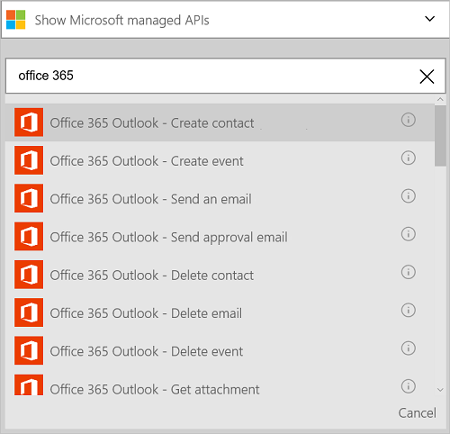

<properties
    pageTitle="Aggiunta di Office 365 Outlook connector nelle applicazioni logica | Microsoft Azure"
    description="Creare App logica con connettore di Office 365 per l'interazione con Office 365. Ad esempio: creazione, modifica e aggiornamento dei contatti e gli elementi del calendario."
    services=""    
    documentationCenter=""     
    authors="MandiOhlinger"    
    manager="anneta"    
    editor="" 
    tags="connectors" />

<tags
ms.service="logic-apps"
ms.devlang="na"
ms.topic="article"
ms.tgt_pltfrm="na"
ms.workload="integration"
ms.date="10/18/2016"
ms.author="mandia"/>

# Guida introduttiva a Office 365 Outlook connector 

Office 365 Outlook connector consente l'interazione con Outlook in Office 365. Utilizzare questo connettore per creare, modificare e aggiornare i contatti e gli elementi del calendario e anche a disposizione, inviare e rispondere alla posta elettronica.

Con Office 365 Outlook è:

- Creare il flusso di lavoro usando le caratteristiche di posta elettronica e calendario in Office 365. 
- Utilizzare trigger per avviare il flusso di lavoro quando c'è un nuovo messaggio di posta elettronica, quando viene aggiornato un elemento del calendario e altro ancora.
- Utilizzare azioni per inviare un messaggio di posta elettronica, creare un nuovo evento del calendario e altro ancora. Ad esempio, quando arriva un nuovo oggetto in Salesforce (trigger), inviare un messaggio di posta elettronica a Office 365 Outlook (un'azione). 

In questo argomento viene illustrato come utilizzare Office 365 Outlook connector in un'app di logica e sono elencati anche i trigger e azioni.

>[AZURE.NOTE] Questa versione dell'articolo si applica alla disponibilità generale App logica (GA).

Per ulteriori informazioni su come logica App, vedere [quali sono le applicazioni di logica](../app-service-logic/app-service-logic-what-are-logic-apps.md) e [creare un'app di logica](../app-service-logic/app-service-logic-create-a-logic-app.md).

## Connettersi a Office 365

Prima che l'app logica poter accedere a qualsiasi servizio, è prima di tutto creare una *connessione* al servizio. Una connessione fornisce la connettività tra un'app di logica e un altro servizio. Ad esempio, per connettersi a Office 365 Outlook, è necessario innanzitutto una *connessione*a Office 365. Per creare una connessione, immettere le credenziali che generalmente vengono utilizzati per accedere al servizio che si desidera connettersi. Pertanto con Office 365 Outlook, immettere le credenziali dell'account di Office 365 per creare la connessione.

## Creare la connessione

>[AZURE.INCLUDE [Steps to create a connection to Office 365](../../includes/connectors-create-api-office365-outlook.md)]

## Utilizzare un trigger

Un trigger è un evento che può essere utilizzato per avviare il flusso di lavoro definita in un'app di logica. Trigger "sondaggio" il servizio in un intervallo e la frequenza con cui vuole. [Ulteriori informazioni sui trigger](../app-service-logic/app-service-logic-what-are-logic-apps.md#logic-app-concepts).

1. Nell'applicazione di logica, digitare "office 365" per ottenere un elenco di trigger:  

    

2. Selezionare **Office 365 Outlook - breve avvio di un evento in scadenza**. Se esiste già una connessione, selezionare un calendario dall'elenco a discesa.

    

    Se viene chiesto di effettuare l'accesso, immettere il segno di informazioni per creare la connessione. [Creare la connessione](connectors-create-api-office365-outlook.md#create-the-connection) in questo argomento viene illustrata la procedura. 

    > [AZURE.NOTE] In questo esempio, l'app logica viene eseguita quando un evento del calendario viene aggiornato. Per visualizzare i risultati di questo trigger, aggiungere un'altra azione che invia un messaggio di testo. Ad esempio, aggiungere l'azione Twilio *Invia messaggio di* tale testo quando l'evento del calendario viene avviato in 15 minuti. 

3. Selezionare il pulsante **Modifica** e impostare i valori di **frequenza** e **intervallo** . Ad esempio, se si desidera che il trigger al sondaggio ogni 15 minuti, quindi impostare la **frequenza** al **minuto**e impostare l' **intervallo** di **15**. 

    

4. **Salvare** le modifiche (superiore sinistro della barra degli strumenti). L'app logica verrà salvata e può essere attivata automaticamente.

## Utilizzare un'azione

Un'azione è un'operazione effettuata dal flusso di lavoro definita in un'app di logica. [Altre informazioni sulle operazioni](../app-service-logic/app-service-logic-what-are-logic-apps.md#logic-app-concepts).

1. Selezionare il segno di addizione. Viene visualizzato selezionare diverse opzioni: **aggiungere un'azione**, **aggiungere una condizione**o una delle **altre** opzioni.

    

2. Scegliere **Aggiungi un'azione**.

3. Nella casella di testo digitare "office 365" per ottenere un elenco di tutte le azioni disponibili.

     

4. In questo esempio, scegliere **Office 365 Outlook - Crea contatto**. Se esiste già una connessione, scegliere l' **ID della cartella**, **nome**e altre proprietà:  

    

    Se viene chiesto di immettere le informazioni di connessione, quindi immettere i dettagli per creare la connessione. [Creare la connessione](connectors-create-api-office365-outlook.md#create-the-connection) in questo argomento sono descritte le proprietà. 

    > [AZURE.NOTE] In questo esempio è creare un nuovo contatto in Office 365 Outlook. È possibile utilizzare output da un altro trigger per creare il contatto. Aggiungere, ad esempio, il trigger SalesForce *quando viene creato un oggetto* . Aggiungere l'azione di Office 365 Outlook *Crea contatto* che utilizza i campi di SalesForce per creare il nuovo contatto di nuovo in Office 365. 

5. **Salvare** le modifiche (superiore sinistro della barra degli strumenti). L'app logica verrà salvata e può essere attivata automaticamente.

## Dettagli tecnici

Ecco i dettagli di trigger, azioni e le risposte che supporta la connessione:

## Trigger di Office 365

|Trigger | Descrizione|
|--- | ---|
|[Avvio non appena un evento in scadenza](connectors-create-api-office365-outlook.md#when-an-upcoming-event-is-starting-soon)|Questa operazione avvia un flusso all'avvio di un evento del calendario imminenti.|
|[Quando arriva un nuovo messaggio](connectors-create-api-office365-outlook.md#when-a-new-email-arrives)|Questa operazione attiva un flusso quando arriva un nuovo messaggio|
|[Quando viene creato un nuovo evento](connectors-create-api-office365-outlook.md#when-a-new-event-is-created)|Questa operazione avvia un flusso di creazione di un nuovo evento in un calendario.|
|[Quando si modifica un evento](connectors-create-api-office365-outlook.md#when-an-event-is-modified)|Questa operazione avvia un flusso di un evento viene modificato in un calendario.|

## Azioni di Office 365

|Azione|Descrizione|
|--- | ---|
|[Ottenere messaggi di posta elettronica](connectors-create-api-office365-outlook.md#get-emails)|Questa operazione consente di messaggi di posta elettronica da una cartella.|
|[Inviare un messaggio di posta elettronica](connectors-create-api-office365-outlook.md#send-an-email)|Questa operazione Invia un messaggio di posta elettronica.|
|[Eliminare la posta elettronica](connectors-create-api-office365-outlook.md#delete-email)|Questa operazione Elimina messaggio di posta elettronica tramite l'id.|
|[Segna come già letto](connectors-create-api-office365-outlook.md#mark-as-read)|Questa operazione contrassegna un messaggio di posta elettronica come letti.|
|[Rispondere al messaggio di posta elettronica](connectors-create-api-office365-outlook.md#reply-to-email)|Questa operazione risponde a un messaggio di posta elettronica.|
|[Ottenere allegato](connectors-create-api-office365-outlook.md#get-attachment)|Questa operazione consente di un allegato di posta elettronica tramite l'id.|
|[Inviare posta elettronica con le opzioni](connectors-create-api-office365-outlook.md#send-email-with-options)|Questa operazione Invia un messaggio di posta elettronica con più opzioni e che venga per il destinatario rispondere con una delle opzioni.|
|[Inviare posta elettronica di approvazione](connectors-create-api-office365-outlook.md#send-approval-email)|Questa operazione Invia un messaggio di posta elettronica di approvazione e attesa di una risposta dal destinatario.|
|[Ottenere i calendari](connectors-create-api-office365-outlook.md#get-calendars)|Questa operazione sono elencati i calendari disponibili.|
|[Ottenere gli eventi](connectors-create-api-office365-outlook.md#get-events)|Questa operazione Ottiene gli eventi da un calendario.|
|[Creazione di evento](connectors-create-api-office365-outlook.md#create-event)|Questa operazione crea un nuovo evento in un calendario.|
|[Ottenere evento](connectors-create-api-office365-outlook.md#get-event)|Questa operazione consente di un evento specifico da un calendario.|
|[Eliminare l'evento](connectors-create-api-office365-outlook.md#delete-event)|Questa operazione consente di eliminare un evento in un calendario.|
|[Aggiornare l'evento](connectors-create-api-office365-outlook.md#update-event)|Questa operazione Aggiorna un evento in un calendario.|
|[Visualizzare cartelle di contatti](connectors-create-api-office365-outlook.md#get-contact-folders)|Questa operazione Elenca le cartelle di contatti disponibili.|
|[Recuperare i contatti](connectors-create-api-office365-outlook.md#get-contacts)|Questa operazione consente di contatti da una cartella di contatti.|
|[Crea contatto](connectors-create-api-office365-outlook.md#create-contact)|Questa operazione crea un nuovo contatto in una cartella di contatti.|
|[Ottenere contatti](connectors-create-api-office365-outlook.md#get-contact)|Questa operazione consente di un contatto specifico da una cartella di contatti.|
|[Eliminazione di contatto](connectors-create-api-office365-outlook.md#delete-contact)|Questa operazione Elimina un contatto da una cartella di contatti.|
|[Aggiorna contatto](connectors-create-api-office365-outlook.md#update-contact)|Questa operazione Aggiorna un contatto in una cartella di contatti.|

### Informazioni dettagliate su trigger e azione

In questa sezione, vedere i dettagli specifici di ogni trigger e azione, inclusi eventuali proprietà input obbligatorio o facoltativo e qualsiasi output corrispondente associato al connettore.

#### Avvio non appena un evento in scadenza
Questa operazione avvia un flusso all'avvio di un evento del calendario imminenti. 

|Nome della proprietà| Nome visualizzato|Descrizione|
| ---|---|---|
|tabella *|Id calendario|Identificatore univoco del calendario|
|lookAheadTimeInMinutes|Aspetto Avanti ora|Ora (in minuti) per visualizzare in anticipo gli eventi imminenti|

Un asterisco (*) indica che la proprietà è obbligatoria.

##### Dettagli output
CalendarItemsList: L'elenco di elementi del calendario

| Nome della proprietà | Tipo di dati | Descrizione |
|---|---|---|
|valore|in forma di matrice|Elenco di elementi del calendario|

#### Ottenere messaggi di posta elettronica
Questa operazione consente di messaggi di posta elettronica da una cartella. 

|Nome della proprietà| Nome visualizzato|Descrizione|
| ---|---|---|
|folderPath|Percorso della cartella|Percorso della cartella per recuperare i messaggi di posta elettronica (impostazione predefinita: "Posta in arrivo")|
|In alto|In alto|Numero di messaggi di posta elettronica per recuperare (impostazione predefinita: 10)|
|fetchOnlyUnread|Recuperare solo i messaggi non letti|Recuperare solo i messaggi non letti?|
|includeAttachments|Includere allegati|Se è impostato su true, allegati anche da recuperare insieme messaggio di posta elettronica|
|searchQuery|Query di ricerca|Query di ricerca per filtrare i messaggi di posta elettronica|
|Ignora|Ignora|Numero di messaggi di posta elettronica per ignorare (impostazione predefinita: 0)|
|skipToken|Ignora Token|Passare token a recupero nuova pagina|

Un asterisco (*) indica che la proprietà è obbligatoria.

##### Dettagli output
ReceiveMessage: Del messaggio di posta elettronica

| Nome della proprietà | Tipo di dati | Descrizione |
|---|---|---|
|Da|stringa|Da|
|A|stringa|A|
|Oggetto|stringa|Oggetto|
|Corpo|stringa|Corpo|
|Importanza|stringa|Importanza|
|HasAttachment|valore booleano|Con allegati|
|ID|stringa|Id messaggio|
|IsRead|valore booleano|Lettura|
|DateTimeReceived|stringa|Data ora ricevuto|
|Allegati|in forma di matrice|Allegati|
|Cc|stringa|Specificare gli indirizzi di posta elettronica separati da punti e virgola comesomeone@contoso.com|
|Destinatari in Ccn|stringa|Specificare gli indirizzi di posta elettronica separati da punti e virgola comesomeone@contoso.com|
|IsHtml|valore booleano|Formato HTML|

#### Inviare un messaggio di posta elettronica
Questa operazione Invia un messaggio di posta elettronica. 

|Nome della proprietà| Nome visualizzato|Descrizione|
| ---|---|---|
|emailMessage *|Posta elettronica|Posta elettronica|

Un asterisco (*) indica che la proprietà è obbligatoria.

##### Dettagli output
Nessuno.

#### Eliminare la posta elettronica
Questa operazione Elimina messaggio di posta elettronica tramite l'id. 

|Nome della proprietà| Nome visualizzato|Descrizione|
| ---|---|---|
|ID messaggio *|Id messaggio|ID del messaggio di posta elettronica da eliminare|

Un asterisco (*) indica che la proprietà è obbligatoria.

##### Dettagli output
Nessuno.

#### Segna come già letto
Questa operazione contrassegna un messaggio di posta elettronica come letti. 

|Nome della proprietà| Nome visualizzato|Descrizione|
| ---|---|---|
|ID messaggio *|Id messaggio|ID della posta elettronica a essere contrassegnati come letti|

Un asterisco (*) indica che la proprietà è obbligatoria.

##### Dettagli output
Nessuno.

#### Rispondere al messaggio di posta elettronica
Questa operazione risponde a un messaggio di posta elettronica. 

|Nome della proprietà| Nome visualizzato|Descrizione|
| ---|---|---|
|ID messaggio *|Id messaggio|ID della posta elettronica a rispondere a|
|commento *|Commento|Commento di risposta|
|Rispondi a tutti|Rispondi a tutti|Rispondere a tutti i destinatari|

Un asterisco (*) indica che la proprietà è obbligatoria.

##### Dettagli output
Nessuno.

#### Ottenere allegato
Questa operazione consente di un allegato di posta elettronica tramite l'id. 

|Nome della proprietà| Nome visualizzato|Descrizione|
| ---|---|---|
|ID messaggio *|Id messaggio|ID del messaggio di posta elettronica|
|attachmentId *|Id allegato|ID dell'allegato per il download|

Un asterisco (*) indica che la proprietà è obbligatoria.

##### Dettagli output
Nessuno.

#### Quando arriva un nuovo messaggio
Questa operazione attiva un flusso quando arriva un nuovo messaggio.

|Nome della proprietà| Nome visualizzato|Descrizione|
| ---|---|---|
|folderPath|Percorso della cartella|Cartella di posta elettronica da recuperare (impostazione predefinita: posta in arrivo)|
|A|A|Indirizzi di posta elettronica del destinatario|
|Da|Da|Da indirizzo|
|importanza|Importanza|Priorità del messaggio di posta elettronica (ad alta, normale, bassa) (impostazione predefinita: normale)|
|fetchOnlyWithAttachment|Con allegati|Recuperare solo i messaggi di posta elettronica con un allegato|
|includeAttachments|Includere allegati|Includere allegati|
|subjectFilter|Oggetto filtro|Stringa da ricercare nell'oggetto|

Un asterisco (*) indica che la proprietà è obbligatoria.

##### Dettagli output
TriggerBatchResponse [ReceiveMessage]

| Nome della proprietà | Tipo di dati |
|---|---|
|valore|in forma di matrice|

#### Inviare posta elettronica con le opzioni
Questa operazione Invia un messaggio di posta elettronica con più opzioni e che venga per il destinatario rispondere con una delle opzioni. 

|Nome della proprietà| Nome visualizzato|Descrizione|
| ---|---|---|
|optionsEmailSubscription *|Richiesta di sottoscrizione per la posta elettronica di opzioni|Richiesta di sottoscrizione per la posta elettronica di opzioni|

Un asterisco (*) indica che la proprietà è obbligatoria.

##### Dettagli output
SubscriptionResponse: Modello per sottoscrizione tramite posta elettronica di approvazione

| Nome della proprietà | Tipo di dati | Descrizione |
|---|---|---|
|ID|stringa|ID della sottoscrizione|
|risorsa|stringa|Risorsa della richiesta di registrazione|
|notificationType|stringa|Tipo di notifica|
|notificationUrl|stringa|Url di notifica|

#### Inviare posta elettronica di approvazione
Questa operazione Invia un messaggio di posta elettronica di approvazione e attesa di una risposta dal destinatario. 

|Nome della proprietà| Nome visualizzato|Descrizione|
| ---|---|---|
|approvalEmailSubscription *|Richiesta di sottoscrizione per la posta elettronica di approvazione|Richiesta di sottoscrizione per la posta elettronica di approvazione|

Un asterisco (*) indica che la proprietà è obbligatoria.

##### Dettagli output
SubscriptionResponse: Modello per sottoscrizione tramite posta elettronica di approvazione

| Nome della proprietà | Tipo di dati | Descrizione |
|---|---|---|
|ID|stringa|ID della sottoscrizione|
|risorsa|stringa|Risorsa della richiesta di registrazione|
|notificationType|stringa|Tipo di notifica|
|notificationUrl|stringa|Url di notifica|

#### Ottenere i calendari
Questa operazione sono elencati i calendari disponibili. 

Non sono presenti parametri per la chiamata.

##### Dettagli output
TablesList

| Nome della proprietà | Tipo di dati |
|---|---|
|valore|in forma di matrice|

#### Ottenere gli eventi
Questa operazione Ottiene gli eventi da un calendario. 

|Nome della proprietà| Nome visualizzato|Descrizione|
| ---|---|---|
|tabella *|Id calendario|Selezionare un calendario|
|$filter|Query del filtro|Una query di filtro ODATA per limitare le voci restituite|
|$orderby|Order By|Una query di orderBy ODATA per specificare l'ordine delle voci|
|$skip|Ignora conteggio|Numero di voci per ignorare (impostazione predefinita = 0)|
|$top|Numero massimo Get|Numero massimo di voci per recuperare (impostazione predefinita = 256)|

Un asterisco (*) indica che la proprietà è obbligatoria.

##### Dettagli output
CalendarEventList: L'elenco di elementi del calendario

| Nome della proprietà | Tipo di dati | Descrizione |
|---|---|---|
|valore|in forma di matrice|Elenco di elementi del calendario|

#### Creazione di evento
Questa operazione crea un nuovo evento in un calendario. 

|Nome della proprietà| Nome visualizzato|Descrizione|
| ---|---|---|
|tabella *|Id calendario|Selezionare un calendario|
|elemento *|Elemento|Evento da creare|

Un asterisco (*) indica che la proprietà è obbligatoria.

##### Dettagli output
CalendarEvent: Classe di modello di connettore calendario specifico evento.

| Nome della proprietà | Tipo di dati | Descrizione |
|---|---|---|
|ID|stringa|Identificatore univoco dell'evento.|
|Partecipanti|in forma di matrice|Elenco dei partecipanti per l'evento.|
|Corpo|non è definito|Corpo del messaggio associato all'evento.|
|BodyPreview|stringa|Anteprima del messaggio associato all'evento.|
|Categorie|in forma di matrice|Le categorie associate all'evento.|
|ChangeKey|stringa|Identifica la versione dell'oggetto evento. Ogni volta che viene modificata l'evento, viene modificato anche ChangeKey.|
|DateTimeCreated|stringa|Data e ora in cui è stato creato l'evento.|
|DateTimeLastModified|stringa|Data e ora dell'ultima modifica all'evento.|
|Fine|stringa|Ora di fine dell'evento.|
|EndTimeZone|stringa|Specifica il fuso orario della riunione ora di fine. Questo valore deve essere come definito di Windows (esempio: 'Pacifico').|
|HasAttachments|valore booleano|Impostato su true se l'evento con allegati.|
|Importanza|stringa|La priorità dell'evento: bassa, normale o alta.|
|IsAllDay|valore booleano|Impostato su true se l'evento dura giornata intera.|
|IsCancelled|valore booleano|Impostato su true se l'evento è stato annullato.|
|IsOrganizer|valore booleano|Impostato su true se il mittente del messaggio viene inoltre l'organizzatore.|
|Posizione|non è definito|La posizione dell'evento.|
|Raccolta multimediale|non è definito|L'organizzatore dell'evento.|
|Ricorrenza|non è definito|Il criterio di ricorrenza per l'evento.|
|Promemoria|numero intero|Tempo in minuti prima dell'inizio evento per ricordare.|
|ResponseRequested|valore booleano|Impostato su true se il mittente desidera una risposta quando l'evento viene accettato o rifiutato.|
|ResponseStatus|non è definito|Indica il tipo di risposta inviata in risposta a un messaggio di evento.|
|SeriesMasterId|stringa|Identificatore univoco per il tipo di evento serie Master.|
|ShowAs|stringa|Mostra come la disponibilità.|
|Inizio|stringa|Ora di inizio dell'evento.|
|StartTimeZone|stringa|Specifica l'ora ora di inizio orario della riunione. Questo valore deve essere come definito di Windows (esempio: "Pacifico").|
|Oggetto|stringa|Oggetto evento.|
|Tipo|stringa|Il tipo di evento: singola istanza, occorrenza, eccezione o serie di schema.|
|Link Web|stringa|Anteprima del messaggio associato all'evento.|

#### Ottenere evento
Questa operazione consente di un evento specifico da un calendario. 

|Nome della proprietà| Nome visualizzato|Descrizione|
| ---|---|---|
|tabella *|Id calendario|Selezionare un calendario|
|ID *|Id elemento|Selezionare un evento|

Un asterisco (*) indica che la proprietà è obbligatoria.

##### Dettagli output
CalendarEvent: Classe di modello di connettore calendario specifico evento.

| Nome della proprietà | Tipo di dati | Descrizione |
|---|---|---|
|ID|stringa|Identificatore univoco dell'evento.|
|Partecipanti|in forma di matrice|Elenco dei partecipanti per l'evento.|
|Corpo|non è definito|Corpo del messaggio associato all'evento.|
|BodyPreview|stringa|Anteprima del messaggio associato all'evento.|
|Categorie|in forma di matrice|Le categorie associate all'evento.|
|ChangeKey|stringa|Identifica la versione dell'oggetto evento. Ogni volta che viene modificata l'evento, viene modificato anche ChangeKey.|
|DateTimeCreated|stringa|Data e ora in cui è stato creato l'evento.|
|DateTimeLastModified|stringa|Data e ora dell'ultima modifica all'evento.|
|Fine|stringa|Ora di fine dell'evento.|
|EndTimeZone|stringa|Specifica il fuso orario della riunione ora di fine. Questo valore deve essere come definito di Windows (esempio: 'Pacifico').|
|HasAttachments|valore booleano|Impostato su true se l'evento con allegati.|
|Importanza|stringa|La priorità dell'evento: bassa, normale o alta.|
|IsAllDay|valore booleano|Impostato su true se l'evento dura giornata intera.|
|IsCancelled|valore booleano|Impostato su true se l'evento è stato annullato.|
|IsOrganizer|valore booleano|Impostato su true se il mittente del messaggio viene inoltre l'organizzatore.|
|Posizione|non è definito|La posizione dell'evento.|
|Raccolta multimediale|non è definito|L'organizzatore dell'evento.|
|Ricorrenza|non è definito|Il criterio di ricorrenza per l'evento.|
|Promemoria|numero intero|Tempo in minuti prima dell'inizio evento per ricordare.|
|ResponseRequested|valore booleano|Impostato su true se il mittente desidera una risposta quando l'evento viene accettato o rifiutato.|
|ResponseStatus|non è definito|Indica il tipo di risposta inviata in risposta a un messaggio di evento.|
|SeriesMasterId|stringa|Identificatore univoco per il tipo di evento serie Master.|
|ShowAs|stringa|Mostra come la disponibilità.|
|Inizio|stringa|Ora di inizio dell'evento.|
|StartTimeZone|stringa|Specifica l'ora ora di inizio orario della riunione. Questo valore deve essere come definito di Windows (esempio: "Pacifico").|
|Oggetto|stringa|Oggetto evento.|
|Tipo|stringa|Il tipo di evento: singola istanza, occorrenza, eccezione o serie di schema.|
|Link Web|stringa|Anteprima del messaggio associato all'evento.|

#### Eliminare l'evento
Questa operazione consente di eliminare un evento in un calendario. 

|Nome della proprietà| Nome visualizzato|Descrizione|
| ---|---|---|
|tabella *|Id calendario|Selezionare un calendario|
|ID *|ID|Selezionare un evento|

Un asterisco (*) indica che la proprietà è obbligatoria.

##### Dettagli output
Nessuno.

#### Aggiornare l'evento
Questa operazione Aggiorna un evento in un calendario. 

|Nome della proprietà| Nome visualizzato|Descrizione|
| ---|---|---|
|tabella *|Id calendario|Selezionare un calendario|
|ID *|ID|Selezionare un evento|
|elemento *|Elemento|Evento per l'aggiornamento|

Un asterisco (*) indica che la proprietà è obbligatoria.

##### Dettagli output
CalendarEvent: Classe di modello di connettore calendario specifico evento.

| Nome della proprietà | Tipo di dati | Descrizione |
|---|---|---|
|ID|stringa|Identificatore univoco dell'evento.|
|Partecipanti|in forma di matrice|Elenco dei partecipanti per l'evento.|
|Corpo|non è definito|Corpo del messaggio associato all'evento.|
|BodyPreview|stringa|Anteprima del messaggio associato all'evento.|
|Categorie|in forma di matrice|Le categorie associate all'evento.|
|ChangeKey|stringa|Identifica la versione dell'oggetto evento. Ogni volta che viene modificata l'evento, viene modificato anche ChangeKey.|
|DateTimeCreated|stringa|Data e ora in cui è stato creato l'evento.|
|DateTimeLastModified|stringa|Data e ora dell'ultima modifica all'evento.|
|Fine|stringa|Ora di fine dell'evento.|
|EndTimeZone|stringa|Specifica il fuso orario della riunione ora di fine. Questo valore deve essere come definito di Windows (esempio: 'Pacifico').|
|HasAttachments|valore booleano|Impostato su true se l'evento con allegati.|
|Importanza|stringa|La priorità dell'evento: bassa, normale o alta.|
|IsAllDay|valore booleano|Impostato su true se l'evento dura giornata intera.|
|IsCancelled|valore booleano|Impostato su true se l'evento è stato annullato.|
|IsOrganizer|valore booleano|Impostato su true se il mittente del messaggio viene inoltre l'organizzatore.|
|Posizione|non è definito|La posizione dell'evento.|
|Raccolta multimediale|non è definito|L'organizzatore dell'evento.|
|Ricorrenza|non è definito|Il criterio di ricorrenza per l'evento.|
|Promemoria|numero intero|Tempo in minuti prima dell'inizio evento per ricordare.|
|ResponseRequested|valore booleano|Impostato su true se il mittente desidera una risposta quando l'evento viene accettato o rifiutato.|
|ResponseStatus|non è definito|Indica il tipo di risposta inviata in risposta a un messaggio di evento.|
|SeriesMasterId|stringa|Identificatore univoco per il tipo di evento serie Master.|
|ShowAs|stringa|Mostra come la disponibilità.|
|Inizio|stringa|Ora di inizio dell'evento.|
|StartTimeZone|stringa|Specifica l'ora ora di inizio orario della riunione. Questo valore deve essere come definito di Windows (esempio: "Pacifico").|
|Oggetto|stringa|Oggetto evento.|
|Tipo|stringa|Il tipo di evento: singola istanza, occorrenza, eccezione o serie di schema.|
|Link Web|stringa|Anteprima del messaggio associato all'evento.|

#### Quando viene creato un nuovo evento
Questa operazione avvia un flusso di creazione di un nuovo evento in un calendario. 

|Nome della proprietà| Nome visualizzato|Descrizione|
| ---|---|---|
|tabella *|Id calendario|Selezionare un calendario|
|$filter|Query del filtro|Una query di filtro ODATA per limitare le voci restituite|
|$orderby|Order By|Una query di orderBy ODATA per specificare l'ordine delle voci|
|$skip|Ignora conteggio|Numero di voci per ignorare (impostazione predefinita = 0)|
|$top|Numero massimo Get|Numero massimo di voci per recuperare (impostazione predefinita = 256)|

Un asterisco (*) indica che la proprietà è obbligatoria.

##### Dettagli output
CalendarItemsList: L'elenco di elementi del calendario

| Nome della proprietà | Tipo di dati | Descrizione |
|---|---|---|
|valore|in forma di matrice|Elenco di elementi del calendario|

#### Quando si modifica un evento
Questa operazione avvia un flusso di un evento viene modificato in un calendario. 

|Nome della proprietà| Nome visualizzato|Descrizione|
| ---|---|---|
|tabella *|Id calendario|Selezionare un calendario|
|$filter|Query del filtro|Una query di filtro ODATA per limitare le voci restituite|
|$orderby|Order By|Una query di orderBy ODATA per specificare l'ordine delle voci|
|$skip|Ignora conteggio|Numero di voci per ignorare (impostazione predefinita = 0)|
|$top|Numero massimo Get|Numero massimo di voci per recuperare (impostazione predefinita = 256)|

Un asterisco (*) indica che la proprietà è obbligatoria.

##### Dettagli output
CalendarItemsList: L'elenco di elementi del calendario

| Nome della proprietà | Tipo di dati | Descrizione |
|---|---|---|
|valore|in forma di matrice|Elenco di elementi del calendario|

#### Visualizzare cartelle di contatti
Questa operazione Elenca le cartelle di contatti disponibili. 

Non sono presenti parametri per la chiamata.

##### Dettagli output
TablesList

| Nome della proprietà | Tipo di dati |
|---|---|
|valore|in forma di matrice|

#### Recuperare i contatti
Questa operazione consente di contatti da una cartella di contatti. 

|Nome della proprietà| Nome visualizzato|Descrizione|
| ---|---|---|
|tabella *|Id cartella|Identificatore univoco della cartella di contatti per recuperare|
|$filter|Query del filtro|Una query di filtro ODATA per limitare le voci restituite|
|$orderby|Order By|Una query di orderBy ODATA per specificare l'ordine delle voci|
|$skip|Ignora conteggio|Numero di voci per ignorare (impostazione predefinita = 0)|
|$top|Numero massimo Get|Numero massimo di voci per recuperare (impostazione predefinita = 256)|

Un asterisco (*) indica che la proprietà è obbligatoria.

##### Dettagli output
ContactList: L'elenco dei contatti

| Nome della proprietà | Tipo di dati | Descrizione |
|---|---|---|
|valore|in forma di matrice|Elenco di contatti|

#### Crea contatto
Questa operazione crea un nuovo contatto in una cartella di contatti. 

|Nome della proprietà| Nome visualizzato|Descrizione|
| ---|---|---|
|tabella *|Id cartella|Selezionare una cartella di contatti|
|elemento *|Elemento|Contatto per creare|

Un asterisco (*) indica che la proprietà è obbligatoria.

##### Dettagli output
Contatto: contatto

| Nome della proprietà | Tipo di dati | Descrizione |
|---|---|---|
|ID|stringa|Identificatore univoco del contatto.|
|Attributo ParentFolderId|stringa|L'ID della cartella padre del contatto|
|Data di nascita|stringa|Data di nascita del contatto.|
|Archivia|stringa|Il nome del contatto si trova sotto.|
|DisplayName|stringa|Nome visualizzato del contatto.|
|GivenName|stringa|Nome del contatto.|
|Iniziali|stringa|Iniziali del contatto.|
|MiddleName|stringa|Secondo nome del contatto.|
|Nome alternativo|stringa|Soprannome del contatto.|
|Cognome|stringa|Il cognome del contatto.|
|Titolo|stringa|Il titolo del contatto.|
|Generazione|stringa|Generazione del contatto.|
|EmailAddresses|in forma di matrice|Indirizzi di posta elettronica del contatto.|
|ImAddresses|in forma di matrice|(IM) indirizzi di messaggi immediati sul nome del contatto.|
|JobTitle|stringa|Posizione del contatto.|
|NomeSocietà|stringa|Il nome della società del contatto.|
|Reparto|stringa|Reparto del contatto.|
|OfficeLocation|stringa|La posizione di office sul nome del contatto.|
|Professionale|stringa|Attività professionale del contatto.|
|BusinessHomePage|stringa|Home page ufficio del contatto.|
|AssistantName|stringa|Il nome dell'Assistente del contatto.|
|Manager|stringa|Il nome del responsabile del contatto.|
|HomePhones|in forma di matrice|Numeri di telefono dell'abitazione del contatto.|
|BusinessPhones|in forma di matrice|Numeri di telefono del contatto commerciale|
|MobilePhone1|stringa|Numero di telefono cellulare del contatto.|
|IndirizzoAbitazione|non è definito|Abitazione del contatto.|
|Indirizzoufficio|non è definito|L'indirizzo dell'ufficio.|
|OtherAddress|non è definito|Altri indirizzi per il contatto.|
|YomiCompanyName|stringa|Nome del contatto società-versione fonetico giapponese.|
|YomiGivenName|stringa|Fonetico giapponese specificato nome (nome) del contatto.|
|YomiSurname|stringa|Giapponese-versione fonetico cognome () del contatto|
|Categorie|in forma di matrice|Le categorie associate al contatto.|
|ChangeKey|stringa|Identifica la versione dell'oggetto evento|
|DateTimeCreated|stringa|L'ora in cui è stato creato il contatto.|
|DateTimeLastModified|stringa|Ora che è stato modificato il contatto.|

#### Ottenere contatti
Questa operazione consente di un contatto specifico da una cartella di contatti. 

|Nome della proprietà| Nome visualizzato|Descrizione|
| ---|---|---|
|tabella *|Id cartella|Selezionare una cartella di contatti|
|ID *|Id elemento|Identificatore univoco di un contatto da recuperare|

Un asterisco (*) indica che la proprietà è obbligatoria.

##### Dettagli output
Contatto: contatto

| Nome della proprietà | Tipo di dati | Descrizione |
|---|---|---|
|ID|stringa|Identificatore univoco del contatto.|
|Attributo ParentFolderId|stringa|L'ID della cartella padre del contatto|
|Data di nascita|stringa|Data di nascita del contatto.|
|Archivia|stringa|Il nome del contatto si trova sotto.|
|DisplayName|stringa|Nome visualizzato del contatto.|
|GivenName|stringa|Nome del contatto.|
|Iniziali|stringa|Iniziali del contatto.|
|MiddleName|stringa|Secondo nome del contatto.|
|Nome alternativo|stringa|Soprannome del contatto.|
|Cognome|stringa|Il cognome del contatto.|
|Titolo|stringa|Il titolo del contatto.|
|Generazione|stringa|Generazione del contatto.|
|EmailAddresses|in forma di matrice|Indirizzi di posta elettronica del contatto.|
|ImAddresses|in forma di matrice|(IM) indirizzi di messaggi immediati sul nome del contatto.|
|JobTitle|stringa|Posizione del contatto.|
|NomeSocietà|stringa|Il nome della società del contatto.|
|Reparto|stringa|Reparto del contatto.|
|OfficeLocation|stringa|La posizione di office sul nome del contatto.|
|Professionale|stringa|Attività professionale del contatto.|
|BusinessHomePage|stringa|Home page ufficio del contatto.|
|AssistantName|stringa|Il nome dell'Assistente del contatto.|
|Manager|stringa|Il nome del responsabile del contatto.|
|HomePhones|in forma di matrice|Numeri di telefono dell'abitazione del contatto.|
|BusinessPhones|in forma di matrice|Numeri di telefono del contatto commerciale|
|MobilePhone1|stringa|Numero di telefono cellulare del contatto.|
|IndirizzoAbitazione|non è definito|Abitazione del contatto.|
|Indirizzoufficio|non è definito|L'indirizzo dell'ufficio.|
|OtherAddress|non è definito|Altri indirizzi per il contatto.|
|YomiCompanyName|stringa|Nome del contatto società-versione fonetico giapponese.|
|YomiGivenName|stringa|Fonetico giapponese specificato nome (nome) del contatto.|
|YomiSurname|stringa|Giapponese-versione fonetico cognome () del contatto|
|Categorie|in forma di matrice|Le categorie associate al contatto.|
|ChangeKey|stringa|Identifica la versione dell'oggetto evento|
|DateTimeCreated|stringa|L'ora in cui è stato creato il contatto.|
|DateTimeLastModified|stringa|Ora che è stato modificato il contatto.|

#### Eliminazione di contatto
Questa operazione Elimina un contatto da una cartella di contatti. 

|Nome della proprietà| Nome visualizzato|Descrizione|
| ---|---|---|
|tabella *|Id cartella|Selezionare una cartella di contatti|
|ID *|ID|Identificatore univoco del contatto da eliminare|

Un asterisco (*) indica che la proprietà è obbligatoria.

##### Dettagli output
Nessuno.

#### Aggiorna contatto
Questa operazione Aggiorna un contatto in una cartella di contatti. 

|Nome della proprietà| Nome visualizzato|Descrizione|
| ---|---|---|
|tabella *|Id cartella|Selezionare una cartella di contatti|
|ID *|ID|Identificatore univoco del contatto per l'aggiornamento|
|elemento *|Elemento|Contatto per l'aggiornamento|

Un asterisco (*) indica che la proprietà è obbligatoria.

##### Dettagli output
Contatto: contatto

| Nome della proprietà | Tipo di dati | Descrizione |
|---|---|---|
|ID|stringa|Identificatore univoco del contatto.|
|Attributo ParentFolderId|stringa|L'ID della cartella padre del contatto|
|Data di nascita|stringa|Data di nascita del contatto.|
|Archivia|stringa|Il nome del contatto si trova sotto.|
|DisplayName|stringa|Nome visualizzato del contatto.|
|GivenName|stringa|Nome del contatto.|
|Iniziali|stringa|Iniziali del contatto.|
|MiddleName|stringa|Secondo nome del contatto.|
|Nome alternativo|stringa|Soprannome del contatto.|
|Cognome|stringa|Il cognome del contatto.|
|Titolo|stringa|Il titolo del contatto.|
|Generazione|stringa|Generazione del contatto.|
|EmailAddresses|in forma di matrice|Indirizzi di posta elettronica del contatto.|
|ImAddresses|in forma di matrice|(IM) indirizzi di messaggi immediati sul nome del contatto.|
|JobTitle|stringa|Posizione del contatto.|
|NomeSocietà|stringa|Il nome della società del contatto.|
|Reparto|stringa|Reparto del contatto.|
|OfficeLocation|stringa|La posizione di office sul nome del contatto.|
|Professionale|stringa|Attività professionale del contatto.|
|BusinessHomePage|stringa|Home page ufficio del contatto.|
|AssistantName|stringa|Il nome dell'Assistente del contatto.|
|Manager|stringa|Il nome del responsabile del contatto.|
|HomePhones|in forma di matrice|Numeri di telefono dell'abitazione del contatto.|
|BusinessPhones|in forma di matrice|Numeri di telefono del contatto commerciale|
|MobilePhone1|stringa|Numero di telefono cellulare del contatto.|
|IndirizzoAbitazione|non è definito|Abitazione del contatto.|
|Indirizzoufficio|non è definito|L'indirizzo dell'ufficio.|
|OtherAddress|non è definito|Altri indirizzi per il contatto.|
|YomiCompanyName|stringa|Nome del contatto società-versione fonetico giapponese.|
|YomiGivenName|stringa|Fonetico giapponese specificato nome (nome) del contatto.|
|YomiSurname|stringa|Giapponese-versione fonetico cognome () del contatto|
|Categorie|in forma di matrice|Le categorie associate al contatto.|
|ChangeKey|stringa|Identifica la versione dell'oggetto evento|
|DateTimeCreated|stringa|L'ora in cui è stato creato il contatto.|
|DateTimeLastModified|stringa|Ora che è stato modificato il contatto.|

## Risposte HTTP

Le azioni e trigger sopra può restituire una o più delle seguenti codici di stato HTTP: 

|Nome|Descrizione|
|---|---|
|200|Ok|
|202|Accettato dall'utente|
|400|Richiesta non valida|
|401|Non autorizzato|
|403|Accesso negato|
|404|Non trovato|
|500|Errore interno del Server. Errore sconosciuto|
|impostazione predefinita|Operazione non è riuscita.|

## Passaggi successivi

[Creare un'app di logica](../app-service-logic/app-service-logic-create-a-logic-app.md). Esplorare gli altri connettori disponibili nelle App logica il nostro [elenco API](apis-list.md).