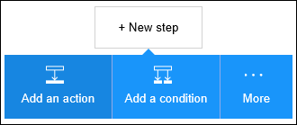

<properties
pageTitle="SMTP | Microsoft Azure"
description="Creare App logica con il servizio di Azure App. Connettersi a SMTP per l'invio di posta elettronica."
services="logic-apps"   
documentationCenter=".net,nodejs,java"  
authors="msftman"   
manager="erikre"    
editor=""
tags="connectors" />

<tags
ms.service="app-service-logic"
ms.devlang="multiple"
ms.topic="article"
ms.tgt_pltfrm="na"
ms.workload="integration"
ms.date="07/15/2016"
ms.author="deonhe"/>

# Iniziare a utilizzare il connettore SMTP

Connettersi a SMTP per l'invio di posta elettronica.

Per utilizzare [un connettore](./apis-list.md), è innanzitutto necessario creare un'app di logica. È possibile iniziare creando [un'app di logica ora](../app-service-logic/app-service-logic-create-a-logic-app.md).

## Connettersi a SMTP

Prima che l'app logica poter accedere a qualsiasi servizio, è innanzitutto necessario creare una *connessione* al servizio. Una [connessione](./connectors-overview.md) fornisce la connettività tra un'app di logica e un altro servizio. Ad esempio, per connettersi a SMTP, è necessario innanzitutto una *connessione*di SMTP. Per creare una connessione, è necessario fornire le credenziali che generalmente vengono utilizzati per accedere al servizio che si desidera connettersi. Quindi, nell'esempio SMTP necessarie le credenziali per il nome della connessione, l'indirizzo del server SMTP e informazioni di accesso utente per creare la connessione a SMTP. [Ulteriori informazioni sulle connessioni]()  

### Creare una connessione a SMTP

>[AZURE.INCLUDE [Steps to create a connection to SMTP](../../includes/connectors-create-api-smtp.md)]

## Utilizzare un trigger di SMTP

Un trigger è un evento che può essere utilizzato per avviare il flusso di lavoro definita in un'app di logica. [Ulteriori informazioni sui trigger](../app-service-logic/app-service-logic-what-are-logic-apps.md#logic-app-concepts).

In questo esempio, perché SMTP non dispone di un trigger della propria, si userà il trigger **Salesforce - quando viene creato un oggetto** . Questa condizione di attivazione viene attivata quando viene creato un nuovo oggetto in Salesforce. Nel caso dell'esempio è necessario configurarlo in modo che ogni volta che viene creato un nuovo cliente potenziale in Salesforce, si verifica un'azione *Invia messaggio di posta elettronica* tramite il connettore SMTP con una notifica del nuovo cliente potenziale da creare.

1. Immettere *salesforce* nella casella di ricerca nella finestra di progettazione di applicazioni logica, quindi selezionare il trigger **Salesforce - quando viene creato un oggetto** .  
   

2. Il controllo **quando viene creato un oggetto** viene visualizzato.
   

3. Selezionare il **Tipo di oggetto** , quindi selezionare *Lead* dall'elenco degli oggetti. In questo passaggio si indica che si sta creando un trigger che invierà una notifica ogni volta che viene creato un nuovo cliente potenziale in Salesforce l'app logica.  
   

4. Il trigger è stato creato.  
   

## Utilizzare un'azione SMTP

Un'azione è un'operazione effettuata dal flusso di lavoro definita in un'app di logica. [Altre informazioni sulle operazioni](../app-service-logic/app-service-logic-what-are-logic-apps.md#logic-app-concepts).

Ora che è stato aggiunto il trigger, seguire questa procedura per aggiungere un'azione SMTP che si verifica quando viene creato un nuovo cliente potenziale in Salesforce.

1. Selezionare **+ nuova azione** per aggiungere l'azione che si desidera eseguire quando viene creato un nuovo cliente potenziale.  
   

2. Selezionare **Aggiungi un'azione**. Verrà visualizzata la casella di ricerca in cui è possibile cercare qualsiasi azione si desidera eseguire.  
   

3. Immettere *SMTP, vedere* eseguire la ricerca per le azioni correlate SMTP.  

4. Selezionare **SMTP - invio di posta elettronica** come l'azione da eseguire quando viene creato il nuovo cliente potenziale. Si apre il blocco di controllo azione. È necessario stabilire la connessione smtp in blocco della finestra di progettazione se si è già stato in precedenza.  
     

5. Immettere le informazioni di posta elettronica desiderato nel blocco **SMTP - invio di posta elettronica** .  
   

6. Salvare il lavoro per attivare il flusso di lavoro.  

## Dettagli tecnici

Ecco i dettagli di trigger, azioni e le risposte che supporta la connessione:

## Trigger SMTP

SMTP non dispone di trigger. 

## Azioni SMTP

SMTP sono le seguenti azioni:

|Azione|Descrizione|
|--- | ---|
|[Inviare posta elettronica](connectors-create-api-smtp.md#send-email)|Questa operazione Invia un messaggio di posta elettronica a uno o più destinatari.|

### Dettagli di azione

Ecco i dettagli per l'azione di questo connettore, insieme alle relative risposte:

### Inviare posta elettronica
Questa operazione Invia un messaggio di posta elettronica a uno o più destinatari. 

|Nome della proprietà| Nome visualizzato|Descrizione|
| ---|---|---|
|A|A|Specificare gli indirizzi di posta elettronica separati da punti e virgola comerecipient1@domain.com;recipient2@domain.com|
|CC|cc|Specificare gli indirizzi di posta elettronica separati da punti e virgola comerecipient1@domain.com;recipient2@domain.com|
|Oggetto|Oggetto|Oggetto di posta elettronica|
|Corpo|Corpo|Corpo del messaggio di posta elettronica|
|Da|Da|Indirizzo di posta elettronica del mittente comesender@domain.com|
|IsHtml|Formato HTML|Inviare il messaggio di posta elettronica in formato HTML (vero/falso)|
|Destinatari in Ccn|destinatari in Ccn|Specificare gli indirizzi di posta elettronica separati da punti e virgola comerecipient1@domain.com;recipient2@domain.com|
|Importanza|Importanza|Priorità del messaggio di posta elettronica (alta, normale o bassa)|
|ContentData|Dati del contenuto di allegati|Dati di contenuto (base 64 codificato per i flussi e come-riguarda stringa)|
|ContentType|Tipo di contenuto di allegati|Tipo di contenuto|
|ContentTransferEncoding|Codifica di trasferimento contenuto allegati|Trasferire la codifica del contenuto (base 64 o nessuno)|
|FileName|Nome di File allegati|Nome del file|
|ContentId|ID contenuto di allegati|Id contenuto|

Un * indica che è necessaria una proprietà

## Risposte HTTP

Le azioni e trigger sopra può restituire una o più delle seguenti codici di stato HTTP: 

|Nome|Descrizione|
|---|---|
|200|Ok|
|202|Accettato dall'utente|
|400|Richiesta non valida|
|401|Non autorizzato|
|403|Accesso negato|
|404|Non trovato|
|500|Errore interno del Server. Errore sconosciuto.|
|impostazione predefinita|Operazione non è riuscita.|

## Passaggi successivi
[Creare un'app di logica](../app-service-logic/app-service-logic-create-a-logic-app.md)