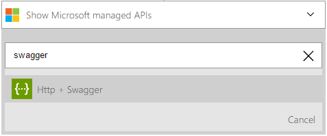

<properties
    pageTitle="Aggiungere il HTTP + Swagger azione nelle App logica | Microsoft Azure"
    description="Panoramica dell'HTTP + Swagger azione e attività operative"
    services=""
    documentationCenter=""
    authors="jeffhollan"
    manager="erikre"
    editor=""
    tags="connectors"/>

<tags
   ms.service="logic-apps"
   ms.devlang="na"
   ms.topic="article"
   ms.tgt_pltfrm="na"
   ms.workload="na"
   ms.date="07/18/2016"
   ms.author="jehollan"/>

# Guida introduttiva di HTTP + Swagger azione

Con il HTTP + Swagger azione, è possibile creare un connettore costrutto a qualsiasi endpoint resto tramite un [Swagger documento](https://swagger.io). È anche possibile estendere un'applicazione di logica per chiamare qualsiasi endpoint resto un'esperienza di progettazione di applicazioni logica prima classe.

Per iniziare a utilizzare il HTTP + Swagger azione in un'app di logica, vedere [creare una nuova app logica](../app-service-logic/app-service-logic-create-a-logic-app.md).

---

## Usa HTTP + Swagger come un trigger o un'azione

Il HTTP + Swagger trigger e azione funzionare uguale all' [azione HTTP](connectors-native-http.md) ma fornisce una migliore esperienza di progettazione, che mostra la forma di API e output nella finestra di progettazione da [Swagger metadati](https://swagger.io). Inoltre, è possibile utilizzare HTTP + Swagger come trigger. Se si desidera implementare un trigger di polling, è necessario seguono lo schema polling descritto in [creazione di una API personalizzata da utilizzare con le applicazioni di logica](../app-service-logic/app-service-logic-create-api-app.md#polling-triggers).

[Ulteriori informazioni sulle azioni e trigger app logica.](connectors-overview.md)

Ecco un esempio su come usare il protocollo HTTP + operazione Swagger come un'azione in un flusso di lavoro in un'app di logica.

1. Selezionare il pulsante **Nuova azione** .
2. Selezionare **Aggiungi un'azione**.
3. Nella casella di ricerca azione digitare **swagger** elenco HTTP + Swagger azione.

    

4. Digitare l'URL per un documento Swagger:
    - Per usare dalla finestra di progettazione di App logica, l'URL deve essere un endpoint HTTPS e CORS attivato.
    - Se il documento Swagger non soddisfa questo requisito, è possibile utilizzare [Lo spazio di archiviazione di Azure con CORS abilitato](#hosting-swagger-from-storage) per archiviare il documento.
5. Fare clic su **Avanti** per leggere e il rendering dal documento Swagger.
6. Aggiungere i parametri necessari per la chiamata HTTP.

    

1. Fare clic su **Salva** nell'angolo superiore sinistro della barra degli strumenti e logica app sarà entrambi Salva e pubblica (attiva).

### Host Swagger dallo spazio di archiviazione Azure

È consigliabile fare riferimento a un documento di Swagger che non è ospitato o che non soddisfa i requisiti di croce origine della finestra di progettazione e sicurezza. Per risolvere il problema, è possibile archiviare il documento Swagger in archiviazione Azure e Abilita CORS fare riferimento al documento.  

Ecco la procedura per creare, configurare e archiviare documenti Swagger in archiviazione Azure:

1. [Creare un account di archiviazione Azure con archiviazione Blob Azure](../storage/storage-create-storage-account.md). (A tale scopo, impostare le autorizzazioni di **accesso pubblico**).
2. Attivare il blob CORS. È possibile usare [questo script di PowerShell](https://github.com/logicappsio/EnableCORSAzureBlob/blob/master/EnableCORSAzureBlob.ps1) per configurare automaticamente tale impostazione.
3. Caricare il file Swagger nel blob. È possibile eseguire questa operazione dal [portale di Azure](https://portal.azure.com) o da uno strumento come [Explorer lo spazio di archiviazione Azure](http://storageexplorer.com/).
1. Fare riferimento a un collegamento HTTPS per il documento in archiviazione Blob Azure. (Il collegamento segue il formato `https://*storageAccountName*.blob.core.windows.net/*container*/*filename*`.)

## Dettagli tecnici

Ecco i dettagli per i trigger e le azioni che questo HTTP + Swagger supporta connettore.

## HTTP + trigger Swagger

Un trigger è un evento che può essere utilizzato per avviare il flusso di lavoro definite in un'app di logica. [Ulteriori informazioni sui trigger.](connectors-overview.md) Il HTTP + Swagger connettore dispone di un trigger.

|Trigger|Descrizione|
|---|---|
|HTTP + Swagger|Effettuare una chiamata HTTP e restituire il contenuto di risposta|

## HTTP + Swagger azioni

Un'azione è un'operazione che viene eseguita dal flusso di lavoro definite in un'app di logica. [Ulteriori informazioni sulle azioni.](connectors-overview.md) Il HTTP + Swagger connettore dispone di un'opzione possibile.

|Azione|Descrizione|
|---|---|
|HTTP + Swagger|Effettuare una chiamata HTTP e restituire il contenuto di risposta|

### Dettagli di azione

Il HTTP + Swagger connettore include un'opzione possibile. Di seguito è riportato informazioni su ognuna delle azioni, i campi di input obbligatori e facoltativi e i corrispondenti dettagli output associati all'uso.

#### HTTP + Swagger

Effettuare una richiesta HTTP in uscita con assistenza dei metadati Swagger.
Un asterisco (*) indica che un campo obbligatorio.

|Nome visualizzato|Nome della proprietà|Descrizione|
|---|---|---|
|Metodo *|metodo|Verbo HTTP da utilizzare.|
|URI *|URI|URI per la richiesta HTTP.|
|Intestazioni|intestazioni|Oggetto JSON di intestazioni HTTP da includere.|
|Corpo|corpo|Corpo della richiesta HTTP.|
|Autenticazione|autenticazione|Autenticazione da utilizzare per richiesta. [Per ulteriori informazioni, vedere la sezione HTTP](./connectors-native-http.md#authentication).|

**Dettagli output**

Risposta HTTP

|Nome della proprietà|Tipo di dati|Descrizione|
|---|---|---|
|Intestazioni|oggetto|Intestazioni di risposta|
|Corpo|oggetto|Oggetto risposta|
|Codice di stato|int|Codice di stato HTTP|

### Risposte HTTP

Quando si effettua chiamate a varie azioni, è possibile che venga visualizzato alcune risposte. Di seguito è una tabella in cui vengono illustrate le descrizioni e le risposte corrispondenti.

|Nome|Descrizione|
|---|---|
|200|Ok|
|202|Accettato dall'utente|
|400|Richiesta non valida|
|401|Non autorizzato|
|403|Accesso negato|
|404|Non trovato|
|500|Errore interno del server. Errore sconosciuto.|

---

## Passaggi successivi

Provare la piattaforma e [creare un'app logica](../app-service-logic/app-service-logic-create-a-logic-app.md) ora. È possibile esplorare altri connettori disponibili nelle App logica esaminando il nostro [elenco di API](apis-list.md).
