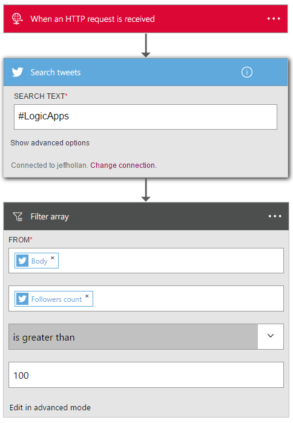

<properties
    pageTitle="Aggiungere l'azione di query nelle App logica | Microsoft Azure"
    description="Panoramica dell'azione query per l'esecuzione di operazioni, ad esempio in forma di matrice di filtro."
    services=""
    documentationCenter=""
    authors="jeffhollan"
    manager="erikre"
    editor=""
    tags="connectors"/>

<tags
   ms.service="logic-apps"
   ms.devlang="na"
   ms.topic="article"
   ms.tgt_pltfrm="na"
   ms.workload="na"
   ms.date="07/20/2016"
   ms.author="jehollan"/>

# Iniziare a utilizzare l'azione di query

Tramite l'azione di query, è possibile utilizzare batch e le matrici eseguire flussi di lavoro per:

- Creare un'attività per tutti i record con priorità alta da un database.
- Salva tutti gli allegati PDF per messaggi di posta elettronica in un archivio blob Azure.

Per iniziare a usare l'azione di query in un'app di logica, vedere [creare un'app di logica](../app-service-logic/app-service-logic-create-a-logic-app.md).

## Usare l'azione di query

Un'azione è un'operazione che viene eseguita dal flusso di lavoro definite in un'app di logica. [Altre informazioni sulle operazioni](connectors-overview.md).  

La query dell'azione sono attualmente un'operazione, definita matrice di filtro, che viene esposta nella finestra di progettazione. In questo modo è possibile eseguire query di una matrice e restituire un set di risultati filtrati.

Ecco come è possibile aggiungere in un'app di logica:

1. Selezionare il pulsante **Nuova azione** .
2. Scegliere **Aggiungi un'azione**.
3. Nella casella di ricerca azione digitare **filtro** per elencare l'azione **in forma di matrice di filtro** .

    

4. Selezionare una matrice da filtrare. (La schermata seguente mostra la matrice di risultati di una ricerca di Twitter).
5. Creare una condizione da valutare per ogni elemento. (La schermata seguente filtra TWEET dagli utenti che hanno più di 100 follower).

    

    L'azione verrà visualizzato un nuovo in forma di matrice che contiene solo i risultati che soddisfano i requisiti di filtro.
6. Fare clic su nell'angolo superiore sinistro della barra degli strumenti per salvare e l'app logica salvarli e pubblicare (attiva).

## Azione di query

Ecco i dettagli per l'azione che supporta il connettore. Il connettore include un'opzione possibile.

|Azione|Descrizione|
|---|---|
|Filtrare in forma di matrice|Restituisce una condizione per ogni elemento in una matrice e restituisce i risultati|

## Dettagli di azione

L'azione di query viene fornito con un'opzione possibile. Nelle tabelle seguenti vengono descrivono i campi di input obbligatori e facoltativi per l'azione e i corrispondenti dettagli output associate tramite l'azione.

### Filtrare in forma di matrice
Di seguito sono campi di input per l'azione, semplificando così una richiesta HTTP in uscita.
Risposte * significa che si tratti di un campo obbligatorio.

|Nome visualizzato|Nome della proprietà|Descrizione|
|---|---|---|
|Da *|Da|In forma di matrice per filtrare|
|Condizione *|dove|Condizione da valutare per ogni elemento|
 

### Dettagli output

Di seguito sono i dettagli di output per la risposta HTTP.

|Nome della proprietà|Tipo di dati|Descrizione|
|---|---|---|
|Matrice filtrata|in forma di matrice|Matrice che contiene un oggetto per ogni risultato filtrato|

## Passaggi successivi

A questo punto, provare a usare la piattaforma e [creare un'app di logica](../app-service-logic/app-service-logic-create-a-logic-app.md). È possibile esplorare altri connettori disponibili nelle App logica esaminando il nostro [elenco API](apis-list.md).
