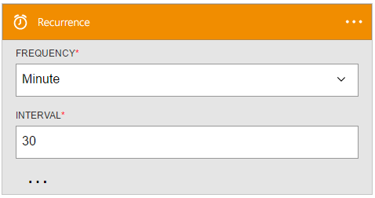

<properties
    pageTitle="Aggiungere il trigger ricorrenza nelle App logica | Microsoft Azure"
    description="Panoramica del trigger ricorrenza e come utilizzarlo con un'app di Azure logica."
    services=""
    documentationCenter=""
    authors="jeffhollan"
    manager="erikre"
    editor=""
    tags="connectors"/>

<tags
   ms.service="logic-apps"
   ms.devlang="na"
   ms.topic="article"
   ms.tgt_pltfrm="na"
   ms.workload="na"
   ms.date="07/18/2016"
   ms.author="jehollan"/>

# Guida introduttiva a trigger ricorrenza

Utilizzando i trigger di ricorrenza, è possibile creare flussi di lavoro potenti nel cloud.

Ad esempio, è possibile:

- Pianificare un flusso di lavoro per eseguire una stored procedure SQL ogni giorno.
- Inviare tramite posta elettronica di un riepilogo di tutti TWEET nell'ultima settimana su un determinato hashtag.

Per iniziare a usare i trigger di ricorrenza in un'app di logica, vedere [creare un'app di logica](../app-service-logic/app-service-logic-create-a-logic-app.md).

## Utilizzare un trigger di ricorrenza

Un trigger è un evento che può essere utilizzato per avviare il flusso di lavoro definite in un'app di logica. [Ulteriori informazioni sui trigger](connectors-overview.md).

Ecco una sequenza di esempio di come impostare un trigger di ricorrenza in un'app di logica:

1. Aggiungere il trigger **ricorrenza** come primo passaggio in un'app di logica.
2. Compilare i parametri per l'intervallo di ricorrenza.

L'app logica verrà avviato Esegui dopo ogni intervallo di tempo.

## Dettagli trigger

Trigger ricorrenza sono le seguenti proprietà che è possibile configurare.

Viene generato una app logica dopo un intervallo di tempo specificato.
Risposte * significa che si tratti di un campo obbligatorio.

|Nome visualizzato|Nome della proprietà|Descrizione|
|---|---|---|
|Frequenza *|frequenza|The unit of time: `Second`, `Minute`, `Hour`, `Day`, or `Year`.|
|Intervallo *|intervallo|L'intervallo di frequenza specificata per la ricorrenza.|
|Fuso orario|fuso orario|Se un'ora di inizio senza un fuso orario di riferimento, verrà utilizzato il fuso orario.|
|Ora di inizio|ora di inizio|Ora di inizio in [formato ISO 8601](https://en.wikipedia.org/wiki/ISO_8601#Combined_date_and_time_representations).|
 

## Passaggi successivi

A questo punto, provare a usare la piattaforma e [creare un'app di logica](../app-service-logic/app-service-logic-create-a-logic-app.md). È possibile esplorare altri connettori disponibili nelle App logica esaminando il nostro [elenco API](apis-list.md).
