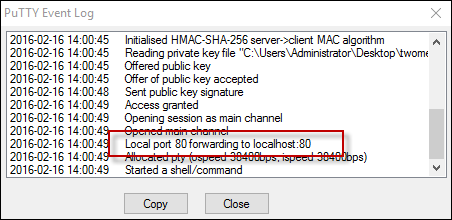

<properties
   pageTitle="Connettersi a un cluster di Azure contenitore servizio | Microsoft Azure"
   description="Connettersi a un cluster di Azure contenitore servizio tramite un tunnel SSH."
   services="container-service"
   documentationCenter=""
   authors="rgardler"
   manager="timlt"
   editor=""
   tags="acs, azure-container-service"
   keywords="Docker, contenitori, Micro-servizi, controller di dominio/sistema operativo, Azure"/>

<tags
   ms.service="container-service"
   ms.devlang="na"
   ms.topic="get-started-article"
   ms.tgt_pltfrm="na"
   ms.workload="na"
   ms.date="09/13/2016"
   ms.author="rogardle"/>


# <a name="connect-to-an-azure-container-service-cluster"></a>Connettersi a un cluster di servizio contenitore Azure

CC/sistema operativo e cluster Particle Swarm Docker distribuite dal servizio contenitore Azure esporre i punti finali resto. Tuttavia, questi endpoint non sono aperti all'esterno. Per gestire gli endpoint, è necessario creare un tunnel Secure Shell (SSH). Dopo un SSH tunnel è stata stabilita, è possibile eseguire i punti finali cluster comandi e visualizzare cluster dell'interfaccia utente tramite un browser sul proprio sistema. In questo documento illustra la creazione di un tunnel SSH da Linux, OS X e Windows.

>[AZURE.NOTE] È possibile creare una sessione SSH con un sistema di Gestione cluster. Tuttavia, non è consigliabile seguente. Lavoro direttamente in un sistema di gestione espone il rischio di modifiche alla configurazione non intenzionale.   

## <a name="create-an-ssh-tunnel-on-linux-or-os-x"></a>Creare un tunnel SSH per Linux o OS X

La prima cosa che quando si crea un tunnel SSH in OS X o Linux è individuare il nome DNS pubblico di bilanciamento del carico schemi. A tale scopo, espandere il gruppo di risorse in modo che ogni risorsa viene visualizzato. Individuare e selezionare l'indirizzo IP pubblico del master. Verrà aperta la blade che contiene le informazioni relative all'indirizzo IP pubblico, che include il nome DNS. Salvare questo nome per successivi utilizzi. <br />


Aprire una shell ed eseguire il seguente comando in cui:

**Porta** è la porta dell'endpoint che si desidera esporre. Per sciame, si tratta 2375. Per controller di dominio o il sistema operativo, utilizzare la porta 80.  
**Nomeutente** è il nome utente specificato al momento è stato distribuito il cluster.  
**DNSPREFIX** è il prefisso DNS fornito dall'utente per la distribuzione di cluster.  
**Area** è l'area in cui si trova il gruppo di risorse.  
**PATH_TO_PRIVATE_KEY** [Facoltativo] è il percorso per la chiave privata che corrisponde alla chiave pubblica fornite al momento della creazione del cluster il servizio contenitore. Utilizzare questa opzione con -i contrassegno.

```bash
ssh -L PORT:localhost:PORT -f -N [USERNAME]@[DNSPREFIX]mgmt.[REGION].cloudapp.azure.com -p 2200
```
> Porta di connessione SSH è 2200, ossia non la porta standard 22.

## <a name="dcos-tunnel"></a>Tunnel cc/OS

Per aprire un tunnel per gli endpoint controller di dominio, OS-correlate, eseguire un comando simile al seguente:

```bash
sudo ssh -L 80:localhost:80 -f -N azureuser@acsexamplemgmt.japaneast.cloudapp.azure.com -p 2200
```

È ora possibile accedere endpoint controller di dominio, OS-correlati in:

- CC/SISTEMA OPERATIVO:`http://localhost/`
- Marathon:`http://localhost/marathon`
- Mesos:`http://localhost/mesos`

Analogamente, è possibile contattare il resto API per ogni applicazione tramite questo tunnel.

## <a name="swarm-tunnel"></a>Tunnel sciame

Per aprire un tunnel all'endpoint sciame, eseguire un comando simile al seguente:

```bash
ssh -L 2375:localhost:2375 -f -N azureuser@acsexamplemgmt.japaneast.cloudapp.azure.com -p 2200
```

A questo punto è possibile impostare la variabile di ambiente DOCKER_HOST come indicato di seguito. È possibile continuare a utilizzare l'interfaccia di riga di comando Docker (CLI) come di consueto.

```bash
export DOCKER_HOST=:2375
```

## <a name="create-an-ssh-tunnel-on-windows"></a>Creare un tunnel SSH in Windows

Sono disponibili più opzioni per la creazione di tunnel SSH su Windows. In questo documento viene descritto come utilizzare PuTTY per eseguire questa operazione.

Scaricare PuTTY al sistema di Windows ed eseguire l'applicazione.

Immettere un nome host che include il nome utente di amministratore cluster e il nome DNS pubblico del primo schema del cluster. **Nome Host** sarà simile al seguente: `adminuser@PublicDNS`. Immettere 2200 per la **porta**.


Selezionare **SSH** e **l'autenticazione**. Aggiungere il file di chiave privata per l'autenticazione.


Selezionare **tunnel** e configurare le seguenti porte inoltro delle chiamate:
- **Porta di origine:** La preferenza - uso 80 per controller di dominio o il sistema operativo o 2375 per sciame.
- **Destinazione:** Utilizzare localhost:80 per controller di dominio/sistema operativo o localhost:2375 per sciame.

Nell'esempio seguente viene configurato per controller di dominio o il sistema operativo, ma sarà simile per Particle Swarm Docker.

>[AZURE.NOTE] Porte 80 non devono essere in uso quando si crea il tunnel.


Al termine, salvare la configurazione della connessione e connettere la sessione PuTTY. Quando effettua la connessione, è possibile visualizzare la configurazione della porta nel registro eventi PuTTY.



Quando è stata configurata tunnel per controller di dominio o il sistema operativo, è possibile accedere il punto finale correlato:

- CC/SISTEMA OPERATIVO:`http://localhost/`
- Marathon:`http://localhost/marathon`
- Mesos:`http://localhost/mesos`

Quando è stata configurata tunnel per Particle Swarm Docker, è possibile accedere cluster sciame tramite CLI Docker. È necessario innanzitutto configurare una variabile di ambiente Windows denominata `DOCKER_HOST` con un valore di ` :2375`.

## <a name="next-steps"></a>Passaggi successivi

Distribuire e gestire i contenitori con controller di dominio/OS o sciame:

- [Lavorare con il servizio contenitore Azure e controller di dominio/OS](container-service-mesos-marathon-rest.md)
- [Lavorare con il servizio di Azure contenitore e sciame Docker](container-service-docker-swarm.md)
