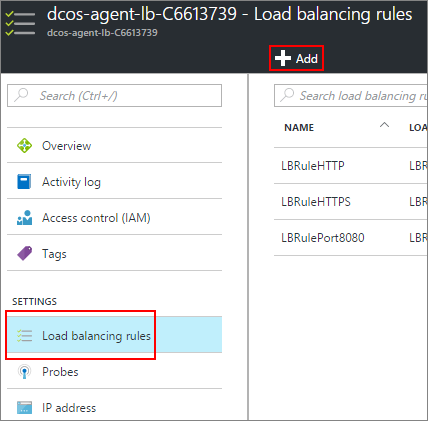

<properties
   pageTitle="Abilitare l'accesso pubblico a un'app ACS | Microsoft Azure"
   description="Informazioni su come attivare l'accesso a un servizio di contenitore Azure pubblico."
   services="container-service"
   documentationCenter=""
   authors="Thraka"
   manager="timlt"
   editor=""
   tags="acs, azure-container-service"
   keywords="Docker, contenitori, Micro-servizi, Mesos, Azure"/>

<tags
   ms.service="container-service"
   ms.devlang="na"
   ms.topic="article"
   ms.tgt_pltfrm="na"
   ms.workload="na"
   ms.date="08/26/2016"
   ms.author="timlt"/>

# Abilitare l'accesso pubblico a un'applicazione di servizio contenitore Azure

Qualsiasi contenitore controller di dominio/OS nel ACS [pool agente pubblico](container-service-mesos-marathon-ui.md#deploy-a-docker-formatted-container) automaticamente è esposto a internet. Per impostazione predefinita, le porte **80**, **443**, **8080** vengono aperti e qualsiasi contenitore (pubblico) le porte in ascolto sono accessibili. In questo articolo viene illustrato come aprire più porte per le applicazioni di servizio contenitore Azure.

## Aprire una porta (portal) 

Prima di tutto, è necessario aprire la porta che vogliamo.

1. Accedere al portale.
2. Individuare il gruppo di risorse che è stato distribuito il servizio contenitore Azure.
3. Selezionare il bilanciamento del carico agente (che è un nome simile **XXXX-agente kg XXXX**).

    

4. Fare clic su **Analizza** e quindi su **Aggiungi**.

    

5. Compilare il modulo di ricerca e fare clic su **OK**.

  	| Campo | Descrizione |
  	| ----- | ----------- |
  	| Nome  | Un nome descrittivo della ricerca. |
  	| Porta  | Porta del contenitore da testare. |
  	| Percorso  | (In modalità HTTP) Percorso relativo sito Web per verificare la presenza. HTTPS non è supportato. |
  	| Intervallo | Viene eseguito il periodo di tempo tra verifica, in secondi. |
  	| Soglia non corretti | Numero di errori consecutivo verifica tentativi prima di considerare il contenitore non corretti. | 
    

6. In proprietà del servizio di bilanciamento del carico agente, fare clic su **regole di bilanciamento del carico** e quindi **Aggiungi**.

    

7. Compilare il modulo di bilanciamento del carico e fare clic su **OK**.

  	| Campo | Descrizione |
  	| ----- | ----------- |
  	| Nome  | Un nome descrittivo di bilanciamento del carico. |
  	| Porta  | La porta in ingresso pubblica. |
  	| Porta di back-end | Porta pubblico interno del contenitore per indirizzare il traffico a. |
  	| Pool di back-end | I contenitori di questo pool sarà la destinazione per il servizio di bilanciamento del carico. |
  	| Presenza | Verifica utilizzata per determinare se un valore di destinazione nel **pool di back-end** è integro. |
  	| Persistenza della sessione | Determina la modalità di gestione il traffico da un client per la durata della sessione.  **Nessuno**: Successive richieste dallo stesso client possono essere gestite da qualsiasi contenitore. **IP Client**: richieste Successive dallo stesso IP client vengono gestite dal contenitore stesso. **IP client e i protocolli**: richieste Successive dalla stessa combinazione di indirizzi IP e i protocolli client vengono gestite dal contenitore stesso. |
  	| Tempo di inattività | (Solo TCP) In minuti, aprire il tempo necessario per mantenere un client TCP/HTTP senza basarsi su *mantenere attivi* i messaggi. |

## Aggiungere una regola di sicurezza (portal)

È necessario aggiungere una regola di sicurezza che indirizza il traffico dalla porta aperta attraverso il firewall.

1. Accedere al portale.
2. Individuare il gruppo di risorse che è stato distribuito il servizio contenitore Azure.
3. Selezionare **pubblica** agente rete gruppo di sicurezza (che è un nome simile **XXXX-agente-pubblico-nsg-XXXX**).

    

4. Selezionare **in ingresso di regole di protezione** e quindi su **Aggiungi**.

    

5. Compilare la regola del firewall per consentire la porta pubblica e fare clic su **OK**.

  	| Campo | Descrizione |
  	| ----- | ----------- |
  	| Nome  | Un nome descrittivo della regola del firewall. |
  	| Priorità | Priorità per la regola. Il numero maggiore la priorità più bassa. |
  	| Origine | Limitare l'intervallo di indirizzi IP in arrivo per concedere o negare da questa regola. Consente di **qualsiasi** per non specificare una limitazione. |
  	| Servizio | Selezionare un set di servizi predefiniti che riguarda questa regola di protezione. In caso contrario utilizzare **personalizzati** per crearne uno nuovo. |
  	| Protocollo | Limitare il traffico in base a **TCP** o **UDP**. Consente di **qualsiasi** per non specificare una limitazione. |
  	| Intervallo di porte | Una volta **servizio** **personalizzati**, specifica l'intervallo di porte viene applicata la regola. È possibile utilizzare una singola porta, ad esempio **80**o un intervallo come **1024 1500**. |
  	| Azione | Consentire o impedire il traffico che soddisfa i criteri. |

## Passaggi successivi

Informazioni sulla differenza tra [gli agenti cc/OS pubblici e privati](container-service-dcos-agents.md).

Leggere altre informazioni sulla [Gestione i contenitori di controller di dominio/OS](container-service-mesos-marathon-ui.md).