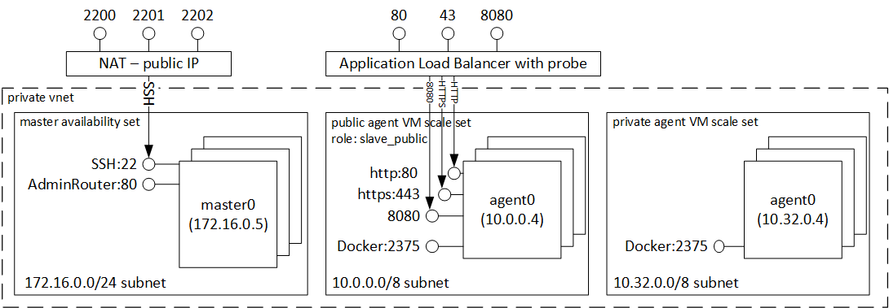

<properties
   pageTitle="Introduzione di servizio contenitore Azure | Microsoft Azure"
   description="Servizio contenitore Azure offre un modo per semplificare la creazione, configurazione e gestione di un cluster di macchine virtuali che preconfigurato in modo da eseguire nei contenitori di applicazioni."
   services="container-service"
   documentationCenter=""
   authors="rgardler"
   manager="timlt"
   editor=""
   tags="acs, azure-container-service"
   keywords="Docker, contenitori, Micro-servizi, Mesos, Azure"/>

<tags
   ms.service="container-service"
   ms.devlang="na"
   ms.topic="article"
   ms.tgt_pltfrm="na"
   ms.workload="na"
   ms.date="09/13/2016"
   ms.author="rogardle"/>

# Introduzione contenitore servizio Azure

Servizio contenitore Azure semplifica creare, configurare e gestire un cluster di macchine virtuali che preconfigurato in modo da eseguire nei contenitori di applicazioni. Utilizza ottimizzare la configurazione di strumenti di pianificazione e orchestrazione Apri origine popolari. In questo modo è possibile utilizzare le conoscenze o disegnare su un corpo ampia e crescente di esperienza della community, per distribuire e gestire applicazioni basate sul contenitore in Microsoft Azure.

Servizio contenitore Azure utilizza il formato del contenitore Docker per fare in modo che i contenitori di applicazioni siano completamente portabili. Supporta anche la scelta di Marathon e controller di dominio/OS o Particle Swarm Docker in modo che è possibile adattare queste applicazioni a migliaia di contenitori o persino decine di migliaia.

Tramite il servizio contenitore di Azure, è possibile eseguire sfruttare le funzionalità di livello aziendale di Azure, mantenendo la portabilità dell'applicazione, inclusi portabilità i livelli di orchestrazione.

Utilizzo del servizio di Azure contenitore
-----------------------------

Il nostro obiettivo con Azure contenitore servizio è fornire un contenitore ambiente host utilizzando strumenti Apri origine e le tecnologie più visti dai suoi clienti oggi. A questo scopo è esporre endpoint API standard per la scelta orchestrator (controller di dominio/OS o Particle Swarm Docker). Utilizzando gli endpoint, è possibile sfruttare le eventuali software in grado di comunicare con gli endpoint. Ad esempio, per endpoint Particle Swarm Docker potrebbe scegliere di utilizzare l'interfaccia della riga di comando Docker (CLI). Per controller di dominio o il sistema operativo, si potrebbe scegliere di utilizzare CLI DCOS.

Creazione di un cluster Docker tramite servizio contenitore Azure
-------------------------------------------------------

Per iniziare a utilizzare il servizio contenitore di Azure, si distribuisce un cluster di Azure contenitore servizio tramite il portale (ricerca di "Azure contenitore servizio"), utilizzando un modello di gestione di risorse Azure ([Particle Swarm Docker](https://github.com/Azure/azure-quickstart-templates/tree/master/101-acs-swarm) o [Controller di dominio/OS](https://github.com/Azure/azure-quickstart-templates/tree/master/101-acs-dcos)) o con [CLI](/documentation/articles/xplat-cli-install/). I modelli di Guida introduttiva fornito possono essere modificati in modo da includere configurazione Azure aggiuntiva o avanzata. Per ulteriori informazioni sulla distribuzione di un cluster di Azure contenitore servizio, vedere [distribuire un cluster di Azure contenitore servizio](container-service-deployment.md).

Distribuzione di un'applicazione
------------------------

Servizio contenitore Azure offre una scelta di Particle Swarm Docker o controller di dominio/OS per orchestrazione. Come distribuire un'applicazione varia a seconda della scelta effettuata di orchestrator.

### Utilizzando controller di dominio/OS

CC/OS è un sistema operativo distribuito basato sul kernel di sistemi distribuiti Apache Mesos. Apache Mesos grazie a Apache Software Foundation e vengono elencate alcune del [nomi principali in IT](http://mesos.apache.org/documentation/latest/powered-by-mesos/) come utenti e collaboratori.

CC/OS e Apache Mesos includono un set di caratteristiche professionali:

-   Scalabilità consolidate

-   Tolleranza replicato master e secondari utilizzando Apache ZooKeeper

-   Supporto per i contenitori Docker formattato

-   Nativo isolamento tra le attività con Linux contenitori

-   Multiresource pianificazione (memoria, CPU, disco e porte)

-   Java, Python e APIs C++ per lo sviluppo di applicazioni parallele nuove

-   Un'interfaccia utente web per la visualizzazione stato cluster

Per impostazione predefinita, in esecuzione in Azure contenitore servizio controller di dominio/OS include la piattaforma orchestrazione Marathon per la programmazione carichi di lavoro. Tuttavia, inclusa la distribuzione di controller di dominio/OS di ACS è universo Mesosphere dei servizi che possono essere aggiunti al servizio, ad esempio motori, Hadoop, Cassandra e molto altro ancora.

#### Uso Marathon

Marathon è un sistema di controllo per i servizi di cgroups - o, nel caso di Azure contenitore servizio, formattato Docker contenitori e inizializzazione tutto. Marathon offre un'interfaccia utente web da cui è possibile distribuire le applicazioni. È possibile accedere seguente in un URL che ha un aspetto simile `http://DNS_PREFIX.REGION.cloudapp.azure.com` in DNS\_PREFISSO e opzioni internazionali sono definiti in fase di distribuzione. Naturalmente, è possibile fornire anche il proprio nome DNS. Per ulteriori informazioni sull'esecuzione di un contenitore tramite l'interfaccia di Marathon web, vedere [gestione dei contenitori tramite l'interfaccia web](container-service-mesos-marathon-ui.md).

È anche possibile utilizzare le API REST per la comunicazione con Marathon. Sono disponibili numerose librerie client disponibili per ogni strumento. Vengono illustrate diverse lingue, e, naturalmente, è possibile usare il protocollo HTTP in qualsiasi lingua. Inoltre, molti strumenti attrezzi popolari forniscono supporto per Marathon. Fornisce la massima flessibilità per il team di operazioni quando si lavora con un cluster di Azure contenitore servizio. Per ulteriori informazioni sull'esecuzione di un contenitore tramite l'API REST Marathon, vedere [gestione dei contenitori con l'API REST](container-service-mesos-marathon-rest.md).

### Uso sciame Docker

Docker sciame fornisce cluster nativi per Docker. Poiché Particle Swarm Docker viene utilizzata l'API Docker standard, uno strumento che già comunica con daemon Docker consente sciame trasparente scala a più host del servizio di Azure contenitore.

Strumenti supportati per la gestione dei contenitori in un cluster sciame includono, ma non sono le operazioni seguenti:

-   Dokku

-   Docker CLI e Docker comporre

-   Krane

-   Jenkins

Video
------

Guida introduttiva di Azure contenitore servizio (101):  

> [AZURE.VIDEO azure-container-service-101]

Creazione di applicazioni mediante il servizio di Azure contenitore (Build 2016)

> [AZURE.VIDEO build-2016-building-applications-using-the-azure-container-service]
