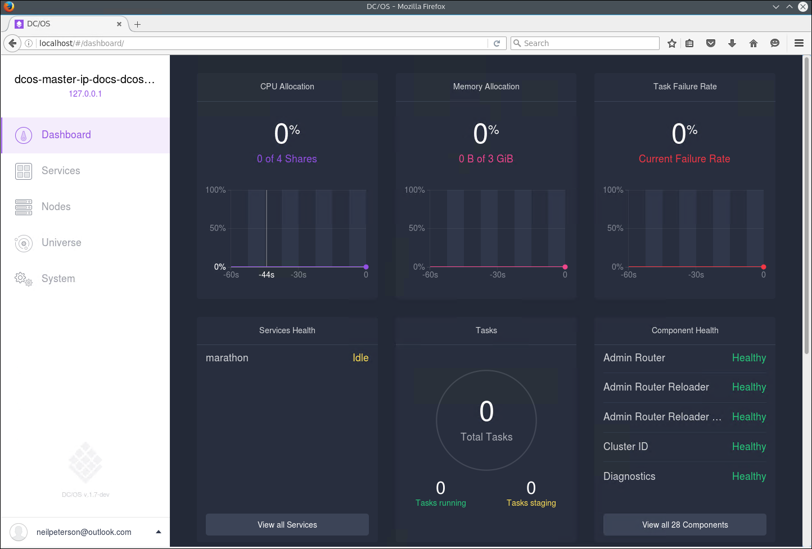
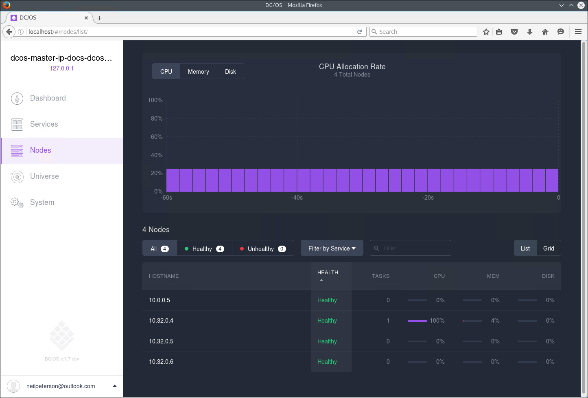
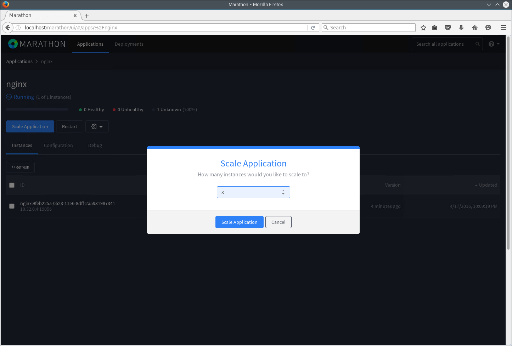

<properties
   pageTitle="Azure contenitore contenitore gestione tramite l'interfaccia web | Microsoft Azure"
   description="Distribuire contenitori a un servizio di cluster contenitore Azure utilizzando l'interfaccia web Marathon."
   services="container-service"
   documentationCenter=""
   authors="neilpeterson"
   manager="timlt"
   editor=""
   tags="acs, azure-container-service"
   keywords="Docker, contenitori, Micro-servizi, Mesos, Azure"/>

<tags
   ms.service="container-service"
   ms.devlang="na"
   ms.topic="get-started-article"
   ms.tgt_pltfrm="na"
   ms.workload="na"
   ms.date="09/19/2016"
   ms.author="timlt"/>

# <a name="container-management-through-the-web-ui"></a>Gestione dei contenitori tramite l'interfaccia web

CC/OS offre un ambiente per la distribuzione e proporzioni dei caratteri raggruppate carichi di lavoro, mentre si astraendo hardware sottostante. Nella parte superiore di controller di dominio/OS, non esiste un quadro che gestisce la pianificazione e l'esecuzione di carichi di lavoro di calcolo.

Mentre Framework sono disponibili per molti carichi di lavoro comuni, per descrivere il documento come è possibile creare e ridimensionare le distribuzioni contenitore Marathon. Prima di eseguire questi esempi, è necessario un cluster di controller di dominio/OS configurato nel servizio di Azure contenitore. È necessario disporre di connettività remota a questo cluster. Per ulteriori informazioni su questi elementi, vedere gli articoli seguenti:

- [Distribuire un cluster di servizio contenitore Azure](container-service-deployment.md)
- [Connettersi a un cluster di servizio contenitore Azure](container-service-connect.md)

## <a name="explore-the-dcos-ui"></a>Esplorare l'interfaccia utente/OS controller di dominio

Con tunnel Secure Shell (SSH) stabilito, passare alla http://localhost/. Questo Carica web cc/OS dell'interfaccia utente e visualizza le informazioni relative al cluster, ad esempio risorse utilizzate, agenti attivi e servizi in esecuzione.



## <a name="explore-the-marathon-ui"></a>Esplorare la Marathon dell'interfaccia utente

Per visualizzare l'interfaccia utente Marathon, passare alla http://localhost/Marathon. Nella schermata, è possibile iniziare un nuovo contenitore o un'altra applicazione cluster Azure contenitore servizio controller di dominio/sistema operativo. È anche possibile visualizzare informazioni sull'esecuzione di applicazioni e contenitori.  


## <a name="deploy-a-docker-formatted-container"></a>Distribuire un contenitore Docker formattato

Distribuire un nuovo contenitore utilizzando Marathon, fare clic sul pulsante **Crea applicazione** e immettere le informazioni seguenti nel modulo:

Campo           | Valore
----------------|-----------
ID              | nginx
Immagine           | nginx
Rete         | Provvisorie
Porta host       | 80
Protocollo        | TCP


Se si desidera eseguire il mapping statico porta contenitore a una porta dell'agente, è necessario utilizzare la modalità JSON. A tale scopo, attivare la creazione guidata nuova applicazione **JSON modalità** utilizzando l'interruttore. Immettere quindi le operazioni seguenti nel `portMappings` sezione della definizione dell'applicazione. Questo esempio associa porta 80 del contenitore alla porta 80 dell'agente di cc/OS. È possibile cambiare questa procedura guidata dalla modalità di JSON dopo aver apportato questa modifica.

```none
"hostPort": 80,
```


Cluster controller di dominio/OS viene distribuito con serie di agenti pubblici e privati. Per il cluster per poter accedere alle applicazioni da Internet, è necessario distribuire le applicazioni a un agente di pubblico. A tale scopo, selezionare la scheda **facoltativo** della creazione guidata nuova applicazione e immettere **slave_public** per **Accettato dei ruoli delle risorse**.


Tornare nella pagina principale Marathon, è possibile visualizzare lo stato di distribuzione per il contenitore.


Quando si passa al web cc/OS dell'interfaccia utente (http://localhost/), si vedrà che un'attività (in questo caso, un contenitore formattato Docker) sia in esecuzione su cluster controller di dominio/OS.


È anche possibile visualizzare il nodo cluster che l'attività è in esecuzione.



## <a name="scale-your-containers"></a>Ridimensionare i contenitori

È possibile utilizzare l'interfaccia utente Marathon per ridimensionare il conteggio delle istanze di un contenitore. A tale scopo, passare alla pagina **Marathon** , selezionare il contenitore in cui si desidera ridimensionare e fare clic sul pulsante di **scala** . Nella finestra di dialogo **Applicazione** immettere il numero di istanze di contenitori desiderato e selezionare **Scala applicazione**.



Al termine dell'operazione di ridimensionamento, si vedrà più istanze della stessa attività distribuiti in agente di cc/sistema operativo.


## <a name="next-steps"></a>Passaggi successivi

- [Lavorare con controller di dominio/OS e l'API Marathon](container-service-mesos-marathon-rest.md)

Approfondimento su servizio di contenitore Azure con Mesos

> [AZURE. Azurecon-2015-deep-dive-on-the-azure-container-service-with-mesos VIDEO]]
