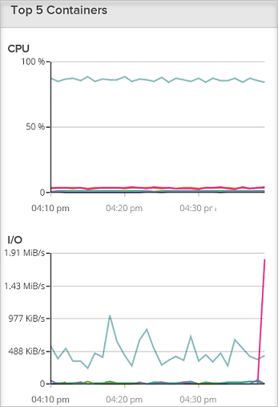

<properties
   pageTitle="Monitorare un cluster di servizio contenitore Azure con Sysdig | Microsoft Azure"
   description="Monitorare un cluster di servizio contenitore Azure con Sysdig."
   services="container-service"
   documentationCenter=""
   authors="rbitia"
   manager="timlt"
   editor=""
   tags="acs, azure-container-service"
   keywords="Contenitori, controller di dominio/OS Azure"/>

<tags
   ms.service="container-service"
   ms.devlang="na"
   ms.topic="get-started-article"
   ms.tgt_pltfrm="na"
   ms.workload="na"
   ms.date="08/08/2016"
   ms.author="t-ribhat"/>

# Monitorare un cluster di servizio contenitore Azure con Sysdig

In questo articolo, si verranno distribuito agenti Sysdig a tutti i nodi agente del cluster di Azure contenitore servizio. È necessario un account con Sysdig per questa configurazione. 

## Prerequisiti 

[Distribuisci](container-service-deployment.md) e [connettere](container-service-connect.md) un cluster configurato dal servizio di Azure contenitore. Esplorare la [Marathon dell'interfaccia utente](container-service-mesos-marathon-ui.md). Passare a [http://app.sysdigcloud.com](http://app.sysdigcloud.com) per configurare un account di cloud Sysdig. 

## Sysdig

Sysdig è un servizio di monitoraggio che consente di controllare i contenitori all'interno del cluster. Per agevolare la risoluzione dei problemi di valore è noto Sysdig ma ha anche dai parametri di monitoraggio di base per CPU, rete, memoria e i/o. Sysdig consente di vedere i contenitori che utilizza i più difficili o essenzialmente CPU e memoria più facilmente. Questa visualizzazione è indicata nella sezione "Overview", che è attualmente disponibile la versione beta. 

 

## Configurare una distribuzione Sysdig con Marathon

Questa procedura illustra come configurare e distribuire le applicazioni Sysdig il cluster con Marathon. 

Accedere a un'interfaccia utente cc/OS tramite [http://localhost:80 /](http://localhost:80/) una volta nell'interfaccia utente di controller di dominio/OS passare al "Universo", che si trova in basso a sinistra e quindi cercare "Sysdig".

A questo punto per completare la configurazione è necessario un account di cloud Sysdig oppure un account di valutazione gratuito. Una volta che è eseguito l'accesso al sito Web cloud Sysdig, fare clic sul proprio nome utente e nella pagina verrà visualizzato il "tasto di scelta". 

 

Quindi immettere il tasto di scelta nella configurazione Sysdig all'interno dell'universo cc/OS. 

Imposta ora le istanze di 10000000 pertanto ogni volta che viene aggiunto un nuovo nodo al cluster Sysdig verranno automaticamente distribuire un agente per il nuovo nodo. Si tratta di una soluzione temporanea per assicurarsi che Sysdig verrà distribuito in tutti i nuovi agenti all'interno del cluster. 

Dopo aver installato il pacchetto tornare UI Sysdig e sarà possibile esplorare le metriche di utilizzo diversi per i contenitori all'interno del cluster. 