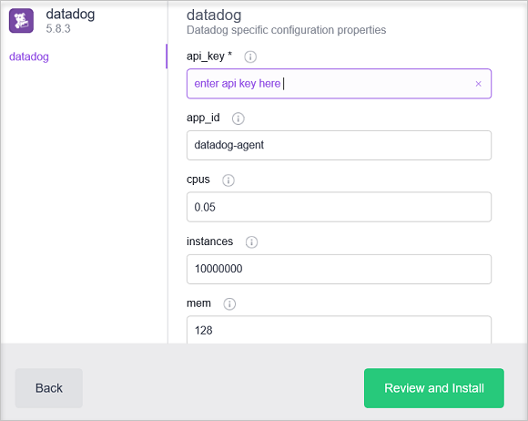

<properties
   pageTitle="Monitorare un cluster di servizio contenitore Azure con Datadog | Microsoft Azure"
   description="Monitorare un cluster di servizio contenitore Azure con Datadog. Utilizzare l'interfaccia web cc/OS per distribuire agenti Datadog al cluster."
   services="container-service"
   documentationCenter=""
   authors="rbitia"
   manager="timlt"
   editor=""
   tags="acs, azure-container-service"
   keywords="Contenitori, controller di dominio/OS, sciame Docker, Azure"/>

<tags
   ms.service="container-service"
   ms.devlang="na"
   ms.topic="article"
   ms.tgt_pltfrm="na"
   ms.workload="infrastructure"   
   ms.date="07/28/2016"
   ms.author="t-ribhat"/>

# Monitorare un cluster di servizio contenitore Azure con Datadog

In questo articolo è verrà distribuito agenti Datadog a tutti i nodi agente del cluster di Azure contenitore servizio. È necessario un account con Datadog per la configurazione. 

## Prerequisiti 

[Distribuisci](container-service-deployment.md) e [connettere](container-service-connect.md) un cluster configurato dal servizio di Azure contenitore. Esplorare la [Marathon dell'interfaccia utente](container-service-mesos-marathon-ui.md). Passare a [http://datadoghq.com](http://datadoghq.com) per configurare un account Datadog. 

## Datadog 

Datadog è un servizio di monitoraggio che raccoglie dati monitoraggio dai contenitori all'interno del cluster di Azure contenitore servizio. Datadog dispone di un Dashboard di integrazione Docker nel punto in cui è possibile visualizzare la metrica specifica all'interno i contenitori. Metriche raccolte dai contenitori sono organizzate per CPU, memoria, rete e i/o. Datadog divide metriche in contenitori e immagini. Esempio di aspetto dell'interfaccia utente per l'utilizzo della CPU è inferiore.

## Configurare una distribuzione Datadog con Marathon

Questa procedura illustra come configurare e distribuire le applicazioni Datadog il cluster con Marathon. 

Accedere a un'interfaccia utente cc/OS tramite [http://localhost:80 /](http://localhost:80/). Una volta nell'interfaccia utente di controller di dominio/OS passare a "Universo" che si trova in basso a sinistra e quindi cercare "Datadog" e fare clic su "Installa".

A questo punto per completare la configurazione è necessario un account Datadog oppure un account di valutazione gratuito. Dopo aver effettuato l'accesso per l'aspetto del sito Web Datadog a sinistra e passare alla sezione integrazioni -> quindi dell'API. 

Quindi immettere la chiave dell'API nella configurazione Datadog all'interno dell'universo cc/OS. 

 

Nella configurazione sopra le istanze siano impostate 10000000 così ogni volta che viene aggiunto un nuovo nodo cluster Datadog verrà distribuito automaticamente un agente a tale nodo. Si tratta di una soluzione temporanea. Dopo aver installato il pacchetto deve passare al sito Web di Datadog e trovare "Dashboard". Da tale posizione si vedrà personalizzati e integrazione dashboard. Dashboard di integrazione Docker avrà metriche contenitore che è necessario per il monitoraggio il cluster. 
