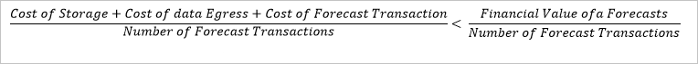

<properties
    pageTitle="Cortana Playbook modello soluzione di Business Intelligence per le previsioni di richiesta di energia | Microsoft Azure"
    description="Un modello di soluzione con Microsoft Cortana Intelligence che consente di eseguire previsioni richiesta per una società di utilità di energia."
    services="cortana-analytics"
    documentationCenter=""
    authors="ilanr9"
    manager="ilanr9"
    editor="yijichen"/>

<tags
    ms.service="cortana-analytics"
    ms.workload="data-services"
    ms.tgt_pltfrm="na"
    ms.devlang="na"
    ms.topic="article"
    ms.date="01/24/2016"
    ms.author="ilanr9;yijichen;garye"/>

# Cortana Playbook modello soluzione di Business Intelligence per le previsioni di richiesta di energia  

## Gruppo di dirigenti  

Negli ultimi anni Internet di elementi (IoT), rinnovabili alternativo e dati hanno unite per creare opportunità maggior nel dominio di utilità ed energie. Contemporaneamente, l'utilità e settore dell'intero energia sono considerate almeno con consumatori complesse metodi più efficaci per controllarne l'utilizzo di energia elettrica. Di conseguenza, l'utilità e società della griglia smart sono bisogno di innovare e rinnovare se stessi. Inoltre, molte delle griglie utilità e power diventano obsoleti e molto i costi di manutenzione e gestione. Durante l'ultimo anno, il team ha lavorato in un numero di impegni all'interno del dominio di energia. Durante questi impegni, si sono verificato molti casi in cui l'utilità o fornitori di software indipendenti (fornitori di Software indipendenti) interessare in previsioni per la domanda di energia futuri. Le previsioni un ruolo importante all'interno dell'azienda corrente e futuri e hanno diventano foundation per diversi casi di utilizzo. Ad esempio previsione carico power brevi e a lungo termine, commerciali, bilanciamento del carico, ottimizzazione griglia e così via. Dati e i metodi di avanzate Analitica AA, ad esempio computer risorse (ML) sono la chiave realizzare l'obiettivo per la creazione di previsioni accurate e affidabile.  

In questo playbook abbiamo aziendali e linee guida analytical necessari per lo sviluppo di esito negativo e distribuzione di richiesta di energia previsione soluzione. Proposta consentono utilità, scienziati dati e ingegneri di dati per stabilire le soluzioni completamente operationalized, basato sul cloud, si esegue una previsione richiesta. Per le aziende che hanno i propri dati e viaggio analitica avanzate, ad esempio una soluzione può rappresentare il valore iniziale in strategia griglia smart a lungo termine.

>[AZURE.TIP] Per scaricare un diagramma che fornisce una panoramica dell'architettura di questo modello, vedere [architettura di modello di soluzione di Business Intelligence Cortana per la previsione richiesta di energia](cortana-analytics-architecture-demand-forecasting-energy.md).  

## Panoramica  

In questo documento vengono illustrate le aziende, dati e aspetti tecnici dell'utilizzo di Business Intelligence Cortana e in particolare Azure Machine Learning (elenco parti fornitore) per l'implementazione e la distribuzione di energia la previsione soluzioni. Il documento è costituito da tre parti principali:  

1. Comprensione delle esigenze aziendali  
2. Informazioni sui dati  
3. Implementazione tecnica

La parte di **Comprensione delle esigenze aziendali** illustra l'aspetto di business è necessario comprendere e considerare prima di prendere una decisione di investimento. Viene spiegato come idonei i problemi aziendali portata di mano per garantire la stima analitica e apprendimento effettivamente efficaci e applicabili. Ulteriormente il documento vengono illustrate le nozioni di base di apprendimento e come utilizzarlo per risolvere i problemi di energia di previsione. Vengono descritti i prerequisiti e i criteri di qualifica di un caso di utilizzo. Alcuni esempi casi di utilizzo e maiuscole/minuscole business scenari vengono inoltre forniti.

I dati sono l'elemento principale per qualsiasi soluzione di apprendimento. La parte di **Informazioni sui dati** di questo documento vengono illustrati alcuni aspetti importanti dei dati. Vengono descritti il tipo di dati necessari per la previsione di energia, requisiti di qualità dei dati e le origini dati presenti in genere. Inoltre, viene illustrato come utilizzare i dati non elaborati per preparare l'ambiente di funzioni di unità effettivamente la parte di modellazione dei dati.

La terza parte del documento illustra l'aspetto di **Implementazione tecnica** di una soluzione. Caratteristica Progettazione e modellazione sono alla base del processo di scienze di dati e sono pertanto vengono descritti in alcuni dettagli. Coprire il concetto di servizi web, ovvero un veicolo importante per la distribuzione cloud delle soluzioni analitica previsione. Viene descritta anche una tipica architettura di una soluzione operationalized-to-end.

Inoltre, il documento include materiale di riferimento che è possibile utilizzare per ottenere ulteriori informazioni del dominio e tecnologia.

È importante tenere presente che si intende illustrate in questo documento il processo di scienze più approfondito dei dati, aspetti matematici e tecnici. Questi dettagli sono disponibili nella [documentazione di Azure ML](http://azure.microsoft.com/services/machine-learning/) e [blog](http://blogs.microsoft.com/blog/tag/azure-machine-learning/).

### Gruppo di destinatari   
I destinatari di questo documento sono business e del personale tecnico che vogliono acquisire una conoscenza e comprensione delle apprendimento in base a soluzioni e come tali vengono utilizzate in particolare all'interno del dominio di energia di previsione.

Scienziati dati anche possono trarre vantaggio da questo documento per comprendere meglio il processo di alto livello che guida alla distribuzione di energia della previsione della soluzione di lettura. In questo contesto può anche essere utilizzato per stabilire una buona base e punto di partenza per informazioni dettagliate e avanzate materiale.

### Tendenze  
Negli ultimi anni IoT, rinnovabili alternativo e dati hanno unite per creare opportunità maggior nell'area utilità ed energie. Contemporaneamente, l'utilità e sectors energia intera sono considerate almeno con consumatori complesse metodi più efficaci per controllarne l'utilizzo di energia elettrica.

Molte utilità e società di energia smart sono stati pioniera nell' [griglia smart](https://en.wikipedia.org/wiki/Smart_grid) distribuendo un numero di usare casi che rendono utilizzano i dati generati dalla griglia. Molti casi di utilizzo riguardano le caratteristiche inerenti di elettricità: non può essere accumulata né memorizzato prevedere come inventario. Pertanto, è necessario utilizzare il risultato. Utilità che desidera aumentare l'efficienza necessarie le previsioni consumo semplicemente perché che otterranno loro maggiori possibilità di **domanda e saldo**, impedendo scarto energetica, **ridurre emissioni gas serra**e costo di controllo.

Quando si parla dei costi, esiste un altro aspetto importante, prezzo. Nuove funzionalità agli scambi power tra utilità inserita bisogno di **previsione domanda futura e il prezzo del futuro di energia elettrica**. Questo può determinare società i volumi di produzione.

Quando si utilizza la parola 'intelligente', è effettivamente fare riferimento a una griglia in grado di informazioni e quindi apportare le stime. È possibile prevedere variazioni stagionali consumo, nonché **prevedere situazioni temporaneo sovraccarico e regolare automaticamente per renderla**. Quando in modalità remota definendo consumo (con l'aiuto di questi contatori smart) possono essere gestiti situazioni overload localizzati. **Prima di tutto la previsione e quindi usarle**, la griglia rende più intelligente nel tempo.

Per il resto di questo documento è dedicata una famiglia di specifica casi di utilizzo che coprire la previsione del futuro, breve termine e richiesta di energia a lungo termine. Abbiamo lavorato in queste aree per alcuni mesi e abbiano acquisito alcune conoscenze e competenze che consentono di risultati di voto del settore. Altri casi di utilizzo verranno trattati anche nel documento nel prossimo futuro.

## Comprensione delle esigenze aziendali

### Obiettivi aziendali
L'obiettivo di **Energia Demo** è illustrare una tipica analitica previsione e apprendimento automatico soluzione che può essere distribuiti in una cornice tempi ridotti. In particolare, il nostro obiettivo corrente è attivazione soluzioni previsione richiesta di energia in modo che il valore di business può essere rapidamente realizzato e utilizzato su. Le informazioni contenute in questo playbook possono aiutare i clienti eseguire gli obiettivi seguenti:
-   Ora breve 24h al valore di apprendimento in base a soluzione
-   Possibilità di espandere un progetto pilota utilizzare maiuscole/minuscole in altri casi di utilizzo o di un ambito più ampio in base alle esigenze aziendali
-   Acquisire rapidamente una famiglia di prodotti Business Intelligence Cortana prodotto conoscenza

Con questi obiettivi, questo playbook intende l'esecuzione di business e conoscenze tecniche utili questi obiettivi.

### Carico di alimentazione e le previsioni richiesta
All'interno di settore energia potrebbero essere diversi modi in cui richiesta la previsione consentono di risolvere i problemi aziendali più importanti. Infatti, la previsione richiesta possono essere considerata le basi per molti casi di utilizzo di base del settore. In generale, si considerano due tipi di previsioni della domanda di energia: breve termine e a lungo termine. Ciascuno di essi può uno scopo diverso e utilizzare un approccio diverso. La differenza tra i due principale è orizzonte di previsione, ovvero l'intervallo di tempo in futuro per il quale si vuole previsione.

#### Breve termine carico si esegue una previsione
All'interno del contesto della richiesta di energia, breve termine caricare la previsione (STLF) è definito come il carico aggregato previsti nel prossimo futuro in varie parti della griglia (o di un intero). In questo contesto, breve termine è definito come orizzonte temporale compreso tra 1 ora a 24 ore. In alcuni casi, è possibile anche un limite di 48 ore. Pertanto, STLF è molto comune in un caso di utilizzo operativo della griglia. Ecco alcuni esempi di STLF basata sulle risorse casi di utilizzo:
-   Domanda e bilanciamento del carico
-   Supporto commerciale Power
-   Creazione di mercato (prezzo power impostazione)
-   Ottimizzazione operativa griglia
-   [Risposta richiesta](https://en.wikipedia.org/wiki/Demand_response)
-   Picco richiesta la previsione
-   Gestione proposte laterale
-   Il bilanciamento del carico e programmi di overload
-   A lungo termine carico si esegue una previsione
-   Rilevamento di errore e anomalie
-   Punta riduzione d'/il livellamento 

Modello STLF prevalentemente si basano sulle passato near (ultimo giorno o settimana) dati consumo e l'utilizzo previsti temperatura come un previsioni importanti. Ottenere temperatura accurata previsione per la prossima ora e la a 24 ore è sempre minore di un'operazione impegnativa giorni adesso. Questi modelli sono meno sensibili di stagionale motivi e tendenze consumo a lungo termine.

Soluzioni SLTF anche si prevede venga generato volume elevato di chiamate stima (richieste di assistenza) poiché viene richiamati oraria e in alcuni casi anche con frequenza maggiore. È anche molto comune per visualizzare tale implementazione nel punto in cui ogni singolo sottostazione o trasformatore viene rappresentato come modello autonomo e pertanto non sono ancora maggiore il volume di richieste di previsione.

#### A lungo termine carico si esegue una previsione
L'obiettivo di lungo termine carico la previsione (LTLF) è previsione richiesta power con un orizzonte temporale compreso tra 1 settimana più mesi (in alcuni casi per un numero di anni). L'intervallo di orizzonte prevalentemente è applicabile per la pianificazione e investimento use case.

Per gli scenari a lungo termine, è importante per i dati di alta qualità che copra un intervallo specifico di anni più (minimi 3 anni). Questi modelli verranno in genere estrarre motivi stagionalità dai dati cronologici e uso delle predicators esterno ad come modelli meteo e clima.

È importante chiarire che più orizzonte di previsione, meno precisa potrebbe essere la previsione. Pertanto è importante generare alcuni intervalli di confidenza insieme le previsioni effettivo che consentirebbe uomo tenere in considerazione la possibile variazione nel processo di pianificazione.

Poiché uno scenario di consumo per LTLF principalmente la pianificazione, ci si aspetta che molto basso volumi stima (rispetto a STLF). Abbiamo normalmente si vede tali stime incorporate in strumenti di visualizzazione, ad esempio Excel o ottenere informazioni e impostare manualmente dall'utente.

### Termini e lungo termine stima
Nella tabella seguente contiene un confronto di STLF e LTLF rispetto agli attributi più importanti:

|Attributo|Breve termine carico previsione|Carico previsione a lungo termine|
|---|---|---|
|Previsione orizzonte|Da 1 a 48 ore|Da 1 a 6 mesi o più|
|Granularità di dati|Orario|Oraria o giornaliera|
|Uso tipico casi|<ul><li>Domanda/fornitura bilanciamento del carico</li><li>Selezionare la previsione ore</li><li>Risposta richiesta</li></ul>|<ul><li>Pianificazione a lungo termine</li><li>Risorse griglia pianificazione</li><li>Pianificazione delle risorse</li></ul>|
|Variabili predittive tipiche|<ul><li>Giorno o per settimana</li><li>Ora del giorno</li><li>Temperatura oraria</li></ul>|<ul><li>Mese dell'anno</li><li>Giorno del mese</li><li>Clima e temperatura a lungo termine</li></ul>|
|Intervallo di dati cronologici|Patrimonio di due o tre anni di dati|Patrimonio 5 a 10 anni di dati|
|Precisione tipica|MAPE * 5% o inferiore|MAPE * del 25% o inferiore|
|Frequenza di previsione|Prodotti di ogni ora o ogni 24 ore|Prodotto una volta mensile, trimestrale o annuale|
\*[MAPE](https://en.wikipedia.org/wiki/Mean_absolute_percentage_error) – Mean errore percentuale media

Come è possibile rilevare da questa tabella, è importante distinguere tra breve e lungo termine la previsione scenari questi rappresentare le diverse esigenze aziendali e può avere distribuzione diversi modelli e consumo.

### Esempio Use Case 1: eSmart sistemi – ottimizzazione di Overload
Un ruolo importante di una [griglia smart](https://en.wikipedia.org/wiki/Smart_grid) è dinamicamente costantemente ottimizzare e regolare per la modifica delle consumi. Consumo di energia può essere influenzato dalla modifiche a breve termine principalmente causati dalle variazioni (*ad esempio*, potenza viene usato per condizione aria o riscaldamento). Nello stesso momento consumo di energia varia inoltre tendenze a lungo termine. Potrebbero essere presenti stagionalità effetti, le festività nazionali, crescita consumo a lungo termine e persino economici fattori indice consumer, prezzo oil e PIL.

In questo caso di utilizzo, [eSmart](http://www.esmartsystems.com/) deciso di distribuire una soluzione basata su cloud che consente di prevedere tendenza di una situazione di overload in qualsiasi sottostazione specificato della griglia. In particolare, eSmart voluto identificare sottostazioni che probabilmente overload all'interno di un'ora, in modo che un'azione immediata può essere adottata per evitare o risolvere il problema.

Un accurato ed eseguire rapidamente stima richiede l'implementazione di tre modelli di Office:
-   Modello a lungo termine che consente la previsione consumo di energia elettrica in ogni sottostazione durante la successiva poche settimane o mesi
-   Modello a breve termine che consente di overload situazione in un determinato sottostazione durante la prossima ora la funzione di completamento
-   Modello di temperatura che fornisce la previsione di temperatura futura su più scenari

L'obiettivo del modello a lungo termine consiste nel classificare le sottostazioni dal loro tendenza a overload (dato loro capacità di trasmissione power) durante la prossima settimana o mese. In questo modo la creazione di un elenco breve delle sottostazioni utilizzati come input per la previsione a breve termine. Come temperatura un previsioni importanti per il modello a lungo termine, è necessario per generare le previsioni temperatura scenario più costantemente feed loro come input per al modello a lungo termine. Le previsioni a breve termine viene quindi richiamata per prevedere quali sottostazione è soggetto a overload più ora successiva.

I modelli di breve e a lungo termine vengono distribuiti singolarmente per ogni sottostazione. Di conseguenza, pratico esecuzione di questi modelli richiede orchestrazione vasta. Per ottenere maggiore precisione della previsione a breve termine, un modello più granulare si impegna costantemente per ogni ora del giorno. Tutti i modelli vengono eseguiti ogni ora e di fine esecuzione all'interno di alcuni minuti per concedere il tempo a rispondere e intraprendere azioni preventive se necessario. La raccolta di modelli è aggiornata tramite periodica i dati più recenti.

Sono disponibili ulteriori informazioni in questo caso di utilizzo [di seguito](https://customers.microsoft.com/Pages/CustomerStory.aspx?recid=18945).

#### Usare i criteri di maiuscole e minuscole qualifica-prerequisiti
La forza della funzione principale di Business Intelligence Cortana è la capacità potenti per distribuire e ridimensionare soluzioni incentrate sui risorse computer. Progettato per supportare migliaia delle stime eseguite contemporaneamente. Può automaticamente ridimensionare per soddisfare un motivo consumo la modifica. Una soluzione per questo motivo, è incentrato precisione e le prestazioni di calcolo. Ad esempio, un'azienda è interessata a produrre previsione per la prossima ora e per ogni ora del giorno della domanda di energia accurato. Mano, sono meno interessati a rispondere alle domande della perché la domanda venga previsto, poiché è (il modello consente di risolvere che).

Pertanto è importante tenere presente che non tutti i casi di utilizzo e problemi aziendali possono essere risolti in modo efficiente con l'apprendimento.

Business Intelligence Cortana e apprendimento potrebbe essere estremamente efficace per risolvere un problema aziendale specificato quando vengono soddisfatti i criteri seguenti:
-   Il problema business mano **stima** natura. Un esempio di maiuscole e minuscole Usa previsione è un'azienda che si desidera prevedere il carico di alimentazione in un determinato sottostazione durante la successiva ora. Mano, analisi e la classificazione driver della domanda cronologico sarebbe **descrittivo** natura e pertanto meno applicabile.
-   Esiste un chiaro **percorso dell'azione** da eseguire dopo la previsione è disponibile. Ad esempio previsione overload su un sottostazione durante la successiva ora possibile avviare un'azione preventiva di ridurre il carico associato a tale sottostazione e impedendo potenzialmente un overload.
-   Il caso di utilizzo rappresenta un **tipico tipo di problema** tali soluzione che quando si possono comportare per risolvere altri simili casi di utilizzo.
-   Il cliente può impostare **obiettivi quantitativi e qualitativi** per illustrare implementazione una soluzione di successo. Ad esempio, un buon obiettivo quantitativo per la previsione della domanda di energia sarà la soglia del livello di precisione desiderato (*ad esempio*, fino a 5% errore consentito) o quando la previsione sottostazione overload quindi la precisione (Tasso_int di positivi veri) e richiamo (estensione di true positivi) dovrebbe essere sopra una determinata soglia. Questi obiettivi devono essere derivati da obiettivi del cliente.
-   Esiste un chiaro **scenario di integrazione** con flusso di lavoro aziendale della società. Ad esempio le previsioni carico sottostazione possono integrare il centro di controllo griglia per consentire di overload prevenzione attività.
-   Il cliente ha già pronti per usare i **dati con qualità sufficiente** per supportare il caso di utilizzo (vedere più nella sezione successiva **Qualità dei dati**di questo playbook).
-   Il cliente comprende architettura incentrate sui dati del cloud o **computer basato su cloud formazione**inclusi ML Azure e altri componenti di famiglia di prodotti Business Intelligence Cortana.
-   Il cliente è disposto stabilire **un flusso di dati to end** tale strutture il recapito di dati nel cloud in modo continuativo e disposto a **rendono operativi** la soluzione.
-   Il cliente è pronto per **dedicare risorse** che verranno attivamente impegnati durante la fase pilota iniziale, in modo che conoscenze e la proprietà della soluzione possano essere trasferite al cliente dopo il completamento.
-   La risorsa cliente deve essere un **esperti dati professionali**, preferenza un scienziato dati.

Qualifica di un caso di utilizzo in base ai criteri indicati possibile notevolmente migliorare il successo di un caso di utilizzo e stabilire una buona beachhead per l'implementazione di casi di utilizzo futuro.

### Soluzioni basate su cloud
Cortana famiglia di prodotti Business Intelligence in Azure è un ambiente integrato che si trova nel cloud. La distribuzione di una soluzione analitica avanzate in un ambiente basato su cloud contiene vantaggi per le aziende e allo stesso tempo potrebbe cambiare grande per le aziende che utilizzano ancora soluzioni IT in locale. All'interno del settore di energia, non c'è una linea di tendenza Cancella della migrazione graduale delle operazioni nel cloud. Questa tendenza passa a portata di mano in a portata di mano insieme lo sviluppo di smart griglia come indicato in precedenza, **Tendenze**. Come questo playbook è incentrata su una soluzione basata su cloud nel dominio di energia, è importante spiegare i vantaggi e altre considerazioni di distribuzione di una soluzione basata su cloud.

Il vantaggio principale di una soluzione basata su cloud forse è il costo. Come soluzione utilizza componenti distribuito cloud non c'è alcun costi attività o COGS (costo del venduto) componente è associato. Ciò significa che è necessario acquistare hardware e software e manutenzione dei servizi IT, e pertanto non esiste una sostanziale riduzione dei rischi di business.

Un altro vantaggio importante è la struttura dei costi in di soluzioni basate su cloud. I server di basato sul cloud computing o lo spazio di archiviazione possono distribuiti e architetture alla scala cronologica semplicemente di necessità. Rappresenta il vantaggio di efficienza costo di una soluzione basata su cloud.

Infine, non è necessario per gli investimenti in manutenzione dei servizi IT o sviluppo dell'infrastruttura futuri come tutto ciò fa parte di offerta basato sul cloud. In che misura Cortana Intelligence Suite include i migliori servizi di classe e continua in evoluzione relativa mappa stradale. Funzionalità, componenti e nuove funzionalità costantemente sono stati introdotti ed evolvono.

Per individuare una società che è appena iniziato la transizione nel cloud, le consigliamo altamente un approccio graduale mediante l'implementazione stradali migrazione cloud. Si ritiene che per le utilità e società nel dominio di energia, casi di utilizzo che vengono illustrati in questo playbook rappresentano un'ottima opportunità per pilota soluzioni analitica previsione nel cloud.

#### Considerazioni sulla giustificazione maiuscole e minuscole per le aziende
In molti casi il cliente potrebbe interessare effettua una giustificazione aziendale per un caso di utilizzo specificato in cui una soluzione basata su cloud e apprendimento sono componenti importanti. A differenza di una soluzione locale, nel caso di una soluzione basata su cloud, il componente costi attività è minimo e la maggior parte degli elementi di costo sono associata a utilizzo effettivo. Quando arriva alla distribuzione di energia della previsione della soluzione nella famiglia di prodotti Business Intelligence Cortana, più servizi possono integrati con una singola struttura comuni di costo. Ad esempio, database (*ad esempio*, SQL Azure) possono essere usati per archiviare i dati non elaborati e quindi per le previsioni effettive ML Azure viene utilizzato per ospitare i servizi di previsione. In questo esempio, la struttura dei costi può includere lo spazio di archiviazione e componenti di transazione.

Mano, è necessario disporre di una buona conoscenza del valore commerciale di funzionare a una richiesta di energia previsioni (breve o lungo termine). Infatti, è importante tenere presente il valore aziendale di ogni operazione di previsione. Ad esempio, in modo accurato previsioni carico di alimentazione per le 24 ore successive evitare overproduction o possono aiutare a evitare overload sulla griglia e si possono quantificare in termini di risparmio finanziario su base giornaliera.

Una formula di base per il calcolo vantaggio finanziario della domanda previsione soluzione potrebbe essere: 

Poiché Cortana Intelligence Suite fornisce un modello prezzo, non è necessario per sostenere un componente di costo fisso per questa formula. Questa formula può essere calcolata su base giornaliera, mensile o annuale.

Corrente Cortana Intelligence famiglia di prodotti e ML Azure prezzi piani sono disponibili [qui](http://azure.microsoft.com/pricing/details/machine-learning/).

### Processo di sviluppo di soluzioni
Ciclo di sviluppo di una richiesta di energia della previsione della soluzione in genere fasi 4, ognuno dei quali è apportare nella uso delle tecnologie basate su cloud e servizi all'interno del gruppo di Business Intelligence Cortana.

Come illustrato nella figura seguente:

Il paragrafo seguente sono descritte in questo processo 4 passaggio:

1.  **Raccolta di dati** : qualsiasi soluzione analitica avanzate in base a si basa sui dati (vedere **Informazioni sui dati**). In particolare, quando si tratta di analitica previsione e si esegue una previsione, si utilizzano normalmente in corso, dinamico flusso dei dati. In caso di energia richiesta la previsione, questi dati possono essere estratto direttamente contatori smart o essere già aggregati in un database locale. È inoltre basarsi su altre origini esterne dei dati, ad esempio meteo e temperatura. Questo flusso di dati in corso deve essere gestito, pianificato e archiviato. [Dati di Azure Factory](http://azure.microsoft.com/services/data-factory/) (Alimentatore automatico) è il nostro database principale per eseguire questa attività.
2.  **Modellazione** – di energia accurato e affidabile delle previsioni, uno necessario sviluppare (treno) e conservare un modello ideale che rende utilizzare dei dati cronologici ed estrae motivi significativi e previsione dei dati. Area risorse di computer (ML) è aumentato rapidamente con algoritmi più avanzati in fase di sviluppo regolarmente. Azure ML Studio offre un'esperienza utente eccezionale che consente di utilizzare gli algoritmi ML più avanzati all'interno di un flusso di lavoro completata. Il flusso di lavoro viene illustrato in un diagramma di flusso intuitivo e include i preparazione dei dati, estrazione caratteristiche, modellazione e valutazione del modello. L'utente può estrarre centinaia di vari modelli inclusi in questo ambiente. Al termine di questa fase un scienziato dati avrà un modello di lavoro viene completamente valutato e pronto per la distribuzione.

    Nel diagramma seguente è un'illustrazione di un flusso di lavoro tipico:

    

3.  **Distribuzione** – con un modello di lavoro in mano, il passaggio successivo consiste distribuzione. In questo caso il modello viene convertito in un servizio web esposto un API REST che è possibile richiamare contemporaneamente su Internet da vari client consumo. Azure ML offre un modo semplice di distribuzione di un modello direttamente da Azure ML Studio con un solo clic di un pulsante. Il processo di distribuzione intera accade roba da smanettoni. Questa soluzione è possibile ridimensionare automaticamente per soddisfare il consumo necessario.

4.  **Consumo** : In questa fase, è effettivamente apportare per generare le stime utilizzare del modello di previsione. Il consumo può essere eseguito da un'applicazione utente (*ad esempio*, il dashboard) o direttamente da un sistema operativo come richiesta/fornitura bilanciamento del sistema o una soluzione di ottimizzazione griglia. Più casi di utilizzo possono essere gestiti da un unico modello.

## Informazioni sui dati
Dopo che copre le considerazioni business (vedere la **Comprensione delle esigenze aziendali**) di una richiesta di energia della previsione della soluzione, è ora sono pronti per illustrare la parte di dati. Qualsiasi soluzione analitica stima si basa sui dati affidabili. Per la previsione richiesta di energia, abbiamo si basano su dati cronologici consumo con vari livelli di dettaglio. Dati cronologici viene utilizzati come materie prime. Verrà eseguita un'analisi accurata in cui scienziato dati verrà illustrate variabili predittive (denominati anche caratteristiche) che possono essere inseriti in un modello che non hanno un limite genererà le previsioni necessari.

Il resto di questa sezione è per descrivere i vari passaggi e le considerazioni per comprendere i dati e su come portare in un formato utilizzabile.

### Ciclo di sviluppo modello
Produrre validi modelli richiede una certa attenzione preparazione di previsione e pianificazione. Suddividere il processo di modellazione in più passaggi e concentrarsi su un passaggio alla volta può migliorare notevolmente il risultato dell'intero processo.

Il diagramma seguente illustra come il processo di modellazione può essere suddivise in più passaggi:

Come è possibile osservare che il ciclo è costituito da sei passaggi:
-   Formulazione problema
-   Acquisizione di dati ed esplorazione dei dati
-   Preparazione dei dati e progettazione di funzionalità
-   Modellazione
-   Valutazione del modello
-   Sviluppo

Il resto di questa sezione è per descrivere i singoli passaggi e gli elementi da prendere in considerazione ogni passaggio.

### Formulazione problema
È possibile valutare la possibilità di formulazione problema come il passaggio più importante è necessario eseguire prima di implementare soluzioni analitica previsione. Di seguito si trasforma i problemi aziendali e scomporre a elementi specifici che possono essere risolti utilizzando i dati e tecniche di modellazione. È consigliabile formulare il problema come set di domande a cui che si desidera rispondere. Ecco alcune possibili domande che potrebbero essere applicabili nell'ambito della richiesta di energia previsione:
-   Che cos'è il carico previsto in un singolo sottostazione nell'ora o giorno successivo?
-   In quale momento del giorno della griglia, riscontreranno picco?
-   Qual è la probabilità la griglia per sostenere il carico di picco previsto?
-   La potenza di ciascuna ora del giorno generare centrale elettrica?

La formulazione di queste domande consente di analisi di ottenere i dati corretti e implementazione di una soluzione completa sia allineata con i problemi aziendali portata di mano. Inoltre, è possibile impostare quindi alcune metriche chiave che consentono di valutare le prestazioni del modello. Ad esempio, come accurate le previsioni destinati e qual è l'intervallo di errore che procedura essere ancora accettabile per le aziende?

### Origini dati
Griglia della smart moderna raccoglie i dati da diverse parti e componenti della griglia. Questi dati rappresentano diversi aspetti dell'operazione e l'utilizzo della griglia di alimentazione. Nell'ambito della domanda energetica previsione è stiamo limitando la discussione sulle origini dati che dipendono dal consumo domanda effettiva. Una fonte importante di consumo di energia sono contatori smart. Utilità in tutto il mondo rapidamente distribuisce contatori smart per i clienti. Metri smart registrare il consumo di energia effettivo e costantemente inoltro questi dati alla società. Dati raccolti e inviati in intervalli fissi, compreso tra ogni 5 minuti e 1 ora. È possibile programmare contatori smart più avanzate in remoto per controllare e bilanciare il consumo effettivo all'interno di una famiglia. Dati contatore smart sono relativamente affidabili e includono un indicatore di data e ora. In questo modo un componente fondamentale per previsione della domanda. Contatore dati possono essere aggregati (riepilogati) a vari livelli all'interno della topologia di griglia: trasformatore sottostazione, l'area geografica, *e così via*. È quindi possibile selezionare il livello di aggregazione necessari per creare un modello di previsione per renderla. Ad esempio, se la società desidera previsione carico futuro su ciascuna delle sottostazioni griglia dati tutti i controlli possono essere raggruppati per ogni singolo sottostazione e utilizzati come input per il modello di previsione. Si fa riferimento a contatori smart come un'origine dati interna.

Una previsione di richiesta di energia affidabile dipenderà anche altre origini dati esterne. Uno dei fattori importanti che viene applicata a consumo di energia è meteo o con maggiore precisione la temperatura. Dati cronologici mostrano forte correlazione tra temperatura esterna e consumo. Nei giorni estate attivo, verificare consumatori utilizzare delle loro condizionatori e durante la potenza inverno su sistemi di riscaldamento. Una fonte affidabile delle temperature cronologiche in corrispondenza della posizione di griglia pertanto è fondamentale. Inoltre, è inoltre basarsi su previsione accurata della temperatura previsione consumo di energia elettrica.

Altre origini dati esterne sono anche utile per la creazione di modelli di previsione di energia richiesta. Potrebbero essere presenti a lungo termine modifiche climatico, economici indici (*ad esempio*, PIL) e gli altri utenti. In questo documento è non includerà queste altre origini dati.

### Struttura di dati
Dopo aver identificato le origini dati necessari, che vogliono assicurarsi che i dati non elaborati che sono stati raccolti includono le funzionalità di dati corretto. Per creare un modello di previsione richiesta affidabile, è necessario assicurarsi che i dati raccolti includono gli elementi di dati che consentono di prevedere domanda futura. Ecco alcuni requisiti di base relativi alla struttura di dati (schema) dei dati non elaborati.

I dati non elaborati è costituito da righe e colonne. Ogni misura viene rappresentato come una singola riga di dati. Ogni riga di dati include più colonne (nota anche come campi o caratteristiche).

1.  **Indicatore di data e ora** : il campo di data e ora rappresenta il tempo effettivo quando è stata registrata la misurazione. Devono essere conformi uno dei formati di data/ora comuni. Parti di data e ora devono essere incluse. Nella maggior parte dei casi, non è necessario per il tempo necessario per registrare fino al secondo livello di dettaglio. È importante specificare il fuso orario in cui i dati vengono registrati.
2.  **Contatore ID** - questo campo identifica l'indicatore o il dispositivo di misurazione. È una variabile per categoria e può essere una combinazione di numeri e caratteri.
3.  **Valore consumo** – si tratta il consumo effettivo in una data/ora. Il consumo può essere misurato in kWh (kilowatt-hour) o qualsiasi altra preferite unità. È importante tenere presente che l'unità di misura deve rimanere coerenza in tutte le misurazioni dei dati. In alcuni casi, è possibile fornire a consumo supera 3 fasi power. In questo caso è necessario raccogliere tutte le fasi consumo indipendente.
4.  **Temperatura** : la temperatura vengono in genere raccolte da un'origine indipendente. Tuttavia, deve essere compatibile con i dati di consumo. Deve includere un timestamp come descritto in precedenza che consenta la sincronizzazione con i dati di consumo effettivo. Il valore di temperatura in gradi Celsius o gradi Fahrenheit è possibile specificare ma deve rimanere coerenza in tutte le misure.
5.  **Posizione:** Il campo posizione è generalmente associato a una posizione in cui sono stati raccolti i dati sulla temperatura. Può essere rappresentato come numero CAP oppure latitudine/longitudine (lat/long).

Nella tabella seguente sono illustrati esempi di un formato di dati consumo e temperatura buono:

|**Data**|**Ora**|**ID contatore**|**Fase 1**|**Fase 2**|**Fase 3**|
|--------|--------|------------|-----------|-----------|-----------|
|1/7/2015|10:00:00|ABC1234     |7.0        |2.1        |5.3        |
|1/7/2015|10:00:01|ABC1234     |7.1        |2.2        |4.3        |
|1/7/2015|10:00:02|ABC1234     |6.0        |2.1        |4.0        |

|**Data**|**Ora**|**Posizione**|**Temperatura**|
|--------|--------|-------------|---------------|
|1/7/2015|10:00:00|11242        |24,4           |
|1/7/2015|10:00:01|11242        |24,4           |
|1/7/2015|10:00:02|11242        |24,5           |

Come è possibile rilevare sopra, in questo esempio include 3 valori diversi per consumo associato a 3 fasi power. Si noti inoltre che i campi data e ora sono separati, tuttavia è possibile anche combinarli in un'unica colonna. In questo caso la colonna posizione è presente in un formato di 5 cifre CAP e la temperatura in un formato di gradi Celsius.

### Formato dati
Cortana Intelligence Suite supporta i formati di dati più comuni, come CSV, TSV, JSON, *e così via*. È importante che il formato dei dati siano coerente per l'intero ciclo di vita del progetto.

### Acquisizione di dati
Poiché la previsione della domanda di energia è previsto costantemente e spesso, è necessario assicurarsi che i dati non elaborati scorre tramite un processo di acquisizione di dati a tinta unita e affidabile. Il processo di acquisizione deve garantire che i dati non elaborati sono disponibili per il processo di previsione al momento necessari. Implica che la frequenza di acquisizione di dati deve essere maggiore della frequenza di previsione.

Ad esempio: se la richiesta della previsione della soluzione genera una nuova previsione ore 8:00 su base giornaliera, quindi è necessario verificare che tutti i dati raccolti nelle ultime 24 ore sono stata completamente caricamento fino a tale punto e sono in modo che includa l'ultima ora di dati.

A tale scopo, Cortana Intelligence Suite offre diversi modi per supportare un processo di acquisizione di dati affidabile. Questo punto verrà ulteriormente descritto nella sezione **distribuzione** di questo documento.

### Qualità dei dati
L'origine dati non elaborati che è richiesto per eseguire la previsione richiesta attendibile e precise deve soddisfare alcuni criteri di qualità dei dati di base. Sebbene metodi statistici avanzati possono essere utilizzati per compensa alcuni problemi di qualità dati possibili, è necessario assicurarsi che si sta incrocio soglia di qualità alcuni dati di base durante il caricamento di nuovi dati. Ecco alcune considerazioni riguardanti la qualità dei dati non elaborati:
-   **Valore mancante** : questa opzione fa riferimento alla situazione quando non vengono raccolti misura specifica. Il requisito di base è che il tasso di valore mancanti non deve essere maggiore del 10% per un periodo di tempo specificato. In caso che un singolo valore manca dovrebbe essere indicato da utilizzando un valore predefinito (ad esempio: '9999') e non '0', che può essere una misura valida.
-   **Precisione di misurazione** : il valore effettivo del consumo o la temperatura devono essere registrati in modo accurato. Unità di misura produrranno previsioni accurate. In genere, l'errore di misurazione deve essere inferiore a 1% rispetto al valore true.
-   **Tempo di misura** , è necessario che il timestamp effettivo dei dati raccolti verranno non variare più di 10 secondi rispetto l'ora di misurazione effettiva.
-   **Sincronizzazione** : quando si utilizzano più origini dati*(ad esempio*, consumo e la temperatura) è necessario assicurarsi che non vi sono non problemi la sincronizzazione dell'ora tra di esse. Questo errore indica che la differenza tra il timestamp raccolto da tutte le origini dati indipendenti due non deve superare più di 10 secondi.
-   **Latenza** , come indicato in precedenza, **Acquisizione di dati**, sono dipendenti in un processo di flusso e l'acquisizione di dati affidabile. Per controllare che è necessario assicurarsi che viene controllata la latenza di dati. Viene specificato come la differenza tra il periodo di tempo effettiva misurazione e l'ora in cui è stato caricato all'archiviazione Cortana Intelligence famiglia di prodotti ed è pronto per l'utilizzo. Per caricare breve termine della previsione della latenza totale non deve essere maggiore di 30 minuti. Per caricare a lungo termine della previsione della latenza totale non deve essere maggiore di 1 giorno.

### Preparazione dei dati e progettazione di funzionalità
Una volta i dati non elaborati acquisiti (vedere **Acquisizione di dati**) è stata ed sono stati archiviati in modo sicuro è pronto per essere eseguito. La fase di preparazione di dati è sostanzialmente eseguendo i dati non elaborati e la conversione (trasformazione, ridefinendo) i dati in un modulo per la fase di modellazione. Che possono includere semplici operazioni, ad esempio utilizzando la colonna di dati non elaborati, come nel caso con l'effettivo valore misurata valori standard, più complesse operazioni, ad esempio [un ritardo del tempo](https://en.wikipedia.org/wiki/Lag_operator)e gli altri utenti. Le colonne di dati creato sono definite come funzionalità di dati e il processo di generazione questi viene considerato Progettazione funzionalità. Al termine di questo processo sono un nuovo set di dati che sono state fornite dai dati non elaborati e può essere utilizzato per una modellazione. Inoltre, la fase di preparazione dati deve occuparsi di valori mancanti (vedere la **Qualità dei dati**) e li compensa. In alcuni casi, sarà inoltre occorre normalizzare i dati per verificare che tutti i valori sono rappresentati nella stessa scala.

In questa sezione che verranno descritte alcune delle funzionalità di dati comuni incluse nella energia modelli di previsione della domanda.

**Ora basata sulle risorse caratteristiche:** Queste caratteristiche sono derivate dai dati di tipo Data/timestamp. Queste sono estratti ed convertite in categoria caratteristiche come:
-   Ora del giorno: si tratta ora del giorno che accetta valori compresi tra 0 e 23
-   Giorno della settimana: questo rappresenta il giorno della settimana e accetta valori compresi tra 1 (domenica) a 7 (sabato)
-   Giorno del mese: questo rappresenta la data effettiva e possono accettare valori da 1 a 31
-   Mese dell'anno: questo rappresenta il mese e accetta i valori da 1 (gennaio) e 12 (dicembre)
-   Festivi – si tratta di una caratteristica di valore binario che vengono accettati i valori pari a 0 per i giorni lavorativi o 1 per festivi
-   Festività - è una caratteristica di valore binario che accetta i valori pari a 0 per un giorno normale o 1 per una festività
-   Condizioni di Fourier – i termini di Fourier sono spessori che sono derivate dal timestamp e vengono usate per acquisire la stagionalità (cicli) nei dati. Poiché è stagioni più i dati che ti venga più Fourier termini. Valori richiesta, ad esempio, potrebbero essere annuali, settimanali e giorno stagioni/cicli che verrà generato in termini di Fourier 3.

**Funzioni di misurazione indipendente:** Le caratteristiche indipendente includono tutti gli elementi di dati che si desidera utilizzare come variabili predittive nel nostro modello. Di seguito è escludere la funzionalità di dipendente che occorre prevedere.
-   Caratteristica di ritardo-sono ora spostato i valori della domanda effettiva. Ad esempio le funzionalità di ritardo 1 conterrà il valore di richiesta dell'ora precedente (presupponendo che i dati orari) relativamente timestamp corrente. Allo stesso modo, è possibile aggiungere ritardo 2, ritardo 3 e *così via*. Combinazione effettiva delle caratteristiche di ritardo utilizzati determina durante la fase di modellazione valutazione dei risultati del modello.
-   Questa caratteristica rappresenta la crescita lineare nella richiesta tra anni a lungo termine delle tendenze.

**Funzionalità dipendente:** La caratteristica dipendente è la colonna di dati che si desidera il nostro modello prevedere. Con [computer controllate formazione](https://en.wikipedia.org/wiki/Supervised_learning), è necessario innanzitutto formare il modello utilizzando le funzionalità dipendenti (che si intende anche come etichette). In questo modo il modello scoprire i modelli di dati associati alla funzione dipendente. In previsione della domanda di energia è in genere per la stima la domanda effettiva e pertanto abbiamo da utilizzare come la funzionalità dipendente.

**La gestione di valori mancanti:** Durante la fase di preparazione di dati, è necessario determinare il modo migliore per gestire i valori mancanti. Ciò prevalentemente utilizzando i vari [metodi di imputazione dati](https://en.wikipedia.org/wiki/Imputation_(statistics))statistici. In caso di energia richiesta la previsione, è in genere imputare valori mancanti tramite Media mobile da punti dati disponibili precedenti.

**Normalizzazione dei dati:** Normalizzazione dei dati è un altro tipo di trasformazione che viene utilizzato per visualizzare tutti i dati numerici, ad esempio previsione della domanda in una scala simile. Questa operazione in genere consente di migliorare la precisione di modello e la precisione. In genere eseguita questa operazione, dividendo il valore effettivo per l'intervallo di dati.
Questa operazione verrà ridimensionata il valore originale verso il basso in un intervallo più piccolo, in genere compreso tra -1 e 1.

## Modellazione
La fase di modellazione è in cui si terrà la conversione dei dati in un modello. Principali del processo ci sono avanzate algoritmi analizzare i dati cronologici (dati formazione), estraggono motivi e creazione di un modello. Il modello può essere utilizzato in un secondo momento prevedere su nuovi dati che non è stati usati per creare il modello.

Una volta che un modello affidabile di lavoro è quindi possibile usarlo per punteggio nuovo dei dati strutturati in modo da includere le caratteristiche (X). Il processo di punteggio renderà usare del modello persistente (oggetto dalla fase di formazione) e prevedere la variabile di destinazione che contraddistinta da Ŷ.

### Richiesta di previsione tecniche di modellazione
In caso di richiesta la previsione è rendere uso dei dati cronologici ordinato in ora. È in genere fare riferimento ai dati che include la dimensione ora come [serie temporale](https://en.wikipedia.org/wiki/Time_series). L'obiettivo modellazione serie ora è trovare tendenze correlate, stagionalità; auto-correlazione (correlazione nel tempo), l'ora e formulare quelle in un modello.

Negli ultimi anni algoritmi avanzati sono stati sviluppati per consentire l'utilizzo della previsione della serie temporale e per migliorare la precisione della previsione. Abbiamo brevemente alcune qui.

> [AZURE.NOTE] In questa sezione non può essere utilizzato come una macchina previsione panoramica e apprendimento ma piuttosto come un sondaggio tecniche di uso comune per la previsione di richiesta di modellazione. Per ulteriori informazioni e materiale didattico della previsione della serie temporale, si consiglia di libro online [previsioni: principi ed esercitazione](https://www.otexts.org/book/fpp).

#### [**Vendite (Media mobile)**](https://www.otexts.org/fpp/6/2)
Media mobile è una delle tecniche di analisi prima utilizzati per previsione della serie temporale ed è ancora uno dei più comunemente usati tecniche fino alla data corrente. È anche le basi per più avanzate tecniche di previsione. Con la media mobile è stiamo la previsione successivo punto dati per il calcolo della media tramite i punti di più recenti K, dove K indica l'ordine della media mobile.

Tecnica di Media mobile con l'effetto di smorzamento le previsioni e potrebbe non gestire grandi anche volatilità nei dati.

#### [**ETS (Smorzamento esponenziale)**](https://www.otexts.org/fpp/7/5)
Smorzamento esponenziale (ETS) è una famiglia di vari metodi che utilizzano Media ponderata dei punti dati recenti per prevedere il punto di dati successivo. L'idea è assegnare spessori superiore a valori più recenti e ridurre gradualmente tale peso per valori misurati meno recenti. Esistono diversi modi con la famiglia, alcuni di essi includere la gestione di stagionalità nei dati, ad esempio [Metodo stagionale Holt Winters](https://www.otexts.org/fpp/7/5).

Alcuni di questi metodi anche calcolare la stagionalità dei dati.

#### [**ARIMA (regressione automatico integrato Media mobile)**](https://www.otexts.org/fpp/8)
Automatico regressione integrata spostamento Media (ARIMA) è un'altra famiglia di metodi che viene generalmente utilizzata per previsione serie temporale. Combina praticamente metodi di regressione automatico con Media mobile. Metodi di regressione automatico usare i modelli di regressione accettando valori serie ora precedenti per calcolare il punto di data successivo. Metodi ARIMA applicano anche differenze metodi che includono il calcolo della differenza tra i punti dati e l'utilizzo di quelli anziché il valore misurato originale. Infine, ARIMA anche vengono utilizzate le tecniche spostamento medio che in precedenza. La combinazione di questi metodi in vari modi è cosa crea la famiglia di metodi ARIMA.

ETS e ARIMA vengono utilizzati oggi per la previsione di energia richiesta e molti altri problemi di previsione. In molti casi questi vengono combinati in modo da offrire risultati molto accurati.

**Regressione più generale** Modelli di regressione possono essere l'approccio di modellazione più importante all'interno del dominio di apprendimento e statistiche. Nel contesto della serie temporale serve regressione stima (*ad esempio*, della domanda) dei valori futuri. Nella regressione è costituito da lineare le variabili predittive e informazioni sulla spessori (nota anche come coefficienti) di tali variabili predittive durante il processo di formazione. L'obiettivo consiste nel generare una retta di regressione che verrà previsione il valore previsto. Metodi di regressione sono adatti quando la variabile di destinazione è un valore numerica e pertanto anche rientri della previsione della serie temporale. Esiste una vasta gamma di metodi di regressione inclusi modelli di regressione molto semplice, ad esempio [Regressione lineare](https://en.wikipedia.org/wiki/Linear_regression) e quelle più avanzate, ad esempio decisionali, [Strutture casuale](https://en.wikipedia.org/wiki/Random_forest), [Reti neurali](https://en.wikipedia.org/wiki/Artificial_neural_network)e aumentata decisionali.

Costruzione di richiesta di energia la previsione come un problema di regressione offre molte flessibilità selezionando le caratteristiche di dati che è possono combinare i dati della serie ora domanda effettiva e fattori esterni, ad esempio temperatura. Ulteriori informazioni sulle funzionalità selezionata vengono descritti la caratteristica ingegneria (vedere **Preparazione dei dati e funzionalità Engineering**) la sezione di questo playbook.

Dall'esperienza con implementazione e la distribuzione del progetto pilota previsioni richiesta di energia, è stato trovato che i modelli di regressione avanzate che sono disponibili in Azure ML comandi sono particolarmente utili per ottenere risultati migliori e rendere loro utilizzo.

## Valutazione del modello
Valutazione del modello svolge un ruolo critico all'interno del **Modello di sviluppo**. In questo passaggio vengono esaminati in convalidare il modello e le prestazioni con dati reali. Durante il passaggio di modellazione serve una parte dei dati disponibili per il modello di formazione. Durante la fase di valutazione è necessario attendere il resto dei dati per testare il modello. In pratica significa che è in corso l'inserimento dei nuovi dati modello sono stati rinnovati che contiene le stesse funzionalità come il set di dati di formazione. Tuttavia, durante il processo di convalida è utilizzare il modello per stimare la variabile di destinazione invece di fornire la variabile di destinazione disponibili. Spesso ci si riferisce a questo processo come modello di classificazione. È quindi da usare i valori di destinazione true e confrontarli con quelli previsti. L'obiettivo è misurare riducendo al minimo l'errore di previsione, ovvero la differenza tra le stime e il valore vero. Quantificare misura errore è fondamentale dal momento che si desidera ottimizzare il modello e verificare se l'errore effettivamente diminuisce. Ottimizzare il modello può essere gestito modificando i parametri del modello che controllano il processo di risorse o aggiungendo o rimuovendo caratteristiche per dati (definiti [parametri organizza](https://channel9.msdn.com/Blogs/Windows-Azure/Data-Science-Series-Building-an-Optimal-Model-With-Parameter-Sweep)). In pratica ciò significa che ti venga scorrere tra tecnici funzionalità di modellazione e del modello di fasi di valutazione più volte fino a quando non siamo in grado di ridurre l'errore al livello richiesto.

È importante che l'errore stima non sarà mai uguali a zero come enfasi non è mai un modello che consentano di prevedere perfettamente ogni risultato. C'è però valore di errore accettabile dall'azienda. Durante il processo di convalida, si desidera assicurarsi che il nostro errore stima del modello sia a livello superiore, il livello di tolleranza business. Pertanto è importante impostare il livello di errore all'inizio del ciclo di durante la fase di **Formulazione problema** .

### Tecniche di valutazione tipica
Esistono vari modi in cui stima misurato e quantificare errore. In questa sezione è dedicata la discussione su tecniche di valutazione pertinenti serie temporale in specifiche per previsione della domanda di energia.

#### [**MAPE**](https://en.wikipedia.org/wiki/Mean_absolute_percentage_error)
MAPE l'acronimo di allo Absolute Error percentuale. Con MAPE è in corso computing la differenza tra ogni previsti punto e il valore effettivo di tale punto. È quindi quantificare l'errore per ogni punto calcolando la percentuale di differenza rispetto al valore effettivo. L'ultimo passaggio è calcolare la media di questi valori. La formula matematica utilizzata per MAPE è il seguente:

*dovet è il valore effettivo, Ft è il valore previsto e n è il limite di previsione.*

## Distribuzione
Una volta abbiamo stabilito la fase di modellazione e convalidati le prestazioni di modello sono pronti per l'invio in fase di distribuzione. In questo contesto, distribuzione significa che consenta al cliente a utilizzare il modello eseguendo le stime effettive in cui è in larga scala. Il concetto di distribuzione è fondamentale in Azure ML poiché il nostro obiettivo principale è richiamare continuamente le stime anziché semplicemente ottenere la comprensione dai dati. La fase di distribuzione è la parte in cui è abilitare il modello devono essere utilizzate su larga scala.

All'interno del contesto di energia richiesta previsione, il nostro obiettivo è richiamare previsioni continue e periodiche assicurandosi che sono disponibili per il modello di dati aggiornati e che i dati previsti sia stati inviati al client utilizzato.

### Distribuzione di servizi Web
Il blocco predefinito da distribuire principale in Azure ML è il servizio web. Questo è il modo più efficace per attivare il consumo di un modello di stima nel cloud. Il servizio Web include il modello e include le con [RESTful](http://www.restapitutorial.com/) API (Application Programming Interface). L'API può essere utilizzata come parte del codice client, come illustrato nella figura seguente.

Come si può vedere, il servizio web viene distribuito nel cloud Cortana Intelligence famiglia di prodotti e può essere richiamato su endpoint API REST attualmente esposta. Tipo di client diversi domini diverso è possibile richiamare il servizio tramite l'API Web contemporaneamente. Il servizio web inoltre scalare per supportare migliaia di chiamate simultanee.

### Un'architettura di soluzione tipica
Quando si distribuisce una richiesta di energia della previsione della soluzione, sono interessati all'implementazione di una soluzione to end supera il servizio web stima che semplifica l'esecuzione del flusso di dati intero. Al momento che è richiamare una nuova previsione, è necessario assicurarsi che il modello di alimentazione con le caratteristiche di dati aggiornati. Che implica che i dati non elaborati appena raccolti sono costantemente caricamento, elaborati e trasformati in funzionalità necessaria installare in cui è stato creato il modello. Nello stesso momento si desidera rendere disponibili per la fine costituita client i dati previsti. Nella figura seguente è illustrata un esempio dati ciclo flusso (o pipeline di dati):

Questi sono i passaggi che si verificano come parte del ciclo di previsione di richiesta di energia:
1.  Milioni di metri dati distribuito costantemente generano power consumo dati in tempo reale.
2.  Questo messaggio di dati raccolti e caricati in un repository cloud (*ad esempio*, Blob Azure).
3.  Prima dell'elaborazione, i dati non elaborati sono aggregati a una sottostazione o a livello regionale come definito dall'azienda.
4.  L'elaborazione di funzionalità (vedere **Preparazione dei dati e funzionalità di elaborazione**) quindi entrerà in vigore e genera modello di dati che sono necessari per formazione o il punteggio, la caratteristica set vengono memorizzati in un database (*ad esempio*, SQL Azure).
5.  Il servizio nuovamente formazione viene richiamato per formare nuovamente il modello di previsione, la versione aggiornata del modello viene mantenuto in modo che possono essere usata dal servizio web di punteggio.
6.  Il servizio web punteggio viene richiamato su una pianificazione che soddisfa la frequenza di previsione necessaria.
7.  I dati previsti vengono archiviati in un database accessibili tramite il client di consumo fine.
8.  Il client consumo recupera le previsioni, si applica indietro nella griglia e utilizza secondo il caso di utilizzo necessari.

È importante tenere presente che utilizzare l'intero ciclo completamente automatizzata e viene eseguito su una pianificazione. L'intera orchestrazione il ciclo di dati può essere gestito mediante strumenti, ad esempio [Azure Data Factory](http://azure.microsoft.com/services/data-factory/).

### Architettura di distribuzione to End
Per praticamente distribuisce una soluzione previsione richiesta di energia in Intelligence Cortana, è necessario assicurarsi che i componenti necessari sono stato definiti e configurati correttamente.

Il diagramma seguente illustra una tipica architettura Intelligence Cortana in base a cui implementata e coordina il ciclo di flusso dei dati è descritto in precedenza:

Per ulteriori informazioni su ognuno dei componenti e l'intera architettura fare riferimento al modello di soluzione di energia.
