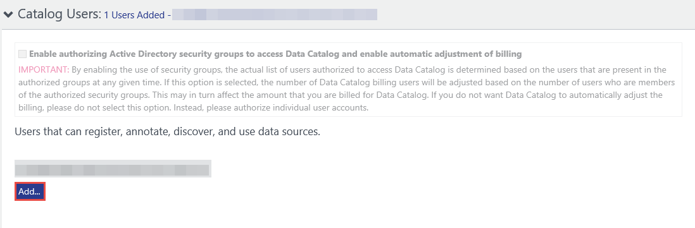
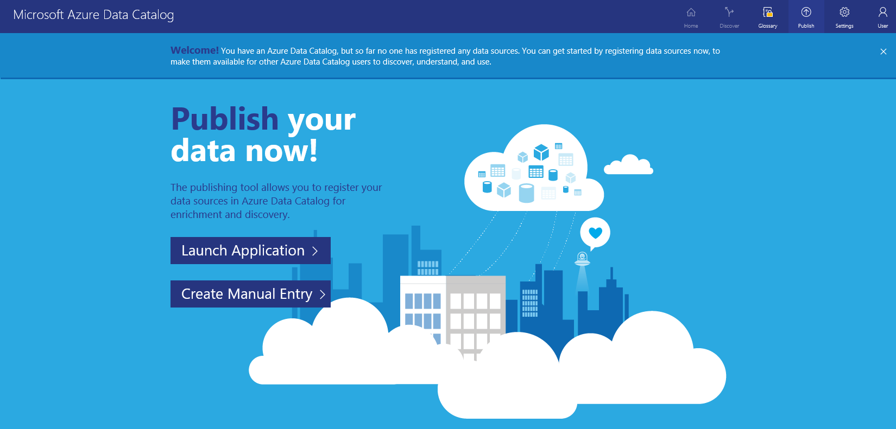
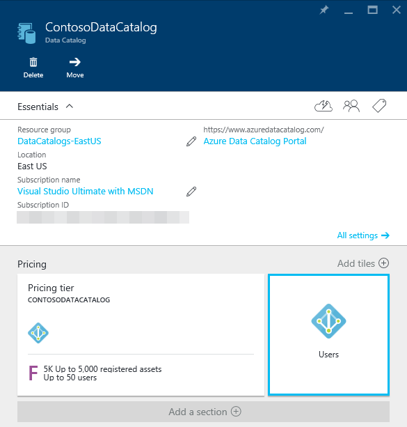
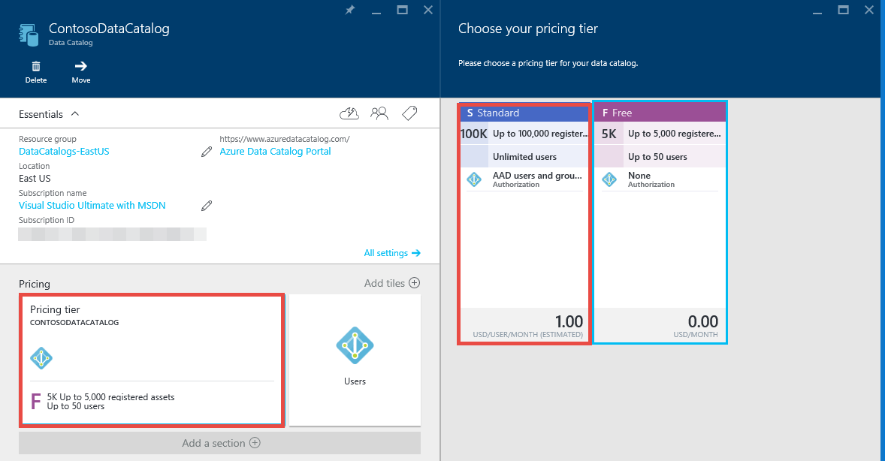
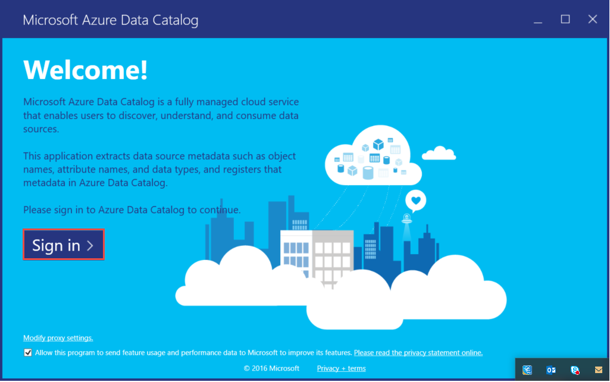
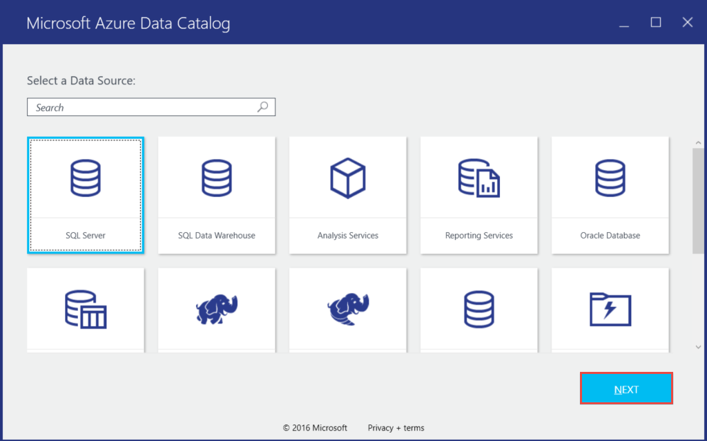

<properties
    pageTitle="Guida introduttiva a catalogo dati | Microsoft Azure"
    description="Esercitazione-to-end presentazione gli scenari e funzionalità del catalogo dati di Azure."
    documentationCenter=""
    services="data-catalog"
    authors="steelanddata"
    manager="jhubbard"
    editor=""
    tags=""/>
<tags
    ms.service="data-catalog"
    ms.devlang="NA"
    ms.topic="get-started-article"
    ms.tgt_pltfrm="NA"
    ms.workload="data-catalog"
    ms.date="09/20/2016"
    ms.author="spelluru"/>

# Guida introduttiva a catalogo dati di Azure
Catalogo dati di Azure è un servizio cloud completamente gestita che funge da un sistema di registrazione e di sistema di individuazione per beni dati aziendali. Per informazioni dettagliate, vedere [che cos'è il catalogo dati di Azure](data-catalog-what-is-data-catalog.md).

In questa esercitazione consente di iniziare a utilizzare il catalogo dati di Azure. È possibile eseguire le procedure seguenti in questa esercitazione:

| Procedura | Descrizione |
| :--- | :---------- |
| [Catalogo dati di provisioning](#provision-data-catalog) | In questa procedura, effettuare il provisioning o configurare catalogo dati di Azure. Eseguire questo passaggio solo se il catalogo non è stato impostato prima. È consentito solo un catalogo di dati per l'organizzazione (dominio di Microsoft Azure Active Directory) anche se esistono più abbonamenti associati al proprio account Azure. |
| [Registrare i dati](#register-data-assets) | In questa procedura, registrare risorse dati dal database di esempio AdventureWorks2014 con il catalogo dati. La registrazione è il processo di estrazione chiavi metadati strutturali, ad esempio nomi e i tipi di posizioni dell'origine dati e la copia dei metadati del catalogo. L'origine dati e i dati rimangono nel punto in cui sono, ma i metadati vengono usato dal catalogo per renderli più facilmente individuabili e comprensibili. |
| [Alla scoperta di dati](#discover-data-assets) | In questa procedura, è possibile portale del catalogo dati di Azure alla scoperta di risorse di dati che sono stati registrati nel passaggio precedente. Dopo un'origine dati è stata registrata con catalogo dati di Azure, i metadati verrà indicizzato dal servizio in modo che gli utenti possono cercare i dati che necessari. |
| [Aggiungere note alle risorse di dati](#annotate-data-assets) | In questa procedura per fornire le annotazioni (informazioni, ad esempio le descrizioni, contrassegni, documentazione o esperti) per le risorse dati. Queste informazioni supplementari metadati estratti dall'origine dati e rendere più comprensibile l'origine dati di altre persone. |
| [Connettersi a dati](#connect-to-data-assets) | In questa procedura, si apre risorse di dati in strumenti client integrata (ad esempio, Excel e SQL Server Data Tools) e uno strumento non integrata (SQL Server Management Studio). |
| [Gestire le risorse dati](#manage-data-assets) | In questa procedura, impostare la protezione per le risorse dati. Catalogo dati è possibile accedere ai dati. Il proprietario dell'origine dati consente di controllare l'accesso ai dati.    Con il catalogo dati, è possibile individuare le origini dati e visualizzare i **metadati** relativi alle origini registrate nel catalogo. Si possono verificare situazioni, tuttavia, in cui le origini dati devono essere visibili solo a specifici utenti o ai membri dei gruppi specifici. Per questi scenari, è possibile utilizzare catalogo dati assunzione dei beni registrati dati all'interno del catalogo e controllare la visibilità dei beni che si è proprietari. |
| [Rimozione di dati](#remove-data-assets) | In questa procedura si imparerà a rimuovere dati dal catalogo dati. |  

## Prerequisiti esercitazione

### Abbonamento Azure
Per impostare il catalogo dati di Azure, è necessario essere il proprietario o Comproprietario di un abbonamento Azure.

Sottoscrizioni di Azure consentono di organizzare accesso alle risorse di servizio cloud come catalogo dati di Azure. Sono inoltre consentono di gestire la modalità di segnalazione Uso risorse, fatturazione e pagato. Ciascuna sottoscrizione può avere un'installazione di fatturazione e pagamenti diversa, pertanto è possibile utilizzare diversi abbonamenti e diversi piani di reparto, project, filiale e così via. Ogni servizio cloud appartiene a un abbonamento ed è necessario avere un abbonamento prima che la configurazione del catalogo dati di Azure. Per ulteriori informazioni, vedere [gestire gli account, abbonamenti e ruoli amministrativi](../active-directory/active-directory-how-subscriptions-associated-directory.md).

Se non si dispone di una sottoscrizione, è possibile creare un account di valutazione gratuito in pochi minuti. Per informazioni dettagliate, vedere [Versione di valutazione gratuita](https://azure.microsoft.com/pricing/free-trial/) .

### Azure Active Directory
Per impostare il catalogo dati di Azure, è necessario aver effettuato l'accesso con un account utente di Azure Active Directory (Azure Active Directory). È necessario essere il proprietario o Comproprietario di un abbonamento Azure.  

Azure Active Directory offre un modo semplice per l'azienda gestire l'accesso, sia nel cloud e in locale e identità. È possibile utilizzare un singolo account aziendale o dell'istituto di istruzione per accedere a tutte le applicazioni web cloud o locale. Catalogo dati di Azure utilizza Azure Active Directory per eseguire l'autenticazione accesso. Per ulteriori informazioni, vedere [Novità](../active-directory/active-directory-whatis.md)di Azure Active Directory.

### Configurazione dei criteri di Azure Active Directory

È possibile riscontrare situazioni in cui è possibile accedere al portale di catalogo dati di Azure, ma quando si tenta di accedere allo strumento di registrazione di origine dati, viene visualizzato un messaggio di errore che impedisce l'accesso. Questo errore può verificarsi quando sono connessi alla rete della società o quando ci si connette dall'esterno della rete aziendale.

Lo strumento di registrazione utilizza *l'autenticazione basata su moduli* per convalidare gli accessi utente su Azure Active Directory. Per l'esito negativo accesso, un amministratore di Azure Active Directory necessario abilitare l'autenticazione di moduli nei *criteri di autenticazione globali*.

Con il criterio di autenticazione globale, è possibile abilitare l'autenticazione separatamente per intranet e le connessioni extranet, come illustrato nell'immagine seguente. Problemi di accesso possono verificarsi se l'autenticazione basata su non abilitato per la rete da cui ci si connette.

 

Per ulteriori informazioni, vedere [configurazione dei criteri di autenticazione](https://technet.microsoft.com/library/dn486781.aspx).

## Catalogo dati di provisioning
È possibile eseguire il provisioning di un solo catalogo dati per l'organizzazione (dominio di Azure Active Directory). Pertanto, se il proprietario o Comproprietario di un abbonamento Azure appartenente a questo dominio di Azure Active Directory è già creato un catalogo, non sarà possibile creare un catalogo nuovamente anche se si hanno più abbonamenti Azure. Per verificare se un catalogo dati è stato creato da un utente nel dominio Azure Active Directory, passare alla [home page di catalogo dati di Azure](http://azuredatacatalog.com) e verificare se viene visualizzato il catalogo. Se è già stato creato un catalogo dell'utente, ignorare la procedura seguente e passare alla sezione successiva.    

1. Passare alla [pagina del servizio Catalogo dati](https://azure.microsoft.com/services/data-catalog) e fare clic su **per iniziare**.

    
2. Accedere con un account utente che è il proprietario o Comproprietario di un abbonamento Azure. Viene visualizzata la pagina seguente dopo l'accesso.

    
3. Specificare un **nome** per il catalogo dati, l' **abbonamento** che si desidera utilizzare e il **percorso** per il catalogo.
4. Espandere i **prezzi** e selezionare un catalogo dati di Azure **edizione** (gratuito o Standard).
    
5. Espandere **Gli utenti catalogo** e fare clic su **Aggiungi** per aggiungere gli utenti per il catalogo dati. Vengono automaticamente aggiunti al gruppo.
    
6. Espandere **Gli amministratori di catalogo** e fare clic su **Aggiungi** per aggiungere altri amministratori per il catalogo dati. Vengono automaticamente aggiunti al gruppo.
    
7. Fare clic su **Crea catalogo** per creare il catalogo dati per l'organizzazione. Viene visualizzata la pagina home per il catalogo dati dopo averlo creato.
        

### Trovare un catalogo di dati nel portale di Azure
1. In una scheda distinta nel web browser o in una finestra separata del browser, accedere al [portale di Azure](https://portal.azure.com) e accedere con lo stesso account usato per creare il catalogo dati nel passaggio precedente.
2. Selezionare **Sfoglia** e quindi fare clic su **Catalogo dati**.

     viene visualizzato il catalogo dati è stato creato.

    
4.  Fare clic su catalogo creato. Viene visualizzato e il **Catalogo dati** nel portale.

    
5. È possibile visualizzare le proprietà del catalogo dati e li aggiorna. Ad esempio, fare clic su **livello prezzi** e modificare l'edizione.

    

### Database di esempio Adventure Works
In questa esercitazione si registra risorse dati (tabelle) dal database di esempio AdventureWorks2014 per il motore di Database di SQL Server, ma se si preferisce utilizzare i dati che sono familiare e i contenuti pertinenti per il proprio ruolo, è possibile utilizzare qualsiasi origine dati supportati. Per un elenco delle origini dati supportate, vedere [origini dati supportate](data-catalog-dsr.md).

### Installare il database di Adventure Works 2014 OLTP
Il database di Adventure Works supporta scenari di elaborazione delle transazioni online standard per un produttore bicicletta fittizio (Adventure Works cicli), che include i prodotti, venditi e di acquisti. In questa esercitazione, registrare informazioni sui prodotti in catalogo dati di Azure.

Per installare il database di esempio Adventure Works:

1. Scaricare [Adventure Works 2014 intero Database Backup.zip](https://msftdbprodsamples.codeplex.com/downloads/get/880661) su CodePlex.
2. Per ripristinare il database nel computer in uso, seguire le istruzioni di [ripristinare un Database con SQL Server Management Studio](http://msdn.microsoft.com/library/ms177429.aspx)o procedendo come segue:
    1. Aprire SQL Server Management Studio e connettersi al motore di Database SQL Server.
    2. Pulsante destro del mouse **database** e fare clic su **Ripristina Database**.
    3. In **Ripristina Database**, fare clic sull'opzione di **dispositivo** per **origine** e fare clic su **Sfoglia**.
    4. Nella casella **Selezionare i dispositivi di backup**, fare clic su **Aggiungi**.
    5. Passare alla cartella in cui il file **AdventureWorks2014.bak** , selezionare il file e fare clic su **OK** per chiudere la finestra di dialogo **Individua File di Backup** .
    6. Fare clic su **OK** per chiudere la finestra di dialogo **Selezionare i dispositivi di backup** .    
    7. Fare clic su **OK** per chiudere la finestra di dialogo **Ripristina Database** .

È ora possibile registrare risorse dati dal database di esempio Adventure Works tramite catalogo dati di Azure.

## Registrare i dati

In questa esercitazione utilizzare lo strumento di registrazione per registrare risorse dati dal database di Adventure Works con il catalogo. La registrazione è il processo di estrazione chiavi metadati strutturali, ad esempio nomi e tipi di percorsi dall'origine dati e le risorse che contiene e la copia dei metadati del catalogo. L'origine dati e i dati rimangono nel punto in cui sono, ma i metadati vengono usato dal catalogo per renderli più facilmente individuabili e comprensibili.

### Registrare un'origine dati

1.  Passare alla [home page di catalogo dati di Azure](https://azuredatacatalog.com) e fare clic su **Pubblica dati**.

    

2.  Fare clic su **Avvia applicazione** per scaricare, installare ed eseguire lo strumento di registrazione del computer.

    

3. Nella pagina di **benvenuto** , fare clic su **Accedi** e immettere le credenziali.    

    

4. Nella pagina **Catalogo dati di Microsoft Azure** fare clic su **SQL Server** e il **successivo**.

    

5.  Immettere le proprietà di connessione di SQL Server per **AdventureWorks2014** (vedere nell'esempio seguente) e fare clic su **CONNETTI**.

    

6.  Registrare i metadati di bene i dati. In questo esempio, per registrare gli oggetti di **Produzione/prodotto** dello spazio dei nomi produzione AdventureWorks:

    1. Nella struttura **Gerarchica di Server** espandere **AdventureWorks2014** e fare clic su **produzione**.
    2. Selezionare **Product**, **ProductCategory**, **ProductDescription**e **ProductPhoto** tramite Ctrl + clic.
    3. Fare clic su **Sposta freccia selezionato** (**>**). Questa azione consente di spostare tutti gli oggetti selezionati nell'elenco **oggetti da registrare** .

        
    4. Selezionare **Includi un'anteprima** per includere un'anteprima snapshot dei dati. Snapshot include un massimo di 20 record di ogni tabella viene copiata nel catalogo.
    5. Selezionare **Includi dati profilo** da includere uno snapshot delle statistiche oggetto per il profilo di dati (ad esempio: i valori minimi, massimo e Media per una colonna, numero di righe).
    6. Nella casella **aggiungere tag** , immettere **il adventure works, cicli**. Questa azione consente di aggiungere tag di ricerca per le risorse dati. Tag sono un ottimo metodo per consentire agli utenti di trovare un'origine dati registrati.
    7. Specificare il nome di un **esperto** su tali dati (facoltativi).

        

    8. Fare clic su **Registra**. Catalogo dati di Azure registra gli oggetti selezionati. In questa esercitazione sono registrati gli oggetti selezionati da Adventure Works. Lo strumento di registrazione estrae i metadati da bene dati e consente di copiare i dati nel servizio Catalogo dati di Azure. I dati rimarranno nel punto in cui si trova attualmente, che rimane sotto il controllo degli amministratori e i criteri del sistema corrente.

        

    9. Per visualizzare gli oggetti origine dati registrati, fare clic su **Visualizzazione Portal**. Nel portale di catalogo dati di Azure, verificare che sia visualizzata tutti e quattro le tabelle e il database nella visualizzazione griglia.

        

In questa esercitazione si registrato oggetti dal database di esempio Adventure Works in modo che che possano essere facilmente individuate dagli utenti all'interno dell'organizzazione. Esercizio successivo, come individuare dati registrati.

## Alla scoperta di dati
Individuazione nel catalogo dati di Azure utilizza due metodi principali: la ricerca e filtro.

La ricerca è progettata per essere intuitivo e potente. Per impostazione predefinita, i termini di ricerca vengono confrontati con le proprietà del catalogo, incluse le annotazioni fornito dall'utente.

Il filtro è progettato per completare la ricerca. È possibile selezionare caratteristiche specifiche, ad esempio esperti, tipo di origine dati, il tipo di oggetto e tag per visualizzare le risorse dati corrispondente e per limitare i risultati della ricerca in corrispondenza di risorse.

Utilizzando una combinazione di ricerca e filtro, è possibile spostarsi rapidamente le origini dati che sono state registrate con catalogo dati di Azure per individuare le risorse dati che necessarie.

In questa esercitazione si utilizzare il portale di catalogo dati di Azure per individuare le risorse dati registrate nell'esercizio precedente. Per informazioni dettagliate sulla sintassi di ricerca, vedere [riferimenti per la ricerca in catalogo dati sintassi](https://msdn.microsoft.com/library/azure/mt267594.aspx) .

Di seguito sono riportati alcuni esempi per il rilevamento delle risorse di dati nel catalogo.  

### Alla scoperta di risorse di dati di ricerca di base
Ricerca di base consente di cercare un catalogo utilizzando uno o più termini di ricerca. Risultati sono tutte le risorse che corrispondono a una proprietà con una o più delle condizioni specificate.

1. Nel portale di catalogo dati di Azure, fare clic su **Home** . Se è stato chiuso il web browser, passare alla [home page di catalogo dati di Azure](https://www.azuredatacatalog.com).
2. Nella casella di ricerca immettere `cycles` e premere **INVIO**.

    
3. Verificare che sia visualizzata tutti e quattro le tabelle e il database (AdventureWorks2014) nei risultati. È possibile passare tra la **visualizzazione della griglia** e **visualizzazione elenco** , fare clic sui pulsanti sulla barra degli strumenti, come illustrato nell'immagine seguente. Parola chiave di ricerca viene evidenziato nei risultati della ricerca perché l'opzione **evidenziare** è **Attiva**. È inoltre possibile specificare il numero di **risultati per pagina** nei risultati della ricerca.

    

    Riquadro **ricerche** è sul lato sinistro e pannello **proprietà** è a destra. Nel riquadro **ricerche** , è possibile modificare i criteri di ricerca e filtrare i risultati. Pannello **proprietà** Visualizza le proprietà di un oggetto selezionato nella griglia o elenco.

4. Fare clic su **Product** nei risultati della ricerca. Fare clic su **Anteprima**, **colonne**, **Profilo dei dati**e le schede **documentazione** oppure fare clic sulla freccia per espandere il riquadro inferiore.  

    

    Nella scheda **Anteprima** visualizzare un'anteprima dei dati nella tabella **Product** .  
5. Fare clic sulla scheda **colonne** per informazioni dettagliate sulle colonne (ad esempio **nome** e **tipo di dati**) del bene di dati.
6. Fare clic sulla scheda **Profilo dei dati** per visualizzare l'analisi dei dati (ad esempio: numero di righe, dimensioni dei dati o il valore minimo in una colonna) del bene di dati.
7. Filtrare i risultati utilizzando i **filtri** sul lato sinistro. Ad esempio, fare clic su **tabella** per **Tipo di oggetto**e vengono visualizzate le quattro tabelle, non il database.

    

### Alla scoperta di risorse di dati con la definizione dell'ambito di proprietà
Definizione dell'ambito proprietà consente di individuare risorse di dati in cui il termine di ricerca viene trovata una corrispondenza con la proprietà specificata.

1. Cancellare il filtro di **tabella** in **Tipo di oggetto** nei **filtri**.  
2. Nella casella di ricerca immettere `tags:cycles` e premere **INVIO**. Per tutte le proprietà che è possibile utilizzare per la ricerca del catalogo dati, vedere [riferimenti per la ricerca in catalogo dati sintassi](https://msdn.microsoft.com/library/azure/mt267594.aspx) .
3. Verificare che sia visualizzata tutti e quattro le tabelle e il database (AdventureWorks2014) nei risultati.  

    

### Salvare la ricerca
1. Nel riquadro **ricerche** nella sezione **Ricerca corrente** , immettere un nome per la ricerca e fare clic su **Salva**.

    
2. Verificare che la ricerca salvata viene visualizzata in **Ricerche salvate**.

    
3. Selezionare una delle operazioni che è possibile eseguire su ricerca salvata (**rinominare**, **eliminare**, **Salva come predefinito** ricerca).

    

### Operatori booleani
È possibile ampliare o restringere la ricerca con operatori booleani.

1. Nella casella di ricerca immettere `tags:cycles AND objectType:table`, e premere **INVIO**.
2. Verificare che sia visualizzata solo nei risultati della tabelle (non il database).  

    

### Raggruppamento tra parentesi
Raggruppamento tra parentesi, è possibile raggruppare parti della query per ottenere l'isolamento logico, in particolare insieme operatori booleani.

1. Nella casella di ricerca immettere `name:product AND (tags:cycles AND objectType:table)` e premere **INVIO**.
2. Verificare che sia visualizzata solo la tabella **Product** nei risultati della ricerca.

       

### Operatori di confronto
Con operatori di confronto, è possibile utilizzare i confronti ad eccezione di uguaglianza per le proprietà con tipi di dati numerici e di Data.

1. Nella casella di ricerca immettere `lastRegisteredTime:>"06/09/2016"`.
2. Cancellare il filtro di **tabella** in **Tipo di oggetto**.
3. Premere **INVIO**.
4. Verificare che sia visualizzata tabelle **Product**, **ProductCategory**, **ProductDescription**e **ProductPhoto** e il database AdventureWorks2014 registrato nei risultati della ricerca.

    

Per informazioni dettagliate sulla individuazione risorse dati e [riferimenti per la ricerca in catalogo dati sintassi](https://msdn.microsoft.com/library/azure/mt267594.aspx) per la sintassi di ricerca, vedere [come individuare i dati](data-catalog-how-to-discover.md) .

## Aggiungere note alle risorse di dati
In questa esercitazione verrà usato portale del catalogo dati di Azure per annotare (aggiunta di informazioni, ad esempio le descrizioni, tag o esperti) risorse dati è stato registrato in precedenza nel catalogo. Le annotazioni integrano e migliorano i metadati strutturali estratti dall'origine dati durante la registrazione e rendono più facile individuare e comprendere le risorse dati.

In questa esercitazione si annotazioni una risorsa di dati single (ProductPhoto). Aggiungere un nome descrittivo e una descrizione per la risorsa dati ProductPhoto.  

1.  Passare alla [home page di catalogo dati di Azure](https://www.azuredatacatalog.com) e una ricerca con `tags:cycles` per trovare le risorse dati è stata registrata.  
2. Fare clic su **ProductPhoto** nei risultati della ricerca.  
3. Immettere **le immagini dei prodotti** per **prodotto foto per materiali di marketing** e **Nome descrittivo** per la **Descrizione**.

    

    La **Descrizione** consente ad altri utenti di individuare e comprendere il motivo e su come utilizzare le risorse dati selezionati. È anche possibile aggiungere più tag e visualizzare le colonne. A questo punto è possibile provare la ricerca e filtro consentono di scoprire le risorse dati utilizzando i metadati descrittivo aggiunti al catalogo.

È anche possibile eseguire le operazioni seguenti in questa pagina:

- Aggiungere esperti per le risorse dati. Fare clic su **Aggiungi** nell'area di **esperti** .
- Aggiungere contrassegni a livello di set di dati. Fare clic su **Aggiungi** nell'area di **tag** . Un tag che può essere un tag utente o un glossario. Edizione Standard del catalogo dati include un glossario business che consente agli amministratori di catalogo di definire una tassonomia business centrale. Gli utenti catalogo quindi possono aggiungere note alle risorse di dati con il glossario. Per ulteriori informazioni, vedere [come configurare il glossario Business per il Tagging regolata](data-catalog-how-to-business-glossary.md)
- Aggiungere contrassegni a livello di colonna. Fare clic su **Aggiungi** in **tag** per la colonna che si desidera annotare.
- Aggiungere una descrizione a livello di colonna. Immettere una **Descrizione** per una colonna. È inoltre possibile visualizzare i metadati di descrizione estratti dall'origine dati.
- Aggiungere le informazioni **richieste di accesso** che illustra gli utenti dovranno richiedere l'accesso alle risorse dei dati.

    

- Scegliere la scheda **documentazione** e fornire la documentazione per la risorsa dati. Con la documentazione del catalogo dati di Azure, è possibile utilizzare il catalogo dati come un archivio di contenuto per creare una descrizione completa illustri delle risorse di dati.

    

È anche possibile aggiungere un'annotazione a più risorse di dati. Ad esempio, è possibile selezionare tutte le risorse dati che è registrato e specificare un esperto per loro.

Catalogo dati di Azure supporta un approccio acquisti massa per le annotazioni. Qualsiasi utente catalogo dati può aggiungere tag (utente o glossario), descrizioni e altri metadati, in modo che tutti gli utenti con un punto di vista su una risorsa di dati e il relativo utilizzo possono avere la prospettiva acquisito e disponibile agli altri utenti.

Per informazioni dettagliate sull'annotazione risorse dati, vedere [come aggiungere note alle risorse di dati](data-catalog-how-to-annotate.md) .

## Connettersi a dati
In questa esercitazione si apre risorse di dati in uno strumento client integrato (Excel) e uno strumento non integrata (SQL Server Management Studio) utilizzando le informazioni di connessione.

> [AZURE.NOTE] È importante tenere presente che il catalogo dati di Azure non consentono di accedere all'origine dati effettivo, è sufficiente rende più facile per individuare e comprendere la. Quando ci si connette a un'origine dati, l'applicazione client che si sceglie Usa le credenziali di Windows o si richiede le credenziali necessarie. Se non si è già state concesse accesso all'origine dati, è necessario essere autorizzati ad accedervi prima che sia possibile connettersi.

### Connettersi a una risorsa di dati da Excel

1. Selezionare **prodotto** dai risultati della ricerca. Fare clic su **Apri In** sulla barra degli strumenti e fare clic su **Excel**.

    
2. Fare clic su **Apri** in una finestra popup download. L'esperienza può variare a seconda del browser.

    
3. Nella finestra di **Avviso di protezione di Microsoft Excel** , fare clic su **Attiva**.

    
4. Mantenere le impostazioni predefinite nella finestra di dialogo **Importa dati** e fare clic su **OK**.

    
5. Visualizzare l'origine dati in Excel.

    

In questa esercitazione si connessi a risorse di dati rilevati tramite catalogo dati di Azure. Con il portale di catalogo dati di Azure, è possibile connettersi direttamente tramite le applicazioni client integrate con il menu **Apri in** . È anche possibile connettersi con qualsiasi applicazione che scegliere utilizzando le informazioni sulla posizione di connessione incluse nei metadati risorse. Ad esempio, è possibile utilizzare SQL Server Management Studio per connettersi al database AdventureWorks2014 per accedere ai dati attività dati registrato in questa esercitazione.

1. Aprire **SQL Server Management Studio**.
2. Nella finestra di dialogo **connessione al Server** immettere il nome del server dal riquadro delle **proprietà** nel portale di catalogo dati di Azure.
3. Utilizzare l'autenticazione appropriata e le credenziali l'accesso alla risorsa dati. Se non si dispone di accesso, usare le informazioni nel campo **Richiedere l'accesso** per assicurarne il.

    

Fare clic su **Visualizza le stringhe di connessione** per visualizzare e copiare le stringhe di connessione ADF.NET, ODBC e OLEDB negli Appunti per l'utilizzo dell'applicazione.

## Gestire le risorse dati
In questo passaggio, viene visualizzato come impostare la protezione per i vostri dati. Catalogo dati è possibile accedere ai dati. Il proprietario dell'origine dati consente di controllare l'accesso ai dati.

È possibile utilizzare il catalogo dati per individuare origini dati e visualizzare i metadati relativi alle origini registrate nel catalogo. Si possono verificare situazioni, tuttavia, in cui le origini dati solo devono essere visibili a specifici utenti o ai membri dei gruppi specifici. Per questi scenari, è possibile utilizzare il catalogo dati per assunzione dei beni registrati dati all'interno del catalogo e quindi controllare la visibilità dei beni si è proprietari.

> [AZURE.NOTE] Le funzionalità di gestione descritte in questo esercizio sono disponibili solo Standard Edition di Azure catalogo di dati e non la versione gratuita.
Nel catalogo dati di Azure, è possibile assunzione dei beni di dati, aggiungere comproprietari alle risorse di dati e impostare la visibilità dei beni di dati.

### Assunzione di proprietà dei beni di dati e limitare la visibilità

1. Passare alla [home page di catalogo dati di Azure](https://www.azuredatacatalog.com). Nella casella di testo di **ricerca** immettere `tags:cycles` e premere **INVIO**.
2. Fare clic su un elemento nell'elenco dei risultati e fare clic su **Diventa proprietario** sulla barra degli strumenti.
3. Nella sezione **Gestione** del pannello **proprietà** , fare clic su **Diventa proprietario**.

    
4. Per limitare la visibilità, scegliere **proprietari e utenti** nella sezione **visibilità** e fare clic su **Aggiungi**. Immettere gli indirizzi di posta elettronica utente nella casella di testo e premere **INVIO**.

    

## Rimozione di dati

In questa esercitazione si utilizzare il portale di catalogo dati di Azure per rimuovere Anteprima dati dalle risorse dati registrato ed eliminare dati dal catalogo.

Nel catalogo dati di Azure, è possibile eliminare una singola risorsa o più risorse.

1. Passare alla [home page di catalogo dati di Azure](https://www.azuredatacatalog.com).
2. Nella casella di testo di **ricerca** immettere `tags:cycles` e premere **INVIO**.
3. Selezionare un elemento nell'elenco dei risultati e fare clic su **Elimina** sulla barra degli strumenti come illustrato nell'immagine seguente:

    

    Se si utilizza la visualizzazione elenco, la casella di controllo è a sinistra dell'elemento, come illustrato nell'immagine seguente:

    

    È anche possibile selezionare più risorse di dati ed eliminarle come illustrato nell'immagine seguente:

    

> [AZURE.NOTE] Il comportamento predefinito del catalogo è per consentire a tutti gli utenti per registrare qualsiasi origine dati e per consentire a tutti gli utenti da eliminare qualsiasi risorsa dati che è stata registrata. La funzionalità di gestione incluse nel Standard Edition di Azure catalogo dati offrono altre opzioni per le proprietà dei beni, limitare chi può scoprire beni, e limitare chi può eliminare risorse.

## Riepilogo

In questa esercitazione sono stati illustrati essenziali funzionalità del catalogo dati di Azure, tra cui la registrazione, annotazione, individuazione e gestione beni dati aziendali. Dopo aver completato l'esercitazione, è ora per iniziare. È possibile iniziare oggi registrando le origini dati è che il team si basano sulle e da invitare i colleghi a usare il catalogo.

## Riferimenti

- [Come registrare risorse dati](data-catalog-how-to-register.md)
- [Come individuare i dati](data-catalog-how-to-discover.md)
- [Come aggiungere note alle risorse di dati](data-catalog-how-to-annotate.md)
- [Come dati del documento](data-catalog-how-to-documentation.md)
- [Come connettersi a dati](data-catalog-how-to-connect.md)
- [Modalità di gestione dati](data-catalog-how-to-manage.md)
