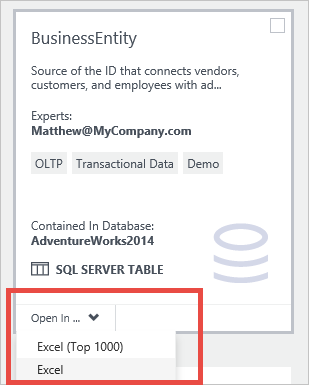

<properties
   pageTitle="Come connettersi a origini dati | Microsoft Azure"
   description="Articolo procedure evidenziazione come connettersi a origini dati riscontrate con catalogo dati di Azure."
   services="data-catalog"
   documentationCenter=""
   authors="steelanddata"
   manager="NA"
   editor=""
   tags=""/>
<tags
   ms.service="data-catalog"
   ms.devlang="NA"
   ms.topic="article"
   ms.tgt_pltfrm="NA"
   ms.workload="data-catalog"
   ms.date="09/15/2016"
   ms.author="maroche"/>

# Come connettersi a origini dati

## Introduzione
**Catalogo dati di Microsoft Azure** è un servizio cloud completamente gestita che funge da un sistema di registrazione e di sistema di individuazione per le origini dati dell'organizzazione. In altre parole, **Catalogo dati di Azure** è basato sui consentire agli utenti alla scoperta di comprensione e utilizzare le origini dati e alle organizzazioni di risoluzione per ottenere il massimo dai dati esistenti. Un aspetto chiave di questo scenario è utilizzando i dati: quando un utente rileva un'origine dati e riconosce allo scopo, il passaggio successivo consiste nel connettersi all'origine dati per inserire i dati da utilizzare.

## Percorsi origini dati
Durante la registrazione di origine dati, **Catalogo dati di Azure** riceve metadati sull'origine dati. Questi metadati includono i dettagli della posizione dell'origine dati. I dettagli della posizione variano dall'origine dati all'origine dati, ma conterrà sempre le informazioni necessarie per la connessione. Ad esempio, la posizione per una tabella di SQL Server include il nome del server, nome del database, nome dello schema e nome della tabella, mentre la posizione per un report di SQL Server Reporting Services include il nome del server e il percorso del report. Altri tipi di origini dati avrà posizioni che riflettono la struttura e le funzionalità del sistema di origine.

## Strumenti client integrata
Il modo più semplice per connettersi a un'origine dati è utilizzare il "aperto nel...." menu nel portale di **Catalogo dati di Azure** . Visualizza un elenco di opzioni per la connessione per la risorsa dati selezionati.
Quando si utilizza la visualizzazione affiancata predefinito, questo menu è disponibile in ogni sezione.

 

Quando si utilizza la visualizzazione elenco, il menu è disponibile nella barra di ricerca nella parte superiore della finestra del portale.

 

## Applicazioni Client supportate
Quando si utilizza il "aperto nel...." menu per le origini dati nel portale di catalogo dati di Azure, l'applicazione client corretto deve essere installato nel computer client.

| Apri nell'applicazione | Estensione file / protocollo | Versioni delle applicazioni supportate |
| --- | --- | --- |
| Excel | con estensione odc | Excel 2010 o versione successiva |
| Excel (in alto 1000) | con estensione odc | Excel 2010 o versione successiva |
| Power Query | con estensione xlsx | Excel 2016 o Excel 2010 o Excel 2013 con Power Query per Excel installata
| Power BI Desktop | .pbix | Power BI Desktop luglio 2016 o versioni successiva |
| SQL Server Data Tools | vsweb: / / | Aggiornamento di Visual Studio 2013 4 o versione successiva con gli strumenti di SQL Server installato |
| Gestione report | http:// | Vedere [requisiti del browser per SQL Server Reporting Services](https://technet.microsoft.com/en-us/library/ms156511.aspx) |

## I dati degli strumenti
Le opzioni disponibili nel menu dipenderà il tipo di dati bene attualmente selezionato. Naturalmente, non tutti gli strumenti possibili includerà la "aperto nel...." menu, ma è facile connettersi all'origine dati utilizzando lo strumento di client. Quando è selezionata una risorsa di dati nel portale di **Catalogo dati di Azure** , il percorso completo viene visualizzato nel riquadro delle proprietà.

 

La sezione informazioni connessione variano dal tipo di origine dati al tipo di origine dati, ma le informazioni contenute nel portale si otterranno tutte le informazioni che necessarie per connettersi all'origine dati in degli strumenti client. Gli utenti possono copiare i dettagli della connessione per le origini dati che vengono rilevati l'uso **Del catalogo dati di Azure**, che consente di usare i dati in loro strumento scelto.

## Autorizzazioni di origine di connessione e dati
Sebbene **Catalogo dati di Azure** rende individuabile origini dati, l'accesso ai dati rimane sotto il controllo del proprietario di origine dati o amministratore. Alla scoperta di un'origine dati nel **Catalogo dati di Azure** non fornisce a un utente le autorizzazioni per accedere all'origine dati.

Per rendere più semplice per gli utenti alla scoperta di un'origine dati, ma non dispone dell'autorizzazione per accedere ai dati, gli utenti possono fornire informazioni nella proprietà richiedere l'accesso durante l'annotazione un'origine dati. Vengono presentate le informazioni fornite di seguito, inclusi i collegamenti al processo o al punto di contatto per ottenere l'accesso all'origine dati-insieme a informazioni sulla posizione di origine dati nel portale.

 

##Riepilogo
Registrazione di un'origine dati con **Il catalogo dati di Azure** rende i dati individuabile copiando strutturali e descrittivo i metadati dall'origine dati al servizio di catalogo. Dopo aver un'origine dati è stata registrata e individuata, gli utenti possono connettersi all'origine dati dal portale di **Catalogo dati di Azure** "aperto nel...." " menu o strumenti i dati di scelta.

## Vedere anche
- [Guida introduttiva a catalogo dati di Azure](data-catalog-get-started.md) esercitazione per informazioni dettagliate su come connettersi a origini dati.
