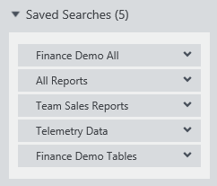
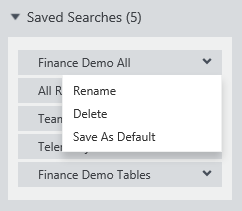

<properties
   pageTitle="Come salvare le ricerche aggiungere risorse dati | Microsoft Azure"
   description="Articolo procedure evidenziazione funzionalità nel catalogo dati di Azure per il salvataggio delle origini dati e dati per poterle riutilizzare in futuro."
   services="data-catalog"
   documentationCenter=""
   authors="steelanddata"
   manager="NA"
   editor=""
   tags=""/>
<tags
   ms.service="data-catalog"
   ms.devlang="NA"
   ms.topic="article"
   ms.tgt_pltfrm="NA"
   ms.workload="data-catalog"
   ms.date="10/10/2016"
   ms.author="maroche"/>

# Come salvare le ricerche aggiungere risorse di dati

## Introduzione

Catalogo dati di Microsoft Azure offre funzionalità di individuazione di origine dati. Gli utenti possono cercare rapidamente e filtrare il catalogo per individuare le origini dati e capire lo scopo previsto, rendendo più semplice trovare i dati appropriati per il proprio lavoro.

Ma cosa accade se gli utenti devono familiarità con gli stessi dati? Cosa succede quando gli utenti contribuire regolarmente conoscenza alle origini dati stesso nel catalogo? In questi casi, dover inviare ripetutamente le stesse ricerche può risultare inefficace: si tratta in ricerca salvata e aggiunte dati consentono di risorse.

## Ricerche salvate

Una ricerca salvata nel catalogo dati di Azure è una definizione di ricerca per utente riutilizzabile. Dopo che un utente ha definito una ricerca, che include i termini di ricerca, tag e altri filtri: è possibile salvare per successivi utilizzi. La definizione di ricerca possa essere eseguire nuovamente in un secondo momento, per restituire tutte le risorse dati che soddisfano i criteri di ricerca.

### Creazione di una ricerca salvata

Per creare una ricerca salvata, inserire i criteri di ricerca da riutilizzare. Fare clic sul collegamento "Salva" nella casella "Ricerca corrente" nel portale di catalogo dati di Azure.

 

Quando richiesto, immettere un nome per la ricerca salvata. Selezionare un nome significativo e descrittivo dei beni dati restituiti dalla ricerca.

 

### Gestione delle ricerche salvate

Una volta che un utente ha uno o più ricerche salvate, verrà visualizzata un'opzione "Ricerche salvate" nel portale di catalogo dati di Azure sotto la casella "Ricerca corrente". Quando è visualizzata, verrà visualizzato l'elenco completo delle ricerche Salva.

 

Selezione di una ricerca salvata dall'elenco impedirà la ricerca da eseguire.

Selezione del menu a discesa fornirà un set di opzioni di gestione:

 

Scegliendo "Rinomina" verrà chiesto di immettere un nuovo nome per la ricerca salvata. La definizione di ricerca non essere modificata.

Selezionando "Eliminazione" di richiesta di conferma e quindi rimuoverà la ricerca salvata dall'elenco dell'utente.

Per contrassegnare scelto ricerca salvato come la ricerca predefinita per l'utente, selezionare "Salva come predefinito". Se l'utente esegue una ricerca di "vuota" dalla home page del catalogo dati di Azure, verrà eseguita ricerca predefinita dell'utente. Inoltre, la ricerca contrassegnata come impostazione predefinita verrà visualizzata nella parte superiore dell'elenco di ricerca salvata.

### Ricerche salvate dell'organizzazione

Tutti gli utenti possono salvare le ricerche per uso proprio. Gli amministratori di catalogo dei dati è inoltre possono salvare le ricerche per tutti gli utenti all'interno dell'organizzazione. Quando si salva una ricerca, gli amministratori visualizzati un'opzione per condividere la ricerca salvata all'interno della società. Se questa opzione è selezionata, la ricerca salvata sarà incluso nell'elenco delle ricerche disponibile per tutti gli utenti.

 

## Risorse dati bloccato

Ricerche salvate consentono agli utenti di salvare e riutilizzare le definizioni di ricerca. le risorse dati restituite dalle ricerche possono cambiare nel tempo come il contenuto della modifica del catalogo. Il blocco di dati consente agli utenti di identificare in modo esplicito risorse dati specifici per trovarli più facilmente accessibili senza la necessità di utilizzare la ricerca.

Bloccare una risorsa di dati è un'operazione semplice: gli utenti possono è sufficiente fare clic sull'icona di "pin" risorsa dati per aggiungerlo all'elenco bloccato. Questa icona verrà visualizzata nell'angolo del riquadro risorse nella visualizzazione affiancata e nella colonna più a sinistra nella visualizzazione elenco nel portale di catalogo dati di Azure.

Sblocco di un bene è altrettanto semplice, è sufficiente fare clic sull'icona "aggiungere" per attivare o disattivare l'impostazione per risorsa selezionata.

## "Le risorse"
Catalogo dati di Azure home page del portale include una sezione "Risorse personali" che Visualizza risorse di interesse per l'utente corrente. In questa sezione include entrambe le risorse bloccate e le ricerche salvate.

## Riepilogo
Catalogo dati di Azure offre funzionalità che rendono più semplice per gli utenti individuare le origini dati che siano necessari, in modo che possono dedicare meno tempo nella ricerca di dati e lavorare con più tempo. Le ricerche salvate e aggiunte dati risorse basati su queste funzionalità di base per consentire agli utenti di identificare facilmente le origini dati con cui funzioneranno più volte.
