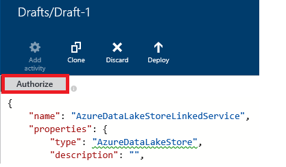

<properties
    pageTitle="Spostare i dati a / dall'archivio Lake dati di Azure | Dati di Azure Factory"
    description="Informazioni su come spostare i dati da/verso archivio Lake Azure utilizzando Factory di dati di Azure"
    services="data-factory"
    documentationCenter=""
    authors="linda33wj"
    manager="jhubbard"
    editor="monicar"/>

<tags
    ms.service="data-factory"
    ms.workload="data-services"
    ms.tgt_pltfrm="na"
    ms.devlang="na"
    ms.topic="article"
    ms.date="09/27/2016"
    ms.author="jingwang"/>

# Spostare i dati nel e dall'archivio Lake Azure utilizzando Factory di dati di Azure
Questo articolo illustra come è possibile utilizzare l'attività di copia di una factory di dati di Azure per spostare i dati da/verso archivio Lake dati di Azure da/verso un altro archivio dati. In questo articolo si basa su articolo [le attività di spostamento dei dati](data-factory-data-movement-activities.md) , che viene fornita una panoramica generale di spostamento dei dati con l'attività di copia e le combinazioni di archivio di dati supportati.

> [AZURE.NOTE]
> Creare un account Azure dati Lake archivio prima di creare una pipeline con un'attività di copia per spostare i dati da/verso un archivio di Azure dati Lake. Per informazioni su Azure dati Lake Store, vedere [Guida introduttiva di Azure dati Lake Store](../data-lake-store/data-lake-store-get-started-portal.md).
>  
> Verificare di [creare la prima esercitazione di pipeline](data-factory-build-your-first-pipeline.md) per istruzioni dettagliate per creare una factory di dati, servizi collegati, set di dati e una pipeline. Utilizzare i frammenti JSON con dati Factory Editor o Visual Studio o Azure PowerShell per creare entità Factory dati.

## Copia guidata dati
Il modo più semplice per creare una pipeline che consente di copiare dati dal piano archivio Lake dati di Azure consiste nell'utilizzare la procedura guidata dati copia. Vedere [Esercitazione: creare una pipeline utilizzando Copia guidata](data-factory-copy-data-wizard-tutorial.md) per una rapida procedura dettagliata sulla creazione di una pipeline utilizzando Copia guidata dati. 

Di seguito sono riportati definizioni JSON di esempio che è possibile utilizzare per creare una pipeline tramite [portal Azure](data-factory-copy-activity-tutorial-using-azure-portal.md) o [Visual Studio](data-factory-copy-activity-tutorial-using-visual-studio.md) o [Azure PowerShell](data-factory-copy-activity-tutorial-using-powershell.md). Verranno visualizzati come copiare i dati da e verso Azure Lake archivio dati e archiviazione Blob Azure. Dati possono essere copiati **direttamente** da una qualsiasi delle origini su uno del sink indicate [di seguito](data-factory-data-movement-activities.md#supported-data-stores) utilizzando l'attività di copia in Azure Data Factory.  

## Esempio: Copiare i dati da Blob Azure all'archivio Lake dati di Azure
Nell'esempio seguente viene:

1.  Servizio collegato di tipo [AzureStorage](#azure-storage-linked-service-properties).
2.  Servizio collegato di tipo [AzureDataLakeStore](#azure-data-lake-linked-service-properties).
3.  Un input [set di dati](data-factory-create-datasets.md) di tipo [AzureBlob](#azure-blob-dataset-type-properties).
4.  Un output [set di dati](data-factory-create-datasets.md) di tipo [AzureDataLakeStore](#azure-data-lake-dataset-type-properties).
4.  [Pipeline](data-factory-create-pipelines.md) con un'attività di copia che utilizza [BlobSource](#azure-blob-copy-activity-type-properties) e [AzureDataLakeStoreSink](#azure-data-lake-copy-activity-type-properties).

Nell'esempio vengono copiate serie temporale dati da un archivio Blob Azure archivio Lake dati di Azure ogni ora. Le proprietà JSON utilizzate in questi esempi sono descritti nelle sezioni seguenti gli esempi.

**Servizio di archiviazione collegato Azure:**

    {
      "name": "StorageLinkedService",
      "properties": {
        "type": "AzureStorage",
        "typeProperties": {
          "connectionString": "DefaultEndpointsProtocol=https;AccountName=<accountname>;AccountKey=<accountkey>"
        }
      }
    }

**Azure dati Lake collegati servizio:**

    {
        "name": "AzureDataLakeStoreLinkedService",
        "properties": {
            "type": "AzureDataLakeStore",
            "typeProperties": {
                "dataLakeStoreUri": "https://<accountname>.azuredatalakestore.net/webhdfs/v1",
                "sessionId": "<session ID>",
                "authorization": "<authorization URL>"
            }
        }
    }

### Per creare Azure Lake collegate servizio dati con dati Factory Editor
La procedura seguente vengono illustrati i passaggi per la creazione di un servizio di archivio di Azure Lake dati collegati mediante l'Editor di Factory dei dati.

1. Fare clic su **nuovo archivio dati** sulla barra dei comandi e selezionare **Archivio Lake dati di Azure**.
2. Nell'editor di JSON, per la proprietà **dataLakeStoreUri** , immettere l'URI per lake dati.
3. Fare clic su **autorizzazione** pulsante sulla barra dei comandi. Verrà visualizzata una finestra popup.

    

4. Utilizzare le credenziali per l'accesso e la proprietà di **autorizzazione** nel JSON deve essere assegnata a un valore di ora.
5. (facoltativo) Specificare i valori per i parametri facoltativi, ad esempio **nome account**, **subscriptionID**e **resourceGroupName** nel JSON o eliminare il JSON queste proprietà.
6. Fare clic su **Distribuisci** della barra dei comandi per distribuire il servizio collegato.

> [AZURE.IMPORTANT] Il codice di autorizzazione generate mediante il pulsante **autorizzazione** scade dopo un intervallo di tempo. **Riautorizzare** con **autorizzazione** pulsante quando la **scadenza del token** e Ridistribuisci servizi collegati. Vedere la sezione [Azure dati Lake collegato il servizio di archiviazione](#azure-data-lake-store-linked-service-properties) per informazioni dettagliate. 

**Set di dati input Blob Azure:**

Dati acquisiti dal nuovo blob ogni ora (frequenza: ora, intervallo: 1). Il cartella percorso e il nome per il blob vengono valutati in modo dinamico in base alla data di inizio della sezione che viene elaborata. Il percorso della cartella utilizza anno, mese e giorno parte dell'ora di inizio e nome del file viene utilizzata la parte ora dell'ora di inizio. "esterni": impostazione "true" indica servizio Factory dati che la tabella esterna su factory dati e non prodotto da un'attività nell'ambiente di produzione di dati.

    {
      "name": "AzureBlobInput",
      "properties": {
        "type": "AzureBlob",
        "linkedServiceName": "StorageLinkedService",
        "typeProperties": {
          "folderPath": "mycontainer/myfolder/yearno={Year}/monthno={Month}/dayno={Day}",
          "partitionedBy": [
            {
              "name": "Year",
              "value": {
                "type": "DateTime",
                "date": "SliceStart",
                "format": "yyyy"
              }
            },
            {
              "name": "Month",
              "value": {
                "type": "DateTime",
                "date": "SliceStart",
                "format": "MM"
              }
            },
            {
              "name": "Day",
              "value": {
                "type": "DateTime",
                "date": "SliceStart",
                "format": "dd"
              }
            },
            {
              "name": "Hour",
              "value": {
                "type": "DateTime",
                "date": "SliceStart",
                "format": "HH"
              }
            }
          ]
        },
        "external": true,
        "availability": {
          "frequency": "Hour",
          "interval": 1
        },
        "policy": {
          "externalData": {
            "retryInterval": "00:01:00",
            "retryTimeout": "00:10:00",
            "maximumRetry": 3
          }
        }
      }
    }

**Azure dati Lake output set di dati:**

Nell'esempio copia i dati a un archivio di Azure dati Lake. Nuovi dati sono copie da dati Lake archiviare ogni ora.

    {
        "name": "AzureDataLakeStoreOutput",
        "properties": {
            "type": "AzureDataLakeStore",
            "linkedServiceName": "AzureDataLakeStoreLinkedService",
            "typeProperties": {
                "folderPath": "datalake/output/"
            },
            "availability": {
                "frequency": "Hour",
                "interval": 1
            }
        }
    }

**Pipeline con un'attività di copia:**

La pipeline contiene un'attività di copia che è configurato per usare i set di dati di input e di output e pianificato per l'esecuzione di ogni ora. Pipeline definizione JSON, il tipo di **origine** è impostato su **BlobSource** e tipo **sink** è impostato su **AzureDataLakeStoreSink**.

    {  
        "name":"SamplePipeline",
        "properties":
        {  
            "start":"2014-06-01T18:00:00",
            "end":"2014-06-01T19:00:00",
            "description":"pipeline with copy activity",
            "activities":
            [  
                {
                    "name": "AzureBlobtoDataLake",
                    "description": "Copy Activity",
                    "type": "Copy",
                    "inputs": [
                    {
                        "name": "AzureBlobInput"
                    }
                    ],
                    "outputs": [
                    {
                        "name": "AzureDataLakeStoreOutput"
                    }
                    ],
                    "typeProperties": {
                        "source": {
                            "type": "BlobSource",
                            "treatEmptyAsNull": true,
                            "blobColumnSeparators": ","
                        },
                        "sink": {
                            "type": "AzureDataLakeStoreSink"
                        }
                    },
                    "scheduler": {
                        "frequency": "Hour",
                        "interval": 1
                    },
                    "policy": {
                        "concurrency": 1,
                        "executionPriorityOrder": "OldestFirst",
                        "retry": 0,
                        "timeout": "01:00:00"
                    }
                }
            ]
        }
    }

## Esempio: Copiare dati da Azure dati Lake archivio Blob Azure
Nell'esempio seguente viene:

1.  Servizio collegato di tipo [AzureDataLakeStore](#azure-data-lake-linked-service-properties).
2.  Servizio collegato di tipo [AzureStorage](#azure-storage-linked-service-properties).
3.  Un input [set di dati](data-factory-create-datasets.md) di tipo [AzureDataLakeStore](#azure-data-lake-dataset-type-properties).
4.  Un output [set di dati](data-factory-create-datasets.md) di tipo [AzureBlob](#azure-blob-dataset-type-properties).
5.  Una [pipeline](data-factory-create-pipelines.md) con un'attività di copia che utilizza [AzureDataLakeStoreSource](#azure-data-lake-copy-activity-type-properties) e [BlobSink](#azure-blob-copy-activity-type-properties)

Nell'esempio vengono copiate serie temporale dati da un archivio di Azure dati Lake blob Azure ogni ora. Le proprietà JSON utilizzate in questi esempi sono descritti nelle sezioni seguenti gli esempi.

**Archivio Lake dati di Azure collegati servizio:**

    {
        "name": "AzureDataLakeStoreLinkedService",
        "properties": {
            "type": "AzureDataLakeStore",
            "typeProperties": {
                "dataLakeStoreUri": "https://<accountname>.azuredatalakestore.net/webhdfs/v1",
                "sessionId": "<session ID>",
                "authorization": "<authorization URL>"
            }
        }
    }

> [AZURE.NOTE] Vedere la procedura illustrata nell'esempio precedente per ottenere l'URL di autorizzazione.  

**Servizio di archiviazione collegato Azure:**

    {
      "name": "StorageLinkedService",
      "properties": {
        "type": "AzureStorage",
        "typeProperties": {
          "connectionString": "DefaultEndpointsProtocol=https;AccountName=<accountname>;AccountKey=<accountkey>"
        }
      }
    }

**Azure dati Lake input set di dati:**

Impostazione **"esterni": true** informa il servizio Factory dati che la tabella esterna su factory dati e non prodotto da un'attività nell'ambiente di produzione di dati.

    {
        "name": "AzureDataLakeStoreInput",
        "properties":
        {
            "type": "AzureDataLakeStore",
            "linkedServiceName": "AzureDataLakeStoreLinkedService",
            "typeProperties": {
                "folderPath": "datalake/input/",
                "fileName": "SearchLog.tsv",
                "format": {
                    "type": "TextFormat",
                    "rowDelimiter": "\n",
                    "columnDelimiter": "\t"
                }
            },
            "external": true,
            "availability": {
                "frequency": "Hour",
                "interval": 1
            },
            "policy": {
                "externalData": {
                    "retryInterval": "00:01:00",
                    "retryTimeout": "00:10:00",
                    "maximumRetry": 3
                }
            }
        }
    }

**Archivio Blob Azure output set di dati:**

I dati vengono scritti in un nuovo blob ogni ora (frequenza: ora, intervallo: 1). Il percorso della cartella per il blob viene valutato in modo dinamico in base alla data di inizio della sezione che viene elaborata. Il percorso della cartella Usa anno, mese, giorno e parti di ore dell'ora di inizio.

    {
      "name": "AzureBlobOutput",
      "properties": {
        "type": "AzureBlob",
        "linkedServiceName": "StorageLinkedService",
        "typeProperties": {
          "folderPath": "mycontainer/myfolder/yearno={Year}/monthno={Month}/dayno={Day}/hourno={Hour}",
          "partitionedBy": [
            {
              "name": "Year",
              "value": {
                "type": "DateTime",
                "date": "SliceStart",
                "format": "yyyy"
              }
            },
            {
              "name": "Month",
              "value": {
                "type": "DateTime",
                "date": "SliceStart",
                "format": "MM"
              }
            },
            {
              "name": "Day",
              "value": {
                "type": "DateTime",
                "date": "SliceStart",
                "format": "dd"
              }
            },
            {
              "name": "Hour",
              "value": {
                "type": "DateTime",
                "date": "SliceStart",
                "format": "HH"
              }
            }
          ],
          "format": {
            "type": "TextFormat",
            "columnDelimiter": "\t",
            "rowDelimiter": "\n"
          }
        },
        "availability": {
          "frequency": "Hour",
          "interval": 1
        }
      }
    }

**Pipeline con l'attività di copia:**

La pipeline contiene un'attività di copia che è configurato per usare i set di dati di input e di output e pianificato per l'esecuzione di ogni ora. Pipeline definizione JSON, il tipo di **origine** è impostato su **AzureDataLakeStoreSource** e tipo **sink** è impostato su **BlobSink**.

    {  
        "name":"SamplePipeline",
        "properties":{  
            "start":"2014-06-01T18:00:00",
            "end":"2014-06-01T19:00:00",
            "description":"pipeline for copy activity",
            "activities":[  
                {
                    "name": "AzureDakeLaketoBlob",
                    "description": "copy activity",
                    "type": "Copy",
                    "inputs": [
                      {
                        "name": "AzureDataLakeStoreInput"
                      }
                    ],
                    "outputs": [
                      {
                        "name": "AzureBlobOutput"
                      }
                    ],
                    "typeProperties": {
                        "source": {
                            "type": "AzureDataLakeStoreSource",
                        },
                        "sink": {
                            "type": "BlobSink"
                        }
                    },
                    "scheduler": {
                        "frequency": "Hour",
                        "interval": 1
                    },
                    "policy": {
                        "concurrency": 1,
                        "executionPriorityOrder": "OldestFirst",
                        "retry": 0,
                        "timeout": "01:00:00"
                    }
                }
             ]
        }
    }

## Proprietà dati Lake archivio collegate servizio Azure

È possibile collegare un account di archiviazione Azure su una factory Azure dati utilizzando un servizio di archiviazione di Azure collegato. La tabella seguente contiene una descrizione per gli elementi JSON specifici per il servizio di archiviazione di Azure collegato.

| Proprietà | Descrizione | Obbligatorio |
| :-------- | :----------- | :-------- |
| tipo | Impostare la proprietà tipo: **AzureDataLakeStore** | Sì |
| dataLakeStoreUri | Specificare informazioni sull'account Azure dati Lake Store. È nel formato seguente: https://<Azure Data Lake account name>.azuredatalakestore.net/webhdfs/v1 | Sì |
| autorizzazione | Fare clic su **autorizzazione** dell' **Editor di Factory dei dati** e immettere le credenziali che assegna l'URL di autorizzazione generato automaticamente a questa proprietà.  | Sì |
| ID sessione | Id di sessione OAuth la sessione di autorizzazione oauth. Tutti gli id sessione sia univoco e può essere usato solo una volta. Questa impostazione viene generata automaticamente quando si utilizza dati Factory Editor. | Sì |  
| nome account | Nome dell'account lake dati | No |
| subscriptionId | Abbonamento Azure ID. | Non (se non viene specificato, viene usato abbonamento della factory dati). |
| resourceGroupName |  Nome gruppo di risorse Azure | Non (se non viene specificato, viene usato il gruppo di risorse della factory dati). |

## Scadenza token 
Il codice di autorizzazione che generare tramite il pulsante **autorizzazione** scade dopo un intervallo di tempo. Per i tempi di scadenza per diversi tipi di account utente, vedere la tabella seguente. Viene visualizzato l'errore seguente messaggio quando l' autenticazione **token scade**: "Errore operazione delle credenziali: invalid_grant - AADSTS70002: errore di convalida delle credenziali. AADSTS70008: La concessione di accesso fornito è scaduta o revocata. ID traccia: l'ID di correlazione d18629e8-af88-43c5-88e3-d8419eb1fca1: Timestamp fac30a0c-6be6-4e02-8d69-a776d2ffefd7: 2015-12-15 21-09-31Z ".

| Tipo di utente | Scadenza |
| :-------- | :----------- | 
| Gli account utente non gestiti da Azure Active Directory (@hotmail.com, @live.com, ecc.). | 12 ore |
| Gli account gestiti da Azure Active Directory (AAD) | esecuzione di 14 giorni dopo l'ultima sezione.   90 giorni, se una sezione in base a servizio collegato basato su OAuth viene eseguito almeno una volta ogni 14 giorni. |

Se si cambia la password prima di questo momento scadenza token, il token scade immediatamente e viene visualizzato l'errore indicato in questa sezione. 

Per evitare o risolvere questo errore, riautorizzare con **autorizzazione** pulsante quando la **scadenza del token** e Ridistribuisci servizi collegati. È inoltre possibile generare i valori per le proprietà **ID sessione** e **l'autorizzazione** a livello di programmazione tramite codice nella sezione seguente:

### Per generare a livello di programmazione ID sessione e l'autorizzazione per i valori 

    if (linkedService.Properties.TypeProperties is AzureDataLakeStoreLinkedService ||
        linkedService.Properties.TypeProperties is AzureDataLakeAnalyticsLinkedService)
    {
        AuthorizationSessionGetResponse authorizationSession = this.Client.OAuth.Get(this.ResourceGroupName, this.DataFactoryName, linkedService.Properties.Type);

        WindowsFormsWebAuthenticationDialog authenticationDialog = new WindowsFormsWebAuthenticationDialog(null);
        string authorization = authenticationDialog.AuthenticateAAD(authorizationSession.AuthorizationSession.Endpoint, new Uri("urn:ietf:wg:oauth:2.0:oob"));

        AzureDataLakeStoreLinkedService azureDataLakeStoreProperties = linkedService.Properties.TypeProperties as AzureDataLakeStoreLinkedService;
        if (azureDataLakeStoreProperties != null)
        {
            azureDataLakeStoreProperties.SessionId = authorizationSession.AuthorizationSession.SessionId;
            azureDataLakeStoreProperties.Authorization = authorization;
        }

        AzureDataLakeAnalyticsLinkedService azureDataLakeAnalyticsProperties = linkedService.Properties.TypeProperties as AzureDataLakeAnalyticsLinkedService;
        if (azureDataLakeAnalyticsProperties != null)
        {
            azureDataLakeAnalyticsProperties.SessionId = authorizationSession.AuthorizationSession.SessionId;
            azureDataLakeAnalyticsProperties.Authorization = authorization;
        }
    }

Fare clic su argomenti [Classe AzureDataLakeStoreLinkedService](https://msdn.microsoft.com/library/microsoft.azure.management.datafactories.models.azuredatalakestorelinkedservice.aspx), [AzureDataLakeAnalyticsLinkedService classe](https://msdn.microsoft.com/library/microsoft.azure.management.datafactories.models.azuredatalakeanalyticslinkedservice.aspx)e [Classe AuthorizationSessionGetResponse](https://msdn.microsoft.com/library/microsoft.azure.management.datafactories.models.authorizationsessiongetresponse.aspx) per informazioni dettagliate su Factory dati utilizzate nel codice. Aggiungere un riferimento alla versione **2.9.10826.1824** di **Microsoft.IdentityModel.Clients.ActiveDirectory.WindowsForms.dll** per la classe WindowsFormsWebAuthenticationDialog utilizzata nel codice. 
 

## Proprietà dei tipi di set di dati di Azure dati Lake

Per un elenco completo delle sezioni JSON e le proprietà disponibili per la definizione di set di dati, vedere l'articolo [Creazione set di dati](data-factory-create-datasets.md) . Le sezioni, ad esempio struttura, disponibilità e criteri di un set di dati JSON sono simili per tutti i tipi di set di dati (SQL di Azure, blob Azure, tabelle Azure, ecc.).

La sezione **typeProperties** è diversa per ogni tipo di set di dati e vengono fornite informazioni relative alla posizione, formattare e così via, i dati nell'archivio dati. La sezione typeProperties di set di dati di tipo **AzureDataLakeStore** set di dati include le proprietà seguenti:

| Proprietà | Descrizione | Obbligatorio |
| :-------- | :----------- | :-------- |
| folderPath | Percorso per il contenitore e la cartella in Lake di dati di Azure memorizzata. | Sì |
| fileName | Nome del file di archivio di Azure dati Lake. nome del file è facoltativa tra maiuscole e minuscole.   Se si specifica un nome di file, l'attività (inclusi copia) funziona sul file specifico.  Se non viene specificata la fileName, copia include tutti i file in folderPath per set di dati input.  Quando fileName non viene specificato per un set di dati di output, il nome del file generato dovrebbero essere seguito in questo formato: dati. <Guid>txt (ad esempio:: Data.0a405f8a-93ff-4c6f-b3be-f69616f1df7a.txt | No |
| partitionedBy | partitionedBy è una proprietà facoltativa. È possibile utilizzare per specificare una folderPath dinamico e un nome per i dati di serie ora. Ad esempio folderPath possono essere parametri per ogni ora di dati. Per informazioni dettagliate ed esempi, vedere [Using partitionedBy proprietà](#using-partitionedby-property) . | No |
| formato | Sono supportati i tipi di formato seguenti: **formato testo**, **AvroFormat**, **JsonFormat**, **OrcFormat**, **ParquetFormat**. Impostare la proprietà di **tipo** in formato a uno dei seguenti valori. Vedere le sezioni di [Formato testo che specifica](#specifying-textformat), [Specificando AvroFormat](#specifying-avroformat), [Specificando JsonFormat](#specifying-jsonformat), [Specificando OrcFormat](#specifying-orcformat)e [Specificando ParquetFormat](#specifying-parquetformat) per informazioni dettagliate. Se si desidera copiare i file come-è tra archivi basati su file (copia binario), è possibile ignorare la sezione formato in entrambe le definizioni di set di dati di input e di output.| No
| compressione | Specificare il tipo e il livello di compressione per i dati. Sono supportati: **GZip**, **Deflate**e **BZip2** e livelli supportati sono: **ottimale** e **più veloce**. Attualmente, le impostazioni di compressione non sono supportate per i dati in **AvroFormat** o **OrcFormat**. Per ulteriori informazioni, vedere la sezione [supporto per la compressione](#compression-support) .  | No |

### Utilizzo di proprietà partitionedBy
È possibile specificare una folderPath dinamico e un nome per i dati di serie ora con la sezione **partitionedBy** , le macro di dati fabbrica e le variabili di sistema: SliceStart e SliceEnd, che indicano le ore di inizio e fine per una sezione di dati specificato.

Vedere gli articoli di [Creazione di set di dati](data-factory-create-datasets.md) e [pianificazione ed esecuzione](data-factory-scheduling-and-execution.md) comprendere informazioni dettagliate sul set di dati di ora serie, pianificazione e le sezioni.

#### Esempio 1

    "folderPath": "wikidatagateway/wikisampledataout/{Slice}",
    "partitionedBy":
    [
        { "name": "Slice", "value": { "type": "DateTime", "date": "SliceStart", "format": "yyyyMMddHH" } },
    ],

In questo esempio, {sezione} viene sostituito con il valore della variabile di sistema di Data Factory SliceStart nel formato (YYYYMMDDHH) specificato. Il SliceStart fa riferimento per l'ora di inizio della sezione. Il folderPath è diverso per ogni sezione. Ad esempio: wikidatagateway/wikisampledataout/2014100103 o wikidatagateway/wikisampledataout/2014100104

#### Esempio 2

    "folderPath": "wikidatagateway/wikisampledataout/{Year}/{Month}/{Day}",
    "fileName": "{Hour}.csv",
    "partitionedBy":
     [
        { "name": "Year", "value": { "type": "DateTime", "date": "SliceStart", "format": "yyyy" } },
        { "name": "Month", "value": { "type": "DateTime", "date": "SliceStart", "format": "MM" } },
        { "name": "Day", "value": { "type": "DateTime", "date": "SliceStart", "format": "dd" } },
        { "name": "Hour", "value": { "type": "DateTime", "date": "SliceStart", "format": "hh" } }
    ],

In questo esempio, anno, mese, giorno e ora di SliceStart vengono estratti in variabili separate utilizzati dalle proprietà folderPath e il nome file.

[AZURE.INCLUDE [data-factory-file-format](../../includes/data-factory-file-format.md)]
 

### Supporto per la compressione  
L'elaborazione di grandi quantità di dati può causare bottiglia i/o e di rete. Di conseguenza, dati compressi in archivi possono non solo velocizzare i trasferimenti di dati della rete e risparmiare spazio su disco, ma anche porta miglioramenti significativi delle prestazioni durante l'elaborazione di dati. Attualmente la compressione è supportata per gli archivi di dati basate su file, ad esempio Blob Azure o locale File System.  

Per specificare la compressione per un set di dati, utilizzare la proprietà di **compressione** nel set di dati JSON come illustrato nell'esempio seguente:   

    {  
        "name": "AzureDatalakeStoreDataSet",  
        "properties": {  
            "availability": {  
                "frequency": "Day",  
                "interval": 1  
            },  
            "type": "AzureDatalakeStore",  
            "linkedServiceName": "DataLakeStoreLinkedService",  
            "typeProperties": {  
                "fileName": "pagecounts.csv.gz",  
                "folderPath": "compression/file/",  
                "compression": {  
                    "type": "GZip",  
                    "level": "Optimal"  
                }  
            }  
        }  
    }  
 
La sezione **compressione** ha due proprietà:  
  
- **Tipo:** codec di compressione, può essere **GZIP**, **Deflate** o **BZIP2**.  
- **Livello:** il rapporto di compressione, che può essere **ottimale** o **più veloce**. 
    - **Più veloce:** L'operazione di compressione deve completare più presto possibile, anche se il file risultante non è compresso in modo ottimale. 
    - **Ottimale**: l'operazione di compressione deve essere in modo ottimale compresso, anche se l'operazione richiede più tempo per completare. 
    
    Per ulteriori informazioni, vedere l'argomento relativo a [Livello di compressione](https://msdn.microsoft.com/library/system.io.compression.compressionlevel.aspx) . 

Si supponga che il set di dati di esempio viene utilizzato come output di un'attività di copia. Attività Copia comprime i dati di output con codec GZIP utilizzando rapporto ottimale e quindi scrive i dati compressi in un file denominato pagecounts.csv.gz nell'archivio Lake di dati di Azure.   

Quando si specifica proprietà compressione in un set di dati JSON input, la pipeline di legge dati compressi dal sito di origine. Quando si specifica la proprietà in un set di dati di output JSON, l'attività di copia è possibile scrivere dati compressi alla destinazione. Ecco alcuni scenari di esempio: 

- Dati compressi GZIP di lettura da un archivio di Lake dati di Azure, decomprimere essa e scrivere dati dei risultati in un database SQL Azure. È possibile definire il set di dati di Azure dati Lake archivio input con la compressione proprietà JSON in questo caso. 
- Leggere i dati da un file di testo dal File System locale, comprimerli formato GZip e scrivere dati compressi in un archivio di Lake dati di Azure. È possibile definire un set di dati Lake di Azure dati di output la compressione proprietà JSON in questo caso.  
- Leggere un dati compressi GZIP da un archivio di Lake dati di Azure, decomprimere il, comprimerli BZIP2 e scrivere dati dei risultati in un archivio di Lake dati di Azure. Impostare tipo set di compressione come GZIP e BZIP2 di input e set di dati di output rispettivamente.   

## Proprietà del tipo di dati Lake Copia attività Azure  
Per un elenco completo delle sezioni e le proprietà disponibili per la definizione di attività, vedere l'articolo [Creare pipeline](data-factory-create-pipelines.md) . Proprietà, ad esempio nome, descrizione, input e output tabelle e criteri sono disponibili per tutti i tipi di attività.

Le proprietà disponibili nella sezione typeProperties dell'attività possono essere invece a ogni tipo di attività. Per l'attività di copia, variano a seconda dei tipi di origini e sink

**AzureDataLakeStoreSource** supporta la sezione **typeProperties** le proprietà seguenti:

| Proprietà | Descrizione | Valori consentiti | Obbligatorio |
| -------- | ----------- | -------------- | -------- |
| ricorsive | Indica se i dati vengono letti in modo ricorsivo le sottocartelle e viceversa solo nella cartella specificata. | VERO (valore predefinito), False | No |

**AzureDataLakeStoreSink** supporta la sezione **typeProperties** le proprietà seguenti:

| Proprietà | Descrizione | Valori consentiti | Obbligatorio |
| -------- | ----------- | -------------- | -------- |
| copyBehavior | Specifica il comportamento di copia. | **PreserveHierarchy:** mantiene la gerarchia di file nella cartella di destinazione. Il percorso del file di origine alla cartella di origine è uguale al percorso del file di destinazione alla cartella di destinazione.  **FlattenHierarchy:** tutti i file dalla cartella di origine vengono creati nel primo livello della cartella di destinazione. I file di destinazione vengono creati con nome generato automaticamente.  **MergeFiles:** unisce tutti i file dalla cartella di origine di un file. Se il nome di File/Blob viene specificato, il nome del file unite è il nome specificato. in caso contrario, è il nome di file generato automaticamente. | No |

[AZURE.INCLUDE [data-factory-structure-for-rectangualr-datasets](../../includes/data-factory-structure-for-rectangualr-datasets.md)]

[AZURE.INCLUDE [data-factory-type-conversion-sample](../../includes/data-factory-type-conversion-sample.md)]

[AZURE.INCLUDE [data-factory-column-mapping](../../includes/data-factory-column-mapping.md)]

## L'ottimizzazione delle prestazioni  
Vedere [le prestazioni di attività di copia e Tuning Guide](data-factory-copy-activity-performance.md) per informazioni sui fattori che impatto sulle prestazioni di spostamento dei dati (copia attività) in diversi modi per ottimizzare la e Azure Data Factory.
