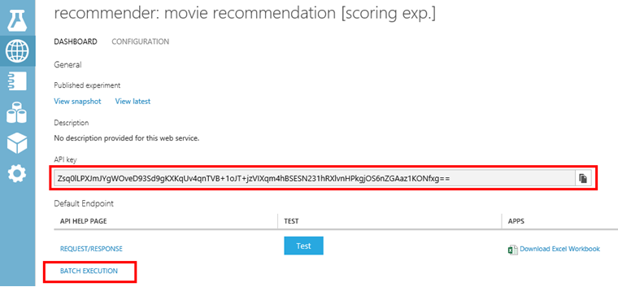
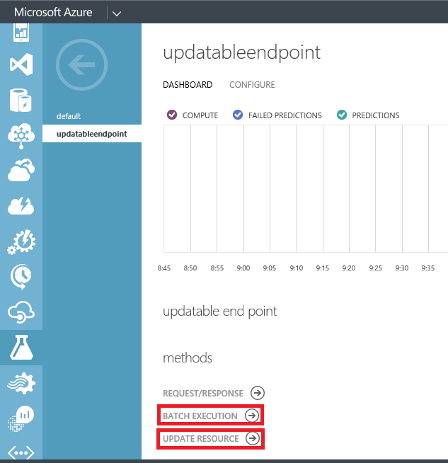

<properties 
    pageTitle="Utilizzo delle attività di apprendimento | Microsoft Azure" 
    description="Viene descritto come creare creare pipeline previsione utilizzando Azure Data Factory e apprendimento Azure" 
    services="data-factory" 
    documentationCenter="" 
    authors="sharonlo101" 
    manager="jhubbard" 
    editor="monicar"/>

<tags 
    ms.service="data-factory" 
    ms.workload="data-services" 
    ms.tgt_pltfrm="na" 
    ms.devlang="na" 
    ms.topic="article" 
    ms.date="09/06/2016" 
    ms.author="shlo"/>

# Creare pipeline stima mediante le attività di apprendimento Azure   
> [AZURE.SELECTOR]
[Hive](data-factory-hive-activity.md)  
[Maialino](data-factory-pig-activity.md)  
[MapReduce](data-factory-map-reduce.md)  
[Streaming Hadoop](data-factory-hadoop-streaming-activity.md)
[Apprendimento](data-factory-azure-ml-batch-execution-activity.md) 
[Stored Procedure](data-factory-stored-proc-activity.md)
[Dati Lake Analitica U-SQL](data-factory-usql-activity.md)
[.NET personalizzato](data-factory-use-custom-activities.md)

## Introduzione

[Apprendimento Azure](https://azure.microsoft.com/documentation/services/machine-learning/) consente di creare, testare e distribuire soluzioni analitica previsione. Dal punto di vista alto livello, essa viene eseguito in tre passaggi: 

1. **Creare una prova di formazione**. Eseguire questo passaggio con di Studio ML Azure. Studio ML è un ambiente di sviluppo visual collaborativo che consente di organizzare la formazione e testare un modello di previsione analitica utilizzando i dati di formazione.
2. **Convertirla in una prova di Office**. Una volta il modello con le competenze con i dati esistenti e si è pronti per usarlo per punteggio nuovi dati, si preparare e semplificazione la prova per il punteggio.
3. **Distribuirlo come un servizio web**. È possibile pubblicare il punteggio prova come un servizio web Azure. È possibile inviare dati a un modello tramite il punto di fine del servizio web e ricevere le stime di risultati per il modello.  

Azure Data Factory consente di creare facilmente pipeline che utilizzano un pubblicato [Apprendimento Azure] [ azure-machine-learning] servizio per previsione analitica web. Vedere gli articoli di [Introduzione a Azure Data Factory](data-factory-introduction.md) e [creare il prima pipeline](data-factory-build-your-first-pipeline.md) per iniziare rapidamente con il servizio di Azure Data Factory. 

Usa il **Batch di esecuzione attività** in una pipeline di Azure Data Factory, è possibile richiamare un servizio web Azure ML per rendere le stime sui dati in batch. Vedere la sezione [servizio utilizzando l'attività di esecuzione Batch richiamare un ML Azure web](#invoking-an-azure-ml-web-service-using-the-batch-execution-activity) per informazioni dettagliate.

Nel tempo, è necessario essere training nuovi set di dati di input utilizzando i modelli di previsione in ML Azure punteggio esperimenti. È possibile reimpostare un modello di Azure ML da una pipeline Factory dati eseguendo la procedura seguente: 

1. Pubblicare la prova di formazione (non stima prova) come un servizio web. Eseguire questo passaggio in Azure ML Studio utilizzata per esporre prova stima come un servizio web nello scenario precedente.
2. Utilizzare l'attività di esecuzione di Azure ML Batch per richiamare il servizio web per la prova la formazione. In pratica, è possibile utilizzare l'attività di esecuzione del Batch ML Azure per richiamare servizio web formazione e punteggio servizio web. 
  
Dopo aver con formazione, si desidera aggiornare il servizio web punteggio (stima prova esposto come un servizio web) con il modello appena esperto. Ecco i passaggi: 

1. Aggiungere un punto finale non predefinito per il servizio web punteggio. L'endpoint predefinito del servizio web non può essere aggiornato in modo che è necessario creare un endpoint non predefinito tramite il portale di Azure. Vedere l'articolo [Creare endpoint](../machine-learning/machine-learning-create-endpoint.md) per informazioni e una procedura.
2. Aggiornare servizi ML Azure collegati esistenti per il punteggio per usare l'endpoint non predefinito. Iniziare a usare il nuovo endpoint di utilizzare il servizio web che viene aggiornato.
3. Utilizzare l' **Attività di Azure ML aggiornamento delle risorse** per l'aggiornamento del servizio web con il modello appena esperto.  

Vedere la sezione [modelli di aggiornamento di Azure ML utilizzando l'attività delle risorse di aggiornamento](#updating-azure-ml-models-using-the-update-resource-activity) per informazioni dettagliate. 

## Richiamare un servizio web utilizza attività esecuzione Batch

Si consente di gestire lo spostamento dei dati e dell'elaborazione Azure Data Factory e quindi esegue esecuzione batch utilizzando apprendimento Azure. Ecco i passaggi principali:

1. Creare un servizio di apprendimento Azure collegato. È necessario quanto segue:
    1. **URI della richiesta** per l'esecuzione di Batch API. È possibile trovare URI richiedere facendo clic sul collegamento **Esecuzione BATCH** nella pagina servizi web.
    1. **Chiave dell'API** per il servizio web apprendimento Azure pubblicato. È possibile trovare la chiave dell'API facendo clic su servizio web a cui è stata pubblicata. 
 2. Utilizzare l'attività **AzureMLBatchExecution** .

    

    

### Scenario: Esperimenti con ingressi/uscite di servizio di Web che fanno riferimento ai dati in archiviazione Blob Azure
In questo scenario, il servizio Web di Microsoft Azure Machine Learning rende le stime utilizzando i dati da un file in un'archiviazione blob Azure e memorizza i risultati di previsione in archiviazione blob. JSON seguenti definisce una pipeline Factory dati a un'attività AzureMLBatchExecution. L'attività ha il set di dati **DecisionTreeInputBlob** come input e **DecisionTreeResultBlob** come output. **DecisionTreeInputBlob** viene passato come input al servizio web utilizzando la proprietà JSON **WebServiceInputActivity** . **DecisionTreeResultBlob** viene passato come un output al servizio Web utilizzando la proprietà JSON **webServiceOutputs** .  

> [AZURE.IMPORTANT] 
> Se il servizio web richiede più input, utilizzare la proprietà **webServiceInputs** invece di usare **WebServiceInputActivity**. Vedere la sezione [servizio Web richiede più input](#web-service-requires-multiple-inputs) per un esempio dell'utilizzo della proprietà webServiceInputs.
>  
> Set di dati che fanno riferimento **WebServiceInputActivity**/**webServiceInputs** e **webServiceOutputs** proprietà (in **typeProperties**) devono essere inclusi anche nell'attività **input** di **output**.
> 
> Nel test di Azure ML input servizio web e le porte di output e parametri globali hanno nomi predefiniti ("input1", "Ingresso2") che è possibile personalizzare. I nomi utilizzati per webServiceInputs, webServiceOutputs e impostazioni globalParameters devono corrispondere esattamente i nomi agli esperimenti. È possibile visualizzare il payload di richiesta di esempio nella pagina Guida esecuzione Batch per l'endpoint di Azure ML verificare il mapping previsto. 

    {
      "name": "PredictivePipeline",
      "properties": {
        "description": "use AzureML model",
        "activities": [
          {
            "name": "MLActivity",
            "type": "AzureMLBatchExecution",
            "description": "prediction analysis on batch input",
            "inputs": [
              {
                "name": "DecisionTreeInputBlob"
              }
            ],
            "outputs": [
              {
                "name": "DecisionTreeResultBlob"
              }
            ],
            "linkedServiceName": "MyAzureMLLinkedService",
            "typeProperties":
            {
                "webServiceInput": "DecisionTreeInputBlob",
                "webServiceOutputs": {
                    "output1": "DecisionTreeResultBlob"
                }                
            },
            "policy": {
              "concurrency": 3,
              "executionPriorityOrder": "NewestFirst",
              "retry": 1,
              "timeout": "02:00:00"
            }
          }
        ],
        "start": "2016-02-13T00:00:00Z",
        "end": "2016-02-14T00:00:00Z"
      }
    }

> [AZURE.NOTE] Solo input e output dell'attività AzureMLBatchExecution possono essere passati come parametri al servizio Web. Ad esempio frammento JSON sopra, DecisionTreeInputBlob è un input all'attività AzureMLBatchExecution, che vengono inviate come input al servizio Web tramite un parametro WebServiceInputActivity.   

### Esempio

In questo esempio viene utilizzata l'archiviazione di Azure per contenere i dati di input e di output. 

È consigliabile eseguire [creare il prima pipeline con Factory dati] [ adf-build-1st-pipeline] esercitazioni prima di procedere in questo esempio. Consente di creare elementi di dati Factory (servizi collegati, set di dati, pipeline) in questo esempio l'Editor di Factory dei dati.   
 

1. Creare un **servizio collegata** per lo **Spazio di archiviazione Azure**. Se i file di input e di output si trovano in account di archiviazione diverso, è necessario due servizi collegati. Ecco un esempio JSON:

        {
          "name": "StorageLinkedService",
          "properties": {
            "type": "AzureStorage",
            "typeProperties": {
              "connectionString": "DefaultEndpointsProtocol=https;AccountName=[acctName];AccountKey=[acctKey]"
            }
          }
        }

2. Creare l' **input** di Azure Data Factory **set di dati**. A differenza di alcuni altri dati Factory set di dati, questi set di dati deve contenere valori **folderPath** e **il nome file** . È possibile utilizzare una partizione a ogni esecuzione batch (ogni sezione di dati) elaborare o produrre input univoci e i file di output. Potrebbe essere necessario includere alcune attività padre per trasformare l'input in formato CSV e inserirlo nell'account di archiviazione per ogni sezione. In questo caso, non si vuole includere le impostazioni di **esterni** ed **externalData** illustrate nell'esempio seguente e il DecisionTreeInputBlob sarebbe il set di dati di output di un'altra attività.

        {
          "name": "DecisionTreeInputBlob",
          "properties": {
            "type": "AzureBlob",
            "linkedServiceName": "StorageLinkedService",
            "typeProperties": {
              "folderPath": "azuremltesting/input",
              "fileName": "in.csv",
              "format": {
                "type": "TextFormat",
                "columnDelimiter": ","
              }
            },
            "external": true,
            "availability": {
              "frequency": "Day",
              "interval": 1
            },
            "policy": {
              "externalData": {
                "retryInterval": "00:01:00",
                "retryTimeout": "00:10:00",
                "maximumRetry": 3
              }
            }
          }
        }
    
    Il file csv input deve includere la riga di intestazione di colonna. Se si utilizza l' **Attività Copia** per creare/sposta il file csv in archiviazione blob, è necessario impostare la proprietà sink **blobWriterAddHeader** su **true**. Per esempio:
    
         sink: 
         {
             "type": "BlobSink",     
             "blobWriterAddHeader": true 
         }
     
    Se il file csv non dispone della riga di intestazione, viene visualizzato l'errore seguente: **errore nell'attività: errore durante la lettura di stringa. Token imprevisto: StartObject. Percorso ', riga 1, posizione 1**.
3. Creare l' **output** di Azure Data Factory **set di dati**. Questo esempio viene usata partizione per creare un percorso di output univoco per ogni sezione di esecuzione. Senza le partizioni, l'attività da sovrascrivere il file.

        {
          "name": "DecisionTreeResultBlob",
          "properties": {
            "type": "AzureBlob",
            "linkedServiceName": "StorageLinkedService",
            "typeProperties": {
              "folderPath": "azuremltesting/scored/{folderpart}/",
              "fileName": "{filepart}result.csv",
              "partitionedBy": [
                {
                  "name": "folderpart",
                  "value": {
                    "type": "DateTime",
                    "date": "SliceStart",
                    "format": "yyyyMMdd"
                  }
                },
                {
                  "name": "filepart",
                  "value": {
                    "type": "DateTime",
                    "date": "SliceStart",
                    "format": "HHmmss"
                  }
                }
              ],
              "format": {
                "type": "TextFormat",
                "columnDelimiter": ","
              }
            },
            "availability": {
              "frequency": "Day",
              "interval": 15
            }
          }
        }

4. Creare un **servizio collegata** del tipo: **AzureMLLinkedService**, fornire l'API principali e batch esecuzione URL del modello.
        
        {
          "name": "MyAzureMLLinkedService",
          "properties": {
            "type": "AzureML",
            "typeProperties": {
              "mlEndpoint": "https://[batch execution endpoint]/jobs",
              "apiKey": "[apikey]"
            }
          }
        }
5. Infine, creare una pipeline contenente un'attività **AzureMLBatchExecution** . In fase di esecuzione pipeline esegue le operazioni seguenti:
    1. Ottiene il percorso del file di input dal set di dati di input.
    2. Richiama l'esecuzione di batch API di apprendimento Azure
    3. Consente di copiare l'output di esecuzione batch blob indicate nel set di dati di output. 

    > [AZURE.NOTE] Attività AzureMLBatchExecution può avere zero o più input e uno o più output.

        {
          "name": "PredictivePipeline",
          "properties": {
            "description": "use AzureML model",
            "activities": [
              {
                "name": "MLActivity",
                "type": "AzureMLBatchExecution",
                "description": "prediction analysis on batch input",
                "inputs": [
                  {
                    "name": "DecisionTreeInputBlob"
                  }
                ],
                "outputs": [
                  {
                    "name": "DecisionTreeResultBlob"
                  }
                ],
                "linkedServiceName": "MyAzureMLLinkedService",
                "typeProperties":
                {
                    "webServiceInput": "DecisionTreeInputBlob",
                    "webServiceOutputs": {
                        "output1": "DecisionTreeResultBlob"
                    }                
                },
                "policy": {
                  "concurrency": 3,
                  "executionPriorityOrder": "NewestFirst",
                  "retry": 1,
                  "timeout": "02:00:00"
                }
              }
            ],
            "start": "2016-02-13T00:00:00Z",
            "end": "2016-02-14T00:00:00Z"
          }
        }

    Date e ore di **inizio** e **Fine** deve essere in [formato ISO](http://en.wikipedia.org/wiki/ISO_8601). Ad esempio: 2014-10-14T16:32:41Z. L'ora di **Fine** è facoltativo. Se non si specifica valore per la proprietà di **Fine** , viene calcolato come "**inizio + 48 ore.**" Per eseguire la pipeline di tempo indefinito, specificare **9999-09-09** come valore per la proprietà di **Fine** . Per ulteriori informazioni sulle proprietà JSON, vedere [JSON Scripting Reference](https://msdn.microsoft.com/library/dn835050.aspx) .

    > [AZURE.NOTE] Input per la AzureMLBatchExecution attività è facoltativo. 

### Scenario: Esperimenti con moduli di lettura/scrittura per fare riferimento ai dati in diversi archivi

Un altro scenario comune durante la creazione di Azure ML esperimenti consiste nell'usare moduli utilità per la lettura e scrittura. Il modulo lettore viene utilizzato per caricare i dati in una prova e il modulo writer consiste nel salvare i dati degli esperimenti. Per ulteriori informazioni sui moduli utilità per la lettura e scrittura, vedere argomenti [utilità per la lettura](https://msdn.microsoft.com/library/azure/dn905997.aspx) e [scrittura](https://msdn.microsoft.com/library/azure/dn905984.aspx) in una raccolta di MSDN.     

Quando si usano i moduli di utilità per la lettura e scrittura, è consigliabile utilizzare un parametro di servizio Web per ogni proprietà di questi moduli di lettura/scrittura. Questi parametri web consentono di configurare i valori in fase di esecuzione. Ad esempio, è possibile creare una prova con un modulo di lettore che utilizza un Database di SQL Azure: XXX.database.windows.net. Dopo il servizio web è stato distribuito, si vuole consentire agli utenti del servizio web specificare un altro Server di SQL Azure chiamato YYY.database.windows.net. È possibile utilizzare un parametro di servizio Web per consentire a questo valore da configurare.

> [AZURE.NOTE] Input di servizio Web e di output sono diversi dai parametri di servizio Web. Nel primo scenario è stato illustrato come è possibile specificare un input e output per un servizio Web ML Azure. In questo scenario, passare parametri per un servizio Web che corrispondono alle proprietà dei moduli di lettura/scrittura. 

Diamo un'occhiata uno scenario per l'utilizzo di parametri di servizio Web. Si dispone di un servizio web apprendimento Azure distribuito che utilizza un modulo di lettura per leggere i dati da una delle origini dati supportate per l'apprendimento Azure (ad esempio: Database di SQL Azure). Dopo l'esecuzione di batch viene eseguita, i risultati vengono scritte utilizzando un modulo di Writer (Database di SQL Azure).  Nessun input servizio web e output sono definiti agli esperimenti. In questo caso, è consigliabile configurare parametri di servizio web pertinenti per i moduli di utilità per la lettura e scrittura. Questa configurazione consente ai moduli da configurare quando si usa l'attività AzureMLBatchExecution lettura/scrittura. Specificare i parametri di servizio Web nella sezione **globalParameters** nell'attività di JSON come indicato di seguito. 

    "typeProperties": {
        "globalParameters": {
            "Param 1": "Value 1",
            "Param 2": "Value 2"
        }
    }

È inoltre possibile utilizzare [Dati Factory funzioni](https://msdn.microsoft.com/library/dn835056.aspx) per passare valori per i parametri del servizio Web come illustrato nell'esempio seguente:

    "typeProperties": {
        "globalParameters": {
           "Database query": "$$Text.Format('SELECT * FROM myTable WHERE timeColumn = \\'{0:yyyy-MM-dd HH:mm:ss}\\'', Time.AddHours(WindowStart, 0))"
        }
    }
 
> [AZURE.NOTE] I parametri del servizio Web sono maiuscole e minuscole, verificare che i nomi specificati nell'attività JSON corrispondano a quelli esposti dal servizio Web. 

### Tramite un modulo di lettura per leggere i dati da più file di archivio Blob Azure
Pipeline di dati con le attività, ad esempio maialino e Hive può produrre uno o più file di output senza estensioni. Ad esempio, quando si specifica una tabella Hive esterna, i dati per la tabella Hive esterno possono essere memorizzati in archiviazione blob Azure con il seguente 000000_0 nome. È possibile utilizzare il modulo di utilità per la lettura di una prova per saperne di più file e utilizzarli per le stime. 

Quando si utilizza il modulo di utilità per la lettura di una prova di apprendimento Azure, è possibile specificare Blob Azure come input. I file in archiviazione blob Azure possono essere i file di output (esempio: 000000_0) che vengono prodotti da uno script maialino e Hive in esecuzione su HDInsight. Il modulo di utilità per la lettura consente di leggere file (con nessuna estensione) configurando le **percorso al contenitore, directory/blob**. Il **percorso al contenitore** indica il contenitore e **directory/blob** punto alla cartella contenente i file, come illustrato nell'immagine seguente. L'asterisco, ovvero \*) **Specifica che tutti i file/cartella del contenitore (vale a dire dati/aggregateddata/anno = mese/2014-6 /\*)** vengono letti durante la prova.

### Esempio 
#### Pipeline con AzureMLBatchExecution attività con i parametri di servizio Web

    {
      "name": "MLWithSqlReaderSqlWriter",
      "properties": {
        "description": "Azure ML model with sql azure reader/writer",
        "activities": [
          {
            "name": "MLSqlReaderSqlWriterActivity",
            "type": "AzureMLBatchExecution",
            "description": "test",
            "inputs": [
              {
                "name": "MLSqlInput"
              }
            ],
            "outputs": [
              {
                "name": "MLSqlOutput"
              }
            ],
            "linkedServiceName": "MLSqlReaderSqlWriterDecisionTreeModel",
            "typeProperties":
            {
                "webServiceInput": "MLSqlInput",
                "webServiceOutputs": {
                    "output1": "MLSqlOutput"
                }
                "globalParameters": {
                    "Database server name": "<myserver>.database.windows.net",
                    "Database name": "<database>",
                    "Server user account name": "<user name>",
                    "Server user account password": "<password>"
                }              
            },
            "policy": {
              "concurrency": 1,
              "executionPriorityOrder": "NewestFirst",
              "retry": 1,
              "timeout": "02:00:00"
            },
          }
        ],
        "start": "2016-02-13T00:00:00Z",
        "end": "2016-02-14T00:00:00Z"
      }
    }
 
Nell'esempio JSON precedente:

- Il servizio Web di Microsoft Azure Machine Learning distribuito utilizza un lettore e un modulo writer per leggere e scrivere dati da/verso un Database di SQL Azure. Questo servizio Web presenta quattro parametri seguenti: nome del server, nome del Database, nome account utente e password dell'account utente Server di Database.  
- Date e ore di **inizio** e **Fine** deve essere in [formato ISO](http://en.wikipedia.org/wiki/ISO_8601). Ad esempio: 2014-10-14T16:32:41Z. L'ora di **Fine** è facoltativo. Se non si specifica valore per la proprietà di **Fine** , viene calcolato come "**inizio + 48 ore.**" Per eseguire la pipeline di tempo indefinito, specificare **9999-09-09** come valore per la proprietà di **Fine** . Per ulteriori informazioni sulle proprietà JSON, vedere [JSON Scripting Reference](https://msdn.microsoft.com/library/dn835050.aspx) .

### Altri scenari

#### Servizio Web richiede più input
Se il servizio web richiede più input, utilizzare la proprietà **webServiceInputs** invece di usare **WebServiceInputActivity**. Set di dati che fanno riferimento **webServiceInputs** devono essere inclusi anche le attività **input**.
 
Nel test di Azure ML input servizio web e le porte di output e parametri globali hanno nomi predefiniti ("input1", "Ingresso2") che è possibile personalizzare. I nomi utilizzati per webServiceInputs, webServiceOutputs e impostazioni globalParameters devono corrispondere esattamente i nomi agli esperimenti. È possibile visualizzare il payload di richiesta di esempio nella pagina Guida esecuzione Batch per l'endpoint di Azure ML verificare il mapping previsto.

    {
        "name": "PredictivePipeline",
        "properties": {
            "description": "use AzureML model",
            "activities": [{
                "name": "MLActivity",
                "type": "AzureMLBatchExecution",
                "description": "prediction analysis on batch input",
                "inputs": [{
                    "name": "inputDataset1"
                }, {
                    "name": "inputDataset2"
                }],
                "outputs": [{
                    "name": "outputDataset"
                }],
                "linkedServiceName": "MyAzureMLLinkedService",
                "typeProperties": {
                    "webServiceInputs": {
                        "input1": "inputDataset1",
                        "input2": "inputDataset2"
                    },
                    "webServiceOutputs": {
                        "output1": "outputDataset"
                    }
                },
                "policy": {
                    "concurrency": 3,
                    "executionPriorityOrder": "NewestFirst",
                    "retry": 1,
                    "timeout": "02:00:00"
                }
            }],
            "start": "2016-02-13T00:00:00Z",
            "end": "2016-02-14T00:00:00Z"
        }
    }

#### Servizio Web non richiede un input

Azure ML batch esecuzione i servizi web possono essere utilizzati per eseguire qualsiasi flusso di lavoro, per R o Python script di esempio, che non richiedono qualsiasi input. In alternativa, la prova può essere configurato con un modulo di lettore che non viene esposto qualsiasi GlobalParameters. In questo caso, l'attività di AzureMLBatchExecution da configurata come indicato di seguito:

    {
        "name": "scoring service",
        "type": "AzureMLBatchExecution",
        "outputs": [
            {
                "name": "myBlob"
            }
        ],
        "typeProperties": {
            "webServiceOutputs": {
                "output1": "myBlob"
            }              
         },
        "linkedServiceName": "mlEndpoint",
        "policy": {
            "concurrency": 1,
            "executionPriorityOrder": "NewestFirst",
            "retry": 1,
            "timeout": "02:00:00"
        }
    },
   

#### Servizio Web non richiede un interdipendenze
Il servizio web di Azure ML batch esecuzione non dispone di alcun output di servizio Web configurato. In questo esempio, Nessun servizio Web input o output, né sono configurate in qualsiasi GlobalParameters. È ancora presente un output configurato per l'attività stessa, ma non è specificato come un webServiceOutput.

    {
        "name": "retraining",
        "type": "AzureMLBatchExecution",
        "outputs": [
            {
                "name": "placeholderOutputDataset"
            }
        ],
        "typeProperties": {
         },
        "linkedServiceName": "mlEndpoint",
        "policy": {
            "concurrency": 1,
            "executionPriorityOrder": "NewestFirst",
            "retry": 1,
            "timeout": "02:00:00"
        }
    },

#### Lettori ottimali servizio Web e gli autori e dell'esecuzione di attività solo quando altre attività hanno avuto esito positivo

Azure ML web servizio Utilità per la lettura e scrittura moduli potrebbero essere configurati per eseguire con o senza qualsiasi GlobalParameters. Tuttavia, si desidera incorporare interventi di assistenza in una pipeline che utilizza le dipendenze di set di dati per richiamare il servizio solo quando alcuni elaborazione padre è completata. Al termine dell'esecuzione batch questo approccio, è anche possibile attivare altre azioni. In questo caso, è possibile esprimere le dipendenze utilizzando l'attività ingressi e uscite, senza il nome di uno di questi come input di servizio Web o output.

    {
        "name": "retraining",
        "type": "AzureMLBatchExecution",
        "inputs": [
            {
                "name": "upstreamData1"
            },
            {
                "name": "upstreamData2"
            }
        ],
        "outputs": [
            {
                "name": "downstreamData"
            }
        ],
        "typeProperties": {
         },
        "linkedServiceName": "mlEndpoint",
        "policy": {
            "concurrency": 1,
            "executionPriorityOrder": "NewestFirst",
            "retry": 1,
            "timeout": "02:00:00"
        }
    },

**Materiale** sono:

-   Se l'endpoint di prova utilizza un WebServiceInputActivity: viene rappresentato da un set di dati blob e incluse in input attività e la proprietà WebServiceInputActivity. In caso contrario, la proprietà WebServiceInputActivity viene omesso. 
-   Se l'endpoint di prova utilizza webServiceOutput(s): sono rappresentati da set di dati blob e sono inclusi in output di attività e nella proprietà webServiceOutputs. Restituisce l'attività e webServiceOutputs sono mappati in base al nome di ogni output di prova. In caso contrario, la proprietà webServiceOutputs viene omesso.
-   Se l'endpoint di prova esposta globalParameter(s), viene assegnato nella proprietà globalParameters attività come coppie di parole chiave, valore. In caso contrario, la proprietà globalParameters viene omesso. Le chiavi sono maiuscole e minuscole. [Funzioni di Azure Data Factory](data-factory-scheduling-and-execution.md#data-factory-functions-reference) può essere usata nella casella valori. 
- Set di dati aggiuntivi possono essere inclusi nelle proprietà di input e output attività, senza farvi riferimento nel typeProperties attività. Questi set di dati regolano l'esecuzione di relazioni tra le sezioni, ma vengono ignorati in caso contrario dall'attività AzureMLBatchExecution. 

## Aggiornamento di modelli con attività di aggiornamento delle risorse
Nel tempo, è necessario essere training nuovi set di dati di input utilizzando i modelli di previsione in ML Azure punteggio esperimenti. Dopo aver con formazione, si desidera aggiornare il punteggio servizio web con il modello ML retrained. La procedura tipica per abilitare l'aggiornamento e i modelli di Azure ML tramite i servizi web è: 

1. Creare una prova in [Azure ML Studio](https://studio.azureml.net). 
2. Quando si è soddisfatti del modello, utilizzare Azure ML Studio per la pubblicazione dei servizi web per entrambe le **provare formazione** e il punteggio /**prova previsione**.

Nella tabella seguente descrive i servizi web utilizzati in questo esempio.  Per informazioni dettagliate, vedere [reimpostare l'apprendimento modelli a livello di programmazione](../machine-learning/machine-learning-retrain-models-programmatically.md) .

| Tipo di servizio web | Descrizione 
| :------------------ | :---------- 
| **Servizio web di formazione** | Riceve i dati di formazione e genera dei modelli di esperti. L'output della formazione è un file .ilearner in un'archiviazione Blob Azure.  L' **endpoint predefinito** venga creato automaticamente quando si pubblica prova formazione come servizio web. È possibile creare più endpoint ma nell'esempio vengono utilizzate solo l'endpoint predefinito |
| **Punteggio servizio web** | Riceve esempi senza etichetta dati e apporta le stime. L'output di previsione potrebbe avere diverse forme, ad esempio un file CSV o le righe in un database di SQL Azure, a seconda della configurazione di prova. L'endpoint predefinito venga creato automaticamente quando si pubblica prova stima come un servizio web. Creare il secondo **endpoint non predefinito e aggiornabili** tramite il [portale di Azure](https://manage.windowsazure.com). È possibile creare ulteriori endpoint ma questo esempio viene usata solo un endpoint aggiornabile non predefinito. Vedere l'articolo [Creare endpoint](../machine-learning/machine-learning-create-endpoint.md) per la procedura.       
 
L'immagine seguente illustra la relazione tra formazione e il punteggio endpoint in Azure ML. 

È possibile richiamare il **servizio web formazione** tramite l' **Attività di esecuzione di Azure ML Batch**. Richiamare un servizio web formazione è come richiamare un servizio web Azure ML (punteggio servizio web) per dati punteggio. Nelle sezioni precedenti coprono come richiamare un servizio web Azure ML da una pipeline di Azure Data Factory in modo dettagliato. 
  
È possibile richiamare **il punteggio servizio web** tramite l' **Attività di Azure ML aggiornamento delle risorse** per l'aggiornamento del servizio web con il modello appena esperto. Come descritto nella tabella precedente, è necessario creare e utilizzare l'endpoint aggiornabile non predefinito. Inoltre, aggiornare uno o più servizi collegati esistente nel factory di dati da utilizzare l'endpoint non predefinite in modo che usino sempre il modello retrained più recenti. 

Lo scenario seguente vengono fornite informazioni dettagliate. Ha un esempio per la formazione e aggiornamento di modelli di Azure ML da una pipeline di Azure Data Factory. 
 
### Scenario: formazione e aggiornamento di un modello di Azure ML
In questa sezione fornisce una pipeline di esempio che utilizza l' **esecuzione di Azure ML Batch attività** per reimpostare un modello. La pipeline Usa anche l' **attività di Azure ML aggiornare risorsa** per aggiornare il modello nel servizio web punteggio. La sezione vengono forniti anche frammenti JSON servizi collegati, set di dati e pipeline di esempio. 

Ecco la visualizzazione Diagramma della pipeline di esempio. Come si può notare, l'attività di esecuzione di Azure ML Batch accetta l'input di formazione e genera un output di formazione (iLearner file). Attività delle risorse di Azure ML aggiornamento accetta l'output di formazione e aggiorna il modello nell'endpoint del servizio web punteggio. Attività delle risorse di aggiornamento non produce alcun output. Il placeholderBlob è solo un set di dati del fittizio output necessari per il servizio di Azure Data Factory per eseguire la pipeline. 

#### Servizio di archiviazione collegata Blob Azure:
Lo spazio di archiviazione Azure conserva i dati seguenti:

- dati di formazione. Dati di input per il servizio web di formazione ML Azure.  
- file iLearner. L'output dal servizio web formazione ML Azure. Il file è anche l'input per l'attività delle risorse di aggiornamento.  
   
Ecco la definizione della servizi collegati JSON di esempio: 

    {
        "name": "StorageLinkedService",
        "properties": {
            "type": "AzureStorage",
            "typeProperties": {
                "connectionString": "DefaultEndpointsProtocol=https;AccountName=name;AccountKey=key"
            }
        }
    }

#### Formazione su set di dati input:
Il set di dati seguente rappresenta i dati di input di formazione per il servizio web di formazione ML Azure. Attività di esecuzione del Batch ML Azure ha questo set di dati come input. 

    {
        "name": "trainingData",
        "properties": {
            "type": "AzureBlob",
            "linkedServiceName": "StorageLinkedService",
            "typeProperties": {
                "folderPath": "labeledexamples",
                "fileName": "labeledexamples.arff",
                "format": {
                    "type": "TextFormat"
                }
            },
            "availability": {
                "frequency": "Week",
                "interval": 1
            },
            "policy": {          
                "externalData": {
                    "retryInterval": "00:01:00",
                    "retryTimeout": "00:10:00",
                    "maximumRetry": 3
                }
            }
        }
    }

#### Set di dati di training output:
Il set di dati seguente rappresenta il file di output iLearner dal servizio web formazione ML Azure. L'attività di esecuzione Batch ML Azure restituisce il set di dati. Questo set di dati è anche l'input all'attività di Azure ML aggiornamento risorsa.

    {
        "name": "trainedModelBlob",
        "properties": {
            "type": "AzureBlob",
            "linkedServiceName": "StorageLinkedService",
            "typeProperties": {
                "folderPath": "trainingoutput",
                "fileName": "model.ilearner",
                "format": {
                    "type": "TextFormat"
                }
            },
            "availability": {
                "frequency": "Week",
                "interval": 1
            }
        }
    }

#### Servizi collegati per l'endpoint di formazione ML Azure 
Frammento JSON riportato di seguito definisce un servizio di apprendimento Azure collegato che punta all'endpoint predefinito del servizio web di formazione. 

    {   
        "name": "trainingEndpoint",
        "properties": {
            "type": "AzureML",
            "typeProperties": {
                "mlEndpoint": "https://ussouthcentral.services.azureml.net/workspaces/xxx/services/--training experiment--/jobs",
                "apiKey": "myKey"
            }
        }
    }

In **Azure ML Studio**, eseguire le operazioni seguenti per ottenere i valori per **mlEndpoint** e **apiKey**:

1. Fare clic su **Servizi WEB** nel menu a sinistra.
2. Fare clic su **servizio web formazione** nell'elenco dei servizi web. 
3. Fare clic su Copia accanto a casella di testo **chiave dell'API** . Incollare la chiave negli Appunti nell'editor di dati Factory JSON.
4. In **Azure ML studio**, fare clic sul collegamento **Esecuzione BATCH** .
5. Copiare **Richiesta URI** dalla sezione **richiedere** e incollarla nell'editor dati Factory JSON.   

#### Servizi collegati per l'endpoint punteggio aggiornabile Azure ML:
Frammento JSON riportato di seguito definisce un servizio di apprendimento Azure collegato che punta all'endpoint aggiornabile non predefinito del servizio web punteggio.  

    {
        "name": "updatableScoringEndpoint2",
        "properties": {
            "type": "AzureML",
            "typeProperties": {
                "mlEndpoint": "https://ussouthcentral.services.azureml.net/workspaces/xxx/services/--scoring experiment--/jobs",
                "apiKey": "endpoint2Key",
                "updateResourceEndpoint": "https://management.azureml.net/workspaces/xxx/webservices/--scoring experiment--/endpoints/endpoint2"
            }
        }
    }

Prima di creare e distribuire un ML Azure collegato servizio, seguire la procedura descritta in [Creare endpoint](../machine-learning/machine-learning-create-endpoint.md) articolo per creare un secondo endpoint (non predefinito e aggiornabile) per il servizio web punteggio.

Dopo aver creato l'endpoint aggiornabile non predefinito, procedere come segue:

- Fare clic su **Esecuzione BATCH** per ottenere il valore URI per la proprietà JSON **mlEndpoint** .
- Fare clic su collegamento **Alle risorse di aggiornamento** per ottenere il valore URI per la proprietà JSON **updateResourceEndpoint** . La chiave dell'API contiene la pagina endpoint (nell'angolo inferiore destro). 

 
#### Segnaposto del set di dati di output:
L'attività delle risorse di aggiornamento di Azure ML non genera l'output. Tuttavia, Azure Data Factory richiede un set di dati di output per la pianificazione di una pipeline di unità. Di conseguenza, serve un set di dati fittizio/segnaposto in questo esempio.  

    {
        "name": "placeholderBlob",
        "properties": {
            "availability": {
                "frequency": "Week",
                "interval": 1
            },
            "type": "AzureBlob",
            "linkedServiceName": "StorageLinkedService",
            "typeProperties": {
                "folderPath": "any",
                "format": {
                    "type": "TextFormat"
                }
            }
        }
    }

#### Pipeline
La pipeline dispone di due attività: **AzureMLBatchExecution** e **AzureMLUpdateResource**. L'attività di esecuzione del Batch ML Azure accetta i dati di formazione come input e genera un file iLearner come un output. L'attività richiama il servizio web di formazione (prova formazione esposto come un servizio web) con i dati di input formazione e riceve il file ilearner dal servizio Web. Il placeholderBlob è solo un set di dati del fittizio output necessari per il servizio di Azure Data Factory per eseguire la pipeline. 

    {
        "name": "pipeline",
        "properties": {
            "activities": [
                {
                    "name": "retraining",
                    "type": "AzureMLBatchExecution",
                    "inputs": [
                        {
                            "name": "trainingData"
                        }
                    ],
                    "outputs": [
                        {
                            "name": "trainedModelBlob"
                        }
                    ],
                    "typeProperties": {
                        "webServiceInput": "trainingData",
                        "webServiceOutputs": {
                            "output1": "trainedModelBlob"
                        }              
                     },
                    "linkedServiceName": "trainingEndpoint",
                    "policy": {
                        "concurrency": 1,
                        "executionPriorityOrder": "NewestFirst",
                        "retry": 1,
                        "timeout": "02:00:00"
                    }
                },
                {
                    "type": "AzureMLUpdateResource",
                    "typeProperties": {
                        "trainedModelName": "Training Exp for ADF ML [trained model]",
                        "trainedModelDatasetName" :  "trainedModelBlob"
                    },
                    "inputs": [
                        {
                            "name": "trainedModelBlob"
                        }
                    ],
                    "outputs": [
                        {
                            "name": "placeholderBlob"
                        }
                    ],
                    "policy": {
                        "timeout": "01:00:00",
                        "concurrency": 1,
                        "retry": 3
                    },
                    "name": "AzureML Update Resource",
                    "linkedServiceName": "updatableScoringEndpoint2"
                }
            ],
            "start": "2016-02-13T00:00:00Z",
            "end": "2016-02-14T00:00:00Z"
        }
    }

### Utilità per la lettura e scrittura moduli

Uno scenario comune per l'utilizzo di parametri di servizio Web consiste nell'utilizzo di lettori di SQL Azure e writer. Il modulo lettore viene utilizzato per caricare i dati in una prova di servizi di gestione dati all'esterno di Azure Machine Learning Studio. Il modulo writer consiste nel salvare i dati degli esperimenti in servizi di gestione dati all'esterno di Azure Machine Learning Studio.  

Per informazioni dettagliate su SQL Azure/Blob Azure lettura/scrittura, vedere argomenti [utilità per la lettura](https://msdn.microsoft.com/library/azure/dn905997.aspx) e [scrittura](https://msdn.microsoft.com/library/azure/dn905984.aspx) in una raccolta di MSDN. L'utilità per la lettura Blob Azure e writer Blob Azure utilizzato l'esempio nella sezione precedente. In questa sezione viene illustrato l'utilizzo di SQL Azure lettore e writer SQL Azure.

## Domande frequenti

**Q:** Si dispone di più file generati dalla pipeline di dati di grandi dimensioni. È possibile usare l'attività AzureMLBatchExecution allo svolgimento di tutti i file?

**A:** Sì. Vedere la sezione **mediante un modulo di lettura per leggere i dati da più file di archivio Blob Azure** per informazioni dettagliate. 

## Attività di punteggio Azure ML Batch
Se si utilizza l'attività **AzureMLBatchScoring** per l'integrazione con apprendimento Azure, è consigliabile usare l'attività **AzureMLBatchExecution** più recente. 

Attività AzureMLBatchExecution è stato introdotto nella versione 2015 agosto di Azure SDK e Azure PowerShell.

Se si desidera continuare a usare l'attività AzureMLBatchScoring, continuare a leggere questa sezione.  

### Azure attività ML Batch punteggio utilizzando lo spazio di archiviazione di Azure per l'input/output 

    {
      "name": "PredictivePipeline",
      "properties": {
        "description": "use AzureML model",
        "activities": [
          {
            "name": "MLActivity",
            "type": "AzureMLBatchScoring",
            "description": "prediction analysis on batch input",
            "inputs": [
              {
                "name": "ScoringInputBlob"
              }
            ],
            "outputs": [
              {
                "name": "ScoringResultBlob"
              }
            ],
            "linkedServiceName": "MyAzureMLLinkedService",
            "policy": {
              "concurrency": 3,
              "executionPriorityOrder": "NewestFirst",
              "retry": 1,
              "timeout": "02:00:00"
            }
          }
        ],
        "start": "2016-02-13T00:00:00Z",
        "end": "2016-02-14T00:00:00Z"
      }
    }

### Parametri di servizio Web
Per specificare i valori per i parametri del servizio Web, aggiungere una sezione **typeProperties** nella sezione **AzureMLBatchScoringActivty** nella pipeline di JSON come illustrato nell'esempio seguente: 

    "typeProperties": {
        "webServiceParameters": {
            "Param 1": "Value 1",
            "Param 2": "Value 2"
        }
    }

È inoltre possibile utilizzare [Dati Factory funzioni](https://msdn.microsoft.com/library/dn835056.aspx) per passare valori per i parametri del servizio Web come illustrato nell'esempio seguente:

    "typeProperties": {
        "webServiceParameters": {
           "Database query": "$$Text.Format('SELECT * FROM myTable WHERE timeColumn = \\'{0:yyyy-MM-dd HH:mm:ss}\\'', Time.AddHours(WindowStart, 0))"
        }
    }
 
> [AZURE.NOTE] I parametri del servizio Web sono maiuscole e minuscole, verificare che i nomi specificati nell'attività JSON corrispondano a quelli esposti dal servizio Web. 

## Vedere anche

- [Post di blog Azure: Guida introduttiva di Azure Data Factory e apprendimento Azure](https://azure.microsoft.com/blog/getting-started-with-azure-data-factory-and-azure-machine-learning-4/)

[adf-build-1st-pipeline]: data-factory-build-your-first-pipeline.md

[azure-machine-learning]: http://azure.microsoft.com/services/machine-learning/

 
