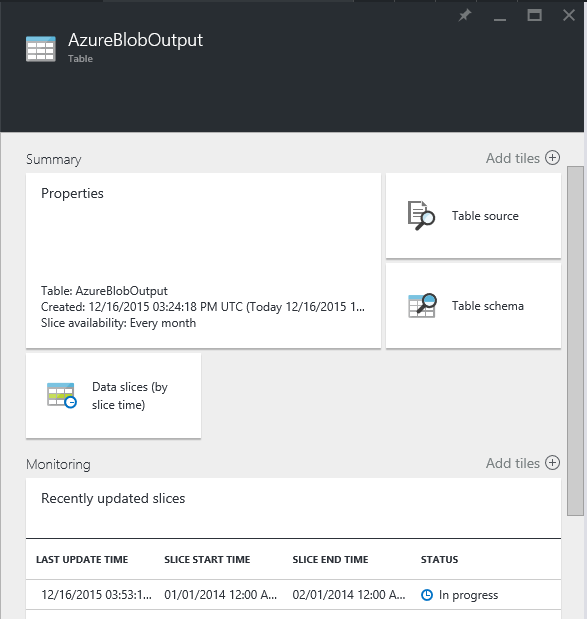

<properties
    pageTitle="Creare la prima factory di dati (modello Manager delle risorse) | Microsoft Azure"
    description="In questa esercitazione, verrà creata una pipeline di Azure Data Factory esempio utilizzando un modello di gestione risorse di Azure."
    services="data-factory"
    documentationCenter=""
    authors="spelluru"
    manager="jhubbard"
    editor="monicar"/>

<tags
    ms.service="data-factory"
    ms.workload="data-services"
    ms.tgt_pltfrm="na"
    ms.devlang="na"
    ms.topic="hero-article"
    ms.date="10/12/2016"
    ms.author="spelluru"/>

# Esercitazione: Compilare il prima factory Azure dati utilizzando il modello di gestione risorse di Azure
> [AZURE.SELECTOR]
- [Panoramica e i prerequisiti](data-factory-build-your-first-pipeline.md)
- [Portale di Azure](data-factory-build-your-first-pipeline-using-editor.md)
- [Visual Studio](data-factory-build-your-first-pipeline-using-vs.md)
- [PowerShell](data-factory-build-your-first-pipeline-using-powershell.md)
- [Modello di Manager delle risorse](data-factory-build-your-first-pipeline-using-arm.md)
- [API REST](data-factory-build-your-first-pipeline-using-rest-api.md)

In questo articolo si utilizza un modello di gestione di risorse Azure per creare il prima factory dati Azure.

## Prerequisiti
- Leggere l'articolo [Esercitazione Panoramica](data-factory-build-your-first-pipeline.md) e completare i passaggi **prerequisito** .
- Seguire istruzioni nell'articolo [come installare e configurare Azure PowerShell](../powershell-install-configure.md) per installare la versione più recente di Azure PowerShell nel computer in uso.
- Vedere [Creazione di modelli di Azure Manager delle risorse](../resource-group-authoring-templates.md) per informazioni sui modelli di gestione di risorse Azure. 

## In questa esercitazione
Entità | Descrizione  
------ | ----------- 
Servizio di archiviazione collegato di Azure | I collegamenti all'account di archiviazione Azure su factory dati. L'account di archiviazione Azure contiene i dati di input e di output per la pipeline in questo esempio. 
HDInsight un servizio su richiesta collegato| Collegamenti un HDInsight su richiesta cluster su factory dati. Il cluster venga creato automaticamente per elaborare i dati e viene eliminato al termine dell'elaborazione.
Set di dati input Blob Azure | Fa riferimento al servizio di archiviazione di Azure collegato. Servizio collegato si riferisce a un account di archiviazione Azure e il set di dati Blob Azure specifica il contenitore, cartella e il nome dell'archivio che contiene i dati di input. 
Set di dati di output Blob Azure | Fa riferimento al servizio di archiviazione di Azure collegato. Servizio collegato si riferisce a un account di archiviazione Azure e il set di dati Blob Azure specifica il contenitore, cartella e il nome dell'archivio che contiene i dati di output. 
Pipeline di dati | La pipeline dispone di una attività di tipo HDInsightHive utilizza il set di dati di input e restituisce il set di dati di output.   

Una factory dati può avere una o più tubazioni. Una pipeline può contenere uno o più attività. Esistono due tipi di attività: [attività di spostamento dei dati](data-factory-data-movement-activities.md) e [attività di trasformazione dati](data-factory-data-transformation-activities.md). In questa esercitazione, creare una pipeline con un'attività (attività Copia).

La sezione seguente fornisce il modello di gestione risorse completo per la definizione di entità Data Factory, che consentono di eseguire l'esercitazione e testare il modello rapidamente. Per capire come ogni entità Factory dati è definito, vedere la sezione [entità Factory dati nel modello](#data-factory-entities-in-the-template) .

## Modello di dati JSON Factory
Il modello di gestione risorse principale per la definizione di una factory di dati è: 

    {
        "$schema": "http://schema.management.azure.com/schemas/2015-01-01/deploymentTemplate.json#",
        "contentVersion": "1.0.0.0",
        "parameters": { ...
        },
        "variables": { ...
        },
        "resources": [
            {
                "name": "[parameters('dataFactoryName')]",
                "apiVersion": "[variables('apiVersion')]",
                "type": "Microsoft.DataFactory/datafactories",
                "location": "westus",
                "resources": [
                    { ... },
                    { ... },
                    { ... },
                    { ... }
                ]
            }
        ]
    }

Creare un file JSON denominato **ADFTutorialARM.json** nella cartella **C:\ADFGetStarted** con il contenuto seguente:

    {
        "contentVersion": "1.0.0.0",
        "$schema": "http://schema.management.azure.com/schemas/2015-01-01/deploymentTemplate.json#",
        "parameters": {
            "storageAccountName": { "type": "string", "metadata": { "description": "Name of the Azure storage account that contains the input/output data." } },
            "storageAccountKey": { "type": "securestring", "metadata": { "description": "Key for the Azure storage account." } },
            "blobContainer": { "type": "string", "metadata": { "description": "Name of the blob container in the Azure Storage account." } },
            "inputBlobFolder": { "type": "string", "metadata": { "description": "The folder in the blob container that has the input file." } },
            "inputBlobName": { "type": "string", "metadata": { "description": "Name of the input file/blob." } },
            "outputBlobFolder": { "type": "string", "metadata": { "description": "The folder in the blob container that will hold the transformed data." } },
            "hiveScriptFolder": { "type": "string", "metadata": { "description": "The folder in the blob container that contains the Hive query file." } },
            "hiveScriptFile": { "type": "string", "metadata": { "description": "Name of the hive query (HQL) file." } }
        },
        "variables": {
            "dataFactoryName": "[concat('HiveTransformDF', uniqueString(resourceGroup().id))]",
            "azureStorageLinkedServiceName": "AzureStorageLinkedService",
            "hdInsightOnDemandLinkedServiceName": "HDInsightOnDemandLinkedService",
            "blobInputDatasetName": "AzureBlobInput",
            "blobOutputDatasetName": "AzureBlobOutput",
            "pipelineName": "HiveTransformPipeline"
        },
        "resources": [
        {
            "name": "[variables('dataFactoryName')]",
            "apiVersion": "2015-10-01",
            "type": "Microsoft.DataFactory/datafactories",
            "location": "West US",
            "resources": [
            {
                "type": "linkedservices",
                "name": "[variables('azureStorageLinkedServiceName')]",
                "dependsOn": [
                    "[variables('dataFactoryName')]"
                ],
                "apiVersion": "2015-10-01",
                "properties": {
                    "type": "AzureStorage",
                    "description": "Azure Storage linked service",
                    "typeProperties": {
                        "connectionString": "[concat('DefaultEndpointsProtocol=https;AccountName=',parameters('storageAccountName'),';AccountKey=',parameters('storageAccountKey'))]"
                    }
                }
            },
            {
                "type": "linkedservices",
                "name": "[variables('hdInsightOnDemandLinkedServiceName')]",
                "dependsOn": [
                    "[variables('dataFactoryName')]",
                    "[variables('azureStorageLinkedServiceName')]"
                ],
                "apiVersion": "2015-10-01",
                "properties": {
                    "type": "HDInsightOnDemand",
                    "typeProperties": {
                        "clusterSize": 1,
                        "version": "3.2",
                        "timeToLive": "00:05:00",
                        "osType": "windows",
                        "linkedServiceName": "[variables('azureStorageLinkedServiceName')]"
                    }
                }
            },
            {
                "type": "datasets",
                "name": "[variables('blobInputDatasetName')]",
                "dependsOn": [
                    "[variables('dataFactoryName')]",
                    "[variables('azureStorageLinkedServiceName')]"
                ],
                "apiVersion": "2015-10-01",
                "properties": {
                    "type": "AzureBlob",
                    "linkedServiceName": "[variables('azureStorageLinkedServiceName')]",
                    "typeProperties": {
                        "fileName": "[parameters('inputBlobName')]",
                        "folderPath": "[concat(parameters('blobContainer'), '/', parameters('inputBlobFolder'))]",
                        "format": {
                            "type": "TextFormat",
                            "columnDelimiter": ","
                        }
                    },
                    "availability": {
                        "frequency": "Month",
                        "interval": 1
                    },
                    "external": true
                }
            },
            {
                "type": "datasets",
                "name": "[variables('blobOutputDatasetName')]",
                "dependsOn": [
                    "[variables('dataFactoryName')]",
                    "[variables('azureStorageLinkedServiceName')]"
                ],
                "apiVersion": "2015-10-01",
                "properties": {
                    "type": "AzureBlob",
                    "linkedServiceName": "[variables('azureStorageLinkedServiceName')]",
                    "typeProperties": {
                        "folderPath": "[concat(parameters('blobContainer'), '/', parameters('outputBlobFolder'))]",
                        "format": {
                            "type": "TextFormat",
                            "columnDelimiter": ","
                        }
                    },
                    "availability": {
                        "frequency": "Month",
                        "interval": 1
                    }
                }
            },
            {
                "type": "datapipelines",
                "name": "[variables('pipelineName')]",
                "dependsOn": [
                    "[variables('dataFactoryName')]",
                    "[variables('azureStorageLinkedServiceName')]",
                    "[variables('hdInsightOnDemandLinkedServiceName')]",
                    "[variables('blobInputDatasetName')]",
                    "[variables('blobOutputDatasetName')]"
                ],
                "apiVersion": "2015-10-01",
                "properties": {
                    "description": "Pipeline that transforms data using Hive script.",
                    "activities": [
                    {
                        "type": "HDInsightHive",
                        "typeProperties": {
                            "scriptPath": "[concat(parameters('blobContainer'), '/', parameters('hiveScriptFolder'), '/', parameters('hiveScriptFile'))]",
                            "scriptLinkedService": "[variables('azureStorageLinkedServiceName')]",
                            "defines": {
                                "inputtable": "[concat('wasb://', parameters('blobContainer'), '@', parameters('storageAccountName'), '.blob.core.windows.net/', parameters('inputBlobFolder'))]",
                                "partitionedtable": "[concat('wasb://', parameters('blobContainer'), '@', parameters('storageAccountName'), '.blob.core.windows.net/', parameters('outputBlobFolder'))]"
                            }
                        },
                        "inputs": [
                            {
                                "name": "[variables('blobInputDatasetName')]"
                            }
                        ],
                        "outputs": [
                            {
                                "name": "[variables('blobOutputDatasetName')]"
                            }
                        ],
                        "policy": {
                            "concurrency": 1,
                            "retry": 3
                        },
                        "scheduler": {
                            "frequency": "Month",
                            "interval": 1
                        },
                        "name": "RunSampleHiveActivity",
                        "linkedServiceName": "[variables('hdInsightOnDemandLinkedServiceName')]"
                    }
                    ],
                    "start": "2016-10-01T00:00:00Z",
                    "end": "2016-10-02T00:00:00Z",
                    "isPaused": false
                }
            }
            ]
        }
        ]
    }

> [AZURE.NOTE] È possibile trovare un altro esempio di modello Manager delle risorse per la creazione di una factory di dati di Azure su [Esercitazione: creare una pipeline con attività di copia utilizzando un modello di gestione di risorse Azure](data-factory-copy-activity-tutorial-using-azure-resource-manager-template.md).  

## Parametri JSON 
Creare un file JSON denominato **ADFTutorialARM Parameters.json** che contiene i parametri per il modello di gestione di risorse Azure.  

> [AZURE.IMPORTANT] In questo file parametro, specificare il nome e la chiave del proprio account Azure lo spazio di archiviazione per i parametri **storageAccountName** e **storageAccountKey** . 

    {
        "$schema": "https://schema.management.azure.com/schemas/2015-01-01/deploymentParameters.json#",
        "contentVersion": "1.0.0.0",
        "parameters": {
            "storageAccountName": {
                "value": "<Name of your Azure Storage account>"
            },
            "storageAccountKey": {
                "value": "<Key of your Azure Storage account>"
            },
            "blobContainer": {
                "value": "adfgetstarted"
            },
            "inputBlobFolder": {
                "value": "inputdata"
            },
            "inputBlobName": {
                "value": "input.log"
            },
            "outputBlobFolder": {
                "value": "partitioneddata"
            },
            "hiveScriptFolder": {
                "value": "script"
            },
            "hiveScriptFile": {
                "value": "partitionweblogs.hql"
            }
        }
    }

> [AZURE.IMPORTANT] File JSON parametro separato per lo sviluppo, test e ambienti di produzione che è possibile usare con lo stesso modello di dati Factory JSON, potrebbe essere. Utilizzando uno script di PowerShell, è possibile automatizzare la distribuzione entità Factory dati in questi ambienti. 

## Creare factory di dati

1. Avviare **Azure PowerShell** ed eseguire il comando seguente: 
    - Eseguire `Login-AzureRmAccount` e immettere il nome utente e password utilizzati per accedere al portale di Azure.  
    - Eseguire `Get-AzureRmSubscription` per visualizzare tutte le sottoscrizioni per l'account.
    - Eseguire `Get-AzureRmSubscription -SubscriptionName <SUBSCRIPTION NAME> | Set-AzureRmContext` per selezionare l'abbonamento a cui si desidera utilizzare. La sottoscrizione deve corrispondere a quello utilizzato nel portale di Azure.
1. Eseguire il seguente comando per distribuire entità Factory dati utilizzando il modello di gestione risorse creato nel passaggio 1. 

        New-AzureRmResourceGroupDeployment -Name MyARMDeployment -ResourceGroupName ADFTutorialResourceGroup -TemplateFile C:\ADFGetStarted\ADFTutorialARM.json -TemplateParameterFile C:\ADFGetStarted\ADFTutorialARM-Parameters.json

## Pipeline di monitor
 
1.  Dopo l'accesso al [portale di Azure](https://portal.azure.com/), fare clic su **Sfoglia** e selezionare **factory di dati**.
        
2.  In e il **Factory di dati** , fare clic su factory dati (**TutorialFactoryARM**) è stato creato.   
2.  In blade **Factory dati** dell'ambiente di produzione di dati, fare clic su **diagramma**.
        
4.  In **Visualizzazione Diagramma**, viene visualizzato una panoramica di tubazioni e set di dati utilizzati in questa esercitazione.
    
     
8. Nella visualizzazione Diagramma, fare doppio clic sul set di dati **AzureBlobOutput**. Si noterà che in alla sezione che è in corso l'elaborazione.

    
9. Quando viene eseguita un'elaborazione, viene visualizzata la sezione nello stato **Pronto** . Creazione di un cluster di HDInsight su richiesta in genere accetta un intervallo di tempo (circa 20 minuti). Prevedere il gadget pipeline di impieghi **30 minuti** per elaborare la sezione.

     
10. Quando la sezione è **pronta** , selezionare la cartella **partitioneddata** nel contenitore di **adfgetstarted** in archiviazione blob per i dati di output.  

Per istruzioni su come usare le pale portale Azure per monitorare la pipeline e set di dati che è stato creato in questa esercitazione, vedere [pipeline e set di dati di Monitor](data-factory-monitor-manage-pipelines.md) .

Per controllare la pipeline di dati, è possibile utilizzare Monitor e Gestisci App. Vedere [monitorare e gestire pipeline di Azure Data Factory utilizzando il monitoraggio App](data-factory-monitor-manage-app.md) per informazioni dettagliate sull'uso dell'applicazione. 

> [AZURE.IMPORTANT] Il file di input viene eliminato quando la sezione viene elaborata correttamente. Pertanto, se si desidera eseguire di nuovo la sezione o eseguire nuovamente l'esercitazione, caricare il file di input (input.log) nella cartella inputdata del contenitore adfgetstarted.

## Entità Factory dati nel modello
### Definire factory dati
Definire una factory di dati nel modello di gestione risorse come illustrato nell'esempio seguente:  

    "resources": [
    {
        "name": "[variables('dataFactoryName')]",
        "apiVersion": "2015-10-01",
        "type": "Microsoft.DataFactory/datafactories",
        "location": "West US"
    }

Il dataFactoryName è definito come: 
      
      "dataFactoryName": "[concat('HiveTransformDF', uniqueString(resourceGroup().id))]",

Si tratta di una stringa univoca in base all'ID del gruppo di risorse.  

### Definizione di entità Factory dati
Nel modello di JSON sono definite entità Factory dati seguenti: 

- [Servizio di archiviazione collegato di Azure](#azure-storage-linked-service)
- [HDInsight un servizio su richiesta collegato](#hdinsight-on-demand-linked-service)
- [Set di dati input blob Azure](#azure-blob-input-dataset)
- [Set di dati output blob Azure](#azure-blob-output-dataset)
- [Pipeline di dati con un'attività di copia](#data-pipeline)

#### Servizio di archiviazione collegato di Azure
Specificare il nome e la chiave del proprio account Azure dello spazio di archiviazione in questa sezione. Per ulteriori informazioni sulle proprietà JSON utilizzata per definire un servizio di archiviazione di Azure collegati, vedere [lo spazio di archiviazione di Azure collegato servizio](data-factory-azure-blob-connector.md#azure-storage-linked-service) . 

      {
        "type": "linkedservices",
        "name": "[variables('azureStorageLinkedServiceName')]",
        "dependsOn": [
          "[variables('dataFactoryName')]"
        ],
        "apiVersion": "2015-10-01",
        "properties": {
          "type": "AzureStorage",
          "description": "Azure Storage linked service",
          "typeProperties": {
            "connectionString": "[concat('DefaultEndpointsProtocol=https;AccountName=',parameters('storageAccountName'),';AccountKey=',parameters('storageAccountKey'))]"
          }
        }
      }

**ConnectionString** utilizza i parametri storageAccountName e storageAccountKey. I valori per i parametri tramite un file di configurazione. La definizione Usa anche variabili: azureStroageLinkedService e dataFactoryName definita nel modello. 
    
#### HDInsight un servizio su richiesta collegato
Vedere l'articolo [calcolare servizi collegati](data-factory-compute-linked-services.md#azure-hdinsight-on-demand-linked-service) per informazioni dettagliate sulle proprietà JSON utilizzata per definire un servizio collegato su richiesta HDInsight.  

      {
        "type": "linkedservices",
        "name": "[variables('hdInsightOnDemandLinkedServiceName')]",
        "dependsOn": [
          "[variables('dataFactoryName')]"
        ],
        "apiVersion": "2015-10-01",
        "properties": {
          "type": "HDInsightOnDemand",
          "typeProperties": {
            "clusterSize": 1,
            "version": "3.2",
            "timeToLive": "00:05:00",
            "osType": "windows",
            "linkedServiceName": "[variables('azureStorageLinkedServiceName')]"
          }
        }
      }

Noti quanto segue: 

- Data Factory crea automaticamente un cluster di HDInsight **basato su Windows** con JSON sopra. È possibile che anche creare un cluster di HDInsight **basato su Linux** . Per informazioni dettagliate, vedere [Servizi collegati HDInsight su richiesta](data-factory-compute-linked-services.md#azure-hdinsight-on-demand-linked-service) . 
- È possibile utilizzare **il proprio cluster HDInsight** invece di usare un cluster di HDInsight su richiesta. Per informazioni dettagliate, vedere [Servizi collegati HDInsight](data-factory-compute-linked-services.md#azure-hdinsight-linked-service) .
- Cluster HDInsight crea un **contenitore predefinito** nell'archiviazione blob specificato nel JSON (**linkedServiceName**). HDInsight non viene eliminato il contenitore quando il cluster viene eliminato. Questo comportamento risulta in base alla progettazione. Con un servizio su richiesta HDInsight collegati, un HDInsight cluster viene creato ogni volta che una sezione deve essere elaborata a meno che non esiste un esistente live cluster (**timeToLive**) e viene eliminato al termine dell'elaborazione.

    Vengono elaborate più sezioni, molti contenitori vengono visualizzate in archiviazione blob Azure. Se si ha bisogno per la risoluzione dei problemi dei processi, da eliminare in modo da ridurre i costi di spazio di archiviazione. I nomi dei contenitori seguono un motivo: "alimentatore automatico**yourdatafactoryname**-**linkedservicename**- datetimestamp". Usare strumenti, ad esempio [Esplora risorse di archiviazione](http://storageexplorer.com/) per eliminare i contenitori di spazio di archiviazione blob Azure.

Per informazioni dettagliate, vedere [Servizi collegati HDInsight su richiesta](data-factory-compute-linked-services.md#azure-hdinsight-on-demand-linked-service) .

#### Set di dati input blob Azure
Specificare i nomi di contenitore blob, cartelle e file che contiene i dati di input. Per ulteriori informazioni sulle proprietà JSON utilizzata per definire un set di dati Blob Azure, vedere [proprietà set di dati Blob Azure](data-factory-azure-blob-connector.md#azure-blob-dataset-type-properties) . 

      {
        "type": "datasets",
        "name": "[variables('blobInputDatasetName')]",
        "dependsOn": [
          "[variables('dataFactoryName')]",
          "[variables('azureStorageLinkedServiceName')]"
        ],
        "apiVersion": "2015-10-01",
        "properties": {
          "type": "AzureBlob",
          "linkedServiceName": "[variables('azureStorageLinkedServiceName')]",
          "typeProperties": {
            "fileName": "[parameters('inputBlobName')]",
            "folderPath": "[concat(parameters('blobContainer'), '/', parameters('inputBlobFolder'))]",
            "format": {
              "type": "TextFormat",
              "columnDelimiter": ","
            }
          },
          "availability": {
            "frequency": "Month",
            "interval": 1
          },
          "external": true
        }
      }

Questa definizione utilizza i seguenti parametri definiti nel modello di parametro: blobContainer, inputBlobFolder e inputBlobName. 

#### Set di dati di output Blob Azure
Specificare i nomi dei contenitori blob e una cartella che contiene i dati di output. Per ulteriori informazioni sulle proprietà JSON utilizzata per definire un set di dati Blob Azure, vedere [proprietà set di dati Blob Azure](data-factory-azure-blob-connector.md#azure-blob-dataset-type-properties) .  

      {
        "type": "datasets",
        "name": "[variables('blobOutputDatasetName')]",
        "dependsOn": [
          "[variables('dataFactoryName')]",
          "[variables('azureStorageLinkedServiceName')]"
        ],
        "apiVersion": "2015-10-01",
        "properties": {
          "type": "AzureBlob",
          "linkedServiceName": "[variables('azureStorageLinkedServiceName')]",
          "typeProperties": {
            "folderPath": "[concat(parameters('blobContainer'), '/', parameters('outputBlobFolder'))]",
            "format": {
              "type": "TextFormat",
              "columnDelimiter": ","
            }
          },
          "availability": {
            "frequency": "Month",
            "interval": 1
          }
        }
      }

Questa definizione utilizza i seguenti parametri definiti nel modello di parametro: blobContainer e outputBlobFolder. 

#### Pipeline di dati
È possibile definire una pipeline di trasformazione dei dati eseguendo Hive script in un cluster di Azure HDInsight su richiesta. Per le descrizioni di elementi JSON utilizzati per definire una pipeline in questo esempio, vedere [Pipeline JSON](data-factory-create-pipelines.md#pipeline-json) . 

    {
        "type": "datapipelines",
        "name": "[variables('pipelineName')]",
        "dependsOn": [
          "[variables('dataFactoryName')]",
          "[variables('azureStorageLinkedServiceName')]",
          "[variables('hdInsightOnDemandLinkedServiceName')]",
          "[variables('blobInputDatasetName')]",
          "[variables('blobOutputDatasetName')]"
        ],
        "apiVersion": "2015-10-01",
        "properties": {
          "description": "Pipeline that transforms data using Hive script.",
          "activities": [
            {
              "type": "HDInsightHive",
              "typeProperties": {
                "scriptPath": "[concat(parameters('blobContainer'), '/', parameters('hiveScriptFolder'), '/', parameters('hiveScriptFile'))]",
                "scriptLinkedService": "[variables('azureStorageLinkedServiceName')]",
                "defines": {
                  "inputtable": "[concat('wasb://', parameters('blobContainer'), '@', parameters('storageAccountName'), '.blob.core.windows.net/', parameters('inputBlobFolder'))]",
                  "partitionedtable": "[concat('wasb://', parameters('blobContainer'), '@', parameters('storageAccountName'), '.blob.core.windows.net/', parameters('outputBlobFolder'))]"
                }
              },
              "inputs": [
                {
                  "name": "[variables('blobInputDatasetName')]"
                }
              ],
              "outputs": [
                {
                  "name": "[variables('blobOutputDatasetName')]"
                }
              ],
              "policy": {
                "concurrency": 1,
                "retry": 3
              },
              "scheduler": {
                "frequency": "Month",
                "interval": 1
              },
              "name": "RunSampleHiveActivity",
              "linkedServiceName": "[variables('hdInsightOnDemandLinkedServiceName')]"
            }
          ],
          "start": "2016-10-01T00:00:00Z",
          "end": "2016-10-02T00:00:00Z",
          "isPaused": false
        }
      }

## Riutilizzare il modello 
Nell'esercitazione, è creato un modello per la definizione di entità Factory dati e un modello per passare valori dei parametri. Per utilizzare lo stesso modello per distribuire entità Factory dati in ambienti diversi, creare un file di parametro per ogni ambiente e utilizzare durante l'installazione in quell ' ambiente.     

Esempio:  

    New-AzureRmResourceGroupDeployment -Name MyARMDeployment -ResourceGroupName ADFTutorialResourceGroup -TemplateFile ADFTutorialARM.json -TemplateParameterFile ADFTutorialARM-Parameters-Dev.json

    New-AzureRmResourceGroupDeployment -Name MyARMDeployment -ResourceGroupName ADFTutorialResourceGroup -TemplateFile ADFTutorialARM.json -TemplateParameterFile ADFTutorialARM-Parameters-Test.json

    New-AzureRmResourceGroupDeployment -Name MyARMDeployment -ResourceGroupName ADFTutorialResourceGroup -TemplateFile ADFTutorialARM.json -TemplateParameterFile ADFTutorialARM-Parameters-Production.json

Si noti che il primo comando utilizza file di parametri per l'ambiente di sviluppo, secondo uno per l'ambiente di testing e la terza per l'ambiente di produzione.  

È inoltre possibile riutilizzare il modello per eseguire attività ripetute. Ad esempio, è necessario creare numerosi factory di dati con una o più tubazioni che implementano la stessa logica ma ogni factory dati utilizza diversi dello spazio di archiviazione Azure e gli account di Database SQL Azure. In questo scenario, utilizzare lo stesso modello nello stesso ambiente (sviluppo, test o produzione) con i file di parametri diversi per creare factory di dati. 

## Modello di Manager delle risorse per la creazione di un gateway
Ecco un esempio di modello di Manager delle risorse per la creazione di un gateway logico sul retro. Installare un gateway nel computer locale o macchine Virtuali IaaS Azure e registrare il gateway di servizio Factory dati utilizzando una chiave. Per informazioni dettagliate, vedere [spostare dati tra locali e cloud](data-factory-move-data-between-onprem-and-cloud.md) .

    {
        "contentVersion": "1.0.0.0",
        "$schema": "http://schema.management.azure.com/schemas/2015-01-01/deploymentTemplate.json#",
        "parameters": {
        },
        "variables": {
            "dataFactoryName":  "GatewayUsingArmDF",
            "apiVersion": "2015-10-01",
            "singleQuote": "'"
        },
        "resources": [
            {
                "name": "[variables('dataFactoryName')]",
                "apiVersion": "[variables('apiVersion')]",
                "type": "Microsoft.DataFactory/datafactories",
                "location": "eastus",
                "resources": [
                    {
                        "dependsOn": [ "[concat('Microsoft.DataFactory/dataFactories/', variables('dataFactoryName'))]" ],
                        "type": "gateways",
                        "apiVersion": "[variables('apiVersion')]",
                        "name": "GatewayUsingARM",
                        "properties": {
                            "description": "my gateway"
                        }
                    }            
                ]
            }
        ]
    }

Questo modello consente di creare una factory dati denominata GatewayUsingArmDF con un gateway denominato: GatewayUsingARM. 

## Vedere anche
| Argomento | Descrizione |
| :---- | :---- |
| [Attività di trasformazione dati](data-factory-data-transformation-activities.md) | In questo articolo fornisce un elenco di attività di trasformazione dati (ad esempio trasformazione HDInsight Hive è utilizzata in questa esercitazione) supportati da Azure Data Factory. |
| [Pianificazione e l'esecuzione](data-factory-scheduling-and-execution.md) | Questo articolo illustra gli aspetti pianificazione e l'esecuzione del modello di applicazione Azure Data Factory. |
| [Pipeline](data-factory-create-pipelines.md) | Questo articolo è utile comprendere tubazioni e le attività in Azure Data Factory e sul loro utilizzo per costruire-to-end basati sui dati flussi di lavoro per la scenario o azienda. |
| [Set di dati](data-factory-create-datasets.md) | Questo articolo è utile comprendere set di dati di Azure Data Factory.
| [Monitorare e gestire mediante il monitoraggio App](data-factory-monitor-manage-app.md) | In questo articolo viene descritto come monitorare, gestire ed eseguire il debug mediante il monitoraggio e gestione delle App. 

  

