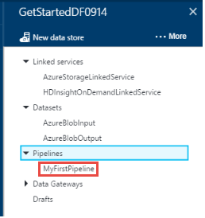
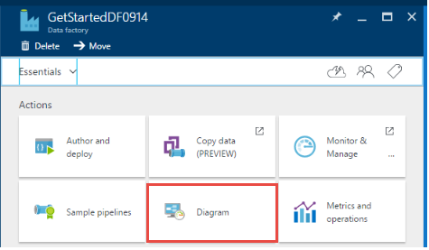
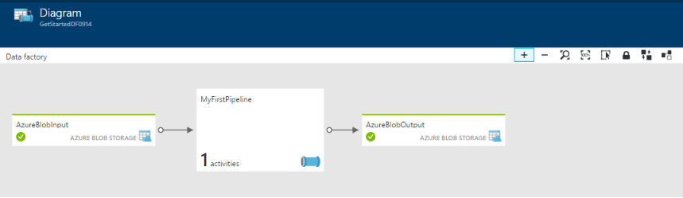
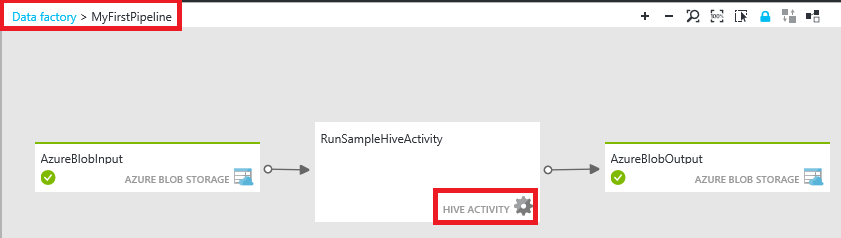
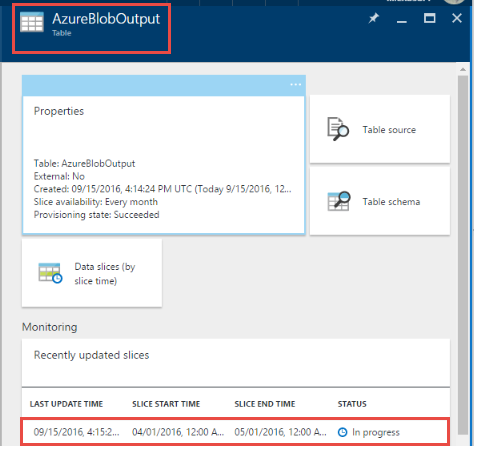

<properties
    pageTitle="Creare la prima factory di dati (portal Azure) | Microsoft Azure"
    description="In questa esercitazione, verrà creata una pipeline di Azure Data Factory di esempio con dati Factory Editor nel portale di Azure."
    services="data-factory"
    documentationCenter=""
    authors="spelluru"
    manager="jhubbard"
    editor="monicar"/>

<tags
    ms.service="data-factory"
    ms.workload="data-services"
    ms.tgt_pltfrm="na"
    ms.devlang="na"
    ms.topic="hero-article" 
    ms.date="09/14/2016"
    ms.author="spelluru"/>

# Esercitazione: Creare la prima factory Azure dati tramite il portale di Azure
> [AZURE.SELECTOR]
- [Panoramica e i prerequisiti](data-factory-build-your-first-pipeline.md)
- [Portale di Azure](data-factory-build-your-first-pipeline-using-editor.md)
- [Visual Studio](data-factory-build-your-first-pipeline-using-vs.md)
- [PowerShell](data-factory-build-your-first-pipeline-using-powershell.md)
- [Modello di Manager delle risorse](data-factory-build-your-first-pipeline-using-arm.md)
- [API REST](data-factory-build-your-first-pipeline-using-rest-api.md)

In questo articolo si imparerà a utilizzare il [portale di Azure](https://portal.azure.com/) per creare il prima factory dati Azure. 

## Prerequisiti        
1. Leggere l'articolo [Esercitazione Panoramica](data-factory-build-your-first-pipeline.md) e completare i passaggi **prerequisito** .
2. In questo articolo non fornisce una panoramica del servizio di Azure Data Factory. È consigliabile elaborata articolo [Introduzione alle Azure Data Factory](data-factory-introduction.md) per informazioni dettagliate del servizio.  

## Creare factory di dati
Una factory dati può avere una o più tubazioni. Una pipeline può contenere uno o più attività. Ad esempio, una copia per copiare i dati da una fonte a un archivio di dati di destinazione e un'attività HDInsight Hive per eseguire script Hive per trasformare i dati di prodotto input output i dati. Iniziamo con la creazione di factory dati in questo passaggio. 

1.  Accedere al [portale di Azure](https://portal.azure.com/).
2.  Fare clic su **Nuovo** nel menu a sinistra, fare clic su **dati + Analitica**e fare clic su **Factory dati**.
        
    

2.  Per il nome e il **Nuovo factory di dati** , utilizzare **GetStartedDF** .

    

    > [AZURE.IMPORTANT] 
    > Il nome della factory dati Azure deve essere **univoco globale**. Se viene visualizzato l'errore: **dati factory nome "GetStartedDF" è non disponibile**. Modificare il nome di dati (ad esempio yournameGetStartedDF) e provare a creare di nuovo. Vedere l'argomento relativo a [Dati Factory - regole di denominazione](data-factory-naming-rules.md) per le regole di denominazione per gli elementi di dati Factory.
    > 
    > Il nome del produttore dati può essere registrato come un nome **DNS** in futuro e quindi diventano visibile pubblicamente.

3.  Selezionare l' **abbonamento Azure** in cui si desidera factory dati da creare. 
4.  Selezionare esistente **gruppo di risorse** o creare un gruppo di risorse. Creare un gruppo di risorse per l'esercitazione: **ADFGetStartedRG**. 
5.  Fare clic su **Crea** in e il **Nuovo factory di dati** .

    > [AZURE.IMPORTANT] Per creare le istanze di Factory dati, è necessario essere un membro del ruolo di [Collaboratore Factory dati](../active-directory/role-based-access-built-in-roles.md/#data-factory-contributor) livello di gruppo abbonamento/risorsa. 
6.  Viene visualizzato il factory di dati creato in **Startboard** del portale di Azure nel modo seguente:   

    
7. Congratulazioni! La prima factory dati completata. Dopo la factory di dati è stata creata correttamente, viene visualizzata la pagina factory dati, che mostra il contenuto della factory dati.   

    

Prima di creare una pipeline nell'ambiente di produzione dati, è necessario creare alcuni entità Factory dati prima di tutto. Creare innanzitutto servizi collegati per creare un collegamento dati archivi/calcola all'archivio dati, definire input e set di dati per rappresentare i dati di ingresso/uscita negli archivi dati collegati, quindi creare la pipeline con un'attività che utilizza questi set di dati di output. 

## Creazione di servizi collegati
In questo passaggio si collegare l'account di archiviazione Azure e un cluster di Azure HDInsight su richiesta dell'ambiente di produzione di dati. L'account di archiviazione Azure contiene i dati di input e di output per la pipeline in questo esempio. Per eseguire script Hive specificato nell'attività di pipeline in questo esempio viene usato il servizio di HDInsight collegato. Identificare quali [archivio dati](data-factory-data-movement-activities.md)/[servizi di elaborazione](data-factory-compute-linked-services.md) vengono usati nello scenario in uso e collegare i servizi factory dati mediante la creazione di servizi collegati.  

### Creare il servizio di archiviazione di Azure collegato
In questo passaggio si collega l'account di archiviazione Azure a factory i dati. In questa esercitazione, utilizzare lo stesso account Azure lo spazio di archiviazione per archiviare i dati di ingresso/uscita e il file di script HQL. 

1.  Fare clic su **autore e distribuire** in e il **Produttore di dati** per **GetStartedDF**. Verrà visualizzato l'Editor di Factory dei dati. 
     
    
2.  Fare clic su **nuovo archivio dati** e scegliere **lo spazio di archiviazione Azure**.

    

3.  Verrà visualizzato lo script JSON per la creazione di un servizio di archiviazione di Azure collegato nell'editor. 
    
    
     
4. Sostituire **nome dell'account** con il nome dell'account Azure dello spazio di archiviazione e la **chiave account** con il tasto di scelta dell'account di archiviazione Azure. Per informazioni su come ottenere il codice di accesso di spazio di archiviazione, vedere [visualizzare, copia e lo spazio di archiviazione rigenera i tasti di scelta](../storage/storage-create-storage-account.md#view-copy-and-regenerate-storage-access-keys)
5. Fare clic su **Distribuisci** della barra dei comandi per distribuire il servizio collegato.

    

   Dopo aver distribuito il servizio collegato correttamente, nella finestra **Bozza 1** deve essere nascosto e **AzureStorageLinkedService** viene visualizzato nella visualizzazione albero a sinistra. 
       

 
### Creare il servizio di Azure HDInsight collegato
In questo passaggio è collegare un cluster di HDInsight su richiesta su factory i dati. Cluster HDInsight automaticamente creato in fase di esecuzione ed eliminato al termine elaborazione e inattive per il periodo di tempo specificato. 

1. **Dati Factory Editor**fare clic su **... Ulteriori**, fare clic su **Nuovo calcolare**e selezionare **il cluster HDInsight su richiesta**.

    
2. Copiare e incollare il frammento di codice seguente nella finestra **Bozza-1** . Il frammento di codice JSON sono descritte le proprietà che vengono utilizzate per creare il cluster di HDInsight su richiesta. 

        {
          "name": "HDInsightOnDemandLinkedService",
          "properties": {
            "type": "HDInsightOnDemand",
            "typeProperties": {
              "version": "3.2",
              "clusterSize": 1,
              "timeToLive": "00:30:00",
              "linkedServiceName": "AzureStorageLinkedService"
            }
          }
        }
    
    Nella tabella seguente vengono descritte le proprietà JSON utilizzata il frammento di codice:
    
  	| Proprietà | Descrizione |
  	| :------- | :---------- |
  	| Versione | Specifica che la versione di HDInsight creata da 3,2. | 
  	| ClusterSize | Specifica la dimensione del cluster HDInsight. | 
  	| TimeToLive | Specifica che il tempo di inattività per cluster HDInsight prima dell'eliminazione. |
  	| linkedServiceName | Specifica l'account di archiviazione che viene usata per archiviare i registri generati da HDInsight. |

    Noti quanto segue: 
    
    - Data Factory crea automaticamente un cluster di HDInsight **basato su Windows** con il JSON. È possibile che anche creare un cluster di HDInsight **basato su Linux** . Per informazioni dettagliate, vedere [Servizi collegati HDInsight su richiesta](data-factory-compute-linked-services.md#azure-hdinsight-on-demand-linked-service) . 
    - È possibile utilizzare **il proprio cluster HDInsight** invece di usare un cluster di HDInsight su richiesta. Per informazioni dettagliate, vedere [Servizi collegati HDInsight](data-factory-compute-linked-services.md#azure-hdinsight-linked-service) .
    - Cluster HDInsight crea un **contenitore predefinito** nell'archiviazione blob specificato nel JSON (**linkedServiceName**). HDInsight non viene eliminato il contenitore quando il cluster viene eliminato. Questo comportamento risulta in base alla progettazione. Con un servizio su richiesta HDInsight collegato, viene creato un cluster HDInsight ogni volta che viene elaborata una sezione, a meno che non esiste un cluster di live esistente (**timeToLive**). Il cluster viene eliminato automaticamente al termine dell'elaborazione.
    
        Vengono elaborate più sezioni, molti contenitori vengono visualizzate in archiviazione blob Azure. Se si ha bisogno per la risoluzione dei problemi dei processi, da eliminare in modo da ridurre i costi di spazio di archiviazione. I nomi dei contenitori seguono un motivo: "alimentatore automatico**yourdatafactoryname**-**linkedservicename**- datetimestamp". Usare strumenti, ad esempio [Esplora risorse di archiviazione](http://storageexplorer.com/) per eliminare i contenitori di spazio di archiviazione blob Azure.

    Per informazioni dettagliate, vedere [Servizi collegati HDInsight su richiesta](data-factory-compute-linked-services.md#azure-hdinsight-on-demand-linked-service) .
3. Fare clic su **Distribuisci** della barra dei comandi per distribuire il servizio collegato. 

    

4. Verificare che sia visualizzata **AzureStorageLinkedService** e **HDInsightOnDemandLinkedService** nella struttura della visualizzazione sul lato sinistro.

    

## Creare set di dati
In questo passaggio si crea set di dati per rappresentare l'input e generare l'output dei dati per l'elaborazione di Hive. Questi set di dati fanno riferimento a **AzureStorageLinkedService** creata precedentemente in questa esercitazione. Punti di servizio collegato a un account di archiviazione di Azure e set di dati specificano contenitore, cartella, nome del file in archiviazione contenente input e di output dei dati.   

### Creare set di dati input

1. **Dati Factory Editor**fare clic su **... Ulteriori** nella barra dei comandi, fare clic su **nuovo set di dati**e selezionare **archiviazione Blob Azure**.

    
2. Copiare e incollare il frammento di codice seguente nella finestra bozza-1. Frammento di JSON, si sta creando un set di dati denominato **AzureBlobInput** che rappresenta i dati di input per un'attività nella pipeline. Inoltre, specificare che i dati di input si trovano nel contenitore di blob denominato **adfgetstarted** e la cartella denominata **inputdata**.
        
        {
            "name": "AzureBlobInput",
            "properties": {
                "type": "AzureBlob",
                "linkedServiceName": "AzureStorageLinkedService",
                "typeProperties": {
                    "fileName": "input.log",
                    "folderPath": "adfgetstarted/inputdata",
                    "format": {
                        "type": "TextFormat",
                        "columnDelimiter": ","
                    }
                },
                "availability": {
                    "frequency": "Month",
                    "interval": 1
                },
                "external": true,
                "policy": {}
            }
        } 

    Nella tabella seguente vengono descritte le proprietà JSON utilizzata il frammento di codice:

  	| Proprietà | Descrizione |
  	| :------- | :---------- |
  	| tipo | La proprietà di tipo sia impostata su AzureBlob perché dati si trovano in archiviazione blob Azure. |  
  	| linkedServiceName | fa riferimento a AzureStorageLinkedService creata in precedenza. |
  	| fileName | Questa proprietà è facoltativa. Se si omette questa proprietà, tutti i file dal folderPath sono scelto. In questo caso, viene elaborato solo il input.log. |
  	| tipo | I file di log sono in formato testo, in modo che serve formato testo. | 
  	| columnDelimiter | colonne nei file di log sono delimitate da virgola () |
  	| Frequenza/intervallo | frequenza impostata su mese e l'intervallo è 1, in modo che le sezioni inpue disponibili mensile. | 
  	| esterno | Questa proprietà è impostata su true se i dati di input non viene generati dal servizio dati Factory. | 
        
3. Fare clic su **Distribuisci** della barra dei comandi per distribuire il set di dati appena creato. Verrà visualizzato il set di dati nella visualizzazione albero a sinistra. 

### Creare set di dati di output
A questo punto, si crea il set di dati di output per rappresentare i dati di output archiviati in archiviazione Blob Azure. 

1. **Dati Factory Editor**fare clic su **... Ulteriori** nella barra dei comandi, fare clic su **nuovo set di dati**e selezionare **archiviazione Blob Azure**.  
2. Copiare e incollare il frammento di codice seguente nella finestra bozza-1. Frammento di JSON, si sta creando un set di dati denominate **AzureBlobOutput**e specificare la struttura dei dati derivante da script Hive. Inoltre, specificare che i risultati vengono memorizzati in un contenitore di blob chiamato **adfgetstarted** e la cartella denominata **partitioneddata**. La sezione **disponibilità** specifica che il set di dati di output viene visualizzato su base mensile.
    
        {
          "name": "AzureBlobOutput",
          "properties": {
            "type": "AzureBlob",
            "linkedServiceName": "AzureStorageLinkedService",
            "typeProperties": {
              "folderPath": "adfgetstarted/partitioneddata",
              "format": {
                "type": "TextFormat",
                "columnDelimiter": ","
              }
            },
            "availability": {
              "frequency": "Month",
              "interval": 1
            }
          }
        }

    Vedere la sezione **creare il set di dati di input** per le descrizioni di queste proprietà. Non la proprietà è impostata esterna in un set di dati di output ottenuti il set di dati mediante il servizio dati Factory.
3. Fare clic su **Distribuisci** della barra dei comandi per distribuire il set di dati appena creato.
4. Verificare che il set di dati sia stato creato correttamente.

    

## Creare pipeline
In questo passaggio si crea il prima pipeline con un'attività **HDInsightHive** . Sezione input è disponibile mensile (frequenza: mese, intervallo: 1), sezione output prodotto mensile e utilità di pianificazione per l'attività viene inoltre impostata su mensile. Le impostazioni per il set di dati di output e l'utilità di pianificazione attività devono corrispondere. Set di dati di output è al momento, quali unità della programmazione, è necessario creare un set di dati di output anche se l'attività non produce alcun output. Se l'attività non richiede qualsiasi tipo di input, è possibile ignorare la creazione di set di dati di input. Le proprietà utilizzate in JSON seguente sono illustrate alla fine di questa sezione. 

1. **Dati Factory Editor**fare clic su **i puntini di sospensione (...) Altri comandi** e quindi fare clic su **nuova pipeline**.
    
    
2. Copiare e incollare il frammento di codice seguente nella finestra bozza-1.

    > [AZURE.IMPORTANT] Sostituire **storageaccountname** con il nome del proprio account di archiviazione nel JSON.
        
        {
            "name": "MyFirstPipeline",
            "properties": {
                "description": "My first Azure Data Factory pipeline",
                "activities": [
                    {
                        "type": "HDInsightHive",
                        "typeProperties": {
                            "scriptPath": "adfgetstarted/script/partitionweblogs.hql",
                            "scriptLinkedService": "AzureStorageLinkedService",
                            "defines": {
                                "inputtable": "wasb://adfgetstarted@<storageaccountname>.blob.core.windows.net/inputdata",
                                "partitionedtable": "wasb://adfgetstarted@<storageaccountname>.blob.core.windows.net/partitioneddata"
                            }
                        },
                        "inputs": [
                            {
                                "name": "AzureBlobInput"
                            }
                        ],
                        "outputs": [
                            {
                                "name": "AzureBlobOutput"
                            }
                        ],
                        "policy": {
                            "concurrency": 1,
                            "retry": 3
                        },
                        "scheduler": {
                            "frequency": "Month",
                            "interval": 1
                        },
                        "name": "RunSampleHiveActivity",
                        "linkedServiceName": "HDInsightOnDemandLinkedService"
                    }
                ],
                "start": "2016-04-01T00:00:00Z",
                "end": "2016-04-02T00:00:00Z",
                "isPaused": false
            }
        }
 
    Frammento di JSON, si sta creando una pipeline è costituita da una singola attività che utilizza Hive per elaborare i dati in un cluster di HDInsight.
    
    Nella finestra account di archiviazione Azure (specificata da scriptLinkedService, denominata **AzureStorageLinkedService**) e nella cartella **script** il contenitore **adfgetstarted**, è archiviato il file di script Hive, **partitionweblogs.hql**.

    La sezione **definisce** viene utilizzata per specificare le impostazioni di runtime passati allo script hive come valori di configurazione Hive (ad esempio ${hiveconf: inputtable}, {hiveconf:partitionedtable} $).

    Le proprietà di **inizio** e **Fine** della pipeline specifica del periodo attivo della pipeline.

    Attività JSON, specificare che lo script Hive viene eseguita nel calcolo specificato per il **linkedServiceName** - **HDInsightOnDemandLinkedService**.

    > [AZURE.NOTE] Per ulteriori informazioni sulle proprietà JSON utilizzata nell'esempio, vedere [Anatomia di una Pipeline](data-factory-create-pipelines.md#anatomy-of-a-pipeline) . 

3. Verificare quanto segue: 
    1. file **input.log** presente nella cartella **inputdata** del contenitore **adfgetstarted** in archiviazione blob Azure
    2. file **partitionweblogs.hql** presente nella cartella **script** del contenitore **adfgetstarted** in archiviazione blob Azure. Completare il prerequisito passaggi nell' [Esercitazione Panoramica](data-factory-build-your-first-pipeline.md) se tali file non è visibile. 
    3. Confermare sostituito **storageaccountname** con il nome del proprio account di archiviazione nella pipeline JSON. 
2. Fare clic su **Distribuisci** sulla barra di comando per distribuire la pipeline. Poiché l'ora di **inizio** e **Fine** è impostata in passato e **isPaused** è impostato su false, viene eseguita la pipeline (attività nella pipeline) immediatamente dopo la distribuzione. 
4. Verificare che sia visualizzata la pipeline nella visualizzazione struttura.

    
5. Congratulazioni, creato il prima pipeline!

## Pipeline di monitor

### Pipeline di monitor tramite la vista diagramma

6. Fare clic sulla **X** per chiudere pale dati Factory Editor e per tornare a e il produttore di dati e fare clic su **diagramma**.
  
    
7. Nella vista diagramma visualizzare una panoramica dei tubazioni e set di dati utilizzati in questa esercitazione.
    
     
8. Per visualizzare tutte le attività nella pipeline, rapida pipeline nel diagramma e fare clic su Apri Pipeline. 

    
9. Verificare che sia visualizzata l'attività HDInsightHive nella pipeline. 
  
    

    Per tornare alla visualizzazione precedente, fare clic su **factory dati** nel menu di navigazione nella parte superiore. 
10. Nella **Visualizzazione Diagramma**, fare doppio clic sul set di dati **AzureBlobInput**. Verificare che la sezione sia nello stato **Pronto** . Potrebbe richiedere alcuni minuti per la sezione compaiano nello stato pronto. Se non si verifica dopo attendere un intervallo di tempo, verificare se è presente il file di input (input.log) presente nella cartella (inputdata) e destra contenitore (adfgetstarted).

    
11. Fare clic sulla **X** per chiudere **AzureBlobInput** blade. 
12. Nella **Visualizzazione Diagramma**, fare doppio clic sul set di dati **AzureBlobOutput**. Si noterà che in alla sezione che è in corso l'elaborazione.

    
9. Quando viene eseguita un'elaborazione, viene visualizzata la sezione nello stato **Pronto** .
    
>[AZURE.IMPORTANT] Creazione di un cluster di HDInsight su richiesta in genere accetta un intervallo di tempo (circa 20 minuti). Prevedere il gadget pipeline di impieghi **30 minuti** per elaborare la sezione.    

     
    
10. Quando la sezione è **pronta** , selezionare la cartella **partitioneddata** nel contenitore di **adfgetstarted** in archiviazione blob per i dati di output.  
 
    
11. Fare clic sulla sezione per visualizzare dettagli in blade una **sezione di dati** .

      
12. Fare clic su un'attività Esegui nell' **elenco di attività viene eseguito** per visualizzare i dettagli di un'attività eseguire (Hive attività nello scenario) in un intervallo di **azione Dettagli esecuzione** .   

      
    
    File di log, è possibile visualizzare la query Hive che è stata eseguita e le informazioni sullo stato. Questi registri sono utili per la risoluzione dei problemi.
Vedere [monitorare e gestire mediante Azure pale portale](data-factory-monitor-manage-pipelines.md) per ulteriori dettagli. 

> [AZURE.IMPORTANT] Il file di input viene eliminato quando la sezione viene elaborata correttamente. Pertanto, se si desidera eseguire di nuovo la sezione o eseguire nuovamente l'esercitazione, caricare il file di input (input.log) nella cartella inputdata del contenitore adfgetstarted.

### Eseguire il monitoraggio delle pipeline usando monitorare e gestire App
È anche possibile utilizzare Monitor e gestire applicazione per controllare la pipeline. Per informazioni dettagliate sull'uso dell'applicazione, vedere [monitorare e gestire pipeline di Azure Data Factory utilizzando monitoraggio e gestione App](data-factory-monitor-manage-app.md).

1. Fare clic su riquadro **Monitor e Gestisci** nella home page dell'ambiente di produzione di dati.

     
2. Verrà visualizzato **Monitor e gestione dell'applicazione**. Modificare **l'ora di inizio** e **ora di fine** in modo che corrisponda start (04-01-2016 12:00 AM) e di fine (04-02-2016 12:00 AM) della pipeline, fare clic su **Applica**.

     
3. Selezionare un intervallo di azione nell'elenco **Attività di Windows** per visualizzare i dettagli su di esso. 
    

## Riepilogo 
Per creare una factory di dati di Azure per elaborare i dati in questa esercitazione, eseguendo Hive script in un cluster di hadoop HDInsight. È utilizzato l'Editor di Factory dei dati nel portale di Azure per eseguire la procedura seguente:  

1.  Creare una **factory di dati**di Azure.
2.  Creare due **servizi collegati**:
    1.  Servizio di **Archiviazione azure** collegati per collegare l'archiviazione blob Azure contenente i file di ingresso/uscita su factory dati.
    2.  Servizi collegati nella richiesta di **Azure HDInsight** collegare un cluster di HDInsight Hadoop su richiesta la factory di dati. Azure Data Factory crea un HDInsight Hadoop cluster just-in-time per elaborare dati di input e produrre dati di output. 
3.  Creare due **set di dati**, che descrivono i dati di input e di output per l'attività HDInsight Hive nella pipeline. 
4.  Una **pipeline** con un'attività **HDInsight Hive** . 

## Passaggi successivi
In questo articolo è stata creata una pipeline con un'attività di trasformazione (attività HDInsight) che esegue uno script Hive in un cluster di HDInsight su richiesta. Per informazioni sull'uso di un'attività di copia per copiare i dati da un archivio Blob Azure SQL Azure, vedere [Esercitazione: copiare i dati da un Azure blob in SQL Azure](data-factory-copy-data-from-azure-blob-storage-to-sql-database.md).

## Vedere anche
| Argomento | Descrizione |
| :---- | :---- |
| [Attività di trasformazione dati](data-factory-data-transformation-activities.md) | In questo articolo fornisce un elenco di attività di trasformazione dati (ad esempio trasformazione HDInsight Hive è utilizzata in questa esercitazione) supportati da Azure Data Factory. | 
| [Pianificazione e l'esecuzione](data-factory-scheduling-and-execution.md) | Questo articolo illustra gli aspetti pianificazione e l'esecuzione del modello di applicazione Azure Data Factory. |
| [Pipeline](data-factory-create-pipelines.md) | Questo articolo è utile comprendere tubazioni e le attività in Azure Data Factory e sul loro utilizzo per costruire-to-end basati sui dati flussi di lavoro per la scenario o azienda. |
| [Set di dati](data-factory-create-datasets.md) | Questo articolo è utile comprendere set di dati di Azure Data Factory.
| [Monitorare e gestire mediante il monitoraggio App](data-factory-monitor-manage-app.md) | In questo articolo viene descritto come monitorare, gestire ed eseguire il debug mediante il monitoraggio e gestione delle App. 

  

