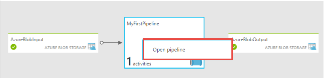

<properties
    pageTitle="Creare la prima factory di dati (Visual Studio) | Microsoft Azure"
    description="In questa esercitazione, verrà creata una pipeline di Azure Data Factory esempio utilizzando Visual Studio."
    services="data-factory"
    documentationCenter=""
    authors="spelluru"
    manager="jhubbard"
    editor="monicar"/>

<tags
    ms.service="data-factory"
    ms.workload="data-services"
    ms.tgt_pltfrm="na"
    ms.devlang="na"
    ms.topic="hero-article" 
    ms.date="10/17/2016"
    ms.author="spelluru"/>

# Esercitazione: Factory di dati creare il primo Azure con Microsoft Visual Studio
> [AZURE.SELECTOR]
- [Panoramica e i prerequisiti](data-factory-build-your-first-pipeline.md)
- [Portale di Azure](data-factory-build-your-first-pipeline-using-editor.md)
- [Visual Studio](data-factory-build-your-first-pipeline-using-vs.md)
- [PowerShell](data-factory-build-your-first-pipeline-using-powershell.md)
- [Modello di Manager delle risorse](data-factory-build-your-first-pipeline-using-arm.md)
- [API REST](data-factory-build-your-first-pipeline-using-rest-api.md)

In questo articolo, utilizzare Microsoft Visual Studio per creare il prima factory dati Azure.

## Prerequisiti
1. Leggere l'articolo [Esercitazione Panoramica](data-factory-build-your-first-pipeline.md) e completare i passaggi **prerequisito** .
2. Per poter pubblicare entità Factory dati da Visual Studio su Factory di dati di Azure, è necessario essere un **amministratore della sottoscrizione Azure** .
3. È necessario disporre dei seguenti prodotti installati nel computer in uso: 
    - Visual Studio 2013 o Visual Studio 2015
    - Scaricare Azure SDK per Visual Studio 2013 o Visual Studio 2015. Passare alla [Pagina di Download di Azure](https://azure.microsoft.com/downloads/) e fare clic su **VS 2013** o **VS 2015** nella sezione **.NET** .
    - Scaricare il plug-in Azure Data Factory più recenti per Visual Studio: [VS 2013](https://visualstudiogallery.msdn.microsoft.com/754d998c-8f92-4aa7-835b-e89c8c954aa5) o [VS 2015](https://visualstudiogallery.msdn.microsoft.com/371a4cf9-0093-40fa-b7dd-be3c74f49005). È inoltre possibile aggiornare il plug-in eseguendo le operazioni seguenti: nel menu, fare clic su **Strumenti** -> **Extensions e aggiornamenti** -> **Online** -> **Visual Studio Gallery** -> **Microsoft Azure dati Factory Tools per Visual Studio** -> **aggiornare**. 
 
A questo punto, è possibile utilizzare Visual Studio per creare una factory di dati di Azure. 

## Creazione di progetto di Visual Studio 
1. Avviare **Visual Studio 2013** oppure **Visual Studio 2015**. Fare clic su **File**, scegliere **Nuovo**e fare clic su **progetto**. Verrà visualizzato nella finestra di dialogo **Nuovo progetto** .  
2. Nella finestra di dialogo **Nuovo progetto** , selezionare il modello **DataFactory** e fare clic su **Progetto Factory dati vuoto**.   

    

3. Immettere un **nome** per il progetto, **percorso**e un nome per la **soluzione**e fare clic su **OK**.

    

## Creazione di servizi collegati
Una factory dati può avere una o più tubazioni. Una pipeline può contenere uno o più attività. Ad esempio, un'attività di copia per copiare i dati da una fonte a un archivio di dati di destinazione e un'attività HDInsight Hive per eseguire script Hive per trasformare i dati di input. Vedere [Archivia dati supportati](data-factory-data-movement-activities.md##supported-data-stores-and-formats) per tutte le origini e sink supportati per l'attività di copia. Vedere [calcolare servizi collegati](data-factory-compute-linked-services.md) per l'elenco di servizi di calcolo supportati dal produttore di dati. 

In questo passaggio si collegare l'account di archiviazione Azure e un cluster di Azure HDInsight su richiesta dell'ambiente di produzione di dati. L'account di archiviazione Azure contiene i dati di input e di output per la pipeline in questo esempio. Per eseguire script Hive specificato nell'attività di pipeline in questo esempio viene usato il servizio di HDInsight collegato. Identificare i dati archivio/calcolo servizi utilizzati nello scenario in uso e collegare i servizi factory dati mediante la creazione di servizi collegati.  

Specificare il nome e le impostazioni per la factory di dati in un secondo momento quando si pubblica la soluzione Factory dati.

#### Creare il servizio di archiviazione di Azure collegato
In questo passaggio si collega l'account di archiviazione Azure a factory i dati. Per questa esercitazione, utilizzare lo stesso account Azure lo spazio di archiviazione per archiviare i dati di ingresso/uscita e il file di script HQL. 

4. Pulsante destro del mouse **Servizi collegati** in Esplora soluzioni, scegliere **Aggiungi**e fare clic su **Nuovo elemento**.      
5. Nella finestra di dialogo **Aggiungi nuovo elemento** selezionare **Servizio di archiviazione di Azure collegate** dall'elenco e fare clic su **Aggiungi**. 
3. Sostituire **nome account** e **accountkey** con il nome del proprio account Azure dello spazio di archiviazione e la relativa chiave. Per informazioni su come ottenere il codice di accesso di spazio di archiviazione, vedere [visualizzare, copia e lo spazio di archiviazione rigenera i tasti di scelta](../storage/storage-create-storage-account.md#view-copy-and-regenerate-storage-access-keys)

    

4. Salvare il file **AzureStorageLinkedService1.json** .

#### Creare il servizio di Azure HDInsight collegato
In questo passaggio è collegare un cluster di HDInsight su richiesta su factory i dati. Cluster HDInsight automaticamente creato in fase di esecuzione ed eliminato al termine elaborazione e inattive per il periodo di tempo specificato. È possibile utilizzare il proprio cluster HDInsight invece di usare un cluster di HDInsight su richiesta. Per informazioni dettagliate, vedere [Calcolare servizi collegati](data-factory-compute-linked-services.md) . 

1. In **Esplora soluzioni**rapida **Servizi collegati**, scegliere **Aggiungi**e fare clic su **Nuovo elemento**.
2. Selezionare **HDInsight nella richiesta collegate servizio**e fare clic su **Aggiungi**. 
3. Sostituire **JSON** con le operazioni seguenti:

        {
          "name": "HDInsightOnDemandLinkedService",
          "properties": {
            "type": "HDInsightOnDemand",
            "typeProperties": {
              "version": "3.2",
              "clusterSize": 1,
              "timeToLive": "00:30:00",
              "linkedServiceName": "AzureStorageLinkedService1"
            }
          }
        }
    
    Nella tabella seguente vengono descritte le proprietà JSON utilizzata il frammento di codice:
    
    Proprietà | Descrizione
    -------- | -----------
    Versione | Specifica che la versione di HDInsight creata da 3,2. 
    ClusterSize | Specifica la dimensione del cluster HDInsight. 
    TimeToLive | Specifica che il tempo di inattività per cluster HDInsight prima dell'eliminazione.
    linkedServiceName | Specifica l'account di archiviazione che viene usata per archiviare i registri generati da HDInsight

    Tenere presente quanto segue: 
    
    - Data Factory crea automaticamente un cluster di HDInsight **basato su Windows** con JSON precedente. È possibile che anche creare un cluster di HDInsight **basato su Linux** . Per informazioni dettagliate, vedere [Servizi collegati HDInsight su richiesta](data-factory-compute-linked-services.md#azure-hdinsight-on-demand-linked-service) . 
    - È possibile utilizzare **il proprio cluster HDInsight** invece di usare un cluster di HDInsight su richiesta. Per informazioni dettagliate, vedere [Servizi collegati HDInsight](data-factory-compute-linked-services.md#azure-hdinsight-linked-service) .
    - Cluster HDInsight crea un **contenitore predefinito** nell'archiviazione blob specificato nel JSON (**linkedServiceName**). HDInsight non viene eliminato il contenitore quando il cluster viene eliminato. Questo comportamento risulta in base alla progettazione. Con un servizio su richiesta HDInsight collegato, viene creato un cluster HDInsight ogni volta che viene elaborata una sezione, a meno che non esiste un cluster di live esistente (**timeToLive**). Il cluster viene eliminato automaticamente al termine dell'elaborazione.
    
        Vengono elaborate più sezioni, molti contenitori vengono visualizzate in archiviazione blob Azure. Se si ha bisogno per la risoluzione dei problemi dei processi, da eliminare in modo da ridurre i costi di spazio di archiviazione. I nomi dei contenitori seguono un motivo: "alimentatore automatico**yourdatafactoryname**-**linkedservicename**- datetimestamp". Usare strumenti, ad esempio [Esplora risorse di archiviazione](http://storageexplorer.com/) per eliminare i contenitori di spazio di archiviazione blob Azure.

    Per informazioni dettagliate, vedere [Servizi collegati HDInsight su richiesta](data-factory-compute-linked-services.md#azure-hdinsight-on-demand-linked-service) . 
4. Salvare il file **HDInsightOnDemandLinkedService1.json** .

## Creare set di dati
In questo passaggio si crea set di dati per rappresentare l'input e generare l'output dei dati per l'elaborazione di Hive. Questi set di dati fanno riferimento a **AzureStorageLinkedService1** creata precedentemente in questa esercitazione. Punti di servizio collegato a un account di archiviazione di Azure e set di dati specificano contenitore, cartella, nome del file in archiviazione contenente input e di output dei dati.   

#### Creare set di dati input

1. In **Esplora soluzioni**rapida **tabelle**, scegliere **Aggiungi**e fare clic su **Nuovo elemento**. 
2. Selezionare **Blob Azure** dall'elenco, modificare il nome del file in **InputDataSet.json**e fare clic su **Aggiungi**.
3. Sostituire **JSON** nell'editor con le operazioni seguenti: 

    Frammento di JSON, si sta creando un set di dati denominato **AzureBlobInput** che rappresenta i dati di input per un'attività nella pipeline. È inoltre specificare che i dati di input si trovano nel contenitore di blob denominato **adfgetstarted** e la cartella denominata **inputdata**
        
        {
            "name": "AzureBlobInput",
            "properties": {
                "type": "AzureBlob",
                "linkedServiceName": "AzureStorageLinkedService1",
                "typeProperties": {
                    "fileName": "input.log",
                    "folderPath": "adfgetstarted/inputdata",
                    "format": {
                        "type": "TextFormat",
                        "columnDelimiter": ","
                    }
                },
                "availability": {
                    "frequency": "Month",
                    "interval": 1
                },
                "external": true,
                "policy": {}
            }
        } 

    Nella tabella seguente vengono descritte le proprietà JSON utilizzata il frammento di codice:

  	| Proprietà | Descrizione |
  	| :------- | :---------- |
  	| tipo | La proprietà di tipo sia impostata su AzureBlob perché dati si trovano in archiviazione blob Azure. |  
  	| linkedServiceName | fa riferimento a AzureStorageLinkedService1 creata in precedenza. |
  	| fileName | Questa proprietà è facoltativa. Se si omette questa proprietà, tutti i file dal folderPath sono scelto. In questo caso, viene elaborato solo il input.log. |
  	| tipo | I file di log sono in formato testo, in modo che serve formato testo. | 
  	| columnDelimiter | colonne nei file di log sono racchiusi tra la virgola () |
  	| Frequenza/intervallo | frequenza impostata su mese e l'intervallo è 1, in modo che le sezioni inpue disponibili mensile. | 
  	| esterno | Questa proprietà è impostata su true se i dati di input non viene generati dal servizio dati Factory. | 
      
    
3. Salvare il file **InputDataset.json** . 

 
#### Creare set di dati di output
A questo punto, si crea il set di dati di output per rappresentare i dati di output archiviati in archiviazione Blob Azure. 

1. In **Esplora soluzioni**rapida **tabelle**, scegliere **Aggiungi**e fare clic su **Nuovo elemento**. 
2. Selezionare **Blob Azure** dall'elenco, modificare il nome del file in **OutputDataset.json**e fare clic su **Aggiungi**. 
3. Sostituire **JSON** nell'editor con le operazioni seguenti: 

    Frammento di JSON, si sta creando un set di dati denominate **AzureBlobOutput**e specificare la struttura dei dati derivante da script Hive. Inoltre, specificare che i risultati vengono memorizzati in un contenitore di blob chiamato **adfgetstarted** e la cartella denominata **partitioneddata**. La sezione **disponibilità** specifica che il set di dati di output viene visualizzato su base mensile.
    
        {
          "name": "AzureBlobOutput",
          "properties": {
            "type": "AzureBlob",
            "linkedServiceName": "AzureStorageLinkedService1",
            "typeProperties": {
              "folderPath": "adfgetstarted/partitioneddata",
              "format": {
                "type": "TextFormat",
                "columnDelimiter": ","
              }
            },
            "availability": {
              "frequency": "Month",
              "interval": 1
            }
          }
        }

    Vedere la sezione **creare il set di dati di input** per le descrizioni di queste proprietà. Non la proprietà è impostata esterna in un set di dati di output ottenuti il set di dati mediante il servizio dati Factory.

4. Salvare il file **OutputDataset.json** .

### Creare pipeline
In questo passaggio si crea il prima pipeline con un'attività **HDInsightHive** . La sezione input sia disponibile mensile (frequenza: mese, intervallo: 1), sezione output prodotto mensile e utilità di pianificazione per l'attività viene inoltre impostata su mensile. Le impostazioni per il set di dati di output e l'utilità di pianificazione attività devono corrispondere. Set di dati di output è al momento, quali unità della programmazione, è necessario creare un set di dati di output anche se l'attività non produce alcun output. Se l'attività non richiede qualsiasi tipo di input, è possibile ignorare la creazione di set di dati di input. Le proprietà utilizzate in JSON seguente sono illustrate alla fine di questa sezione.

1. In **Esplora soluzioni**fare doppio clic **tubazioni**, scegliere **Aggiungi**e fare clic su **nuovo elemento.** 
2. Selezionare **Hive Pipeline di trasformazione** dall'elenco e fare clic su **Aggiungi**. 
3. Sostituire **JSON** con il frammento di codice seguente.

    > [AZURE.IMPORTANT] Sostituire **storageaccountname** con il nome del proprio account di archiviazione.

        {
            "name": "MyFirstPipeline",
            "properties": {
                "description": "My first Azure Data Factory pipeline",
                "activities": [
                    {
                        "type": "HDInsightHive",
                        "typeProperties": {
                            "scriptPath": "adfgetstarted/script/partitionweblogs.hql",
                            "scriptLinkedService": "AzureStorageLinkedService1",
                            "defines": {
                                "inputtable": "wasb://adfgetstarted@<storageaccountname>.blob.core.windows.net/inputdata",
                                "partitionedtable": "wasb://adfgetstarted@<storageaccountname>.blob.core.windows.net/partitioneddata"
                            }
                        },
                        "inputs": [
                            {
                                "name": "AzureBlobInput"
                            }
                        ],
                        "outputs": [
                            {
                                "name": "AzureBlobOutput"
                            }
                        ],
                        "policy": {
                            "concurrency": 1,
                            "retry": 3
                        },
                        "scheduler": {
                            "frequency": "Month",
                            "interval": 1
                        },
                        "name": "RunSampleHiveActivity",
                        "linkedServiceName": "HDInsightOnDemandLinkedService"
                    }
                ],
                "start": "2016-04-01T00:00:00Z",
                "end": "2016-04-02T00:00:00Z",
                "isPaused": false
            }
        }

    Frammento di JSON, si sta creando una pipeline è costituita da una singola attività che utilizza Hive per elaborare i dati in un cluster di HDInsight.
    
    Frammento di JSON, si sta creando una pipeline è costituita da una singola attività che utilizza Hive per elaborare i dati in un cluster di HDInsight.
    
    Nella finestra account di archiviazione Azure (specificata da scriptLinkedService, denominata **AzureStorageLinkedService1**) e nella cartella **script** il contenitore **adfgetstarted**, è archiviato il file di script Hive, **partitionweblogs.hql**.

    La sezione **definisce** viene utilizzata per specificare le impostazioni di runtime passati allo script hive come valori di configurazione Hive (ad esempio ${hiveconf: inputtable}, {hiveconf:partitionedtable} $).

    Le proprietà di **inizio** e **Fine** della pipeline specifica del periodo attivo della pipeline.

    Attività JSON, specificare che lo script Hive viene eseguita nel calcolo specificato per il **linkedServiceName** - **HDInsightOnDemandLinkedService**.

    > [AZURE.NOTE] Per ulteriori informazioni sulle proprietà JSON utilizzata nell'esempio, vedere [Anatomia di una Pipeline](data-factory-create-pipelines.md#anatomy-of-a-pipeline) . 
3. Salvare il file **HiveActivity1.json** .

### Aggiungere partitionweblogs.hql e input.log come dipendenza 

1. Pulsante destro del mouse **dipendenze** nella finestra **Esplora** , scegliere **Aggiungi**e fare clic su **Elemento esistente**.  
2. Passare a **C:\ADFGettingStarted** e selezionare **partitionweblogs.hql**, **input.log** file e fare clic su **Aggiungi**. Questi due file come parte del prerequisiti già create da [Esercitazione Panoramica](data-factory-build-your-first-pipeline.md).

Quando si pubblica la soluzione nel passaggio successivo, il file **partitionweblogs.hql** viene caricato nella cartella script nel contenitore di blob **adfgetstarted** .   

### Pubblicare/distribuire entità Factory dati

18. Fare clic sul progetto in Esplora soluzioni e fare clic su **pubblica**. 
19. Se viene visualizzato la finestra di dialogo di **accedere al proprio account Microsoft** , immettere le credenziali dell'account che dispone di sottoscrizione Azure e fare clic su **Accedi**.
20. Viene visualizzato nella finestra di dialogo seguenti:

    

21. Nella pagina Configura dati factory, procedere come segue: 
    1. opzione **Crea nuova Factory di dati** .
    2. Immettere un **nome** univoco per la factory di dati. Ad esempio: **FirstDataFactoryUsingVS09152016**. Il nome deve essere univoco globale.  
    
    
        > [AZURE.IMPORTANT] Se viene visualizzato l'errore **dati factory nome "FirstDataFactoryUsingVS" è non disponibile** per la pubblicazione, modificare il nome (ad esempio yournameFirstDataFactoryUsingVS). Vedere l'argomento relativo a [Dati Factory - regole di denominazione](data-factory-naming-rules.md) per le regole di denominazione per gli elementi di dati Factory.
3. Selezionare l'abbonamento a destra per il campo di **sottoscrizione** .
     
     
        > [AZURE.IMPORTANT] Se non sono visualizzati tutti gli abbonamenti, assicurarsi che è stato eseguito utilizzando un account è un amministratore o co-amministratore della sottoscrizione.  
        
    4. Selezionare il **gruppo di risorse** per la factory di dati da creare. 
    5. Selezionare l' **area** per la factory di dati. 
    6. Fare clic su **Avanti** per passare alla pagina **Pubblica elementi** . (Premere **TAB** per spostarsi fuori il campo nome a se il pulsante **Avanti** è disattivato) 
23. Nella pagina **Pubblicare articoli** , verificare che tutte le factory dati entità siano selezionate e fare clic su **Avanti** per passare alla pagina di **Riepilogo** .     
24. Controllare il riepilogo e fare clic su **Avanti** per avviare il processo di distribuzione e visualizzare lo **Stato di distribuzione**.
25. Nella pagina **Stato di distribuzione** , verrà visualizzato lo stato del processo di distribuzione. Al termine della distribuzione, fare clic su Fine. 

 
Punti importanti: 

- Se viene visualizzato l'errore: "**l'abbonamento non è registrato per utilizzare spazio dei nomi Microsoft.DataFactory**", eseguire una delle operazioni seguenti e riprovare: 

    - In Azure PowerShell eseguire il seguente comando per registrare il provider di dati Factory. 
        
            Register-AzureRmResourceProvider -ProviderNamespace Microsoft.DataFactory
    
        È possibile eseguire il seguente comando per verificare che la Data Factory provider registrato. 
    
            Get-AzureRmResourceProvider
    - Accedere usando l'abbonamento Azure al [portale di Azure](https://portal.azure.com) e passare a una pala Factory dati (o) creare una factory di dati nel portale di Azure. Questa azione registra automaticamente il provider di necessità.
-   Il nome del produttore dati può essere registrato come un nome DNS in futuro e quindi diventano visibile pubblicamente.
-   Per creare le istanze di Factory dati, è necessario essere un amministratore o co-amministratore della sottoscrizione Azure

 
## Pipeline di monitor

### Pipeline di monitor tramite la vista diagramma
6. Accedere al [portale di Azure](https://portal.azure.com/), eseguire le operazioni seguenti:
    1. Fare clic su **altri servizi** e fare clic su **factory di dati**.
         
    2. Selezionare il nome del produttore dati (ad esempio: **FirstDataFactoryUsingVS09152016**) dall'elenco di factory di dati. 
        
7. Nella home page dell'ambiente di produzione di dati, fare clic su **diagramma**.
  
    
7. Nella vista diagramma visualizzare una panoramica dei tubazioni e set di dati utilizzati in questa esercitazione.
    
     
8. Per visualizzare tutte le attività nella pipeline, rapida pipeline nel diagramma e fare clic su Apri Pipeline. 

    
9. Verificare che sia visualizzata l'attività HDInsightHive nella pipeline. 
  
    

    Per tornare alla visualizzazione precedente, fare clic su **factory dati** nel menu di navigazione nella parte superiore. 
10. Nella **Visualizzazione Diagramma**, fare doppio clic sul set di dati **AzureBlobInput**. Verificare che la sezione sia nello stato **Pronto** . Potrebbe richiedere alcuni minuti per la sezione compaiano nello stato pronto. Se non si verifica dopo attendere un intervallo di tempo, verificare se è presente il file di input (input.log) presente nella cartella (inputdata) e destra contenitore (adfgetstarted).

    
11. Fare clic sulla **X** per chiudere **AzureBlobInput** blade. 
12. Nella **Visualizzazione Diagramma**, fare doppio clic sul set di dati **AzureBlobOutput**. Si noterà che in alla sezione che è in corso l'elaborazione.

    
9. Quando viene eseguita un'elaborazione, viene visualizzata la sezione nello stato **Pronto** .

    > [AZURE.IMPORTANT] Creazione di un cluster di HDInsight su richiesta in genere accetta un intervallo di tempo (circa 20 minuti). Prevedere il gadget pipeline di impieghi **30 minuti** per elaborare la sezione.  

     
    
10. Quando la sezione è **pronta** , selezionare la cartella **partitioneddata** nel contenitore di **adfgetstarted** in archiviazione blob per i dati di output.  
 
    
11. Fare clic sulla sezione per visualizzare dettagli in blade una **sezione di dati** .

      
12. Fare clic su un'attività Esegui nell' **elenco di attività viene eseguito** per visualizzare i dettagli di un'attività eseguire (Hive attività nello scenario) in un intervallo di **azione Dettagli esecuzione** .   
      
    
    File di log, è possibile visualizzare la query Hive che è stata eseguita e le informazioni sullo stato. Questi registri sono utili per la risoluzione dei problemi.  
 

Per istruzioni su come usare il portale di Azure per monitorare la pipeline e set di dati che è stato creato in questa esercitazione, vedere [pipeline e set di dati di Monitor](data-factory-monitor-manage-pipelines.md) .

### Eseguire il monitoraggio delle pipeline usando monitorare e gestire App
È anche possibile utilizzare Monitor e gestire applicazione per controllare la pipeline. Per informazioni dettagliate sull'uso dell'applicazione, vedere [monitorare e gestire pipeline di Azure Data Factory utilizzando monitoraggio e gestione App](data-factory-monitor-manage-app.md).

1. Fare clic su monitorare e gestire riquadro.

     
2. È necessario vedere Monitor e gestire l'applicazione. Modificare **l'ora di inizio** e **ora di fine** in modo che corrisponda start (04-01-2016 12:00 AM) e di fine (04-02-2016 12:00 AM) della pipeline, fare clic su **Applica**.

     
3. Selezionare un intervallo di azione nell'elenco attività Windows per visualizzare i dettagli su di esso. 
    

> [AZURE.IMPORTANT] Il file di input viene eliminato quando la sezione viene elaborata correttamente. Pertanto, se si desidera eseguire di nuovo la sezione o eseguire nuovamente l'esercitazione, caricare il file di input (input.log) nella cartella inputdata del contenitore adfgetstarted.
 

## Usare Esplora Server per visualizzare le factory di dati

1. In **Visual Studio**, fare clic su **Visualizza** nel menu e fare clic su **Esplora Server**.
2. Nella finestra Esplora Server espandere **Azure** e **Factory dati**. Se viene visualizzato **accedere a Visual Studio**, immettere l' **account** associato all'abbonamento Azure e fare clic su **Continua**. Immettere **la password**e fare clic su **Accedi**. Visual Studio tenta di ottenere informazioni su factory dati Azure tutti nell'abbonamento. Viene visualizzato lo stato di questa operazione nella finestra **Elenco attività Factory dati** .

    
3. È possibile rapida una factory di dati e selezionare **Esporta dati Factory nuovo progetto** per creare un progetto di Visual Studio in base a una factory dati esistenti.

    

## Aggiornare dati Factory strumenti per Visual Studio

Per aggiornare gli strumenti di Azure Data Factory per Visual Studio, eseguire le operazioni seguenti:

1. Fare clic su dal menu **Strumenti** e selezionare **estensioni e aggiornamenti**.
2. Selezionare **gli aggiornamenti** nel riquadro a sinistra e quindi selezionare **Visual Studio Gallery**.
3. Selezionare **Factory di dati di Azure tools per Visual Studio** e fare clic su **Aggiorna**. Se non viene visualizzata questa voce, si dispone già la versione più recente degli strumenti. 

## Usare i file di configurazione
È possibile usare i file di configurazione in Visual Studio per configurare le proprietà per i servizi/tabelle/tubazioni del collegate in modo diverso per ogni ambiente. 

Prendere in considerazione la seguente definizione JSON per un servizio di archiviazione di Azure collegato. Per specificare **connectionString** valori diversi per nome account e accountkey in base all'ambiente (Dev/Test/produzione) a cui si desidera distribuire entità Factory dati. È possibile ottenere questo comportamento utilizzando file di configurazione separato per ogni ambiente. 

    {
        "name": "StorageLinkedService",
        "properties": {
            "type": "AzureStorage",
            "description": "",
            "typeProperties": {
                "connectionString": "DefaultEndpointsProtocol=https;AccountName=<accountname>;AccountKey=<accountkey>"
            }
        }
    } 

### Aggiungere un file di configurazione
Aggiungere un file di configurazione per ogni ambiente eseguendo la procedura seguente:   

1. Fare clic sul progetto Factory dati all'interno della soluzione di Visual Studio, scegliere **Aggiungi**e fare clic su **nuovo elemento**.
2. Selezionare **configurazione** dall'elenco dei modelli installati sulla sinistra, selezionare **File di configurazione**, immettere un **nome** per il file di configurazione e fare clic su **Aggiungi**.

    
3. Aggiungere parametri di configurazione e i rispettivi valori nel formato seguente.

        {
            "$schema": "http://datafactories.schema.management.azure.com/vsschemas/V1/Microsoft.DataFactory.Config.json",
            "AzureStorageLinkedService1": [
                {
                    "name": "$.properties.typeProperties.connectionString",
                    "value": "DefaultEndpointsProtocol=https;AccountName=<accountname>;AccountKey=<accountkey>"
                }
            ],
            "AzureSqlLinkedService1": [
                {
                    "name": "$.properties.typeProperties.connectionString",
                    "value":  "Server=tcp:spsqlserver.database.windows.net,1433;Database=spsqldb;User ID=spelluru;Password=Sowmya123;Trusted_Connection=False;Encrypt=True;Connection Timeout=30"
                }
            ]
        }

    In questo esempio configurato proprietà connectionString di un servizio di archiviazione di Azure collegato e un servizio di SQL Azure collegato. Si noti che la sintassi per specificare nome [JsonPath](http://goessner.net/articles/JsonPath/).   

    Se JSON dispone di una proprietà con una matrice di valori come illustrato nel codice riportato di seguito:  

        "structure": [
            {
                "name": "FirstName",
                "type": "String"
            },
            {
                "name": "LastName",
                "type": "String"
            }
        ],
    
    Configurare le proprietà come illustrato nel file di configurazione seguenti (nome zero di utilizzo): 
        
        {
            "name": "$.properties.structure[0].name",
            "value": "FirstName"
        }
        {
            "name": "$.properties.structure[0].type",
            "value": "String"
        }
        {
            "name": "$.properties.structure[1].name",
            "value": "LastName"
        }
        {
            "name": "$.properties.structure[1].type",
            "value": "String"
        }

### Nomi delle proprietà con spazi
Se il nome della proprietà contiene spazi, utilizzare racchiusa tra parentesi quadre, come illustrato nell'esempio seguente (nome server Database): 

     {
         "name": "$.properties.activities[1].typeProperties.webServiceParameters.['Database server name']",
         "value": "MyAsqlServer.database.windows.net"
     }

### Distribuire soluzioni utilizzando una configurazione
Quando si pubblicano entità Azure Data Factory in Visual Studio, è possibile specificare la configurazione che si desidera utilizzare per tale operazione di pubblicazione. 

Per pubblicare le entità in un progetto di Azure Data Factory utilizzando file di configurazione:   

1. Fare clic sul progetto Factory dati e fare clic su **pubblica** per visualizzare la finestra di dialogo **Pubblica elementi** . 
2. Selezionare una factory dati esistenti o specificare i valori per la creazione di una factory di dati nella pagina **Configura factory di dati** e fare clic su **Avanti**.   
3. Nella pagina **Pubblicare articoli** : viene visualizzato un elenco a discesa con le configurazioni disponibili per il campo **Selezionare configurazione di distribuzione** .

    

4. Selezionare il **file di configurazione** che si desidera utilizzare e fare clic su **Avanti**. 
5. Confermare di essere visualizzato il nome del file JSON nella pagina di **Riepilogo** e fare clic su **Avanti**. 
6. Al termine dell'operazione di distribuzione, fare clic su **Fine** . 

Quando si distribuisce, vengono utilizzati i valori dal file di configurazione per impostare i valori per le proprietà per il file per le entità Factory dati JSON prima della distribuzione di entità al servizio di Azure Data Factory.   

## Riepilogo 
Per creare una factory di dati di Azure per elaborare i dati in questa esercitazione, eseguendo Hive script in un cluster di hadoop HDInsight. È utilizzato l'Editor di Factory dei dati nel portale di Azure per eseguire la procedura seguente:  

1.  Creare una **factory di dati**di Azure.
2.  Creare due **servizi collegati**:
    1.  Servizio di **Archiviazione azure** collegati per collegare l'archiviazione blob Azure contenente i file di ingresso/uscita su factory dati.
    2.  Servizi collegati nella richiesta di **Azure HDInsight** collegare un cluster di HDInsight Hadoop su richiesta la factory di dati. Azure Data Factory crea un HDInsight Hadoop cluster just-in-time per elaborare dati di input e produrre dati di output. 
3.  Creare due **set di dati**, che descrivono i dati di input e di output per l'attività HDInsight Hive nella pipeline. 
4.  Una **pipeline** con un'attività **HDInsight Hive** .  

## Passaggi successivi
In questo articolo è stata creata una pipeline con un'attività di trasformazione (attività HDInsight) che esegue uno script Hive in un cluster di HDInsight su richiesta. Per informazioni sull'uso di un'attività di copia per copiare i dati da un archivio Blob Azure SQL Azure, vedere [Esercitazione: copiare i dati da un Azure blob in SQL Azure](data-factory-copy-data-from-azure-blob-storage-to-sql-database.md).
  
## Vedere anche
| Argomento | Descrizione |
| :---- | :---- |
| [Attività di trasformazione dati](data-factory-data-transformation-activities.md) | In questo articolo fornisce un elenco di attività di trasformazione dati (ad esempio trasformazione HDInsight Hive è utilizzata in questa esercitazione) supportati da Azure Data Factory. | 
| [Pianificazione e l'esecuzione](data-factory-scheduling-and-execution.md) | Questo articolo illustra gli aspetti pianificazione e l'esecuzione del modello di applicazione Azure Data Factory. |
| [Pipeline](data-factory-create-pipelines.md) | Questo articolo è utile comprendere tubazioni e le attività in Azure Data Factory e sul loro utilizzo per costruire-to-end basati sui dati flussi di lavoro per la scenario o azienda. |
| [Set di dati](data-factory-create-datasets.md) | Questo articolo è utile comprendere set di dati di Azure Data Factory.
| [Monitorare e gestire mediante il monitoraggio App](data-factory-monitor-manage-app.md) | In questo articolo viene descritto come monitorare, gestire ed eseguire il debug mediante il monitoraggio e gestione delle App. 
