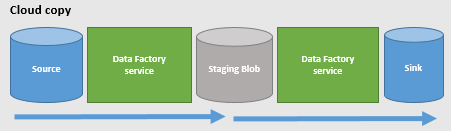
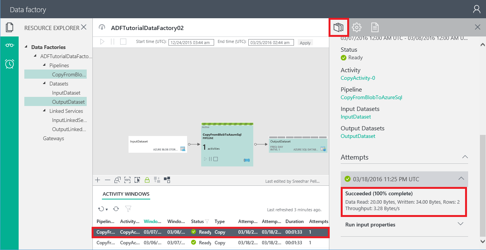
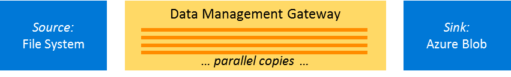
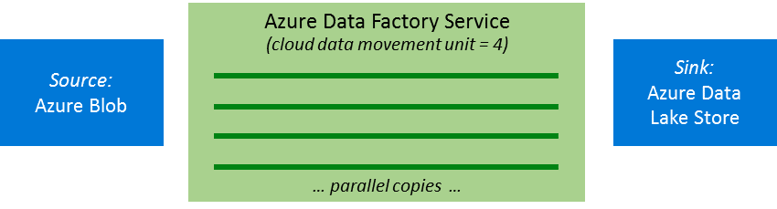

<properties
    pageTitle="Copiare le prestazioni di attività e Guida all'ottimizzazione | Microsoft Azure"
    description="Informazioni sulle principali fattori che influenzano le prestazioni di spostamento dei dati di Azure Data Factory quando si utilizza Copia attività."
    services="data-factory"
    documentationCenter=""
    authors="linda33wj"
    manager="jhubbard"
    editor="monicar"/>

<tags
    ms.service="data-factory"
    ms.workload="data-services"
    ms.tgt_pltfrm="na"
    ms.devlang="na"
    ms.topic="article"
    ms.date="10/25/2016"
    ms.author="jingwang"/>

# Copiare le prestazioni di attività e Guida all'ottimizzazione
Azure dati Factory Copia attività offre un oggetto dati sicure, affidabile e prestazioni elevate caricare soluzione. Consente di copiare decine di terabyte di dati quotidianamente tra una vasta gamma di cloud e archivi dati locali. Dati veloci eccezionali prestazioni di caricamento sono fondamentale per garantire consente di tracciare il problema di "dati" di base: creazione di soluzioni analitica avanzate e ottenere informazioni approfondite complete da tutti i dati.

Azure fornisce un set di livello aziendale soluzioni warehouse dati e lo spazio di archiviazione dei dati e attività Copia offre un caricamento esperienza facile da configurare e impostare i dati altamente ottimizzati. Con solo un'attività di copia singola, è possibile ottenere:

- Caricamento dei dati nei **Dati di SQL Azure Warehouse** **1,2 GB/s**
- Caricamento di dati in **archiviazione Blob Azure** **1.0 GB/s**
- Caricamento di dati in **Archivio Lake dati di Azure** **1.0 GB/s**

Questo articolo vengono illustrati:

- Memorizza [numeri di riferimento delle prestazioni](#performance-reference) per origine supportate e sink dati per la pianificazione del progetto.
- Caratteristiche che consente di migliorare la velocità di copia in scenari diversi, tra cui [copia parallela](#parallel-copy), [unità di spostamento dei dati cloud](#cloud-data-movement-units)e [in più fasi copia](#staged-copy);
- [Indicazioni di ottimizzazione delle prestazioni](#performance-tuning-steps) ottimizzare le prestazioni e fattori che possono influire sulle prestazioni di copia.

> [AZURE.NOTE] Se non si ha familiarità con attività di copia in generale, vedere [spostare i dati usando Copia attività](data-factory-data-movement-activities.md) prima di leggere questo articolo.

## Guida di riferimento delle prestazioni

> [AZURE.NOTE] È possibile ottenere maggiore produttività sfruttando più unità di spostamento dei dati (DMUs) da quello predefinito DMUs massimo, ossia 8 per eseguire un'attività di copia cloud nel cloud. Ad esempio, con 100 DMUs, è possibile copiare dati da Blob Azure all'archivio Lake dati di Azure pari a 1 GB al secondo. Per informazioni dettagliate su questa caratteristica, vedere [unità di spostamento dei dati Cloud](#cloud-data-movement-units) . Contattare il [supporto di Azure](https://azure.microsoft.com/support/) per richiedere ulteriori DMUs.

Punti da tenere presente:

- Produttività viene calcolata utilizzando la formula seguente: [dimensioni dei dati letti dall'origine] / [attività Copia Durata esecuzione].
- I numeri di riferimento delle prestazioni descritti nella tabella sono stati misurati usando [TPC-H](http://www.tpc.org/tpch/) set di dati in un'attività di copia singola esecuzione.
- Per copiare tra archivi dati cloud, impostare **cloudDataMovementUnits** a 1 e 4 (o 8) per il confronto. **parallelCopies** non è specificato. Per ulteriori informazioni su queste funzionalità, vedere [Copia in parallelo](#parallel-copy) .
- In archivi dati Azure, di origine e sink sono presenti nell'area di Azure stesso.
- Per la distribuzione ibrida (locali al cloud o cloud in locale) spostamento dei dati, una singola istanza del gateway era in esecuzione in un computer in cui è stato separato dall'archivio dati locale. La configurazione viene elencata nella tabella seguente. Durante l'esecuzione di una singola attività sul gateway, l'operazione di copia utilizzato solo una piccola parte della CPU del computer di prova, memoria o della larghezza di banda di rete.
    <table>
    <tr>
        <td>CPU</td>
        <td>32 Core 2.20 v2 GHz Intel Xeon E5-2660</td>
    </tr>
    <tr>
        <td>Memoria</td>
        <td>128 GB</td>
    </tr>
    <tr>
        <td>Rete</td>
        <td>Interfaccia Internet: 10 GB/s; interfaccia Intranet: 40 GB/s</td>
    </tr>
    </table>

## Copia in parallelo
È possibile leggere i dati dal sito di origine o scrivere dati di destinazione **in parallelo all'interno di un'attività di copia eseguire**. Questa caratteristica consente di migliorare la velocità di un'operazione di copia e riduce il tempo che necessario per spostare i dati.

Questa impostazione è diversa dalla proprietà **concorrenza** nella definizione dell'attività. La proprietà **concorrenza** determina il numero di **che attività Copia simultanea viene eseguita** per elaborare i dati da windows attività diverso (1 AM a 2 AM, 2 AM 3 AM, 3 AM a 4 AM e così via). Questa funzionalità è utile quando si esegue un carico cronologico. La funzionalità copia parallela si applica a una **singola attività eseguire**.

Diamo un'occhiata uno scenario di esempio. Nell'esempio seguente, è necessario essere elaborati più sezioni degli ultimi. Dati Factory esegue un'istanza di copia attività (Esegui un'attività) per ogni sezione:

- La sezione di dati dalla finestra prima attività (1 AM per AM 2) = = > attività eseguita 1
- La sezione di dati nella finestra di attività seconda (AM 2 per 3 AM) = = > attività eseguita 2
- La sezione di dati nella finestra di attività seconda (AM 3 a 4 AM) = = > attività eseguita 3

E così via.

In questo esempio, quando il valore di **concorrenza** è impostato su 2, **1 di eseguire attività** e **attività 2** copiare dati da due attività windows **contemporaneamente** per migliorare le prestazioni di spostamento dei dati. Tuttavia, se più file sono associati a attività eseguire 1, il servizio di spostamento dei dati copiati dal sito di origine del file di destinazione una alla volta.

### parallelCopies
La proprietà **parallelCopies** per indicare il parallelismo che si desidera copiare attività da utilizzare. È possibile pensare di questa proprietà come il numero massimo di thread all'interno di attività di copia che è possibile leggere dall'origine o scrivere gli archivi dati sink in parallelo.

Per ogni attività Copia eseguire, Data Factory determina il numero di copie in parallelo da utilizzare per copiare i dati dall'origine dati, archiviare e memorizzare i dati di destinazione. Il numero predefinito di copie in parallelo che viene utilizzato dipende dal tipo di origine e sink che si sta utilizzando.  

Origine e sink |   Numero di copie in parallelo predefinita varia a seconda del servizio
------------- | -------------------------------------------------
Copiare i dati tra gli archivi basati su file (archiviazione Blob; Archivio Lake dati; Amazon S3; un file system locale. un HDFS locale) | Compreso tra 1 e 32. Dipende dalle dimensioni dei file e il numero di unità di spostamento dei dati cloud (DMUs) utilizzata per copiare i dati tra due archivi dati cloud o la configurazione fisica del computer Gateway utilizzata per ottenere una copia di ibrido (per copiare i dati in o da un archivio di dati in locale).
Copiare i dati da **archiviare i dati di origine all'archivio tabelle Azure** | 4
Tutte le altre coppie di origine e sink | 1

In genere, il comportamento predefinito deve fornire le migliori prestazioni. Tuttavia, per controllare il carico sul computer che ospitano i dati vengono memorizzati o per ottimizzare le prestazioni di copia, è possibile scegliere di ignorare il valore predefinito e specificare un valore per la proprietà **parallelCopies** . Il valore deve essere compreso tra 1 e 32 (inclusi). In fase di esecuzione per ottenere prestazioni ottimali, attività copia utilizza un valore minore o uguale al valore impostate.

    "activities":[  
        {
            "name": "Sample copy activity",
            "description": "",
            "type": "Copy",
            "inputs": [{ "name": "InputDataset" }],
            "outputs": [{ "name": "OutputDataset" }],
            "typeProperties": {
                "source": {
                    "type": "BlobSource",
                },
                "sink": {
                    "type": "AzureDataLakeStoreSink"
                },
                "parallelCopies": 8
            }
        }
    ]

Punti da tenere presente:

- Quando si copiano dati tra gli archivi basati su file, parallelismo accade livello del file. Non esiste alcun suddivisione in blocchi in un singolo file. Il numero effettivo di copie in parallelo il servizio di spostamento dei dati viene utilizzata per copiare il file in fase di esecuzione non è superiore al numero di file. Se il comportamento di copia è **mergeFile**, attività di copia non è possibile trarre vantaggio dal parallelismo.
- Quando si specifica un valore per la proprietà **parallelCopies** , valutare la possibilità di aumento del carico in archivi di dati di origine e sink e al gateway se si tratta di una copia di ibrida. Si verifica questo evento soprattutto quando si dispone di più attività o le esecuzioni simultanee delle stesse attività eseguite allo stesso archivio di dati. Se si nota che con il carico è sovraccarico di archivio dati o Gateway, diminuire il valore di **parallelCopies** per ridurre il carico.
- Quando si copiano dati da archivi che non sono basate su file per archivi che sono basate su file, il servizio di spostamento dei dati ignora la proprietà **parallelCopies** . Anche se parallelismo viene specificato, non viene applicata in questo caso.

> [AZURE.NOTE] Usare la caratteristica **parallelCopies** quando si esegue una copia di ibrida, è necessario usare Gateway di gestione dati 1,11 o versione successiva.

### Unità di spostamento dei dati cloud
Un' **unità di spostamento dei dati cloud (DMU)** è una misura che rappresenta la potenza (una combinazione di CPU e memoria assegnazione delle risorse di rete) di una singola unità Factory dati. Una DMU potrebbe essere utilizzata in un'operazione di copia cloud nel cloud, ma non in una copia di ibrida.

Per impostazione predefinita, per eseguire una singola attività Copia eseguire Factory dati utilizza un singolo cloud DMU. Per ignorare questa impostazione predefinita, specificare un valore per la proprietà **cloudDataMovementUnits** come indicato di seguito. Per informazioni sul livello di miglioramento delle prestazioni potrebbe essere visualizzato quando si configura più unità per un'origine di copia specifica e sink, vedere la [Guida di riferimento delle prestazioni](#performance-reference).

    "activities":[  
        {
            "name": "Sample copy activity",
            "description": "",
            "type": "Copy",
            "inputs": [{ "name": "InputDataset" }],
            "outputs": [{ "name": "OutputDataset" }],
            "typeProperties": {
                "source": {
                    "type": "BlobSource",
                },
                "sink": {
                    "type": "AzureDataLakeStoreSink"
                },
                "cloudDataMovementUnits": 4
            }
        }
    ]

I **valori consentiti** per la proprietà **cloudDataMovementUnits** sono 1 (impostazione predefinita), 2, 4 e 8. Il **numero effettivo di cloud DMUs** che utilizza l'operazione di copia in fase di esecuzione è uguale o minore rispetto al valore configurato, a seconda del modello di dati. 

> [AZURE.NOTE] Se è necessaria più cloud DMUs per una maggiore produttività, contattare il [supporto di Azure](https://azure.microsoft.com/support/). Impostazione di 8 e versioni successive è attualmente compatibile con solo quando si copiano più file dallo spazio di archiviazione Blob a archiviazione Blob, archivio Lake dati o il Database di SQL Azure, e le dimensioni del file sono maggiore o uguale a 16 MB singolarmente.

Per utilizzare al meglio queste due proprietà e per migliorare la velocità di spostamento dei dati, vedere l' [esempio use case](#case-study-use-parallel-copy). Non è necessario configurare **parallelCopies** per sfruttare il comportamento predefinito. Se si configura e **parallelCopies** è troppo piccolo, potrebbe non utilizzare completamente cloud più DMUs.  

È **importante** ricordare che vengano addebitati in base al tempo totale dell'operazione di copia. Se un processo di copia utilizzato per richiedere un'ora con unità di un'area e accetta ora 15 minuti con quattro unità cloud, fattura complessiva rimane quasi lo stesso. Ad esempio si utilizza quattro unità cloud. La prima unità cloud trascorre 10 minuti, secondo, esecuzione 10 minuti, la terza, 5 minuti e il quarto, 5 minuti, in un'attività di copia. Addebitate per il tempo totale copia (spostamento dei dati), 10 + 10 + 5 + 5 = 30 minuti. Uso **parallelCopies** non influisce sulla fatturazione.

## Copia a fasi
Quando si copiano dati da un archivio di dati di origine in un archivio di dati sink, è possibile utilizzare lo spazio di archiviazione Blob come un archivio di gestione temporaneo provvisorio. Gestione temporanea è particolarmente utile nei casi seguenti:

1.  **Si desidera acquisire dati da diversi archivi di dati in SQL Data Warehouse tramite PolyBase**. SQL Data Warehouse utilizza PolyBase come meccanismo ad alta velocità per caricare una grande quantità di dati nell'archivio di dati SQL. Tuttavia, i dati di origine devono essere in archiviazione Blob e deve soddisfare ulteriori criteri. Quando si caricano i dati da un archivio di dati diversi da archiviazione Blob, è possibile attivare dati copia tramite provvisorio archiviazione Blob gestione temporanea. In questo caso, Data Factory esegue le trasformazioni di dati necessari per assicurarsi che siano soddisfatti i requisiti di PolyBase. Utilizza quindi PolyBase per caricare dati nell'archivio di dati SQL. Per ulteriori informazioni, vedere [Utilizzare PolyBase per caricare i dati nell'archivio di dati di SQL Azure](data-factory-azure-sql-data-warehouse-connector.md#use-polybase-to-load-data-into-azure-sql-data-warehouse).
2.  **Talvolta richiedere un po' di tempo per eseguire un movimento di dati ibrido (ovvero, copiare tra un dati locali archivio e dati cloud dell'archivio) tramite una connessione di rete lenta**. Per migliorare le prestazioni, è possibile comprimere i dati locali in modo che meno tempo per spostare i dati all'archivio di dati di gestione temporanea nel cloud. È quindi possibile decomprimere i dati nell'archivio di gestione temporanea prima di caricare nell'archivio di dati di destinazione.
3.  **Non si vuole aprire porte diversa da quella porte 80 e 443 nel firewall, a causa di criteri IT aziendali**. Ad esempio, quando si copiano dati da un archivio di dati in locale a un sink di Database SQL Azure o una Data Warehouse di SQL Azure, è necessario attivare le comunicazioni in uscita TCP sulla porta 1433 per Windows firewall e un firewall aziendale. In questo scenario, sfruttare il gateway alla prima copiare i dati in un'istanza di gestione temporanea dello spazio di archiviazione Blob tramite HTTP o HTTPS sulla porta 443. Quindi caricare i dati in Database SQL o SQL Data Warehouse di gestione temporanea dello spazio di archiviazione Blob. In questo flusso non è necessario abilitare la porta 1433.

### Copia funzioni come a fasi
Quando si attiva la caratteristica di gestione temporanea, prima di tutto i dati vengono copiati dall'archivio di dati di origine all'archivio di dati di gestione temporanea (porta personalizzato). Successivamente, i dati vengono copiati dall'archivio di dati di gestione temporanea all'archivio dati sink. Dati Factory gestisce automaticamente il flusso di due fasi dell'utente. Dati Factory pulisce anche temporanei dati presenti nell'archivio di gestione temporanea dopo lo spostamento dei dati è stato completo.

In caso di copia di cloud (dati di origine e sink archivi sono nel cloud), gateway non viene usata. Il servizio Factory dati esegue le operazioni di copia.

Nello scenario ibrido copia (origine locale mentre sink nel cloud), il gateway consente di spostare dati dall'archivio di dati di origine in un archivio di dati di gestione temporanea. Servizio Factory dati sposta i dati dall'archivio di dati di gestione temporanea all'archivio dati sink. Copia di dati da un archivio di dati cloud in un archivio di dati locale mediante gestione temporanea è supportata anche con il flusso inverso.

Quando si attiva lo spostamento dei dati utilizzando un archivio di gestione temporaneo, è possibile specificare se si desidera che i dati da comprimere prima di spostare dati dall'archivio di dati di origine in un archivio dati provvisorio o gestione temporanea e quindi decompressi prima di spostare dati da un provvisori o archivio di dati all'archivio dati sink di gestione temporanea.

Al momento non è possibile copiare dati tra due archivi di dati locale mediante un archivio di gestione temporaneo. Si prevede che questa opzione sia disponibile a breve.

### Configurazione
Configurare l'impostazione **enableStaging** nell'attività di copia per specificare se visualizzare i dati da gestire temporaneamente in archiviazione Blob prima di caricare in un archivio di dati di destinazione. Quando si imposta **enableStaging** su TRUE, specificare le proprietà aggiuntive elencate nella tabella seguente. Se non si dispone di uno, è necessario creare un'archiviazione Azure o lo spazio di archiviazione condiviso access collegato firma servizio per la gestione temporanea.

Proprietà | Descrizione | Valore predefinito | Obbligatorio
--------- | ----------- | ------------ | --------
**enableStaging** | Specificare se si desidera copiare i dati tramite un provvisori archivio di gestione temporanea. | FALSO | No
**linkedServiceName** | Specificare il nome di un [AzureStorage](data-factory-azure-blob-connector.md#azure-storage-linked-service) o [AzureStorageSas](data-factory-azure-blob-connector.md#azure-storage-sas-linked-service) servizio collegato, che fa riferimento all'istanza di spazio di archiviazione che si è utilizzata come archivio di gestione temporaneo provvisorio.    È possibile utilizzare lo spazio di archiviazione con una firma di accesso condiviso per caricare i dati in SQL Data Warehouse tramite PolyBase. È possibile usarlo in tutti gli altri scenari. | N/D | Sì, quando **enableStaging** è impostato su TRUE
**percorso** | Specificare il percorso di archiviazione Blob che si desidera inserire i dati a fasi. Se non si specifica un percorso, il servizio crea un contenitore per memorizzare dati temporanei.    Specificare un percorso solo se si usa lo spazio di archiviazione con una firma di accesso condiviso o si richiede temporanea dei dati in una posizione specifica. | N/D | No
**enableCompression** | Specifica se devono essere compresso dati da copiare alla destinazione. Questa impostazione consente di ridurre il volume di dati da trasferire. | FALSO | No

Ecco un esempio della definizione attività copia con le proprietà che sono descritti nella tabella precedente:

    "activities":[  
    {
        "name": "Sample copy activity",
        "type": "Copy",
        "inputs": [{ "name": "OnpremisesSQLServerInput" }],
        "outputs": [{ "name": "AzureSQLDBOutput" }],
        "typeProperties": {
            "source": {
                "type": "SqlSource",
            },
            "sink": {
                "type": "SqlSink"
            },
            "enableStaging": true,
            "stagingSettings": {
                "linkedServiceName": "MyStagingBlob",
                "path": "stagingcontainer/path",
                "enableCompression": true
            }
        }
    }
    ]

### Impatto di fatturazione
Addebitate in base a due passaggi: copiare durata e tipo. 

- Quando si utilizza di gestione temporanea durante una copia di cloud (copia di dati da un archivio di dati cloud in un altro archivio di dati cloud), addebitate [somma della durata di copia per i passaggi 1 e 2] x [prezzo unitario di copia cloud].
- Quando si utilizza di gestione temporanea durante una copia di ibrido (copia i dati da un archivio di dati in locale in un archivio di dati cloud), addebitate per [duration copia ibrido] x [prezzo unitario di copia ibrido] + [cloud copia durata] x [prezzo unitario di copia cloud].

## Procedura di ottimizzazione delle prestazioni
Si consiglia di eseguire questa procedura per ottimizzare le prestazioni del servizio dati Factory con copia attività:

1.  **Creare una previsione**. Durante la fase di sviluppo, verificare la pipeline utilizzando Copia attività rispetto a un campione di dati representative. È possibile utilizzare i dati Factory [sezionare modello](data-factory-scheduling-and-execution.md#time-series-datasets-and-data-slices) per limitare la quantità di dati di che cui si collabora.

    Raccogliere il tempo di esecuzione e prestazioni utilizzando il **monitoraggio e gestione delle App**. Scegliere **Monitor e Gestisci** nella home page Factory dati. Nella visualizzazione struttura, scegliere il **set di dati di output**. Nell'elenco **Attività di Windows** , scegliere l'attività Copia eseguire. Elenchi di **Windows di attività** della durata di attività di copia e le dimensioni dei dati che vengono copiate. La velocità viene elencata in **Esplora risorse attività**. Per ulteriori informazioni sull'app, vedere [monitorare e gestire pipeline di Azure Data Factory utilizzando il monitoraggio e gestione App](data-factory-monitor-manage-app.md).

    

    Avanti in questo articolo, è possibile confrontare le prestazioni e la configurazione del proprio scenario alla copia dell'attività [di riferimento delle prestazioni](#performance-reference) dai test.
2. **Diagnosi e ottimizzare le prestazioni**. Se le prestazioni che osservano non soddisfano le aspettative, è necessario identificare i problemi di prestazioni. Quindi, ottimizzare le prestazioni per rimuovere o ridurre l'effetto di bottiglia. Una descrizione completa di diagnostica delle prestazioni non rientra nell'ambito di questo articolo, ma Ecco alcune considerazioni comuni:
    - Caratteristiche delle prestazioni:
        - [Copia in parallelo](#parallel-copy)
        - [Unità di spostamento dei dati cloud](#cloud-data-movement-units)
        - [Copia a fasi](#staged-copy)   
    - [Origine](#considerations-for-the-source)
    - [Elaborare](#considerations-for-the-sink)
    - [Serializzazione e deserializzazione](#considerations-for-serialization-and-deserialization)
    - [Compressione](#considerations-for-compression)
    - [Mapping di colonna](#considerations-for-column-mapping)
    - [Gateway di gestione dati](#considerations-for-data-management-gateway)
    - [Altre considerazioni](#other-considerations)

3. **Espandi la configurazione per l'intero set di dati**. Quando si è soddisfatti i risultati dell'esecuzione e le prestazioni, è possibile espandere la definizione e periodo attivo pipeline per coprire l'intero set di dati.

## Considerazioni per l'origine
### Generale
Assicurarsi che l'archivio dati non è sovraccarico da altri carichi di lavoro che eseguono o sulla base di essa. 

Per gli archivi dati di Microsoft, vedere [monitoraggio e ottimizzazione argomenti](#performance-reference) specifici di archivi dati e consente di comprendere dati memorizzare le caratteristiche di prestazioni, ridurre i tempi di risposta e ottimizzare la velocità di trasmissione.

Se si copiano dati dallo spazio di archiviazione Blob SQL Data warehouse, è preferibile **PolyBase** per migliorare le prestazioni. Per informazioni dettagliate, vedere [Utilizzare PolyBase per caricare i dati nell'archivio di dati di SQL Azure](data-factory-azure-sql-data-warehouse-connector.md###use-polybase-to-load-data-into-azure-sql-data-warehouse) .

### Archivi dati basate su file
*(Include lo spazio di archiviazione Blob, archivio Lake dati, Amazon S3, sistemi file locale e HDFS locale)*

- **Dimensioni del file Media e numero di file**: copia attività esegue il trasferimento file di dati di uno alla volta. Con la stessa quantità di dati da spostare, la velocità complessiva è inferiore se i dati è costituita da molti file small invece di alcuni file di grandi dimensioni per la fase di avvio per ogni file. Pertanto, se possibile, combinare i file di dimensioni ridotte in file di dimensioni maggiori di ottenere maggiore produttività.
- **Compressione e il formato di file**: per visualizzare altri modi migliorare le prestazioni, vedere le sezioni [Considerazioni serializzazione e deserializzazione](#considerations-for-serialization-and-deserialization) e [Considerazioni per la compressione](#considerations-for-compression) .
- Per lo scenario **locale file system** , in cui **Gateway di gestione dati** è necessaria, vedere la sezione [Considerazioni Gateway di gestione dati](#considerations-for-data-management-gateway) .

### Archivi dati relazionali
*(Include Database SQL. SQL Data Warehouse; Amazon Redshift; Database di SQL Server. e Oracle database MySQL, DB2, Teradata, Sybase e PostgreSQL e così via).*

- **Modello di dati**: dello schema della tabella viene applicata a velocità di copia. Una dimensione di riga di grandi dimensioni offre prestazioni migliori rispetto alle dimensioni riga small, copiare la stessa quantità di dati. Il motivo è che il database in modo più efficiente possibile recuperare batch meno di dati che contengono un numero minore di righe.
- **Query o stored procedure**: ottimizzare la logica della query o stored procedure specificata nell'origine copia attività per recuperare i dati in modo più efficiente.
- Per il **database relazionali locale**, ad esempio SQL Server e Oracle, che richiedono l'utilizzo del **Gateway di gestione dati**, vedere la sezione [Considerazioni Gateway di gestione dati](#considerations-on-data-management-gateway) .

## Considerazioni per il sink

### Generale
Assicurarsi che l'archivio dati non è sovraccarico da altri carichi di lavoro che eseguono o sulla base di essa. 

Per gli archivi dati di Microsoft, fare riferimento all' [monitoraggio e ottimizzazione argomenti](#performance-reference) specifici di archivi dati. Questi argomenti consentono di comprendere le caratteristiche di prestazioni archivio di dati e su come ridurre i tempi di risposta e ottimizzare la velocità di trasmissione.

Se si siano copiando dati **archiviazione Blob** **SQL Data**warehouse, è preferibile **PolyBase** per migliorare le prestazioni. Per informazioni dettagliate, vedere [Utilizzare PolyBase per caricare i dati nell'archivio di dati di SQL Azure](data-factory-azure-sql-data-warehouse-connector.md###use-polybase-to-load-data-into-azure-sql-data-warehouse) .

### Archivi dati basate su file
*(Include lo spazio di archiviazione Blob, archivio Lake dati, Amazon S3, sistemi file locale e HDFS locale)*

- **Funzionamento in copia**: se si copiano dati da un archivio di dati diversi basata su file, Copia attività sono disponibili tre opzioni tramite la proprietà **copyBehavior** . Consente di mantenere gerarchia, semplifica gerarchia o unisce i file. Unione di file consente prestazioni ingrandire le dimensioni, ma mantenendo o la conversione della gerarchia sono senza alcuna riduzione delle prestazioni.
- **Compressione e il formato di file**: vedere le sezioni [Considerazioni serializzazione e deserializzazione](#considerations-for-serialization-and-deserialization) e [Considerazioni per la compressione](#considerations-for-compression) per visualizzare altri modi migliorare le prestazioni.
- **Archiviazione BLOB**: attualmente non supporta lo spazio di archiviazione Blob blocca solo BLOB per il trasferimento di dati ottimizzato e la velocità effettiva.
- Per scenari **locale file System** che richiedono l'uso di **Gateway di gestione dati**, vedere la sezione [Considerazioni Gateway di gestione dati](#considerations-for-data-management-gateway) .

### Archivi dati relazionali
*(Include Database SQL, SQL Data Warehouse, database di SQL Server e database Oracle)*

- **Funzionamento in copia**: in base alle proprietà impostate per **sqlSink**, Copia attività scrive i dati nel database di destinazione in modi diversi.
    - Per impostazione predefinita, data movimento servizio utilizza l'API di copia in blocco per inserire i dati in aggiunta, che fornisce le massime prestazioni.
    - Se si configura una stored procedure in sink, il database si applica l'una riga di dati in un momento anziché come il caricamento di massa. Prestazioni Elimina in modo significativo. Se il set di dati è grande, se applicabile, portarsi utilizzando la proprietà **sqlWriterCleanupScript** .
    - Se si configura la proprietà **sqlWriterCleanupScript** per ogni attività Copia eseguire, il servizio attiva lo script e quindi si utilizza l'API di copia in blocco per inserire i dati. Per sovrascrivere l'intera tabella con i dati più recenti, ad esempio, è possibile specificare uno script per il caricamento tenendo premuto il tasto in blocco i nuovi dati dal sito di origine prima di eliminare tutti i record.
- **Dimensioni del modello e batch dati**:
    - Dello schema della tabella viene applicata a velocità di copia. Per copiare la stessa quantità di dati, una dimensione di riga di grandi dimensioni offre prestazioni migliori rispetto a una dimensione piccola riga perché il database in modo più efficiente eseguire il commit batch meno di dati.
    - Attività di copia consente di inserire dati in una serie di batch. È possibile impostare il numero di righe in un batch utilizzando la proprietà **writeBatchSize** . Se i dati includono righe piccole, è possibile impostare la proprietà **writeBatchSize** con un valore superiore a trarre vantaggio da sovraccarico batch inferiore e superiore effettiva. Se le dimensioni della riga di dati di grandi dimensioni, prestare attenzione quando si aumenta il **writeBatchSize**. Un valore elevato potrebbe causare degli errori copia dovuti overload il database.
- Per **i database relazionali locale** , ad esempio SQL Server e Oracle, che richiedono l'uso di **Gateway di gestione dati**, vedere la sezione [Considerazioni Gateway di gestione dati](#considerations-for-data-management-gateway) .

### Archivi NoSQL
*(Include lo spazio di archiviazione di tabella e Azure DocumentDB)*

- Per l' **archiviazione tabella**:
    - **Partizione**: scrivere dati partizioni interfoliazione notevolmente riduce le prestazioni. Ordinare i dati di origine da chiave di partizione in modo che i dati vengono inseriti in modo efficiente in una partizione dopo l'altro oppure modificare la logica per scrivere i dati in una singola partizione.
- Per **DocumentDB**:
    - **Le dimensioni del batch**: la proprietà **writeBatchSize** imposta il numero di richieste parallele al servizio DocumentDB per creare documenti. È possibile prevedere migliorare le prestazioni quando si aumenta **writeBatchSize** quanto più richieste parallele vengono inviate a DocumentDB. Tuttavia, prestare attenzione ai limitazione quando si scrivono DocumentDB (il messaggio di errore è "Richiesta tasso di grandi dimensioni"). Vari fattori possono causare la limitazione, inclusi dimensioni del documento, il numero di termini in documenti e criterio di indicizzazione della raccolta di destinazione. Per ottenere una maggiore produttività copia, è possibile utilizzare una raccolta migliore, ad esempio S3.

## Considerazioni per la serializzazione e deserializzazione
Serializzazione e deserializzazione può verificarsi quando il set di dati di input o il set di dati di output è un file. Attività di copia supporta al momento, Avro e il testo (ad esempio, CSV e TSV) i formati di dati.

**Funzionamento in copia**:

-   Copia di file tra archivi basata su file di dati:
    - Quando input e di output set di dati sia aperta la stessa o nessuna impostazione formato di file, il servizio di spostamento dei dati, viene eseguita una copia binaria senza serializzazione o deserializzazione. Viene visualizzato una velocità maggiore rispetto allo scenario in cui le impostazioni di formattazione di un file di origine e sink sono diverse tra loro.
    - Quando di input e output set di dati sia sono in formato testo e solo la codifica tipo è diverso, il servizio di spostamento dei dati funziona solo conversione della codifica. Non è qualsiasi serializzazione e deserializzazione, che determina le prestazioni del sovraccarico rispetto a una copia binaria.
    - Quando input e di output set di dati sia aperta diversi formati di file o configurazioni diverse, ad esempio delimitatori, il servizio di spostamento dei dati deserializza dati di origine per trasmettere, trasformazione e quindi serializzare nel formato di output che è indicata. Questa operazione comporta molto più le prestazioni del sovraccarico rispetto agli altri scenari.
- Quando si copiano file da/verso un archivio di dati che non è basata su file (ad esempio, da un archivio basata su file da un archivio relazionale), è necessario il passaggio serializzazione o deserializzazione. Questo passaggio genera riduzione significativa delle prestazioni.

**Formato di file**: il formato di file selezionato potrebbe influire sulle prestazioni di copia. Ad esempio Avro è un formato binario compatto che archivia i metadati con i dati. Ha un ampio supporto ecosistema Hadoop per l'elaborazione e la ricerca. Tuttavia, Avro costo è maggiore della serializzazione e deserializzazione, creando così alta copia rispetto al formato di testo. Verificare la scelta del formato di file in tutto il flusso di elaborazione modo globale. Iniziare a usare in quale forma i dati verrà archiviati in archivi di dati di origine o da estrarre da sistemi esterni; il formato migliore per eseguire operazioni di archiviazione, elaborazione analitica e query; e in quale formato di esportazione dei dati in data mart per gli strumenti dei report e visualizzazione. Può succedere che un formato di file non ottimale per leggere e le prestazioni di scrittura potrebbero non essere un'ottima scelta quando si considera il processo complessivo analitico.

## Considerazioni per la compressione
Quando il set di dati di input o di output è un file, è possibile impostare Copia attività da eseguire la compressione o decompressione durante la scrittura dei dati alla destinazione. Quando si sceglie la compressione, si crea un compromesso tra input/output (i) e CPU. Comprimere i costi di dati aggiuntivi in risorse di elaborazione. Ma, riduce i/o di rete e lo spazio di archiviazione. In base ai dati, è possibile riscontrare un aumento della velocità di esecuzione complessivo di copia.

**Codec**: copia attività supporta gzip, bzip2 e tipi di compressione Deflate. Azure HDInsight possono utilizzare i tre tipi per l'elaborazione. Ogni codec di compressione presenta alcuni vantaggi. Ad esempio, bzip2 sono la velocità di copia più bassa, ma si riceve le massime prestazioni di query Hive con bzip2 perché è possibile dividerla per l'elaborazione. Gzip è l'opzione più bilanciato e viene usato più di frequente. Scegliere il codec che meglio si adatta proprio scenario-to-end.

**Livello**: È possibile scegliere tra due opzioni per ogni codec di compressione: più velocemente compresso e compressi in modo ottimale. L'opzione più velocemente compresso comprime i dati più presto, anche se il file risultante non è compresso in modo ottimale. L'opzione ottimale compresso trascorre più tempo sulla compressione e restituisce una quantità minima di dati. È possibile testare entrambe le opzioni per visualizzare che consente di migliorare le prestazioni complessive nelle maiuscole/minuscole.

**Considerazione A**: per copiare una grande quantità di dati tra un archivio locale e nel cloud, si consiglia di utilizzare archiviazione blob provvisorio con la compressione. Utilizzo dello spazio di archiviazione intermedia risulta utile quando la larghezza di banda della rete aziendale e i servizi Azure è il fattore di limitazione e si desidera che il set di dati di input e set di dati di output entrambi siano in formato non compresso. In particolare, è possibile suddividere un'attività unica copia in attività di due copia. La prima attività Copia Copia dal sito di origine in un blob provvisorio o gestione temporaneo in formato compresso. La seconda attività Copia consente di copiare i dati compressi di gestione temporanea e quindi decompresso durante la scrittura per il sink.

## Considerazioni per la corrispondenza di colonna
È possibile impostare la proprietà **columnMappings** attività Copia mappa tutti o un sottoinsieme di colonne di input per le colonne di output. Dopo il servizio di spostamento dei dati legge i dati dal sito di origine, è necessario eseguire il mapping di colonna sui dati prima che i dati vengono scritti al sink. Questo ulteriore elaborazione riduce la velocità effettiva copia.

Se memorizzare i dati di origine è query, ad esempio, se è un archivio relazionale come Database SQL o SQL Server o se si tratta di un punto vendita NoSQL come archivio tabelle o DocumentDB, prendere in considerazione inserendo i filtri di colonna e ridisposizione logica alla proprietà **query** invece di usare il mapping di colonna. In questo modo la proiezione si verifica mentre il servizio di spostamento dei dati legge i dati dall'archivio di dati di origine, in cui è molto più efficiente.

## Considerazioni per Gateway di gestione dati
Per ulteriori suggerimenti configurazione di Gateway, vedere [Considerazioni per l'utilizzo di Gateway di gestione dati](data-factory-move-data-between-onprem-and-cloud.md#Considerations-for-using-Data-Management-Gateway).

**Ambiente di computer gateway**: È consigliabile utilizzare un computer dedicato all'host Gateway di gestione dati. Uso degli strumenti, ad esempio PerfMon per esaminare l'utilizzo della CPU e memoria della larghezza di banda durante un'operazione di copia nel computer Gateway. Passare a un computer più potente se CPU, memoria o della larghezza di banda di rete diventa un bottiglia.

**Esecuzione di attività Copia simultanea**: una sola istanza di Gateway di gestione dati può essere utilizzato più esecuzioni Copia attività nello stesso momento o contemporaneamente. Il numero massimo di processi simultanei viene calcolato in base alla configurazione hardware del computer Gateway. Processi di copia aggiuntive vengono accodati fino a quando non si viene recuperate dal Gateway o finché un altro processo timeout. Per impedire un conflitto di risorse del computer Gateway, fase di pianificazione attività Copia per ridurre il numero di processi di copia nella coda alla volta o valutare la possibilità di divisione di carico in più computer Gateway.

## Altre considerazioni
Se le dimensioni dei dati da copiare sono grande, è possibile modificare la regola di business in partizione ulteriormente i dati utilizzando il meccanismo porzionamento in Data Factory. Pianificare il tempo di attività di copia venga eseguito più frequentemente per ridurre le dimensioni di dati per ogni attività Copia eseguire.

Prestare attenzione il numero di set di dati e copiare le attività che richiedono dati Factory connettore allo stesso archivio dati nello stesso momento. Molti processi di copia simultanee potrebbero rallentare un archivio di dati e contribuire alla riduzione delle prestazioni, tentativi interno il processo di copia e in alcuni casi, errori di esecuzione.

## Esempio di scenario: copia da un Server SQL locale a archiviazione Blob
**Scenario**: una pipeline integrata per copiare i dati da un Server SQL locale a archiviazione Blob in formato CSV. Per rendere più rapidamente il processo di copia, i file CSV devono essere compresso in formato bzip2.

**Test e analisi**: la velocità dell'attività di copia è inferiore a 2 MBps, che è molto più lento del benchmark delle prestazioni.

**Analisi delle prestazioni e ottimizzazione**: per risolvere il problema di prestazioni, osservare la modalità di elaborazione e spostati i dati.

1.  **Lettura dati**: Gateway apre una connessione a SQL Server e invia la query. SQL Server risponde inviando il flusso di dati al Gateway tramite la rete intranet.
2.  **Dati Serialize e Comprimi**: Gateway serializza il flusso di dati in formato CSV e comprime i dati in un flusso di bzip2.
3.  **Scrivere i dati**: il Gateway carica i flusso bzip2 a archiviazione Blob tramite Internet.

Come si può notare, i dati verranno elaborati e spostati in modo flusso sequenziale: SQL Server > LAN > Gateway > WAN > nell'archiviazione Blob. **Le prestazioni complessive viene gestita dalla produttività minima attraverso la pipeline**.

Uno o più dei seguenti fattori potrebbe causare la riduzione delle prestazioni:

-   **Origine**: SQL Server è bassa velocità effettiva a causa di sovraccarico.
-   **Gateway di gestione dati**:
    -   **LAN**: Gateway è lontana da computer SQL Server e ha una connessione di larghezza di banda ridotta.
    -   **Gateway**: Gateway ha raggiunto le limitazioni di carico per eseguire le operazioni seguenti:
        -   **Serializzazione**: serializzazione del flusso di dati in formato CSV è lenta velocità.
        -   **Compressione**: si è scelto un codec di compressione lenta (ad esempio bzip2, ossia 2,8 MBps con Core i7).
    -   **WAN**: la larghezza di banda tra la rete aziendale e i servizi Azure è basso (ad esempio T1 = 1,544 kbps; T2 = 6,312 kbps).
-   **Elaborare**: archiviazione Blob è bassa velocità effettiva. (Questo scenario è poco probabile in quanto il contratto di servizio garantisce un minimo di 60 MB/s).

In questo caso, la compressione dei dati bzip2 potrebbe rallentare la pipeline intera. Passaggio a un codec di compressione gzip può semplificare questo bottiglia.

## Scenari di esempio: utilizzo di copia in parallelo  

**Scenario di ricerca per categorie:** Copiarli 1.000 MB 1 dal file system locale a archiviazione Blob.

**Analisi e ottimizzazione delle prestazioni**: ad esempio, se è stato installato gateway su un computer quad-core Factory dati utilizza 16 copie in parallelo per spostare i file dal file system in archiviazione Blob contemporaneamente. L'esecuzione in parallelo deve risultare in alta velocità. È inoltre possibile specificare il numero di copie in parallelo. Quando si copiano molti file di piccole dimensioni, in parallelo copie consentono notevolmente velocità all'utilizzo delle risorse in modo più efficiente.

**Scenario II**: copiare dati Lake archivio Analitica 20 BLOB di 500 MB dallo spazio di archiviazione Blob e quindi ottimizzare le prestazioni.

**Analisi e ottimizzazione delle prestazioni**: In questo scenario, Data Factory copia i dati da archiviazione Blob all'archivio dati Lake utilizzando copia singola (**parallelCopies** impostato su 1) e unità di spostamento dei dati singola cloud. La velocità che osservano sarà simile a quello descritta nella [sezione Guida di riferimento delle prestazioni](#performance-reference).   

**Scenario III**: dimensioni dei singoli file sono maggiore di decine di MB e volume totale è di grandi dimensioni.

**Analisi e prestazioni attivazione**: ingrandimento **parallelCopies** campo non implica migliorare le prestazioni di copia a causa di limitazioni delle risorse di una singola cloud DMU. Se, tuttavia, è necessario specificare altre cloud DMUs per ottenere ulteriori risorse per eseguire lo spostamento dei dati. Non si specifica un valore per la proprietà **parallelCopies** . Dati Factory gestisce il parallelismo. In questo caso, se si imposta **cloudDataMovementUnits** su 4, una velocità di circa quattro volte.

## Guida di riferimento
Ecco le prestazioni di monitoraggio e ottimizzazione delle riferimenti per alcuni degli archivi di dati supportati:

- Archiviazione Azure (inclusi archiviazione Blob e archiviazione tabella): [i siti di destinazione di archiviazione Azure scalabilità](../storage/storage-scalability-targets.md) e [lo spazio di archiviazione di Azure prestazioni e scalabilità elenco di controllo](../storage//storage-performance-checklist.md)
- Database SQL Azure: È possibile [monitorare le prestazioni](../sql-database/sql-database-service-tiers.md#monitoring-performance) e controllare la percentuale di unità (DTU) transazione di database
- SQL Azure Data Warehouse: La relativa funzionalità è misurato in unità di magazzino dati (DWUs); vedere [gestire calcolare power in SQL Azure Data Warehouse (panoramica)](../sql-data-warehouse/sql-data-warehouse-manage-compute-overview.md)
- Azure DocumentDB: [livelli di prestazioni in DocumentDB](../documentdb/documentdb-performance-levels.md)
- SQL Server locale: [Monitor e regolare le impostazioni per le prestazioni](https://msdn.microsoft.com/library/ms189081.aspx)
- Locale file server: [ottimizzazione delle prestazioni per i file server](https://msdn.microsoft.com/library/dn567661.aspx)
