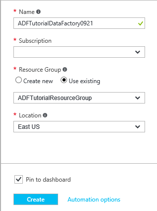
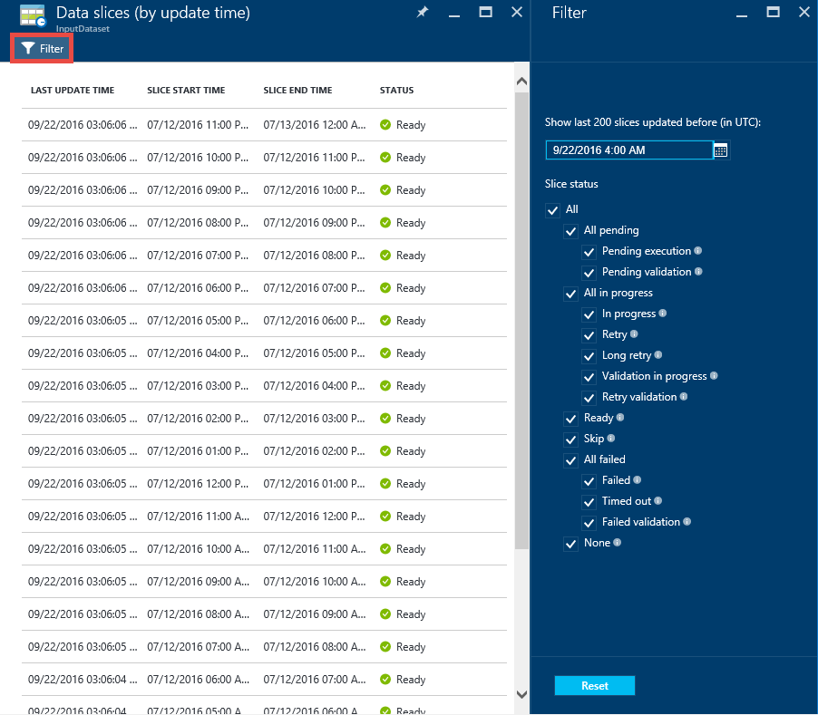
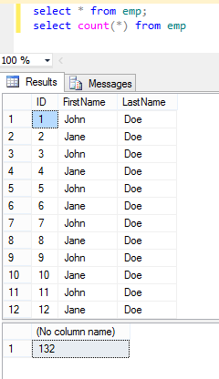

<properties 
    pageTitle="Esercitazione: Creare una pipeline con attività di copia nel portale Azure | Microsoft Azure" 
    description="In questa esercitazione, creare una pipeline di Azure Data Factory con un'attività di copia tramite l'Editor di Factory dati nel portale di Azure." 
    services="data-factory" 
    documentationCenter="" 
    authors="spelluru" 
    manager="jhubbard" 
    editor="monicar"/>

<tags 
    ms.service="data-factory" 
    ms.workload="data-services" 
    ms.tgt_pltfrm="na" 
    ms.devlang="na" 
    ms.topic="get-started-article" 
    ms.date="09/16/2016" 
    ms.author="spelluru"/>

# Esercitazione: Creare una pipeline con attività di copia tramite il portale di Azure
> [AZURE.SELECTOR]
- [Panoramica e i prerequisiti](data-factory-copy-data-from-azure-blob-storage-to-sql-database.md)
- [Copia guidata](data-factory-copy-data-wizard-tutorial.md)
- [Portale di Azure](data-factory-copy-activity-tutorial-using-azure-portal.md)
- [Visual Studio](data-factory-copy-activity-tutorial-using-visual-studio.md)
- [PowerShell](data-factory-copy-activity-tutorial-using-powershell.md)
- [Modelli di Azure Manager delle risorse](data-factory-copy-activity-tutorial-using-azure-resource-manager-template.md)
- [API REST](data-factory-copy-activity-tutorial-using-rest-api.md)
- [API .NET](data-factory-copy-activity-tutorial-using-dotnet-api.md)

In questa esercitazione viene illustrato come creare e monitorare una factory di Azure dati tramite il portale di Azure. La pipeline di factory dati utilizza un'attività di copia per copiare i dati dallo spazio di archiviazione Blob Azure al Database SQL Azure.

Di seguito sono descritte le che operazioni come parte di questa esercitazione:

Passaggio | Descrizione
-----| -----------
[Creare una Factory di dati di Azure](#create-data-factory) | In questo passaggio si crea una factory di dati di Azure denominata **ADFTutorialDataFactory**.  
[Creazione di servizi collegati](#create-linked-services) | In questo passaggio si crea due servizi collegati: **AzureStorageLinkedService** e **AzureSqlLinkedService**.   Il AzureStorageLinkedService collega lo spazio di archiviazione Azure e AzureSqlLinkedService i collegamenti ai database SQL Azure per la ADFTutorialDataFactory. I dati di input per la pipeline risiede in un contenitore di blob nei dati di output e lo spazio di archiviazione blob Azure venire archiviati in una tabella nel database di SQL Azure. Di conseguenza, aggiungere questi archivi due dati come servizi collegati su factory dati.      
[Creare input e output set di dati](#create-datasets) | Nel passaggio precedente, creato servizi collegati che fanno riferimento a archivi dati che contengono dati di input/output. In questo passaggio, è possibile definire due set di dati, ossia **InputDataset** e **OutputDataset** -- che rappresentano i dati di input/output archiviata in archivi dati.   Per InputDataset, specificare il contenitore blob che contiene un blob con i dati di origine e per la OutputDataset, specificare la tabella SQL che contiene i dati di output. È inoltre possibile specificare altre proprietà, ad esempio struttura, disponibilità e criteri. 
[Creare una pipeline](#create-pipeline) | In questo passaggio si crea una pipeline denominata **ADFTutorialPipeline** nel ADFTutorialDataFactory.   Aggiungere un' **attività di copia** nella pipeline di input copia i dati da di Azure blob alla tabella SQL Azure output. L'attività di copia esegue lo spostamento dei dati di Azure Data Factory. Viene attivato da un servizio disponibile a livello globale che è possibile copiare i dati tra diversi archivi di dati in modo sicuro, affidabile e scalabilità. Vedere l'articolo per informazioni dettagliate sull'attività Copia [Le attività di spostamento dei dati](data-factory-data-movement-activities.md) . 
[Pipeline di monitor](#monitor-pipeline) | In questo passaggio, è possibile monitorare le sezioni delle tabelle di input e di output utilizzando portale Azure.

## Prerequisiti 
Prerequisiti completi elencati nell'articolo [Esercitazione Panoramica](data-factory-copy-data-from-azure-blob-storage-to-sql-database.md) prima di eseguire questa esercitazione.

## Creare factory di dati
In questo passaggio, utilizzare il portale di Azure per creare un factory Azure dati denominato **ADFTutorialDataFactory**.

1.  Dopo avere effettuato l'accesso al [portale di Azure](https://portal.azure.com/), fare clic su **Nuovo**e fare clic su **Factory dati**selezionare **Intelligence + Analitica**. 

      

6. In e il **Nuovo factory dati** :
    1. Immettere **ADFTutorialDataFactory** per **nome**. 
    
        

        Il nome della factory dati Azure deve essere **univoco globale**. Se viene visualizzato l'errore seguente, modificare il nome di dati (ad esempio yournameADFTutorialDataFactory) e provare a creare di nuovo. Vedere l'argomento relativo a [Dati Factory - regole di denominazione](data-factory-naming-rules.md) per le regole di denominazione per gli elementi di dati Factory.
    
            Data factory name “ADFTutorialDataFactory” is not available  
     
        
    2. Selezionare **l'abbonamento**di Azure.
    3. Per il gruppo di risorse, eseguire una delle operazioni seguenti:
        1. Selezionare **Usa esistente**e selezionare un gruppo di risorse esistente dall'elenco a discesa. 
        2. Selezionare **Crea nuovo**e immettere il nome di un gruppo di risorse.   
    
            Alcune delle procedure in questa esercitazione si supponga di utilizza il nome: **ADFTutorialResourceGroup** per il gruppo di risorse. Per informazioni sui gruppi di risorse, vedere [utilizzo di gruppi di risorse per gestire le risorse Azure](../azure-resource-manager/resource-group-overview.md).  
    4. Selezionare il **percorso** per la factory di dati. Solo aree geografiche supportate dal servizio Factory dati vengono visualizzate nell'elenco a discesa.
    5. Selezionare **Aggiungi a Startboard**.     
    6. Fare clic su **Crea**.

        > [AZURE.IMPORTANT] Per creare le istanze di Factory dati, è necessario essere un membro del ruolo di [Collaboratore Factory dati](../active-directory/role-based-access-built-in-roles.md/#data-factory-contributor) livello di gruppo abbonamento/risorsa.
        >  
        >  Il nome del produttore dati può essere registrato come un nome DNS in futuro e quindi diventano visibile pubblicamente.              
9.  Per visualizzare i messaggi di stato/notifica, fare clic sull'icona di carico sulla barra degli strumenti. 

     
10. Una volta completata la creazione, viene visualizzato e il **Produttore di dati** , come illustrato nell'immagine.

    

## Creazione di servizi collegati
Servizi collegati collegamento archivi dati o servizi a un factory Azure dati di elaborazione. Vedere [Archivia dati supportati](data-factory-data-movement-activities.md##supported-data-stores-and-formats) per tutte le origini e sink supportati per l'attività di copia. Vedere [calcolare servizi collegati](data-factory-compute-linked-services.md) per l'elenco di servizi di calcolo supportati dal produttore di dati. In questa esercitazione, non si utilizza un servizio di calcolo. 

In questo passaggio si crea due servizi collegati: **AzureStorageLinkedService** e **AzureSqlLinkedService**. AzureSqlLinkedService collegamenti un database SQL Azure a **ADFTutorialDataFactory**e AzureStorageLinkedService collegato collegamenti al servizio un Account di archiviazione Azure. Creare una pipeline più avanti in questa esercitazione che consente di copiare i dati da un contenitore di blob in AzureStorageLinkedService a una tabella SQL in AzureSqlLinkedService.

### Creare un servizio collegato per l'account di archiviazione Azure
1.  In e il **Produttore di dati** , fare clic su **autore e distribuire** riquadro per avviare l' **Editor** per la factory di dati.

     
5. Nell' **Editor**, fare clic sul pulsante **nuovo archivio dati** sulla barra degli strumenti e selezionare **lo spazio di archiviazione Azure** dal menu a discesa. Verrà visualizzato il modello JSON per la creazione di un servizio di archiviazione Azure collegato nel riquadro destro. 

        
6. Sostituire `<accountname>` e `<accountkey>` con i valori di chiave account per il proprio account Azure dello spazio di archiviazione e il nome dell'account. 

     
6. Fare clic su **Distribuisci** sulla barra degli strumenti. A questo punto verrà visualizzato distribuito **AzureStorageLinkedService** nella visualizzazione struttura. 

    

> [AZURE.NOTE]
> Per ulteriori informazioni sulle proprietà JSON, vedere [spostare dati da/verso Blob Azure](data-factory-azure-blob-connector.md#azure-storage-linked-service) .

### Creare un servizio collegato per il Database di SQL Azure
1. Nell' **Editor di Factory dei dati**, fare clic sul pulsante **nuovo archivio dati** sulla barra degli strumenti e selezionare **Il Database di SQL Azure** dal menu a discesa. Verrà visualizzato il modello di JSON per la creazione del servizio di SQL Azure collegato nel riquadro destro.
2. Sostituire `<servername>`, `<databasename>`, `<username>@<servername>`, e `<password>` con i nomi del server SQL Azure, database, account utente e password. 
3. Fare clic su **Distribuisci** sulla barra degli strumenti per creare e distribuire **AzureSqlLinkedService**.
4. Verificare che sia visualizzata **AzureSqlLinkedService** nella visualizzazione struttura. 

> [AZURE.NOTE]
> Per ulteriori informazioni sulle proprietà JSON, vedere [spostare dati da/verso il Database di SQL Azure](data-factory-azure-sql-connector.md#azure-sql-linked-service-properties) .

## Creare set di dati
Nel passaggio precedente è stato creato servizi collegati **AzureStorageLinkedService** e **AzureSqlLinkedService** collegare un account di archiviazione Azure e database SQL Azure factory dati: **ADFTutorialDataFactory**. In questo passaggio, è possibile definire due set di dati, ossia **InputDataset** e **OutputDataset** -- che rappresentano i dati di input/output archiviata in archivi dati riferimento rispettivamente AzureStorageLinkedService e AzureSqlLinkedService. Per InputDataset, specificare il contenitore blob che contiene un blob con i dati di origine e per OutputDataset, specificare la tabella SQL che contiene i dati di output. 

### Creare set di dati input 
In questo passaggio si crea un set di dati denominato **InputDataset** che fa riferimento a un contenitore di blob in archiviazione Azure rappresentata dal servizio **AzureStorageLinkedService** collegato.

1. **Nell'Editor** Factory dati, fare clic su **... Ulteriori**, fare clic su **nuovo set di dati**e fare clic su **archiviazione Blob Azure** dal menu a discesa. 

    
2. Sostituire JSON nel riquadro destro, con il frammento di JSON seguente: 

        {
          "name": "InputDataset",
          "properties": {
            "structure": [
              {
                "name": "FirstName",
                "type": "String"
              },
              {
                "name": "LastName",
                "type": "String"
              }
            ],
            "type": "AzureBlob",
            "linkedServiceName": "AzureStorageLinkedService",
            "typeProperties": {
              "folderPath": "adftutorial/",
              "fileName": "emp.txt",
              "format": {
                "type": "TextFormat",
                "columnDelimiter": ","
              }
            },
            "external": true,
            "availability": {
              "frequency": "Hour",
              "interval": 1
            }
          }
        }
        
     Noti quanto segue: 
    
    - set di dati di **tipo** viene impostato su **AzureBlob**.
    - **linkedServiceName** è impostato su **AzureStorageLinkedService**. Questo servizio collegato creato nel passaggio 2.
    - **folderPath** è impostato per il contenitore **adftutorial** . È anche possibile specificare il nome di un blob all'interno della cartella utilizzando la proprietà **nome file** . Dal momento che non si specifica il nome del blob, dati da tutti i BLOB nel contenitore viene considerati come un input di dati.  
    - **tipo** di formato è impostato su **formato testo**
    - Esistono due campi nel file di testo- **nome** e **Cognome** , separato da una virgola (**columnDelimiter**) 
    - La **disponibilità** è impostato su **ogni ora** (**frequenza** è impostata su **ora** e **intervallo** è impostato su **1**). Di conseguenza, Factory dati consente di cercare i dati di input ogni ora nella cartella radice del contenitore di blob (**adftutorial**) specificata. 
    
    Se non si specifica un **nome di file** per un set di dati di **input** , tutti i file/BLOB dalla cartella input (**folderPath**) vengono considerati come input. Se si specifica un nome di file nel JSON, solo lo specificato file/blob viene considerato asn input.
 
    Se non si specifica un **nome di file** per una **tabella di output**, i file generati in **folderPath** sono denominati nel formato seguente: dati. &lt;Guid\&gt;. txt (esempio: Data.0a405f8a-93ff-4c6f-b3be-f69616f1df7a.txt.).

    Per impostare **folderPath** e **nome del file** in modo dinamico in base alla data di **SliceStart** , utilizzare la proprietà **partitionedBy** . Nell'esempio seguente folderPath utilizza anno, mese e giorno da SliceStart (ora di inizio della sezione in fase di elaborazione) e nomefile utilizza ora dal SliceStart. Ad esempio, se in corso una sezione di produzione per 2016-09-20T08:00:00, nomecartella è impostata su wikidatagateway/wikisampledataout/2016/09/20 e il nome del file è impostato su 08.csv. 

            "folderPath": "wikidatagateway/wikisampledataout/{Year}/{Month}/{Day}",
            "fileName": "{Hour}.csv",
            "partitionedBy": 
            [
                { "name": "Year", "value": { "type": "DateTime", "date": "SliceStart", "format": "yyyy" } },
                { "name": "Month", "value": { "type": "DateTime", "date": "SliceStart", "format": "MM" } }, 
                { "name": "Day", "value": { "type": "DateTime", "date": "SliceStart", "format": "dd" } }, 
                { "name": "Hour", "value": { "type": "DateTime", "date": "SliceStart", "format": "hh" } } 
            ],
2. Fare clic su **Distribuisci** sulla barra degli strumenti per creare e distribuire il set di dati **InputDataset** . Verificare che sia visualizzata **InputDataset** nella visualizzazione struttura.

> [AZURE.NOTE]
> Per ulteriori informazioni sulle proprietà JSON, vedere [spostare dati da/verso Blob Azure](data-factory-azure-blob-connector.md#azure-blob-dataset-type-properties) .

### Creare set di dati di output
In questa parte del passaggio, si crea un set di dati di output denominato **OutputDataset**. Questo set di dati fa riferimento a una tabella SQL in database SQL Azure rappresentato da **AzureSqlLinkedService**. 

1. **Nell'Editor** Factory dati, fare clic su **... Ulteriori**, fare clic su **nuovo set di dati**e fare clic su **SQL Azure** dal menu a discesa. 
2. Sostituire JSON nel riquadro destro, con il frammento di JSON seguente:

        {
          "name": "OutputDataset",
          "properties": {
            "structure": [
              {
                "name": "FirstName",
                "type": "String"
              },
              {
                "name": "LastName",
                "type": "String"
              }
            ],
            "type": "AzureSqlTable",
            "linkedServiceName": "AzureSqlLinkedService",
            "typeProperties": {
              "tableName": "emp"
            },
            "availability": {
              "frequency": "Hour",
              "interval": 1
            }
          }
        }
        
     Noti quanto segue: 
    
    - set di dati di **tipo** viene impostato su **AzureSQLTable**.
    - **linkedServiceName** è impostato su **AzureSqlLinkedService** (questo servizio collegato è creato nel passaggio 2).
    - **TableName** è impostato su **emp**.
    - Esistono tre colonne: **ID**, **nome**e **Cognome** -descritti nella tabella emp nel database. ID è una colonna di identità, pertanto è necessario specificare solo **nome** e **Cognome** .
    - La **disponibilità** è impostato su **ogni ora** (**frequenza** impostata su **ora** e **intervallo** impostato su **1**).  Il servizio Factory dati genera una sezione di dati di output ogni ora nella tabella **emp** nel database di SQL Azure.

3. Fare clic su **Distribuisci** sulla barra degli strumenti per creare e distribuire il set di dati **OutputDataset** . Verificare che sia visualizzata **OutputDataset** nella visualizzazione struttura. 

> [AZURE.NOTE]
> Per ulteriori informazioni sulle proprietà JSON, vedere [spostare dati da/verso il Database di SQL Azure](data-factory-azure-sql-connector.md#azure-sql-linked-service-properties) .

## Creare pipeline
In questo passaggio si crea una pipeline con una **Copia attività** che utilizza **InputDataset** come input e **OutputDataset** come output.

1. **Nell'Editor** Factory dati, fare clic su **... Ulteriori**e fare clic su **nuova pipeline**. In alternativa, è possibile rapida **pipeline** nella visualizzazione struttura e fare clic su **nuova pipeline**.
2. Sostituire JSON nel riquadro destro, con il frammento di JSON seguente: 
        
        {
          "name": "ADFTutorialPipeline",
          "properties": {
            "description": "Copy data from a blob to Azure SQL table",
            "activities": [
              {
                "name": "CopyFromBlobToSQL",
                "type": "Copy",
                "inputs": [
                  {
                    "name": "InputDataset"
                  }
                ],
                "outputs": [
                  {
                    "name": "OutputDataset"
                  }
                ],
                "typeProperties": {
                  "source": {
                    "type": "BlobSource"
                  },
                  "sink": {
                    "type": "SqlSink",
                    "writeBatchSize": 10000,
                    "writeBatchTimeout": "60:00:00"
                  }
                },
                "Policy": {
                  "concurrency": 1,
                  "executionPriorityOrder": "NewestFirst",
                  "retry": 0,
                  "timeout": "01:00:00"
                }
              }
            ],
            "start": "2016-07-12T00:00:00Z",
            "end": "2016-07-13T00:00:00Z"
          }
        } 

    Noti quanto segue:

    - Nella sezione attività esiste una sola attività il cui **tipo** sia impostata su **Copia**.
    - Input per l'attività è impostata su **InputDataset** e output per l'attività è impostato su **OutputDataset**.
    - Nella sezione **typeProperties** **BlobSource** viene specificato come tipo di origine e **SqlSink** viene specificato come tipo di sink.

    Sostituire il valore della proprietà **start** con il valore di giorno e di **Fine** corrente con il giorno successivo. È possibile specificare solo la parte di data e ignorare la parte dell'ora della data dell'ora. Ad esempio, "2016-02-03", che equivale a "2016-02-03T00:00:00Z"
    
    Entrambe inizio e fine date e ore deve essere in [formato ISO](http://en.wikipedia.org/wiki/ISO_8601). Ad esempio: 2016-10-14T16:32:41Z. L'ora di **Fine** è facoltativo, ma serve in questa esercitazione. 
    
    Se non si specifica valore per la proprietà di **Fine** , viene calcolato come "**inizio + 48 ore**". Per eseguire la pipeline di tempo indefinito, specificare **9999-09-09** come valore per la proprietà di **Fine** .
    
    Nell'esempio precedente sono 24 sezioni di dati, ogni ora prodotta di ogni sezione di dati.
    
4. Fare clic su **Distribuisci** sulla barra degli strumenti per creare e distribuire **ADFTutorialPipeline**. Verificare che sia visualizzata la pipeline nella visualizzazione struttura. 
5. A questo punto, chiudere e il **Editor** facendo clic su **X**. Fare clic sulla **X** per vedere la home page **Data Factory** per **ADFTutorialDataFactory**.

**Congratulazioni!** Creare una factory di dati di Azure, servizi collegati, tabelle e una pipeline di e programmata la pipeline di completata.   
 
### Visualizzare la factory di dati in una visualizzazione Diagramma 
1. In e il **Produttore di dati** , fare clic su **diagramma**.

    
2. Verrà visualizzato il diagramma come nella figura seguente: 

    

    È possibile applicare lo zoom avanti, zoom indietro, al 100%, zoom per adattare automaticamente posizionare tubazioni e le tabelle e Mostra informazioni sulla derivazione del (evidenzia gli elementi padre e downstream degli elementi selezionati).  Fare doppio clic su un oggetto (tabella di input/output o pipeline) per visualizzare le proprietà. 
3. Pulsante destro del mouse **ADFTutorialPipeline** nella vista diagramma e fare clic su **aprire pipeline**. 

    
4. È necessario visualizzare le attività nella pipeline insieme set di dati di input e di output per le attività. In questa esercitazione si dispone di una sola attività nella pipeline (copia attività) con InputDataset come input set di dati e OutputDataset come set di dati di output.   

    
5. Fare clic su **factory dati** nella struttura di spostamento nell'angolo superiore sinistro per tornare alla vista diagramma. La visualizzazione Diagramma consente di visualizzare tutte le tubazioni. In questo esempio è stato creato solo una pipeline.   
 

## Pipeline di monitor
In questo passaggio, utilizzare il portale di Azure per eseguire il monitoraggio delle attività una factory di dati di Azure. 

### Pipeline di monitor tramite la vista diagramma

1. Fare clic sulla **X** per chiudere la visualizzazione **diagramma** per visualizzare la pagina home Factory dati per la factory di dati. Se è stato chiuso il web browser, eseguire la procedura seguente: 
    2. Passare al [portale di Azure](https://portal.azure.com/). 
    2. Fare doppio clic su **ADFTutorialDataFactory** in **Startboard** (o) fare clic su **factory dati** nel menu a sinistra e cercare ADFTutorialDataFactory. 
3. Verrà visualizzata la conta. numeri e nomi di tabelle e pipeline che è stato creato in questa blade.

    
4. A questo punto, fare clic su riquadro di **set di dati** .
5. In e il **set di dati** , fare clic su **InputDataset**. Questo set di dati è il set di dati di input per **ADFTutorialPipeline**.

       
5. Fare clic su **... (puntini di sospensione)** Per visualizzare tutte le sezioni di dati.

      

    Si noti **che tutte le sezioni di dati per l'ora attuale pronti perché il file **emp.txt** esiste sempre nel contenitore di blob** : **adftutorial\input**. Verificare che non sezioni vengano visualizzati nella sezione **sezioni non riuscite di recente** nella parte inferiore.

    Elenchi sia **aggiornate le sezioni** e **recente non è riuscita sezioni** vengono ordinati per l' **ultimo aggiornamento ora**. 
    
    Fare clic su **filtro** sulla barra degli strumenti per filtrare le sezioni.  
    
    
6. Chiudere le pale finché non viene visualizzata e il **set di dati** . Fare clic su **OutputDataset**. Questo set di dati è il set di dati di output per **ADFTutorialPipeline**.

    
6. Verrà visualizzata e il **OutputDataset** come illustrato nell'immagine seguente:

     
7. Si noti che le sezioni di dati per l'ora corrente sono già stati prodotti e sono **pronti**. Nessun sezioni vengono visualizzati nella sezione **sezioni del problema** nella parte inferiore.
8. Fare clic su **... (Puntini di sospensione)** Per visualizzare tutte le sezioni.

    
9. Fare clic su qualsiasi sezione di dati dall'elenco e dovrebbero essere visualizzati e il **sezione di dati** .

    
  
    Se la sezione non è nello stato **Pronto** , è possibile vedere le sezioni padre che non sono pronti e bloccano la sezione corrente dall'esecuzione nell'elenco **padre sezioni non pronti** .
11. Si verrà visualizzato e il **Sezione di dati** , che viene eseguito tutte le attività nell'elenco nella parte inferiore. Fare clic su un' **attività eseguita** per visualizzare e il **Dettagli esecuzione di attività** . 

    
12. Fare clic sulla **X** per chiudere tutte le pale fino a quando non torna indietro a e l'iniziale per **ADFTutorialDataFactory**.
14. (facoltativo) Fare clic su **pipeline** nella home page per **ADFTutorialDataFactory**, fare clic **ADFTutorialPipeline** e il **tubazioni** e il drill-through tabelle inpue (**consumato**) o output (**prodotti**).
15. Avviare **SQL Server Management Studio**, connettersi al Database SQL Azure e verificare che le righe vengono inserite alla tabella **emp** nel database.

    

### Eseguire il monitoraggio delle pipeline usando monitorare e gestire App
È anche possibile utilizzare Monitor e gestire applicazione per controllare la pipeline. Per informazioni dettagliate sull'uso dell'applicazione, vedere [monitorare e gestire pipeline di Azure Data Factory utilizzando monitoraggio e gestione App](data-factory-monitor-manage-app.md).

1. Fare clic su riquadro **Monitor e Gestisci** nella home page dell'ambiente di produzione di dati.

     
2. Verrà visualizzato **Monitor e gestione dell'applicazione**. Modificare **l'ora di inizio** e **ora di fine** per includere inizio (2016-07-12) e fine (2016-07-13) della pipeline e fare clic su **Applica**. 

     
3. Selezionare un intervallo di azione nell'elenco **Attività di Windows** per visualizzare i dettagli su di esso. 
    

## Riepilogo 
In questa esercitazione, è stata creata una factory di dati di Azure per copiare dati da un Azure blob a un database SQL Azure. Portale di Azure utilizzato per creare la factory di dati, servizi collegati, set di dati e una pipeline. Ecco la procedura generale eseguita in questa esercitazione:  

1.  Creare una **factory di dati**di Azure.
2.  Creare **servizi collegati**:
    1. Un servizio di **Archiviazione Azure** collegati per collegare l'account di archiviazione Azure che contiene i dati di input.    
    2. Un servizio di **SQL Azure** collegati a collegare il database di SQL Azure che contiene i dati di output. 
3.  Creare **set di dati** che descrivono i dati di input e dati di output per pipeline.
4.  Creata una **pipeline** con un' **Attività di copia** con **BlobSource** come origine e **SqlSink** come sink.  

## Vedere anche
| Argomento | Descrizione |
| :---- | :---- |
| [Attività di spostamento dei dati](data-factory-data-movement-activities.md) | In questo articolo fornisce informazioni dettagliate sull'attività copia utilizzato nell'esercitazione. |
| [Pianificazione e l'esecuzione](data-factory-scheduling-and-execution.md) | Questo articolo illustra gli aspetti pianificazione e l'esecuzione del modello di applicazione Azure Data Factory. |
| [Pipeline](data-factory-create-pipelines.md) | Questo articolo è utile comprendere tubazioni e le attività di Azure Data Factory. |
| [Set di dati](data-factory-create-datasets.md) | Questo articolo è utile comprendere set di dati di Azure Data Factory.
| [Monitorare e gestire mediante il monitoraggio App](data-factory-monitor-manage-app.md) | In questo articolo viene descritto come monitorare, gestire ed eseguire il debug mediante il monitoraggio e gestione delle App. 

