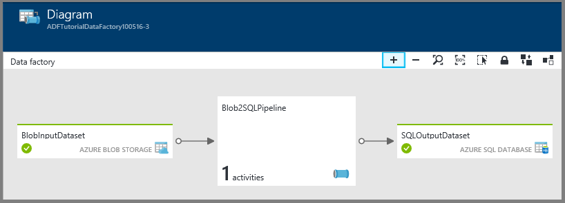

<properties
    pageTitle="Esercitazione: Creare una pipeline utilizzando il modello di gestione risorse | Microsoft Azure"
    description="In questa esercitazione, creare una pipeline di Azure Data Factory con un'attività di copia tramite Gestione risorse Azure modello."
    services="data-factory"
    documentationCenter=""
    authors="spelluru"
    manager="jhubbard"
    editor="monicar"/>

<tags
    ms.service="data-factory"
    ms.workload="data-services"
    ms.tgt_pltfrm="na"
    ms.devlang="na"
    ms.topic="get-started-article"
    ms.date="10/10/2016"
    ms.author="spelluru"/>

# Esercitazione: Creare una pipeline con attività di copia mediante modello Manager delle risorse di Azure
> [AZURE.SELECTOR]
- [Panoramica e i prerequisiti](data-factory-copy-data-from-azure-blob-storage-to-sql-database.md)
- [Copia guidata](data-factory-copy-data-wizard-tutorial.md)
- [Portale di Azure](data-factory-copy-activity-tutorial-using-azure-portal.md)
- [Visual Studio](data-factory-copy-activity-tutorial-using-visual-studio.md)
- [PowerShell](data-factory-copy-activity-tutorial-using-powershell.md)
- [Modelli di Azure Manager delle risorse](data-factory-copy-activity-tutorial-using-azure-resource-manager-template.md)
- [API REST](data-factory-copy-activity-tutorial-using-rest-api.md)
- [API .NET](data-factory-copy-activity-tutorial-using-dotnet-api.md)

In questa esercitazione viene illustrato come creare e monitorare una factory di Azure dati utilizzando un modello di gestione di risorse Azure. Dati la pipeline di factory dati copiati dallo spazio di archiviazione Blob Azure Database SQL Azure.

## Prerequisiti
- Verranno illustrate [esercitazione panoramica e i prerequisiti](data-factory-copy-data-from-azure-blob-storage-to-sql-database.md) e completare i passaggi **prerequisito** .
- Seguire istruzioni nell'articolo [come installare e configurare Azure PowerShell](../powershell-install-configure.md) per installare la versione più recente di Azure PowerShell nel computer in uso. In questa esercitazione si usare PowerShell per distribuire entità Factory dati. 
- (facoltativo) Vedere [Creazione di modelli di Azure Manager delle risorse](../resource-group-authoring-templates.md) per informazioni sui modelli di gestione di risorse Azure.

## In questa esercitazione

In questa esercitazione si crea una factory di dati con le entità Factory dati seguenti:

Entità | Descrizione  
------ | ----------- 
Servizio di archiviazione collegato di Azure | I collegamenti all'account di archiviazione Azure su factory dati. Spazio di archiviazione Azure è l'archivio di dati di origine e database SQL Azure è l'archivio di dati sink per l'attività Copia nell'esercitazione. Specifica l'account di archiviazione che contiene i dati di input per l'attività di copia. 
Servizio collegato Database di SQL Azure| I collegamenti ai database di SQL Azure su factory dati. Specifica il database di SQL Azure che contiene i dati di output per l'attività di copia. 
Set di dati input Blob Azure | Fa riferimento al servizio di archiviazione di Azure collegato. Servizio collegato si riferisce a un account di archiviazione Azure e il set di dati Blob Azure specifica il contenitore, cartella e il nome dell'archivio che contiene i dati di input. 
Azure set di dati SQL output | Fa riferimento al servizio di SQL Azure collegato. Il servizio SQL Azure collegato fa riferimento a un server SQL Azure e il set di dati di SQL Azure consente di specificare il nome della tabella contenente i dati di output. 
Pipeline di dati | La pipeline dispone di un'attività del tipo di copiare che accetta il set di dati blob Azure come input e il set di dati di SQL Azure come un output. Attività Copia consente di copiare dati da un Azure blob a una tabella nel database di SQL Azure.  

Una factory dati può avere una o più tubazioni. Una pipeline può contenere uno o più attività. Esistono due tipi di attività: [attività di spostamento dei dati](data-factory-data-movement-activities.md) e [attività di trasformazione dati](data-factory-data-transformation-activities.md). In questa esercitazione, creare una pipeline con un'attività (attività Copia).

 

La sezione seguente fornisce il modello di gestione risorse completo per la definizione di entità Data Factory, che consentono di eseguire l'esercitazione e testare il modello rapidamente. Per capire come ogni entità Factory dati è definito, vedere la sezione [entità Factory dati nel modello](#data-factory-entities-in-the-template) .

## Modello di dati JSON Factory
Il modello di gestione risorse principale per la definizione di una factory di dati è: 

    {
        "$schema": "http://schema.management.azure.com/schemas/2015-01-01/deploymentTemplate.json#",
        "contentVersion": "1.0.0.0",
        "parameters": { ...
        },
        "variables": { ...
        },
        "resources": [
            {
                "name": "[parameters('dataFactoryName')]",
                "apiVersion": "[variables('apiVersion')]",
                "type": "Microsoft.DataFactory/datafactories",
                "location": "westus",
                "resources": [
                    { ... },
                    { ... },
                    { ... },
                    { ... }
                ]
            }
        ]
    }

Creare un file JSON denominato **ADFCopyTutorialARM.json** nella cartella **C:\ADFGetStarted** con il contenuto seguente:

    {
        "contentVersion": "1.0.0.0",
        "$schema": "http://schema.management.azure.com/schemas/2015-01-01/deploymentTemplate.json#",
        "parameters": {
          "storageAccountName": { "type": "string", "metadata": { "description": "Name of the Azure storage account that contains the data to be copied." } },
          "storageAccountKey": { "type": "securestring", "metadata": { "description": "Key for the Azure storage account." } },
          "sourceBlobContainer": { "type": "string", "metadata": { "description": "Name of the blob container in the Azure Storage account." } },
          "sourceBlobName": { "type": "string", "metadata": { "description": "Name of the blob in the container that has the data to be copied to Azure SQL Database table" } },
          "sqlServerName": { "type": "string", "metadata": { "description": "Name of the Azure SQL Server that will hold the output/copied data." } },
          "databaseName": { "type": "string", "metadata": { "description": "Name of the Azure SQL Database in the Azure SQL server." } },
          "sqlServerUserName": { "type": "string", "metadata": { "description": "Name of the user that has access to the Azure SQL server." } },
          "sqlServerPassword": { "type": "securestring", "metadata": { "description": "Password for the user." } },
          "targetSQLTable": { "type": "string", "metadata": { "description": "Table in the Azure SQL Database that will hold the copied data." } 
          } 
        },
        "variables": {
          "dataFactoryName": "[concat('AzureBlobToAzureSQLDatabaseDF', uniqueString(resourceGroup().id))]",
          "azureSqlLinkedServiceName": "AzureSqlLinkedService",
          "azureStorageLinkedServiceName": "AzureStorageLinkedService",
          "blobInputDatasetName": "BlobInputDataset",
          "sqlOutputDatasetName": "SQLOutputDataset",
          "pipelineName": "Blob2SQLPipeline"
        },
        "resources": [
          {
            "name": "[variables('dataFactoryName')]",
            "apiVersion": "2015-10-01",
            "type": "Microsoft.DataFactory/datafactories",
            "location": "West US",
            "resources": [
              {
                "type": "linkedservices",
                "name": "[variables('azureStorageLinkedServiceName')]",
                "dependsOn": [
                  "[variables('dataFactoryName')]"
                ],
                "apiVersion": "2015-10-01",
                "properties": {
                  "type": "AzureStorage",
                  "description": "Azure Storage linked service",
                  "typeProperties": {
                    "connectionString": "[concat('DefaultEndpointsProtocol=https;AccountName=',parameters('storageAccountName'),';AccountKey=',parameters('storageAccountKey'))]"
                  }
                }
              },
              {
                "type": "linkedservices",
                "name": "[variables('azureSqlLinkedServiceName')]",
                "dependsOn": [
                  "[variables('dataFactoryName')]"
                ],
                "apiVersion": "2015-10-01",
                "properties": {
                  "type": "AzureSqlDatabase",
                  "description": "Azure SQL linked service",
                  "typeProperties": {
                    "connectionString": "[concat('Server=tcp:',parameters('sqlServerName'),'.database.windows.net,1433;Database=', parameters('databaseName'), ';User ID=',parameters('sqlServerUserName'),';Password=',parameters('sqlServerPassword'),';Trusted_Connection=False;Encrypt=True;Connection Timeout=30')]"
                  }
                }
              },
              {
                "type": "datasets",
                "name": "[variables('blobInputDatasetName')]",
                "dependsOn": [
                  "[variables('dataFactoryName')]",
                  "[variables('azureStorageLinkedServiceName')]"
                ],
                "apiVersion": "2015-10-01",
                "properties": {
                  "type": "AzureBlob",
                  "linkedServiceName": "[variables('azureStorageLinkedServiceName')]",
                  "structure": [
                    {
                      "name": "Column0",
                      "type": "String"
                    },
                    {
                      "name": "Column1",
                      "type": "String"
                    }
                  ],
                  "typeProperties": {
                    "folderPath": "[concat(parameters('sourceBlobContainer'), '/')]",
                    "fileName": "[parameters('sourceBlobName')]",
                    "format": {
                      "type": "TextFormat",
                      "columnDelimiter": ","
                    }
                  },
                  "availability": {
                    "frequency": "Day",
                    "interval": 1
                  },
                  "external": true
                }
              },
              {
                "type": "datasets",
                "name": "[variables('sqlOutputDatasetName')]",
                "dependsOn": [
                  "[variables('dataFactoryName')]",
                  "[variables('azureSqlLinkedServiceName')]"
                ],
                "apiVersion": "2015-10-01",
                "properties": {
                  "type": "AzureSqlTable",
                  "linkedServiceName": "[variables('azureSqlLinkedServiceName')]",
                  "structure": [
                    {
                      "name": "FirstName",
                      "type": "String"
                    },
                    {
                      "name": "LastName",
                      "type": "String"
                    }
                  ],
                  "typeProperties": {
                    "tableName": "[parameters('targetSQLTable')]"
                  },
                  "availability": {
                    "frequency": "Day",
                    "interval": 1
                  }
                }
              },
              {
                "type": "datapipelines",
                "name": "[variables('pipelineName')]",
                "dependsOn": [
                  "[variables('dataFactoryName')]",
                  "[variables('azureStorageLinkedServiceName')]",
                  "[variables('azureSqlLinkedServiceName')]",
                  "[variables('blobInputDatasetName')]",
                  "[variables('sqlOutputDatasetName')]"
                ],
                "apiVersion": "2015-10-01",
                "properties": {
                  "activities": [
                    {
                      "name": "CopyFromAzureBlobToAzureSQL",
                      "description": "Copy data frm Azure blob to Azure SQL",
                      "type": "Copy",
                      "inputs": [
                        {
                          "name": "[variables('blobInputDatasetName')]"
                        }
                      ],
                      "outputs": [
                        {
                          "name": "[variables('sqlOutputDatasetName')]"
                        }
                      ],
                      "typeProperties": {
                        "source": {
                          "type": "BlobSource"
                        },
                        "sink": {
                          "type": "SqlSink",
                          "sqlWriterCleanupScript": "$$Text.Format('DELETE FROM {0}', 'emp')"
                        },
                        "translator": {
                          "type": "TabularTranslator",
                          "columnMappings": "Column0:FirstName,Column1:LastName"
                        }
                      },
                      "Policy": {
                        "concurrency": 1,
                        "executionPriorityOrder": "NewestFirst",
                        "retry": 3,
                        "timeout": "01:00:00"
                      }
                    }
                  ],
                  "start": "2016-10-02T00:00:00Z",
                  "end": "2016-10-03T00:00:00Z"
                }
              }
            ]
          }
        ]
      }

## Parametri JSON 
Creare un file JSON denominato **ADFCopyTutorialARM Parameters.json** che contiene i parametri per il modello di gestione di risorse Azure. 

> [AZURE.IMPORTANT] Specificare il nome e la chiave del proprio account Azure lo spazio di archiviazione per i parametri **storageAccountName** e **storageAccountKey** .  

    {
        "$schema": "https://schema.management.azure.com/schemas/2015-01-01/deploymentParameters.json#",
        "contentVersion": "1.0.0.0",
        "parameters": { 
            "storageAccountName": { "value": "<Name of the Azure storage account>"  },
            "storageAccountKey": {
                "value": "<Key for the Azure storage account>"
            },
            "sourceBlobContainer": { "value": "adftutorial" },
            "sourceBlobName": { "value": "emp.txt" },
            "sqlServerName": { "value": "<Name of the Azure SQL server>" },
            "databaseName": { "value": "<Name of the Azure SQL database>" },
            "sqlServerUserName": { "value": "<Name of the user who has access to the Azure SQL database>" },
            "sqlServerPassword": { "value": "<password for the user>" },
            "targetSQLTable": { "value": "emp" }
        }
    }

> [AZURE.IMPORTANT] File JSON parametro separato per lo sviluppo, test e ambienti di produzione che è possibile usare con lo stesso modello di dati Factory JSON, potrebbe essere. Utilizzando uno script di PowerShell, è possibile automatizzare la distribuzione entità Factory dati in questi ambienti.  

## Creare factory di dati
1. Avviare **Azure PowerShell** ed eseguire il comando seguente:
    - Eseguire `Login-AzureRmAccount` e immettere il nome utente e password utilizzati per accedere al portale di Azure.  
    - Eseguire `Get-AzureRmSubscription` per visualizzare tutte le sottoscrizioni per l'account.
    - Eseguire `Get-AzureRmSubscription -SubscriptionName <SUBSCRIPTION NAME> | Set-AzureRmContext` per selezionare l'abbonamento a cui si desidera utilizzare. 
2. Eseguire il seguente comando per distribuire entità Factory dati utilizzando il modello di gestione risorse creato nel passaggio 1.

        New-AzureRmResourceGroupDeployment -Name MyARMDeployment -ResourceGroupName ADFTutorialResourceGroup -TemplateFile C:\ADFGetStarted\ADFCopyTutorialARM.json -TemplateParameterFile C:\ADFGetStarted\ADFCopyTutorialARM-Parameters.json

## Pipeline di monitor
1. Accedere al [portale di Azure](https://portal.azure.com) con il proprio account Azure.
2. Fare clic su **factory dati** nel menu a sinistra (o) fare clic su **altri servizi** e fare clic su **factory dati** nella categoria di **Business INTELLIGENCE + ANALYTICS** .

    
3. Nella pagina **factory dati** , cercare e trovare il produttore di dati. 

      
4. Fare clic su factory i dati di Azure. Viene visualizzata la pagina home per la factory di dati.

      
5. Fare clic su riquadro **diagramma** per passare alla visualizzazione Diagramma di factory i dati.

    
6. Nella visualizzazione Diagramma, fare doppio clic sul set di dati **SQLOutputDataset**. Viene visualizzato lo stato della sezione. Al termine dell'operazione di copia, lo stato di impostare lo stato **Pronto**.

    
7. Quando la sezione è **Pronto** , verificare che i dati vengono copiati alla tabella **emp** nel database di SQL Azure.

Per istruzioni su come usare le pale portale Azure per monitorare la pipeline e set di dati che è stato creato in questa esercitazione, vedere [pipeline e set di dati di Monitor](data-factory-monitor-manage-pipelines.md) .

Per controllare la pipeline di dati, è possibile utilizzare Monitor e Gestisci App. Vedere [monitorare e gestire pipeline di Azure Data Factory utilizzando il monitoraggio App](data-factory-monitor-manage-app.md) per informazioni dettagliate sull'uso dell'applicazione.

## Entità Factory dati nel modello

### Definire factory dati
Si definisce una factory di dati nel modello di manager delle risorse, come illustrato nell'esempio seguente:  

    "resources": [
    {
        "name": "[variables('dataFactoryName')]",
        "apiVersion": "2015-10-01",
        "type": "Microsoft.DataFactory/datafactories",
        "location": "West US"
    }

Il dataFactoryName è definito come: 
      
    "dataFactoryName": "[concat('AzureBlobToAzureSQLDatabaseDF', uniqueString(resourceGroup().id))]"

Si tratta di una stringa univoca in base all'ID del gruppo di risorse.  

### Definizione di entità Factory dati
Nel modello di JSON sono definite entità Factory dati seguenti: 

1. [Servizio di archiviazione collegato di Azure](#azure-storage-linked-service)
2. [Servizio collegate SQL Azure](#azure-sql-database-linked-service)
3. [Set di dati blob Azure](#azure-blob-dataset)
4. [Set di dati SQL Azure](#azure-sql-dataset)
5. [Pipeline di dati con un'attività di copia](#data-pipeline)

#### Servizio di archiviazione collegato di Azure
Specificare il nome e la chiave del proprio account Azure dello spazio di archiviazione in questa sezione. Per ulteriori informazioni sulle proprietà JSON utilizzata per definire un servizio di archiviazione di Azure collegati, vedere [lo spazio di archiviazione di Azure collegato servizio](data-factory-azure-blob-connector.md#azure-storage-linked-service) . 

    {
        "type": "linkedservices",
        "name": "[variables('azureStorageLinkedServiceName')]",
        "dependsOn": [
            "[variables('dataFactoryName')]"
        ],
        "apiVersion": "2015-10-01",
        "properties": {
            "type": "AzureStorage",
            "description": "Azure Storage linked service",
            "typeProperties": {
                "connectionString": "[concat('DefaultEndpointsProtocol=https;AccountName=',parameters('storageAccountName'),';AccountKey=',parameters('storageAccountKey'))]"
            }
        }
    }

ConnectionString utilizza i parametri storageAccountName e storageAccountKey. I valori per i parametri tramite un file di configurazione. La definizione Usa anche variabili: azureStroageLinkedService e dataFactoryName definita nel modello. 
    
#### Servizio collegato Database di SQL Azure
Specificare il nome del server SQL Azure, il nome del database, nome utente e password utente in questa sezione. Per ulteriori informazioni sulle proprietà JSON utilizzata per definire un servizio di SQL Azure collegati, vedere [SQL Azure collegato servizio](data-factory-azure-sql-connector.md#azure-sql-linked-service-properties) .  

    {
        "type": "linkedservices",
        "name": "[variables('azureSqlLinkedServiceName')]",
        "dependsOn": [
          "[variables('dataFactoryName')]"
        ],
        "apiVersion": "2015-10-01",
        "properties": {
            "type": "AzureSqlDatabase",
            "description": "Azure SQL linked service",
            "typeProperties": {
                "connectionString": "[concat('Server=tcp:',parameters('sqlServerName'),'.database.windows.net,1433;Database=', parameters('databaseName'), ';User ID=',parameters('sqlServerUserName'),';Password=',parameters('sqlServerPassword'),';Trusted_Connection=False;Encrypt=True;Connection Timeout=30')]"
            }
        }
    }

ConnectionString utilizza sqlServerName, databaseName, sqlServerUserName e parametri sqlServerPassword cui valori vengono passati tramite un file di configurazione. La definizione utilizza anche le seguenti variabili del modello: azureSqlLinkedServiceName, dataFactoryName.

#### Set di dati blob Azure
Specificare i nomi di contenitore blob, cartelle e file che contiene i dati di input. Per ulteriori informazioni sulle proprietà JSON utilizzata per definire un set di dati Blob Azure, vedere [proprietà set di dati Blob Azure](data-factory-azure-blob-connector.md#azure-blob-dataset-type-properties) . 

    {
        "type": "datasets",
        "name": "[variables('blobInputDatasetName')]",
        "dependsOn": [
          "[variables('dataFactoryName')]",
          "[variables('azureStorageLinkedServiceName')]"
        ],
        "apiVersion": "2015-10-01",
        "properties": {
            "type": "AzureBlob",
            "linkedServiceName": "[variables('azureStorageLinkedServiceName')]",
            "structure": [
            {
                "name": "Column0",
                "type": "String"
            },
            {
                "name": "Column1",
                "type": "String"
            }
            ],
            "typeProperties": {
                "folderPath": "[concat(parameters('sourceBlobContainer'), '/')]",
                "fileName": "[parameters('sourceBlobName')]",
                "format": {
                    "type": "TextFormat",
                    "columnDelimiter": ","
                }
            },
            "availability": {
                "frequency": "Day",
                "interval": 1
            },
            "external": true
        }
    }

#### Set di dati SQL Azure
Specificare il nome della tabella nel database di SQL Azure che contiene i dati copiati dallo spazio di archiviazione Blob Azure. Per ulteriori informazioni sulle proprietà JSON utilizzata per definire un set di dati di SQL Azure, vedere [le proprietà di set di dati di SQL Azure](data-factory-azure-sql-connector.md#azure-sql-dataset-type-properties) . 

    {
        "type": "datasets",
        "name": "[variables('sqlOutputDatasetName')]",
        "dependsOn": [
            "[variables('dataFactoryName')]",
            "[variables('azureSqlLinkedServiceName')]"
        ],
        "apiVersion": "2015-10-01",
        "properties": {
            "type": "AzureSqlTable",
            "linkedServiceName": "[variables('azureSqlLinkedServiceName')]",
            "structure": [
            {
                "name": "FirstName",
                "type": "String"
            },
            {
                "name": "LastName",
                "type": "String"
            }
            ],
            "typeProperties": {
                "tableName": "[parameters('targetSQLTable')]"
            },
            "availability": {
                "frequency": "Day",
                "interval": 1
            }
        }
    }

#### Pipeline di dati
È possibile definire una pipeline che consente di copiare i dati dal set di dati blob Azure per il set di dati di SQL Azure. Per le descrizioni di elementi JSON utilizzati per definire una pipeline in questo esempio, vedere [Pipeline JSON](data-factory-create-pipelines.md#pipeline-json) . 

    {
        "type": "datapipelines",
        "name": "[variables('pipelineName')]",
        "dependsOn": [
            "[variables('dataFactoryName')]",
            "[variables('azureStorageLinkedServiceName')]",
            "[variables('azureSqlLinkedServiceName')]",
            "[variables('blobInputDatasetName')]",
            "[variables('sqlOutputDatasetName')]"
        ],
        "apiVersion": "2015-10-01",
        "properties": {
            "activities": [
            {
                "name": "CopyFromAzureBlobToAzureSQL",
                "description": "Copy data frm Azure blob to Azure SQL",
                "type": "Copy",
                "inputs": [
                {
                    "name": "[variables('blobInputDatasetName')]"
                }
                ],
                "outputs": [
                {
                    "name": "[variables('sqlOutputDatasetName')]"
                }
                ],
                "typeProperties": {
                    "source": {
                        "type": "BlobSource"
                    },
                    "sink": {
                        "type": "SqlSink",
                        "sqlWriterCleanupScript": "$$Text.Format('DELETE FROM {0}', 'emp')"
                    },
                    "translator": {
                        "type": "TabularTranslator",
                        "columnMappings": "Column0:FirstName,Column1:LastName"
                    }
                },
                "Policy": {
                    "concurrency": 1,
                    "executionPriorityOrder": "NewestFirst",
                    "retry": 3,
                    "timeout": "01:00:00"
                }
            }
            ],
            "start": "2016-10-02T00:00:00Z",
            "end": "2016-10-03T00:00:00Z"
        }
    }

## Riutilizzare il modello 
Nell'esercitazione, è creato un modello per la definizione di entità Factory dati e un modello per passare valori dei parametri. La pipeline di copia dati da un account di archiviazione Azure a un database di SQL Azure specificato tramite parametri. Per utilizzare lo stesso modello per distribuire entità Factory dati in ambienti diversi, creare un file di parametro per ogni ambiente e utilizzare durante l'installazione in quell ' ambiente.     

Esempio:  

    New-AzureRmResourceGroupDeployment -Name MyARMDeployment -ResourceGroupName ADFTutorialResourceGroup -TemplateFile ADFCopyTutorialARM.json -TemplateParameterFile ADFCopyTutorialARM-Parameters-Dev.json

    New-AzureRmResourceGroupDeployment -Name MyARMDeployment -ResourceGroupName ADFTutorialResourceGroup -TemplateFile ADFCopyTutorialARM.json -TemplateParameterFile ADFCopyTutorialARM-Parameters-Test.json

    New-AzureRmResourceGroupDeployment -Name MyARMDeployment -ResourceGroupName ADFTutorialResourceGroup -TemplateFile ADFCopyTutorialARM.json -TemplateParameterFile ADFCopyTutorialARM-Parameters-Production.json

Si noti che il primo comando utilizza file di parametri per l'ambiente di sviluppo, secondo uno per l'ambiente di testing e la terza per l'ambiente di produzione.  

È inoltre possibile riutilizzare il modello per eseguire attività ripetute. Ad esempio, è necessario creare numerosi factory di dati con una o più tubazioni che implementano la stessa logica ma ogni factory dati utilizza diversi dello spazio di archiviazione Azure e gli account di Database SQL Azure. In questo scenario, utilizzare lo stesso modello nello stesso ambiente (sviluppo, test o produzione) con i file di parametri diversi per creare factory di dati.   

