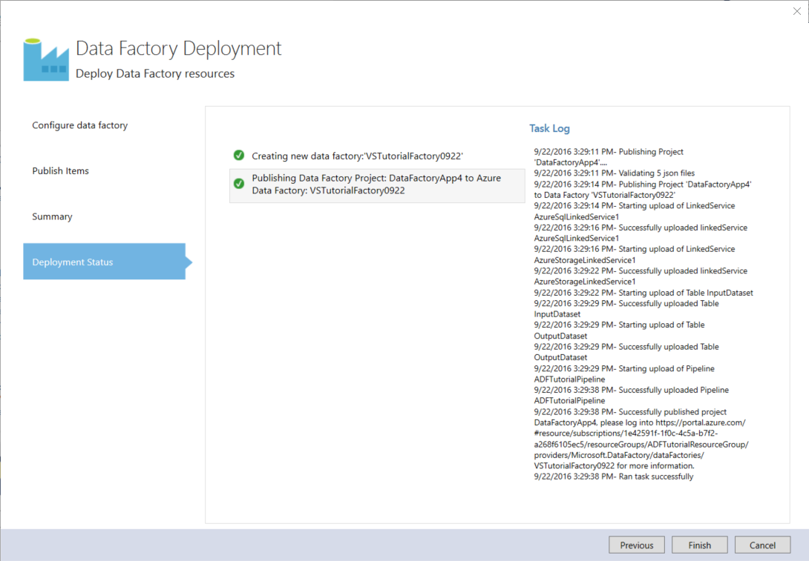

<properties 
    pageTitle="Esercitazione: Creare una pipeline con attività di copia utilizzando Visual Studio | Microsoft Azure" 
    description="In questa esercitazione, creare una pipeline di Azure Data Factory con un'attività di copia tramite Visual Studio." 
    services="data-factory" 
    documentationCenter="" 
    authors="spelluru" 
    manager="jhubbard" 
    editor="monicar"/>

<tags 
    ms.service="data-factory" 
    ms.workload="data-services" 
    ms.tgt_pltfrm="na" 
    ms.devlang="na" 
    ms.topic="get-started-article" 
    ms.date="10/17/2016" 
    ms.author="spelluru"/>

# Esercitazione: Creare una pipeline con attività di copia utilizzando Visual Studio
> [AZURE.SELECTOR]
- [Panoramica e i prerequisiti](data-factory-copy-data-from-azure-blob-storage-to-sql-database.md)
- [Copia guidata](data-factory-copy-data-wizard-tutorial.md)
- [Portale di Azure](data-factory-copy-activity-tutorial-using-azure-portal.md)
- [Visual Studio](data-factory-copy-activity-tutorial-using-visual-studio.md)
- [PowerShell](data-factory-copy-activity-tutorial-using-powershell.md)
- [Modelli di Azure Manager delle risorse](data-factory-copy-activity-tutorial-using-azure-resource-manager-template.md)
- [API REST](data-factory-copy-activity-tutorial-using-rest-api.md)
- [API .NET](data-factory-copy-activity-tutorial-using-dotnet-api.md)

In questa esercitazione viene illustrato come creare e monitorare una factory di Azure dati utilizzando Visual Studio. La pipeline di factory dati utilizza un'attività di copia per copiare i dati dallo spazio di archiviazione Blob Azure al Database SQL Azure.

Di seguito sono descritte le che operazioni come parte di questa esercitazione:

1. Creare due servizi collegati: **AzureStorageLinkedService1** e **AzureSqlinkedService1**. 

    Il AzureStorageLinkedService1 si collega un archiviazione Azure e AzureSqlLinkedService1 collega un database SQL Azure su factory dati: **ADFTutorialDataFactoryVS**. I dati di input per la pipeline risiedono in un contenitore di blob in archiviazione blob Azure e dati di output archiviati in una tabella nel database di SQL Azure. Di conseguenza, aggiungere questi archivi due dati come servizi collegati su factory dati.
2. Creare due set di dati: **InputDataset** e **OutputDataset**, che rappresentano i dati di input/output archiviata in archivi dati. 

    Per InputDataset, specificare il contenitore blob che contiene un blob con i dati di origine. Per OutputDataset, specificare la tabella SQL che contiene i dati di output. È inoltre possibile specificare altre proprietà, ad esempio struttura, disponibilità e criteri.
3. Creare una pipeline denominata **ADFTutorialPipeline** nel ADFTutorialDataFactoryVS. 

    La pipeline dispone di un' **Attività Copia** Copia input i dati da di Azure blob alla tabella SQL Azure output. L'attività di copia esegue lo spostamento dei dati di Azure Data Factory. L'attività è basata su un servizio disponibile a livello globale che è possibile copiare i dati tra diversi archivi di dati in modo sicuro, affidabile e scalabilità. Vedere l'articolo per informazioni dettagliate sull'attività Copia [Le attività di spostamento dei dati](data-factory-data-movement-activities.md) . 
4. Creare una factory dati denominata **VSTutorialFactory**. Distribuire la factory di dati e tutte le entità Factory dati (servizi collegati, tabelle e la pipeline).    

## Prerequisiti

1. Leggere l'articolo [Esercitazione Panoramica](data-factory-copy-data-from-azure-blob-storage-to-sql-database.md) e completare i passaggi **prerequisito** . 
2. Per poter pubblicare entità Factory dati su Factory di dati di Azure, è necessario essere un **amministratore della sottoscrizione Azure** .  
3. È necessario disporre dei seguenti prodotti installati nel computer in uso: 
    - Visual Studio 2013 o Visual Studio 2015
    - Scaricare Azure SDK per Visual Studio 2013 o Visual Studio 2015. Passare alla [Pagina di Download di Azure](https://azure.microsoft.com/downloads/) e fare clic su **VS 2013** o **VS 2015** nella sezione **.NET** .
    - Scaricare il plug-in Azure Data Factory più recenti per Visual Studio: [VS 2013](https://visualstudiogallery.msdn.microsoft.com/754d998c-8f92-4aa7-835b-e89c8c954aa5) o [VS 2015](https://visualstudiogallery.msdn.microsoft.com/371a4cf9-0093-40fa-b7dd-be3c74f49005). È inoltre possibile aggiornare il plug-in, eseguendo la procedura seguente: dal menu fare clic su **Strumenti** -> **Extensions e aggiornamenti** -> **Online** -> **Visual Studio Gallery** -> **Microsoft Azure dati Factory Tools per Visual Studio** -> **aggiornare**.

## Creazione di progetto di Visual Studio 
1. Avviare **Visual Studio 2013**. Fare clic su **File**, scegliere **Nuovo**e fare clic su **progetto**. Verrà visualizzato nella finestra di dialogo **Nuovo progetto** .  
2. Nella finestra di dialogo **Nuovo progetto** , selezionare il modello **DataFactory** e fare clic su **Progetto Factory dati vuoto**. Se il modello di DataFactory non è visualizzato, chiudere Visual Studio, installare Azure SDK per Visual Studio 2013 e riaprire Visual Studio.  

    

3. Immettere un **nome** per il progetto, **percorso**e un nome per la **soluzione**e fare clic su **OK**.

     

## Creazione di servizi collegati
Servizi collegati collegamento archivi dati o servizi a un factory Azure dati di elaborazione. Vedere [Archivia dati supportati](data-factory-data-movement-activities.md##supported-data-stores-and-formats) per tutte le origini e sink supportati per l'attività di copia. Vedere [calcolare servizi collegati](data-factory-compute-linked-services.md) per l'elenco di servizi di calcolo supportati dal produttore di dati. In questa esercitazione, non si utilizza un servizio di calcolo. 

In questo passaggio si crea due servizi collegati: **AzureStorageLinkedService1** e **AzureSqlLinkedService1**. AzureStorageLinkedService1 collegato collegamenti al servizio un Account di archiviazione di Azure e AzureSqlLinkedService collega un database SQL Azure su factory dati: **ADFTutorialDataFactory**. 

### Creare il servizio di archiviazione di Azure collegato

4. Pulsante destro del mouse **Servizi collegati** in Esplora soluzioni, scegliere **Aggiungi**e fare clic su **Nuovo elemento**.      
5. Nella finestra di dialogo **Aggiungi nuovo elemento** selezionare **Servizio di archiviazione di Azure collegate** dall'elenco e fare clic su **Aggiungi**. 

    
 
3. Sostituire `<accountname>` e `<accountkey>`* con il nome del proprio account Azure dello spazio di archiviazione e la relativa chiave. 

    

4. Salvare il file **AzureStorageLinkedService1.json** .

> Per ulteriori informazioni sulle proprietà JSON, vedere [spostare dati da/verso Blob Azure](data-factory-azure-blob-connector.md#azure-storage-linked-service) .

### Creare il servizio di SQL Azure collegato

5. Pulsante destro del mouse sul nodo **Servizi collegate** in **Esplora soluzioni** nuovamente, scegliere **Aggiungi**e fare clic su **Nuovo elemento**. 
6. In questo caso, selezionare **Servizio collegata SQL Azure**e fare clic su **Aggiungi**. 
7. Nel **file AzureSqlLinkedService1.json**, sostituire `<servername>`, `<databasename>`, `<username@servername>`, e `<password>` con i nomi del server SQL Azure, database, account utente e password.    
8.  Salvare il file **AzureSqlLinkedService1.json** . 

> [AZURE.NOTE]
> Per ulteriori informazioni sulle proprietà JSON, vedere [spostare dati da/verso il Database di SQL Azure](data-factory-azure-sql-connector.md#azure-sql-linked-service-properties) .

## Creare set di dati
Nel passaggio precedente è stato creato servizi collegati **AzureStorageLinkedService1** e **AzureSqlLinkedService1** collegare un account di archiviazione Azure e database SQL Azure factory dati: **ADFTutorialDataFactory**. In questo passaggio, è possibile definire due set di dati, ossia **InputDataset** e **OutputDataset** -- che rappresentano i dati di input/output archiviata in archivi dati riferimento rispettivamente AzureStorageLinkedService1 e AzureSqlLinkedService1. Per InputDataset, specificare il contenitore blob che contiene un blob con i dati di origine. Per OutputDataset, specificare la tabella SQL che contiene i dati di output.

### Creare set di dati input
In questo passaggio si crea un set di dati denominato **InputDataset** che fa riferimento a un contenitore di blob in archiviazione Azure rappresentata dal servizio **AzureStorageLinkedService1** collegato. Una tabella è un set di dati rettangolare ed è l'unico tipo di set di dati supportati immediatamente. 

9. Pulsante destro del mouse **tabelle** in **Esplora soluzioni**, scegliere **Aggiungi**e fare clic su **Nuovo elemento**.
10. Nella finestra di dialogo **Aggiungi nuovo elemento** selezionare **Blob Azure**e fare clic su **Aggiungi**.   
10. Sostituire il testo JSON con il testo seguente e salvare il file **AzureBlobLocation1.json** . 

        {
          "name": "InputDataset",
          "properties": {
            "structure": [
              {
                "name": "FirstName",
                "type": "String"
              },
              {
                "name": "LastName",
                "type": "String"
              }
            ],
            "type": "AzureBlob",
            "linkedServiceName": "AzureStorageLinkedService1",
            "typeProperties": {
              "folderPath": "adftutorial/",
              "format": {
                "type": "TextFormat",
                "columnDelimiter": ","
              }
            },
            "external": true,
            "availability": {
              "frequency": "Hour",
              "interval": 1
            }
          }
        }

     Noti quanto segue: 
    
    - set di dati di **tipo** viene impostato su **AzureBlob**.
    - **linkedServiceName** è impostato su **AzureStorageLinkedService**. Questo servizio collegato creato nel passaggio 2.
    - **folderPath** è impostato per il contenitore **adftutorial** . È anche possibile specificare il nome di un blob all'interno della cartella utilizzando la proprietà **nome file** . Dal momento che non si specifica il nome del blob, dati da tutti i BLOB nel contenitore viene considerati come un input di dati.  
    - **tipo** di formato è impostato su **formato testo**
    - Esistono due campi nel file di testo- **nome** e **Cognome** , separato da una virgola (**columnDelimiter**) 
    - La **disponibilità** è impostato su **ogni ora** (**frequenza** è impostata su **ora** e **intervallo** è impostato su **1**). Di conseguenza, Factory dati consente di cercare i dati di input ogni ora nella cartella radice del contenitore di blob (**adftutorial**) specificata. 
    
    Se non si specifica un **nome di file** per un set di dati di **input** , tutti i file/BLOB dalla cartella input (**folderPath**) vengono considerati come input. Se si specifica un nome di file nel JSON, solo lo specificato file/blob viene considerato asn input.
 
    Se non si specifica un **nome di file** per una **tabella di output**, i file generati in **folderPath** sono denominati nel formato seguente: dati. &lt;Guid\&gt;. txt (esempio: Data.0a405f8a-93ff-4c6f-b3be-f69616f1df7a.txt.).

    Per impostare **folderPath** e **nome del file** in modo dinamico in base alla data di **SliceStart** , utilizzare la proprietà **partitionedBy** . Nell'esempio seguente folderPath utilizza anno, mese e giorno da SliceStart (ora di inizio della sezione in fase di elaborazione) e nomefile utilizza ora dal SliceStart. Ad esempio, se in corso una sezione di produzione per 2016-09-20T08:00:00, nomecartella è impostata su wikidatagateway/wikisampledataout/2016/09/20 e il nome del file è impostato su 08.csv. 

            "folderPath": "wikidatagateway/wikisampledataout/{Year}/{Month}/{Day}",
            "fileName": "{Hour}.csv",
            "partitionedBy": 
            [
                { "name": "Year", "value": { "type": "DateTime", "date": "SliceStart", "format": "yyyy" } },
                { "name": "Month", "value": { "type": "DateTime", "date": "SliceStart", "format": "MM" } }, 
                { "name": "Day", "value": { "type": "DateTime", "date": "SliceStart", "format": "dd" } }, 
                { "name": "Hour", "value": { "type": "DateTime", "date": "SliceStart", "format": "hh" } } 

> [AZURE.NOTE]
> Per ulteriori informazioni sulle proprietà JSON, vedere [spostare dati da/verso Blob Azure](data-factory-azure-blob-connector.md#azure-blob-dataset-type-properties) .

### Creare set di dati di output
In questo passaggio si crea un set di dati di output denominato **OutputDataset**. Questo set di dati fa riferimento a una tabella SQL in database SQL Azure rappresentato da **AzureSqlLinkedService1**. 

11. Fare di nuovo **tabelle** in **Esplora soluzioni** , scegliere **Aggiungi**e fare clic su **Nuovo elemento**.
12. Nella finestra di dialogo **Aggiungi nuovo elemento** selezionare **SQL Azure**e fare clic su **Aggiungi**. 
13. Sostituire il testo JSON con JSON seguenti e salvare il file **AzureSqlTableLocation1.json** .

        {
          "name": "OutputDataset",
          "properties": {
            "structure": [
              {
                "name": "FirstName",
                "type": "String"
              },
              {
                "name": "LastName",
                "type": "String"
              }
            ],
            "type": "AzureSqlTable",
            "linkedServiceName": "AzureSqlLinkedService1",
            "typeProperties": {
              "tableName": "emp"
            },
            "availability": {
              "frequency": "Hour",
              "interval": 1
            }
          }
        }

     Noti quanto segue: 
    
    - set di dati di **tipo** viene impostato su **AzureSQLTable**.
    - **linkedServiceName** è impostato su **AzureSqlLinkedService** (questo servizio collegato è creato nel passaggio 2).
    - **TableName** è impostato su **emp**.
    - Sono disponibili tre colonne: **ID**, **nome**e **Cognome** -descritti nella tabella emp nel database. ID è una colonna di identità, pertanto è necessario specificare solo **nome** e **Cognome** .
    - La **disponibilità** è impostato su **ogni ora** (**frequenza** impostata su **ora** e **intervallo** impostato su **1**).  Il servizio Factory dati genera una sezione di dati di output ogni ora nella tabella **emp** nel database di SQL Azure.

> [AZURE.NOTE]
> Per ulteriori informazioni sulle proprietà JSON, vedere [spostare dati da/verso il Database di SQL Azure](data-factory-azure-sql-connector.md#azure-sql-linked-service-properties) .

## Creare pipeline 
È stata creata finora tabelle e servizi di ingresso/uscita collegati. A questo punto, si crea una pipeline con un' **Attività di copia** per copiare dati di Azure blob al database SQL Azure. 

1. Rapida **pipeline** in **Esplora soluzioni**, scegliere **Aggiungi**e fare clic su **Nuovo elemento**.  
15. Selezionare **Copia Pipeline di dati** nella finestra di dialogo **Aggiungi nuovo elemento** e fare clic su **Aggiungi**. 
16. Sostituire il JSON con JSON seguenti e salvare il file **CopyActivity1.json** .
            
        {
          "name": "ADFTutorialPipeline",
          "properties": {
            "description": "Copy data from a blob to Azure SQL table",
            "activities": [
              {
                "name": "CopyFromBlobToSQL",
                "type": "Copy",
                "inputs": [
                  {
                    "name": "InputDataset"
                  }
                ],
                "outputs": [
                  {
                    "name": "OutputDataset"
                  }
                ],
                "typeProperties": {
                  "source": {
                    "type": "BlobSource"
                  },
                  "sink": {
                    "type": "SqlSink",
                    "writeBatchSize": 10000,
                    "writeBatchTimeout": "60:00:00"
                  }
                },
                "Policy": {
                  "concurrency": 1,
                  "executionPriorityOrder": "NewestFirst",
                  "style": "StartOfInterval",
                  "retry": 0,
                  "timeout": "01:00:00"
                }
              }
            ],
            "start": "2015-07-12T00:00:00Z",
            "end": "2015-07-13T00:00:00Z",
            "isPaused": false
          }
        }

    Noti quanto segue:

    - Nella sezione attività esiste una sola attività il cui **tipo** sia impostata su **Copia**.
    - Input per l'attività è impostata su **InputDataset** e output per l'attività è impostato su **OutputDataset**.
    - Nella sezione **typeProperties** **BlobSource** viene specificato come tipo di origine e **SqlSink** viene specificato come tipo di sink.

    Sostituire il valore della proprietà **start** con il valore di giorno e di **Fine** corrente con il giorno successivo. È possibile specificare solo la parte di data e ignorare la parte dell'ora della data dell'ora. Ad esempio, "2016-02-03", che equivale a "2016-02-03T00:00:00Z"
    
    Entrambe inizio e fine date e ore deve essere in [formato ISO](http://en.wikipedia.org/wiki/ISO_8601). Ad esempio: 2016-10-14T16:32:41Z. L'ora di **Fine** è facoltativo, ma serve in questa esercitazione. 
    
    Se non si specifica valore per la proprietà di **Fine** , viene calcolato come "**inizio + 48 ore**". Per eseguire la pipeline di tempo indefinito, specificare **9999-09-09** come valore per la proprietà di **Fine** .
    
    Nell'esempio precedente sono 24 sezioni di dati, ogni ora prodotta di ogni sezione di dati.

## Pubblicare/distribuire entità Factory dati
In questo passaggio si pubblica entità Factory dati (servizi collegati, set di dati e pipeline) creata in precedenza. È inoltre possibile specificare il nome del nuovo factory di dati creati per contenere queste entità.  

18. Fare clic sul progetto in Esplora soluzioni e fare clic su **pubblica**. 
19. Se viene visualizzato la finestra di dialogo di **accedere al proprio account Microsoft** , immettere le credenziali dell'account che dispone di sottoscrizione Azure e fare clic su **Accedi**.
20. Viene visualizzato nella finestra di dialogo seguenti:

    
21. Nella pagina Configura dati factory, eseguire la procedura seguente: 
    1. opzione **Crea nuova Factory di dati** .
    2. Immettere **VSTutorialFactory** per **nome**.  
    
        > [AZURE.IMPORTANT]  
        > Il nome della factory dati Azure deve essere univoco globale. Se si riceve un errore relativo al nome di dati durante la pubblicazione, modificare il nome del produttore dati (ad esempio yournameVSTutorialFactory) e provare di nuovo a pubblicare. Vedere l'argomento relativo a [Dati Factory - regole di denominazione](data-factory-naming-rules.md) per le regole di denominazione per gli elementi di dati Factory.     
    3. selezionare l'abbonamento Azure per il campo di **sottoscrizione** .
     
        > [AZURE.IMPORTANT]Se non sono visualizzati tutti gli abbonamenti, assicurarsi che è stato eseguito utilizzando un account è un amministratore o co-amministratore della sottoscrizione.  
    4. selezionare il **gruppo di risorse** per la factory di dati da creare. 5. Selezionare l' **area** per la factory di dati. Solo aree geografiche supportate dal servizio Factory dati vengono visualizzate nell'elenco a discesa.
6. Fare clic su **Avanti** per passare alla pagina **Pubblica elementi** .
    
           
23. Nella pagina **Pubblicare articoli** , verificare che tutte le factory dati entità siano selezionate e fare clic su **Avanti** per passare alla pagina di **Riepilogo** .
    
         
24. Controllare il riepilogo e fare clic su **Avanti** per avviare il processo di distribuzione e visualizzare lo **Stato di distribuzione**.

    
25. Nella pagina **Stato di distribuzione** , verrà visualizzato lo stato del processo di distribuzione. Al termine della distribuzione, fare clic su Fine. 
     noti quanto segue: 

- Se viene visualizzato l'errore: "**l'abbonamento non è registrato per utilizzare spazio dei nomi Microsoft.DataFactory**", eseguire una delle operazioni seguenti e riprovare: 

    - In Azure PowerShell eseguire il seguente comando per registrare il provider di dati Factory. 
        
            Register-AzureRmResourceProvider -ProviderNamespace Microsoft.DataFactory
    
        È possibile eseguire il seguente comando per verificare che la Data Factory provider registrato. 
    
            Get-AzureRmResourceProvider
    - Accedere usando l'abbonamento Azure al [portale di Azure](https://portal.azure.com) e passare a una pala Factory dati (o) creare una factory di dati nel portale di Azure. Questa azione registra automaticamente il provider di necessità.
-   Il nome del produttore dati può essere registrato come un nome DNS in futuro e quindi diventano visibile pubblicamente.

> [AZURE.IMPORTANT] Per creare le istanze di Factory dati, è necessario essere un amministratore/co-amministratore della sottoscrizione Azure

## Riepilogo
In questa esercitazione, è stata creata una factory di dati di Azure per copiare dati da un Azure blob a un database SQL Azure. Si usava Visual Studio per creare la factory di dati, servizi collegati, set di dati e una pipeline. Ecco la procedura generale eseguita in questa esercitazione:  

1.  Creare una **factory di dati**di Azure.
2.  Creare **servizi collegati**:
    1. Un servizio di **Archiviazione Azure** collegati per collegare l'account di archiviazione Azure che contiene i dati di input.    
    2. Un servizio di **SQL Azure** collegati a collegare il database di SQL Azure che contiene i dati di output. 
3.  Creare **set di dati**, che descrivono i dati di input e dati di output per pipeline.
4.  Creata una **pipeline** con un' **Attività di copia** con **BlobSource** come origine e **SqlSink** come sink. 

## Usare Esplora Server per visualizzare le factory di dati

1. In **Visual Studio**, fare clic su **Visualizza** nel menu e fare clic su **Esplora Server**.
2. Nella finestra Esplora Server espandere **Azure** e **Factory dati**. Se viene visualizzato **accedere a Visual Studio**, immettere l' **account** associato all'abbonamento Azure e fare clic su **Continua**. Immettere **la password**e fare clic su **Accedi**. Visual Studio tenta di ottenere informazioni su factory dati Azure tutti nell'abbonamento. Viene visualizzato lo stato di questa operazione nella finestra **Elenco attività Factory dati** .
    
3. È possibile fare clic su factory dati e selezionare Esporta dati Factory nuovo progetto per creare un progetto di Visual Studio in base a una factory dati esistenti.
      

## Aggiornare dati Factory strumenti per Visual Studio
Per aggiornare gli strumenti di Azure Data Factory per Visual Studio, eseguire la procedura seguente:

1. Fare clic su dal menu **Strumenti** e selezionare **estensioni e aggiornamenti**. 
2. Selezionare **gli aggiornamenti** nel riquadro a sinistra e quindi selezionare **Visual Studio Gallery**.
4. Selezionare **Factory di dati di Azure tools per Visual Studio** e fare clic su **Aggiorna**. Se non viene visualizzata questa voce, si dispone già la versione più recente degli strumenti. 

Per istruzioni su come usare il portale di Azure per monitorare la pipeline e set di dati che è stato creato in questa esercitazione, vedere [pipeline e set di dati di Monitor](data-factory-copy-activity-tutorial-using-azure-portal.md#monitor-pipeline) .

## Vedere anche
| Argomento | Descrizione |
| :---- | :---- |
| [Attività di spostamento dei dati](data-factory-data-movement-activities.md) | In questo articolo fornisce informazioni dettagliate sull'attività copia utilizzato nell'esercitazione. |
| [Pianificazione e l'esecuzione](data-factory-scheduling-and-execution.md) | Questo articolo illustra gli aspetti pianificazione e l'esecuzione del modello di applicazione Azure Data Factory. |
| [Pipeline](data-factory-create-pipelines.md) | Questo articolo è utile comprendere tubazioni e le attività di Azure Data Factory |
| [Set di dati](data-factory-create-datasets.md) | Questo articolo è utile comprendere set di dati di Azure Data Factory.
| [Monitorare e gestire mediante il monitoraggio App](data-factory-monitor-manage-app.md) | In questo articolo viene descritto come monitorare, gestire ed eseguire il debug mediante il monitoraggio e gestione delle App. 
