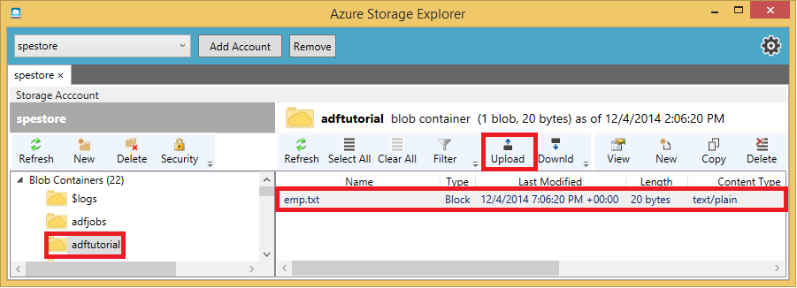

<properties
    pageTitle="Copiare i dati dallo spazio di archiviazione Blob al Database SQL | Microsoft Azure"
    description="In questa esercitazione viene illustrato come utilizzare Copia attività in una pipeline di Azure Data Factory per copiare i dati dallo spazio di archiviazione Blob al database SQL."
    Keywords="BLOB sql, archiviazione blob, copia dei dati"
    services="data-factory"
    documentationCenter=""
    authors="spelluru"
    manager="jhubbard"
    editor="monicar"/>

<tags
    ms.service="data-factory"
    ms.workload="data-services"
    ms.tgt_pltfrm="na"
    ms.devlang="na"
    ms.topic="article" 
    ms.date="09/26/2016"
    ms.author="spelluru"/>

# Copiare i dati dallo spazio di archiviazione Blob al Database SQL di utilizzo di dati 
> [AZURE.SELECTOR]
- [Panoramica e i prerequisiti](data-factory-copy-data-from-azure-blob-storage-to-sql-database.md)
- [Copia guidata](data-factory-copy-data-wizard-tutorial.md)
- [Portale di Azure](data-factory-copy-activity-tutorial-using-azure-portal.md)
- [Visual Studio](data-factory-copy-activity-tutorial-using-visual-studio.md)
- [PowerShell](data-factory-copy-activity-tutorial-using-powershell.md)
- [Modelli di Azure Manager delle risorse](data-factory-copy-activity-tutorial-using-azure-resource-manager-template.md)
- [API REST](data-factory-copy-activity-tutorial-using-rest-api.md)
- [API .NET](data-factory-copy-activity-tutorial-using-dotnet-api.md)

In questa esercitazione si crea una factory di dati con una pipeline di copiare i dati dallo spazio di archiviazione Blob al database SQL.

L'attività di copia esegue lo spostamento dei dati di Azure Data Factory. Viene attivato da un servizio disponibile a livello globale che è possibile copiare i dati tra diversi archivi di dati in modo sicuro, affidabile e scalabilità. Vedere l'articolo per informazioni dettagliate sull'attività Copia [Le attività di spostamento dei dati](data-factory-data-movement-activities.md) .  

> [AZURE.NOTE] Per informazioni dettagliate del servizio Factory dati, vedere l'articolo [Introduzione alle Azure Data Factory](data-factory-introduction.md) .

##Prerequisiti per l'esercitazione
Prima di iniziare questa esercitazione, è necessario disporre le operazioni seguenti:

- **Abbonamento azure**.  Se non si dispone di una sottoscrizione, è possibile creare un account di valutazione gratuito in pochi minuti. Vedere l'articolo di [Versione di valutazione gratuita](http://azure.microsoft.com/pricing/free-trial/) per informazioni dettagliate.
- **Account di archiviazione azure**. Usare lo spazio di archiviazione blob come un archivio di dati di **origine** in questa esercitazione. Se non si dispone di un account di archiviazione Azure, vedere l'articolo [creare un account di archiviazione](../storage/storage-create-storage-account.md#create-a-storage-account) per la procedura per crearne uno.
- **Database SQL azure**. Usare un database SQL Azure come un archivio di dati di **destinazione** in questa esercitazione. Se non si dispone di un database di SQL Azure che è possibile utilizzare in questa esercitazione, informazioni su [come creare e configurare un Database di SQL Azure](../sql-database/sql-database-get-started.md) crearne uno.
- **SQL Server 2012/2014 o Visual Studio 2013**. Usare SQL Server Management Studio o Visual Studio per creare un database di esempio e visualizzare i risultati del database.  

## Raccogliere chiave e il nome dell'account di archiviazione blob 
È necessario il nome dell'account e la chiave di account del proprio account Azure dello spazio di archiviazione per eseguire questa esercitazione. Nota **nome** dell'account e **chiave account** per il proprio account di archiviazione Azure.

1. Accedere al [portale di Azure](https://portal.azure.com/).
2. Fare clic su **altri servizi** nel menu a sinistra e selezionare **Gli account di archiviazione**.

    
3. In e il **Account di archiviazione** , selezionare l' **account di archiviazione Azure** che si desidera utilizzare in questa esercitazione.
4. Selezionare **i tasti di scelta** collegamento in **Impostazioni**.
5.  Fare clic sul pulsante **Copia** (immagine) accanto a casella di testo **nome dell'account di archiviazione** e Salva e incollarlo in un punto (ad esempio: in un file di testo).
6. Ripetere il passaggio precedente per copiare o nota verso il basso **chiave1**.
    
    
7. Chiudere tutte le pale facendo clic su **X**.

## Raccolta di SQL server, database, nomi utente
È necessario i nomi dei server SQL Azure, database e utente per eseguire questa esercitazione. Prendere nota delle nomi di **server**, **database**e **utente** per il database di SQL Azure.

1. Nel **portale di Azure**, fare clic su **altri servizi** a sinistra e selezionare **database SQL**.
2. In **blade di database SQL**, selezionare il **database** che si desidera utilizzare in questa esercitazione. Nota verso il basso il **nome del database**.  
3. Selezionare **le proprietà** e il **database di SQL** in **Impostazioni**.
4. Nota verso il basso i valori per **Il nome del SERVER** e **Accesso amministrazione SERVER**.
5. Chiudere tutte le pale facendo clic su **X**.

## Consentono ai servizi Azure per accedere a SQL server 
Assicurarsi **che **consente l'accesso a servizi Azure** impostazione attivato per il server di SQL Azure in modo che il servizio dati Factory può accedere al server di SQL Azure** . Per verificare e attivare questa impostazione, eseguire la procedura seguente:

1. Fare clic su **altri servizi** hub sul lato sinistro e fare clic su **SQL Server**.
2. Selezionare il server e fare clic su **Firewall** in **Impostazioni**. 
4. In e il **impostazioni del Firewall** , fare clic su **Sì** per **Consenti l'accesso ai servizi Azure**.
5. Chiudere tutte le pale facendo clic su **X**.

## Preparare archiviazione Blob e Database SQL 
Prepararsi a questo punto, dell'archiviazione blob Azure e il database di SQL Azure per l'esercitazione eseguendo la procedura seguente:  

1. Avviare Blocco note, incollare il testo seguente e salvarlo come **emp.txt** **C:\ADFGetStarted** cartella sul disco rigido.

        John, Doe
        Jane, Doe

2. Utilizzare gli strumenti, ad esempio [Esplora archivi Azure](https://azurestorageexplorer.codeplex.com/) per creare il contenitore **adftutorial** e caricare il file **emp.txt** al contenitore.

    
3. Utilizzare lo script SQL seguente per creare la tabella **emp** nel Database di SQL Azure.  

        CREATE TABLE dbo.emp
        (
            ID int IDENTITY(1,1) NOT NULL,
            FirstName varchar(50),
            LastName varchar(50),
        )
        GO

        CREATE CLUSTERED INDEX IX_emp_ID ON dbo.emp (ID);

    **Se si dispone di SQL Server 2012/2014 installato nel computer in uso:** seguire le istruzioni da [passaggio 2: connettersi al Database SQL della gestione di Database SQL Azure con SQL Server Management Studio](../sql-database/sql-database-manage-azure-ssms.md#Step2) articolo per connettersi al server SQL Azure ed eseguire lo script SQL. Questo articolo viene utilizzato il [portale di Azure classica](http://manage.windowsazure.com), non il [nuovo portale Azure](https://portal.azure.com), configurare firewall per un server SQL Azure.

    Se il client non è autorizzato ad accedere al server di SQL Azure, è necessario configurare firewall per il server di SQL Azure consentire l'accesso dal computer a (indirizzo IP). Vedere [questo articolo](../sql-database/sql-database-configure-firewall-settings.md) per istruzioni su come configurare il firewall per il server di SQL Azure.

È stato completato i prerequisiti. È possibile creare una factory dati utilizzando uno dei modi indicati di seguito. Fare clic su una delle schede nella parte superiore o i collegamenti seguenti per eseguire l'esercitazione.     

- [Portale di Azure](data-factory-copy-activity-tutorial-using-azure-portal.md)
- [Visual Studio](data-factory-copy-activity-tutorial-using-visual-studio.md)
- [PowerShell](data-factory-copy-activity-tutorial-using-powershell.md)
- [API REST](data-factory-copy-activity-tutorial-using-rest-api.md)
- [API .NET](data-factory-copy-activity-tutorial-using-dotnet-api.md)
- [Copia guidata](data-factory-copy-data-wizard-tutorial.md)
