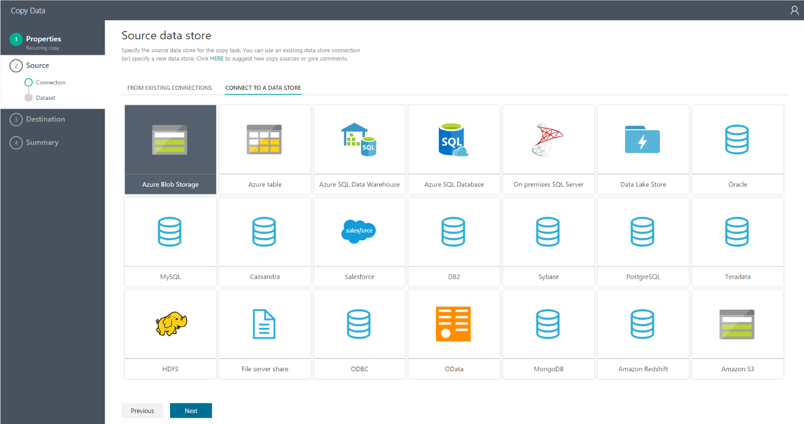
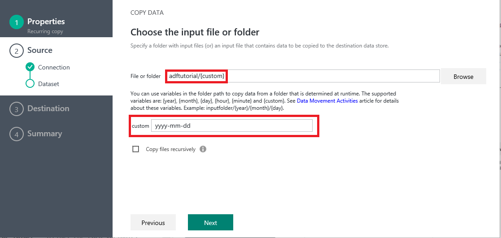

<properties
    pageTitle="Dati Factory Copia guidata | Microsoft Azure"
    description="Informazioni su come utilizzare dati Factory Copia guidata per copiare i dati da origini dati supportate in sink."
    services="data-factory"
    documentationCenter=""
    authors="spelluru"
    manager="jhubbard"
    editor="monicar"/>

<tags
    ms.service="data-factory"
    ms.workload="data-services"
    ms.tgt_pltfrm="na"
    ms.devlang="na"
    ms.topic="article"
    ms.date="09/29/2016"
    ms.author="spelluru"/>

# Dati Factory Copia guidata
Azure dati Factory Copia guidata consiste nel semplificare il processo di dati il caricamento, in genere sono il primo passo in uno scenario di integrazione dati-to-end. Se si utilizza la procedura guidata copia di Azure dati Factory, non è necessario comprendere le definizioni di JSON per servizi collegati, set di dati e pipeline. Tuttavia, dopo aver completato tutti i passaggi della procedura guidata, verrà creata automaticamente una pipeline per copiare i dati dall'origine dati selezionata nella destinazione selezionata. Inoltre, la procedura guidata copia consente di convalidare i dati il caricamento in fase di modifica, che consente di salvare gran parte del proprio tempo, soprattutto quando si sono il caricamento dei dati per la prima volta dall'origine dati. Per avviare la procedura guidata copia, fare clic sul riquadro **copiare i dati** nella home page del produttore dati.

## Una procedura guidata intuitiva per la copia di dati
Questa procedura guidata consente di spostare facilmente dati da una vasta gamma di origini a destinazioni in minuti. Dopo l'esecuzione della procedura guidata, pipeline con un'attività di copia viene creata automaticamente insieme entità Factory dati dipendenti (servizi collegati e set di dati). Nessun passaggi aggiuntivi necessari per creare la pipeline.   

> [AZURE.NOTE] Vedere l'articolo [Copia guidata esercitazione](data-factory-copy-data-wizard-tutorial.md) per istruzioni dettagliate per creare una pipeline di esempio per copiare dati da un Azure blob a una tabella di Database SQL Azure. 

La procedura guidata è progettata con dati in considerazione dall'inizio. È semplice ed efficiente all'autore pipeline Factory dati che si spostano centinaia di cartelle, file o le tabelle utilizzando la procedura guidata copiare i dati. La procedura guidata supporta le seguenti tre funzionalità: anteprima automatico dei dati, acquisizione schema e mapping e filtrare i dati. 

## Anteprima automatico dei dati 
Copia guidata consente di rivede una parte di dati dall'origine dati selezionata per la convalidare se i dati sia i dati corretti da copiare. Inoltre, se i dati di origine in un file di testo, la copia guidata analizza il file di testo per informazioni su riga e delimitatori di colonna e schema automaticamente. 

## Mapping e l'acquisizione di schema 
Lo schema dei dati di input potrebbe non corrispondere lo schema dei dati di output in alcuni casi. In questo scenario, è necessario innanzitutto mappare le colonne di schema di origine per le colonne di schema di destinazione. 

Copia guidata esegue automaticamente il mapping di colonne nello schema di origine per le colonne nello schema di destinazione. È possibile ignorare i mapping con elenchi a discesa (o) specificare se una colonna deve essere ignorato durante la copia i dati.   

## Filtro dei dati  
La procedura guidata consente di filtrare i dati di origine per selezionare solo i dati copiati all'archivio di dati di destinazione/sink. Filtro consente di ridurre il volume di dati da copiare all'archivio dati sink e pertanto migliora la velocità dell'operazione di copia. Fornisce un modo flessibile per filtrare i dati in un database relazionale utilizzando SQL query language (o) file in una cartella archivio blob Azure utilizzando [le variabili e le funzioni di Data Factory](data-factory-functions-variables.md).   

### Filtro dei dati in un database  
Nell'esempio, la query SQL utilizza il `Text.Format` funzione e `WindowStart` variabile. 

### Filtro dei dati in una cartella archivio blob Azure
È possibile utilizzare le variabili nel percorso della cartella per copiare i dati da una cartella che viene determinata in fase di esecuzione in base alle [variabili di sistema](data-factory-functions-variables.md#data-factory-system-variables). Le variabili supportate sono: **{anno}**, **{mese}**, **{day}**, **{ora}**, **{minuto}**e **{personalizzato}**. Esempio: CartellaInput / {anno} / {mese} / {giorno}.

Si supponga di disporre di input cartelle nel formato seguente:

    2016/03/01/01
    2016/03/01/02
    2016/03/01/03
    ...

Fare clic sul pulsante **Sfoglia** per **File o una cartella**, passare a una di queste cartelle (ad esempio 2016 -> 03 -> 01 -> 02), fare clic su **Scegli**. Dovrebbero essere visualizzati `2016/03/01/02` nella casella di testo. A questo punto, sostituire **2016** , **03** con **{mese}**, **01** con **{day}**e **02** **{**ora} **{anno}**e premere Tab. Dovrebbero essere visualizzate elenchi a discesa per selezionare il formato per questi quattro variabili:

   

Come illustrato nella schermata seguente, è possibile utilizzare una variabile di tipo **personalizzato** e le [stringhe di formato è supportato](https://msdn.microsoft.com/library/8kb3ddd4.aspx). Per selezionare una cartella alla struttura, utilizzare il pulsante **Sfoglia** prima di tutto. Sostituire un valore con **{personalizzato}**, quindi premere Tab per visualizzare la casella di testo in cui è possibile digitare la stringa di formato.     

## Supporto per dati diversi e tipi di oggetto
Tramite la creazione guidata copia, è possibile spostare in modo efficiente centinaia di cartelle, file o tabelle.

## Opzioni di programmazione
È possibile eseguire l'operazione di copia una sola volta o in una pianificazione (ogni ora, ogni giorno, e così via). Entrambe le opzioni utilizzabili per l'ampiezza dei connettori in locale, cloud e copia desktop locale.

Un'operazione su una copia unica consente una sola volta spostamento da un'origine dati a una destinazione. Si applica ai dati di qualsiasi dimensione e tutti i formati supportati. Copia programmata consente di copiare i dati in un determinato ricorrenza. È possibile utilizzare le impostazioni avanzate (ad esempio Riprova, timeout e avvisi) per configurare la copia pianificata.

## Passaggi successivi
Per una rapida procedura dettagliata dell'utilizzo di dati Factory Copia guidata per creare una pipeline con attività di copia, vedere [Esercitazione: creare una pipeline utilizzando Copia guidata](data-factory-copy-data-wizard-tutorial.md).
