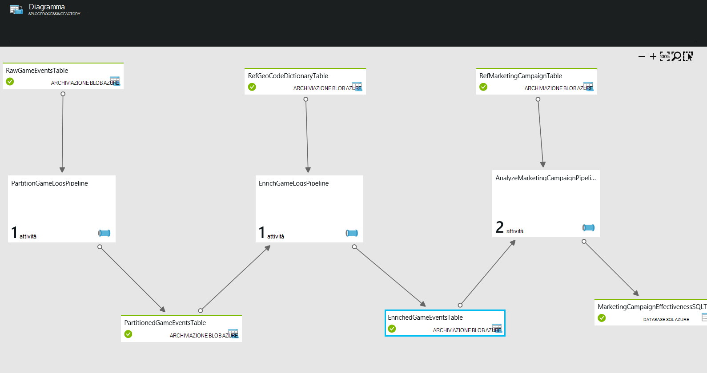

<properties 
    pageTitle="Use Case - profilo clienti" 
    description="Informazioni su come Factory di dati di Azure viene utilizzato per creare un basati sui dati flusso di lavoro (pipeline) per i clienti di gioco del profilo." 
    services="data-factory" 
    documentationCenter="" 
    authors="sharonlo101" 
    manager="jhubbard" 
    editor="monicar"/>

<tags 
    ms.service="data-factory" 
    ms.workload="data-services" 
    ms.tgt_pltfrm="na" 
    ms.devlang="na" 
    ms.topic="article" 
    ms.date="09/06/2016" 
    ms.author="shlo"/>

# Use Case - profilo clienti

Azure Data Factory corrisponde a uno dei molti servizi utilizzati per implementare la famiglia di Business Intelligence Cortana di acceleratori.  Per ulteriori informazioni sulla Business Intelligence di Cortana, visitare [Cortana Intelligence famiglia di prodotti](http://www.microsoft.com/cortanaanalytics). In questo documento vengono descritte un caso di semplice utilizzo per informazioni su come iniziare a utilizzare la comprensione come Azure Data Factory può aiutare a risolvere problemi comuni relativi analitica.

È necessario accedere e provare a utilizzare questo caso di semplice utilizzo è un [abbonamento Azure](https://azure.microsoft.com/pricing/free-trial/).  È possibile distribuire un esempio che consente di implementare in questo caso di utilizzo mediante seguendo la procedura descritta nell'articolo [esempi](data-factory-samples.md) .

## Scenario:

Contoso è una società di gioco che consente di creare giochi per più piattaforme: gioco console, dispositivi portatile e personal computer (PC). Come i lettori riprodurre questi giochi, viene prodotta volume elevato di dati del registro che tiene traccia dei criteri di utilizzo, stile di gioco e delle preferenze dell'utente.  In combinazione con demografici, internazionali e dati di prodotto, Contoso possono essere eseguite analitica per istruzioni su come migliorare l'esperienza dei lettori e destinazione di aggiornamenti e gioco acquisti. 

Obiettivo di Contoso è per identificare le opportunità di vendita freccia su/vendite incrociate in base a cronologia gioco dei lettori e aggiungere caratteristiche accattivanti crescita aziendale e assicurare un'esperienza migliore ai clienti. In questo caso, usare una società gioco viene utilizzato come un esempio dell'impresa. La società desidera ottimizzare la giochi basati sul comportamento dei lettori. Questi principi si applicano a qualsiasi azienda in cui deve essere esercitare suoi clienti intorno propri prodotti e servizi e migliorare l'esperienza dei clienti.

## Problemi

## Panoramica della soluzione

In questo caso di semplice utilizzo può essere utilizzato come un esempio di come è possibile utilizzare Azure Data Factory per il caricamento, preparare, trasformazione, analizzare e pubblicare i dati.

Questa figura viene illustrato come la pipeline di dati vengono visualizzati nel portale di Azure dopo la distribuzione.

1.  **PartitionGameLogsPipeline** legge gli eventi gioco dallo spazio di archiviazione blob e crea partizioni in base alle anno, mese e giorno.
2.  **EnrichGameLogsPipeline** unisce gli eventi di gioco partizionati con dati di riferimento codice geografico e faciliti la i dati tramite il mapping di indirizzi IP per i percorsi geografico corrispondenti.
3.  La pipeline **AnalyzeMarketingCampaignPipeline** utilizza dati migliorati e processi con i dati relative alla pubblicità per creare l'output finale che contiene l'efficacia delle campagne marketing.

In questo esempio viene utilizzata una Factory di dati per poter gestire le attività che copiare dati di input, trasformazione e processo i dati e l'output dei dati finali a un Database di SQL Azure.  È anche possibile visualizzare alla rete della pipeline di dati, gestirli e monitorarne lo stato dall'interfaccia utente.

## Vantaggi

Ottimizzazione analitica i profili utente e allineamento agli obiettivi aziendali, società gioco in grado di raccogliere i modelli di utilizzo e analizzare rapidamente l'efficacia relativa campagne di marketing.

