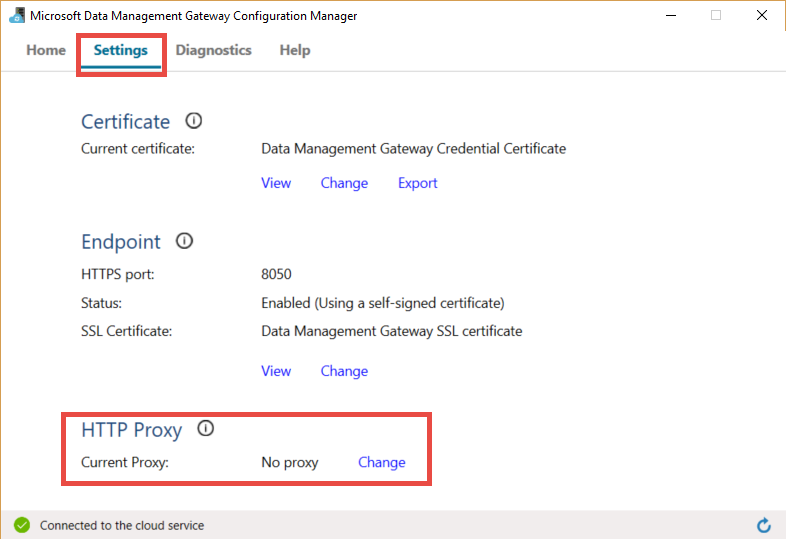
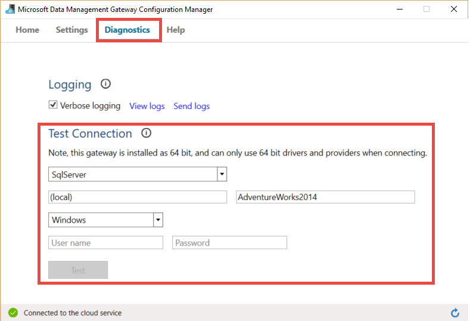
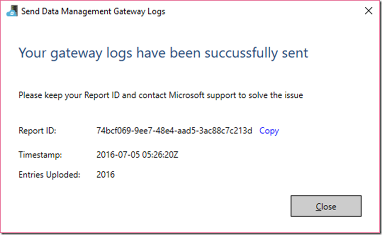
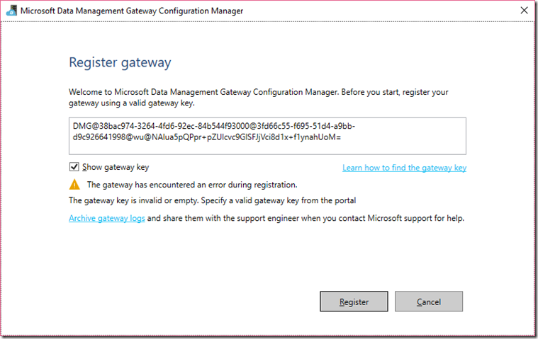
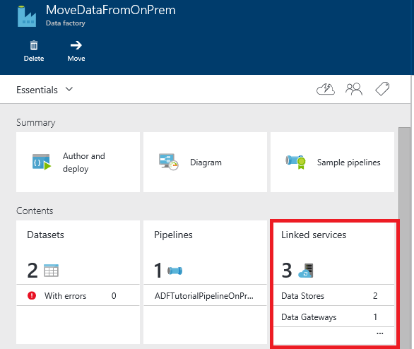
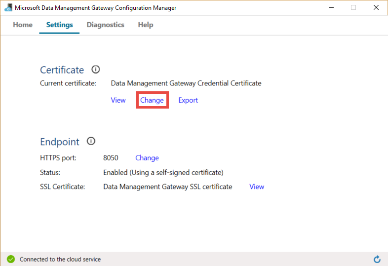

<properties 
    pageTitle="Gateway di gestione di dati per dati Factory | Microsoft Azure"
    description="Configurare un gateway di dati per spostare i dati tra locale e nel cloud. Usare Gateway di gestione dati di Azure Data Factory per spostare i dati." 
    services="data-factory" 
    documentationCenter="" 
    authors="linda33wj" 
    manager="jhubbard" 
    editor="monicar"/>

<tags 
    ms.service="data-factory" 
    ms.workload="data-services" 
    ms.tgt_pltfrm="na" 
    ms.devlang="na" 
    ms.topic="article" 
    ms.date="10/11/2016" 
    ms.author="jingwang"/>

# Gateway di gestione dati
Il Gateway di gestione dati è un agente di client che è necessario installare nel proprio ambiente locale per copiare dati tra gli archivi dati cloud e locale. Gli archivi dati locali supportati dal produttore dati sono elencati nella sezione [origini dati supportate](data-factory-data-movement-activities.md##supported-data-stores) . 

> [AZURE.NOTE] Attualmente gateway supporta solo la copia e stored procedure attività nella Data Factory. Non è possibile utilizzare il gateway da un'attività personalizzata per accedere a origini dati locali. 

In questo articolo si integra con la procedura dettagliata il [spostare i dati tra locali e cloud archivi dati](data-factory-move-data-between-onprem-and-cloud.md) articolo. Nella procedura dettagliata, si crea una pipeline che utilizza il gateway per spostare i dati da un database di SQL Server locale a un archivio blob Azure. In questo articolo fornisce informazioni approfondite su Gateway di gestione dati.   

## Panoramica

### Funzionalità del gateway di gestione dei dati
Gateway di gestione dati offre le funzionalità seguenti:

- Modello di origini dati locali e cloud origini dati all'interno della stessa factory di dati e spostare i dati.
- Avere un'unica interfaccia per il monitoraggio e la gestione con la visibilità sullo stato del gateway da e il produttore di dati.
- Gestire l'accesso alle origini dati locali in modo sicuro.
    - Nessuna modifica è necessaria un firewall aziendale. Gateway rende solo le connessioni in uscita per aprire internet basate su HTTP.
    - Crittografare le credenziali per il punto vendita dati locali con il certificato.
- Spostare i dati in modo efficiente, i dati vengono trasferiti in parallelo, problemi di rete adattabile alle intermittente con auto Riprova logica.

### Comando flusso e flusso di dati
Quando si usa un'attività di copia per copiare i dati tra locali e cloud, l'attività utilizza un gateway per trasferire i dati dall'origine dati locali al cloud e viceversa.

Dati di alto livello qui flusso per e riepilogo dei passaggi per la copia con gateway dati: 

1.  Per un produttore di dati di Azure tramite il [portale di Azure](https://portal.azure.com) e [Cmdlet di PowerShell](https://msdn.microsoft.com/library/dn820234.aspx)dati viene creato un gateway. 
2.  Sviluppo di dati crea un servizio collegato per un archivio di dati in locale specificando il gateway. Durante la configurazione di servizi collegati, sviluppatore dati utilizza l'applicazione di impostare le credenziali per specificare le credenziali e tipi di autenticazione.  La finestra di dialogo Impostazione credenziali applicazione comunica con l'archivio di dati per verificare la connessione e il gateway per salvare le credenziali.
3. Gateway crittografa le credenziali con il certificato associato al gateway (fornito dal sviluppatore dati), prima di salvare le credenziali nel cloud.
4. Servizio Data Factory comunica con il gateway per la pianificazione e gestione dei processi tramite un canale di controllo che utilizza una coda di bus di servizi condivisi di Azure. Quando un processo attività copia deve essere persa, Data Factory Accoda la richiesta insieme a informazioni sulle credenziali. Gateway verrà avviato il processo di dopo polling della coda.
5.  Il gateway decrittografa le credenziali con lo stesso certificato e quindi si connette all'archivio dati locale con le credenziali e il tipo di autenticazione appropriata.
6.  Il gateway copia dati da un archivio locale in un file di archiviazione cloud o viceversa in base alla configurazione di attività Copia la pipeline di dati. Per questo passaggio, il gateway comunica direttamente con i servizi di archiviazione basata su cloud, ad esempio archivio Blob Azure tramite un canale protetto (HTTPS).

### Considerazioni per l'utilizzo di gateway
- Una singola istanza di Gateway di gestione dati è utilizzabile per più origini dati locali. Tuttavia, **un'istanza di gateway singola è collegata a un solo factory Azure dati** e non può essere condiviso con un altro stabilimento di dati.
- È consentito **solo un'istanza di Gateway di gestione dati** installata in un unico computer. Si supponga, si dispone di due factory di dati che è necessario accedere a origini dati locali, è necessario installare gateway in due computer locale. In altre parole, un gateway è collegato a una factory dati specifici
- **Gateway non è necessario essere nello stesso computer come origine dati**. Tuttavia, visto gateway all'origine dati riduce il tempo per il gateway per connettersi all'origine dati. È consigliabile installare il gateway su un computer diverso da quello che ospita origine dati locale. Dopo aver configurato l'origine dati e gateway su computer diversi, il gateway non è in concorrenza per le risorse con origine dati.
- È possibile impostare **più gateway in diversi computer che si connettono alla stessa origine dati in locale**. Ad esempio, può avere due gateway che servono due factory dati ma la stessa origine dati locale è registrata con entrambe le factory di dati.
- Se si dispone già di un gateway installato nel computer che servono uno scenario di **Power BI** , installare un **gateway separato per Azure Data Factory** su un altro computer.
- Gateway deve essere utilizzato anche quando si utilizza **ExpressRoute**.
- Indicazione dell'origine dati a un'origine dati locale, ovvero un firewall, anche quando si utilizza **ExpressRoute**. Utilizzare il gateway per stabilire la connessione tra il servizio e l'origine dati.
- Anche se l'archivio di dati nel cloud una **Macchina virtuale IaaS Azure**, è necessario **utilizzare il gateway** . 

## Installazione

### Prerequisiti
- Le versioni di **sistemi operativi** supportate sono Windows 7, Windows 8/8.1, Windows 10, Windows Server 2008 R2, Windows Server 2012, Windows Server 2012 R2. Installazione di Gateway di gestione dati in un controller di dominio non è supportato.
- .NET framework 4.5.1 o versioni successive. Se si sta installando gateway su un computer Windows 7, installare .NET Framework 4.5 o versioni successive. Per informazioni dettagliate, vedere [Requisiti di sistema di .NET Framework](https://msdn.microsoft.com/library/8z6watww.aspx) . 
- La **configurazione** consigliata per il computer gateway è almeno 2 GHz, 4 core, 8 GB di RAM e disco 80 GB.
- Se il computer host sospende, il gateway non risponde alle richieste di dati. Pertanto, è possibile configurare un appropriato **combinazione risparmio di energia** nel computer prima di installare il gateway. Se il computer è configurato per sospensione, l'installazione di gateway richiede un messaggio.
- È necessario essere un amministratore del computer per installare e configurare il Gateway di gestione dati correttamente. È possibile aggiungere altri utenti al gruppo di Windows locale **Agli utenti di Gateway di gestione dati** . I membri di questo gruppo possono usare lo strumento di gestione di dati configurazione di Gateway per configurare il gateway. 

Come viene eseguito attività copia viene eseguita in una frequenza specifica, l'utilizzo delle risorse (CPU, memoria) nel computer segue anche lo stesso modello con punta e di inattività. Utilizzo delle risorse anche dipende molto la quantità di dati da spostare. Dopo aver configurato più processi di copia in corso, viene visualizzato l'uso delle risorse salire di orari di punta. 

### Opzioni di installazione
Gateway di gestione dati può essere installato nei modi seguenti: 

- Scaricare un file MSI configurazione pacchetto dall' [Area Download Microsoft](https://www.microsoft.com/download/details.aspx?id=39717).  Il file MSI è utilizzabile anche eseguire l'aggiornamento di Gateway di gestione dati esistenti per la versione più recente, con tutte le impostazioni mantenute.
- Facendo clic su collegamento **scaricare e installare il gateway di dati** in configurazione manuale o **installare direttamente nel computer in uso** in imposta EXPRESS. Vedere l'articolo [spostare dati tra locali e cloud](data-factory-move-data-between-onprem-and-cloud.md) per istruzioni dettagliate sull'uso di esprimere il programma di installazione. Il passaggio manuale consente di accedere all'interfaccia di download.  Le istruzioni per scaricare e installare il gateway dall'area download disponibili nella sezione successiva. 

### Procedure consigliate installazione:
1.  Configurare il risparmio di energia sul computer host del gateway in modo che il computer non sospensione. Se il computer host sospende, il gateway non risponde alle richieste di dati.
2.  Eseguire il backup il certificato associato il gateway.

### Installare gateway dall'area download
1. Passare alla [pagina di download di Gateway di gestione dati Microsoft](https://www.microsoft.com/download/details.aspx?id=39717). 
2. Fare clic su **Download**, selezionare la versione appropriata (**32 bit** e **64 bit**) e fare clic su **Avanti**. 
3. Eseguire il **file MSI** direttamente o salvarlo nel disco rigido ed eseguire.
4. Nella pagina di **benvenuto** , selezionare una **lingua** fare clic su **Avanti**.
5. **Accetta** il contratto di licenza per l'utente finale e fare clic su **Avanti**. 
6. Selezionare **cartella** per installare il gateway e fare clic su **Avanti**. 
7. Nella pagina **pronto per l'installazione** , fare clic su **Installa**. 
8. Fare clic su **Fine** per completare l'installazione.
9. Ottenere la chiave dal portale di Azure. Vedere la sezione successiva per istruzioni dettagliate. 
10. Nella pagina **registrare gateway** di **Gestione configurazione di Gateway di gestione di dati** in esecuzione nel computer in uso, eseguire la procedura seguente: 
    1. Incollare la chiave nel testo.
    2. Facoltativamente, fare clic su **Mostra chiave di gateway** per visualizzare il testo chiave.
    3. Fare clic su **Registra**. 

### Registrare gateway mediante chiave

#### Se si è già creati un gateway logico nel portale
Per creare un gateway nel portale e ottenere la chiave da e il **Configura** , seguire i passaggi da questa procedura dettagliata, vedere l'articolo [spostare dati tra locali e cloud](data-factory-move-data-between-onprem-and-cloud.md) .    

#### Se già stato creato il gateway logico nel portale
1. Nel portale di Azure, passare a e il **Produttore di dati** e fare clic sul riquadro **Servizi collegati** .

    
2. Nella finestra e **Servizi collegati** , selezionare logico **gateway** creato nel portale. 

      
2. Selezionare **scaricare e installare il gateway di dati**e il **Gateway di dati** .

       
3. Selezionare **ricreare chiave**e il **configurato automaticamente** . Fare clic su Sì nel messaggio di avviso dopo aver letto con attenzione.

    
4. Fare clic su pulsante Copia accanto il tasto. Il tasto viene copiato negli Appunti.
    
     

### Le icone sulla barra delle applicazioni di sistema / notifiche
Nella figura seguente vengono illustrate alcune delle icone sulla barra delle applicazioni che viene visualizzato. 

Se si spostare il cursore sul messaggio di notifica/icona sulla barra delle applicazioni del sistema, viene visualizzato lo stato dell'operazione di gateway/aggiornamento in una finestra popup i dettagli.

### Porte e protocolli di firewall
Esistono due firewall è necessario considerare: **un firewall aziendale** in esecuzione su router centrale dell'organizzazione e **Windows firewall** configurato come daemon nel computer locale in cui è installato il gateway.  

Livello di un firewall aziendale, è necessario configurare i seguenti domini e in uscita:

| Nomi di dominio | Porte | Descrizione |
| ------ | --------- | ------------ |
| *. servicebus.windows.net | 80, 443 | Listener nel servizio Bus inoltro su TCP (richiede 443 per l'acquisizione di token di controllo dell'accesso) | 
| *. servicebus.windows.net | 5671 9350-9354 | Inoltro di bus servizio facoltativo su TCP | 
| *. core.windows.net | 443 | HTTPS | 
| *. clouddatahub.net | 443 | HTTPS | 
| Graph.Windows.NET | 443 | HTTPS |
| Login.Windows.NET | 443 | HTTPS | 

Livello di windows firewall, le porte in uscita in genere sono abilitate. Se non è possibile configurare le porte e i domini di conseguenza nel computer gateway.

#### Copiare i dati da un archivio di dati di origine in un archivio di dati sink

Assicurarsi che le regole del firewall abilitate correttamente nel firewall aziendale, Windows firewall nel computer gateway e i dati archivio stesso. Attivazione di queste regole consente il gateway per connettersi a entrambi origine ed elaborare correttamente. Abilitare le regole per ogni archivio di dati che coinvolte nell'operazione di copia.

Ad esempio, per copiare da **un archivio di dati in locale a un Database SQL Azure sink o un Data Warehouse SQL Azure elaborare**, eseguire la procedura seguente: 

- Consentire le comunicazioni in uscita **TCP** porta **1433** per Windows firewall e un firewall aziendale
- Configurare le impostazioni del firewall di SQL Azure per aggiungere l'indirizzo IP del computer gateway nell'elenco di indirizzi IP consentiti. 

### Considerazioni sui server proxy
Se l'ambiente di rete aziendale utilizza un server proxy per accedere a internet, configurare Gateway di gestione di dati per usare le impostazioni del proxy appropriato. È possibile impostare il proxy durante la fase di registrazione iniziale. 

Gateway utilizza il server proxy per connettersi al servizio cloud. Fare clic su **Modifica** collegamento durante l'installazione e configurazione iniziali. Visualizzare la finestra di dialogo **impostazioni proxy** .

Esistono tre opzioni di configurazione: 

- **Non usare proxy**: Gateway non utilizzare in modo esplicito qualsiasi proxy per connettersi ai servizi cloud.
- **Utilizza proxy di sistema**: Gateway utilizza le impostazioni proxy configurato nel diahost.exe.config.  Se nessun proxy è configurato in diahost.exe.config, gateway la connessione al servizio cloud direttamente senza passano attraverso il proxy.
- **Utilizzare proxy personalizzato**: configurare le impostazioni da utilizzare per il gateway, invece di usare le configurazioni in diahost.exe.config del proxy HTTP.  Indirizzo e la porta necessari.  Nome utente e Password sono facoltativi a seconda delle impostazioni di autenticazione del proxy.  Tutte le impostazioni di crittografia con il certificato di credenziali del gateway e archiviate in locale nel computer host gateway.

Il servizio di Host Gateway di gestione dati riavvia automaticamente dopo aver salvato le impostazioni proxy aggiornate. 

Dopo gateway è stato registrato, se si desidera visualizzare o aggiornare le impostazioni del proxy, usare Gestione configurazione di Gateway di gestione di dati. 

1. Avviare Gestione configurazione di Gateway di gestione di dati.
2. Passare alla scheda **Impostazioni** .
3. Fare clic sul collegamento **Modifica** nella sezione **HTTP Proxy** per avviare la finestra di dialogo **Imposta Proxy HTTP** .  
4. Dopo aver fatto clic sul pulsante **Avanti** , viene visualizzato un messaggio di avviso chiede l'autorizzazione per salvare le impostazioni proxy e riavviare il servizio Host Gateway.

È possibile visualizzare e aggiornare proxy HTTP con lo strumento di Gestione configurazione. 

> [AZURE.NOTE] Se è stato configurato un server proxy con autenticazione NTLM, viene eseguito il servizio Host Gateway con l'account di dominio. Se si cambia la password per l'account di dominio in un secondo momento, è necessario aggiornare le impostazioni di configurazione per il servizio e riavviare conseguenza. A causa di questo requisito, si consiglia di che utilizzare un account di dominio dedicato per accedere al server proxy che non è necessario aggiornare la password di frequente.

### Configurare le impostazioni del server proxy in diahost.exe.config
Se si seleziona l'impostazione per il proxy HTTP **proxy del sistema di utilizzo** , gateway utilizza l'impostazione in diahost.exe.config del proxy.  Se viene specificato alcun proxy in diahost.exe.config, gateway la connessione al servizio cloud direttamente senza passano attraverso il proxy. La procedura seguente vengono fornite istruzioni per l'aggiornamento del file di configurazione. 

1.  In Esplora File, eseguire una copia attendibile di c:\Programmi\Microsoft c:\Programmi\Microsoft dati gestione Gateway\2.0\Shared\diahost.exe.config per eseguire il backup del file originale.
2.  Avviare Notepad.exe eseguito come amministratore e aprire file di testo "c:\Programmi\Microsoft c:\Programmi\Microsoft dati gestione Gateway\2.0\Shared\diahost.exe.config. Trovare il tag predefinito per system.net come nell'esempio seguente:

            <system.net>
                <defaultProxy useDefaultCredentials="true" />
            </system.net>   

    È quindi possibile aggiungere informazioni sul server proxy come illustrato nell'esempio seguente:

            <system.net>
                  <defaultProxy enabled="true">
                        <proxy bypassonlocal="true" proxyaddress="http://proxy.domain.org:8888/" />
                  </defaultProxy>
            </system.net>

    Proprietà aggiuntive consentite all'interno del tag proxy per specificare le impostazioni necessarie come scriptLocation. Fare riferimento al [proxy elemento (impostazioni di rete)](https://msdn.microsoft.com/library/sa91de1e.aspx) sulla sintassi.

            <proxy autoDetect="true|false|unspecified" bypassonlocal="true|false|unspecified" proxyaddress="uriString" scriptLocation="uriString" usesystemdefault="true|false|unspecified "/>

3. Salvare il file di configurazione nella posizione originale, quindi riavviare il servizio Host del Gateway gestione dati, visualizzi le modifiche apportate. Per riavviare il servizio: usare applet Servizi dal Pannello di controllo o da **Gestione configurazione di Gateway di gestione dati** > fare clic sul pulsante **Arresta servizio** e quindi fare clic su **Avvia servizio**. Se non viene avviato il servizio, è probabile che è stata aggiunta una sintassi di tag XML errata nel file di configurazione dell'applicazione che è stato modificato.     

Oltre a questi punti, è necessario assicurarsi che Microsoft Azure nella proprietà consentite della società. L'elenco di indirizzi IP di Microsoft Azure può essere scaricato dall' [Area Download Microsoft](https://www.microsoft.com/download/details.aspx?id=41653).

#### Possibili sintomi per problemi correlati al server proxy e firewall
Se si verificano errori simili a quelli seguenti, è probabile a causa di configurazione non corretta del server proxy o firewall che blocca gateway di connettersi ai dati Factory per autenticarsi. Consultare la sezione precedente per assicurarsi che il firewall e server proxy siano configurati correttamente.

1.  Quando si tenta di registrare il gateway, viene visualizzato l'errore seguente: "Impossibile registrare la chiave di gateway. Prima di registrare nuovamente la chiave di gateway, verificare che il Gateway di gestione dati è in stato di connessione e viene avviato il servizio di Host Gateway di gestione dati."
2.  Quando si apre Configuration Manager, viene visualizzato lo stato come "Disconnesso" o "Connessione". Quando si visualizza i registri eventi di Windows, in "Visualizzatore eventi" > "Registri applicazioni e servizi" > "Gateway di gestione di dati," vengono visualizzati messaggi di errore, ad esempio l'errore seguente:`Unable to connect to the remote server` 
    `A component of Data Management Gateway has become unresponsive and restarts automatically. Component name: Gateway.`

### Aprire la porta 8050 per la crittografia delle credenziali 
L'applicazione di **Impostare le credenziali** utilizza la porta in ingresso **8050** per l'inoltro delle credenziali al gateway quando si configura un locale collegata servizio nel portale di Azure. Durante la configurazione del gateway, per impostazione predefinita, l'installazione di Gateway di gestione dati aperto nel computer gateway.
 
Se si usa un firewall di terze parti, è possibile aprire manualmente la porta 8050. Se si verificano problemi firewall durante la configurazione del gateway, provare a usare il comando seguente per installare il gateway senza configurare il firewall.

    msiexec /q /i DataManagementGateway.msi NOFIREWALL=1

Se non si desidera aprire la porta 8050 nel computer gateway, usare meccanismi diversa da quella mediante l'applicazione di **Impostare le credenziali** per configurare le credenziali dell'archivio di dati. Ad esempio, è possibile utilizzare i cmdlet di PowerShell [AzureRmDataFactoryEncryptValue di nuovo](https://msdn.microsoft.com/library/mt603802.aspx) . Vedere la sezione relativa [all'impostazione credenziali e la sicurezza](#set-credentials-and-securityy) come dati archiviare le credenziali può essere impostata.

## Aggiornamento 
Per impostazione predefinita, Gateway di gestione dati viene aggiornato automaticamente quando è disponibile una versione più recente del gateway. Il gateway non viene aggiornato fino a quando non vengono eseguite tutte le attività pianificate. Nessun nessun'altra vengono elaborati dal gateway fino al termine dell'operazione di aggiornamento. Se l'aggiornamento non riesce, gateway viene ripristinata la versione precedente. 

Viene visualizzato il tempo di aggiornamento pianificato nelle posizioni seguenti:

- E di proprietà il gateway nel portale di Azure.
- Home page di Gateway di configurazione di gestione dati
- Messaggio di notifica sulla barra delle applicazioni di sistema. 

Scheda Home di Gateway di configurazione di gestione dati consente di visualizzare la pianificazione di aggiornamento e l'ora dell'ultima il gateway è stato installato/aggiornare. 

È possibile installare subito l'aggiornamento o attendere che il gateway venga aggiornato automaticamente all'ora pianificata. Ad esempio, l'immagine seguente mostra il messaggio di notifica visualizzato in Gestione configurazione di Gateway con il pulsante Aggiorna che è possibile fare clic per installare immediatamente. 

Il messaggio di notifica sulla barra delle applicazioni sarebbe come illustrato nell'immagine seguente: 

Viene visualizzato lo stato dell'operazione di aggiornamento (manuale o automatica) sulla barra delle applicazioni. Quando si avvia Gestione configurazione di Gateway successivo, viene visualizzato un messaggio sulla barra di notifica che il gateway è stato aggiornato insieme a un collegamento a [nuovo argomento](data-factory-gateway-release-notes.md).

### Per disabilitare o abilitare funzionalità di aggiornamento automatico
È possibile disabilitare o abilitare la funzionalità di aggiornamento automatico eseguendo la procedura seguente: 

1. Avviare Windows PowerShell nel computer gateway. 
2. Passare alla cartella c:\Programmi\Microsoft c:\Programmi\Microsoft dati gestione Gateway\2.0\PowerShellScript.
3. Esegui portare in primo piano il seguente comando per attivare l'aggiornamento automatico di disattivare.   

        .\GatewayAutoUpdateToggle.ps1  -off

4. Per riattivarlo: 
    
        .\GatewayAutoUpdateToggle.ps1  -on  

## Gestione configurazione 
Dopo avere installato il gateway, è possibile avviare Gestione configurazione di Gateway di gestione di dati in uno dei modi seguenti: 

- Nella finestra di **ricerca** , digitare **Il Gateway di gestione di dati** per accedere a questa utilità. 
- Eseguire l' eseguibile **ConfigManager.exe** nella cartella: **C:\Programmi\Microsoft c:\Programmi\Microsoft dati gestione Gateway\2.0\Shared** 
 
### Home page
Home page consente di eseguire le operazioni seguenti: 

- Visualizzare lo stato del gateway (connesso al servizio cloud e così via). 
- **Eseguire la registrazione** con una chiave dal portale.
- **Arrestare** e avviare il **servizio Host del Gateway gestione dati** nel computer gateway.
- **Pianificare gli aggiornamenti** in un momento specifico dei giorni.
- Visualizza la data quando il gateway è stato **aggiornato**. 

### Pagina Impostazioni
La pagina Impostazioni consente di eseguire le operazioni seguenti:

- Visualizzare, modificare ed esportare **certificato** usato per il gateway. Questo certificato viene utilizzato per crittografare le credenziali dell'origine dati.
- Modificare **porta HTTPS** per l'endpoint. Il gateway apre una porta per impostare le credenziali di origine dati. 
- **Stato** dell'endpoint
- Visualizza **il certificato SSL** viene utilizzato per le comunicazioni SSL tra portale e il gateway per impostare le credenziali per le origini dati.  

### Pagina diagnostica
La pagina di diagnostica consente di eseguire le operazioni seguenti:

- Abilitare dettagliata **registrazione**, visualizzare i registri nel Visualizzatore eventi e inviare i registri a Microsoft se si è verificato un errore.
- **Test connessione** a un'origine dati.  

### Pagina della Guida
La pagina della Guida vengono visualizzate le informazioni seguenti:  

- Breve descrizione del gateway
- Numero di versione
- Collegamenti alla Guida in linea, informativa sulla privacy e contratto di licenza.  

## Risoluzione dei problemi

- È possibile trovare informazioni dettagliate in gateway log nei registri eventi di Windows. È possibile trovarle utilizzando **Visualizzatore eventi** di Windows in **applicazioni e servizi registri** > **Gateway di gestione dati**. Per la risoluzione dei problemi relativi a gateway, cercare eventi a livello di errore nel Visualizzatore.
- Se il gateway smette di funzionare dopo aver **modificare il certificato**, riavviare il **Servizio Gateway di gestione dati** utilizzando lo strumento di gestione di configurazione di Gateway di gestione di dati di Microsoft o il pannello di controllo servizi. Se viene comunque visualizzato un messaggio di errore, è necessario assegnare autorizzazioni esplicite per l'utente del servizio Gateway di gestione dati accedere al certificato in Gestione certificati (Certmgr. msc).  L'account utente predefinito per il servizio: **NT Service\DIAHostService**. 
- Se l'applicazione di **Gestione credenziali** ha esito negativo per **crittografare** le credenziali quando si fa clic su pulsante Crittografa nell'Editor di Factory di dati, verificare che si esegue questa applicazione nel **computer gateway**. In caso contrario, eseguire l'applicazione del computer gateway e provare a crittografare le credenziali.  
- Se viene visualizzato dati archiviare connessione o errori relativi driver, eseguire la procedura seguente: 
    - Avviare **Gestione configurazione di Gateway di gestione di dati** nel computer gateway.
    - Passare alla scheda **diagnostica**
    - Selezionare o immettere i valori appropriati per i campi nel gruppo **Verifica connessione a un'origine dati locale mediante il gateway**
    - Fare clic su **Test connessione** per verificare se è possibile connettersi all'origine dati locale dal computer gateway utilizza le credenziali e le informazioni di connessione. Se la connessione di prova non riesce comunque dopo l'installazione di un driver, riavviare il gateway per renderla sollevare l'ultima modifica.  

    

### Invio dei log gateway a Microsoft
Quando si contatta il supporto Microsoft per assistenza sulla risoluzione dei problemi di gateway, potrebbe essere necessario condividere i registri di gateway. La versione del gateway consente di condividere facilmente i log di gateway necessari due pulsanti in Gestione configurazione di Gateway.   

1. Passare alla scheda **diagnostica** di Gestione configurazione di gateway.
 
    
2. Fare clic sul collegamento **invio dei registri** per visualizzare la finestra di dialogo seguenti: 

    
3. (facoltativo) Fare clic su **Visualizza i registri** per esaminare i registri nel Visualizzatore eventi.
4. (facoltativo) Fare clic su **informativa sulla privacy** per l'informativa sulla privacy di Microsoft online services. 
3. Una volta che si è soddisfatti si sta per caricare, fare clic su **Invia registri** per effettivamente inviare i registri da ultimi sette giorni a Microsoft per la risoluzione dei problemi. Viene visualizzato lo stato dell'operazione di registri Invia come illustrato nell'immagine seguente:

    
4. Al termine dell'operazione, viene visualizzata una finestra di dialogo come illustrato nell'immagine seguente:
    
    
5. Si noti verso il basso l' **ID di report** e condividerlo con supporto Microsoft. L'ID di report viene utilizzato per individuare i registri di gateway caricati per la risoluzione dei problemi.  L'ID di report viene salvata anche nel Visualizzatore eventi per riferimento.  È possibile trovare esaminando l'ID di evento "25" e selezionare la data e ora.
    
        

### Registra gateway archivio sul computer host gateway
Esistono alcuni scenari in cui si sono verificati problemi di gateway e non è possibile condividere i registri di gateway direttamente: 

- Installare il gateway manualmente e registrare il gateway;
- Si cerca di registrare il gateway con una chiave rigenerazione in Gestione configurazione; 
- Il tentativo di invio dei log e il servizio host gateway non può essere collegato;

In tal caso, è possibile salvare i log di gateway come file zip e condividerlo contattando il supporto tecnico Microsoft in un secondo momento. Ad esempio, se si riceve un messaggio di errore durante la registrazione del gateway come illustrato nell'immagine seguente:   

Fare clic sul collegamento log di **gateway di archiviazione** per archiviare e salvare i log e quindi condividere il file zip con supporto tecnico Microsoft. 

### Gateway è online con funzionalità limitate 
Per uno dei motivi seguenti, vedere lo stato del gateway come **in linea con funzionalità limitate** .

- Gateway non è possibile connettersi al servizio cloud tramite bus di servizio.
- Servizio cloud non riesce a connettersi al gateway tramite bus di servizio.

Una volta in linea con funzionalità limitate gateway, non sarà possibile utilizzare dati Factory Copia guidata per creare pipeline di dati per la copia di dati dal piano archivi dati locali.

Risoluzione/soluzione per questo problema (in linea con funzionalità limitate) basato su se gateway non è possibile connettersi al servizio cloud o viceversa. Le sezioni seguenti includono queste soluzioni alternative. 

#### Gateway non riesce a connettersi al servizio cloud tramite bus di servizio
Seguire questi passaggi per aggiornare il gateway in linea: 

1. Abilitare le porte in uscita 9350 9354 entrambi Windows Firewall nel computer gateway e un Firewall aziendale. [Porte e del firewall](#ports-and-firewall) per vedere la sezione dettaglio.
2. Configurare le impostazioni proxy nel gateway. Vedere la sezione [Considerazioni sui server di Proxy](#proxy-server-considerations) per dettaglio. 

In alternativa, utilizzare dati Factory Editor in Azure portale (o) Visual Studio (o) Azure PowerShell.

#### Errore: Servizio Cloud non riesce a connettersi al gateway tramite bus di servizio.
Seguire questi passaggi per aggiornare il gateway in linea:
 
1. Abilitare le porte in uscita 5671 e 9350 9354 entrambi Windows Firewall nel computer gateway e un Firewall aziendale. [Porte e del firewall](#ports-and-firewall) per vedere la sezione dettaglio.
2. Configurare le impostazioni proxy nel gateway. Vedere la sezione [Considerazioni sui server di Proxy](#proxy-server-considerations) per dettaglio.
3. Rimuovere limitazione IP statico sul server proxy. 

In alternativa, è possibile utilizzare dati Factory Editor Azure portale (o) Visual Studio (o) Azure PowerShell.
 
## Spostare gateway da un computer a altro
In questa sezione vengono illustrate le operazioni client mobile di gateway da un computer a un altro computer. 

2. Nel portale, passare alla **home page di Factory dati**e fare clic sul riquadro **Servizi collegati** . 

     
3. Nella sezione **Dati gateway** della stessa e **Servizi collegati** , selezionare il gateway.
    
    
4. Selezionare **scaricare e installare il gateway di dati**e il **gateway di dati** .
    
     
5. In e il **Configura** , fare clic su **scaricare e installare il gateway di dati**e seguire le istruzioni per installare il gateway di dati nel computer. 

    
6. Tenere aperta la **Gestione di configurazione di Gateway di gestione di dati di Microsoft** . 
 
     
7. In e il **Configura** nel portale, fare clic su **ricreare chiave** sulla barra dei comandi e fare clic su **Sì** per il messaggio di avviso. Fare clic su **pulsante Copia** accanto al testo chiave che consente di copiare la chiave negli Appunti. Il gateway del computer precedente non funziona più come non appena si ricrea la chiave.  
    
    
     
8. Incollare la **chiave** nella casella di testo nella pagina **Registrare Gateway** di **Gestione configurazione di Gateway di gestione di dati** nel computer in uso. (facoltativo) Fare clic su casella di controllo **Mostra chiave di gateway** per visualizzare il testo chiave. 
 
    
9. Fare clic su **Registra** per registrare il gateway con il servizio cloud.
10. Nella scheda **Impostazioni** fare clic su **Modifica** per selezionare lo stesso certificato usato con il gateway precedente, immettere la **password**e fare clic su **Fine**. 
 
    

    È possibile esportare un certificato dal vecchio gateway eseguendo la procedura seguente: Gestione configurazione di Gateway di gestione di dati di avvio del computer precedente, passare alla scheda **certificato** , fare clic su **Esporta** e seguire le istruzioni. 
10. Dopo la registrazione corretta del gateway, verrà visualizzata la **registrazione** è impostato su **registrata** e **stato** è impostato su **avviato** nella Home page di Gestione configurazione di Gateway. 

## La crittografia delle credenziali 
Per crittografare le credenziali nell'Editor Factory dati, eseguire la procedura seguente:

1. Avviare browser nel **computer gateway**, passare al [portale di Azure](http://portal.azure.com). Cercare il produttore dati se necessario, factory ODS in e il **Produttore di dati** e quindi su **autore e Distribuisci** per avviare dati Factory Editor.   
1. Fare clic su un **servizio collegata** esistente nella visualizzazione struttura per visualizzare la definizione di JSON o creare un servizio collegato che richiede un Gateway di gestione dati (ad esempio: SQL Server o Oracle). 
2. Nell'editor di JSON, per la proprietà **gatewayName** , immettere il nome del gateway. 
3. Immettere nome del server per la proprietà **Origine dati** in **connectionString**.
4. Immettere il nome di database per la proprietà del **Catalogo iniziale** in **connectionString**.    
5. Fare clic su **Crittografa** pulsante sulla barra dei comandi che avvia fare clic su-una volta applicazione **Gestione credenziali** . Verrà visualizzato nella finestra di dialogo **Impostazione credenziali** . 
    
6. Nella finestra di dialogo **Impostazione credenziali** eseguire la procedura seguente:  
    1.  Selezionare **l'autenticazione** che si desidera che il servizio Factory dati da utilizzare per connettersi al database. 
    2.  Immettere nome dell'utente che ha accesso al database elevate rispetto all'impostazione **nome utente** . 
    3.  Immettere la password per l'utente per l'impostazione di **PASSWORD** .  
    4.  Fare clic su **OK** per crittografare le credenziali e chiudere la finestra di dialogo. 
5.  A questo punto viene visualizzata una proprietà **encryptedCredential** in **connectionString** .      
        
            {
                "name": "SqlServerLinkedService",
                "properties": {
                    "type": "OnPremisesSqlServer",
                    "description": "",
                    "typeProperties": {
                        "connectionString": "data source=myserver;initial catalog=mydatabase;Integrated Security=False;EncryptedCredential=eyJDb25uZWN0aW9uU3R",
                        "gatewayName": "adftutorialgateway"
                    }
                }
            }

Se si accede al portale da un computer diverso dal computer gateway, è necessario assicurarsi che l'applicazione di gestione credenziali possibile connettersi al computer gateway. Se l'applicazione non riesce a raggiungere il computer gateway, non consentono di impostare le credenziali per l'origine dati e di test connessione all'origine dati.  

Quando si utilizza l'applicazione di **Impostare le credenziali** , il portale crittografa le credenziali con il certificato specificato nella scheda **certificato** di **Gestione configurazione di Gateway** nel computer gateway. 

Se si sta cercando un approccio basato su API per crittografare le credenziali, è possibile utilizzare il cmdlet di PowerShell [AzureRmDataFactoryEncryptValue di nuovo](https://msdn.microsoft.com/library/mt603802.aspx) per crittografare le credenziali. Il cmdlet utilizza il certificato di tale gateway viene configurato per l'utilizzo per crittografare le credenziali. Aggiungere le credenziali crittografate all'elemento **EncryptedCredential** di **connectionString** nel JSON. Utilizzare la JSON con i cmdlet [New-AzureRmDataFactoryLinkedService](https://msdn.microsoft.com/library/mt603647.aspx) o nell'Editor Factory dati. 

    "connectionString": "Data Source=<servername>;Initial Catalog=<databasename>;Integrated Security=True;EncryptedCredential=<encrypted credential>",

Esiste un approccio più per impostare le credenziali con dati Factory Editor. Se si crea un servizio di SQL Server collegato mediante l'editor e immettere le credenziali in formato testo normale, le credenziali vengono crittografate utilizzando un certificato a cui appartiene il servizio dati Factory. Utilizzare il certificato tale gateway viene configurato per l'utilizzo. Questo approccio potrebbe essere leggermente più veloce in alcuni casi, ma è meno sicuro. Di conseguenza, è consigliabile seguire questo approccio solo a fini sviluppo/test. 

## Cmdlet di PowerShell 
In questa sezione viene descritto come creare e registrare un gateway mediante i cmdlet di PowerShell Azure. 

1. Avviare **Azure PowerShell** in modalità di amministratore. 
2. Accedere al proprio account Azure eseguendo il comando seguente e immettere le credenziali di Azure. 

    Accesso AzureRmAccount
2. Utilizzare il cmdlet **New-AzureRmDataFactoryGateway** per creare un gateway logico come indicato di seguito:

        $MyDMG = New-AzureRmDataFactoryGateway -Name <gatewayName> -DataFactoryName <dataFactoryName> -ResourceGroupName ADF –Description <desc>

    **Output e comando di esempio**:

        PS C:\> $MyDMG = New-AzureRmDataFactoryGateway -Name MyGateway -DataFactoryName $df -ResourceGroupName ADF –Description “gateway for walkthrough”

        Name              : MyGateway
        Description       : gateway for walkthrough
        Version           :
        Status            : NeedRegistration
        VersionStatus     : None
        CreateTime        : 9/28/2014 10:58:22
        RegisterTime      :
        LastConnectTime   :
        ExpiryTime        :
        ProvisioningState : Succeeded
        Key               : ADF#00000000-0000-4fb8-a867-947877aef6cb@fda06d87-f446-43b1-9485-78af26b8bab0@4707262b-dc25-4fe5-881c-c8a7c3c569fe@wu#nfU4aBlq/heRyYFZ2Xt/CD+7i73PEO521Sj2AFOCmiI

    
4. In Azure PowerShell, passare alla cartella: * *c:\Programmi\Microsoft c:\Programmi\Microsoft dati gestione Gateway\2.0\PowerShellScript\**. Eseguire * *RegisterGateway.ps1* * associato alla variabile locale * *$Key** come illustrato nel comando seguente. Questo script registra l'agente client installato nel computer in uso con il gateway logico che creare versioni precedenti.

        PS C:\> .\RegisterGateway.ps1 $MyDMG.Key
        
        Agent registration is successful!

    È possibile registrare il gateway su un computer remoto utilizzando il parametro IsRegisterOnRemoteMachine. Esempio:
        
        .\RegisterGateway.ps1 $MyDMG.Key -IsRegisterOnRemoteMachine true

5. È possibile utilizzare il cmdlet **Get-AzureRmDataFactoryGateway** per ottenere l'elenco dei gateway nella factory dati. Quando viene visualizzato lo **stato** **online**, significa che il gateway è pronto per l'utilizzo.

        Get-AzureRmDataFactoryGateway -DataFactoryName <dataFactoryName> -ResourceGroupName ADF

È possibile rimuovere un gateway mediante il cmdlet **Rimuovi AzureRmDataFactoryGateway** e aggiornare la descrizione per un gateway mediante i cmdlet **Set-AzureRmDataFactoryGateway** . Per la sintassi e altri dettagli di questi cmdlet, vedere informazioni di riferimento Cmdlet Factory dati.  

### Elencare i gateway tramite PowerShell

    Get-AzureRmDataFactoryGateway -DataFactoryName jasoncopyusingstoredprocedure -ResourceGroupName ADF_ResourceGroup

### Rimuovere gateway tramite PowerShell
    
    Remove-AzureRmDataFactoryGateway -Name JasonHDMG_byPSRemote -ResourceGroupName ADF_ResourceGroup -DataFactoryName jasoncopyusingstoredprocedure -Force 

## Passaggi successivi
- Vedere [spostare i dati tra locali e cloud archivi dati](data-factory-move-data-between-onprem-and-cloud.md) articolo. Nella procedura dettagliata, si crea una pipeline che utilizza il gateway per spostare i dati da un database di SQL Server locale a un archivio blob Azure.  
