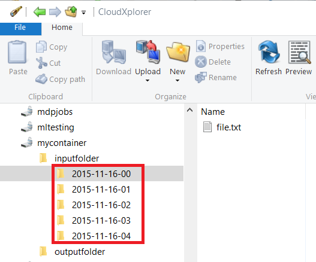
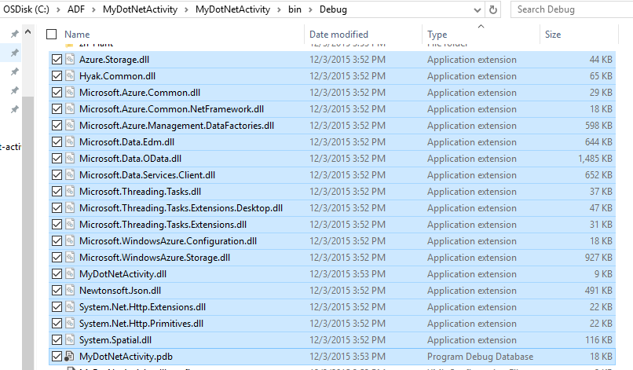
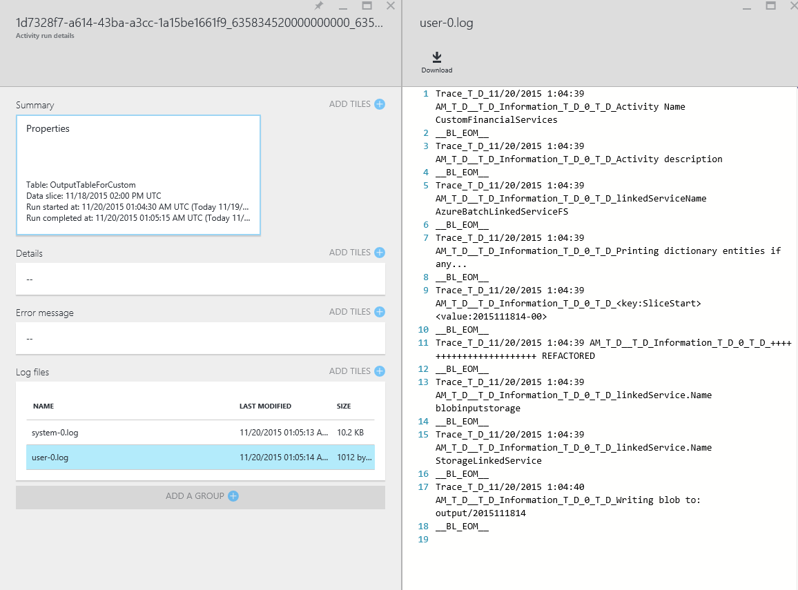
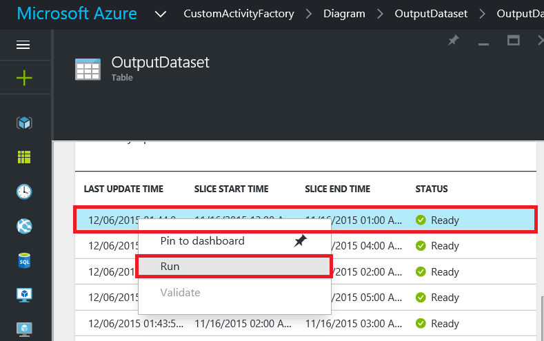

<properties
    pageTitle="Elaborare su larga scala set di dati con dati Factory e Batch | Microsoft Azure"
    description="In questo articolo viene descritto come elaborare grandi quantità di dati in una pipeline di Azure Data Factory utilizzando la funzionalità di elaborazione in parallelo del Batch di Azure."
    services="data-factory"
    documentationCenter=""
    authors="spelluru"
    manager="jhubbard"
    editor="monicar"/>

<tags
    ms.service="data-factory"
    ms.workload="data-services"
    ms.tgt_pltfrm="na"
    ms.devlang="na"
    ms.topic="article"
    ms.date="10/17/2016"
    ms.author="spelluru"/>

# Processo su larga scala set di dati con dati Factory e Batch
In questo articolo vengono illustrati un'architettura di una soluzione di esempio che sposta e i processi su larga scala set di dati in modo automatico e pianificato. Fornisce inoltre una procedura dettagliata-to-end per implementare la soluzione con Azure Data Factory e Azure Batch. 

In questo articolo contiene più dell'articolo tipica perché contiene una procedura dettagliata di una soluzione di esempio completo. Se si ha familiarità con Batch e Factory di dati, le informazioni su questi servizi e come interagiscono tra loro. Se si ha una conoscenza sui servizi e è progettazione/progettazione di una soluzione, potrebbe focalizzare l'attenzione solo sulla [sezione architettura](#architecture-of-sample-solution) dell'articolo e se si sviluppa un prototipo o una soluzione, è anche consigliabile provare istruzioni dettagliate nella [procedura dettagliata](#implementation-of-sample-solution). Invita tutti i commenti sul contenuto e sull'uso.

Prima di tutto, esaminiamo come aiutare servizi dati Factory e Batch con l'elaborazione di grandi dimensioni set di dati nel cloud.     

## Perché il Batch di Azure?
Batch Azure consente di eseguire le applicazioni di grandi dimensioni in parallelo e prestazioni elevate informatiche (HPC) in modo efficiente nel cloud. Si tratta di un servizio di piattaforma che consente di pianificare lavoro complesse per l'esecuzione in una raccolta gestita macchine virtuali e può automaticamente scala calcolare le risorse per soddisfare le esigenze dei processi.

Il servizio di Batch, è possibile definire risorse di elaborazione Azure per l'esecuzione delle applicazioni in parallelo e scala. È possibile eseguire su richiesta o programmata processi ed è non necessario creare, configurare e gestire un cluster HPC, singole macchine virtuali, reti virtuali o un processo complesso e infrastruttura di programmazione di attività manualmente.

Se non si ha familiarità con Azure Batch come può essere utile sapere architettura/implementazione della soluzione descritta in questo articolo, vedere gli articoli seguenti.   

- [Nozioni fondamentali di Azure Batch](../batch/batch-technical-overview.md)
- [Panoramica delle funzionalità batch](../batch/batch-api-basics.md)

(facoltativo) Per ulteriori informazioni su Azure Batch, vedere [percorso formativo per Batch Azure](https://azure.microsoft.com/documentation/learning-paths/batch/).

## Perché Factory Azure dati?
Dati Factory è un servizio di integrazione di dati basate su cloud che coordina e consente di automatizzare lo spostamento e trasformazione dei dati. Usa il servizio Factory dati, è possibile creare pipeline di dati gestiti cui spostare i dati locali e cloud archivi di dati a un archivio dati centralizzato (ad esempio: archiviazione Blob Azure) e grafici/trasformazione dati tramite servizi, ad esempio Azure HDInsight e apprendimento Azure. È anche possibile pianificare pipeline di dati per eseguire in un modo programmato (ogni ora, giornaliera, settimanale, ecc.) e il monitoraggio e gestirli a colpo d'occhio per identificare i problemi ed eseguire azioni. 

Se non si ha familiarità con Azure Data Factory come può essere utile sapere architettura/implementazione della soluzione descritta in questo articolo, vedere gli articoli seguenti.  

- [Introduzione di dati di Azure Factory](data-factory-introduction.md)
- [Creare il prima pipeline di dati](data-factory-build-your-first-pipeline.md)   

(facoltativo) Per ulteriori informazioni su Factory di dati di Azure, vedere [percorso formativo per Azure Data Factory](https://azure.microsoft.com/documentation/learning-paths/data-factory/).

## Dati Factory e Batch insieme
Factory dati include attività incorporate, ad esempio attività Copia per copiare o spostare dati da un archivio di dati di origine in un archivio di dati di destinazione e Hive attività per elaborare i dati con i cluster Hadoop (HDInsight) in Azure. Per un elenco di attività di trasformazione supportati, vedere [Attività di trasformazione dati](data-factory-data-transformation-activities.md) . 

È anche possibile creare attività .NET personalizzate per spostare o elaborare dati con la propria logica ed eseguire queste attività in un cluster di Azure HDInsight o in un pool di Azure Batch di macchine virtuali. Quando si utilizza il Batch di Azure, è possibile configurare pool di ridimensionamento automatico (aggiunta o rimozione di macchine virtuali in base al carico di lavoro) in base a una formula specificati.     

## Architettura di soluzione di esempio
Anche se l'architettura descritto in questo articolo per una soluzione semplice, è importante scenari complessi, ad esempio i rischi modellazione servizi finanziari, elaborazione delle immagini e il rendering e analisi genomiche. 

L'illustrazione mostra 1) come Data Factory coordina lo spostamento dei dati e dell'elaborazione e 2) come Batch Azure elabora i dati in modo parallelo. Scaricare e stampare il diagramma per semplificarne la consultazione (11x17 in. o formato A3): [orchestrazione HPC e dati utilizzando Batch Azure e Factory dati](http://go.microsoft.com/fwlink/?LinkId=717686).

L'elenco seguente include i passaggi di base del processo. La soluzione include codice e le spiegazioni per creare la soluzione-to-end.

1.  **Configurare Azure Batch con un pool di nodi di calcolo (macchine virtuali)**. È possibile specificare il numero dei nodi e le dimensioni di ogni nodo.

2.  **Crea un'istanza di Azure Data Factory** configurata con l'entità che rappresentano archiviazione blob Azure, il servizio di elaborazione Batch di Azure, dati di input/output e una pipeline o un flusso di lavoro con le attività che si spostano e trasformare i dati.

3.   **Creare un'attività personalizzata .NET nella pipeline di dati Factory**. L'attività è codice utente che viene eseguita nel pool di Azure Batch.

4.  **Grandi quantità di archivio di dati di input come BLOB di archiviazione Azure**. Dati sono diviso in sezioni logiche (in genere per ora).

5.  **Data Factory copia i dati che viene elaborati in parallelo** in posizione secondaria.

6.  **Data Factory esegue l'attività personalizzato utilizzando il pool ricevuto dal Batch**. Factory dati è possibile eseguire le attività contemporaneamente. Ogni attività elabora una sezione di dati. I risultati vengono archiviati in archiviazione Azure.

7.  **Che Data Factory Sposta i risultati finali a una terza posizione**, per la distribuzione mediante un'app o per ulteriori elaborazioni da altri strumenti.

## Implementazione della soluzione di esempio
Soluzione di esempio è intenzionalmente semplice e in cui viene illustrato come utilizzare dati Factory e Batch insieme per l'elaborazione di set di dati. La soluzione semplicemente conta il numero di occorrenze di un termine di ricerca ("Microsoft") nei file di input organizzati in una serie temporale. Viene restituito il numero di file di output.

**Ora**: se si ha familiarità con concetti di base di Azure, dati Factory e Batch e avere completato i prerequisiti elencati di seguito, è stimare questa soluzione richiede 1-2 ore per completare.

### Prerequisiti

#### Abbonamento Azure
Se non si dispone di un abbonamento a Azure, è possibile creare un account di valutazione gratuito in pochi minuti. Vedere [versione di valutazione gratuita](https://azure.microsoft.com/pricing/free-trial/).

#### Account di archiviazione Azure
Si utilizza un account di archiviazione Azure per archiviare i dati in questa esercitazione. Se non si dispone di un account di archiviazione Azure, vedere [creare un account di archiviazione](../storage/storage-create-storage-account.md#create-a-storage-account). La soluzione di esempio utilizza archiviazione blob.

#### Account Azure Batch
Creare un account Azure Batch tramite il [portale di Azure](http://manage.windowsazure.com/). Vedere [creare e gestire un account Azure Batch](../batch/batch-account-create-portal.md). Nota la chiave account e nome account Azure Batch. È anche possibile utilizzare i cmdlet di [AzureRmBatchAccount di nuovo](https://msdn.microsoft.com/library/mt603749.aspx) per creare un account Azure Batch. Per informazioni dettagliate sull'uso di questo cmdlet, vedere [iniziare a utilizzare i cmdlet di PowerShell Batch Azure](../batch/batch-powershell-cmdlets-get-started.md) .

La soluzione di esempio utilizza Azure Batch (indirettamente tramite una pipeline di Azure Data Factory) per elaborare i dati in modo parallelo nel pool dei nodi di calcolo (insieme gestito macchine virtuali).

#### Azure pool Batch di macchine)
Creare un **pool di Azure Batch** con almeno 2 nodi di calcolo.

1.  Nel [portale di Azure](https://portal.azure.com), fare clic su **Sfoglia** nel menu a sinistra e fare clic su **Account Batch**. 
2. Selezionare il proprio account Azure Batch per aprire e il **Batch di Account** . 
3. Fare clic su riquadro **pool** .
4. Selezionare il pulsante Aggiungi sulla barra degli strumenti per aggiungere un pool e il **pool** .
    1. Immettere un ID per il pool (**ID pool di applicazioni**). Nota l' **ID del pool**. necessarie per creare la soluzione Factory dati. 
    2. Specificare l'impostazione nei sistemi operativi **Windows Server 2012 R2** .
    3. Selezionare un **livello di nodo prezzi**.
    4. Immettere **2** come valore rispetto all'impostazione della **Destinazione dedicato** .
    5. Immettere **2** come valore per l'impostazione di **attività Max per nodo** .
    6. Fare clic su **OK** per creare il pool. 
    
#### Esplora archivi Azure   
[Azure archiviazione Explorer 6 (strumento)](https://azurestorageexplorer.codeplex.com/) o [CloudXplorer](http://clumsyleaf.com/products/cloudxplorer) (da ClumsyLeaf Software). Utilizzare questi strumenti per la verifica e la modifica dei dati nei progetti di archiviazione Azure inclusi i registri delle applicazioni ospitati cloud.

1.  Creare un contenitore denominato **mycontainer** con accesso private (senza accesso anonimo)

2.  Se si utilizza **CloudXplorer**, creare sottocartelle e cartelle con la struttura seguente:

    

    **CartellaInput** e **CartellaOutput** sono cartelle principali in **mycontainer,** e **CartellaInput** dispone di sottocartelle con data e ora (AAAA-MM-DD-HH).

    Se si utilizza **Esplora archivi Azure**, nel passaggio successivo, è necessario caricare i file con nomi: inputfolder/2015-11-16-00/file.txt, inputfolder/2015-11-16-01/file.txt e così via. Questo passaggio Crea automaticamente le cartelle.

3.  Creare un file di testo **file. txt** nel computer in uso con il contenuto che contiene la parola chiave **Microsoft**. Ad esempio: "attività personalizzata Microsoft test personalizzate attività Microsoft di test".

4.  Caricare il file delle cartelle di input seguenti nella archiviazione blob Azure.

    

    Se si utilizza **Esplora archivi Azure**, caricare il file **file. txt** **mycontainer**. Fare clic su **Copia** sulla barra degli strumenti per creare una copia del blob. Nella finestra di dialogo **Copia Blob** modificare il **nome di blob di destinazione** in **inputfolder/2015-11-16-00/file.txt.** Ripetere questo passaggio per creare inputfolder/2015-11-16-01/file.txt, inputfolder/2015-11-16-02/file.txt, inputfolder/2015-11-16-03/file.txt, inputfolder/2015-11-16-04/file.txt e così via. Questa azione crea automaticamente le cartelle.

3.  Creare un altro contenitore denominato: **customactivitycontainer**. Si caricare il file zip di un'attività personalizzata in questo contenitore.

#### Visual Studio
Installare Microsoft Visual Studio 2012 o versione successiva per creare l'attività Batch personalizzato da utilizzare per la soluzione Factory dati.

### Passaggi necessari per creare la soluzione

1.  Creare un'attività personalizzata che contiene la logica di elaborazione dei dati.
2.  Creare una factory di dati di Azure che utilizza un'attività personalizzata:

### Creare un'attività personalizzata

L'attività personalizzata Factory dati rappresenta il fulcro della soluzione di esempio. Soluzione di esempio utilizza Azure Batch per eseguire un'attività personalizzata. Vedere [usare le attività personalizzate in una pipeline di Azure Data Factory](data-factory-use-custom-activities.md) per le informazioni di base per sviluppare attività personalizzate e usarli in pipeline di Azure Data Factory.

Per creare un'attività personalizzata .NET che è possibile utilizzare in una pipeline di Azure Data Factory, è necessario creare un progetto **Libreria di classi .NET** con una classe implementata da tale interfaccia **IDotNetActivity** . Questa interfaccia dispone di uno dei metodi: **Execute**. Di seguito è riportata la firma del metodo:

    public IDictionary<string, string> Execute(
                IEnumerable<LinkedService> linkedServices,
                IEnumerable<Dataset> datasets,
                Activity activity,
                IActivityLogger logger)

Il metodo presenta alcuni componenti chiave che è necessario conoscere.

-   Il metodo accetta quattro parametri:

    1.  **linkedServices**. Elenco enumerabile servizi collegati che collegare origini dati di input/output (ad esempio: archiviazione Blob Azure) su factory dati. In questo esempio è disponibile solo un servizio collegato del tipo di archiviazione di Azure utilizzato per l'input e output.

    2.  **set di dati**. Si tratta di un elenco enumerabile di set di dati. È possibile utilizzare questo parametro per ottenere i percorsi e gli schemi definiti set di dati di input e di output.

    3.  **attività**. Questo parametro rappresenta l'elaborazione entità corrente, in questo caso, un servizio di Azure Batch.

    4.  **logger**. Il logger consente di scrivere i commenti di debug tale superficie come log di "Utente" per la pipeline.

-   Viene restituito un dizionario che può essere utilizzato per concatenare attività personalizzate in futuro. Questa caratteristica non ancora implementata, pertanto restituire un dizionario vuoto dal metodo. 

#### Procedura: Creare un'attività personalizzata

1.  Creare un progetto libreria di classi .NET in Visual Studio.

    1.  Avviare **Visual Studio 2012**/**2013/2015**.

    2.  Fare clic su **File**, scegliere **Nuovo**e fare clic su **progetto**.

    3.  Espandere **modelli**e selezionare **Visual C\#**. In questa procedura dettagliata, si utilizza C\#, ma è possibile utilizzare qualsiasi linguaggio .NET per lo sviluppo di un'attività personalizzata.

    4.  Selezionare **Libreria di classi** dall'elenco dei tipi di progetto a destra.

    5.  Immettere **MyDotNetActivity** per **nome**.

    6.  Selezionare **c:\\alimentatore automatico** relativa al **percorso**. Creare la cartella **alimentatore automatico** se non esiste.

    7.  Fare clic su **OK** per creare il progetto.

2.  Fare clic su **Strumenti**, scegliere **Gestione pacchetti NuGet**e fare clic su **Gestione pacchetti Console**.

3.  Nella **Console di gestione pacchetti**, eseguire il seguente comando per importare **Microsoft.Azure.Management.DataFactories**.

            Install-Package Microsoft.Azure.Management.DataFactories

4.  Importare il pacchetto di NuGet **Archiviazione Azure** al progetto. Poiché si utilizza l'archiviazione Blob API in questo esempio, è necessario il pacchetto.

        Install-Package Azure.Storage

5.  Aggiungere le seguenti istruzioni **using** al file di origine nel progetto.

        using System.IO;
        using System.Globalization;
        using System.Diagnostics;
        using System.Linq;

        using Microsoft.Azure.Management.DataFactories.Models;
        using Microsoft.Azure.Management.DataFactories.Runtime;

        using Microsoft.WindowsAzure.Storage;
        using Microsoft.WindowsAzure.Storage.Blob;

6.  Modificare il nome dello spazio dei **nomi** in **MyDotNetActivityNS**.

        namespace MyDotNetActivityNS

7.  Modificare il nome della classe in **MyDotNetActivity** e derivano dall'interfaccia **IDotNetActivity** come illustrato di seguito.

        public class MyDotNetActivity : IDotNetActivity

8.  Implementare (Aggiungi) **Execute** metodo dell'interfaccia **IDotNetActivity** per la classe **MyDotNetActivity** e copiare il metodo di esempio riportato di seguito. Vedere la sezione [Esegui metodo](#execute-method) per spiegazione per la logica utilizzata in questo metodo.

        /// 

        /// Execute method is the only method of IDotNetActivity interface you must implement.
        /// In this sample, the method invokes the Calculate method to perform the core logic.  
        /// 

        public IDictionary<string, string> Execute(
            IEnumerable<LinkedService> linkedServices,
            IEnumerable<Dataset> datasets,
            Activity activity,
            IActivityLogger logger)
        {

            // declare types for input and output data stores
            AzureStorageLinkedService inputLinkedService;

            Dataset inputDataset = datasets.Single(dataset => dataset.Name == activity.Inputs.Single().Name);
    
            foreach (LinkedService ls in linkedServices)
                logger.Write("linkedService.Name {0}", ls.Name);

            // using First method instead of Single since we are using the same
            // Azure Storage linked service for input and output.
            inputLinkedService = linkedServices.First(
                linkedService =>
                linkedService.Name ==
                inputDataset.Properties.LinkedServiceName).Properties.TypeProperties
                as AzureStorageLinkedService;

            string connectionString = inputLinkedService.ConnectionString; // To create an input storage client.
            string folderPath = GetFolderPath(inputDataset);
            string output = string.Empty; // for use later.

            // create storage client for input. Pass the connection string.
            CloudStorageAccount inputStorageAccount = CloudStorageAccount.Parse(connectionString);
            CloudBlobClient inputClient = inputStorageAccount.CreateCloudBlobClient();

            // initialize the continuation token before using it in the do-while loop.
            BlobContinuationToken continuationToken = null;
            do
            {   // get the list of input blobs from the input storage client object.
                BlobResultSegment blobList = inputClient.ListBlobsSegmented(folderPath,
                                         true,
                                         BlobListingDetails.Metadata,
                                         null,
                                         continuationToken,
                                         null,
                                         null);

                // Calculate method returns the number of occurrences of
                // the search term (“Microsoft”) in each blob associated
                // with the data slice.
                //
                // definition of the method is shown in the next step.
                output = Calculate(blobList, logger, folderPath, ref continuationToken, "Microsoft");

            } while (continuationToken != null);

            // get the output dataset using the name of the dataset matched to a name in the Activity output collection.
            Dataset outputDataset = datasets.Single(dataset => dataset.Name == activity.Outputs.Single().Name);

            folderPath = GetFolderPath(outputDataset);

            logger.Write("Writing blob to the folder: {0}", folderPath);

            // create a storage object for the output blob.
            CloudStorageAccount outputStorageAccount = CloudStorageAccount.Parse(connectionString);
            // write the name of the file.
            Uri outputBlobUri = new Uri(outputStorageAccount.BlobEndpoint, folderPath + "/" + GetFileName(outputDataset));

            logger.Write("output blob URI: {0}", outputBlobUri.ToString());
            // create a blob and upload the output text.
            CloudBlockBlob outputBlob = new CloudBlockBlob(outputBlobUri, outputStorageAccount.Credentials);
            logger.Write("Writing {0} to the output blob", output);
            outputBlob.UploadText(output);

            // The dictionary can be used to chain custom activities together in the future.
            // This feature is not implemented yet, so just return an empty dictionary.
            return new Dictionary<string, string>();
        }

9.  Aggiungere i seguenti metodi di supporto per la classe. Questi metodi vengono richiamati dal metodo **Execute** . In particolare, il metodo **Calculate** isola il codice che scorre ogni blob.

        /// 

        /// Gets the folderPath value from the input/output dataset.
        /// 

        private static string GetFolderPath(Dataset dataArtifact)
        {
            if (dataArtifact == null || dataArtifact.Properties == null)
            {
                return null;
            }

            AzureBlobDataset blobDataset = dataArtifact.Properties.TypeProperties as AzureBlobDataset;
            if (blobDataset == null)
            {
                return null;
            }

            return blobDataset.FolderPath;
        }

        /// 

        /// Gets the fileName value from the input/output dataset.
        /// 

        private static string GetFileName(Dataset dataArtifact)
        {
            if (dataArtifact == null || dataArtifact.Properties == null)
            {
                return null;
            }

            AzureBlobDataset blobDataset = dataArtifact.Properties.TypeProperties as AzureBlobDataset;
            if (blobDataset == null)
            {
                return null;
            }

            return blobDataset.FileName;
        }

        /// 

        /// Iterates through each blob (file) in the folder, counts the number of instances of search term in the file,
        /// and prepares the output text that is written to the output blob.
        /// 

        public static string Calculate(BlobResultSegment Bresult, IActivityLogger logger, string folderPath, ref BlobContinuationToken token, string searchTerm)
        {
            string output = string.Empty;
            logger.Write("number of blobs found: {0}", Bresult.Results.Count<IListBlobItem>());
            foreach (IListBlobItem listBlobItem in Bresult.Results)
            {
                CloudBlockBlob inputBlob = listBlobItem as CloudBlockBlob;
                if ((inputBlob != null) && (inputBlob.Name.IndexOf("$$$.$$$") == -1))
                {
                    string blobText = inputBlob.DownloadText(Encoding.ASCII, null, null, null);
                    logger.Write("input blob text: {0}", blobText);
                    string[] source = blobText.Split(new char[] { '.', '?', '!', ' ', ';', ':', ',' }, StringSplitOptions.RemoveEmptyEntries);
                    var matchQuery = from word in source
                                     where word.ToLowerInvariant() == searchTerm.ToLowerInvariant()
                                     select word;
                    int wordCount = matchQuery.Count();
                    output += string.Format("{0} occurrences(s) of the search term \"{1}\" were found in the file {2}.\r\n", wordCount, searchTerm, inputBlob.Name);
                }
            }
            return output;
        }

    Il metodo **GetFolderPath** restituisce il percorso per la cartella in cui il set di dati di puntamento e il metodo **GetFileName** restituisce il nome del file blob/che indichi il set di dati.

        "name": "InputDataset",
        "properties": {
            "type": "AzureBlob",
            "linkedServiceName": "StorageLinkedService",
            "typeProperties": {
                "fileName": "file.txt",
                "folderPath": "mycontainer/inputfolder/{Year}-{Month}-{Day}-{Hour}",

    Il metodo **Calculate** calcola il numero di istanze della parola chiave **Microsoft** nei file di input (BLOB nella cartella). Al termine di ricerca ("Microsoft") è hardcoded nel codice.

10.  Compilare il progetto. Fare clic su **Compila** dal menu di scelta e fare clic su **Compila soluzione**.

11.  Avviare **Esplora risorse**e passare a **collocazione\\debug** o **collocazione\\rilasciare** cartella a seconda del tipo di compilazione.

12.  Creare un file zip **MyDotNetActivity.zip** contenente tutti i file binari nel ** \\collocazione\\Debug** cartella. Può essere necessario includere il MyDotNetActivity. file **PDB** in modo che viene visualizzato ulteriori dettagli, ad esempio il numero di riga nel codice sorgente che generano il problema quando un errore si verifica.

    

13.  Caricare **MyDotNetActivity.zip** come blob al contenitore di blob: **customactivitycontainer** in archiviazione blob Azure che **StorageLinkedService** collegato servizio in **ADFTutorialDataFactory** ottimali. Creare il contenitore blob **customactivitycontainer** se non esiste già.

#### Eseguire metodo

In questa sezione fornisce ulteriori dettagli e le note relative al codice nel metodo Execute.

1.  I membri per scorrere l'insieme di input si trovano nello spazio dei nomi [Microsoft.WindowsAzure.Storage.Blob](https://msdn.microsoft.com/library/azure/microsoft.windowsazure.storage.blob.aspx) . Scorrere l'insieme di blob richiede l'utilizzo della classe **BlobContinuationToken** . In pratica, è necessario utilizzare un'-durante il ciclo del token come meccanismo per uscire dal ciclo. Per ulteriori informazioni, vedere [come utilizzare l'archiviazione Blob da .NET](../storage/storage-dotnet-how-to-use-blobs.md). Un ciclo di base è illustrato di seguito:

        // Initialize the continuation token.
        BlobContinuationToken continuationToken = null;
        do
        {
        // Get the list of input blobs from the input storage client object.
        BlobResultSegment blobList = inputClient.ListBlobsSegmented(folderPath,
                                true,
                                          BlobListingDetails.Metadata,
                                          null,
                                          continuationToken,
                                          null,
                                          null);
        // Return a string derived from parsing each blob.
            output = Calculate(blobList, logger, folderPath, ref continuationToken, "Microsoft");

        } while (continuationToken != null);

    Vedere la documentazione per il metodo [ListBlobsSegmented](https://msdn.microsoft.com/library/jj717596.aspx) per informazioni dettagliate.

2.  Il codice per l'utilizzo in modo logico all'interno del set di BLOB viene inserito all'interno di si-durante il ciclo. Nel metodo **Execute** si-mentre ciclo passa l'elenco dei BLOB a un metodo denominato **Calculate**. Il metodo restituisce la variabile di **output** è il risultato di visto scorrere tutti i BLOB segmento stringa.

    Restituisce il numero di occorrenze del termine di ricerca (**Microsoft**) BLOB passato al metodo di **calcolo** .

        output += string.Format("{0} occurrences of the search term \"{1}\" were found in the file {2}.\r\n", wordCount, searchTerm, inputBlob.Name);

3.  Dopo il metodo **Calculate** ha eseguito le operazioni, devono essere scritte in un nuovo blob. In modo che per ogni set di BLOB elaborate, è possibile scrivere un nuovo blob con i risultati. Per scrivere un nuovo blob, è prima necessario individuare il set di dati di output.

        // Get the output dataset using the name of the dataset matched to a name in the Activity output collection.
        Dataset outputDataset = datasets.Single(dataset => dataset.Name == activity.Outputs.Single().Name);

4.  Il codice chiama anche un metodo di supporto: **GetFolderPath** per recuperare il percorso della cartella (il nome del contenitore dello spazio di archiviazione).

        folderPath = GetFolderPath(outputDataset);

    **GetFolderPath** viene eseguito il cast oggetto set di dati da un AzureBlobDataSet, che include una proprietà denominata FolderPath.

        AzureBlobDataset blobDataset = dataArtifact.Properties.TypeProperties as AzureBlobDataset;

        return blobDataset.FolderPath;

5.  Il codice chiama il metodo **GetFileName** per recuperare il nome del file (nome blob). Il codice è simile a quello precedente per ottenere il percorso della cartella.

        AzureBlobDataset blobDataset = dataArtifact.Properties.TypeProperties as AzureBlobDataset;

        return blobDataset.FileName;

6.  Il nome del file è scritto mediante la creazione di un oggetto URI. Costruttore URI utilizza la proprietà **BlobEndpoint** per restituire il nome del contenitore. Il percorso e il nome della cartella vengono aggiunti per costruire il blob di output URI.  

        // Write the name of the file.
        Uri outputBlobUri = new Uri(outputStorageAccount.BlobEndpoint, folderPath + "/" + GetFileName(outputDataset));

7.  Il nome del file è stato scritto e a questo punto è possibile scrivere la stringa di output il metodo di **calcolo** in un nuovo blob:

        // Create a blob and upload the output text.
        CloudBlockBlob outputBlob = new CloudBlockBlob(outputBlobUri, outputStorageAccount.Credentials);
        logger.Write("Writing {0} to the output blob", output);
        outputBlob.UploadText(output);

### Creare la factory di dati

Nella sezione [creare un'attività personalizzata](#create-the-custom-activity) creata un'attività personalizzata e caricare il file zip con file binari e il file PDB a un contenitore di blob Azure. In questa sezione, creata una Azure **factory dati** con una **pipeline** che utilizza **un'attività personalizzata**.

Il set di dati di input per un'attività personalizzata rappresenta BLOB (file) nella cartella di input (mycontainer\\CartellaInput) in archiviazione blob. Il set di dati di output per l'attività rappresenta BLOB output nella cartella di output (mycontainer\\CartellaOutput) in archiviazione blob.

Eliminare uno o più file nelle cartelle di input:

    mycontainer -\> inputfolder
        2015-11-16-00
        2015-11-16-01
        2015-11-16-02
        2015-11-16-03
        2015-11-16-04

Ad esempio, trascinare un file (file. txt) con il seguente contenuto in ciascuna delle cartelle.

    test custom activity Microsoft test custom activity Microsoft

Ogni cartella input corrisponde a una sezione nella Factory di dati di Azure, anche se la cartella dispone di 2 o più file. Durante l'elaborazione di ogni sezione dalla pipeline di un'attività personalizzata scorre tutti i BLOB la cartella di input per tale sezione.

Sono presenti cinque file di output con lo stesso contenuto. Ad esempio, il file di output di elaborazione del file nella cartella 2015-11-16-00 contiene il contenuto seguente:

    2 occurrences(s) of the search term "Microsoft" were found in the file inputfolder/2015-11-16-00/file.txt.

Se si elimina più file (file. txt, file2, file3.txt) con lo stesso contenuto per la cartella di input, viene visualizzato il seguente contenuto nel file di output. Ogni cartella (2015-11-16-00, ecc.) corrisponde a una sezione in questo esempio, anche se la cartella dispone di più file di input.

    2 occurrences(s) of the search term "Microsoft" were found in the file inputfolder/2015-11-16-00/file.txt.
    2 occurrences(s) of the search term "Microsoft" were found in the file inputfolder/2015-11-16-00/file2.txt.
    2 occurrences(s) of the search term "Microsoft" were found in the file inputfolder/2015-11-16-00/file3.txt.

Il file di output con tre righe a questo punto, uno per ogni file di input (blob) nella cartella associata con la sezione (2015-11-16-00).

Per ogni attività eseguire viene creata un'attività. In questo esempio, esiste una sola attività nella pipeline. Durante l'elaborazione di una sezione dalla pipeline di un'attività personalizzata viene eseguita nel Batch di Azure per l'elaborazione della sezione. Perché non ci sono cinque sezioni (ogni sezione può avere più BLOB o file), sono disponibili cinque attività create nel Batch di Azure. Quando un'attività viene eseguita in Batch, è effettivamente l'attività personalizzata che è in esecuzione.

La procedura riportata di seguito sono disponibili ulteriori dettagli.

#### Passaggio 1: Creare la factory di dati

1.  Dopo avere effettuato l'accesso al [portale di Azure](https://portal.azure.com/), eseguire la procedura seguente:

    1.  Nel menu a sinistra, fare clic su **Nuovo** .

    2.  Fare clic su **dati + Analitica** e il **Nuovo** .

    3.  Fare clic su **Factory dati** nella e **analitica di dati** .

2.  Per il nome e il **Nuovo factory di dati** , utilizzare **CustomActivityFactory** . Il nome della factory dati Azure deve essere univoco globale. Se viene visualizzato l'errore: **dati factory nome "CustomActivityFactory" è non disponibile**, modificare il nome di dati (ad esempio **yournameCustomActivityFactory**) e provare a creare di nuovo.

3.  Fare clic sul **Nome del gruppo di risorse**e selezionare un gruppo di risorse esistente oppure creare un gruppo di risorse.

4.  Verificare che si usa la sottoscrizione corretto e area geografica in cui si desidera factory dati da creare.

5.  Fare clic su **Crea** in e il **Nuovo factory di dati** .

6.  Viene visualizzato il produttore dati viene creato nel **Dashboard** del portale di Azure.

7.  Dopo la factory di dati è stata creata correttamente, viene visualizzata la pagina factory dati, che mostra il contenuto della factory dati.

 

#### Passaggio 2: Creare servizi collegati

Servizi collegati collegamento archivi dati o servizi a un factory Azure dati di elaborazione. In questo passaggio si collegare l'account di **Archiviazione Azure** e account **Azure Batch** factory i dati.

#### Creare il servizio di archiviazione di Azure collegato

1.  Fare clic sul **autore e distribuire** riquadro in e il **Produttore di dati** per **CustomActivityFactory**. Viene visualizzato l'Editor di Factory dei dati.

2.  Fare clic su **nuovo archivio dati** sulla barra dei comandi e scegliere **archiviazione Azure.** Verrà visualizzato lo script JSON per la creazione di un servizio di archiviazione di Azure collegato nell'editor.

    

3.  Sostituire **nome dell'account** con il nome dell'account Azure dello spazio di archiviazione e la **chiave account** con il tasto di scelta dell'account di archiviazione Azure. Per informazioni su come ottenere il codice di accesso di spazio di archiviazione, vedere [visualizzare, copia e lo spazio di archiviazione rigenera i tasti di scelta](../storage/storage-create-storage-account.md#view-copy-and-regenerate-storage-access-keys).

4.  Fare clic su **Distribuisci** della barra dei comandi per distribuire il servizio collegato.

    

#### Creare il Batch di Azure collegato servizio

In questo passaggio si crea un servizio collegato per il proprio account **Azure Batch** che viene utilizzato per eseguire l'attività personalizzata Factory dati.

1.  Fare clic su **Nuovo calcolare** sulla barra dei comandi e scegliere **Azure Batch.** Verrà visualizzato lo script JSON per la creazione di un servizio di Azure Batch collegato nell'editor.

2.  In script JSON:

    1.  Sostituire **nome dell'account** con il nome del proprio account Azure Batch.

    2.  Sostituire **tasto di scelta rapida** con il tasto di scelta dell'account Azure Batch.

    3.  Immettere l'ID del pool per la proprietà **poolName** **.** Per questa proprietà, è possibile specificare il nome del pool o del pool di ID.

    4.  Immettere il batch di URI per la proprietà JSON **batchUri** . 
    
        > [AZURE.IMPORTANT] L' **URL** da **blade account Azure Batch** è nel formato seguente: \<nome account\>. \<area\>. batch.azure.com. Per la proprietà **batchUri** il JSON, è necessario **rimuovere "nome account."** da URL. Esempio: `"batchUri": "https://eastus.batch.azure.com"`.

        

        Per la proprietà **poolName** , è possibile specificare anche l'ID del pool di anziché il nome del pool.

        > [AZURE.NOTE] Il servizio Factory dati non supporta un'opzione su richiesta per il Batch di Azure come avviene per HDInsight. È possibile utilizzare solo un Batch di Azure pool di in una factory di dati di Azure.

    5.  Specificare **StorageLinkedService** per la proprietà **linkedServiceName** . Questo servizio collegato creato nel passaggio precedente. Questo spazio di archiviazione viene utilizzato come un'area di gestione temporanea per i registri e file.

3.  Fare clic su **Distribuisci** della barra dei comandi per distribuire il servizio collegato.

#### Passaggio 3: Creare set di dati

In questo passaggio si crea set di dati per rappresentare dati di input e di output.

#### Creare set di dati input

1.  **Nell'Editor** Factory dati, fare clic sul pulsante **nuovo set di dati** sulla barra degli strumenti e fare clic su **archiviazione Blob Azure** dal menu a discesa.

2.  Sostituire JSON nel riquadro destro, con il frammento di JSON seguente:

        {
            "name": "InputDataset",
            "properties": {
                "type": "AzureBlob",
                "linkedServiceName": "AzureStorageLinkedService",
                "typeProperties": {
                    "folderPath": "mycontainer/inputfolder/{Year}-{Month}-{Day}-{Hour}",
                    "format": {
                        "type": "TextFormat"
                    },
                    "partitionedBy": [
                        {
                            "name": "Year",
                            "value": {
                                "type": "DateTime",
                                "date": "SliceStart",
                                "format": "yyyy"
                            }
                        },
                        {
                            "name": "Month",
                            "value": {
                                "type": "DateTime",
                                "date": "SliceStart",
                                "format": "MM"
                            }
                        },
                        {
                            "name": "Day",
                            "value": {
                                "type": "DateTime",
                                "date": "SliceStart",
                                "format": "dd"
                            }
                        },
                        {
                            "name": "Hour",
                            "value": {
                                "type": "DateTime",
                                "date": "SliceStart",
                                "format": "HH"
                            }
                        }
                    ]
                },
                "availability": {
                    "frequency": "Hour",
                    "interval": 1
                },
                "external": true,
                "policy": {}
            }
        }

     Si crea una pipeline più avanti in questa procedura dettagliata con ora di inizio: 2015-11-ora 16T00:00:00Z e di fine: 2015-11-16T05:00:00Z. È programmata per produrre dati **ogni ora**, pertanto non esistono 5 ingresso/uscita sezioni (compresa tra **00**: 00:00 -\> **05**: 00:00).

     La **frequenza** e l' **intervallo** per il set di dati di input è impostata su **ora** e **1**, in modo che la sezione input sia disponibile ogni ora.

     Ecco le ore di inizio per ogni sezione, viene rappresentato dalla variabile di sistema **SliceStart** frammento JSON sopra.

  	| **Sezione** | **Ora di inizio**          |
  	|-----------|-------------------------|
  	| 1         | 2015-11-16T**00**: 00:00 |
  	| 2         | 2015-11-16T**01**: 00:00 |
  	| 3         | 2015-11-16T**02**: 00:00 |
  	| 4         | 2015-11-16T**03**: 00:00 |
  	| 5         | 2015-11-16T**04**: 00:00 |

     **FolderPath** viene calcolata utilizzando la parte anno, mese, giorno e ora dell'ora di inizio sezione (**SliceStart**). Di conseguenza, ecco come una cartella di input sia assegnata a una sezione.

  	| **Sezione** | **Ora di inizio**          | **Cartella di input**  |
  	|-----------|-------------------------|-------------------|
  	| 1         | 2015-11-16T**00**: 00:00 | 2015-11-16 -**00** |
  	| 2         | 2015-11-16T**01**: 00:00 | 2015-11-16 -**01** |
  	| 3         | 2015-11-16T**02**: 00:00 | 2015-11-16 -**02** |
  	| 4         | 2015-11-16T**03**: 00:00 | 2015-11-16 -**03** |
  	| 5         | 2015-11-16T**04**: 00:00 | 2015-11-16 -**04** |

3.  Fare clic su **Distribuisci** sulla barra degli strumenti per creare e distribuire la tabella **InputDataset** . 

#### Creare set di dati di output

In questo passaggio si crea un altro set di dati di tipo AzureBlob per rappresentare i dati di output.

1.  **Nell'Editor** Factory dati, fare clic sul pulsante **nuovo set di dati** sulla barra degli strumenti e fare clic su **archiviazione Blob Azure** dal menu a discesa.

2.  Sostituire JSON nel riquadro destro, con il frammento di JSON seguente:

        {
            "name": "OutputDataset",
            "properties": {
                "type": "AzureBlob",
                "linkedServiceName": "AzureStorageLinkedService",
                "typeProperties": {
                    "fileName": "{slice}.txt",
                    "folderPath": "mycontainer/outputfolder",
                    "partitionedBy": [
                        {
                            "name": "slice",
                            "value": {
                                "type": "DateTime",
                                "date": "SliceStart",
                                "format": "yyyy-MM-dd-HH"
                            }
                        }
                    ]
                },
                "availability": {
                    "frequency": "Hour",
                    "interval": 1
                }
            }
        }

    Per ogni sezione input viene generato un file o un blob output. Ecco come un file di output denominato per ogni sezione. Tutti i file di output vengono generati in una cartella di output: **mycontainer\\CartellaOutput**.

  	| **Sezione** | **Ora di inizio**          | **File di output**       |
  	|-----------|-------------------------|-----------------------|
  	| 1         | 2015-11-16T**00**: 00:00 | 2015-11-16**00. txt** |
  	| 2         | 2015-11-16T**01**: 00:00 | 2015-11-16**01. txt** |
  	| 3         | 2015-11-16T**02**: 00:00 | 2015-11-16**02. txt** |
  	| 4         | 2015-11-16T**03**: 00:00 | 2015-11-16**03. txt** |
  	| 5         | 2015-11-16T**04**: 00:00 | 2015-11-16**04. txt** |

     Tenere presente che tutti i file in una cartella di input (ad esempio: 2015-11-16-00) fanno parte di una sezione con l'ora di inizio: 2015-11-16-00. Durante l'elaborazione di questa sezione, un'attività personalizzata esamina ogni file e genera una riga nel file di output con il numero di occorrenze del termine di ricerca ("Microsoft"). Se sono presenti tre file nella cartella 2015-11-16-00, sono disponibili tre righe nel file di output: 00.txt 2015-11-16.

3.  Fare clic su **Distribuisci** sulla barra degli strumenti per creare e distribuire **OutputDataset**.

#### Passaggio 4: Creare ed eseguire la pipeline con un'attività personalizzata

In questo passaggio si crea una pipeline con un'attività, l'attività personalizzata creata in precedenza.

> [AZURE.IMPORTANT] Se è ancora stato caricato il **file. txt** per le cartelle nel contenitore di blob di input, farlo prima di creare la pipeline. La proprietà **isPaused** è impostata su false nella pipeline JSON, in modo che la pipeline esegue immediatamente la data di **inizio** viene in passato.

1.  Editor Factory di dati, fare clic su **nuova pipeline di** barra dei comandi. Se il comando non è disponibile, fare clic su **... (Puntini di sospensione)** per visualizzarlo.

2.  Sostituire JSON nel riquadro destro, con il seguente script JSON:

        {
            "name": "PipelineCustom",
            "properties": {
                "description": "Use custom activity",
                "activities": [
                    {
                        "type": "DotNetActivity",
                        "typeProperties": {
                            "assemblyName": "MyDotNetActivity.dll",
                            "entryPoint": "MyDotNetActivityNS.MyDotNetActivity",
                            "packageLinkedService": "AzureStorageLinkedService",
                            "packageFile": "customactivitycontainer/MyDotNetActivity.zip"
                        },
                        "inputs": [
                            {
                                "name": "InputDataset"
                            }
                        ],
                        "outputs": [
                            {
                                "name": "OutputDataset"
                            }
                        ],
                        "policy": {
                            "timeout": "00:30:00",
                            "concurrency": 5,
                            "retry": 3
                        },
                        "scheduler": {
                            "frequency": "Hour",
                            "interval": 1
                        },
                        "name": "MyDotNetActivity",
                        "linkedServiceName": "AzureBatchLinkedService"
                    }
                ],
                "start": "2015-11-16T00:00:00Z",
                "end": "2015-11-16T05:00:00Z",
                "isPaused": false
           }
        }

    Noti quanto segue:

    -   Esiste una sola attività nella pipeline e che è di tipo: **DotNetActivity**.

    -   **AssemblyName** è impostato su nome della DLL: **MyDotNetActivity.dll**.

    -   **Il punto di ingresso** è impostato su **MyDotNetActivityNS.MyDotNetActivity**. Si tratta in sostanza \<spazio dei nomi\>. \<NomeClasse\> nel codice.

    -   **PackageLinkedService** è impostato su **StorageLinkedService** che punta all'archiviazione blob che contiene il file zip di un'attività personalizzata. Se si utilizza account Azure archiviazione diversi per i file di ingresso/uscita e il file zip di un'attività personalizzata, è necessario creare un altro servizio di archiviazione di Azure collegato. In questo articolo si presuppone che si usa lo stesso account di archiviazione Azure.

    -   **PackageFile** è impostato su **customactivitycontainer/MyDotNetActivity.zip**. È in formato: \<containerforthezip\>/\<nameofthezip.zip\>.

    -   L'attività personalizzata accetta **InputDataset** come input e **OutputDataset** come output.

    -   La proprietà **linkedServiceName** di un'attività personalizzata punti **AzureBatchLinkedService**, che indica Azure Data Factory che un'attività personalizzata deve essere eseguito in Batch Azure.

    -   L'impostazione **della concorrenza** è importante. Se si utilizza il valore predefinito è 1, anche se si dispone di 2 o più nodi nel pool di Azure Batch, le sezioni vengono elaborate una dopo l'altra. Di conseguenza, di non sfruttare della funzionalità di elaborazione in parallelo del Batch di Azure. Se si imposta **concorrenza** su un valore superiore, ad esempio 2, significa che due sezioni (corrisponde a due attività nel Batch di Azure) possono essere elaborati contemporaneamente, nel qual caso entrambe le macchine virtuali nel Batch di Azure vengono utilizzati pool. Pertanto, impostare la proprietà concorrenza in modo appropriato.

    -   Solo un'attività (sezione) viene eseguita su una macchina virtuale in qualsiasi momento per impostazione predefinita. Il motivo è che, per impostazione predefinita, le **attività di massimo per macchine Virtuali** sia impostato su 1 per un pool di Azure Batch. Come parte del prerequisiti, creato un pool di con questa proprietà impostata su 2, in modo che due sezioni di dati Factory possono essere eseguito su una macchina virtuale nello stesso momento.

    -   proprietà **isPaused** è impostato su false per impostazione predefinita. La pipeline esegue immediatamente in questo esempio perché le sezioni iniziare in passato. È possibile impostare questa proprietà su true per sospendere la pipeline e impostarla su false per riavviare.

    -   Ora di **inizio** e ora di **Fine** è cinque ore Dividi e le sezioni vengono eseguite ogni ora, in modo che le cinque sezioni sono prodotto dalla pipeline.

3.  Fare clic su **Distribuisci** sulla barra di comando per distribuire la pipeline.

#### Passaggio 5: Verificare la pipeline

In questo passaggio si prova la pipeline di spostamento di file in cartelle di input. Iniziamo con la pipeline di test con un file per una cartella di input.

1.  In e il produttore dati nel portale di Azure, fare clic su **diagramma**.

    

2.  Nella visualizzazione Diagramma, fare doppio clic sul set di dati input: **InputDataset**.

    

3.  Verrà visualizzato e il **InputDataset** con tutte le cinque sezioni pronti. Si noti **sezione ora** di inizio e **Data/ora fine sezione** per ogni sezione.

    

4.  Nella **Visualizzazione Diagramma**, fare clic su **OutputDataset**.

5.  Verrà visualizzato che le sezioni di cinque output sono nello stato pronto se sono già stati prodotti.

    

6.  Usare il portale di Azure per visualizzare le **attività** associate le **sezioni** e verificare che ogni sezione eseguito su macchine Virtuali. Vedere la sezione [dati Factory e l'integrazione di Batch](#data-factory-and-batch-integration) per informazioni dettagliate. 

7.  Verrà visualizzato i file di output in **CartellaOutput** di **mycontainer** in archiviazione blob Azure.

    

    Verrà visualizzato cinque file di output, uno per ogni sezione input. Ognuno dei file di output deve avere contenuto simile al seguente:

        2 occurrences(s) of the search term "Microsoft" were found in the file inputfolder/2015-11-16-00/file.txt.

    Il diagramma seguente illustra come eseguire il mapping delle sezioni della Data Factory alle attività in Batch Azure. In questo esempio, una sezione ha un solo Esegui.

    

8.  A questo punto, provare con più file in una cartella. Creazione di file: **file2**, **file3.txt**, **file4.txt**e **file5.txt** con lo stesso contenuto come file. txt nella cartella: **2015-11-06-01**.

9.  Nella cartella di output, **eliminare** il file di output: **01.txt 2015-11-16**.

10. A questo punto, e il **OutputDataset** destro della sezione con l' **ora di inizio sezione** impostato su **16/11/2015 01:00:00 AM**, fare clic su **Esegui** per eseguire nuovamente/rinviati-process la sezione. A questo punto, la sezione è cinque file invece di un file.

    

11. Dopo l'esecuzione della sezione e il relativo stato è **Pronto**, verificare il contenuto nel file di output per questa sezione (**2015-11-16-01.txt**) in **CartellaOutput** di **mycontainer** in archiviazione blob. Dovrebbe essere presente una riga per ogni file della sezione.

        2 occurrences(s) of the search term "Microsoft" were found in the file inputfolder/2015-11-16-01/file.txt.
        2 occurrences(s) of the search term "Microsoft" were found in the file inputfolder/2015-11-16-01/file2.txt.
        2 occurrences(s) of the search term "Microsoft" were found in the file inputfolder/2015-11-16-01/file3.txt.
        2 occurrences(s) of the search term "Microsoft" were found in the file inputfolder/2015-11-16-01/file4.txt.
        2 occurrences(s) of the search term "Microsoft" were found in the file inputfolder/2015-11-16-01/file5.txt.

> [AZURE.NOTE] Se si non è stato eliminato l'output file 2015-11-16-01.txt prima di provare a cinque file di input, viene visualizzata una sola riga dall'esecuzione della sezione precedente e cinque righe dall'esecuzione della sezione corrente. Per impostazione predefinita, il contenuto viene aggiunto per file di output se esiste già.

#### Integrazione di dati Factory e Batch
Il servizio Factory dati crea un processo in Batch Azure con il nome: **alimentatore automatico-poolname:job-xxx**. 

Per ogni esecuzione di attività di una sezione, viene creata un'attività nel processo. Se sono presenti 10 sezioni pronte per essere eseguito, 10 attività vengono create nel processo. È possibile impostare più di una sezione in esecuzione in parallelo se si dispongano di più nodi di elaborazione del pool. Se il numero massimo di attività per nodo di calcolo è impostato su > 1, possono essere presenti più di una sezione in esecuzione nel calcolo stesso.

In questo esempio, sono disponibili cinque sezioni, pertanto cinque attività nel Batch di Azure. Con la **concorrenza** impostato su **5** nella pipeline JSON Azure dati fabbrica e **le attività di massimo per macchine Virtuali** impostato su **2** nel pool di Azure Batch con **2** macchine virtuali, l'attività viene eseguita rapidamente (ora di inizio e fine per le attività di controllo).

Utilizzare il portale per visualizzare la procedura batch e delle relative attività sono associate le **sezioni** e vedere quali macchine Virtuali ogni sezione eseguito su. 

### Eseguire il debug la pipeline

Il debug è costituito da alcune tecniche di base:

1.  Se la sezione input non è impostata su **Pronto**, verificare che la struttura delle cartelle input sia corretta e file. txt è presente nelle cartelle di input.

    

2.  Nel metodo **Execute** dell'attività personalizzata, utilizzare l'oggetto **IActivityLogger** per registrare le informazioni che consente di risolvere i problemi. Scaricare i messaggi registrati nell'utente\_file di log 0.

    In e il **OutputDataset** , fare clic sulla sezione per visualizzare e il **Sezione di dati** per tale sezione. Viene visualizzato l' **attività viene eseguita** per tale sezione. Verrà visualizzata un'attività eseguire per la sezione. Se si fa clic su **Esegui** nella barra dei comandi, è possibile avviare un'altra attività eseguita per la sezione stessa.

    Quando si fa clic su Esegui attività, viene visualizzato e il **Dettagli eseguire attività** con un elenco dei file di log. Viene visualizzato messaggi registrati nel **utente\_0 log** file. Quando si verifica un errore, viene visualizzato tre attività esecuzioni perché il numero di tentativi è impostato su 3 nella pipeline/attività JSON. Quando si fa clic su Esegui attività, viene visualizzato i file di log è possibile esaminare per risolvere l'errore.

    

    Nell'elenco dei file di log, fare clic su **utente 0.log**. Nel Pannello di destra sono i risultati dell'utilizzo del metodo **IActivityLogger.Write** .

    

    Selezionare 0.log di sistema per tutti i messaggi di errore di sistema ed eccezioni.

        Trace\_T\_D\_12/6/2015 1:43:35 AM\_T\_D\_\_T\_D\_Verbose\_T\_D\_0\_T\_D\_Loading assembly file MyDotNetActivity...

        Trace\_T\_D\_12/6/2015 1:43:35 AM\_T\_D\_\_T\_D\_Verbose\_T\_D\_0\_T\_D\_Creating an instance of MyDotNetActivityNS.MyDotNetActivity from assembly file MyDotNetActivity...

        Trace\_T\_D\_12/6/2015 1:43:35 AM\_T\_D\_\_T\_D\_Verbose\_T\_D\_0\_T\_D\_Executing Module

        Trace\_T\_D\_12/6/2015 1:43:38 AM\_T\_D\_\_T\_D\_Information\_T\_D\_0\_T\_D\_Activity e3817da0-d843-4c5c-85c6-40ba7424dce2 finished successfully

3.  Includere il file **PDB** nel file zip in modo che i dettagli dell'errore abbiano informazioni, ad esempio **stack di** quando si verifica un errore.

4.  Tutti i file in file zip per un'attività personalizzata devono essere di **primo livello** senza sottocartelle.

    

5.  Assicurarsi che siano impostati **assemblyName** (MyDotNetActivity.dll), **il punto di ingresso** (MyDotNetActivityNS.MyDotNetActivity), **packageFile** (customactivitycontainer/MyDotNetActivity.zip) e **packageLinkedService** (deve fare riferimento all'archiviazione blob Azure che contiene il file zip) valori corretti.

6.  Se si desidera rielaborare la sezione corretto un errore, rapida della sezione e il **OutputDataset** e fare clic su **Esegui**.

    

    > [AZURE.NOTE] 
    > Viene visualizzato un **contenitore** in archiviazione Blob Azure denominato: **adfjobs**. In questo contenitore non viene eliminato automaticamente, ma è possibile eliminare in modo sicuro dopo aver test della soluzione. Analogamente, la soluzione Factory dati crea un Batch di Azure **processo** denominato: **alimentatore automatico -\<ID/nome del pool di\>: processo 0000000001**. Dopo avere testato la soluzione se si preferisce, è possibile eliminare questo processo.
7. L'attività personalizzata non utilizza file del pacchetto di **App** . Pertanto, se il codice legge qualsiasi stringa di connessione dal file di configurazione, non funziona in fase di esecuzione. Consigliata quando si utilizza il Batch di Azure è per contenere le informazioni riservate in un **KeyVault di Azure**, utilizzare un'entità servizio basato su certificato per proteggere la keyvault e distribuire il certificato al pool di Azure Batch. L'attività personalizzata .NET quindi accedere a informazioni riservate da KeyVault in fase di esecuzione. Questa soluzione è uno generico e ridurre a qualsiasi tipo di segreto, non solo stringa di connessione.

    Esiste una soluzione più semplice (ma non consigliata): è possibile creare un **SQL Azure collegato servizio** con connessione le impostazioni della stringa, creare un set di dati che utilizza il servizio collegato e per bicicletta il set di dati come una fittizio set di dati di input per l'attività .NET personalizzata. È quindi possibile accedere stringa di connessione del servizio collegata nel codice di un'attività personalizzata e dovrebbe funzionare in fase di esecuzione.  

#### Estendere l'esempio

È possibile estendere in questo esempio per ulteriori informazioni sulle funzionalità Factory di dati di Azure e Azure Batch. Ad esempio, per elaborare le sezioni in un intervallo di tempo diversi, eseguire la procedura seguente:

1.  Aggiungere le seguenti sottocartelle in **CartellaInput**: 2015-11-16-05 2015-11-16-06 201-11-16-07, 2011-11-16-08, 09 2015-11-16 e la posizione file di input in tali cartelle. Modificare l'ora di fine per la pipeline di `2015-11-16T05:00:00Z` a `2015-11-16T10:00:00Z`. Nella **Visualizzazione Diagramma**, fare doppio clic su **InputDataset**e verificare che le sezioni inpue siano pronte. Fare doppio clic su **OuptutDataset** per visualizzare lo stato di sezioni di output. Se si trovano nello stato pronto, selezionare CartellaOutput per i file di output.

2.  Aumentare o diminuire l'impostazione di **concorrenza** a capire come influisce le prestazioni della soluzione, in particolare l'elaborazione che avviene in Batch Azure. (Vedere il passaggio 4: creare ed eseguire la pipeline per ulteriori informazioni sull'impostazione della **concorrenza** .)

3.  Creare un pool con superiore/inferiore **attività massimo per macchine Virtuali**. Per utilizzare il nuovo pool che è stato creato, aggiornare il servizio di Azure Batch collegato della soluzione Factory dati. (Vedere il passaggio 4: creare ed eseguire la pipeline per ulteriori informazioni sull'impostazione **attività massimo per macchine Virtuali** .)

4.  Creare un pool di Azure Batch con funzionalità **autoscale** . Scala automatica nodi di calcolo di un pool di Azure Batch è l'adattamento dinamico della potenza utilizzata dall'applicazione di elaborazione. Ad esempio, è possibile creare un pool di azure batch con 0 macchine virtuali dedicate e una formula in forma autoscale in base al numero di attività in sospeso:
 
    Una macchina virtuale per in sospeso attività alla volta (ad esempio: assegnare alle attività in sospeso -> cinque macchine virtuali):

        pendingTaskSampleVector=$PendingTasks.GetSample(600 * TimeInterval_Second);
        $TargetDedicated = max(pendingTaskSampleVector);

    Numero massimo macchine uno Virtuali alla volta indipendentemente dal numero di attività in sospeso:

        pendingTaskSampleVector=$PendingTasks.GetSample(600 * TimeInterval_Second);
        $TargetDedicated = (max(pendingTaskSampleVector)>0)?1:0;

    Per informazioni dettagliate, vedere [nodi in un pool di Azure Batch di calcolo scala automaticamente](../batch/batch-automatic-scaling.md) . 

    Se il pool utilizza l' impostazione predefinita [autoScaleEvaluationInterval](https://msdn.microsoft.com/library/azure/dn820173.aspx), il servizio Batch potrebbe richiedere 15-30 minuti per preparare la macchina virtuale prima di eseguire un'attività personalizzata.  Se il pool Usa un autoScaleEvaluationInterval diversi, servizio Batch potrebbe richiedere autoScaleEvaluationInterval + 10 minuti. 
     
5. Nella soluzione di esempio, il metodo **Execute** richiama il metodo di **calcolo** che elabora una sezione di dati di input per generare una sezione di dati di output. È possibile scrivere un metodo per elaborare dati di input e sostituire la chiamata al metodo Calculate nel metodo Execute con una chiamata al metodo.

 

### Passaggi successivi: utilizzare i dati

Dopo aver elaborato dati, è possibile utilizzare con strumenti online come **Microsoft Power BI**. Ecco il collegamento alla Guida informazioni su Power BI e come utilizzarlo in Azure:

-   [Esplorare un set di dati in Power BI](https://powerbi.microsoft.com/en-us/documentation/powerbi-service-get-data/)

-   [Guida introduttiva a Power BI Desktop](https://powerbi.microsoft.com/en-us/documentation/powerbi-desktop-getting-started/)

-   [Aggiornare i dati in Power BI](https://powerbi.microsoft.com/en-us/documentation/powerbi-refresh-data/)

-   [Azure e Power BI - Panoramica di base](https://powerbi.microsoft.com/en-us/documentation/powerbi-azure-and-power-bi/)

## Riferimenti

-   [Dati di Azure Factory](https://azure.microsoft.com/documentation/services/data-factory/)

    -   [Introduzione al servizio di Azure Data Factory](data-factory-introduction.md)

    -   [Guida introduttiva di Azure Data Factory](data-factory-build-your-first-pipeline.md)

    -   [Usare le attività personalizzate in una pipeline di Azure Data Factory](data-factory-use-custom-activities.md)

-   [Azure Batch](https://azure.microsoft.com/documentation/services/batch/)

    -   [Nozioni fondamentali di Azure Batch](../batch/batch-technical-overview.md)

    -   [Panoramica delle funzionalità di Azure Batch](../batch/batch-api-basics.md)

    -   [Creare e gestire account Azure Batch nel portale di Azure](../batch/batch-account-create-portal.md)

    -   [Guida introduttiva di Azure Batch raccolta .NET](../batch/batch-dotnet-get-started.md)

[batch-explorer]: https://github.com/Azure/azure-batch-samples/tree/master/CSharp/BatchExplorer
[batch-explorer-walkthrough]: http://blogs.technet.com/b/windowshpc/archive/2015/01/20/azure-batch-explorer-sample-walkthrough.aspx

