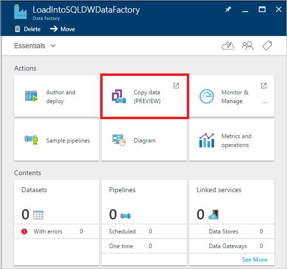
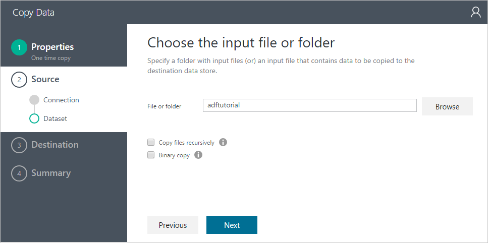
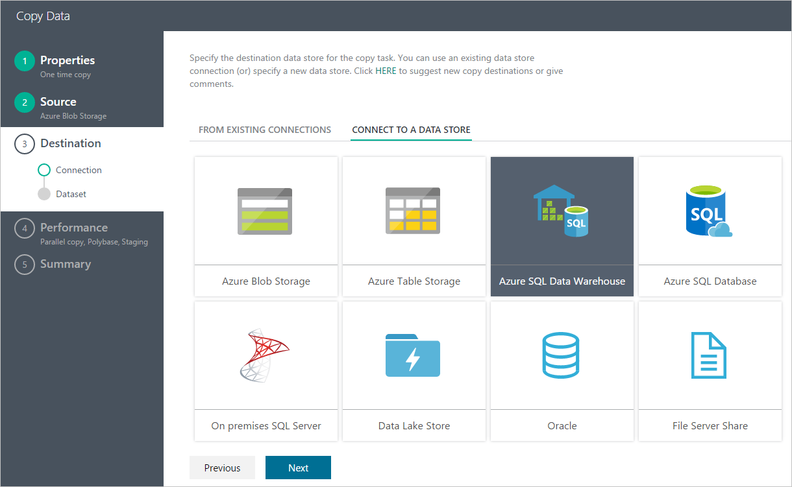
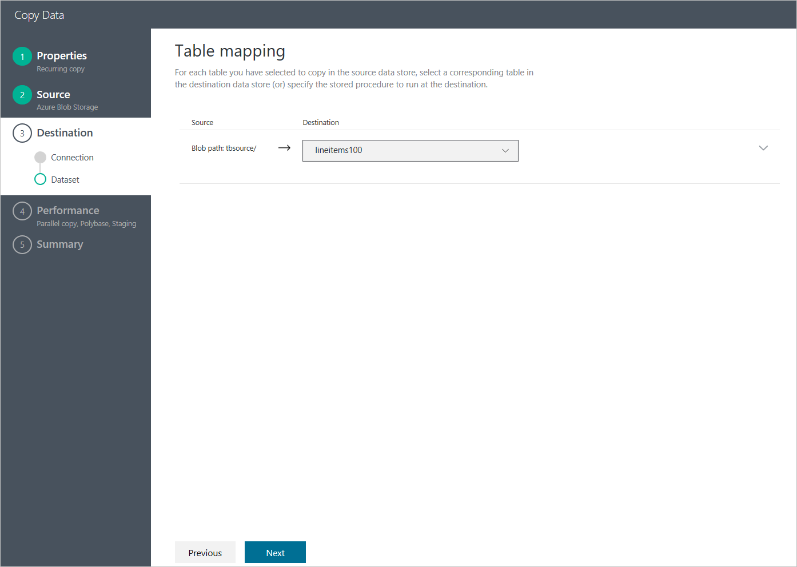
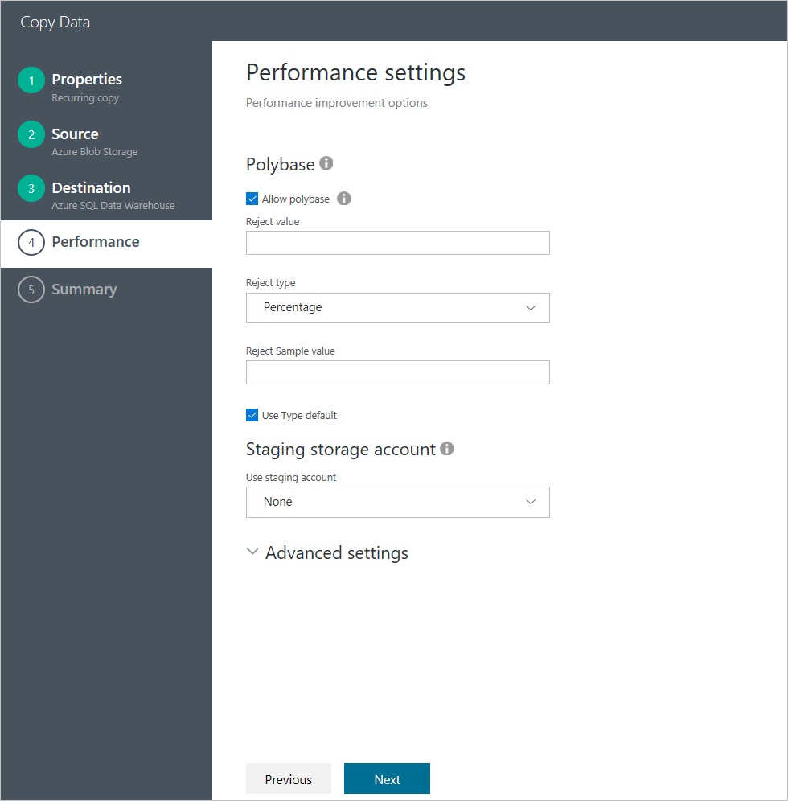
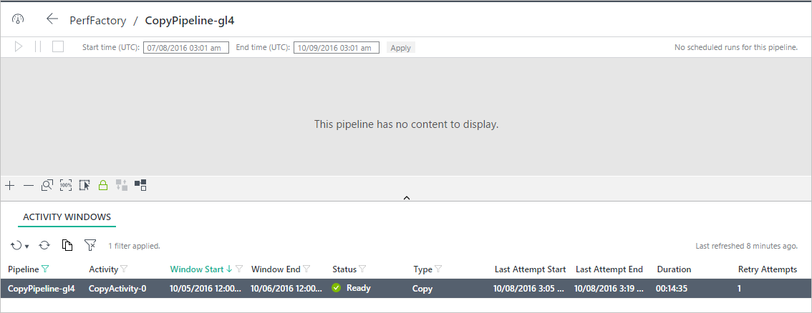

<properties 
    pageTitle="Caricare terabyte di dati in SQL Data Warehouse | Microsoft Azure" 
    description="Di seguito viene illustrato come 1 TB di dati possono essere caricati nell'archivio di dati di SQL Azure in 15 minuti con Azure Data Factory" 
    services="data-factory" 
    documentationCenter="" 
    authors="linda33wj" 
    manager="jhubbard" 
    editor="monicar"/>

<tags 
    ms.service="data-factory" 
    ms.workload="data-services" 
    ms.tgt_pltfrm="na" 
    ms.devlang="na" 
    ms.topic="article" 
    ms.date="10/28/2016" 
    ms.author="jingwang"/>

# Caricare 1 TB nell'archivio di dati di SQL Azure in 15 minuti con Azure Data Factory [Copia guidata]
[Azure SQL Data Warehouse](../sql-data-warehouse/sql-data-warehouse-overview-what-is.md) è un database basato su cloud, scalabilità in grado di elaborare grandi quantità di dati, non relazionali e relazionali.  Basata sull'architettura di elaborazione market parallela (MPP), SQL Data Warehouse è ottimizzato per carichi di lavoro warehouse dati dell'organizzazione.  Offre la flessibilità cloud grazie alla possibilità di ridurre lo spazio di archiviazione e calcolare in modo indipendente.

Guida introduttiva di Azure SQL Data Warehouse è più semplice che mai con **Azure Data Factory**.  Azure Data Factory è un servizio di integrazione dati basate su cloud completamente gestiti, può essere utilizzato per popolare un Data Warehouse SQL con i dati dal sistema esistente e risparmiare tempo durante la valutazione SQL Data Warehouse e la creazione di soluzioni analitica su di essa.  Di seguito sono i vantaggi principali di caricamento dei dati nell'archivio di dati di SQL Azure con Azure Data Factory:

- **Facile da configurare**: procedura guidata intuitiva passaggio 5 con nessuno script necessari.
- **Dati complessi archiviare supporto**: supporto incorporato per una vasta gamma di locale e archivi dati basate su cloud.
- **Protetti e conformi**: i dati vengono trasferiti su HTTPS o ExpressRoute e presenza servizio globale garantisce i dati non lasciano mai il bordo geografico
- **Prestazioni senza precedenti utilizzando PolyBase** : utilizzo Polybase è il modo più efficiente per spostare i dati nell'archivio di dati di SQL Azure. Funzionalità di gestione temporanea blob, è possibile ottenere le velocità delle condizioni di carico elevato da tutti i tipi di archivi dati oltre a archiviazione Blob Azure, che supporta il Polybase per impostazione predefinita.

In questo articolo viene illustrato come utilizzare dati Factory Copia guidata per caricare i dati di 1 TB dallo spazio di archiviazione Blob Azure nell'archivio di dati di SQL Azure in 15 minuti, in supera 1,2 GB/s velocità.

In questo articolo fornisce istruzioni dettagliate per spostare i dati nell'archivio di dati di SQL Azure utilizzando la creazione guidata copia. 

> [AZURE.NOTE] Vedere l'articolo [spostare i dati da e verso Warehouse dati di SQL Azure tramite Azure Data Factory](data-factory-azure-sql-data-warehouse-connector.md) per informazioni generali sulle funzionalità di dati di spostamento dei dati a/Data warehouse di SQL Azure. 
> 
> È anche possibile creare pipeline portale Azure, Visual Studio, PowerShell, e così via. Vedere [Esercitazione: copiare i dati da Blob Azure al Database SQL Azure](data-factory-copy-data-from-azure-blob-storage-to-sql-database.md) per una procedura dettagliata rapida con istruzioni dettagliate per l'utilizzo dell'attività Copia in Azure Data Factory.  

## Prerequisiti
- Archiviazione Blob Azure: questa prova utilizza lo spazio di archiviazione Blob Azure (GRS) per l'archiviazione dei set di dati test TPC-H.  Se non si dispone di un account di archiviazione Azure, informazioni su [come creare un account di archiviazione](../storage/storage-create-storage-account.md#create-a-storage-account).
- Dati [TPC-H](http://www.tpc.org/tpch/) : verranno utilizzare TPC-H come il set di dati di test.  A tale scopo, è necessario utilizzare `dbgen` dal toolkit TPC-H, che consente di generare il set di dati.  Si può scaricare codice sorgente per `dbgen` dagli [Strumenti TPC](http://www.tpc.org/tpc_documents_current_versions/current_specifications.asp) e compilare se stessi o scaricare binario compilato da [GitHub](https://github.com/Azure/Azure-DataFactory/tree/master/Samples/TPCHTools).  Eseguire dbgen.exe con i comandi seguenti per generare file flat di 1 TB per `lineitem` tabella diffusione tra 10 file:
    - `Dbgen -s 1000 -S **1** -C 10 -T L -v`
    - `Dbgen -s 1000 -S **2** -C 10 -T L -v`
    - …
    - `Dbgen -s 1000 -S **10** -C 10 -T L -v` 

    A questo punto copiare i file generati Blob Azure.  Fare riferimento a [spostare i dati da e verso un file system locali con Azure Data Factory](data-factory-onprem-file-system-connector.md) per come eseguire questa operazione utilizzando Copia alimentatore automatico.   
- SQL Azure Data Warehouse: questa prova carica i dati nell'archivio di dati di SQL Azure creata con 6.000 DWUs

    Per istruzioni dettagliate su come creare un database SQL Data Warehouse, fare riferimento a [creare un Data Warehouse SQL Azure](../sql-data-warehouse/sql-data-warehouse-get-started-provision/) .  Per ottenere le massime prestazioni di carico possibili nell'archivio di dati SQL utilizzando Polybase, si sceglie numero massimo di unità di magazzino dati (DWUs) consentita l'impostazione delle prestazioni, ossia 6.000 DWUs.

    > [AZURE.NOTE] 
    > Durante il caricamento da Blob Azure, dati prestazioni di caricamento sono direttamente proporzionali al numero di DWUs si configura in SQL Data Warehouse:
    > 
    > Caricamento di 1 TB 1.000 DWU SQL Data Warehouse accetta 87min (~ 200MBps velocità) caricamento di 1 TB 2.000 DWU SQL Data Warehouse accetta 46min (~ 380MBps velocità) caricamento di 1 TB 6.000 DWU SQL Data Warehouse accetta 14min (~1.2GBps velocità) 

    Per creare un Data Warehouse SQL con 6.000 DWUs, spostare il dispositivo di scorrimento prestazioni verso destra:

    

    Per un database esistente non è configurato con 6.000 DWUs, è possibile proporzioni su Azure nel portale.  Passare al database nel portale di Azure e viene visualizzato un pulsante di **scala** nel Pannello di **Panoramica** mostrato nella figura seguente:

        

    Fare clic sul pulsante di **scala** per aprire il pannello seguente, spostare il dispositivo di scorrimento al valore massimo e fare clic su **Salva** .

    
    
    Questa prova carica i dati in Azure SQL Data Warehouse utilizzando `xlargerc` classe di risorse.

    Per ottenere migliori prestazioni possibili, copia deve essere eseguita tramite un utente SQL Data Warehouse appartenente a `xlargerc` classe di risorse.  Informazioni su come a tale scopo, seguente [Modifica un esempio di classe di risorse utente](../sql-data-warehouse/sql-data-warehouse-develop-concurrency.md#change-a-user-resource-class-example).  

- Creare schema di tabella di destinazione nel database Warehouse di dati di SQL Azure, eseguendo l'istruzione DDL seguente:

        CREATE TABLE [dbo].[lineitem]
        (
            [L_ORDERKEY] [bigint] NOT NULL,
            [L_PARTKEY] [bigint] NOT NULL,
            [L_SUPPKEY] [bigint] NOT NULL,
            [L_LINENUMBER] [int] NOT NULL,
            [L_QUANTITY] [decimal](15, 2) NULL,
            [L_EXTENDEDPRICE] [decimal](15, 2) NULL,
            [L_DISCOUNT] [decimal](15, 2) NULL,
            [L_TAX] [decimal](15, 2) NULL,
            [L_RETURNFLAG] [char](1) NULL,
            [L_LINESTATUS] [char](1) NULL,
            [L_SHIPDATE] [date] NULL,
            [L_COMMITDATE] [date] NULL,
            [L_RECEIPTDATE] [date] NULL,
            [L_SHIPINSTRUCT] [char](25) NULL,
            [L_SHIPMODE] [char](10) NULL,
            [L_COMMENT] [varchar](44) NULL
        )
        WITH
        (
            DISTRIBUTION = ROUND_ROBIN,
            CLUSTERED COLUMNSTORE INDEX
        )

Con la procedura prerequisita completata, ora siamo pronti configurare l'attività copia utilizzando Copia guidata.

## Avviare la copia guidata

1.  Accedere al [portale di Azure](https://portal.azure.com).
2.  Fare clic su **+ Nuovo** da nell'angolo superiore sinistro, fare clic su **Intelligence + analitica**e fare clic su **Factory dati**. 
6. In e il **Nuovo factory dati** :
    1. Immettere **LoadIntoSQLDWDataFactory** per **nome**.
        Il nome della factory dati Azure deve essere univoco globale. Se viene visualizzato l'errore: **dati factory nome "LoadIntoSQLDWDataFactory" è non disponibile**, modificare il nome di dati (ad esempio yournameLoadIntoSQLDWDataFactory) e provare a creare di nuovo. Vedere l'argomento relativo a [Dati Factory - regole di denominazione](data-factory-naming-rules.md) per le regole di denominazione per gli elementi di dati Factory.  
     
    2. Selezionare **l'abbonamento**di Azure.
    3. Per il gruppo di risorse, eseguire una delle operazioni seguenti: 
        1. Selezionare **Usa esistente** per selezionare un gruppo di risorse esistenti.
        2. Selezionare **Crea nuovo** per immettere un nome per un gruppo di risorse.
    3. Selezionare un **percorso** per la factory di dati.
    4. Selezionare la casella di controllo **Aggiungi a dashboard** nella parte inferiore della stessa e.  
    5. Fare clic su **Crea**.
10. Una volta completata la creazione, viene visualizzato e il **Produttore di dati** , come illustrato nell'immagine seguente:

    
11. Nella home page Factory dati, fare clic sul riquadro **copiare i dati** per avviare la **Copia guidata**. 

    > [AZURE.NOTE] Se è presente che il web browser è bloccato su "Autorizzare...", disabilita/deselezionare impostazione **Blocca cookie di terze parti e i dati del sito** (o) mantenerlo abilitato e creare un'eccezione per **login.microsoftonline.com** e ritentare avviare la creazione guidata nuovo.

## Passaggio 1: Configurare il caricamento di programmazione di dati
Il primo passaggio consiste nel configurare il programma di caricamento dei dati.  

Nella pagina delle **proprietà** :
1. Immettere **CopyFromBlobToAzureSqlDataWarehouse** per **nome dell'attività**
2. Selezionare l'opzione **Esegui una volta** .   
3. Fare clic su **Avanti**.  

## Passaggio 2: Configurare origine
In questa sezione illustra la procedura per configurare l'origine: Blob Azure contenente la riga TB TPC-H 1 elemento file.

Selezionare **Archiviazione Blob Azure** come i dati, fare clic su **Avanti**.

Inserire le informazioni di connessione per l'account di archiviazione Blob Azure e fare clic su **Avanti**.

Scegliere la **cartella** contenente i file di voce TPC-H e fare clic su **Avanti**.

Facendo clic **successivo**, le impostazioni del formato di file vengono rilevati automaticamente.  Verificare che sia il delimitatore di colonna "|"anziché la virgola predefinito' '.  Dopo che è visualizzato in anteprima i dati, fare clic su **Avanti** .

## Passaggio 3: Configurare destinazione
In questa sezione viene illustrato come configurare la destinazione: `lineitem` tabella nel database Warehouse di dati di SQL Azure.

Scegliere **Azure SQL Data Warehouse** come archivio di destinazione e fare clic su **Avanti**.

Compilare le informazioni di connessione per archivio di dati di SQL Azure.  Assicurarsi di specificare l'utente è un membro del ruolo `xlargerc` (vedere la sezione relativa ai **Prerequisiti** per informazioni dettagliate), fare clic su **Avanti**. 

Scegliere la tabella di destinazione e fare clic su **Avanti**.

Accettare le impostazioni predefinite per il mapping di colonna e fare clic su **Avanti**.

## Passaggio 4: Impostazioni relative alle prestazioni

**Consenti polybase** sia selezionata per impostazione predefinita.  Fare clic su **Avanti**.

## Passaggio 5: Distribuire e monitorare i risultati di caricamento
Fare clic su pulsante **Fine** per distribuire. 

Una volta completata la distribuzione, fare clic su `Click here to monitor copy pipeline` per controllare la copia eseguita lo stato di avanzamento.

Selezionare la pipeline di copia creata nell'elenco delle **Attività di Windows** .

È possibile visualizzare la copia dettagli di esecuzione di **Attività finestra Explorer** nel Pannello di destra, compreso il volume di dati letti dall'origine e scritti nella destinazione, durata e la velocità media per l'esecuzione.

Come si può notare dalla schermata seguente, la copia di 1 TB dallo spazio di archiviazione Blob Azure SQL Data warehouse ha 14 minuti, in modo efficace per ottenere 1.22 GB/s velocità!

## Procedure consigliate
Ecco alcune procedure consigliate per l'esecuzione del database Warehouse di dati di SQL Azure:

- Utilizzare una classe di risorse maggiore durante il caricamento in un indice di COLUMNSTORE a barre raggruppate.
- Per join più efficienti, è preferibile distribuzione hash da una colonna Seleziona anziché predefinito arrotondare Marco distribuzione.
- Per velocità di caricamento, è preferibile heap per i dati temporanei.
- Creare statistiche dopo aver completato il caricamento di Warehouse di dati di SQL Azure.

Per informazioni dettagliate, vedere [procedure consigliate per la Data Warehouse di SQL Azure](../sql-data-warehouse/sql-data-warehouse-best-practices.md) . 

## Passaggi successivi
- [Dati Factory Copia guidata](data-factory-copy-wizard.md) - in questo articolo vengono fornite informazioni dettagliate su Copia guidata. 
- [Attività di copia manuale sulle prestazioni e regolazione](data-factory-copy-activity-performance.md) - in questo articolo contiene la misurazione delle prestazioni di riferimento e Guida all'ottimizzazione.

