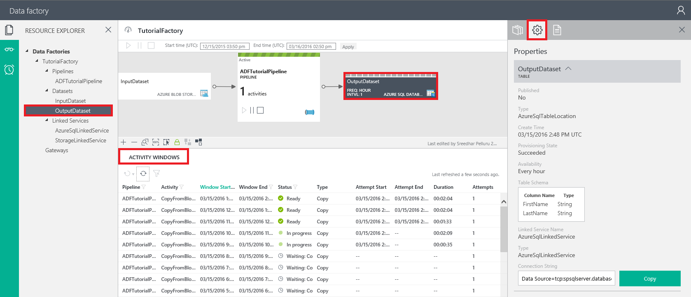
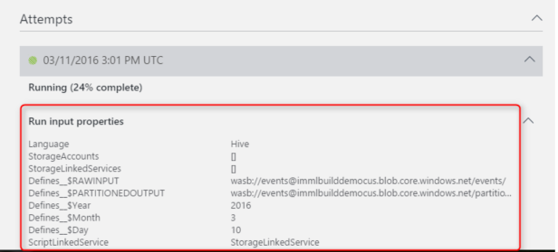
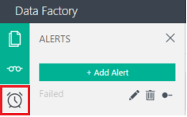
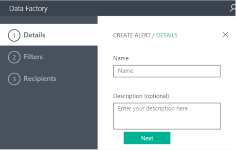
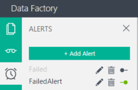

<properties 
    pageTitle="Monitorare e gestire pipeline di Azure Data Factory" 
    description="Informazioni su come utilizzare Monitoraggio e gestione delle App per monitorare e gestire tubazioni e dati di Azure factory." 
    services="data-factory" 
    documentationCenter="" 
    authors="spelluru" 
    manager="jhubbard" 
    editor="monicar"/>

<tags 
    ms.service="data-factory" 
    ms.workload="data-services" 
    ms.tgt_pltfrm="na" 
    ms.devlang="na" 
    ms.topic="article" 
    ms.date="09/06/2016" 
    ms.author="spelluru"/>

# Monitorare e gestire pipeline di Azure Data Factory utilizzando nuovo monitoraggio e gestione App
> [AZURE.SELECTOR]
- [Utilizzo di PowerShell portale/Azure Azure](data-factory-monitor-manage-pipelines.md)
- [Tramite il monitoraggio e gestione App](data-factory-monitor-manage-app.md)

In questo articolo viene descritto come monitorare, gestire ed eseguire il debug la pipeline e consente di creare avvisi per ricevere una notifica nella errori utilizzando il **monitoraggio e gestione delle App**. È anche possibile guardare il video seguente per informazioni sull'uso di monitoraggio e gestione delle App.
   

> [AZURE.VIDEO azure-data-factory-monitoring-and-managing-big-data-piplines]
      
## Avviare il monitoraggio e gestione App un
Per avviare il Monitor e gestione delle App, fare clic su riquadro di **monitoraggio e Gestisci** nella e **Produttore dati** dell'ambiente di produzione di dati.

 

Verrà visualizzato avviato il monitoraggio e gestione App in una scheda o un'altra finestra.  

> [AZURE.NOTE] Se è presente che il web browser è bloccato su "Autorizzare...", disabilita/deselezionare impostazione **Blocca cookie di terze parti e i dati del sito** (o) mantenerlo abilitato e creare un'eccezione per **login.microsoftonline.com** e ritentare avviando nuovamente l'applicazione.

Se non è disponibile windows attività nell'elenco nella parte inferiore, fare clic sul pulsante **Aggiorna** nella barra degli strumenti per aggiornare l'elenco. Inoltre, impostare i valori corretti per i filtri **ora di inizio** e **Data/ora fine** .  

## Comprendere il monitoraggio e gestione App
Sono disponibili tre schede (**Esplora risorse**, **Visualizzazioni di monitoraggio**e **avvisi**) a sinistra e la prima scheda (risorse) sia selezionata per impostazione predefinita. 

### Esplora risorse
Verrà visualizzato quanto segue: 

- Esplora risorse **visualizzazione albero** nel riquadro sinistro.
- **Vista diagramma** nella parte superiore.
- Elenco di **Attività di Windows** in basso nel riquadro centrale.
- **Proprietà**/le schede**Attività finestra Explorer** nel riquadro destro. 

In Esplora risorse, viene visualizzato tutte le risorse (tubazioni, set di dati, servizi collegati) nella factory dati in una visualizzazione struttura. Quando si seleziona un oggetto in Esplora risorse, si noterà quanto segue: 

- entità Factory dati associata viene evidenziato nella vista diagramma.
- associato windows attività (fare clic [qui](data-factory-scheduling-and-execution.md) per informazioni su windows attività) vengono evidenziati nell'elenco attività Windows nella parte inferiore.  
- proprietà dell'oggetto selezionato nella finestra delle proprietà nel riquadro destro. 
- Definizione di JSON dell'oggetto selezionato, se applicabile. Ad esempio: un servizio collegato o un set di dati o una pipeline. 

Vedere l'articolo [pianificazione ed esecuzione](data-factory-scheduling-and-execution.md) per informazioni dettagliate sulla finestra di attività. 

### Vista diagramma
La visualizzazione Diagramma di una factory dati offre un'unica interfaccia per monitorare e gestire la factory di dati e delle relative risorse. Quando si seleziona un'entità Factory dati (set di dati/pipeline) nella vista diagramma, si noterà quanto segue:
 
- l'entità factory dati sia selezionata nella visualizzazione struttura
- attività associata windows vengono evidenziati nell'elenco attività Windows.
- proprietà dell'oggetto selezionato nella finestra delle proprietà

Quando la pipeline è attivata (non in stato di sospensione), viene visualizzato con una linea verde. 

Si sono disponibili tre pulsanti di comando per la pipeline nella vista diagramma. È possibile utilizzare il secondo pulsante per mettere in pausa la pipeline. Sospensione non terminare l'attività attualmente in esecuzione e permettono di continuare fino al completamento. Terzo pulsante sospende la pipeline e termina l'esecuzione di attività esistente. Primo pulsante riprende la pipeline. Quando è in pausa la pipeline, si nota la modifica del colore per la pipeline affiancate come indicato di seguito.

È possibile selezione multipla due o più tubazioni (usando CTRL) e utilizzare i pulsanti della barra per sospendere o riprendere più pipeline alla volta.

È possibile visualizzare tutte le attività nella pipeline, il pulsante destro del riquadro pipeline e facendo clic su **aprire pipeline**.

In visualizzazione pipeline aperto, viene visualizzato tutte le attività nella pipeline. In questo esempio, non esiste una sola attività: attività di copia. Per tornare alla visualizzazione precedente, fare clic su nome factory dati nel menu di navigazione nella parte superiore.

Nella visualizzazione pipeline quando si fa clic su un set di dati di output o quando si sposta il puntatore del mouse sul set di dati di output, viene visualizzato il popup di Windows di attività per il set di dati.

È possibile fare clic su una finestra di attività per visualizzare i dettagli per renderla nella finestra delle **proprietà** nel riquadro destro. 

Nel riquadro destro, passare alla scheda **Attività finestra Explorer** per visualizzare ulteriori dettagli.

 

Vengono visualizzate **le variabili di risoluzione** per ogni esecuzione di attività tenta nella sezione **tentativi** . 

Passare alla scheda **Script** per visualizzare la definizione di script JSON per l'oggetto selezionato.   

È possibile visualizzare finestre di attività in tre posizioni:

- Finestra popup di Windows attività nella visualizzazione Diagramma (riquadro centrale).
- Attività finestra Explorer nel riquadro destro.
- Elenco di attività Windows nel riquadro inferiore.

Nelle finestre di attività a comparsa e attività finestra Explorer, è possibile scorrere per settimana precedente e successiva con frecce destra e sinistra.

Nella parte inferiore della visualizzazione Diagramma, viene visualizzato pulsanti di Zoom avanti, Zoom indietro Zoom per adattarlo, eseguire lo Zoom 100%, bloccare layout. Pulsante layout blocco consente di spostare accidentalmente tabelle e pipeline nella vista diagramma ed è attivato per impostazione predefinita. È possibile disattivarla e spostarsi entità nel diagramma. Quando si disattiva, è possibile utilizzare l'ultimo pulsante per posizionare automaticamente le tabelle e pipeline. È anche possibile applicare lo Zoom avanti / zoom tramite rotellina del mouse.

### Elenco di attività di Windows
Nell'elenco attività nella parte inferiore del riquadro centrale visualizza tutte le finestre di attività per il set di dati selezionata nella visualizzazione Diagramma o Esplora risorse. Per impostazione predefinita, l'elenco è in ordine decrescente, ovvero che sia visualizzata la finestra di attività più recente nella parte superiore. 

Questo elenco non aggiornare automaticamente, quindi usare il pulsante Aggiorna sulla barra degli strumenti per aggiornare manualmente il.  

Windows attività possono essere in uno degli stati seguenti:

<table>
<tr>
    <th align="left">Stato</th><th align="left">Stato secondario</th><th align="left">Descrizione</th>
</tr>
<tr>
    <td rowspan="8">In attesa</td><td>ScheduleTime</td><td>Non è arrivato il momento per la finestra di attività per l'esecuzione.</td>
</tr>
<tr>
<td>DatasetDependencies</td><td>Le dipendenze padre non sono pronte.</td>
</tr>
<tr>
<td>ComputeResources</td><td>Le risorse di elaborazione non sono disponibili.</td>
</tr>
<tr>
<td>ConcurrencyLimit</td> <td>Tutte le istanze di attività sono occupate con altre attività di windows.</td>
</tr>
<tr>
<td>ActivityResume</td><td>Attività pausa e non è possibile eseguire windows attività finché non viene riattivato.</td>
</tr>
<tr>
<td>Riprova</td><td>Esecuzione di attività viene ripetuta.</td>
</tr>
<tr>
<td>Convalida</td><td>Convalida non è ancora iniziato.</td>
</tr>
<tr>
<td>ValidationRetry</td><td>In attesa per la convalida tentativo.</td>
</tr>
<tr>
<tr
<td rowspan="2">In corso</td><td>La convalida</td><td>Convalida in corso.</td>
</tr>
<td></td>
<td>La finestra attività è stata elaborata.</td>
</tr>
<tr>
<td rowspan="4">Non è riuscito</td><td>TimedOut</td><td>Esecuzione ha più tempo del consentito dall'attività.</td>
</tr>
<tr>
<td>Annullato</td><td>Annullare un'azione dell'utente.</td>
</tr>
<tr>
<td>Convalida</td><td>Convalida non riuscita.</td>
</tr>
<tr>
<td></td><td>Non è possibile generare e/o convalidare la finestra attività.</td>
</tr>
<td>Pronto</td><td></td><td>La finestra di attività è pronta per l'utilizzo.</td>
</tr>
<tr>
<td>Ignorati</td><td></td><td>Finestra di attività non viene elaborata.</td>
</tr>
<tr>
<td>Nessuno</td><td></td><td>Una finestra di attività utilizzato per esistenti con uno stato diverso, ma non è stati opportunamente reimpostata.</td>
</tr>
</table>

Quando si fa clic su un intervallo di azione nell'elenco, dettagli nella finestra di **Esplora risorse attività** o **proprietà** viene visualizzata a destra.

### L'aggiornamento di windows di attività  
I dettagli non vengono aggiornati automaticamente, in modo da utilizzare **l'aggiornamento** del pulsante della barra dei comandi per aggiornare manualmente l'elenco attività di windows (secondo pulsante).  
 

### Finestra proprietà
La finestra proprietà è nel riquadro più a destra della finestra dell'app di monitoraggio e gestione. 

Visualizza le proprietà per l'elemento selezionato nella Esplora risorse (struttura) (o) diagramma visualizzazione (o) elenco di attività di windows. 

### Attività finestra Explorer

La finestra **Esplora attività** è nel riquadro più a destra del monitoraggio e gestione delle App. Visualizza la finestra di attività selezionata nell'elenco attività Windows o attività di Windows a comparsa i dettagli. 

È possibile passare a un'altra finestra attività facendo clic su esso nella visualizzazione calendario nella parte superiore. È inoltre possibile utilizzare la **freccia sinistra**/pulsanti**freccia a destra** nella parte superiore per visualizzare windows attività dal valore precedente/prossima settimana.

È possibile utilizzare i pulsanti della barra degli strumenti nel riquadro inferiore per **eseguire nuovamente** la finestra di attività o **aggiornare** i dettagli nel riquadro. 

### Script 
È possibile utilizzare la scheda **Script** per visualizzare la definizione di JSON dell'entità Factory dati selezionata (servizi collegati, set di dati e pipeline). 

## Usando le visualizzazioni di sistema
Il monitoraggio e gestione delle App include visualizzazioni di sistema predefinite (**windows attività recenti**, **non riuscito attività windows**, **Windows attività In corso**) che consente di visualizzazione delle finestre di recente o non è riuscita/in corso attività dell'ambiente di produzione di dati. 

Passare alla scheda **Visualizzazioni di monitoraggio** sul lato sinistro facendo clic su esso. 

Attualmente sono disponibili tre visualizzazioni di sistema è supportate. Selezionare un'opzione per visualizzare recenti attività windows (o) windows attività non riuscito (o) windows in corso attività nell'elenco attività Windows (nella parte inferiore del riquadro centrale). 

Quando si seleziona l'opzione **recenti attività** , viene visualizzato tutte le finestre attività recenti in ordine decrescente **dell'ultimo tentativo ora**. 

È possibile utilizzare la visualizzazione **non riuscito attività windows** per visualizzare tutte le finestre di attività non riuscito nell'elenco. Selezionare una finestra di attività non riuscito nell'elenco per visualizzare dettagli nella **proprietà** finestra (o) **Attività finestra Explorer**. È anche possibile scaricare i registri di una finestra di attività non riuscito. 

## Ordinamento e filtro windows attività
Modificare le impostazioni di **ora di inizio** e **Data/ora fine** nella barra dei comandi di filtro a un'altra attività. Dopo aver modificato l'ora di inizio e ora di fine, fare clic sul pulsante accanto a ora di fine per aggiornare l'elenco attività Windows.

> [AZURE.NOTE] Tutti gli orari sono attualmente disponibili in formato UTC il monitoraggio e gestione App. 

Nell' **elenco attività di Windows**, fare clic sul nome di una colonna (ad esempio: stato). 

È possibile eseguire le operazioni seguenti:

- Ordinamento in ordine crescente.
- Ordinamento in ordine decrescente.
- Filtrare in base a uno o più valori (pronti, in attesa, ecc.)

Quando si specifica un filtro in una colonna, viene visualizzato il pulsante filtro abilitato per la colonna indicare che i valori nella colonna sono valori filtrati. 

È possibile utilizzare la stessa finestra popup per cancellare i filtri. Per cancellare tutti i filtri per l'elenco di attività windows, fare clic sul pulsante Cancella filtro sulla barra dei comandi. 

## Esecuzione di azioni batch

### Eseguire di nuovo l'attività selezionata windows
Selezionare un intervallo di azione, fare clic sulla freccia in giù del pulsante comando prima e selezionare **rieseguire** / **rieseguire con monte nella pipeline**. Quando si seleziona **rieseguire con monte nella pipeline di** opzione, esegue di nuovo anche tutte le finestre di attività padre. 
    

È anche possibile selezionare più finestre attività nell'elenco ed eseguire di nuovo nello stesso momento. È possibile filtrare windows attività in base a stato (ad esempio: **non riuscito**) e quindi eseguire di nuovo le finestre di attività non riuscito dopo aver risolto il problema che causa le finestre di attività per avere esito negativo. Vedere la sezione seguente per informazioni dettagliate sui filtri windows attività nell'elenco.  

### Sospendere o riprendere più pipeline
È possibile selezionare più due o più tubazioni (usando CTRL) e utilizzare pulsanti (evidenziati in rosso rettangolo nell'immagine seguente) per sospendere o riprendere loro alla volta.

## Creazione avvisi 
La pagina avvisi consente di creare un avviso Visualizza/Modifica/Elimina gli avvisi esistenti. È possibile anche disabilitare o abilitare un avviso. Per visualizzare la pagina avvisi, fare clic sulla scheda avvisi.

### Per creare un avviso

1. Fare clic su **Aggiungi avviso** per aggiungere un avviso. Viene visualizzata la pagina dei dettagli. 

    
1. Specificare il **nome** e una **Descrizione** per l'avviso e fare clic su **Avanti**. Verrà visualizzata la pagina di **filtri** .

    

2. Selezionare **l'evento**, **stato**e **dello stato secondario** (facoltativo) in cui si desidera che il servizio Factory dati a un avviso e fare clic su **Avanti**. Verrà visualizzata la pagina di **destinatari** .

     
3. Selezionare l'opzione **gli amministratori di sottoscrizione di posta elettronica** e/o immettere **posta elettronica amministratore aggiuntivi**e fare clic su **Fine**. Verrà visualizzato l'avviso nell'elenco. 
    
    

Nell'elenco degli avvisi, utilizzare i pulsanti associati all'avviso per Modifica/Elimina/disabilitare o abilitare un avviso. 

### Stato/evento/secondario
La tabella seguente contiene l'elenco di eventi disponibili e stati (e stati secondari).

Nome dell'evento | Stato | Stato Sub
-------------- | ------ | ----------
Attività eseguire avviato | Iniziare | Avvio
Attività eseguire termine | È stata eseguita correttamente | È stata eseguita correttamente 
Attività eseguire termine | Non è riuscito| Assegnazione di risorse non riuscito  Ha avuto esito negativo  Timeout  Convalida non riuscita  Chiusa
Creare introduttiva Cluster HDI su richiesta | Iniziare | &nbsp; |
Cluster HDI su richiesta creato correttamente | È stata eseguita correttamente | &nbsp; |
Cluster HDI su richiesta eliminati | È stata eseguita correttamente | &nbsp; |
### Per modifica o Elimina/disattivare un avviso

    
 

