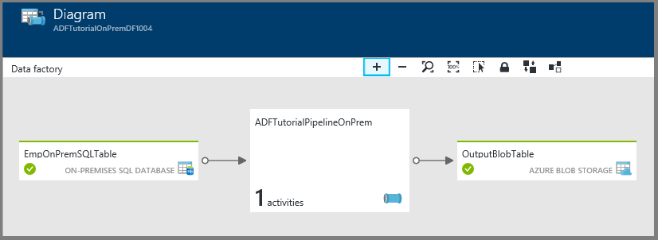
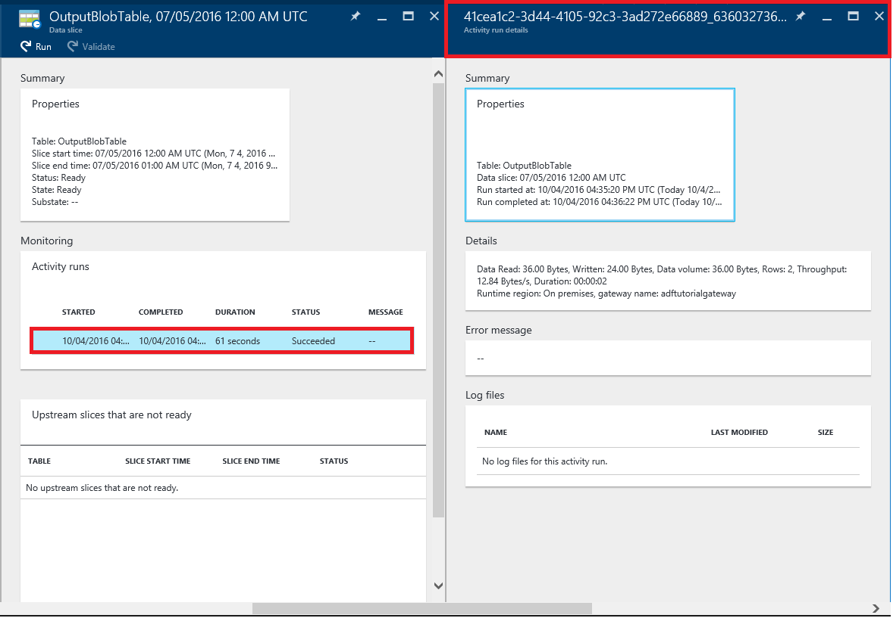
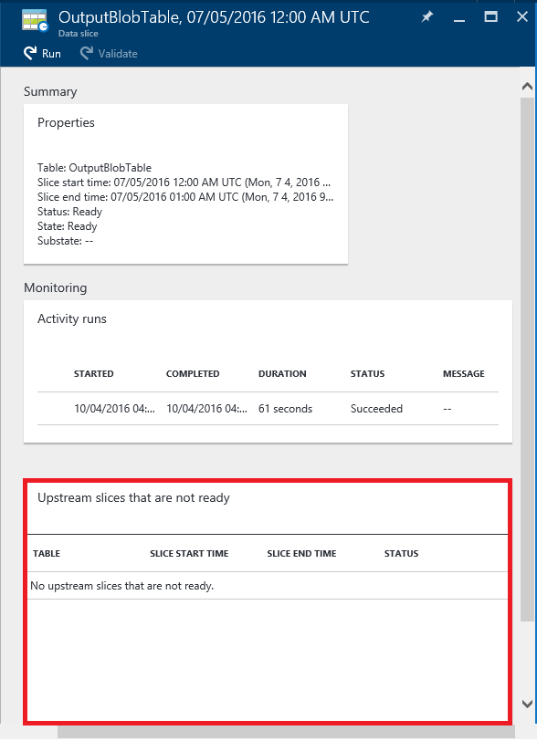
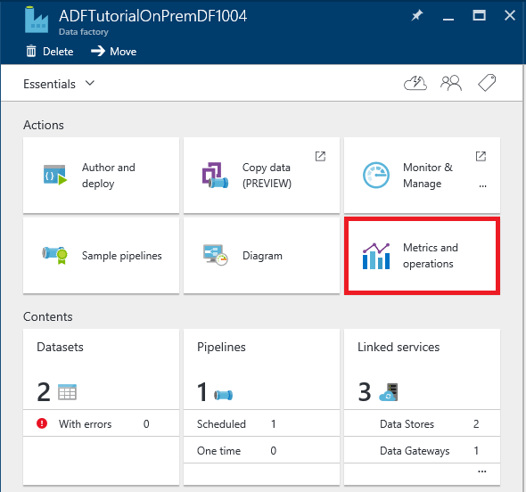
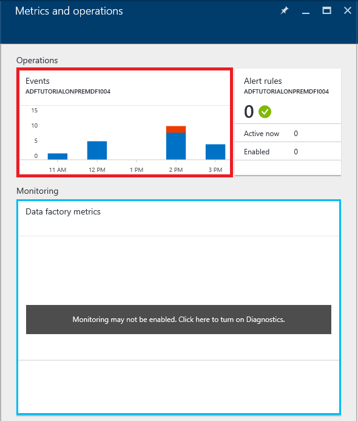
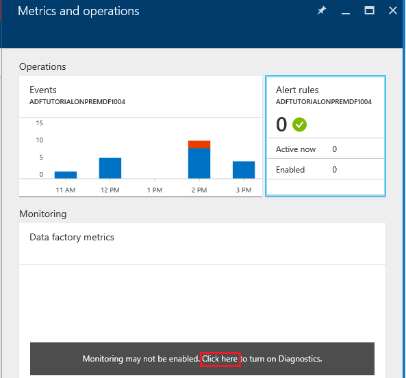
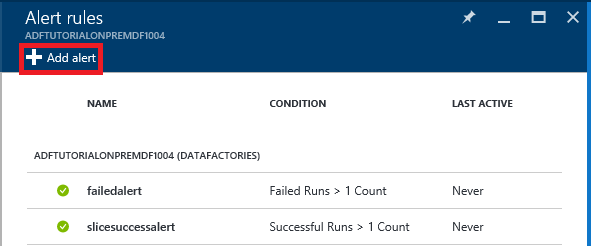
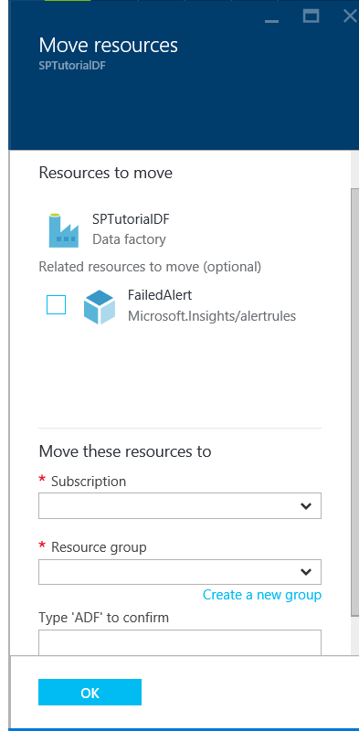

<properties 
    pageTitle="Monitorare e gestire pipeline di Azure Data Factory" 
    description="Informazioni su come usare portale Azure e Azure PowerShell per monitorare e gestire dati di Azure factory e pipeline che è stato creato." 
    services="data-factory" 
    documentationCenter="" 
    authors="spelluru" 
    manager="jhubbard" 
    editor="monicar"/>

<tags 
    ms.service="data-factory" 
    ms.workload="data-services" 
    ms.tgt_pltfrm="na" 
    ms.devlang="na" 
    ms.topic="article" 
    ms.date="09/06/2016" 
    ms.author="spelluru"/>

# Monitorare e gestire pipeline di Azure Data Factory
> [AZURE.SELECTOR]
- [Utilizzo di Azure portale Azure PowerShell](data-factory-monitor-manage-pipelines.md)
- [Tramite il monitoraggio e gestione App](data-factory-monitor-manage-app.md)

Il servizio dati Factory fornisce visualizzazione affidabile e completa di servizi movimento dello spazio di archiviazione, elaborazione e dati. Il servizio fornisce un monitoraggio consente di dashboard che è possibile utilizzare per eseguire le operazioni seguenti: 

- Valutare rapidamente dell'integrità della pipeline di dati-to-end.
- Identificare i problemi e adottare misure correttive se necessario. 
- Derivazione dei dati di traccia. 
- Tenere traccia delle relazioni tra i dati in una delle fonti.
- Contabilità completo cronologici visualizzazione di esecuzione del processo, l'integrità del sistema e le dipendenze.

In questo articolo viene descritto come monitorare, gestire ed eseguire il debug la pipeline. Vengono inoltre fornite informazioni su come creare avvisi e ricevere una notifica in errori.

## Informazioni su tubazioni e stati di attività
Tramite il portale di Azure, è possibile:

- Visualizzare il produttore di dati come un diagramma
- Visualizzare le attività in una pipeline
- Visualizzare i set di dati di input e di output
- e altro ancora. 

In questa sezione vengono forniti anche la modalità di una sezione transizione da uno stato a un altro stato.   

### Passare all'ambiente di produzione dati
1.  Accedere al [portale di Azure](https://portal.azure.com).
2.  Fare clic su **factory dati** nel menu a sinistra. Se non è presente, fare clic su **altri servizi >** e fare clic su **factory dati** nella categoria di **Business INTELLIGENCE + ANALYTICS** . 

    

    Verranno visualizzate tutte le factory di dati e il **factory di dati** . 
4. Nella finestra e factory dati selezionare factory dati che interessa.

      
5.  viene visualizzata la home page (**factory dati** blade) per la factory di dati.

    

#### Visualizzazione Diagramma di factory i dati
La visualizzazione Diagramma di una factory dati offre un'unica interfaccia per monitorare e gestire la factory di dati e delle relative risorse.

Per passare alla visualizzazione Diagramma di factory i dati, fare clic su **diagramma** nella home page di dati factory.

È possibile applicare lo zoom avanti, zoom indietro, per stampare, eseguire lo zoom al 100%, bloccare il layout del diagramma e posizionare automaticamente tubazioni e tabelle. È anche possibile visualizzare le informazioni sulla derivazione dei dati (Mostra gli elementi padre e downstream degli elementi selezionati).
 

### Attività all'interno di una pipeline 
1. Il pulsante destro la pipeline e fare clic su **aprire pipeline** per visualizzare tutte le attività di pipeline e set di dati di input e di output per le attività. Questa funzionalità è utile quando la pipeline è costituita da più di un'attività e si desidera ottenere informazioni sulla derivazione dell'operative di una singola pipeline.

      
2. In questo esempio, viene visualizzato due attività nella pipeline con loro ingressi e uscite. L'attività intitolato **JoinData** del tipo di attività Hive HDInsight ed **EgressDataAzure** del tipo di attività di copia sono in questa pipeline di esempio. 
    
     
3. È possibile passare alla home page di Factory dati facendo clic sul collegamento factory dati nella struttura di spostamento nell'angolo superiore sinistro.

    

### Stato di visualizzazione di ogni attività all'interno di una pipeline
È possibile visualizzare lo stato corrente di un'attività dalla visualizzazione dello stato di uno dei set di dati prodotti dall'attività. 

Ad esempio: nell'esempio seguente **BlobPartitionHiveActivity** avvenuta correttamente e prodotti di un set di dati denominato **PartitionedProductsUsageTable**, che è **Pronto** .

Fare doppio clic su **PartitionedProductsUsageTable** nella vista diagramma mostra tutte le sezioni prodotte da viene eseguito diverse attività all'interno di una pipeline. È possibile vedere che **BlobPartitionHiveActivity** stato eseguito correttamente ogni mese per ultimo otto mesi e prodotto le sezioni nello stato **Pronto** .

Le sezioni del set di dati nella factory dati possono avere uno degli stati seguenti:

<table>
<tr>
    <th align="left">Stato</th><th align="left">Stato secondario</th><th align="left">Descrizione</th>
</tr>
<tr>
    <td rowspan="8">In attesa</td><td>ScheduleTime</td><td>Per eseguire la sezione non è arrivato il momento.</td>
</tr>
<tr>
<td>DatasetDependencies</td><td>Le dipendenze padre non sono pronte.</td>
</tr>
<tr>
<td>ComputeResources</td><td>Le risorse di elaborazione non sono disponibili.</td>
</tr>
<tr>
<td>ConcurrencyLimit</td> <td>Tutte le istanze di attività sono occupate in esecuzione di altre sezioni.</td>
</tr>
<tr>
<td>ActivityResume</td><td>Attività pausa e non è possibile eseguire le sezioni finché non viene riattivato.</td>
</tr>
<tr>
<td>Riprova</td><td>Esecuzione di attività viene ripetuta.</td>
</tr>
<tr>
<td>Convalida</td><td>Convalida non è ancora iniziato.</td>
</tr>
<tr>
<td>ValidationRetry</td><td>In attesa per la convalida tentativo.</td>
</tr>
<tr>
<tr
<td rowspan="2">In corso</td><td>La convalida</td><td>Convalida in corso.</td>
</tr>
<td></td>
<td>Elaborazione della sezione.</td>
</tr>
<tr>
<td rowspan="4">Non è riuscito</td><td>TimedOut</td><td>Esecuzione ha più tempo del consentito dall'attività.</td>
</tr>
<tr>
<td>Annullato</td><td>Annullare un'azione dell'utente.</td>
</tr>
<tr>
<td>Convalida</td><td>Convalida non riuscita.</td>
</tr>
<tr>
<td></td><td>Non è possibile generare e/o convalidare la sezione.</td>
</tr>
<td>Pronto</td><td></td><td>La sezione sia pronta per l'utilizzo.</td>
</tr>
<tr>
<td>Ignorati</td><td></td><td>La sezione non viene elaborata.</td>
</tr>
<tr>
<td>Nessuno</td><td></td><td>Sezione utilizzato per esistenti con uno stato diverso, ma è stati opportunamente reimpostata.</td>
</tr>
</table>

È possibile visualizzare i dettagli di una sezione, fare clic su una voce di sezione e il **Sezioni aggiornato di recente** .

 
Se la sezione è stata eseguita più volte, risulta più righe nell'elenco **attività viene eseguito** . È possibile visualizzare i dettagli di un'attività eseguire facendo clic sulla voce Esegui nell'elenco **che attività viene eseguito** . L'elenco Mostra tutti i file di log insieme a un messaggio di errore, se presenti. Questa funzionalità è utile per visualizzare e registri di debug senza dover uscire factory i dati.

Se la sezione non è nello stato **Pronto** , è possibile vedere le sezioni padre che non sono pronti e bloccano la sezione corrente dall'esecuzione nell'elenco **padre sezioni non pronti** . Questa funzionalità è utile quando la sezione è **in attesa** e si desidera tenere presenti le dipendenze padre su cui è in attesa la sezione.

### Diagramma di stato di set di dati
Quando si distribuisce una factory di dati e la pipeline di avere un periodo di validità attivo, il set di dati sezioni transizione da uno stato a un'altra. Attualmente lo stato di sezione successivo nel diagramma di stato seguente:

Il flusso di transizione dello stato di set di dati nella factory dati: in attesa -> In corso/In esecuzione (convalida) -> pronto/non riuscito

Le sezioni iniziare in uno stato **in attesa** per pre-condizioni prima dell'esecuzione. Inizio dell'attività in esecuzione, quindi la sezione entra nello stato **In corso** . L'esecuzione di attività può esito positivo o negativo. La sezione è contrassegnata come **Pronto**' o **Failed** basata sul risultato dell'esecuzione. 

È possibile reimpostare la sezione tornare dallo stato **Pronto** o **non** lo stato **in attesa** . È possibile contrassegnare anche lo stato di sezione su **Ignora**, che impedisce l'esecuzione di attività e non elaborare la sezione.

## Gestire le tubazioni
È possibile gestire la pipeline tramite PowerShell Azure. Ad esempio, è possibile posizionare il puntatore e riprendere pipeline eseguendo i cmdlet di PowerShell Azure. 

### Interrompere e riprendere pipeline
È possibile sospendere/sospendere mediante il cmdlet di Powershell **Sospensione AzureRmDataFactoryPipeline** . Questo cmdlet è utile quando non si desidera eseguire la pipeline finché non viene risolto un problema.

Ad esempio: nella schermata seguente, è stato individuato un problema con **PartitionProductsUsagePipeline** nella factory dati **productrecgamalbox1dev** e si vuole sospendere la pipeline.

Per sospendere una pipeline, eseguire il comando PowerShell seguente:

    Suspend-AzureRmDataFactoryPipeline [-ResourceGroupName] <String> [-DataFactoryName] <String> [-Name] <String>

Per esempio:

    Suspend-AzureRmDataFactoryPipeline -ResourceGroupName ADF -DataFactoryName productrecgamalbox1dev -Name PartitionProductsUsagePipeline 

Dopo il problema è stato risolto con **PartitionProductsUsagePipeline**, è possibile riprendere la pipeline sospesa eseguendo il seguente comando di PowerShell:

    Resume-AzureRmDataFactoryPipeline [-ResourceGroupName] <String> [-DataFactoryName] <String> [-Name] <String>

Per esempio:

    Resume-AzureRmDataFactoryPipeline -ResourceGroupName ADF -DataFactoryName productrecgamalbox1dev -Name PartitionProductsUsagePipeline 

## Eseguire il debug pipeline
Azure Data Factory offre potenti funzionalità tramite il portale di Azure e Azure PowerShell per eseguire il debug e risolvere i problemi di condutture.

### Individuare gli errori in una pipeline
Se l'esecuzione di attività non riesce in una pipeline, il set di dati prodotto dalla pipeline è in stato di errore a causa dell'errore. È possibile eseguire il debug e risolvere gli errori di Azure Data Factory tramite i seguenti meccanismi.

#### Usare il portale di Azure per risolvere un errore:

3.  In e il **tabella** , fare clic sulla sezione problema con **stato** impostato su **non riuscito**.

    
4.  In e il **Sezione di dati** , fare clic sull'attività che non è possibile eseguire.
    
    
5.  In e il **Dettagli esecuzione di attività** , è possibile scaricare i file associati all'elaborazione HDInsight. Fare clic su Download per stato/stderr di scaricare il file di log di errore che contiene i dettagli sull'errore.

      

#### Usare PowerShell per eseguire il debug di un messaggio di errore
1.  Avviare **PowerShell Azure**.
3.  Eseguire il comando **Get-AzureRmDataFactorySlice** per vedere le sezioni e il relativo stato. Verrà visualizzata una sezione con lo stato: **non riuscito**.       

            Get-AzureRmDataFactorySlice [-ResourceGroupName] <String> [-DataFactoryName] <String> [-TableName] <String> [-StartDateTime] <DateTime> [[-EndDateTime] <DateTime> ] [-Profile <AzureProfile> ] [ <CommonParameters>]
    
    Per esempio:
        
            Get-AzureRmDataFactorySlice -ResourceGroupName ADF -DataFactoryName LogProcessingFactory -TableName EnrichedGameEventsTable -StartDateTime 2014-05-04 20:00:00

    Sostituire **esecuzione** con il valore di esecuzione specificato per il Set-AzureRmDataFactoryPipelineActivePeriod.
4. A questo punto, eseguire il cmdlet **Get-AzureRmDataFactoryRun** per ottenere informazioni sulle attività eseguire per la sezione.

        Get-AzureRmDataFactoryRun [-ResourceGroupName] <String> [-DataFactoryName] <String> [-TableName] <String> [-StartDateTime] 
        <DateTime> [-Profile <AzureProfile> ] [ <CommonParameters>]
    
    Per esempio:

        Get-AzureRmDataFactoryRun -ResourceGroupName ADF -DataFactoryName LogProcessingFactory -TableName EnrichedGameEventsTable -StartDateTime "5/5/2014 12:00:00 AM"

    L'esecuzione è ora di inizio per la sezione errore/problema indicato nel passaggio precedente. Formato data-ora deve essere racchiuso tra virgolette doppie.
5.  Verrà visualizzato l'output tramite i dettagli sull'errore (simile al seguente):

            Id                      : 841b77c9-d56c-48d1-99a3-8c16c3e77d39
            ResourceGroupName       : ADF
            DataFactoryName         : LogProcessingFactory3
            TableName               : EnrichedGameEventsTable
            ProcessingStartTime     : 10/10/2014 3:04:52 AM
            ProcessingEndTime       : 10/10/2014 3:06:49 AM
            PercentComplete         : 0
            DataSliceStart          : 5/5/2014 12:00:00 AM
            DataSliceEnd            : 5/6/2014 12:00:00 AM
            Status                  : FailedExecution
            Timestamp               : 10/10/2014 3:04:52 AM
            RetryAttempt            : 0
            Properties              : {}
            ErrorMessage            : Pig script failed with exit code '5'. See wasb://     adfjobs@spestore.blob.core.windows.net/PigQuery
                                            Jobs/841b77c9-d56c-48d1-99a3-
                        8c16c3e77d39/10_10_2014_03_04_53_277/Status/stderr' for
                        more details.
            ActivityName            : PigEnrichLogs
            PipelineName            : EnrichGameLogsPipeline
            Type                    :
    
    
6.  È possibile eseguire i cmdlet **Salva AzureRmDataFactoryLog** con valore Id vedere dall'output e scaricare i file di log utilizzando **-DownloadLogsoption** per il cmdlet.

            Save-AzureRmDataFactoryLog -ResourceGroupName "ADF" -DataFactoryName "LogProcessingFactory" -Id "841b77c9-d56c-48d1-99a3-8c16c3e77d39" -DownloadLogs -Output "C:\Test"

## Eseguire di nuovo gli errori in una pipeline

### Nel portale di Azure

Dopo aver risolvere i problemi e il debug degli errori in una pipeline, è possibile eseguire nuovamente gli errori, passare alla sezione errore e fare clic sul pulsante **Esegui** sulla barra dei comandi.

In caso di convalida a causa di un errore dei criteri non riuscita della sezione (per ex: dati non disponibili), è possibile correggere l'errore e convalidare di nuovo facendo clic sul pulsante di **convalida** della barra dei comandi.

### Utilizzo di PowerShell Azure

È possibile eseguire nuovamente gli errori utilizzando il cmdlet Set-AzureRmDataFactorySliceStatus. Vedere [Set-AzureRmDataFactorySliceStatus](https://msdn.microsoft.com/library/mt603522.aspx) per informazioni sulla sintassi e altri dettagli sul cmdlet. 

**Esempio:** Nell'esempio seguente viene impostato lo stato di tutte le sezioni per la tabella 'DAWikiAggregatedData' nella data Azure factory 'WikiADF' attesa.

Il UpdateType è impostato su UpstreamInPipeline, vale a dire che gli stati di ogni sezione per la tabella e tutte le tabelle (padre) dipendenti siano impostati "In attesa." Altri valori possibili per questo parametro sono "Individuo."

    Set-AzureRmDataFactorySliceStatus -ResourceGroupName ADF -DataFactoryName WikiADF -TableName DAWikiAggregatedData -Status Waiting -UpdateType UpstreamInPipeline -StartDateTime 2014-05-21T16:00:00 -EndDateTime 2014-05-21T20:00:00

## Creazione avvisi
Gli eventi di utente registri Azure quando una risorsa Azure, ad esempio, una data factory, viene creato, aggiornato o eliminato. È possibile creare avvisi su questi eventi. Factory dati consente di acquisire alcuni criteri di misurazione e consente di creare avvisi sui dati statistici relativi. È consigliabile utilizzare gli eventi per il monitoraggio e metriche in tempo reale ai fini della cronologia. 

### Avvisi su eventi
Eventi Azure forniscono utili approfondimenti in Novità le risorse Azure. Gli eventi di utente registri Azure quando una risorsa Azure, ad esempio, una data factory, viene creato, aggiornato o eliminato. Quando si usa la Factory di dati di Azure, gli eventi vengono generati quando:

- Azure Data Factory viene creato, aggiornato o eliminato.
- Elaborazione dei dati (denominati durante l'esecuzione) avviato/completata.
- Un cluster di HDInsight su richiesta viene creato e rimosso.

È possibile creare avvisi su questi eventi dell'utente e configurarli per l'invio di notifiche tramite posta elettronica per l'amministratore e coamministratori della sottoscrizione. Inoltre, è possibile specificare gli indirizzi di posta elettronica aggiuntivi degli utenti che devono ricevere notifiche tramite posta elettronica quando sono soddisfatte le condizioni. Questa funzionalità è utile quando si desidera ricevere una notifica in errori e non si vuole controllare continuamente factory i dati.

> [AZURE.NOTE] Attualmente, il portale non mostrare gli avvisi gli eventi. Usare il [monitoraggio e gestione delle App](data-factory-monitor-manage-app.md) per visualizzare tutti gli avvisi.

#### Specificare una definizione di avviso:
Per specificare una definizione degli avvisi, si crea un file JSON che descrive le operazioni che si desidera ricevere un avviso in. Nell'esempio seguente l'avviso invia una notifica tramite posta elettronica per l'operazione RunFinished. Per essere specifico, viene inviato un messaggio di notifica quando esecuzione nell'ambiente di produzione dati è stata completata e l'esecuzione non è riuscita (stato = FailedExecution).

    {
        "contentVersion": "1.0.0.0",
         "$schema": "http://schema.management.azure.com/schemas/2014-04-01-preview/deploymentTemplate.json#",
        "parameters": {},
        "resources": 
        [
            {
                "name": "ADFAlertsSlice",
                "type": "microsoft.insights/alertrules",
                "apiVersion": "2014-04-01",
                "location": "East US",
                "properties": 
                {
                    "name": "ADFAlertsSlice",
                    "description": "One or more of the data slices for the Azure Data Factory has failed processing.",
                    "isEnabled": true,
                    "condition": 
                    {
                        "odata.type": "Microsoft.Azure.Management.Insights.Models.ManagementEventRuleCondition",
                        "dataSource": 
                        {
                            "odata.type": "Microsoft.Azure.Management.Insights.Models.RuleManagementEventDataSource",
                            "operationName": "RunFinished",
                            "status": "Failed",
                            "subStatus": "FailedExecution"   
                        }
                    },
                    "action": 
                    {
                        "odata.type": "Microsoft.Azure.Management.Insights.Models.RuleEmailAction",
                        "customEmails": [ "<your alias>@contoso.com" ]
                    }
                }
            }
        ]
    }

Dalla definizione JSON **stato secondario** possono essere rimossi se non si desidera ricevere un avviso in caso di errore specifico.

In questo esempio un avviso per tutte le factory dati nell'abbonamento. Se si desidera l'avviso verso impostata per un produttore specifico dati, è possibile specificare dati factory **resourceUri** nell' **origine dati**:

    "resourceUri" : "/SUBSCRIPTIONS/<subscriptionId>/RESOURCEGROUPS/<resourceGroupName>/PROVIDERS/MICROSOFT.DATAFACTORY/DATAFACTORIES/<dataFactoryName>"

La tabella seguente contiene l'elenco di operazioni disponibili e stati (e stati secondari).

Nome dell'operazione | Stato | Stato Sub
-------------- | ------ | ----------
RunStarted | Iniziare | Avvio
RunFinished | Non è riuscita / ha avuto esito positivo | FailedResourceAllocation  È stata eseguita correttamente  FailedExecution  TimedOut  < annullata  FailedValidation  Chiusa
OnDemandClusterCreateStarted | Iniziare
OnDemandClusterCreateSuccessful | È stata eseguita correttamente
OnDemandClusterDeleted | È stata eseguita correttamente

Per informazioni sugli elementi JSON utilizzati nell'esempio, vedere [Creare regola di avviso](https://msdn.microsoft.com/library/azure/dn510366.aspx) . 

#### Distribuzione di avviso 
Per distribuire l'avviso, utilizzare il cmdlet di PowerShell Azure: **Nuovo AzureRmResourceGroupDeployment**, come illustrato nell'esempio seguente:

    New-AzureRmResourceGroupDeployment -ResourceGroupName adf -TemplateFile .\ADFAlertFailedSlice.json  

Al termine della distribuzione del gruppo di risorse, verranno visualizzati messaggi seguenti:

    VERBOSE: 7:00:48 PM - Template is valid.
    WARNING: 7:00:48 PM - The StorageAccountName parameter is no longer used and will be removed in a future release.
    Please update scripts to remove this parameter.
    VERBOSE: 7:00:49 PM - Create template deployment 'ADFAlertFailedSlice'.
    VERBOSE: 7:00:57 PM - Resource microsoft.insights/alertrules 'ADFAlertsSlice' provisioning status is succeeded
    
    DeploymentName    : ADFAlertFailedSlice
    ResourceGroupName : adf
    ProvisioningState : Succeeded
    Timestamp         : 10/11/2014 2:01:00 AM
    Mode              : Incremental
    TemplateLink      :
    Parameters        :
    Outputs           :

> [AZURE.NOTE] È possibile utilizzare l'API REST di [Creare regole di avviso](https://msdn.microsoft.com/library/azure/dn510366.aspx) per creare una regola di avviso. Il payload JSON è simile all'esempio JSON.  

#### Recuperare l'elenco di Azure risorse gruppo distribuzioni
Per recuperare l'elenco delle installazioni di gruppo di risorse Azure distribuiti, utilizzare il cmdlet: **Get-AzureRmResourceGroupDeployment**, come illustrato nell'esempio seguente:

    Get-AzureRmResourceGroupDeployment -ResourceGroupName adf
    
    DeploymentName    : ADFAlertFailedSlice
    ResourceGroupName : adf
    ProvisioningState : Succeeded
    Timestamp         : 10/11/2014 2:01:00 AM
    Mode              : Incremental
    TemplateLink      :
    Parameters        :
    Outputs           :

#### Risoluzione dei problemi relativi a eventi generati dall'utente

1. È possibile vedere tutti gli eventi generati dopo aver fatto clic sul riquadro **metriche e operazioni** .

    

2. Fare clic su riquadro **eventi** per visualizzare gli eventi. 

    
3. In e **l'eventi** , è possibile visualizzare i dettagli degli eventi, filtrare gli eventi e così via. 

    
4. Fare clic su un' **operazione** nell'elenco operazioni che genera un errore.
    
     
5. Fare clic su un evento di **errore** per visualizzare i dettagli sull'errore.

    
  

Vedere l'articolo [Azure comprensione cmdlet](https://msdn.microsoft.com/library/mt282452.aspx) per i cmdlet di PowerShell che è possibile utilizzare per gli avvisi di aggiungere/get/Rimuovi. Ecco alcuni esempi di utilizzo del cmdlet **Get-AlertRule** : 

    PS C:\> get-alertrule -res $resourceGroup -n ADFAlertsSlice -det
        
            Properties :
            Action      : Microsoft.Azure.Management.Insights.Models.RuleEmailAction
            Condition   :
            DataSource :
            EventName             :
            Category              :
            Level                 :
            OperationName         : RunFinished
            ResourceGroupName     :
            ResourceProviderName  :
            ResourceId            :
            Status                : Failed
            SubStatus             : FailedExecution
            Claims                : Microsoft.Azure.Management.Insights.Models.RuleManagementEventClaimsDataSource
            Condition   :
            Description : One or more of the data slices for the Azure Data Factory has failed processing.
            Status      : Enabled
            Name:       : ADFAlertsSlice
            Tags       :
            $type          : Microsoft.WindowsAzure.Management.Common.Storage.CasePreservedDictionary, Microsoft.WindowsAzure.Management.Common.Storage
            Id: /subscriptions/<subscription ID>/resourceGroups/<resource group name>/providers/microsoft.insights/alertrules/ADFAlertsSlice
            Location   : West US
            Name       : ADFAlertsSlice
    
    PS C:\> Get-AlertRule -res $resourceGroup

            Properties : Microsoft.Azure.Management.Insights.Models.Rule
            Tags       : {[$type, Microsoft.WindowsAzure.Management.Common.Storage.CasePreservedDictionary, Microsoft.WindowsAzure.Management.Common.Storage]}
            Id         : /subscriptions/<subscription id>/resourceGroups/<resource group name>/providers/microsoft.insights/alertrules/FailedExecutionRunsWest0
            Location   : West US
            Name       : FailedExecutionRunsWest0
    
            Properties : Microsoft.Azure.Management.Insights.Models.Rule
            Tags       : {[$type, Microsoft.WindowsAzure.Management.Common.Storage.CasePreservedDictionary, Microsoft.WindowsAzure.Management.Common.Storage]}
            Id         : /subscriptions/<subscription id>/resourceGroups/<resource group name>/providers/microsoft.insights/alertrules/FailedExecutionRunsWest3
            Location   : West US
            Name       : FailedExecutionRunsWest3

    PS C:\> Get-AlertRule -res $resourceGroup -Name FailedExecutionRunsWest0
    
            Properties : Microsoft.Azure.Management.Insights.Models.Rule
            Tags       : {[$type, Microsoft.WindowsAzure.Management.Common.Storage.CasePreservedDictionary, Microsoft.WindowsAzure.Management.Common.Storage]}
            Id         : /subscriptions/<subscription id>/resourceGroups/<resource group name>/providers/microsoft.insights/alertrules/FailedExecutionRunsWest0
            Location   : West US
            Name       : FailedExecutionRunsWest0

Eseguire i comandi seguenti Richiedi assistenza per visualizzare i dettagli ed esempi per il cmdlet Get-AlertRule. 

    get-help Get-AlertRule -detailed 
    get-help Get-AlertRule -examples

- Se la voce presente gli eventi di generazione di avvisi e il portale ma non ricevere notifiche tramite posta elettronica, verificare se l'indirizzo di posta elettronica specificato è impostato per ricevere messaggi di posta elettronica da mittenti esterni. I messaggi di posta elettronica di avviso potrebbe sono stati bloccati dalle impostazioni di posta elettronica.

### Visualizzazione degli avvisi sulla metriche
Factory dati consente di acquisire alcuni criteri di misurazione e consente di creare avvisi sui dati statistici relativi. È possibile monitorare e consente di creare avvisi su quelle riportate di seguito per le sezioni nell'ambiente di produzione dati.
 
- Verrà eseguito non riuscito
- Viene eseguito correttamente

Queste metriche sono utili e per consentono di ottenere una panoramica generale e non viene eseguito in factory i dati. Metriche vengono generate ogni volta che è presente l'esecuzione di una sezione. Nella parte superiore dell'ora, queste metriche sono aggregate e inserite al proprio account di archiviazione. Pertanto, per consentire la metrica, configurare un account di archiviazione.

#### Abilitazione metriche:
Per abilitare metriche, fare clic su quanto segue a blade Factory dati:

**Monitoraggio** -> **unità di misura metriche** -> **le impostazioni di diagnostiche** -> **diagnostica**

In e il **diagnostica** , fare clic **su** e selezionare l'account di archiviazione e salvare.

Dopo aver salvato, può richiedere fino a un'ora per le metriche siano visibili sul e monitoraggio, poiché l'aggregazione di metriche si verifica ogni ora.

### La configurazione di avviso per metriche:

Fare clic su **Factory dati metriche** blade: 

Scegliere **+ Aggiungi avviso** sulla barra degli strumenti e **l'unità di misura metriche** . 

Nella pagina **aggiungere una regola di avviso** , eseguire la procedura seguente e fare clic su **OK**.
 
- Immettere un nome per l'avviso (esempio: non è riuscita avviso).
- Immettere una descrizione dell'avviso (esempio: inviare un messaggio di posta elettronica quando si verifica un errore).
- Selezionare una metrica (viene eseguito e viene eseguito correttamente).
- Specificare una condizione e un valore di soglia.   
- Specificare il periodo. 
- Specificare se è necessario inviare un messaggio di posta elettronica ai proprietari, collaboratori e utilità per la lettura.
- e altro ancora. 

Dopo aver aggiunto la regola di avviso correttamente, viene chiusa e il e viene visualizzato l'avviso di nuovo nella pagina **unità di misura metriche** . 

Verrà visualizzato anche il numero di avvisi sul riquadro **avvisi** . Fare clic su riquadro **gli avvisi** .

In e **l'avvisi** , viene visualizzato alcun avviso esistente. Per aggiungere un avviso, fare clic su **Aggiungi avviso** sulla barra degli strumenti.

### Notifiche di avviso:
Dopo la regola di avviso soddisfa la condizione, viene visualizzato un avviso tramite posta elettronica attivato. Quando la condizione dell'avviso non corrisponda a più il problema viene risolto, viene visualizzato un avviso tramite posta elettronica risolto.

Questo comportamento risulta diverso rispetto agli eventi in cui viene inviata una notifica in ogni caso di errore per la regola di avviso idoneo.

### Distribuzione di avvisi tramite PowerShell
È possibile distribuire gli avvisi per le metriche nello stesso modo come per gli eventi. 

**Definizione dell'avviso:**

    {
        "contentVersion" : "1.0.0.0",
        "$schema" : "http://schema.management.azure.com/schemas/2014-04-01-preview/deploymentTemplate.json#",
        "parameters" : {},
        "resources" : [
        {
                "name" : "FailedRunsGreaterThan5",
                "type" : "microsoft.insights/alertrules",
                "apiVersion" : "2014-04-01",
                "location" : "East US",
                "properties" : {
                    "name" : "FailedRunsGreaterThan5",
                    "description" : "Failed Runs greater than 5",
                    "isEnabled" : true,
                    "condition" : {
                        "$type" : "Microsoft.WindowsAzure.Management.Monitoring.Alerts.Models.ThresholdRuleCondition, Microsoft.WindowsAzure.Management.Mon.Client",
                        "odata.type" : "Microsoft.Azure.Management.Insights.Models.ThresholdRuleCondition",
                        "dataSource" : {
                            "$type" : "Microsoft.WindowsAzure.Management.Monitoring.Alerts.Models.RuleMetricDataSource, Microsoft.WindowsAzure.Management.Mon.Client",
                            "odata.type" : "Microsoft.Azure.Management.Insights.Models.RuleMetricDataSource",
                            "resourceUri" : "/SUBSCRIPTIONS/<subscriptionId>/RESOURCEGROUPS/<resourceGroupName
    >/PROVIDERS/MICROSOFT.DATAFACTORY/DATAFACTORIES/<dataFactoryName>",
                            "metricName" : "FailedRuns"
                        },
                        "threshold" : 5.0,
                        "windowSize" : "PT3H",
                        "timeAggregation" : "Total"
                    },
                    "action" : {
                        "$type" : "Microsoft.WindowsAzure.Management.Monitoring.Alerts.Models.RuleEmailAction, Microsoft.WindowsAzure.Management.Mon.Client",
                        "odata.type" : "Microsoft.Azure.Management.Insights.Models.RuleEmailAction",
                        "customEmails" : ["abhinav.gpt@live.com"]
                    }
                }
            }
        ]
    }
 
Sostituire i valori appropriati subscriptionId, resourceGroupName e dataFactoryName nel campione.

*metricName* al momento supporta due valori:
- FailedRuns
- SuccessfulRuns

**Distribuzione di avviso:**

Per distribuire l'avviso, utilizzare il cmdlet di PowerShell Azure: **Nuovo AzureRmResourceGroupDeployment**, come illustrato nell'esempio seguente:

    New-AzureRmResourceGroupDeployment -ResourceGroupName adf -TemplateFile .\FailedRunsGreaterThan5.json

Verrà visualizzata la seguente messaggio al termine della distribuzione:

    VERBOSE: 12:52:47 PM - Template is valid.
    VERBOSE: 12:52:48 PM - Create template deployment 'FailedRunsGreaterThan5'.
    VERBOSE: 12:52:55 PM - Resource microsoft.insights/alertrules 'FailedRunsGreaterThan5' provisioning status is succeeded
    
    
    DeploymentName    : FailedRunsGreaterThan5
    ResourceGroupName : adf
    ProvisioningState : Succeeded
    Timestamp         : 7/27/2015 7:52:56 PM
    Mode              : Incremental
    TemplateLink      :
    Parameters        :
    Outputs           

È anche possibile utilizzare il cmdlet **Aggiungi AlertRule** per distribuire una regola di avviso. Vedere [AlertRule Aggiungi](https://msdn.microsoft.com/library/mt282468.aspx) argomento per informazioni dettagliate ed esempi.  

## Spostare factory dati in un altro gruppo di risorse o l'abbonamento
È possibile spostare una factory di dati a un gruppo di risorse diversi o una sottoscrizione diversa mediante il pulsante **Sposta** nella home page del produttore dati. 

È anche possibile spostare le risorse correlate (ad esempio avvisi associati alla factory dati) insieme a factory dati.

