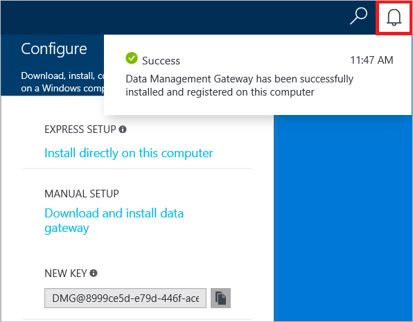

<properties 
    pageTitle="Spostare i dati - Gateway di gestione dati | Microsoft Azure"
    description="Configurare un gateway di dati per spostare i dati tra locale e nel cloud. Usare Gateway di gestione dati di Azure Data Factory per spostare i dati." 
    keywords="gateway di dati, integrazione dei dati, spostare i dati, le credenziali di gateway"
    services="data-factory" 
    documentationCenter="" 
    authors="linda33wj" 
    manager="jhubbard" 
    editor="monicar"/>

<tags 
    ms.service="data-factory" 
    ms.workload="data-services" 
    ms.tgt_pltfrm="na" 
    ms.devlang="na" 
    ms.topic="article" 
    ms.date="10/18/2016" 
    ms.author="jingwang"/>

# Spostare i dati tra origini locali e cloud con Gateway di gestione dati
In questo articolo viene fornita una panoramica dell'integrazione dei dati tra archivi dati locali e di cloud dati utilizzo di dati. Si basa sul articolo [Le attività di spostamento dei dati](data-factory-data-movement-activities.md) e altri articoli di concetti fondamentali factory dati: [set di dati](data-factory-create-datasets.md) e [pipeline](data-factory-create-pipelines.md). 

## Gateway di gestione dati
È necessario installare il Gateway di gestione di dati nel computer locale che consente di spostare dati da/verso un archivio di dati in locale. Il gateway può essere installato nello stesso computer come archivio dati o in un computer diverso, come il gateway è possibile connettersi all'archivio dati. 

> [AZURE.IMPORTANT] Vedere l'articolo di [Gateway di gestione dati](data-factory-data-management-gateway.md) per i dettagli di Gateway di gestione dati.   

La procedura riportata di seguito viene illustrato come creare una factory di dati con una pipeline che consente di spostare dati da un database di **SQL Server** locale a un'archiviazione blob Azure. Come parte della procedura dettagliata, installare e configurare il Gateway di gestione dati nel computer in uso. 

## Procedura dettagliata: copiare i dati locali al cloud
  
## Creare factory di dati
In questo passaggio, utilizzare il portale di Azure per creare un'istanza di Azure Data Factory denominata **ADFTutorialOnPremDF**. 

1.  Accedere al [portale di Azure](https://portal.azure.com). 
2.  Fare clic su **+ Nuovo**, fare clic su **Intelligence + analitica**e fare clic su **Factory dati**.

      
2. Per il nome e il **Nuovo factory di dati** , utilizzare **ADFTutorialOnPremDF** .

    

    > [AZURE.IMPORTANT] 
    > Il nome della factory dati Azure deve essere univoco globale. Se viene visualizzato l'errore: **dati factory nome "ADFTutorialOnPremDF" è non disponibile**, modificare il nome di dati (ad esempio yournameADFTutorialOnPremDF) e provare a creare di nuovo. Utilizzare questo nome al posto di ADFTutorialOnPremDF durante l'esecuzione di passaggi rimanenti in questa esercitazione.
    > 
    > Il nome del produttore dati può essere registrato come un nome **DNS** in futuro e quindi diventano visibile pubblicamente.
3. Selezionare l' **abbonamento Azure** in cui si desidera factory dati da creare. 
4.  Selezionare esistente **gruppo di risorse** o creare un gruppo di risorse. Creare un gruppo di risorse per l'esercitazione: **ADFTutorialResourceGroup**. 
5.  Fare clic su **Crea** in e il **Nuovo factory di dati** .

    > [AZURE.IMPORTANT] Per creare le istanze di Factory dati, è necessario essere un membro del ruolo di [Collaboratore Factory dati](../active-directory/role-based-access-built-in-roles.md/#data-factory-contributor) livello di gruppo abbonamento/risorsa. 
11. Una volta completata la creazione, viene visualizzato e il **Produttore di dati** , come illustrato nell'immagine seguente:

    

## Creare gateway
5. In e il **Produttore di dati** , fare clic su **autore e distribuire** riquadro per avviare l' **Editor** per la factory di dati.

     
6.  Nell'Editor Factory di dati fare clic su **... Ulteriori** sulla barra degli strumenti e quindi fare clic su **Nuovo gateway di dati**. In alternativa, è possibile rapida **Gateway di dati** nella visualizzazione struttura e fare clic su **Nuovo gateway di dati**. 

    
2. In e il **Crea** , immettere **adftutorialgateway** per il **nome**e fare clic su **OK**.    

    
3. In e il **Configura** , fare clic su **installazione direttamente nel computer in uso**. Questa azione di download del pacchetto di installazione per il gateway, installa, configura e registra il gateway nel computer.  

    > [AZURE.NOTE] 
    > Usare un browser compatibile Microsoft ClickOnce o Internet Explorer.
    > 
    > Se si utilizza Chrome, passare all' [archivio web Chrome](https://chrome.google.com/webstore/), eseguire una ricerca con parole chiave "ClickOnce", scegliere una delle estensioni ClickOnce e installarlo. 
    >  
    > Eseguire la stessa operazione per Firefox (Installa componente aggiuntivo). Fare clic su **Apri Menu** sulla barra degli strumenti (**tre linee orizzontali** nell'angolo superiore destro), fare clic su **componenti aggiuntivi**, eseguire una ricerca con parole chiave "ClickOnce", scegliere una delle estensioni ClickOnce e installarlo.    

    

    In questo modo è il modo più semplice (un solo clic) per scaricare, installare, configurare e registrare il gateway in un unico passaggio. È possibile visualizzare che l'applicazione di **Gestione di configurazione di Gateway di gestione di dati di Microsoft** è installata nel computer in uso. È inoltre disponibile eseguibile **ConfigManager.exe** nella cartella: **C:\Programmi\Microsoft c:\Programmi\Microsoft dati gestione Gateway\2.0\Shared**.

    È anche possibile scaricare e installare manualmente gateway utilizzando i collegamenti in questo blade e registra il codice riportato nella casella di testo **Nuova chiave** .
    
    Vedere l'articolo di [Gateway di gestione dati](data-factory-data-management-gateway.md) per tutti i dettagli del gateway.

    >[AZURE.NOTE] È necessario essere un amministratore del computer locale per installare e configurare il Gateway di gestione dati correttamente. È possibile aggiungere altri utenti al gruppo di Windows locale **Agli utenti di Gateway di gestione dati** . I membri di questo gruppo possono utilizzare lo strumento di gestione di configurazione di Gateway di gestione dati per configurare il gateway. 

5. Attendere alcuni minuti o attendere finché non viene visualizzato il messaggio di notifica seguenti:

     
6. Avviare **Gestione configurazione di Gateway di gestione di dati** nel computer in uso. Nella finestra di **ricerca** , digitare **Il Gateway di gestione di dati** per accedere a questa utilità. È inoltre disponibile eseguibile **ConfigManager.exe** nella cartella: **C:\Programmi\Microsoft c:\Programmi\Microsoft dati gestione Gateway\2.0\Shared** 

    
6. Verificare che sia visualizzata `adftutorialgateway is connected to the cloud service` messaggio. Sulla barra nella parte inferiore di stato Visualizza **connesso al servizio cloud** insieme a un **segno di spunta verde**.

    Nella scheda **Home** , è anche possibile eseguire le operazioni seguenti: 
    - **Registrare** un gateway con una chiave dal portale di Azure tramite il pulsante registro. 
    - **Arrestare** il servizio di Host Gateway di gestione dei dati in esecuzione nel computer gateway. 
    - **Pianificare gli aggiornamenti** da installare in un momento specifico del giorno. 
    - Visualizzazione quando il gateway è stato **aggiornato**.
    - Specificare l'ora in cui è possibile installare un aggiornamento al gateway. 

8. Passare alla scheda **Impostazioni** . Il certificato specificato nella sezione **certificato** viene utilizzato per le credenziali per l'archivio di dati in locale che specificano nel portale di crittografia/decrittografia. (facoltativo) Fare clic su **Modifica** per utilizzare invece il proprio certificato. Per impostazione predefinita, il gateway utilizza il certificato che viene generato automaticamente dal servizio dati Factory.

    

    È anche possibile eseguire le azioni seguenti nella scheda **Impostazioni** : 
    - Visualizzare o esportare il certificato utilizzato per il gateway.
    - Modificare l'endpoint HTTPS utilizzato per il gateway.    
    - Impostare un proxy HTTP da utilizzare per il gateway.   
9. (facoltativo) Passare alla scheda **diagnostica** , selezionare l'opzione **Attiva la registrazione dettagliata** se si desidera attivare la registrazione dettagliata che è possibile utilizzare per la risoluzione dei problemi relativi a gateway. Le informazioni di registrazione disponibili nel **Visualizzatore eventi** in **registri applicazioni e servizi** -> nodo**Gateway di gestione dati** . 

    

    È anche possibile eseguire le azioni seguenti nella scheda **diagnostica** : 
    
    - Usare sezione **Test connessione** a un'origine dati locale mediante il gateway.
    - Fare clic su **Visualizza i registri** per visualizzare il log di Gateway di gestione dati in una finestra del Visualizzatore eventi. 
    - Fare clic su **Invia registri** per caricare un file zip con i log di ultimi sette giorni a Microsoft per facilitare la risoluzione dei problemi dei problemi. 
10. Nella scheda **diagnostica** , nella sezione **Test connessione** selezionare **SQL Server** per il tipo di archivio di dati, immettere il nome del server di database, nome del database, specificare il tipo di autenticazione, immettere nome utente e password e fare clic su **Test** per verificare se il gateway è possibile connettersi al database. 
11. Passare al browser e nel **portale di Azure**, fare clic su **OK** e il **Configura** e quindi al e **Nuovo gateway di dati** .
6. Verrà visualizzato **adftutorialgateway** in **Gateway di dati** nella visualizzazione albero a sinistra.  Se si fa clic su esso, è necessario verificare JSON associato. 
    

## Creazione di servizi collegati 
In questo passaggio si crea due servizi collegati: **AzureStorageLinkedService** e **SqlServerLinkedService**. **SqlServerLinkedService** collega un database di SQL Server locale e i collegamenti di servizi collegati **AzureStorageLinkedService** archiviazione blob Azure su factory dati. Creare una pipeline più avanti in questa procedura dettagliata che consente di copiare dati dal database di SQL Server locale all'archivio blob Azure. 

#### Aggiungere un servizio collegato a un database di SQL Server locale
1.  Nell' **Editor di Factory dei dati**, fare clic su **nuovo archivio dati** sulla barra degli strumenti e selezionare **SQL Server**. 

     
3.  Nell' **editor JSON** a destra, eseguire la procedura seguente: 
    1. Per **gatewayName**, specificare **adftutorialgateway**. 
    2. In **connectionString**, eseguire la procedura seguente: 
        1. Per **nomeserver**, immettere il nome del server che ospita i database di SQL Server.
        2. Per **NomeDatabase**, immettere il nome del database.
        3. Fare clic su pulsante **Crittografa** sulla barra degli strumenti. Si scarica e si avvia l'applicazione di gestione credenziali.
        
            
        5. Nella finestra di dialogo **Impostazione credenziali** specificare il tipo di autenticazione, nome utente e password e fare clic su **OK**. Se la connessione ha esito positivo, le credenziali crittografate vengono memorizzate nel JSON e chiude la finestra di dialogo. 
        6. Chiudere la scheda browser vuoto che ha avviato la finestra di dialogo quando non viene chiusa automaticamente e tornare alla scheda con il portale di Azure. 
  
            Nel computer gateway queste credenziali vengono **crittografate** utilizzando un certificato a cui appartiene il servizio dati Factory. Se si desidera utilizzare il certificato associato a Gateway di gestione dati se, tuttavia, vedere [impostare le credenziali in modo sicuro](#set-credentials-and-security).    
    1.  Fare clic su **Distribuisci** della barra dei comandi per distribuire il servizio SQL Server collegato. Verrà visualizzato il servizio collegato in visualizzazione struttura. 
        
          

#### Aggiungere un servizio collegato per un account di archiviazione Azure
 
1. Nell' **Editor di Factory dei dati**, fare clic su **nuovo archivio dati** sulla barra dei comandi e fare clic su **archiviazione Azure**.
2. Immettere il nome del proprio account Azure dello spazio di archiviazione per il **nome dell'Account**.
3. Immettere il codice per il proprio account Azure dello spazio di archiviazione per la **chiave Account**.
4. Fare clic su **Distribuisci** per distribuire **AzureStorageLinkedService**.
   
 
## Creare set di dati
In questo passaggio si creare input e output set di dati che rappresentano i dati di input e di output per l'operazione di copia (database di SQL Server locale = > archiviazione blob Azure). Prima di creare set di dati, eseguire la procedura seguente (procedura dettagliata segue l'elenco):

- Creare una tabella denominata **emp** nel Database di SQL Server aggiunto come servizio collegato al produttore dati e inserire un paio di voci di esempio nella tabella.
- Creare un contenitore di blob denominato **adftutorial** nell'account di archiviazione blob Azure che aggiunto come servizio collegato al produttore dati.

### Preparare l'ambiente locale SQL Server per l'esercitazione

1. Nel database specificato per SQL Server locale servizi collegati (**SqlServerLinkedService**), utilizzare il seguente script SQL per creare la tabella **emp** nel database.

        CREATE TABLE dbo.emp
        (
            ID int IDENTITY(1,1) NOT NULL, 
            FirstName varchar(50),
            LastName varchar(50),
            CONSTRAINT PK_emp PRIMARY KEY (ID)
        )
        GO 
2. Inserire alcuni esempi nella tabella: 

        INSERT INTO emp VALUES ('John', 'Doe')
        INSERT INTO emp VALUES ('Jane', 'Doe')

### Creare set di dati input

1. **Dati Factory Editor**fare clic su **... Ulteriori**, fare clic su **nuovo set di dati** nella barra dei comandi e fare clic su **tabella di SQL Server**. 
2.  Sostituire JSON nel riquadro destro, con il testo seguente:
        
            {       
                "name": "EmpOnPremSQLTable",
                "properties": {
                    "type": "SqlServerTable",
                    "linkedServiceName": "SqlServerLinkedService",
                    "typeProperties": {
                        "tableName": "emp"
                    },
                    "external": true,
                    "availability": {
                        "frequency": "Hour",
                        "interval": 1
                    },
                    "policy": {
                        "externalData": {
                            "retryInterval": "00:01:00",
                            "retryTimeout": "00:10:00",
                            "maximumRetry": 3
                        }
                    }
                }
            }    

    Noti quanto segue: 

    - **tipo** è impostato su **SqlServerTable**.
    - **tableName** è impostato su **emp**.
    - **linkedServiceName** è impostato su **SqlServerLinkedService** (creati questo servizio collegato in precedenza in questa procedura dettagliata.).
    - Per un set di dati input che non ha generato da un altro pipeline di Azure Data Factory, è necessario impostare **esterni** su **true**. Indica che i dati di input viene prodotta esterno al servizio di Azure Data Factory. È possibile specificare criteri eventuali dati esterni mediante l'elemento **externalData** nella sezione **criteri** .    

    Per ulteriori informazioni sulle proprietà JSON, vedere [spostare dati da/verso SQL Server](data-factory-sqlserver-connector.md) .
2. Fare clic su **Distribuisci** della barra dei comandi per distribuire il set di dati.  

### Creare set di dati di output

1.  Nell' **Editor di Factory dei dati**, fare clic su **nuovo set di dati** nella barra dei comandi e fare clic su **archiviazione Blob Azure**.
2.  Sostituire JSON nel riquadro destro, con il testo seguente: 

            {
                "name": "OutputBlobTable",
                "properties": {
                    "type": "AzureBlob",
                    "linkedServiceName": "AzureStorageLinkedService",
                    "typeProperties": {
                        "folderPath": "adftutorial/outfromonpremdf",
                        "format": {
                            "type": "TextFormat",
                            "columnDelimiter": ","
                        }
                    },
                    "availability": {
                        "frequency": "Hour",
                        "interval": 1
                    }
                }
            }
  
    Noti quanto segue: 
    
    - **tipo** è impostato su **AzureBlob**.
    - **linkedServiceName** è impostato su **AzureStorageLinkedService** (già create questo servizio collegato nel passaggio 2).
    - **folderPath** è impostato su **adftutorial/outfromonpremdf** outfromonpremdf è possibile trovare la cartella nel contenitore adftutorial. Creare il contenitore **adftutorial** se non esiste già. 
    - La **disponibilità** è impostato su **ogni ora** (**frequenza** impostata su **ora** e **intervallo** impostato su **1**).  Il servizio Factory dati genera una sezione di dati di output ogni ora nella tabella **emp** nel Database di SQL Azure. 

    Se non si specifica un **nome di file** per una **tabella di output**, i file generati in **folderPath** sono denominati nel formato seguente: dati. <Guid>txt (ad esempio:: Data.0a405f8a-93ff-4c6f-b3be-f69616f1df7a.txt.).

    Per impostare **folderPath** e **nome del file** in modo dinamico in base alla data di **SliceStart** , utilizzare la proprietà partitionedBy. Nell'esempio seguente folderPath utilizza anno, mese e giorno da SliceStart (ora di inizio della sezione in fase di elaborazione) e nomefile utilizza ora dal SliceStart. Ad esempio, se in corso una sezione di produzione per 2014-10-20T08:00:00, nomecartella è impostata su wikidatagateway/wikisampledataout/2014/10/20 e il nome del file è impostato su 08.csv. 

        "folderPath": "wikidatagateway/wikisampledataout/{Year}/{Month}/{Day}",
        "fileName": "{Hour}.csv",
        "partitionedBy": 
        [
            { "name": "Year", "value": { "type": "DateTime", "date": "SliceStart", "format": "yyyy" } },
            { "name": "Month", "value": { "type": "DateTime", "date": "SliceStart", "format": "MM" } }, 
            { "name": "Day", "value": { "type": "DateTime", "date": "SliceStart", "format": "dd" } }, 
            { "name": "Hour", "value": { "type": "DateTime", "date": "SliceStart", "format": "hh" } } 
        ],

 
    Per ulteriori informazioni sulle proprietà JSON, vedere [spostare dati da/verso archiviazione Blob Azure](data-factory-azure-blob-connector.md) .
2.  Fare clic su **Distribuisci** della barra dei comandi per distribuire il set di dati. Verificare che sia visualizzata entrambi i set di dati nella visualizzazione struttura.  

## Creare pipeline
In questo passaggio si crea una **pipeline** con un' **Attività di copia** che utilizza **EmpOnPremSQLTable** come input e **OutputBlobTable** come output.

1.  Nell'Editor Factory di dati fare clic su **... Ulteriori**e fare clic su **nuova pipeline**. 
2.  Sostituire JSON nel riquadro destro, con il testo seguente: 
    
            {
                "name": "ADFTutorialPipelineOnPrem",
                "properties": {
                "description": "This pipeline has one Copy activity that copies data from an on-prem SQL to Azure blob",
                "activities": [
                {
                    "name": "CopyFromSQLtoBlob",
                    "description": "Copy data from on-prem SQL server to blob",
                    "type": "Copy",
                    "inputs": [
                    {
                        "name": "EmpOnPremSQLTable"
                    }
                    ],
                    "outputs": [
                    {
                        "name": "OutputBlobTable"
                      }
                    ],
                    "typeProperties": {
                      "source": {
                        "type": "SqlSource",
                        "sqlReaderQuery": "select * from emp"
                      },
                      "sink": {
                        "type": "BlobSink"
                      }
                    },
                    "Policy": {
                      "concurrency": 1,
                      "executionPriorityOrder": "NewestFirst",
                      "style": "StartOfInterval",
                      "retry": 0,
                      "timeout": "01:00:00"
                    }
                  }
                ],
                "start": "2016-07-05T00:00:00Z",
                "end": "2016-07-06T00:00:00Z",
                "isPaused": false
              }
            }

    > [AZURE.IMPORTANT]
    > Sostituire il valore della proprietà **start** con il valore di giorno e di **Fine** corrente con il giorno successivo.

    Noti quanto segue:
 
    - Nella sezione attività solo attività è il cui **tipo** sia impostata su **Copia**.
    - **Input** per l'attività è impostata su **EmpOnPremSQLTable** e **output** per l'attività è impostato su **OutputBlobTable**.
    - Nella sezione **typeProperties** **SqlSource** viene specificato come **tipo di origine** e **BlobSink **viene specificato come **tipo di sink**.
    - Query SQL `select * from emp` specificate per la proprietà **sqlReaderQuery** di **SqlSource**.

     Entrambe inizio e fine date e ore deve essere in [formato ISO](http://en.wikipedia.org/wiki/ISO_8601). Ad esempio: 2014-10-14T16:32:41Z. L'ora di **Fine** è facoltativo, ma serve in questa esercitazione. 
    
    Se non si specifica valore per la proprietà di **Fine** , viene calcolato come "**inizio + 48 ore**". Per eseguire la pipeline di tempo indefinito, specificare **9/9/9999** come valore per la proprietà di **Fine** . 
    
    Si definisce l'intervallo di tempo in cui le sezioni di dati di elaborazione basata sulle proprietà **disponibilità** definite per ogni set di dati di Azure Data Factory.
    
    Nell'esempio, esistono 24 sezioni di dati come ogni sezione di dati viene prodotta ogni ora.     
2. Fare clic su **Distribuisci** sulla barra dei comandi per distribuire il set di dati (tabella è un set di dati rettangolare). Verificare che la pipeline viene visualizzata nella visualizzazione struttura nodo **pipeline** .  
5. A questo punto, fare clic su **X** due volte per chiudere le pale per tornare alla e **Produttore di dati** per **ADFTutorialOnPremDF**.

**Congratulazioni!** Creare una factory di dati di Azure, servizi collegati, set di dati e una pipeline e programmata la pipeline di completata.

#### Visualizzare la factory di dati in una visualizzazione Diagramma 
1. Nel **portale di Azure**, fare clic su riquadro **diagramma** nella home page del produttore di dati **ADFTutorialOnPremDF** . :

    

2. Verrà visualizzato il diagramma come nella figura seguente:

    

    È possibile applicare lo zoom avanti, zoom indietro, al 100%, zoom per adattare automaticamente posizionare tubazioni e set di dati e visualizzare informazioni sulla derivazione del (evidenzia gli elementi padre e downstream degli elementi selezionati).  Fare doppio clic su un oggetto (set di dati di ingresso/uscita o pipeline) per visualizzare le proprietà. 

## Pipeline di monitor
In questo passaggio, utilizzare il portale di Azure per eseguire il monitoraggio delle attività una factory di dati di Azure. Utilizzare i cmdlet di PowerShell per eseguire il monitoraggio delle tubazioni e set di dati. Per informazioni dettagliate sul monitoraggio, vedere [monitorare e gestire pipeline](data-factory-monitor-manage-pipelines.md).

5. Nel diagramma, fare doppio clic su **EmpOnPremSQLTable**.  

    

6. Si noti che tutti i dati sezioni backup sono nello stato **Pronto** perché la durata della pipeline (ora di inizio all'ora di fine) in passato. È inoltre perché è stato inserito i dati nel database di SQL Server e sono sempre questa impostazione. Verificare che non sezioni vengano visualizzati nella sezione **sezioni del problema** nella parte inferiore. Per visualizzare tutte le sezioni, fare clic su **Visualizzare più** nella parte inferiore dell'elenco di sezioni. 
7. A questo punto, selezionare **OutputBlobTable**e il **set di dati** .

    
9. Fare clic su qualsiasi sezione di dati dall'elenco e dovrebbero essere visualizzati e il **Sezione di dati** . Viene visualizzato l'attività viene eseguita per la sezione. Risulta in genere eseguire una sola attività.  

    

    Se la sezione non è nello stato **Pronto** , è possibile vedere le sezioni padre che non sono pronti e bloccano la sezione corrente dall'esecuzione nell'elenco **padre sezioni non pronti** .

10. Fare clic **esecuzione di attività** dall'elenco nella parte inferiore per visualizzare i **dettagli di esecuzione di attività**.

    

    Si vogliono visualizzare informazioni, ad esempio velocità, durata e il gateway utilizzato per trasferire i dati. 
11. Fare clic sulla **X** per chiudere tutte le pale finché l'utente 
12. Torna indietro a e l'iniziale per **ADFTutorialOnPremDF**.
14. (facoltativo) Fare clic su **pipeline**, fare clic su **ADFTutorialOnPremDF**e il drill-through tabelle di input (**consumato**) o set di dati di output (**prodotti**).
15. Usare strumenti, ad esempio utilizzare strumenti, ad esempio [Esplora risorse di archiviazione](http://storageexplorer.com/) per verificare che venga creato un file/blob per ogni ora.

    

## Passaggi successivi

- Vedere l'articolo di [Gateway di gestione dati](data-factory-data-management-gateway.md) per tutti i dettagli di Gateway di gestione dati.
- Vedere [copiare i dati Blob Azure di SQL Azure](data-factory-copy-data-from-azure-blob-storage-to-sql-database.md) per informazioni su come usare Copia attività per spostare i dati da un archivio di dati di origine in un archivio di dati sink. 
