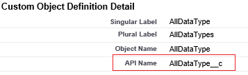

<properties
    pageTitle="Spostare i dati da Salesforce tramite Factory dati | Microsoft Azure"
    description="Informazioni su come spostare i dati da Salesforce utilizzando Azure Data Factory."
    services="data-factory"
    documentationCenter=""
    authors="linda33wj"
    manager="jhubbard"
    editor="monicar"/>

<tags
    ms.service="data-factory"
    ms.workload="data-services"
    ms.tgt_pltfrm="na"
    ms.devlang="na"
    ms.topic="article"
    ms.date="10/25/2016"
    ms.author="jingwang"/>

# Spostare i dati da Salesforce tramite Factory di dati di Azure
Questo articolo illustra come è possibile utilizzare attività copia di una factory di dati di Azure per copiare i dati da Salesforce nell'archivio di dati è elencato nella colonna Sink descritti nella tabella [origini e sink supportati](data-factory-data-movement-activities.md#supported-data-stores) . In questo articolo si basa su articolo [le attività di spostamento dei dati](data-factory-data-movement-activities.md) , che viene fornita una panoramica generale di spostamento con attività di copia e le combinazioni di archivio di dati supportati.

Azure Data Factory supporta al momento solo spostamento di dati da Salesforce a [stores]((data-factory-data-movement-activities.md#supported-data-stores) dati sink supportati ma non supporta spostare dati da altri dati vengono archiviati a Salesforce.

## Prerequisiti
- È necessario utilizzare uno dei seguenti edizioni di Salesforce: Developer Edition, Professional Edition, Enterprise Edition o illimitato Edition.
- Autorizzazione dell'API deve essere abilitata. Vedere [come abilitare l'accesso API in Salesforce dal set di autorizzazioni?](https://www.data2crm.com/migration/faqs/enable-api-access-salesforce-permission-set/)
- Per copiare i dati da Salesforce archivi di dati in locale, è necessario disporre almeno 2.0 Gateway di gestione dati installate nel proprio ambiente locale.

## Limiti di richiesta di Salesforce
Salesforce sono previsti limiti per le richieste API del totale e richieste simultanee API. Vedere la sezione "API richiedere limiti" nell'articolo [Salesforce sviluppo limiti](http://resources.docs.salesforce.com/200/20/en-us/sfdc/pdf/salesforce_app_limits_cheatsheet.pdf) per informazioni dettagliate. Nota Se il numero di richieste simultanee supera il limite, la limitazione si verifica il giorno e si vedrà casuali errori. Se il numero totale di richieste supera il limite, l'account di Salesforce verrà bloccata per 24 ore. è anche possibile ricevere l'errore "REQUEST_LIMIT_EXCEEDED" in entrambi gli scenari.

## Copia guidata dati
Il modo più semplice per creare una pipeline che consente di copiare dati da Salesforce uno degli archivi di dati supportati sink consiste nell'utilizzare la procedura guidata copiare i dati. Vedere [Esercitazione: creare una pipeline utilizzando Copia guidata](data-factory-copy-data-wizard-tutorial.md) per una rapida procedura dettagliata sulla creazione di una pipeline utilizzando la creazione guidata copiare i dati.

Nell'esempio seguente vengono fornite le definizioni di JSON di esempio che è possibile utilizzare per creare una pipeline tramite il [portale di Azure](data-factory-copy-activity-tutorial-using-azure-portal.md), [Visual Studio](data-factory-copy-activity-tutorial-using-visual-studio.md)o [Azure PowerShell](data-factory-copy-activity-tutorial-using-powershell.md). Verranno visualizzati come copiare i dati da Salesforce all'archivio Blob Azure. Tuttavia, dati possono essere copiati in uno del sink indicate [di seguito](data-factory-data-movement-activities.md#supported-data-stores) utilizzando l'attività di copia in Azure Data Factory.   

## Esempio: Copiare i dati da Salesforce a un archivio blob Azure
In questo esempio dati copiati da Salesforce blob Azure ogni ora. Le proprietà JSON utilizzati negli esempi seguenti sono descritti nelle sezioni dopo gli esempi. È possibile copiare i dati direttamente in uno qualsiasi dei sink sono elencati nell'articolo [le attività di spostamento dei dati](data-factory-data-movement-activities.md#supported-data-stores) utilizzando Copia attività in Azure Data Factory.

Ecco le Factory dati tra gli elementi che è necessario creare per implementare lo scenario. Le sezioni che seguono l'elenco forniscono informazioni dettagliate sui passaggi da.

- Un servizio collegato del tipo di [Salesforce](#salesforce-linked-service-properties)
- Un servizio di tipo [AzureStorage](data-factory-azure-blob-connector.md#azure-storage-linked-service-properties) collegato
- Un [set di dati](data-factory-create-datasets.md) di input di tipo [RelationalTable](#salesforce-dataset-properties)
- Un [set di dati](data-factory-create-datasets.md) di output di tipo [AzureBlob](data-factory-azure-blob-connector.md#azure-blob-dataset-type-properties)
- Una [pipeline](data-factory-create-pipelines.md) con attività di copia che utilizza [RelationalSource](#relationalsource-type-properties) e [BlobSink](data-factory-azure-blob-connector.md#azure-blob-copy-activity-type-properties)

**Servizio di Salesforce collegato**

In questo esempio viene utilizzato il servizio di **Salesforce** collegato. Vedere la sezione [Salesforce collegato servizio](#salesforce-linked-service-properties) per le proprietà supportate da questo servizio collegato.  Per istruzioni su come reimpostare/get il token di sicurezza, vedere [ottenere token di sicurezza](https://help.salesforce.com/apex/HTViewHelpDoc?id=user_security_token.htm) .

    {
        "name": "SalesforceLinkedService",
        "properties":
        {
            "type": "Salesforce",
            "typeProperties":
            {
                "username": "<user name>",
                "password": "<password>",
                "securityToken": "<security token>"
            }
        }
    }

**Servizio di archiviazione collegato di Azure**

    {
      "name": "AzureStorageLinkedService",
      "properties": {
        "type": "AzureStorage",
        "typeProperties": {
          "connectionString": "DefaultEndpointsProtocol=https;AccountName=<accountname>;AccountKey=<accountkey>"
        }
      }
    }

**Set di dati input Salesforce**

    {
        "name": "SalesforceInput",
        "properties": {
            "linkedServiceName": "SalesforceLinkedService",
            "type": "RelationalTable",
            "typeProperties": {
                "tableName": "AllDataType__c"  
            },
            "availability": {
                "frequency": "Hour",
                "interval": 1
            },
            "external": true,
            "policy": {
                "externalData": {
                    "retryInterval": "00:01:00",
                    "retryTimeout": "00:10:00",
                    "maximumRetry": 3
                }
            }
        }
    }

Impostando **esterni** su **true** si informa il servizio Factory dati che il set di dati esterno su factory dati e non viene generato da un'attività nell'ambiente di produzione di dati.

> [AZURE.IMPORTANT] La parte "__c" del nome dell'API è necessario cercare gli oggetti personalizzati.

**Set di dati output blob Azure**

I dati vengono scritti in un nuovo blob ogni ora (frequenza: ora, intervallo: 1).

    {
        "name": "AzureBlobOutput",
        "properties":
        {
            "type": "AzureBlob",
            "linkedServiceName": "AzureStorageLinkedService",
            "typeProperties":
            {
                "folderPath": "adfgetstarted/alltypes_c"
            },
            "availability":
            {
                "frequency": "Hour",
                "interval": 1
            }
        }
    }

**Pipeline con attività di copia**

La pipeline contiene attività Copia, che è configurato per utilizzare l'input sopra e di output set di dati, ed è programmata per l'esecuzione di ogni ora. Pipeline definizione JSON, il tipo di **origine** è impostato su **RelationalSource**e il tipo di **sink** è impostato su **BlobSink**.

Vedere [le proprietà di tipo RelationalSource](#relationalsource-type-properties) per l'elenco delle proprietà supportate dalla RelationalSource.

    {  
        "name":"SamplePipeline",
        "properties":{  
            "start":"2016-06-01T18:00:00",
            "end":"2016-06-01T19:00:00",
            "description":"pipeline with copy activity",
            "activities":[  
            {
                "name": "SalesforceToAzureBlob",
                "description": "Copy from Salesforce to an Azure blob",
                "type": "Copy",
                "inputs": [
                {
                    "name": "SalesforceInput"
                }
                ],
                "outputs": [
                {
                    "name": "AzureBlobOutput"
                }
                ],
                "typeProperties": {
                    "source": {
                        "type": "RelationalSource",
                        "query": "SELECT Id, Col_AutoNumber__c, Col_Checkbox__c, Col_Currency__c, Col_Date__c, Col_DateTime__c, Col_Email__c, Col_Number__c, Col_Percent__c, Col_Phone__c, Col_Picklist__c, Col_Picklist_MultiSelect__c, Col_Text__c, Col_Text_Area__c, Col_Text_AreaLong__c, Col_Text_AreaRich__c, Col_URL__c, Col_Text_Encrypt__c, Col_Lookup__c FROM AllDataType__c"             
                    },
                    "sink": {
                        "type": "BlobSink"
                    }
                },
                "scheduler": {
                    "frequency": "Hour",
                    "interval": 1
                },
                "policy": {
                    "concurrency": 1,
                    "executionPriorityOrder": "OldestFirst",
                    "retry": 0,
                    "timeout": "01:00:00"
                }
            }
            ]
        }
    }

> [AZURE.IMPORTANT] La parte "__c" del nome dell'API è necessario cercare gli oggetti personalizzati.

## Proprietà del servizio di Salesforce collegato

Nella tabella seguente vengono descritti gli elementi JSON specifici per il servizio di Salesforce collegato.

| Proprietà | Descrizione | Obbligatorio |
| -------- | ----------- | -------- |
| tipo | Impostare la proprietà tipo: **Salesforce**. | Sì |
| nome utente |Specificare un nome utente per l'account utente. | Sì |
| password | Specificare una password per l'account utente.  | Sì |
| securityToken | Specificare un token di sicurezza per l'account utente. Per istruzioni su come reimpostare/get un token di sicurezza, vedere [ottenere token di sicurezza](https://help.salesforce.com/apex/HTViewHelpDoc?id=user_security_token.htm) . Per informazioni sui token di sicurezza in generale, vedere [sicurezza e l'API](https://developer.salesforce.com/docs/atlas.en-us.api.meta/api/sforce_api_concepts_security.htm).  | Sì |

## Proprietà set di dati Salesforce

Per un elenco completo delle sezioni e le proprietà disponibili per la definizione di set di dati, vedere l'articolo [Creazione set di dati](data-factory-create-datasets.md) . Le sezioni, ad esempio struttura, disponibilità e criteri di un set di dati JSON sono simili per tutti i tipi di set di dati (SQL Azure, blob Azure, tabelle Azure e così via).

La sezione **typeProperties** è diversa per ogni tipo di set di dati e fornisce informazioni sulla posizione dei dati nell'archivio dati. La sezione typeProperties per un set di dati di tipo **RelationalTable** è le proprietà seguenti:

| Proprietà | Descrizione | Obbligatorio |
| -------- | ----------- | -------- |
| tableName | Nome della tabella in Salesforce. | No (se si specifica una **query** di **RelationalSource** ) |

> [AZURE.IMPORTANT]  La parte "__c" del nome dell'API è necessario cercare gli oggetti personalizzati.

## Proprietà di tipo RelationalSource

Per un elenco completo delle sezioni e le proprietà disponibili per la definizione di attività, vedere l'articolo [pipeline di creazione](data-factory-create-pipelines.md) . Proprietà quali nome, descrizione, input e output tabelle e vari criteri sono disponibili per tutti i tipi di attività.

Le proprietà disponibili nella sezione typeProperties dell'attività, variano a mano, con ogni tipo di attività. Per l'attività di copia, variano in base ai tipi di origini e sink.

Attività di copia, quando l'origine è di tipo **RelationalSource** (che include Salesforce), le proprietà seguenti sono disponibili nella sezione typeProperties:

| Proprietà | Descrizione | Valori consentiti | Obbligatorio |
| -------- | ----------- | -------------- | -------- |
| query | Utilizzare la query personalizzata per leggere i dati. | Una query SQL-92 o [Salesforce oggetto Query Language (SOQL)](https://developer.salesforce.com/docs/atlas.en-us.soql_sosl.meta/soql_sosl/sforce_api_calls_soql.htm) . Ad esempio: `select * from MyTable__c`. | N (se è specificato **tableName** del **set di dati** ) |

> [AZURE.IMPORTANT] La parte "__c" del nome dell'API è necessario cercare gli oggetti personalizzati.

## Suggerimenti relativi alle query

### Recupero di dati mediante where clausola nella colonna DateTime
Per specificare la query SOQL o SQL, prestare attenzione a differenza di formato DateTime. Per esempio:

- **Esempio SOQL**: $$Text.Format (' selezionare Id, nome, BillingCity dall'Account in cui LastModifiedDate > = {0:yyyy-MM-ddTHH:mm:ssZ} e LastModifiedDate < {1:yyyy-MM-ddTHH:mm:ssZ}', WindowStart, WindowEnd)
- **Esempio SQL**: $$Text.Format (' selezionare * dall'Account in cui LastModifiedDate > = {{ts\'{0:yyyy-MM-dd hh}\'}} LastModifiedDate e < {{ts\'{1:yyyy-MM-dd hh}\'}}', WindowStart, WindowEnd)'.

### Recuperare dati da Report di Salesforce
È possibile recuperare dati dai report di Salesforce specificando query come `{call "<report name>"}`, ad esempio `"query": "{call \"TestReport\"}"`.

### Recupero di record eliminati dal Cestino Salesforce
Per eseguire una query i contorni record eliminati dal Cestino Salesforce, è possibile specificare **"IsDeleted = 1"** nella query. Per esempio 

- Per eseguire una query solo i record eliminati, specificare "selezionare *MyTable__c * *nel punto in cui IsDeleted = 1**"
- Per eseguire una query tutti i record compresi esistenti ed eliminato, specificare "selezionare *MyTable__c * *nel punto in cui IsDeleted = 0 o IsDeleted = 1**"

[AZURE.INCLUDE [data-factory-structure-for-rectangualr-datasets](../../includes/data-factory-structure-for-rectangualr-datasets.md)]

### Mapping dei tipi di Salesforce
Tipo di Salesforce | . Tipo di rete
--------------- | ---------------
Numerazione automatica | Stringa
Casella di controllo | Valore booleano
Valuta | Effettuare un doppio
Data | DateTime
Data/ora | DateTime
Posta elettronica | Stringa
ID | Stringa
Relazione di ricerca | Stringa
Elenco a discesa Seleziona multipla | Stringa
Numero | Effettuare un doppio
Percentuale | Effettuare un doppio
Telefono | Stringa
Elenco a discesa | Stringa
Testo | Stringa
Area di testo | Stringa
Area di testo (Long) | Stringa
Area di testo (RTF) | Stringa
Testo (crittografato) | Stringa
URL | Stringa

[AZURE.INCLUDE [data-factory-column-mapping](../../includes/data-factory-column-mapping.md)]
[AZURE.INCLUDE [data-factory-structure-for-rectangualr-datasets](../../includes/data-factory-structure-for-rectangualr-datasets.md)]

## L'ottimizzazione delle prestazioni  
Visualizzare le [attività Copia manuale sulle prestazioni e ottimizzazione](data-factory-copy-activity-performance.md) per informazioni sui fattori che impatto sulle prestazioni di spostamento dei dati (copia attività) in diversi modi per ottimizzare la e Azure Data Factory.
